# ML & Deep Learning Foundations - Interview Questions

55 questions: 15 basic, 23 intermediate, 17 advanced.

> **On the diagrams: drawing is optional.** Some answers include a small sketch you could
> reproduce on a whiteboard or in a shared doc. You never have to draw anything to score well,
> and a clear spoken answer stands on its own. But in architecture, pipeline, and system design
> questions, sketching while you talk keeps the interviewer with you and shows you can structure
> a problem. Treat these as good to have, not as homework.

## Basic

### 1. Explain the bias-variance tradeoff. How do you tell which one is hurting your model?

<details><summary><b>Answer</b></summary>

Expected test error decomposes into three parts: **bias²** (error from a model too simple to represent the true function), **variance** (error from sensitivity to the particular training sample - fitting noise), and irreducible noise. A linear model on a nonlinear problem has high bias; a deep net trained on 500 examples has high variance.

You diagnose it from the **train/val gap**, not from theory:

- High train error ≈ high val error → high bias (underfitting). Fixes: bigger/richer model, more features, train longer, reduce regularization.
- Low train error, much higher val error → high variance (overfitting). Fixes: more data, regularization (weight decay, dropout, early stopping), augmentation, smaller model as a last resort.

Learning curves sharpen the diagnosis: if val error is still falling as you add data, more data helps (variance problem); if train and val curves have plateaued together at a bad level, more data won't help (bias problem).

A strong candidate adds the modern caveat: the classical U-shaped "more capacity → more overfitting" curve breaks down for heavily overparameterized networks. **Double descent** (Belkin et al.; Nakkiran et al.) shows test error can *decrease again* past the interpolation threshold - which is consistent with the empirical reality that scaling up transformers improves generalization. So "your model is too big" is rarely the right first hypothesis in deep learning; data quality, leakage, and training recipe usually matter more.

**Worth sketching.** It turns the tradeoff into a diagnostic procedure, which is what the interviewer is actually asking for.

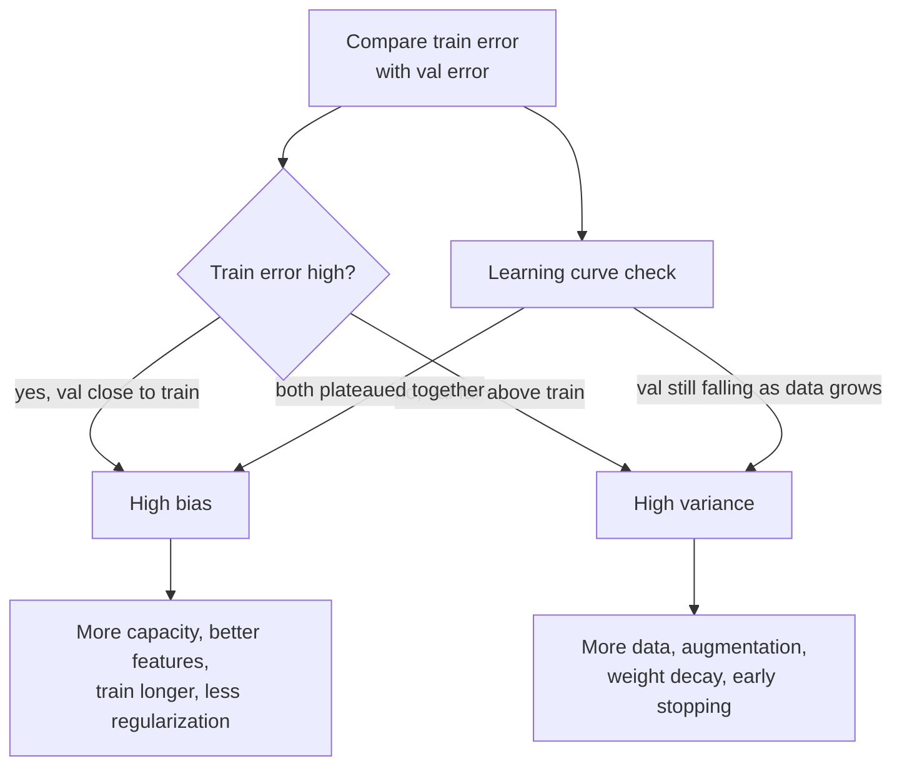

**Follow-ups:** Your val loss is much lower than train loss - what could cause that? (Dropout active only at train time, augmentation on train only, easier val distribution.) How does regularization move you along the tradeoff? Where does double descent leave the classical picture?

</details>

### 2. How do you detect overfitting and underfitting in practice, and what do you do about each?

<details><summary><b>Answer</b></summary>

Watch train and validation loss over training. **Underfitting**: both losses are high and close together, or train loss is still steadily decreasing when you stop - the model hasn't extracted the available signal. **Overfitting**: train loss keeps falling while val loss plateaus and then rises - the model is memorizing.

For underfitting: increase capacity (width/depth/params), improve features or input representation, train longer, raise the learning rate if optimization is stalling, reduce regularization strength.

For overfitting, in rough order of preference:
1. **More or better data** - almost always the highest-leverage fix.
2. **Data augmentation** - cheap synthetic diversity.
3. **Regularization** - weight decay, dropout, label smoothing.
4. **Early stopping** - checkpoint on val loss, keep the best.
5. Reduce model size - usually the last resort in deep learning.

Karpathy's training recipe is the practical framing interviewers like: first *deliberately overfit* a small batch to near-zero loss to prove the model and pipeline can learn at all, then regularize back toward generalization. If you can't overfit 100 examples, you have a bug, not a regularization problem.

Two traps worth naming: (1) a val loss that's suspiciously *better* than expected often means leakage, not brilliance; (2) in LLM fine-tuning, "overfitting" often shows up as behavioural regressions (loss on the SFT set drops while general capability degrades - catastrophic forgetting), so you monitor held-out capability evals, not just the fine-tuning loss.

**Worth sketching.** Drawing the gate before the regularization branch shows you separate bugs from generalization problems.

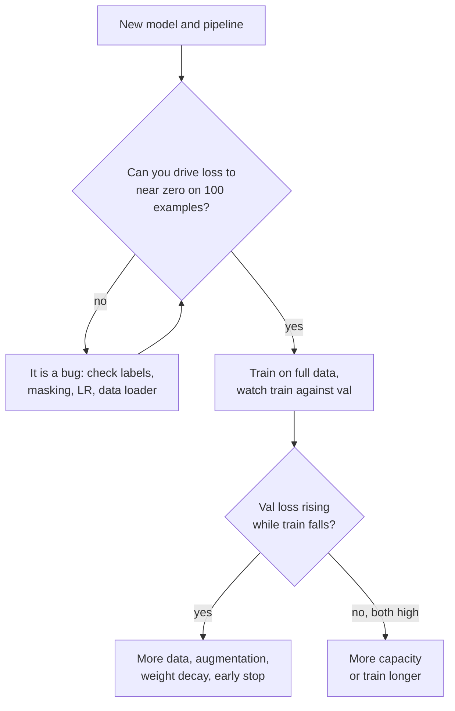

**Follow-ups:** Why start by overfitting a single batch? Your SFT loss is decreasing nicely but users say the model got worse - what happened? When would you accept some overfitting deliberately?

</details>

### 3. Compare L1 and L2 regularization. Why does L1 produce sparse weights?

<details><summary><b>Answer</b></summary>

Both add a penalty on weight magnitude to the loss. **L2** adds λ‖w‖², shrinking all weights proportionally toward zero but rarely *to* zero. **L1** adds λ‖w‖₁ and drives many weights exactly to zero, performing implicit feature selection.

Why sparsity: the L1 penalty's gradient is a constant ±λ regardless of the weight's size, so it keeps pushing small weights all the way to zero, where the subgradient lets them stay; L2's pull is proportional to w, so it weakens as weights shrink and never quite finishes the job. Geometrically, the L1 ball has corners on the axes, and the loss contour typically first touches the constraint region at a corner - where some coordinates are exactly zero.

The Bayesian view is a good differentiator: L2 = MAP estimation with a **Gaussian prior** on weights; L1 = MAP with a **Laplace prior** (sharper peak at zero, heavier tails).

In practice: L1 matters for linear models and feature selection (lasso); deep learning almost exclusively uses L2-style **weight decay**. One subtlety that sets up a later question: with adaptive optimizers like Adam, adding L2 to the loss is *not* equivalent to weight decay - the penalty gets rescaled by the per-parameter adaptive term. That's exactly the bug AdamW fixes by decoupling the decay from the gradient update. Also note common practice: no weight decay on biases or LayerNorm gains, since they're low-dimensional and decaying them just distorts activations.

**Follow-ups:** What's elastic net and when would you use it? Why is L2-in-the-loss different from weight decay under Adam? Why exclude LayerNorm parameters from weight decay?

</details>

### 4. How does dropout work - and what changes between training and inference?

<details><summary><b>Answer</b></summary>

During training, dropout independently zeroes each activation with probability p (commonly 0.1-0.5), forcing the network not to rely on any single unit and breaking co-adaptation. It's often described as training an implicit ensemble of exponentially many thinned subnetworks that share weights.

The train/inference asymmetry is the part interviewers actually probe. With **inverted dropout** (what every modern framework implements), surviving activations are scaled by 1/(1−p) *at training time*, so the expected activation magnitude matches between train and inference - at inference, dropout is simply disabled and no rescaling is needed. The classic bug: forgetting `model.eval()` in PyTorch, so dropout stays active in production and predictions are noisy and degraded. (The same call also switches BatchNorm to running statistics - two bugs for the price of one.)

```python
mask = (torch.rand_like(x) > p).float()
x = x * mask / (1 - p)   # inverted dropout: rescale at train time
```

Where it's used today: the original Transformer applied dropout to each sub-layer's output before the residual add and to the embedding sums (p=0.1); standard implementations also drop attention weights. But large-scale LLM *pretraining* typically uses dropout of 0 - with a massive, single-epoch data stream there's little memorization pressure, and dropout just wastes capacity. It reappears in fine-tuning, where datasets are small: LoRA setups commonly apply dropout ~0.05-0.1 to the adapter inputs.

Variants worth naming if asked: DropPath/stochastic depth (drop whole residual branches, common in vision transformers) and Monte Carlo dropout (keep dropout on at inference and sample repeatedly for a crude uncertainty estimate).

**Follow-ups:** Why do large pretraining runs set dropout to 0? What does `model.eval()` change besides dropout? How would you use MC dropout to get uncertainty estimates?

</details>

### 5. Walk me through train/validation/test splits. When do you use cross-validation, and when is it a bad idea?

<details><summary><b>Answer</b></summary>

Three sets, three jobs: **train** fits parameters, **validation** drives all the choices you make between runs (hyperparameters, architecture, checkpoint selection, early stopping), and **test** estimates generalization *once*, at the end. Every decision you make while looking at a set "spends" it - tune against the test set enough times and it silently becomes a second validation set, and your reported number is optimistic.

**k-fold cross-validation** (typically k=5 or 10) rotates the validation fold and averages, giving a lower-variance estimate when data is scarce - standard for classical ML on thousands of rows. Use **stratified** k-fold for imbalanced classes so each fold preserves prevalence.

When CV is wrong or impractical:
- **Deep learning at scale** - training 5× is prohibitively expensive; a single held-out set is standard, and with millions of examples its variance is fine.
- **Time series** - random folds leak the future into training. Use temporal splits: train on the past, validate on the future (walk-forward validation).
- **Grouped data** - if the same user/patient/document appears in multiple rows, split by group ID, or the model recognises entities instead of generalizing.

For LLM work the same discipline shows up as: held-out eval suites you don't train on, decontamination of pretraining data against benchmarks, and keeping a fresh, never-optimised-against eval for final go/no-go decisions - because prompt tuning against an eval overfits it exactly like hyperparameter tuning overfits a val set.

**Worth sketching.** The loop on the left and the single arrow into test is the whole point: one set is spent repeatedly, the other exactly once.

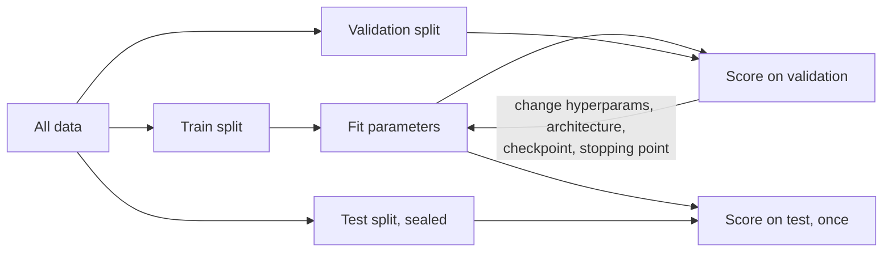

**Follow-ups:** How does the same-user-in-both-splits failure actually look in the metrics? What's nested cross-validation for? How would you decontaminate an LLM eval set?

</details>

### 6. Explain precision, recall, and F1. Give a concrete case where 99% accuracy means the model is useless.

<details><summary><b>Answer</b></summary>

From the confusion matrix: **precision** = TP/(TP+FP) - of everything flagged positive, what fraction was right; **recall** = TP/(TP+FN) - of all true positives, what fraction was found; **F1** = 2PR/(P+R), the harmonic mean, which punishes imbalance between the two (harmonic, so a model with P=1.0, R=0.01 gets F1≈0.02, not 0.5).

Accuracy lies whenever classes are imbalanced. Fraud at 1% prevalence: the constant classifier "not fraud" scores 99% accuracy and catches zero fraud - recall 0. Any headline accuracy must be compared against the majority-class baseline.

Which metric to optimise is a *cost* question, not a math question:
- False positives expensive (spam filter eating real mail, police alerts) → prioritise precision.
- False negatives expensive (cancer screening, fraud, safety filters) → prioritise recall.
- Use **F-beta** to encode the ratio explicitly: F2 weights recall higher, F0.5 weights precision higher.

Also know that precision/recall/F1 are **threshold-dependent** - they describe one operating point on the classifier's score distribution. Reporting "F1 = 0.83" without saying how the threshold was chosen (and on which split) is a red flag; sweep the threshold on validation data and pick the operating point that matches the product's cost structure.

This vocabulary transfers directly to LLM evals: hallucination detection, toxicity filtering, and RAG retrieval are all precision/recall problems (retrieval's recall@k is literally recall), and interviewers expect you to move fluently between the classic and LLM framings.

**Worth sketching.** Drawing which cells feed which metric stops you fumbling the denominators under pressure.

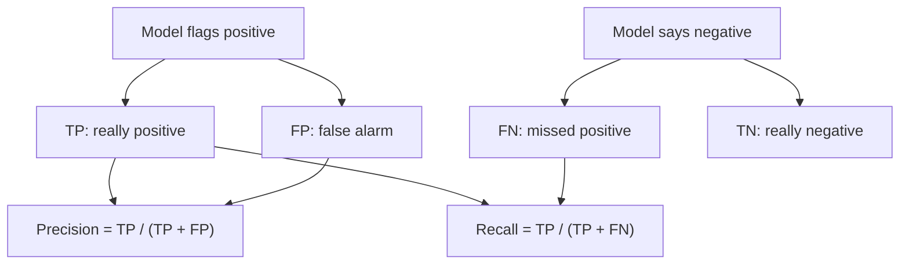

**Follow-ups:** Why the harmonic mean rather than arithmetic? Precision is 0.95 but the product team is unhappy - what would you check? How do micro- vs macro-averaged F1 differ on imbalanced multiclass?

</details>

### 7. What's the difference between parameters and hyperparameters? How do you tune hyperparameters efficiently?

<details><summary><b>Answer</b></summary>

**Parameters** are learned from data by the optimizer - weights, biases, embedding tables. A 7B-parameter LLM has 7 billion of them. **Hyperparameters** are set *before* training and control the learning process: learning rate, batch size, weight decay, dropout rate, architecture choices (depth, width, number of heads), warmup steps, LoRA rank. A quick sanity check interviewers like: a `Linear(in=4096, out=11008)` layer has 4096×11008 weights + 11008 biases ≈ 45M parameters.

Tuning approaches, in order of sophistication:
- **Grid search** - exhaustive over a discrete grid; wasteful in high dimensions.
- **Random search** - Bergstra & Bengio showed it beats grid search because typically only a few hyperparameters matter, and random sampling explores each dimension's marginal far better for the same budget.
- **Bayesian optimization / successive halving** (Optuna, ASHA/Hyperband) - model the response surface or aggressively kill bad trials early; the practical default for expensive training runs.

Practical guidance a senior candidate gives: learning rate is almost always the highest-impact hyperparameter - search it on a **log scale** (e.g., 1e-5 to 1e-3). Tune on a smaller proxy (subset of data, shorter run, smaller model) and transfer; this is the idea μP (μTransfer) makes principled for scaling model width. Don't tune everything at once - fix a sensible recipe (AdamW, cosine schedule, decay 0.1) and sweep the 2-3 knobs that matter. And every tuning decision must be made on validation data, never test.

**Follow-ups:** Why sample learning rate log-uniformly? If you can afford 20 runs, how do you allocate them? Is the number of training epochs a parameter or hyperparameter - and what about a learned temperature like CLIP's?

</details>

### 8. What's the difference between batch, mini-batch, and stochastic gradient descent? What does batch size actually change?

<details><summary><b>Answer</b></summary>

**Batch GD** computes the exact gradient over the full dataset per step - accurate but one slow step per epoch and infeasible at scale. **SGD** (strictly, single-example) updates on one sample - very noisy, poor hardware utilisation. **Mini-batch GD** - what everyone actually runs - averages the gradient over a batch (dozens to millions of tokens), balancing gradient quality against throughput. Confusingly, practitioners call mini-batch training "SGD" too.

What batch size changes:

- **Gradient noise**: variance of the gradient estimate scales ~1/batch size. Some noise is useful - it acts as implicit regularization and helps escape sharp minima; very large batches can generalize slightly worse without recipe adjustments.
- **LR coupling**: bigger batches support (and need) larger learning rates. The **linear scaling rule** (multiply LR by k when multiplying batch by k, plus warmup) comes from Goyal et al.'s "ImageNet in 1 hour" work. Beyond a problem-dependent **critical batch size** (McCandlish et al., gradient-noise-scale analysis), extra batch parallelism stops buying faster convergence - you're just averaging already-clean gradients.
- **Hardware**: larger batches improve accelerator utilisation; LLM pretraining uses enormous global batches (order of millions of tokens) via data parallelism, and **gradient accumulation** simulates large batches when memory is tight.

The interview trap: "bigger batch is always better." It isn't - per-step cost grows, per-step progress saturates past the critical batch size, and memory is finite. Batch size is a systems-and-optimization tradeoff, not a free knob.

**Follow-ups:** You double the batch size - what do you do to the learning rate and why? What is gradient accumulation actually equivalent to, and where does the equivalence break (hint: BatchNorm)? Why might a huge batch hurt generalization?

</details>

### 9. What are embeddings? Compare cosine similarity, dot product, and Euclidean distance - when does the choice matter?

<details><summary><b>Answer</b></summary>

An embedding is a learned dense vector (typically 256-4096 dims) where geometry encodes semantics: similar items map to nearby points. They're produced by an encoder trained so that a chosen similarity function scores related pairs highly - words, sentences, images, users, code.

The three similarity measures:
- **Dot product** a·b - rewards both alignment *and* magnitude. A long vector can dominate rankings regardless of direction.
- **Cosine** = a·b / (‖a‖‖b‖) - direction only; equivalent to dot product on unit-normalized vectors.
- **Euclidean** ‖a−b‖ - for unit vectors, ‖a−b‖² = 2 − 2·cos(a,b), so it's monotonically equivalent to cosine and produces identical rankings.

So on normalized vectors all three agree on ranking; the choice only matters when magnitudes carry information. The senior-engineer answer: **use the similarity the model was trained with**. Most modern text embedders (OpenAI text-embedding-3, Cohere, E5/GTE/BGE-style open models) are trained with cosine-based contrastive objectives and often ship pre-normalized vectors. Some retrieval models deliberately use raw dot product so magnitude can encode confidence or importance.

Operationally, your vector index metric must match: FAISS/pgvector/HNSW indexes are built for inner product, L2, or cosine, and a mismatch silently degrades retrieval quality. Two more advanced points worth volunteering: raw LLM hidden states are **anisotropic** (squashed into a narrow cone), which is why you use a contrastively trained embedder rather than pooling base-model activations; and **Matryoshka (MRL) embeddings** are trained so truncating to the first k dims still works, letting you trade recall for memory/latency.

**Worth sketching.** The last box is the part people forget, and drawing it shows you have actually shipped a vector index.

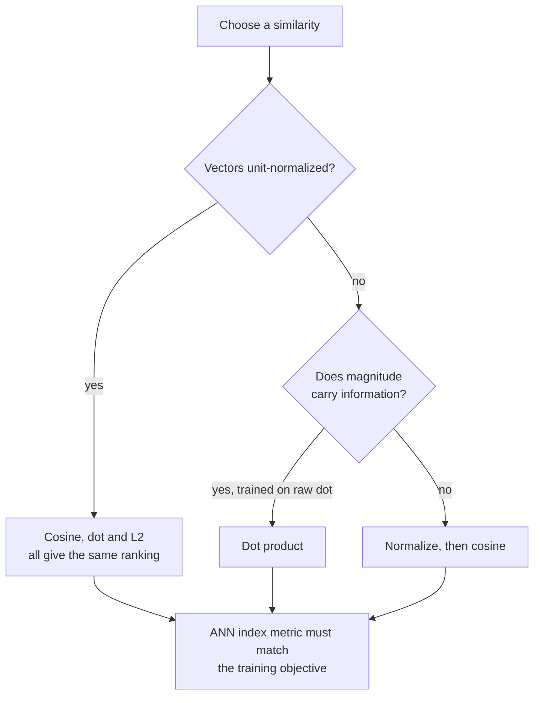

**Follow-ups:** Why does normalizing make Euclidean and cosine equivalent - show it. When would dot product beat cosine in a recommender? What breaks if you index cosine-trained embeddings with an L2 metric without normalizing?

</details>

### 10. Define supervised, unsupervised, and self-supervised learning. Where does each stage of modern LLM training fit?

<details><summary><b>Answer</b></summary>

**Supervised**: learn from (input, label) pairs where labels come from outside the data - human annotation, logged outcomes. **Unsupervised**: find structure with no labels at all - clustering, density estimation, dimensionality reduction. **Self-supervised**: manufacture the labels *from the data itself* via a pretext task, then learn with standard supervised machinery - no annotation cost, effectively unlimited data.

Mapping the modern LLM pipeline is the real point of the question:

- **Pretraining** - self-supervised. Next-token prediction turns raw text into trillions of (context, next-token) pairs; the "label" is just the following token. Masked-language modeling (BERT) is the same idea with a different pretext task.
- **SFT / instruction tuning** - plain supervised learning: curated (prompt, response) pairs, cross-entropy on the response tokens.
- **RL post-training (RLHF on preferences, or GRPO-style RL on verifiable rewards)** - reinforcement learning: the signal is a scalar reward (from a learned reward model, human preferences, or verifiable checkers for math/code), not per-token labels. DPO is the interesting edge case: it optimises a preference objective directly as a supervised-style loss on preference pairs, skipping the explicit RL loop.
- **Embedding models / CLIP** - self-supervised contrastive learning: positives are co-occurring pairs (text/image, query/passage), negatives come free from the batch.
- Genuinely **unsupervised** steps still exist around the edges: clustering user queries to discover intents, deduplicating pretraining corpora via near-duplicate detection.

The one-liner that lands well: self-supervision solved the labelling bottleneck - the reason LLMs work is that next-token prediction converts the entire internet into free supervised training data.

**Worth sketching.** Labelling the arrows rather than the boxes is what makes the taxonomy stick: the paradigm lives in how the supervision was obtained.

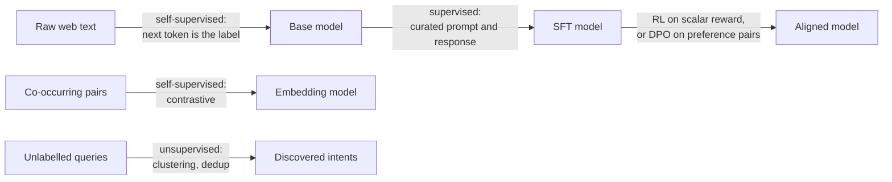

**Follow-ups:** Is a reward model trained supervised or by RL? Why is next-token prediction such a powerful pretext task compared to, say, autoencoding? Where does RLAIF/constitutional-style feedback fit in this taxonomy?

</details>

### 11. Random forest vs gradient boosting: how does each work, and why do tree ensembles still beat neural networks on tabular data?

<details><summary><b>Answer</b></summary>

They sit on opposite sides of the bias-variance lever. **Random forest** is bagging: train many deep trees in parallel, each on a bootstrap sample and each split considering a random feature subset, then average. Deep trees are low-bias and high-variance; averaging decorrelated trees kills the variance. Adding trees never hurts, so it is hard to overfit by tuning.

**Gradient boosting** is sequential: each shallow tree fits the negative gradient of the loss with respect to the current ensemble's predictions (for squared error, literally the residuals), so every round reduces bias. It usually wins on accuracy, but it will overfit if you keep adding rounds, so learning rate, depth, subsample and early stopping actually matter. In practice that means LightGBM, XGBoost or CatBoost with a validation set wired into early stopping.

Why trees beat MLPs on tabular:

- **Invariance to monotone transforms.** Splits are thresholds, so no scaling, no log transforms, no outlier surgery. Neural nets need all of that.
- **Heterogeneous, non-smooth features.** MLPs are biased toward smooth functions; tabular targets are often irregular step functions of a few features. That bias is a mismatch.
- **Robustness to uninformative columns.** Trees just never split on them; an MLP has to learn to ignore them, which costs data.
- **Mixed types and missing values** handled natively, plus categorical handling in CatBoost/LightGBM.
- **Small data.** Most tabular datasets are thousands to millions of rows, where inductive bias matters more than capacity.

Neural nets win when there is structure to exploit: high-cardinality entities you want shared embeddings for, multi-modal input (free text or images beside the table), or transfer from a pretrained model. The honest default in 2026 is still: LightGBM baseline first, and make anything fancier beat it. The one real crack is small data: tabular foundation models such as TabPFN v2 do in-context prediction on tables up to roughly ten thousand rows and are competitive with tuned GBDTs there, so they belong in the baseline set for small problems. At scale, boosted trees still dominate.

Common misconception to avoid: saying random forest "boosts", or quoting `n_estimators=1000` for GBDT with no early stopping.

**Worth sketching.** Parallel arrows against a feedback loop makes the variance-versus-bias distinction visual rather than memorised.

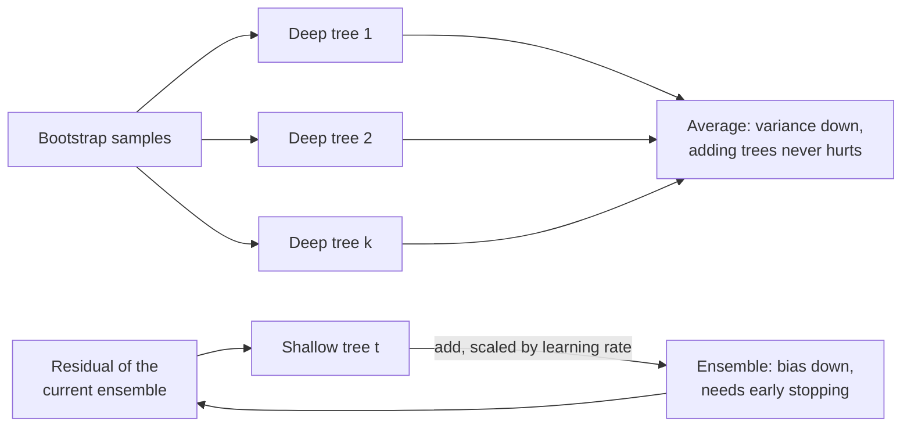

**Follow-ups:** Why does CatBoost's ordered target encoding exist, and what leakage does it prevent? How would you get calibrated probabilities out of a boosted tree?

</details>

### 12. What is feature scaling? Compare normalization and standardization, and tell me which models actually need it.

<details><summary><b>Answer</b></summary>

Standardization subtracts the mean and divides by the standard deviation, giving roughly zero mean and unit variance with an unbounded range. Min-max normalization rescales linearly into a fixed range, usually [0, 1]. Standardization is the default; min-max is for when something downstream needs a bounded range, and it is far more sensitive to outliers because one extreme value squashes everything else.

Who needs it:

- **Distance-based methods** (kNN, k-means, SVM with an RBF kernel): a feature measured in dollars will dominate one measured in fractions purely through units.
- **Regularized linear models**: an L1/L2 penalty is scale-dependent, so an unscaled feature gets an arbitrary amount of shrinkage.
- **PCA**: it maximises variance, and variance is unit-dependent, so without standardizing you get the components of whatever column has the biggest numbers.
- **Gradient descent on linear models and neural nets**: wildly different feature scales make the loss surface badly conditioned, and optimization zig-zags.

Who does not: decision trees and tree ensembles. Splits are thresholds, so any monotone transform of a feature leaves the model unchanged.

Two things that get candidates cut here. First, **fit the scaler on train only**, then apply to validation and test. Fitting on the full dataset before splitting is textbook leakage and it is the most common one people commit. Second, the fitted statistics are **part of the model artifact**. Recomputing the mean and standard deviation from a serving batch, or defaulting to zero where training imputed a median, is training-serving skew, and it fails silently.

For skewed positive quantities (income, counts, latency) I would log-transform first, then standardize. For heavy tails, robust scaling on median and IQR. In deep nets, input scaling matters less internally because normalization layers handle activations, but the inputs themselves still need it.

**Follow-ups:** Why does an unscaled feature ruin L2 regularization but not L1's sparsity property in the same way? Where in a PyTorch serving path would you put the scaler so it cannot drift from training?

</details>

### 13. Walk me from RNNs to LSTMs to transformers. Why did attention win?

<details><summary><b>Answer</b></summary>

An RNN carries a hidden state forward: `h_t = f(h_{t-1}, x_t)`. Training backpropagates through time, which multiplies the same Jacobian once per step, so gradients vanish or explode over long ranges and the practical memory is short.

**LSTM** fixes the gradient path, not the parallelism. It adds a cell state updated *additively*, gated by forget/input/output gates. The additive path is the same trick as a residual connection: gradient flows through it without repeated multiplication, so an LSTM holds context over hundreds of steps rather than tens. GRU is a cheaper two-gate variant with similar behaviour.

Two problems survived. First, everything about the past has to be squeezed into a fixed-size hidden state, which is exactly the bottleneck attention was originally invented to relieve, as a bolt-on to seq2seq RNNs. Second, and decisively, **recurrence is sequential in time**, so you cannot parallelize training across positions.

Transformers drop recurrence entirely. Every position attends to every other, so the path between any two tokens is O(1) instead of O(n), and training becomes large matmuls that saturate GPUs. The costs: attention is O(n²) in compute and memory versus O(n) for an RNN, and it is permutation-equivariant, so order has to be injected via positional encodings (RoPE is the current default).

So the honest answer to "why did attention win" is hardware utilisation plus gradient path length, not some abstract superiority. Given the same FLOPs you could train on vastly more data.

Worth noting the wheel is turning back: state-space and linear-attention models (Mamba-style) recover an O(n) recurrent formulation that still parallelizes at train time via a scan, and hybrid attention/SSM stacks ship in production models for long context. And an autoregressive transformer at inference with a KV cache *is* a recurrence, just with a state that grows with the sequence.

**Follow-ups:** If the KV cache makes decoding recurrent anyway, where does the transformer's advantage actually show up? Why does the LSTM's additive cell state help gradients when the gates themselves are multiplicative?

</details>

### 14. What is the difference between feature engineering and representation learning? Where does hand-engineering still earn its keep in 2026?

<details><summary><b>Answer</b></summary>

Feature engineering is you writing the function from raw data to model input. Representation learning is a model learning that function from data. Deep learning won vision, speech and text because those inputs are high-dimensional with strong local structure and enormous corpora exist, so learned features beat hand-crafted ones (SIFT, MFCCs, n-grams all lost).

Tabular is the opposite regime. Features are already semantic, datasets are small, and domain knowledge encodes constraints the data cannot discover on its own. So hand-engineering still earns its keep in a few concrete places:

- **Tabular / GBDT stacks.** Aggregations, ratios, counts and time-window features ("transactions in the last 24h", "days since last login") are where the actual wins live. No amount of model capacity invents them.
- **Features requiring data the model cannot see.** Joins against CRM history, external signals, computed windows.
- **Recsys**, where user/item history features and cross features carry a lot of the load.
- **LLM systems.** What you retrieve, how you chunk, and what metadata you attach to a chunk is feature engineering wearing a different hat.

The modern middle ground is a hybrid: run unstructured columns (a product description, a support ticket body) through a pretrained encoder to get embeddings, then feed those alongside engineered tabular features into a GBDT or a small MLP. Representation learning where it helps, engineering where it helps.

The misconception to kill is "deep learning means no feature engineering." The work moved, it did not vanish. At frontier scale it went into data curation, mixture weights, dedup, and tokenization, all of which are engineering decisions about representation with enormous impact.

What interviewers are actually testing is judgement about which regime you are in. Spending three weeks crafting features for a problem that has a billion tokens and a pretrained backbone is as wrong as throwing an MLP at 8,000 rows of tabular data.

**Follow-ups:** Give me a feature you have engineered that a model could never have learned, and say why. How do you decide whether to feed an embedding into a GBDT versus fine-tuning the encoder end to end?

</details>

### 15. Why does a neural network need non-linear activation functions, and how did the field move from sigmoid to ReLU to GELU-style activations?

<details><summary><b>Answer</b></summary>

Without a non-linearity, stacking layers buys nothing: W₂(W₁x + b₁) + b₂ is still one affine map, so a 100-layer network has the expressive power of a single linear layer. The activation is what lets depth compose simple features into functions that are not linear in the input, and it is what the universal approximation results rely on.

The history since then is a story about gradients:

- **Sigmoid and tanh** were the defaults through the 2000s. Both saturate: for large |z| the derivative goes to zero, and sigmoid's maximum derivative is only 0.25, so gradients shrink with every layer. Sigmoid is also not zero-centred, which makes updates zig-zag. Both survive today as gates (LSTM, GLU variants) and as output layers, where squashing into a range is the point.
- **ReLU**, max(0, z), made deep supervised training practical in the AlexNet era. Its derivative is exactly 1 on the active side, it is cheap, and it gives sparse activations. Its failure mode is **dead units**: a neuron whose pre-activation is negative for every input gets zero gradient forever, often after a too-high learning rate knocks its bias negative. Leaky ReLU and PReLU keep a small negative slope to avoid that.
- **GELU** (z·Φ(z)) and **SiLU/Swish** (z·σ(z)) are smooth ReLU-like curves with a small negative dip. Smoothness tends to optimise better at scale, which is why BERT and GPT-2 used GELU.
- **Gated variants** (SwiGLU, GeGLU) multiply two linear projections, one passed through the activation, and are the standard choice in current LLM feed-forward blocks.

What an interviewer listens for: the linear-collapse argument stated crisply, saturation tied to vanishing gradients, and the link to initialization (He init assumes ReLU zeroes half its inputs). For a new MLP on tabular or embedding inputs, ReLU or GELU is fine. The choice rarely matters as much as normalization, init and learning rate.

**Follow-ups:** How would you detect dead ReLUs in a trained network? Why does SwiGLU usually use a hidden size of about 8/3 × d instead of 4 × d? Why is sigmoid still the right output for a multi-label classifier?

</details>

## Intermediate

### 16. What is data leakage? Give me three subtle examples you've seen or could imagine, and how you'd detect them.

<details><summary><b>Answer</b></summary>

Leakage is any path by which information unavailable at prediction time contaminates training or evaluation, inflating offline metrics that collapse in production. The blatant case - training on test rows - is rare; the subtle ones are what kill real systems:

1. **Preprocessing fit on the full dataset**: fitting a scaler, PCA, target encoder, or tokenizer/vocabulary on train+test before splitting. Test-set statistics bleed into the transform. Fix: fit transforms inside the training fold only (sklearn `Pipeline` inside CV exists precisely for this).
2. **Group leakage**: the same patient, user, or document contributes rows to both train and test. The model learns to recognise the entity, not the pattern. Detect with group-aware splits; symptom is a big metric drop when you switch to `GroupKFold`.
3. **Temporal leakage**: random splits on time-dependent data let the model train on the future. A churn feature like "days since last login" computed over a window that extends past the label date is a classic - the feature quietly encodes the outcome.
4. **Target leakage in features**: a column causally downstream of the label - e.g., "account_frozen" as a fraud feature, when freezing happens *because* fraud was detected.
5. **LLM-era: benchmark contamination** - eval questions present in the pretraining corpus. Detection: n-gram/substring overlap scans, canary strings, comparing performance on renamed/perturbed versions of the benchmark.

Detection heuristics: results too good to be true (near-perfect AUC on a hard problem); one feature with absurd importance; **adversarial validation** - train a classifier to distinguish train from test rows, and if it succeeds, your splits differ systematically; and large offline→online metric gaps.

**Worth sketching.** Four gates on one path is a much better answer than a list, because it shows leakage is a property of the pipeline order, not of the model.

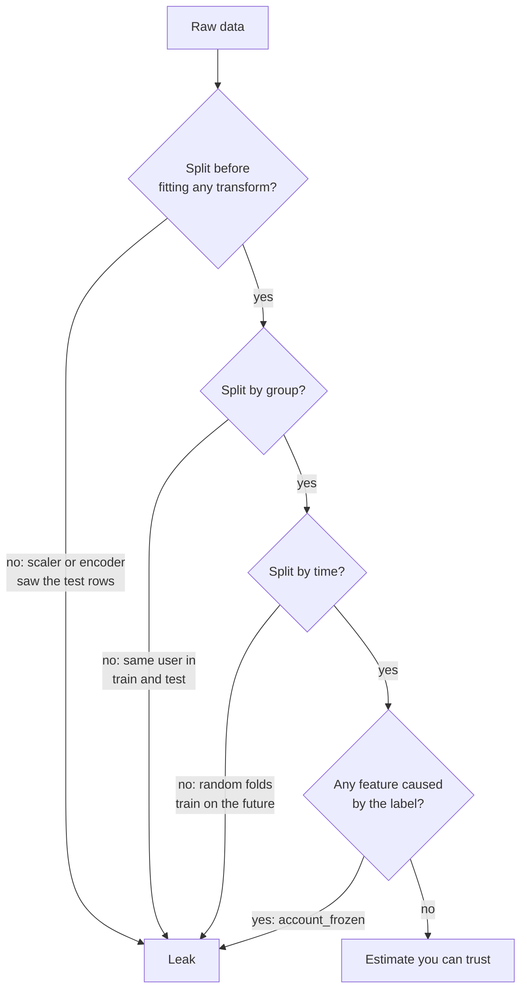

**Follow-ups:** Your model gets 0.99 AUC on a fraud problem - walk me through your audit. How does k-fold CV make preprocessing leakage worse if done naively? How would you check whether an LLM has memorized your eval set?

</details>

### 17. ROC-AUC vs PR-AUC - what does each measure, and why does ROC-AUC look deceptively good on imbalanced data?

<details><summary><b>Answer</b></summary>

**ROC-AUC** plots true-positive rate (recall) against false-positive rate across all thresholds; its area equals the probability that a randomly chosen positive is scored above a randomly chosen negative - a pure *ranking* metric. Baseline is 0.5 regardless of class balance. **PR-AUC** plots precision against recall; its baseline is the positive prevalence.

The deception: FPR = FP/(FP+TN) is normalized by the *negative* count. With 1M negatives and 1k positives, a model producing 10,000 false positives has FPR = 1% - the ROC curve looks superb - but at a threshold that recovers most positives, precision might be ~9% (1k true vs 10k false alarms). ROC-AUC can read 0.98 while the precision an operator experiences is single digits. PR-AUC exposes this because precision has FP in the denominator directly, undiluted by the mass of easy negatives.

Rules of thumb:
- Balanced classes, or you genuinely care how well you rank negatives too → ROC-AUC is fine and has nicer statistical properties (prevalence-invariant, so comparable across datasets).
- Rare positive class where the product experience is "how many alerts are real" → PR-AUC, or better, **precision@k** / recall at a fixed FPR matched to the ops team's review budget.

Two caveats that signal depth: PR-AUC depends on prevalence, so you can't compare it across datasets with different base rates; and average precision (the standard PR-AUC estimator) is preferred over trapezoidal interpolation, which is biased optimistic for PR curves. Neither metric says anything about **calibration** - both are invariant to any monotonic rescaling of scores.

**Follow-ups:** Why is linear interpolation between PR points invalid? Your ROC-AUC improved but PR-AUC dropped - what happened? How do you choose the final operating threshold for production?

</details>

### 18. What does it mean for a classifier to be calibrated? How do you measure and fix miscalibration?

<details><summary><b>Answer</b></summary>

Calibrated means predicted probabilities match empirical frequencies: among all cases where the model says 0.8, ~80% should actually be positive. Discrimination (ranking, AUC) and calibration are orthogonal - you can rank perfectly while outputting probabilities that are all wrong by a squashing, and any monotone rescaling changes calibration without touching AUC.

**Measurement**: reliability diagrams (bin predictions by confidence, plot observed frequency per bin vs the diagonal); **ECE** (expected calibration error) summarises the gap as a weighted average across bins - beware its sensitivity to binning choices; **Brier score** and NLL are proper scoring rules that blend calibration and discrimination.

**Fixes** (fit on validation data, never train):
- **Temperature scaling** (Guo et al. 2017): divide logits by a single learned T > 0 before softmax. Modern nets are typically *overconfident* (T ≈ 1.5-3 fixes many vision models). One parameter, preserves ranking exactly, hard to overfit - the default choice.
- **Platt scaling** (logistic fit on scores) and **isotonic regression** (nonparametric, monotone; needs more data, can overfit small val sets).

Why it matters: any system that thresholds on expected cost - fraud review queues, medical triage, deciding when an LLM-based classifier should abstain or escalate to a human - needs probabilities that mean something, not just correct rankings.

LLM angle worth volunteering: base models are surprisingly well calibrated on multiple-choice tasks (token-probability vs accuracy), and RLHF tends to *worsen* that calibration - the GPT-4 technical report showed the post-RLHF model's calibration curve visibly degraded versus the pretrained model. Verbalised confidence ("I'm 90% sure") is a separate, generally worse-calibrated channel than token logprobs.

**Worth sketching.** The loop back to the reliability diagram shows calibration is measured, fixed, then re-measured, and never fitted on train.

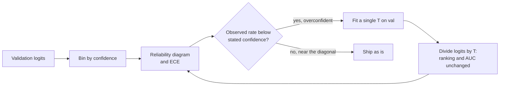

**Follow-ups:** Why does temperature scaling leave accuracy and AUC unchanged? How does class imbalance interact with calibration under resampling? How would you calibrate an LLM judge that outputs a 1-10 score?

</details>

### 19. Your fraud dataset is 0.5% positive. Walk me through your strategy for handling the imbalance.

<details><summary><b>Answer</b></summary>

First, fix the *measurement*, then the *training*, and keep the two concerns separate.

**Measurement**: accuracy and ROC-AUC will both flatter you (see the FPR dilution problem). Use PR-AUC, precision@k sized to the review team's capacity, or recall at a fixed FPR. Establish the cost matrix - a missed fraud might cost 100× a false alarm - because that determines the operating threshold later.

**Training-side options**:
- **Class weights / weighted loss** - upweight positives in cross-entropy. Simple, no data distortion, the usual first move.
- **Resampling** - undersample negatives (cheap, works when negatives are redundant; can discard signal) or oversample positives. **SMOTE** interpolates synthetic positives in feature space - sensible for low-dimensional tabular data, mostly pointless or harmful for high-dimensional learned representations, and never apply it before splitting or you leak synthetic copies into validation.
- **Focal loss** (from RetinaNet) - down-weights easy examples by (1−p)^γ so training focuses on hard ones; designed for extreme imbalance in detection.
- **Threshold moving** - often the most underrated tool: train normally, get calibrated probabilities, then pick the threshold that optimises expected cost. Imbalance doesn't prevent learning a good *ranker*; it breaks the default 0.5 threshold.
- **Reframing** - at extreme rarity or with novel attack patterns, anomaly-detection or one-class formulations may beat classification.

Critical subtleties: evaluate on the *natural* distribution, never a rebalanced one; if you resample or reweight, your output probabilities are biased and must be **recalibrated** before thresholding; and validate temporally, because fraud patterns drift and adversaries adapt.

**Worth sketching.** Two separate lanes converging on the threshold is the structure of the answer: fix measurement, fix training, then recalibrate before you pick an operating point.

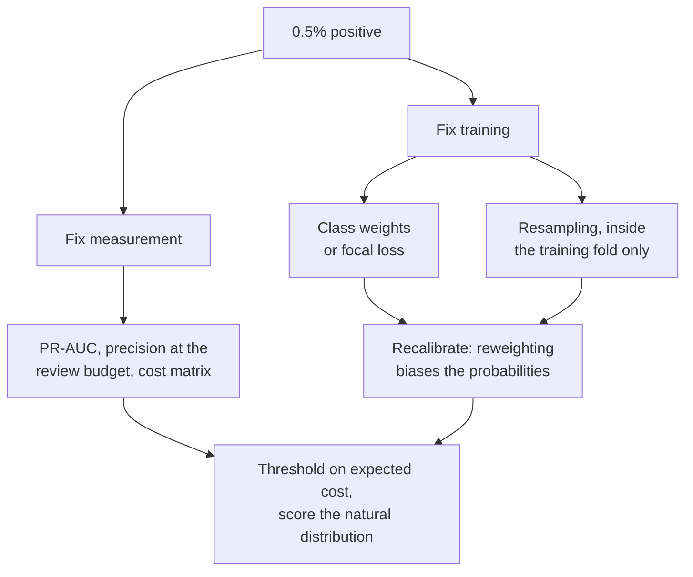

**Follow-ups:** You oversampled and now predicted probabilities are inflated - why, and how do you correct them? When is undersampling actually preferable? How do delayed fraud labels (chargebacks arriving 60 days later) change your evaluation?

</details>

### 20. Explain momentum and Adam. What problem does each solve over vanilla SGD?

<details><summary><b>Answer</b></summary>

**Momentum** maintains an exponential moving average of gradients and steps along that average: `v ← βv + g; w ← w − lr·v` (β typically 0.9). In loss landscapes shaped like ravines - steep in some directions, shallow in others - vanilla SGD oscillates across the steep walls while crawling along the valley floor. Momentum cancels the oscillating components (they alternate sign and average out) and accumulates the consistent ones, giving up to a 1/(1−β) effective amplification along stable directions. It also smooths mini-batch noise.

**Adam** adds a second idea: **per-parameter adaptive step sizes**. It tracks both the first moment m (like momentum, β₁=0.9) and second moment v - an EMA of squared gradients (β₂=0.999 classically, ~0.95 in LLM practice) - and updates with `w ← w − lr · m̂ / (√v̂ + ε)`. Dividing by √v̂ normalizes each parameter's step by its typical gradient magnitude: parameters with rare/small gradients (embedding rows for rare tokens) get relatively larger steps; parameters with large, noisy gradients get damped. The hats are **bias correction** - both EMAs are initialized at zero and severely underestimate their targets early in training; without correction, early steps would be badly mis-scaled.

Why this matters for transformers: gradient scale varies enormously across a deep transformer (embeddings vs LayerNorm gains vs attention projections), and a single global LR can't serve them all - SGD is notoriously hard to make work on transformers, while Adam-family optimizers are robust. The flip side: Adam keeps two extra fp32 states per parameter (~8 bytes/param), a major memory cost that motivates 8-bit optimizers and ZeRO-style sharding.

**Worth sketching.** Drawing the two EMAs as separate branches makes it obvious what bias correction is correcting and why it only matters early.

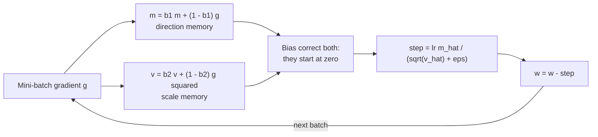

**Follow-ups:** Why does Adam need bias correction - what happens without it? Why does SGD+momentum still often beat Adam on convnets? What's the memory footprint of Adam for a 7B model and how do you reduce it?

</details>

### 21. Adam vs AdamW - what exactly is "decoupled weight decay," and why did AdamW become the transformer default?

<details><summary><b>Answer</b></summary>

The difference is *where* the weight-decay term enters the update. In "Adam + L2," you add λw to the gradient, so the penalty flows through Adam's machinery - including division by √v̂. In **AdamW** (Loshchilov & Hutter, "Decoupled Weight Decay Regularization"), decay is applied directly to the weights, outside the adaptive update:

```python
# Adam + L2: penalty is rescaled by the adaptive term
g = grad + lam * w
w -= lr * m_hat / (v_hat.sqrt() + eps)   # decay diluted where v_hat is large

# AdamW: decay decoupled from gradient adaptation
w -= lr * m_hat / (v_hat.sqrt() + eps)
w -= lr * lam * w                         # uniform multiplicative shrinkage
```

Why the coupled version is broken: parameters with large gradient history (large v̂) have the L2 term divided down - precisely the weights moving the most get *the least* regularization, and the effective decay strength becomes an uncontrolled function of gradient statistics. It also entangles λ with the learning rate schedule in messy ways, making hyperparameters non-transferable across runs. With plain SGD, L2 and weight decay coincide - the distinction only exists for adaptive optimizers, which is exactly the trap the question tests.

AdamW restores a clean interpretation - every weight shrinks by the same fraction lr·λ per step - decouples the λ/lr search dimensions, and empirically generalizes better. It became the default in essentially every transformer recipe (GPT-series, Llama, etc.), with typical settings λ ≈ 0.1, β₂ ≈ 0.95, and decay disabled for biases, LayerNorm/RMSNorm parameters, and often embeddings. As of 2026 it is still the safe default, but no longer the only serious option: Muon-family optimizers, which orthogonalize the momentum update for 2D weight matrices, were used to pretrain Kimi K2 and GLM-4.5, with AdamW kept for embeddings, the output head and norm gains. Decoupled weight decay carries over to them unchanged.

**Worth sketching.** Two paths from the same gradient, differing only in which side of the division the decay sits, is the entire fix in one picture.

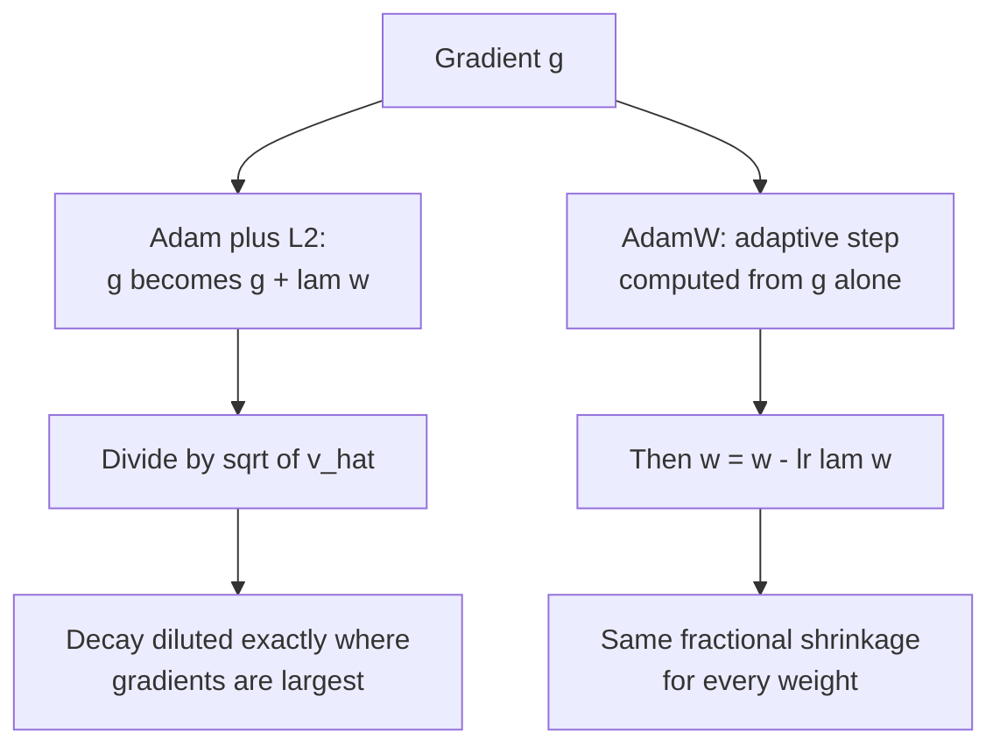

**Follow-ups:** Why is weight decay ≡ L2 under SGD but not under Adam? Why exclude norm parameters from decay? What happens to effective weight decay as the LR is cosine-annealed to near zero?

</details>

### 22. Why do transformer training recipes use learning-rate warmup, and what does the rest of the schedule look like?

<details><summary><b>Answer</b></summary>

**Warmup** ramps the LR linearly from ~0 to peak over the first few hundred to few thousand steps. Three reinforcing reasons transformers need it:

1. **Adam's second-moment estimate is unreliable early.** v̂ is an EMA over a handful of noisy gradients, so the adaptive step m̂/√v̂ can be wildly mis-scaled; a full-size LR on top of that causes destructive early updates. (RAdam formalised this variance problem; warmup is the practical fix.)
2. **Early transformer training is fragile.** At init, attention distributions and the loss landscape are ill-conditioned; large steps can push the model into a state with exploding gradient norms or a loss divergence it never recovers from. Original post-LN transformers were *unusable* without warmup; pre-LN reduced but didn't eliminate the need.
3. **Large batches.** The linear-scaling regime (big batch → big LR) makes the first steps even more dangerous; Goyal et al. introduced warmup for exactly this in the ImageNet-in-1-hour work.

After warmup, the standard is **cosine decay** from peak LR down to ~10% of peak over the full token budget (the Chinchilla/Llama-style recipe). Decaying matters: high LR late in training keeps the model bouncing around the minimum; annealing lets it settle, and the final low-LR phase disproportionately improves the model.

A modern alternative worth naming: **WSD (warmup - stable - decay)** - hold LR constant after warmup, then decay sharply only in the last ~10-20% of training. The benefit is operational: you can branch a decayed "finished" checkpoint off a still-running stable-phase run at any time, which suits continued pretraining and data-mixture experiments (popularised by MiniCPM, and close in spirit to the multi-step and constant-then-decay schedules in DeepSeek's reports).

**Worth sketching.** Drawing WSD as a branch off the stable phase explains its whole selling point: you can cut a finished checkpoint whenever you like.

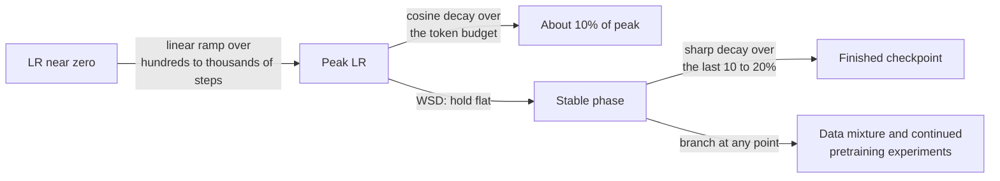

**Follow-ups:** What actually goes wrong if you skip warmup - describe the failure signature in the loss/grad-norm curves. Why does cosine-to-zero interact badly with wanting to resume training? How would you set peak LR for a model 10× bigger?

</details>

### 23. Explain backpropagation to me like I'm a strong software engineer who's never done ML. Why is it efficient?

<details><summary><b>Answer</b></summary>

A neural net is a composite function: `loss = f_L(...f_2(f_1(x, w_1), w_2)..., w_L)`. Training needs ∂loss/∂w for every weight. Backprop is just the **chain rule organised as dynamic programming**: compute the loss forward while caching each layer's activations, then sweep backward, multiplying by one local Jacobian at a time and reusing the running product - the "gradient signal" - at every layer.

The efficiency argument is the heart of a good answer. Naively, you could compute each weight's gradient independently (finite differences: perturb one weight, rerun the network) - that's O(#params) forward passes, hopeless for billions of parameters. Backprop computes *all* gradients in one backward sweep costing roughly **2× the forward pass**, because the backward pass reuses shared intermediate results exactly like memoization collapses an exponential recursion. Key implementation detail: you never materialise full Jacobian matrices - reverse-mode autodiff propagates **vector-Jacobian products**, which for a matmul layer are just two more matmuls (grads w.r.t. input and w.r.t. weights).

Reverse mode is the right direction because the loss is scalar: one output, many inputs → one backward sweep gets every derivative. (Forward-mode is efficient in the opposite regime, few inputs/many outputs.)

Engineering consequences worth stating: total training compute is ~3× forward (hence the ≈6·N·D FLOPs rule of thumb for transformers with N params and D tokens); the cached activations dominate training memory, which is why **activation checkpointing** trades recompute for memory; and frameworks implement this as autograd over a recorded computation graph - every op registers its VJP.

**Worth sketching.** The cached activations on the forward arrows are what make the backward pass cheap and training memory expensive, and the sketch puts both facts in one place.

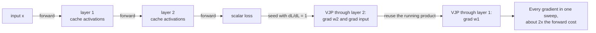

**Follow-ups:** Why is training memory so much larger than inference memory? What is activation checkpointing and what's its compute overhead? Where does the 6ND estimate come from?

</details>

### 24. What are vanishing and exploding gradients? What causes them, and what does modern architecture design do about them?

<details><summary><b>Answer</b></summary>

Backprop multiplies a chain of layer Jacobians. If those factors are typically <1 in magnitude, the product shrinks geometrically with depth - early layers get essentially zero gradient and stop learning (**vanishing**). If factors are >1, the product blows up - loss spikes, NaNs (**exploding**). Same mechanism, opposite sign of log-magnitude.

Classical causes: saturating activations (sigmoid's max derivative is 0.25; tanh saturates at extremes), poorly scaled initialization, and depth or recurrence (RNNs multiply by the same recurrent Jacobian per timestep, making them the pathological case - historically fixed by LSTM/GRU gating).

Modern fixes, each attacking a different link in the chain:
- **Residual connections**: `y = x + f(x)` gives Jacobian `I + ∂f/∂x` - the identity term provides a gradient highway that never vanishes, letting 100+-layer networks train. This is the single most important trick, and transformers are residual networks through and through.
- **Normalization** (LayerNorm/RMSNorm): keeps activation scales controlled so Jacobians stay well-conditioned; **pre-norm** placement (norm before each sublayer) keeps the residual path clean and is why GPT-2-onward models train stably at depth.
- **ReLU/GELU** activations: derivative ~1 on the active region, no two-sided saturation.
- **Variance-preserving init** (Xavier/He): start with Jacobian factors near unit scale.
- **Gradient clipping** (global norm, typically 1.0): a backstop against explosion - it rescales pathological updates rather than preventing the cause.

Diagnosis in practice: log per-layer gradient norms. A geometric decay across depth = vanishing; sudden grad-norm spikes preceding loss spikes = exploding, common in LLM pretraining and handled with clipping, LR reduction, or skipping the offending batch.

**Follow-ups:** Why exactly does `I + ∂f/∂x` fix gradient flow? Why do pre-norm transformers tolerate less warmup than post-norm? Your 30B pretraining run shows recurring loss spikes - what's your playbook?

</details>

### 25. Why can't you initialize all weights to zero? What do Xavier and He initialization actually do?

<details><summary><b>Answer</b></summary>

Zero (or any constant) init fails from **symmetry**: every neuron in a layer computes the identical function, receives the identical gradient, and takes the identical update - they never differentiate, so your wide layer is effectively one neuron. Randomness breaks the symmetry. (Biases *can* start at zero; the weights' randomness breaks symmetry for them.)

But random isn't enough - the **scale** must be right, or activations and gradients shrink/blow up geometrically with depth (the vanishing/exploding problem, baked in at step 0). The principled goal: preserve variance layer to layer.

- **Xavier/Glorot init**: variance 2/(fan_in + fan_out) - derived for symmetric activations like tanh, balancing forward activation variance and backward gradient variance.
- **He/Kaiming init**: variance 2/fan_in - accounts for ReLU zeroing half its inputs (halving variance), so it doubles the scale. Standard for ReLU-family networks.

Transformer practice goes further: GPT-2-style recipes use small normal init (std ≈ 0.02) and additionally **scale down the residual-branch output projections by 1/√(2·n_layers)** - because N residual branches add their variance into the stream, and without this the residual-stream magnitude grows with depth. Embeddings are often tied with the output head, which constrains their scale too. The research-flavoured extension is **μP (μTransfer)**: parameterize init and per-layer LRs so optimal hyperparameters transfer from small to large models - tune on a 40M model, train the 10B with the same settings.

Good candidates connect init to everything else: init, normalization, residuals, and warmup are four coordinated solutions to the same problem - keeping signal propagation well-conditioned in deep networks.

**Follow-ups:** Derive why fan_in appears in the variance formula for a linear layer. Why do residual networks need the extra 1/√N scaling? What breaks if you init a transformer with std 0.2 instead of 0.02?

</details>

### 26. Batch norm vs layer norm: how does each work, and why do transformers use layer norm?

<details><summary><b>Answer</b></summary>

Both normalize activations to zero mean and unit variance, then apply a learned scale γ and shift β. The difference is the axis. **BatchNorm** normalizes each feature/channel *across the batch* - statistics are computed over the N examples in the mini-batch. **LayerNorm** normalizes *across the feature dimension within a single example* (per token, in a transformer) - no dependence on other examples at all.

Why BN is wrong for transformers/LLMs:
- **Variable-length sequences and padding** make per-position batch statistics ill-defined and noisy.
- **Batch dependence**: BN's quality degrades at small batch sizes, and in distributed training the per-device batch may be tiny (SyncBatchNorm exists but adds communication).
- **Train/inference mismatch**: BN needs running statistics for inference - a persistent source of train/eval bugs - and is awkward for autoregressive decoding, where you generate one token at a time with effective batch size 1 per position.
- LayerNorm has none of these issues: each token normalizes itself, identical math at train and inference, any batch size.

Modern refinements worth knowing: **RMSNorm** (Llama, Mistral, most current LLMs) drops mean-centring and just divides by the root-mean-square, with a learned gain - cheaper, empirically as good. **Placement matters more than flavour**: the original transformer used **post-norm** (normalize after the residual add), which is unstable at depth and demands careful warmup; **pre-norm** (normalize inside the branch, before attention/MLP) keeps an unimpeded identity path through the residual stream and trains stably - the dominant default since GPT-2. Recent models add extra norms on top: QK-norm on attention queries/keys to prevent attention-logit blowups at scale, and a second norm on each sublayer's output before the residual add (Gemma's "sandwich" norm, OLMo 2's reordered norm) to keep the residual stream's magnitude bounded.

**Worth sketching.** Naming the axis each one reduces over is the answer; everything else on the diagram follows from that single choice.

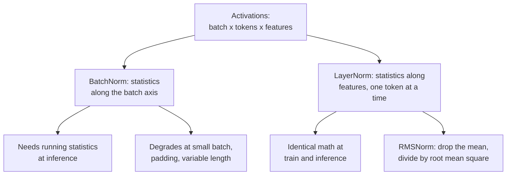

**Follow-ups:** Why does BN generally underperform even in encoder-only transformers where decoding isn't an issue? What does RMSNorm remove and why is that OK? Explain mechanically why post-norm at depth is unstable.

</details>

### 27. Derive cross-entropy loss from first principles. Why is it "the right" loss for classification and language modeling?

<details><summary><b>Answer</b></summary>

Start from **maximum likelihood**. A classifier (or LM) defines a conditional distribution p_θ(y|x). Given i.i.d. data, MLE maximises Π p_θ(yᵢ|xᵢ); taking logs (monotone, turns products into sums, numerically necessary) and negating gives the training objective: minimise **negative log-likelihood** = −Σ log p_θ(yᵢ|xᵢ). For a categorical output with one-hot targets, that is exactly cross-entropy: H(y, p) = −Σ_c y_c log p_c = −log p(correct class). Language modeling is this applied per token: next-token cross-entropy is MLE of the text distribution, and **perplexity = exp(mean CE)** - "how many equally likely tokens is the model choosing among."

The information-theoretic view: minimising CE against the empirical data distribution is equivalent to minimising **KL(data ‖ model)** - you're matching the model distribution to the data distribution, and the gap above the data's own entropy is exactly the KL term.

Why it's *right* mechanically, not just philosophically:

1. **Gradient quality.** With softmax outputs, ∂CE/∂logits = **p − y**. Confidently wrong (p≈0 on the true class) → gradient near maximal; correct and confident → gradient near zero. No saturation on mistakes.
2. **Proper scoring rule**: expected CE is minimised only by predicting the true conditional probabilities, so it incentivises honest uncertainty - the basis for LM calibration.
3. It punishes confident errors unboundedly (−log p → ∞ as p→0), which is what you want when downstream decisions consume the probabilities.

The framing that lands in interviews: cross-entropy isn't one loss among many - it's what "do MLE on a categorical distribution" *compiles to*. MSE is the same statement for Gaussian noise; every standard loss is a likelihood in disguise.

**Follow-ups:** Show that softmax+CE gives gradient p − y. What does label smoothing change in this picture? Why is perplexity exp of CE, and what does perplexity 8 mean concretely?

</details>

### 28. Explain softmax and the temperature parameter. How do you compute softmax stably, and where does temperature show up across ML?

<details><summary><b>Answer</b></summary>

Softmax maps logits to a probability distribution: `p_i = exp(z_i/T) / Σ_j exp(z_j/T)`. With temperature T=1 it's the standard form. As **T→0** it approaches argmax (all mass on the top logit); as **T→∞** it flattens toward uniform. Dividing by T rescales logit *differences*, which is what controls sharpness. Softmax is invariant to adding a constant to all logits - only differences matter - which enables the stability trick.

**Numerical stability**: exp overflows fast (exp(89) overflows fp32). Subtract the max logit first - mathematically a no-op, numerically essential:

```python
def softmax(z, T=1.0):
    z = z / T
    z = z - z.max(axis=-1, keepdims=True)   # log-sum-exp trick
    e = np.exp(z)
    return e / e.sum(axis=-1, keepdims=True)
```

In practice you compute `log_softmax` directly and use it with NLL for a fused, stable cross-entropy - never `log(softmax(z))` in two steps (catastrophic when a probability underflows to 0).

Temperature appears all over the stack, and connecting the dots is what makes this answer senior:
- **LLM sampling**: T scales next-token logits before sampling. Low T → deterministic, repetitive; high T → diverse, error-prone. T=0 conventionally means greedy decoding. Works alongside top-p/top-k truncation.
- **Knowledge distillation** (Hinton et al.): soften the teacher's distribution with T>1 so "dark knowledge" in the non-argmax classes carries gradient signal to the student.
- **Contrastive losses** (InfoNCE/CLIP/SimCLR): similarity scores divided by τ (~0.05-0.1) before the softmax; τ controls how hard the loss focuses on the most confusable negatives. CLIP famously *learns* its temperature.
- **Calibration**: temperature scaling fits a single T on validation logits to fix overconfidence - same knob, different objective.
- **Attention**: the 1/√d_k factor in scaled dot-product attention is exactly a fixed temperature keeping logit variance ~1 so the softmax doesn't saturate at init.

**Follow-ups:** Why does attention divide by √d_k - what happens without it? Why is low temperature *not* the same as top-k truncation? What breaks numerically if you compute log(softmax(z)) naively?

</details>

### 29. Compare PCA, t-SNE and UMAP. When would you use each, and how do people misread these plots?

<details><summary><b>Answer</b></summary>

PCA is linear and belongs in a pipeline. t-SNE and UMAP are non-linear and belong on a screen, for looking at data, not for feeding a downstream model.

**PCA** finds orthogonal directions of maximum variance (eigenvectors of the covariance matrix, in practice the SVD of the centred data). It is deterministic, cheap, invertible (you can project back and measure reconstruction error), and it preserves global structure. That makes it the one you can ship: shrink 1536-d embeddings to 256 to cut index size and latency, decorrelate features, denoise. Standardize first if features have different units. The failure mode: variance is not information. A low-variance direction can be the discriminative one, and PCA will throw it away.

**t-SNE and UMAP** optimise a neighbourhood-preservation objective. They are stochastic, do not preserve distances, and they mislead in specific documented ways:

- **Cluster sizes are meaningless.** t-SNE expands sparse regions and compresses dense ones.
- **Distances between clusters are largely meaningless**, especially for t-SNE.
- **The plot changes with perplexity / n_neighbors and with the random seed.** You can produce convincing clusters out of pure Gaussian noise by picking perplexity low enough.

UMAP preserves more global structure, is faster, and can transform new points (t-SNE cannot, without hacks), but the same caveats hold.

My rules: PCA down to ~50 dims first as a denoise and speed step, then t-SNE/UMAP. Sweep perplexity/n_neighbors and multiple seeds, and only believe structure that persists across all of them. Never quote a cluster count read off a UMAP plot as a finding; confirm by clustering in the original space and sanity-checking against labels.

For embedding work specifically, treat these as debugging aids. Do my paraphrases land near each other? Have my chunk embeddings collapsed into one blob? Good questions. "How many intents do my users have" is not answerable from the picture.

**Follow-ups:** You need to cut a 3072-d embedding index in half without hurting recall. Walk me through your options and how you would validate the choice. Why can UMAP transform new points when t-SNE cannot?

</details>

### 30. Your new model scores 87.2% on the test set, the incumbent scores 86.5%. Ship it?

<details><summary><b>Answer</b></summary>

Not on that evidence. A point estimate with no interval is not a result, and 0.7 points is very likely noise.

First, quantify the uncertainty. Bootstrap the test set: resample with replacement ~1,000 to 10,000 times, recompute the metric each time, take the 2.5th and 97.5th percentiles. Better, bootstrap the **paired difference**, scoring both models on the same resampled indices, which cancels test-set difficulty variance and gives a much tighter interval than comparing two independent CIs. Note that overlapping CIs do *not* imply no significant difference, so test the difference directly rather than eyeballing two error bars.

Rough intuition for the scale. At n = 1,000 and accuracy near 0.87, the standard error is about `sqrt(0.87*0.13/1000)` ≈ 1.1%. A 0.7 point gap sits comfortably inside noise. Resolving it reliably would need on the order of tens of thousands of examples. Paired testing helps because only the disagreements carry information, which is exactly what McNemar's test formalizes.

```python
import numpy as np
def paired_bootstrap(correct_a, correct_b, n=10_000, seed=0):
    rng, N = np.random.default_rng(seed), len(correct_a)
    d = np.array([ (correct_a[i]-correct_b[i]).mean()
                   for i in (rng.integers(0, N, N) for _ in range(n)) ])
    return np.percentile(d, [2.5, 97.5])
```

Three variance sources the naive comparison hides:

- **Seed variance.** Retrain with several seeds. For fine-tunes, seed-to-seed spread often swamps the gap you are chasing.
- **Selection noise.** If you tried 40 configurations and reported the best, the winner is partly luck. That needs a fresh holdout.
- **Non-iid data.** Grouped rows (multiple per user or per document) break the bootstrap's assumption. Resample at the group level.

The LLM-era version bites harder: eval sets are often 200 to 1,000 items, so most "model A beats model B by a point" claims are unresolvable. If the gap is within noise, I choose on cost, latency or simplicity and say so plainly.

**Follow-ups:** How would you set up the eval so a 0.7 point difference *is* detectable, and is that a good use of budget? Your test set has 5 examples per user across 200 users. What breaks in a naive bootstrap?

</details>

### 31. What is training-serving skew? How do you detect it and how do you design it out?

<details><summary><b>Answer</b></summary>

Training-serving skew is when the features a model sees at inference differ from the ones it was trained on, so it is scoring a distribution it never fitted. Offline metrics look fine, production quietly underperforms, and nothing throws an exception. That silence is what makes it the most expensive class of ML bug.

Causes, roughly in order of how often I have actually seen them:

1. **Two implementations.** Training features come from a Spark or SQL batch job; serving features come from request-path code in another language. They diverge the moment either side changes.
2. **Time travel.** A training row for an event at time `t` gets joined against a feature snapshot that already contains data from after `t`. Training saw a value serving can never have.
3. **Different null handling.** Training imputes the training-set median; serving sends 0.
4. **Freshness skew.** Training used a feature aggregated over a complete day; serving reads a partially materialized one.
5. **Preprocessing version drift.** Scaler statistics, vocabulary, or tokenizer out of sync with the checkpoint.

Designing it out:

- **One definition per feature**, consumed by both paths. This is the real reason feature stores (Feast, Tecton) exist; the storage is incidental.
- **Point-in-time correct joins** when assembling training sets, so a row only ever sees what was knowable then.
- **Ship preprocessing inside the artifact** (a sklearn Pipeline, a torch module, the serving graph) so nobody can reimplement it.
- **Log the exact served feature vector** and reuse those logs as the next round's training data. For logged features, skew becomes structurally impossible.

Detection, because prevention is never complete: compare distributions of served vectors against the training set per feature (PSI or KL against a reference window) and alert. Better, run a shadow job that replays logged requests through the training pipeline and diffs feature values. Any nonzero diff rate is a bug. I would much rather read "5% of rows disagree on feature X" than spend a week hunting a mysterious AUC drop.

**Worth sketching.** Two boxes computing the same feature is the bug; the replay arrow underneath is the only thing that proves you do not have it.

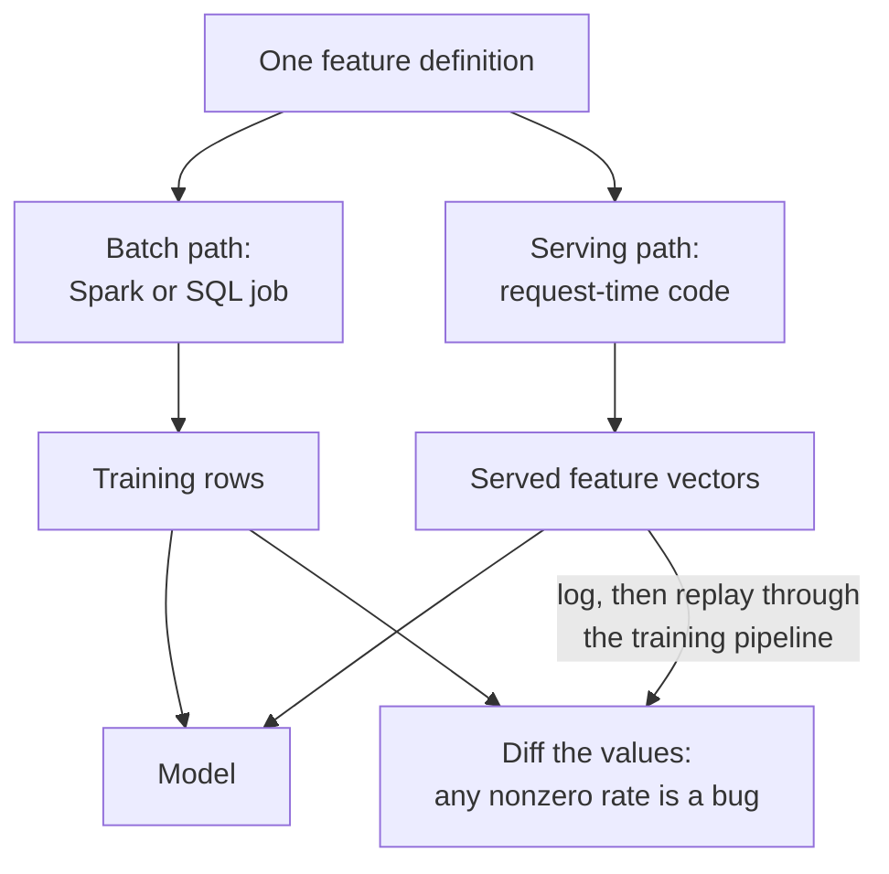

**Follow-ups:** Give me a concrete point-in-time join and show me where the naive version leaks. Your PSI alert fires on one feature. How do you tell a real upstream change from a broken pipeline?

</details>

### 32. You're running an A/B test on a new model. Walk me through designing it, and tell me what you'd refuse to do once it's live.

<details><summary><b>Answer</b></summary>

Fix the metric, the minimum detectable effect and the sample size *before* launch, then do not peek without correcting for it.

**Sizing.** Sample size per arm scales roughly as `n ∝ σ²/Δ²`, so halving the effect you want to detect quadruples the traffic. That means the first question is not "how long do we run" but "what lift is worth shipping." Defaults of α = 0.05 and 80% power mean a one-in-five chance of missing a real effect, which is fine for a cheap change and negligent for a big bet.

**Peeking.** Fixed-horizon tests assume one look at a predetermined n. Checking daily and stopping the moment p < 0.05 inflates the false positive rate well above nominal α. Acceptable fixes: a pre-registered fixed horizon, group sequential boundaries (O'Brien-Fleming style), or always-valid sequential p-values if the team insists on a live dashboard. What I refuse is stopping early on an uncorrected test, which is how most "wins" that fail to replicate get born.

**Variance reduction.** CUPED regresses out a pre-experiment covariate, typically the same user's pre-period metric. When the metric is autocorrelated it cuts variance substantially and shortens the test. Cheaper than buying traffic.

Traps I would raise unprompted:

- **Sample ratio mismatch.** First thing I check. If the split is not what you configured, assignment is broken and every downstream number is suspect.
- **Randomization unit vs analysis unit.** Randomize by user, analyse by session, and the iid assumption breaks; your p-values are too small. Use the delta method or a cluster bootstrap for ratio metrics.
- **Interference.** In marketplaces or social graphs the control is contaminated by treatment. Switchback or cluster randomization.
- **Novelty and primacy.** Week one is not steady state.

For an LLM feature specifically, per-request cost is a co-primary metric, not a footnote. A 1% quality win that doubles token spend is not a win, and the offline eval is only a proxy for the online metric anyway.

**Worth sketching.** Putting the peeking decision on the diagram forces the conversation you actually need to have with the team before launch, not after.

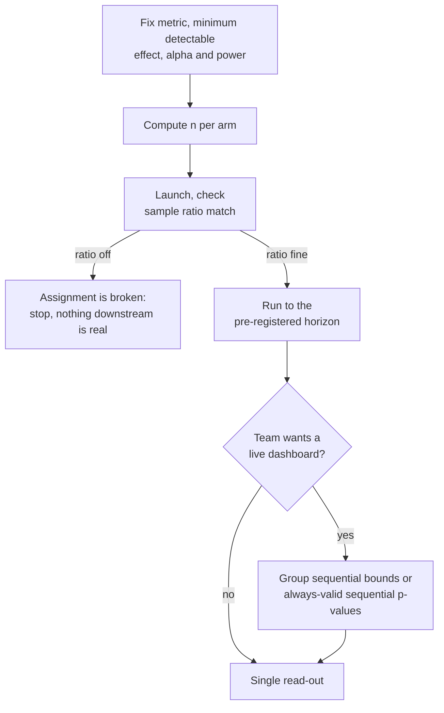

**Follow-ups:** Your metric is revenue per user, which is heavy-tailed and mostly zero. What does that do to your sample size and what would you do about it? How would you detect a novelty effect rather than assume one?

</details>

### 33. About 10% of your training labels are wrong. What happens, and what do you do about it?

<details><summary><b>Answer</b></summary>

Label noise caps achievable accuracy, biases model selection, and, most damagingly, corrupts your eval. So I fix eval first. If 10% of *test* labels are wrong, a perfect model scores ~90%, and worse, the ranking between two good models starts being decided by which one better predicts the noise. Every decision downstream inherits that.

Training is more forgiving than people expect. Models are fairly robust to *symmetric random* noise given enough data, because it averages out and cross-entropy can still recover the right posterior. Two caveats matter more than the robustness:

- **Real noise is systematic, not random.** Annotators mislabel a specific class consistently, or the guidelines are ambiguous in a specific region. Systematic noise gets learned as signal, and no amount of data cures it.
- **Large models memorize noisy labels late in training.** It shows up as a train/val gap that widens after an initially clean fit, which makes early stopping a genuine defence here.

My playbook:

1. **Measure it.** Relabel a random sample of ~200 to 500 items with your best annotators or an adjudicated panel. You want the noise rate and, more usefully, the confusion pattern.
2. **Read disagreement as a spec bug.** High inter-annotator disagreement usually means the rubric is ambiguous, not that annotators are careless. Fix the guidelines before buying more labels.
3. **Split your data by purpose.** Build a small, expensive, multi-annotator gold set for eval; treat the noisy pile as training data only. Report inter-annotator agreement (Cohen's or Fleiss' kappa) as the ceiling any model can be measured against.
4. **Clean by loss.** Train with cross-validation, inspect confidently-wrong and high-loss examples. Most are mislabels, some are genuinely hard, and a few reveal your task definition is broken. Confident-learning tooling (cleanlab-style) formalizes this.
5. **Mitigate in the loss.** Label smoothing, robust/symmetric losses, sample reweighting.

The 2026 shortcut: have a strong model pre-label and surface disagreements for humans. Just never let the same model family judge its own outputs on your gold set.

**Follow-ups:** Kappa is 0.55 on your task. What does that tell you, and what do you do next? How would you distinguish a genuinely hard example from a mislabelled one in your high-loss bucket?

</details>

### 34. You're adapting a pretrained model to a new task. What do you freeze, what do you train, and how do you decide?

<details><summary><b>Answer</b></summary>

How much you unfreeze should scale with how much task data you have and how far your domain sits from the pretraining distribution. That is the whole decision.

The ladder:

1. **Frozen backbone plus a linear probe.** Hundreds of examples, domain close to pretraining. It is also the honest measurement of how good the representation already is, and I run it first regardless, as a baseline.
2. **Unfreeze the last N blocks.** Thousands of examples.
3. **Full fine-tune.** Tens of thousands plus, or a genuinely distant domain (medical imaging, legal text, an unusual language).
4. **PEFT / LoRA.** The default for LLMs now. You train roughly 1% of parameters, keep one base model resident and swap adapters per task, and you largely dodge the catastrophic forgetting of general capability that full fine-tuning invites.

Why early layers freeze well: they learn generic structure (edges and textures in CNNs, syntax and surface regularities in early transformer layers), while late layers are task and label specific. Same reason you always replace the head.

Practical rules that separate people who have done it:

- **Much lower LR than pretraining**, typically ~10 to 100x smaller. You are nudging, not overwriting.
- **Warm up the new head with the backbone frozen** for an epoch before unfreezing. A randomly initialized head emits large gradients that will wreck pretrained weights in the first few steps.
- **Discriminative LRs**, lower for earlier layers, if you partially unfreeze.
- **Keep BatchNorm in eval mode** when fine-tuning batches are small. Updating running statistics from a batch of 8 is a classic silent regression.

When not to transfer: when the deployment budget cannot hold the pretrained model (then distil), or when the input is truly alien to it.

For LLM applications specifically, the ordering matters: try prompting, few-shot and retrieval first. Fine-tune for format and behaviour compliance, or to move a task onto a smaller cheaper model. Fine-tuning to inject facts is usually the wrong tool; that is what retrieval is for.

**Follow-ups:** You fine-tuned and the model got better at your task but worse at everything else. Diagnose and fix. Why does LoRA resist catastrophic forgetting more than full fine-tuning at the same effective learning rate?

</details>

### 35. What goes wrong when you validate a model on time-ordered data, and how do you do it properly?

<details><summary><b>Answer</b></summary>

Random k-fold on time-ordered data is leakage, full stop. It trains on the future to predict the past, scores beautifully, and dies in production.

Use **walk-forward (rolling-origin) validation**: train on `[0, t)`, validate on `[t, t+h)`, roll forward, repeat. Multiple folds, so you see variance across regimes rather than one lucky window. Expanding window if old regimes still apply; sliding window if they do not.

The subtler leaks are where interviews are actually won:

- **Non-causal aggregations.** Computing rolling means, target encodings or scaler statistics over the whole series before splitting. Every aggregation must use only data up to `t`.
- **Label window overlapping the feature window.** Predicting "churn in the next 30 days" with features that include day `t+5` activity.
- **Data that exists in your warehouse but did not exist then.** Late-arriving records, backfilled corrections, restated figures. Your training snapshot is retrospective; serving is not. This one is the killer, and point-in-time correct joins are the fix.
- **No embargo.** Leave a gap between train and validation equal to the label horizon. Without it, autocorrelation makes rows either side of the boundary near-duplicates.

Two things I would insist on reporting:

**Baselines.** Always compare against naive persistence (`y_hat_t = y_{t-1}`) and seasonal naive. A large fraction of impressive-looking forecasting models do not beat them, and any interviewer who has shipped forecasting knows it.

**Metrics per horizon, not averaged.** A model can be excellent at h=1 and worthless at h=30, and the average hides exactly the thing the business cares about.

Finally, treat distribution shift as the default rather than a pathology. Retrain cadence is a design parameter, not an afterthought. A model validated on 2024 data facing a 2026 regime change is not overfitting, it is a different problem, and conflating the two sends you optimising regularization when you should be rebuilding the pipeline.

**Worth sketching.** The embargo gap and the "up to t only" constraint are the two things candidates leave out, and a drawing makes their absence obvious.

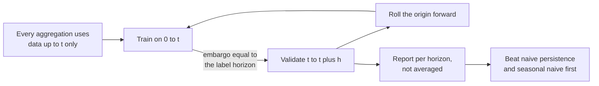

**Follow-ups:** Your walk-forward folds show wildly different scores. What does that tell you and what do you report to stakeholders? How do you build a training set when a key feature's values get restated 3 days after the fact?

</details>

### 36. How do you choose k in clustering, and how do you evaluate a clustering when you have no labels?

<details><summary><b>Answer</b></summary>

I try hard not to pick k in a vacuum, because the right k is almost always defined by what the clusters are *for*. If the output is 8 support macros, then k is near 8 and the question is whether the data supports it.

Mechanics for k-means: the elbow on inertia is weak (inertia decreases monotonically and the elbow is frequently invisible). Silhouette is better because it penalises overlap. If I switch to a Gaussian mixture I get BIC, which is a principled model-selection criterion, plus soft assignments.

My favourite honest check is **stability**: cluster bootstrap resamples and measure assignment consistency across runs with adjusted Rand index. Clusters that are not stable across resamples are not real, and this catches the noise-into-clusters failure that silhouette will happily wave through.

What people forget about k-means: it assumes roughly spherical, similar-sized, similar-density clusters, and it uses Euclidean distance, so features must be scaled. It will cheerfully chop one elongated cluster into three. When those assumptions break, use DBSCAN/HDBSCAN, which infer the cluster count, handle arbitrary shapes, and label outliers as noise instead of forcing every point somewhere. The price is tuning `min_samples`/`eps` and struggling with varying density, which HDBSCAN handles better. Agglomerative gives you a dendrogram and lets you defer the k decision.

On embeddings, which is the common case now (cluster user queries to discover intents): L2-normalize and use cosine, or spherical k-means. High-dimensional Euclidean distances concentrate and become uninformative. Reduce with PCA for speed, but validate in the original space rather than in the UMAP picture.

**Extrinsic beats intrinsic every time.** Hand-label a sample of clusters and check they are actionable, or measure whether the clustering improves the thing it feeds. And the practical 2026 trick: after clustering queries, ask an LLM to name each cluster from its members. If it cannot produce a coherent label, that is not a cluster.

**Follow-ups:** Silhouette says k=2, the product team needs ~10 actionable segments. What do you do? Why do high-dimensional Euclidean distances concentrate, and what does that do to k-means specifically?

</details>

### 37. What is conformal prediction, and how would you use it to put a statistical guarantee on a classifier's or an LLM pipeline's outputs?

<details><summary><b>Answer</b></summary>

Conformal prediction wraps any trained model and turns its scores into **prediction sets** with a guaranteed coverage rate: for a chosen error level α, the set contains the true label at least 1 − α of the time, averaged over new examples. It assumes nothing about the model being correct or calibrated, only that calibration and test data are **exchangeable** (roughly, drawn from the same distribution).

Split conformal, the version you actually ship:

1. Hold out a calibration set the model never trained on, a few hundred to a few thousand examples.
2. Define a nonconformity score, for example 1 − p(true class) for a classifier, or |y − ŷ| for regression.
3. Score every calibration example and take the ⌈(n+1)(1−α)⌉/n empirical quantile, q̂.
4. At inference, keep every label whose score is at most q̂. For regression that gives the interval ŷ ± q̂.

The set size is the useful signal. An easy input gets a singleton, an ambiguous one gets several labels, an out-of-scope one gets a large set. That maps straight onto product decisions: act automatically on singletons, route large sets to a human or a stronger model. The same machinery applies to LLM pipelines, for example choosing a threshold on a verifier or judge score so that answers accepted without review meet a target error rate. Conformal risk control generalises the guarantee from miscoverage to other bounded losses.

What candidates get wrong: the guarantee is **marginal**, averaged over inputs, not per input. A model can over-cover easy cases and under-cover a hard subgroup. Class-conditional or group-conditional conformal fixes that at the cost of more calibration data per group. And exchangeability breaks under distribution shift, so refresh the calibration set from recent traffic and monitor realised coverage in production like any other metric.

**Worth sketching.** The quantile step is the whole method, and placing it between the frozen model and the routing decision shows it is a thin, model-agnostic wrapper.

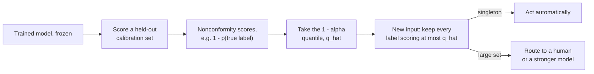

**Follow-ups:** Why the (n+1) correction in the quantile? How would you get coverage that holds per class rather than on average? Traffic shifts after a product launch: what happens to coverage, and how would you detect it?

</details>

### 38. A stakeholder asks which features drive your gradient-boosted model. Compare built-in importance, permutation importance and SHAP, and tell me where each one misleads.

<details><summary><b>Answer</b></summary>

All three answer "what does the model rely on". None of them answers "what causes the outcome", and they disagree in predictable ways. Say that first, because the stakeholder usually wants the causal answer.

- **Built-in (split-count or gain) importance** is free and the least trustworthy. Split count favours continuous and high-cardinality features that offer many split points, and gain is measured on training data, so it rewards features the trees used to fit noise. Fine for a quick look, not for a slide.
- **Permutation importance** shuffles one column on a held-out set and measures the metric drop. It is model-agnostic and tied to real predictive value. Two failure modes: correlated features (shuffle one of a pair and the model leans on the twin, so both look unimportant, and shuffling also creates unrealistic rows the model never saw), and cost, since it needs a scoring pass per feature per repeat.
- **SHAP** decomposes each individual prediction into additive per-feature contributions based on Shapley values, giving local explanations and, by averaging absolute values, a global ranking. TreeSHAP computes them exactly and quickly for tree ensembles. Caveats: results depend on the background data and on how "absent" features are simulated (interventional versus conditional), correlated features split credit in ways that look arbitrary, and a large SHAP value means "moved this prediction", not "would change the outcome if you intervened".

What I would actually do: permutation importance on held-out data for the global story, shuffling correlated clusters together so twins cannot hide each other. SHAP for individual decisions, such as reason codes on a credit decision. Partial dependence or ICE plots when someone asks about direction and shape. And if a feature ranks high and nobody can explain why, treat it as a leakage suspect before treating it as an insight.

When the real question is "what happens if we change X", the answer is an experiment or a causal model, not an attribution method.

**Follow-ups:** Two features are 0.95 correlated and both show near-zero permutation importance. What is going on, and how do you report it? Why might two SHAP tools give different values for the same model?

</details>

## Advanced

### 39. Why is MSE a bad loss for classification, even though it "works"? Connect it to the probabilistic view of loss functions.

<details><summary><b>Answer</b></summary>

Two independent arguments - mechanical and probabilistic - and a strong answer gives both.

**Mechanical: gradient starvation on confident mistakes.** For a sigmoid output p = σ(z) with MSE loss (p − y)², the gradient w.r.t. the logit is `2(p − y)·σ'(z)`, and σ'(z) = p(1−p) → 0 whenever the output saturates. So an example the model gets *confidently wrong* (p≈0, y=1) produces almost **no gradient** - precisely the examples that most need correction learn slowest. Cross-entropy's sigmoid/softmax gradient is `p − y` with no σ' factor: the derivative of the log exactly cancels the sigmoid's saturation, so confident errors get the largest updates. This also makes MSE-on-sigmoid non-convex in z per example with bad plateaus, whereas CE is convex in the logits.

**Probabilistic: wrong noise model.** Every loss is a negative log-likelihood under some noise assumption. MSE ⇔ Gaussian noise with fixed variance - a model for continuous targets that can be "off by 0.3." Class labels are categorical events; the correct likelihood is Bernoulli/categorical, whose NLL *is* cross-entropy. Using MSE asserts that predicting 0.7 for a true label 1 incurs the same kind of penalty as a regression miss, and it bounds the maximum penalty for total confidence in the wrong class at 1.0, where CE assigns unbounded penalty (−log p → ∞). CE is the negative log-likelihood of the categorical model, so training with it *is* MLE - which is why probabilities trained under CE are the ones with a clean probabilistic interpretation.

Nuance to volunteer: Brier score (MSE on probabilities) *is* a proper scoring rule and is used for evaluating calibration - the objection is about optimization dynamics and likelihood correctness for training, not that MSE on probabilities is meaningless. And regression flips everything: CE doesn't apply directly, MSE is exactly right under Gaussian assumptions, L1/Huber when you want robustness to outliers.

**Follow-ups:** Derive the p − y gradient and show where the cancellation happens. When would you use Brier score deliberately? What loss corresponds to Laplace noise, and when would you prefer it?

</details>

### 40. Explain contrastive learning and the InfoNCE loss. How are modern embedding models (CLIP, text retrievers) actually trained?

<details><summary><b>Answer</b></summary>

Contrastive learning trains an encoder so that "matching" pairs score high similarity and non-matching pairs score low - without per-example labels. **InfoNCE** operationalises it as cross-entropy over similarities: for query q with positive k⁺ among a set of negatives {kᵢ},

L = −log [ exp(sim(q,k⁺)/τ) / Σᵢ exp(sim(q,kᵢ)/τ) ]

i.e., an N-way classification where the "correct class" is the true partner. sim is usually cosine; **τ** (~0.05-0.1 typically; CLIP learns it, initialized to 0.07) sharpens the softmax so the loss concentrates on the hardest, most confusable negatives. Theoretically it's a lower bound on mutual information between the paired views (from the Contrastive Predictive Coding paper), though in practice people treat it as "softmax retrieval loss."

Where positives/negatives come from is the whole game:
- **CLIP**: positives are (image, caption) pairs from web data; negatives are all other pairs in the batch (**in-batch negatives**) - an N×N similarity matrix with a symmetric loss in both directions. Batch size is critical because it sets the number/difficulty of negatives; CLIP used ~32k.
- **Text embedding/retrieval models** (E5/GTE/BGE-style, DPR lineage): positives are (query, relevant passage); in-batch negatives are augmented with **hard negatives** mined by BM25 or a prior model - passages that are topically close but wrong, which teach fine-grained discrimination. Common recipe: large-scale weakly supervised contrastive pretraining on mined pairs, then fine-tuning on curated data with hard negatives, sometimes distilling from a cross-encoder reranker.
- **SimCLR-style self-supervised vision**: positives are two augmentations of the same image.

Failure modes worth naming: **false negatives** (in-batch "negatives" that are actually relevant) cap achievable quality on noisy data; small batches → easy negatives → mushy embeddings (memory banks/MoCo-style queues were built to fake bigger negative pools); and if you train with cosine+τ, you must serve with cosine (normalize before indexing).

**Worth sketching.** Once the similarity matrix is on the board, batch size and hard negatives stop being separate topics: they are both just columns in that softmax.

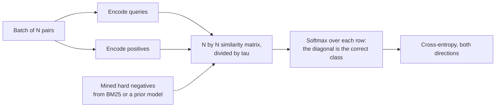

**Follow-ups:** Why do larger batches help contrastive training but matter less for standard supervised training? How do hard negatives change what the embedding space learns? How would you build the training set for a code-search embedder?

</details>

### 41. Beyond L1/L2: explain early stopping, data augmentation, and label smoothing as regularizers. What is regularization, really?

<details><summary><b>Answer</b></summary>

The unifying definition: regularization is any technique that reduces generalization error without (primarily) reducing training error - equivalently, anything that injects a **prior** or constrains effective capacity so the model prefers solutions likely to generalize.

**Early stopping** halts training when validation loss stops improving (with a patience window) and restores the best checkpoint. It restricts how far the weights travel from initialization - for quadratic losses it's formally equivalent to L2 regularization with strength inversely related to training time. It's free (you monitor val loss anyway) and is the de facto standard in fine-tuning. Caveat: it spends the validation set; the checkpoint you pick is tuned to it. LLM-era note: single-epoch pretraining rarely "overfits" classically, but SFT on 10k examples absolutely does - 1-3 epochs with checkpoint selection on held-out evals is the norm.

**Data augmentation** encodes invariances as synthetic data: crops/flips/colour jitter in vision (label shouldn't change under them), paraphrase/back-translation in classic NLP, SpecAugment in speech. It's a prior expressed through data rather than through the loss - often the strongest regularizer available because it directly attacks variance with (pseudo-)new samples. The LLM analogue is less "augmentation" and more synthetic data generation and prompt-format diversification during SFT, guarding against format overfitting.

**Label smoothing** replaces the one-hot target with (1−ε) on the true class and ε/(K−1) elsewhere (ε≈0.1). It stops the model from chasing infinite logit gaps, improves calibration in supervised classification, and was standard in Inception-era vision and machine translation. Caveats: it distorts the probability semantics slightly, and it's known to hurt distillation (teacher's non-target information gets flattened). It's generally *not* used for LLM pretraining, where matching the data distribution - including its genuine uncertainty - is the objective.

Also in the family: dropout, weight decay, small-batch gradient noise, and - the most underrated one - **more data**, which is why "collect/clean data" beats clever regularizers in most production settings.

**Follow-ups:** Why is early stopping ≈ L2 for quadratic losses - give the intuition. When does augmentation *hurt*? Why does label smoothing conflict with knowledge distillation?

</details>

### 42. What kinds of distribution shift exist, and how would you monitor a deployed model - classical or LLM-based - for them?

<details><summary><b>Answer</b></summary>

Three canonical types, distinguished by *what* changes between training and serving:

- **Covariate shift**: P(x) changes, P(y|x) stable - new user demographics, new device types, traffic mix changes. The model sees inputs unlike its training data.
- **Label/prior shift**: P(y) changes - fraud rate doubles during holidays; class frequencies move while the class-conditional behaviour holds.
- **Concept drift**: P(y|x) itself changes - the same input now means something else. Adversarial domains (fraud, spam, abuse) drift *because* your model exists; attackers adapt to it.

Monitoring stack, ordered by signal latency:
1. **Input drift** (immediate): compare live feature distributions to a training/reference window - PSI, KL divergence, Kolmogorov-Smirnov tests per feature; for unstructured inputs, monitor drift in **embedding space** (distance between live and reference embedding distributions).
2. **Prediction drift** (immediate): shifts in the output score distribution or predicted-class mix often flag trouble before labels arrive.
3. **Proxy/behavioural metrics** (fast): CTR, user corrections, thumbs-down rates, escalation-to-human rates, retry rates.
4. **Ground-truth metrics** (delayed): true accuracy/PR once labels land - chargebacks at 60 days, churn at 90. The delay is why layers 1-3 exist.
5. **Golden/canary sets**: fixed eval suites replayed on a schedule - regression detection independent of traffic.

For LLM systems specifically: the *query* distribution drifts (new topics, new jailbreak patterns), and - uniquely - the **model itself shifts under you** when a provider updates a hosted model or you change a prompt. Treat prompts+model versions like code: pin versions, run eval suites (LLM-judge with periodic human audit) on every change, log samples for offline re-scoring, and monitor output properties (length, refusal rate, tool-call rate, judge scores) as prediction-drift signals.

Responses: retrain/fine-tune on recent data, recalibrate thresholds (cheap, often sufficient for prior shift), or fix upstream data pipelines - a surprising fraction of "drift" alerts are broken feature pipelines, not the world changing.

**Follow-ups:** How do you distinguish concept drift from a data-pipeline bug? Prior shift only - can you fix it without retraining? Design the drift monitoring for a RAG-based support bot.

</details>

### 43. When does cosine similarity mislead you? Discuss embedding-space pathologies relevant to retrieval systems.

<details><summary><b>Answer</b></summary>

Cosine similarity is only as meaningful as the geometry of the space it's computed in, and several pathologies corrupt that geometry:

**Anisotropy.** Raw hidden states from language models occupy a narrow cone rather than spreading over the hypersphere - average pairwise cosine between *random* sentences can be very high (this is why early "BERT embeddings via mean pooling" underperformed plain averaged GloVe vectors on similarity tasks, as the Sentence-BERT paper showed). Consequence: absolute cosine values are uninterpretable; a 0.8 might be noise floor. Contrastive fine-tuning (the SimCSE lineage, and all modern embedders) explicitly spreads the space - the InfoNCE loss has a **uniformity** term pushing points apart and an **alignment** term pulling positives together. Practical rule: never ship nearest-neighbour search on base-LLM activations; use a contrastively trained embedder.

**Hubness.** In high dimensions, some points become "hubs" that appear in the k-NN lists of a disproportionate share of queries - an artefact of concentration of distances. Symptom: the same handful of chunks retrieved for everything. Mitigations: better embedders, score normalization per candidate, reranking with a cross-encoder.

**Training/serving metric mismatch.** A model trained with cosine (normalized) but indexed with raw inner product lets vector *norms* - which the training objective never disciplined - dominate rankings. Normalize at index time and query time, and configure the ANN index metric (IP vs L2 vs cosine) to match.

**Isotropic-but-meaningless directions.** Cosine weights all dimensions equally; if a few dimensions carry high-variance nuisance information (length, language, formatting), similarity reflects those. Whitening transforms and task-specific fine-tuning of the embedder partially address this.

**Task mismatch** - the subtlest one for RAG: "similar" is task-relative. Question-to-answer relevance is asymmetric; a question is often most cosine-similar to *other questions*, not to passages answering it. Hence instruction-prefixed asymmetric embedders (separate query/passage prompts, E5/BGE-style) and cross-encoder rerankers on the top-k.

**Follow-ups:** How would you detect hubness in a production RAG system? Why does a cross-encoder beat bi-encoder cosine, and why not use it for first-stage retrieval? What do alignment and uniformity mean in the Wang & Isola framing of contrastive learning?

</details>

### 44. What is maximum likelihood estimation? Show how it generates the standard loss functions, and where the Bayesian view (MAP) connects to regularization.

<details><summary><b>Answer</b></summary>

MLE picks parameters that make the observed data most probable under the model: θ* = argmax_θ Π p_θ(dataᵢ). You maximise the **log**-likelihood in practice - monotone (same argmax), turns the product into a sum (i.i.d. data → per-example losses that mini-batch cleanly), and avoids floating-point underflow from multiplying thousands of probabilities. A likelihood is *not* a probability distribution over θ - it's the data's probability viewed as a function of parameters; it needn't integrate to 1 over θ.

The generative move interviewers want: **choose a noise model, get a loss for free.**
- Categorical likelihood over classes/tokens → NLL = **cross-entropy**. LLM pretraining is MLE of the text distribution, token by token.
- Gaussian likelihood with fixed variance around a predicted mean → NLL = **MSE** (up to constants).
- Laplace noise → **L1/MAE** (hence its robustness to outliers - heavy tails expect occasional large errors).
- Bernoulli → binary cross-entropy; Poisson → Poisson regression loss.

So "which loss?" is really "which conditional distribution do I believe generated the targets?"

**MAP** (maximum a posteriori) adds a prior: maximise log p(data|θ) + log p(θ). A zero-mean Gaussian prior on weights adds −λ‖θ‖², i.e., **L2/weight decay**; a Laplace prior adds −λ‖θ‖₁, i.e., **L1**. Regularization is literally a prior belief that weights should be small - the Bayesian and the penalised-optimization views are the same math.

Properties worth citing: MLE is consistent and asymptotically efficient under regularity conditions, but with finite data it overfits - it happily assigns probability 1 to events seen once (the smoothing problem in classical n-gram LMs). Priors/regularization are the finite-data correction. One modern wrinkle: RLHF-style objectives leave the MLE framework - they optimise expected reward with a KL leash back to the MLE-trained reference model, which is why the KL term is there: it anchors the policy to the distribution MLE learned.

**Follow-ups:** Derive MSE from the Gaussian likelihood explicitly. Why does MLE + one observation of a rare event give pathological probabilities, and what's the fix? What role does the KL penalty play in RLHF from this viewpoint?

</details>

### 45. What is double descent, and how does it change the classical story about model size and overfitting?

<details><summary><b>Answer</b></summary>

Classical statistical learning predicts a U-shaped test-error curve in model capacity: underfit → sweet spot → overfit, with the worst behaviour when the model can exactly memorize the data. **Double descent** (Belkin et al. 2019; scaled up empirically in Nakkiran et al., "Deep Double Descent") shows what actually happens with modern networks: test error rises as you approach the **interpolation threshold** (capacity ≈ just enough to fit the training set, including its noise), *peaks there*, and then **falls again** as you keep growing the model far past it. The classical U is the left half of a larger curve.

Intuition for the second descent: at the interpolation threshold there's essentially one way to fit the data, and it's contorted - forced to thread through noisy labels with a strained function. With massive overparameterization, *many* interpolating solutions exist, and the optimizer's implicit bias (SGD-family methods preferring low-norm/"smooth" solutions) selects well-generalizing ones from that set. Memorizing the noise no longer forces global weirdness.

Nakkiran et al. showed the phenomenon along three axes: **model-wise** (bigger nets), **epoch-wise** (train longer through a mid-training test-error bump), and **data-wise** - the genuinely counterintuitive one, where *more data can transiently hurt* a fixed-size model by moving the interpolation threshold onto it. Label noise amplifies the peak; regularization and early stopping can smooth it away, which is why practitioners rarely see a clean double-descent curve in the wild.

Why it matters for the LLM era: it dissolves the "your model is too big, it will overfit" instinct and is consistent with scaling practice - larger transformers generalize better, and capacity is budgeted against compute and data (Chinchilla-style scaling laws), not against classical overfitting fears. Caveat a strong candidate adds: one-epoch pretraining on trillions of tokens sits far from the interpolation regime anyway - memorization concerns there are about privacy/contamination, not test loss.

**Follow-ups:** Where does the implicit bias of SGD enter this story? How can adding training data hurt - walk through the mechanism. Does double descent contradict the bias-variance decomposition or just the classical capacity narrative?

</details>

### 46. Your LLM pretraining loss just spiked. Talk me through training stability: gradient clipping, mixed precision, and your debugging playbook.

<details><summary><b>Answer</b></summary>

Loss spikes are endemic to large-scale transformer training - occasional bad batches, attention-logit blowups, or optimizer state getting mis-scaled produce a huge gradient, a destructive update, and a loss that jumps and either recovers slowly, plateaus higher, or diverges.

**Standing defences** in every serious recipe:
- **Gradient clipping by global norm** (typically 1.0): compute the norm over all parameters; if it exceeds the threshold, rescale the whole gradient vector. Preserves direction, caps magnitude. Clipping *frequency* is itself a health metric - clipping every step means your LR is too high.
- **Mixed precision done right.** fp16 has a tiny dynamic range (max ~65k, and underflow is the bigger killer) and requires **loss scaling** - multiply the loss by a factor so small gradients survive fp16, unscale before the optimizer step, and skip steps whose gradients contain inf/NaN (dynamic loss scaling automates this). **bf16** keeps fp32's 8 exponent bits at lower mantissa precision, eliminating loss scaling - the standard mixed-precision format on current GPUs and TPUs. Large runs increasingly push the matmuls further to **FP8** with fine-grained (per-block) scaling, as DeepSeek-V3 reported, while keeping sensitive ops in higher precision. Either way, keep **fp32 master weights and optimizer states**; accumulate large reductions in fp32.
- **Architectural/objective stabilisers**: pre-norm placement, QK-norm to stop attention-logit growth, and an auxiliary **z-loss** (used in PaLM, ~1e-4 · log²Z) keeping the softmax normalizer from drifting.
- Warmup + sane peak LR, β₂ ≈ 0.95 (shorter second-moment memory reacts faster to gradient-scale changes than 0.999).

**The playbook when a spike hits**: check grad-norm and per-layer norm logs - a grad-norm spike *preceding* the loss spike implicates optimization; no grad spike suggests data. Inspect the offending batch (corrupt documents, pathological repetition - data issues are the most common culprit). Standard remediations, escalating: rely on clipping and let it recover; **rewind to the last good checkpoint and skip the offending data batches** (the PaLM paper describes exactly this, and OPT's public logbook documents repeated rollbacks); lower peak LR; add stabilisers (QK-norm, z-loss). Also rule out infrastructure: a flaky GPU producing silent NaNs looks exactly like an optimization problem - per-rank gradient-norm logging localises it.

**Worth sketching.** The first branch is the whole playbook: whether the grad-norm moved before the loss did tells you if this is optimization, data, or hardware.

```mermaid
flowchart TD
    A["Loss spike"] --> B{"Grad-norm spike<br/>before the loss spike?"}
    B -->|"yes"| C["Optimization: lower peak LR,<br/>check how often clipping fires"]
    B -->|"no"| D["Data: inspect the batch for<br/>corrupt docs or pathological repetition"]
    B -->|"one rank only"| E["Infrastructure: flaky device<br/>emitting silent NaNs"]
    D --> F["Rewind to the last good<br/>checkpoint, skip that shard"]
    C --> G["Add stabilisers: QK-norm,<br/>z-loss, beta2 at 0.95"]
    F --> G
```

**Follow-ups:** Why does bf16 remove the need for loss scaling - what's the actual bit-level difference? Why lower β₂ for LLMs? Clipping fires on 40% of steps - what do you change?

</details>

### 47. Design the evaluation for a fraud model at 0.1% prevalence, end to end: metrics, thresholding, validation protocol, and monitoring.

<details><summary><b>Answer</b></summary>

This is a synthesis question - the interviewer wants the imbalance, calibration, leakage, and drift threads woven into one coherent design.

**Metrics.** Rule out accuracy (99.9% baseline) and be suspicious of ROC-AUC (FPR diluted by ~999:1 negatives). Primary offline metrics: **PR-AUC** for model comparison, plus operating-point metrics tied to capacity - if the fraud-ops team reviews 500 alerts/day, report **precision@500/day** and the recall achieved there; alternatively recall at a fixed FPR. Express the final objective in money: expected cost = FN_count·(avg fraud loss) + FP_count·(review cost + customer-friction cost).

**Thresholding.** Train a scorer, then **calibrate** on held-out data (isotonic or temperature/Platt - and recalibrate *after* any class reweighting or resampling, which biases probabilities). Choose the threshold minimising expected cost on validation; consider two thresholds (auto-block above high, human review in the middle band).

**Validation protocol.** Strictly **temporal splits** - train on months 1-9, validate on 10, test on 11-12 - because fraud drifts and adversaries adapt; random splits inflate results. **Entity-level grouping** so no card/account/device spans splits (group leakage otherwise lets the model recognise entities). Handle **label latency**: chargebacks take 30-90 days to arrive, so recent data has censored labels - evaluate on a window mature enough for labels to settle, and be explicit about it. Audit features for target leakage (anything downstream of a fraud decision, like "account_frozen"). Run **adversarial validation** to confirm train/test aren't trivially distinguishable for spurious reasons.

**Monitoring.** Immediate: input-feature drift (PSI/KS vs reference), score-distribution drift, alert volume. Fast proxies: review-queue precision (human analysts label alerts daily - a live precision estimate). Delayed: recall against matured chargeback labels, reported with the built-in lag. Feedback-loop trap: you only get labels for what you *investigate*, so blocked/ignored transactions are unlabeled - mitigate with a small exploration budget (let a random ~0.1% sample through un-actioned, or use analyst deep-dives) to estimate uncensored recall. Retrain cadence triggered by drift alarms, not just calendar.

**Worth sketching.** The exploration arrow bypassing the review queue is the detail that separates a real design from a textbook one: without it you never see uncensored recall.

```mermaid
flowchart LR
    A["Temporal split:<br/>months 1-9, 10, 11-12"] --> B["Group by card,<br/>account and device"]
    B --> C["Train scorer"]
    C --> D["Calibrate on held-out data,<br/>after any reweighting"]
    D --> E["Threshold on expected cost:<br/>block, review, or allow"]
    E --> F["Review queue,<br/>500 alerts per day"]
    F --> G["Analyst labels give<br/>precision daily"]
    G --> H["Chargebacks at 30-90 days<br/>give recall, with the lag"]
    E -->|"0.1% exploration sample<br/>passes un-actioned"| H
```

**Follow-ups:** How exactly does the selective-labels problem bias naive retraining? The ops team's capacity halves - what changes in your metric and threshold? How do you A/B test a new fraud model when the intervention itself changes the labels you observe?

</details>

### 48. Your model hits 0.87 AUC offline, you launch it, and the business metric doesn't move. Debug it.

<details><summary><b>Answer</b></summary>

I split this into seven hypotheses and attack them in cost order, because most of them are cheaper to check than "retrain the model."

1. **The experiment is broken.** Check sample ratio mismatch and exposure logging first. If the split is off or you are logging exposures for treatment only, every number is fiction.
2. **Training-serving skew.** Compare the online prediction distribution against offline. Skew shows up instantly as a shifted histogram. Then replay logged feature vectors through the training pipeline and diff. Nonzero diff rate equals bug.
3. **The offline metric is the wrong metric.** AUC measures ranking across the whole population, but you only act on the top 1%. It says nothing about calibration, and nothing about the threshold you actually deployed. Precision at the operating point may be terrible while AUC looks great.
4. **The decision layer eats the model.** Capacity constraints, a business rule overriding predictions, a threshold nobody retuned. The model can be right and never get to act.
5. **The label is not the objective.** You predicted "will churn" and the business wants "will be retained by our intervention." Ranking by P(event) targets people who would do it anyway. That is a causal problem, and no amount of AUC fixes it. The answer is a randomized holdout and uplift modelling, not a better classifier.
6. **The action is weak.** Excellent prediction, but the intervention it triggers does not change behaviour.
7. **Power.** The test may simply be too small to see the true effect, which could be real but modest.

Sequencing: experiment health, then skew, then decision layer, then the causal question, then power. Concretely, if online AUC on delayed labels is *also* 0.87 and the metric is still flat, the model is fine and the problem is causality or the action. That is the branch most candidates never reach.

The senior signal here is being willing to land on "ML is not the lever for this problem" and say it out loud, with evidence, rather than shipping v2 of a model that was never the bottleneck.

**Worth sketching.** Ordering the branches by cost is the signal here: you rule out plumbing before you touch the model, and the last box is where most candidates never arrive.

```mermaid
flowchart TD
    A["0.87 offline,<br/>business metric flat"] --> B{"Sample ratio and exposure<br/>logging clean?"}
    B -->|"no"| C["The experiment is broken,<br/>every number is fiction"]
    B -->|"yes"| D{"Online score distribution<br/>matches offline?"}
    D -->|"no"| E["Training-serving skew:<br/>replay logged vectors and diff"]
    D -->|"yes"| F{"Does the decision layer<br/>act on the score?"}
    F -->|"no"| G["Stale threshold, capacity cap,<br/>or a business rule overriding it"]
    F -->|"yes"| H["Causal: you ranked risk,<br/>the business needs persuadability"]
```

**Follow-ups:** You find online AUC matches offline and the intervention is randomized. What is left, and how do you quantify it? How would you have caught the "predicting churn instead of persuadability" mistake before launch?

</details>

### 49. Attention vs convolution: compare them as inductive biases, and tell me what that implies for architecture choice.

<details><summary><b>Answer</b></summary>

Convolution hardcodes locality and translation equivariance with weight sharing. Attention hardcodes almost nothing and instead *learns* which positions interact, with mixing weights computed from the content itself.

Mechanically: a conv layer applies a fixed kernel independent of input content over a fixed local window. Receptive field grows linearly with depth (exponentially with dilation), and parameter count is O(k·C_in·C_out) regardless of input size. Self-attention computes an input-dependent all-pairs mixing matrix: dynamic weights, global receptive field in a single layer, permutation-equivariant so position must be injected explicitly. The bill is O(n²·d) versus O(n·k·d).

The governing principle is the **bias/data tradeoff**. A strong prior is worth a great deal when data is scarce and costs you when data is abundant. Vision transformers underperform CNNs when trained from scratch on ImageNet-scale data and overtake them once pretrained on substantially larger corpora (DeiT later closed much of the small-data gap with heavy augmentation and distillation, which is just another way of supplying the prior), because the prior a CNN hands you for free is something attention can learn if you show it enough examples. That is the lesson of the last decade compressed into one comparison: general architectures plus scale beat hand-built priors past a data threshold, and below that threshold the prior wins.

Attention can express convolution (learn a local, position-only mask) but pays quadratic cost for the privilege. Which is why in practice everything converged on hybrids: conv stems and patchify layers in vision transformers, depthwise convolutions interleaved with attention in speech models, sliding-window and local attention in long-context LLMs. That last one is literally reintroducing the locality prior because the quadratic cost became the binding constraint. The state-space and linear-attention line does the same thing with a recurrent prior to recover O(n).

What this changes in my decisions: with thousands of examples and a strongly local signal, use a conv or a pretrained conv backbone. With a pretrained transformer available and long-range or content-dependent interactions, use attention. Data volume and the compute budget decide, not which architecture is currently fashionable.

**Follow-ups:** Sliding-window attention reintroduces locality. Does that make it strictly worse than full attention on quality, and how would you measure it? Why is permutation equivariance a problem for attention but not for convolution?

</details>

### 50. Your churn model has 0.9 AUC. Product wants to send retention discounts to the top 5%. Why might that be a bad plan?

<details><summary><b>Answer</b></summary>

Because a churn model predicts who will leave, not who can be *saved*, and those are different people. The top 5% by P(churn) is full of customers who are already gone (discount wasted) and misses the persuadable middle entirely. What you need is a treatment effect: `P(stay | discount) - P(stay | no discount)` per user. That is uplift, or CATE, and it is not what your model estimates.

Worse, the model was trained on observational data where discounts were already assigned non-randomly. If agents handed discounts to complaining customers, then "received discount" correlates with churning, and the model can happily learn that discounts cause churn. That is confounding, and better AUC makes it more confidently wrong, not less.

What I would do: create unconfounded data by **randomly withholding** the discount from a slice, then fit an uplift model on it. Options: T-learner (fit outcome models per arm and subtract; simple, high variance), S-learner (treatment as a feature; can ignore it entirely when the effect is small), X-learner (better with imbalanced arms), or causal forests and doubly-robust learners that target the effect directly. Evaluate with Qini or uplift curves on a randomized test set. Not AUC.

The four-group framing is worth naming: persuadables, sure things, lost causes, and sleeping dogs. **Sleeping dogs are the real hazard** - customers whose retention you actively damage by reminding them you exist. A P(churn) ranking cannot distinguish them from persuadables; an uplift model assigns them negative lift.

When randomization is impossible: propensity weighting or matching, difference-in-differences with an explicit parallel-trends check, instrumental variables, regression discontinuity. All rest on untestable assumptions, mainly no unmeasured confounders, so I state the assumption rather than pretend the estimate is clean. And draw the DAG before choosing controls, because conditioning on a mediator or a collider manufactures bias where none existed.

The framing to leave them with: incrementality is the metric. Campaigns that "target high-converters" routinely have near-zero incremental lift, and a holdout is the only way to know.

**Worth sketching.** Fanning the top 5% into four groups shows why a better churn model cannot fix this: the ranking cannot separate the branches at all.

```mermaid
flowchart TD
    A["Rank by P(churn)"] --> B["Top 5% is a mix"]
    B --> C["Lost causes:<br/>leave regardless"]
    B --> D["Sure things:<br/>stay regardless"]
    B --> E["Sleeping dogs:<br/>the discount makes it worse"]
    B --> F["Persuadables:<br/>the only ones worth paying"]
    G["Randomly withhold the<br/>discount from a slice"] --> H["Fit uplift on that data,<br/>score with Qini not AUC"]
    H --> F
```

**Follow-ups:** You have no budget for a randomized holdout. What is your next best option and what assumption are you buying? Why does an S-learner tend to underestimate treatment effects?

</details>

### 51. Your model meets quality but runs at 4s p95 and you need 400ms with 10x the throughput. Design the compression plan.

<details><summary><b>Answer</b></summary>

Measure first, and establish whether you are compute-bound or memory-bandwidth-bound, because the answer picks the technique. Autoregressive decode at small batch is bandwidth-bound (every token reads all the weights), so weight-only quantization buys close to linear speedup. As you raise batch size to hit the throughput target, decode drifts toward compute-bound and the KV cache becomes the memory you are actually reading. Prefill is compute-bound, so it wants lower-precision *math*, not just smaller weights. Getting this backwards is how people quantize aggressively and see no latency win.

Order of operations, cheapest first:

1. **Serving-level wins that cost zero quality.** Continuous batching, paged KV cache, prefix caching for shared system prompts, and speculative decoding with a small draft model. Speculative decoding is lossless: the accept/reject rule preserves the target model's output distribution exactly. Do all of this before touching weights.
2. **Post-training quantization.** 8-bit weight-only is typically a rounding error in quality. 4-bit with group-wise scales (GPTQ/AWQ-style) costs more and needs a real eval. FP8 on Hopper-class and newer GPUs gives compute speedup as well as size reduction, and Blackwell-class hardware adds block-scaled 4-bit formats (NVFP4, MXFP4) for teams willing to run the eval. Quantizing the KV cache matters specifically for long context, where it can dominate memory.
3. **Distillation into a smaller model.** Biggest win, biggest project. Train the student on the teacher's outputs, ideally soft logits or on-policy sequences over *your* task distribution. Task-specific distillation goes far further than general distillation; a small student on a narrow task can match a much larger generalist.
4. **Structured pruning or layer dropping plus a healing fine-tune.** Unstructured sparsity rarely pays without hardware support for it.

PTQ versus QAT: PTQ takes hours with a calibration set. QAT costs a training run but recovers quality at aggressive bit widths. Start with PTQ, escalate only when the eval says you must.

What I insist on: a per-technique eval on my golden set *plus* a tail regression check. Compression damages rare capabilities and long-context behaviour first, and aggregate benchmark averages hide exactly that. And measure p95 under realistic concurrency, not single-request latency.

Often the best move is not compression at all: **route**. A small model handles the easy majority of traffic, escalate to the large one on an uncertainty signal. That usually beats degrading everything uniformly.

**Worth sketching.** Leading with the bottleneck branch shows the interviewer you know where the time actually goes, rather than reaching for quantization by reflex.

```mermaid
flowchart TD
    A["Measure p95 under<br/>realistic concurrency"] --> B{"Decode-bound or<br/>prefill-bound?"}
    B -->|"decode: memory bandwidth"| C["Weight-only and KV cache<br/>quantization"]
    B -->|"prefill: compute"| D["FP8 or lower-precision math"]
    A --> E["Free first: continuous batching,<br/>paged KV, prefix cache,<br/>speculative decoding"]
    C --> F{"Still above 400ms?"}
    D --> F
    E --> F
    F -->|"yes"| G["Distil a student on your task,<br/>or route easy traffic to a small model"]
    F -->|"no"| H["Stop. Run the tail<br/>regression eval"]
```

**Follow-ups:** Your 4-bit model matches on aggregate benchmarks but users complain. How do you find what broke? Why is speculative decoding lossless, and what determines whether it actually speeds you up?

</details>

### 52. You have 10M unlabelled examples and budget for 20k labels. How do you spend it?

<details><summary><b>Answer</b></summary>

The first ~2k go to a **random sample**, not to anything clever. I need an unbiased eval set and a baseline before any acquisition strategy means anything. Skip this and you have no way to know whether active learning helped.

Then iterate against that baseline. Acquisition options:

- **Uncertainty sampling** (margin, entropy, least-confidence). Cheap and effective, but it collects redundant near-duplicates and over-samples outliers and mislabels.
- **Diversity / coverage** (core-set, cluster-then-sample in embedding space). Complements uncertainty rather than competing with it.
- **Hybrid batch-mode selection**, maximising uncertainty subject to diversity. This is what actually works, because you label in batches of thousands, not one at a time, and pure uncertainty gives you a thousand copies of the same confusing case.
- **Ensemble disagreement** as the uncertainty signal when raw confidence is uncalibrated, which it usually is.

Traps that separate people who have run this from people who have read about it:

1. **The labelled set becomes non-iid.** You cannot use it as a test set and you cannot estimate prevalence from it. The random eval set stays sacred and separate.
2. **Cold start.** Uncertainty sampling driven by a garbage initial model is worse than random.
3. **Rare classes break it.** With 0.5% positives, uncertainty sampling burns budget on the boundary and never finds new positives. For rare-event discovery, use targeted search instead: embedding kNN from known positives, high-recall weak rules, stratified sampling.
4. **Model coupling.** Labels acquired via one model family are biased toward that family's blind spots and may not transfer to your next architecture.

The 2026 reframing matters more than any of the above. Use a strong LLM to pre-label all 10M cheaply, then spend human budget on three things: a rigorously adjudicated gold eval set, the items where model self-consistency or ensemble disagreement is high, and an audit sample to estimate the pre-label error rate with a confidence interval. That converts 20k human labels into 10M labels of measured quality. Human effort goes exactly where model labels are least trustworthy, which is the whole point of active learning anyway, just with a much better base learner.

**Worth sketching.** Splitting the budget into three named buckets on the board makes the argument concrete: humans go where model labels are least trustworthy.

```mermaid
flowchart TD
    A["10M unlabelled,<br/>20k label budget"] --> B["2k random: the eval set,<br/>kept iid and sacred"]
    A --> C["Strong model pre-labels<br/>all 10M cheaply"]
    C --> D["Audit sample: error rate<br/>with a confidence interval"]
    C --> E["High ensemble disagreement<br/>or low self-consistency"]
    E --> F["Spend remaining human<br/>budget here"]
    B --> G["Did acquisition actually<br/>beat random?"]
    F --> G
    D --> G
```

**Follow-ups:** How do you estimate the true error rate of 10M model-generated labels from an audit sample, and how big does the sample need to be? Your uncertainty sampling keeps surfacing the same ambiguous case. What does that tell you about the task, not the model?

</details>

### 53. Why do ensembles work, when are they worth the cost, and where do they show up in LLM systems?

<details><summary><b>Answer</b></summary>

Ensembles work by averaging away uncorrelated errors, and the gain is driven by how *decorrelated* the members are, not how many there are. If you average M models with individual error variance σ² and mean pairwise correlation ρ, the ensemble's variance is roughly `ρσ² + (1-ρ)σ²/M`. Grow M and the second term vanishes, but the `ρσ²` floor stays. That single expression explains everything: ten seeds of the same architecture on the same data have high ρ and give you a modest win; genuinely different model classes give more.

The taxonomy follows from it. **Bagging** trains high-variance learners in parallel on bootstrap samples and averages, reducing variance. Random forest adds random feature subsets specifically to lower ρ, which is the entire trick. **Boosting** trains high-bias weak learners sequentially on residuals, reducing bias, but members are correlated by construction and it will overfit label noise. **Stacking** fits a meta-learner on out-of-fold predictions of diverse base models, and it must be out-of-fold or you leak. Plain probability averaging is a strong baseline, usually within a hair of stacking with none of the leakage risk.

Cheap variants: snapshot ensembles over a cyclic LR schedule, and MC dropout. Lower cost, correspondingly lower diversity. Weight averaging (SWA, model soups) is a different animal entirely - one model at inference, so no serving cost at all.

When it is not worth it: 10x inference cost for ~1 point is a bad trade in production. Ensembles are also harder to monitor, debug and calibrate; averaging well-calibrated models produces an under-confident result. The usual right move is to ensemble offline to find the achievable ceiling, then distil the ensemble into a single model.

LLM-era ensembling is alive and renamed. **Self-consistency** (sample k chains, majority vote) is bagging over stochastic decodes. **Best-of-n with a verifier or reward model** is a selection ensemble. **Multi-model juries** for evals reduce single-model idiosyncrasy. All of these are test-time compute, and the cost/quality curve is the classic ensembling tradeoff with tokens as the currency.

**Follow-ups:** Self-consistency with 8 samples helps on maths and barely moves open-ended generation. Why? You have a 5-model ensemble that beats your single model by 2 points. Walk me through distilling it and what you expect to lose.

</details>

### 54. What is the Muon optimizer, how does it differ from AdamW, and why have some frontier pretraining runs adopted it?

<details><summary><b>Answer</b></summary>

Muon treats each hidden weight matrix as a matrix rather than a bag of independent scalars. It keeps a momentum buffer like SGD, then replaces that momentum matrix with its nearest **semi-orthogonal** matrix (singular values pushed to roughly 1) before applying it. AdamW instead rescales every element independently by its own running gradient variance.

Why orthogonalize: updates for transformer weight matrices tend to be close to low-rank, dominated by a few singular directions. Applied directly, they mostly move the weights along those few directions. Equalising the singular values gives rare but useful directions a comparable step. One reading is steepest descent under a spectral-norm constraint, which suits matrices that act as linear maps.

Mechanics worth knowing:

- An exact SVD every step is too expensive, so Muon runs about five **Newton-Schulz iterations**, a matmul-only polynomial that approximately orthogonalizes and runs fine in bf16.
- It applies only to hidden 2D matrices. Embeddings, the output head, biases and norm gains stay on AdamW, so a real run uses two optimizers.
- It keeps one state buffer instead of Adam's two, roughly halving optimizer memory for those parameters.
- Scaling it needed extra work: decoupled weight decay, and per-matrix update scaling so the update size matches AdamW's and existing LR schedules transfer. Moonshot's MuonClip adds QK-clip, rescaling query and key weights when attention logits grow too large, which they credit for a spike-free Kimi K2 pretraining run.

Evidence: Muon set records in NanoGPT speedrun-style benchmarks by reaching target loss in fewer steps, and Moonshot and Zhipu report using it to pretrain Kimi K2 and GLM-4.5. Costs: Newton-Schulz adds compute per step, and each orthogonalization needs the full matrix, which complicates sharded training.

AdamW remains the safe default and the baseline for fine-tuning. What interviewers probe is the reasoning: matrix geometry rather than elementwise scaling.

**Worth sketching.** Splitting parameters into two optimizer paths is the practical detail people forget, and it shows exactly where orthogonalization happens.

```mermaid
flowchart TD
    A["Gradient for each parameter"] --> B{"Hidden 2D<br/>weight matrix?"}
    B -->|"yes"| C["Momentum buffer"]
    C --> D["About 5 Newton-Schulz steps:<br/>singular values pushed to 1"]
    D --> E["Rescale to AdamW-like<br/>update size, apply decay"]
    B -->|"no: embeddings, head,<br/>norms, biases"| F["AdamW update"]
    E --> G["Updated weights"]
    F --> G
```

**Follow-ups:** Why might switching to Muon to fine-tune an AdamW-pretrained model go badly? How does QK-clip differ from QK-norm? What does Muon's need for the full matrix do to ZeRO or FSDP sharding?

</details>

### 55. What is superposition in neural networks, and how do sparse autoencoders try to recover interpretable features from it? Where have they fallen short?

<details><summary><b>Answer</b></summary>

Superposition is the hypothesis that a network represents more features than it has neurons by storing them as nearly orthogonal directions in activation space, rather than one feature per neuron. High-dimensional spaces hold far more than d almost-orthogonal directions, and if features are sparse (rarely active together) the interference between them is tolerable. The visible symptom is **polysemantic neurons**: one unit fires for unrelated concepts, so neuron-by-neuron interpretation fails.

A **sparse autoencoder (SAE)** is dictionary learning aimed at undoing that. Collect activations from one layer, often the residual stream, then train an encoder-decoder many times wider than the layer to reconstruct them through a hidden layer forced to be sparse, with an L1 penalty or a hard TopK constraint. Each hidden unit is a candidate feature with its own decoder direction. Anthropic, OpenAI and Google DeepMind scaled this to large models (Claude 3 Sonnet, GPT-4, the Gemma 2 family) and found many features that read as monosemantic and that can be clamped up or down to steer behaviour.

Where it falls short, which a strong answer says plainly:

- **Reconstruction is lossy.** Splicing SAE outputs back into the model raises its loss noticeably, so the dictionary misses part of what the model computes.
- **Features depend on choices.** Dictionary size, sparsity strength and layer change which features appear, and large dictionaries split one concept into many near-duplicates.
- **Labels are interpretations.** Feature names come from humans or another model reading top activations, and can be confidently wrong.
- **Downstream utility is mixed.** Google DeepMind's interpretability team reported in 2025 that SAE-based probes underperformed plain linear probes at detecting harmful intent out of distribution, and deprioritised fundamental SAE work as a result.

The working picture: SAEs and their successors (transcoders, attribution-graph circuit tracing) are good exploratory tools for generating hypotheses about mechanisms. When you have labels for the concept you care about, a linear probe is the cheap, strong baseline to beat.

**Follow-ups:** Why does feature sparsity make superposition cheap? An SAE feature fires on deception-related text: what would you need before calling it a deception detector? When would you choose a linear probe over an SAE?

</details>
