# LLM & Transformer Fundamentals - Interview Questions

65 questions: 18 basic, 25 intermediate, 22 advanced.

> **On the diagrams: drawing is optional.** Some answers include a small sketch you could
> reproduce on a whiteboard or in a shared doc. You never have to draw anything to score well,
> and a clear spoken answer stands on its own. But in architecture, pipeline, and system design
> questions, sketching while you talk keeps the interviewer with you and shows you can structure
> a problem. Treat these as good to have, not as homework.

## Basic

### 1. Why did transformers replace RNNs and LSTMs for language modeling?

<details><summary><b>Answer</b></summary>

Two reasons: parallelism and gradient paths. RNNs process tokens sequentially - hidden state t depends on t−1 - so training can't parallelize across the sequence dimension, and information from early tokens must survive hundreds of recurrent steps, where it degrades even with LSTM gating. Transformers compute attention over all positions simultaneously: one matrix multiply processes the whole sequence, so training saturates GPUs/TPUs, and any token can attend to any other token through a path of length one, so long-range dependencies don't decay through recurrence.

The parallelism point is the economically decisive one. Next-token prediction with a causal mask gives you a training signal at *every* position of a sequence from a single forward pass - an n-token document yields n loss terms computed in parallel. That efficiency is what made training on trillions of tokens feasible, which is what made scaling laws discoverable, which is what produced modern LLMs.

Worth noting the honest tradeoffs: RNNs have O(1) state per step at inference, while transformers pay O(n²) attention compute and an O(n) KV cache that grows with context. That's why there's active work on state-space models (Mamba-style architectures) and hybrid designs - they revisit the recurrent idea with parallelizable training. But for training-time throughput and quality at scale, attention won, and everything at the frontier today is transformer-based or transformer-hybrid.

A good answer also mentions that self-attention is permutation-invariant, so transformers need explicit positional information (RoPE etc.) - the sequential order RNNs got for free has to be injected.

**Worth sketching.** Two rows on the board: it makes the gradient path length and the parallelism argument visible at the same time.

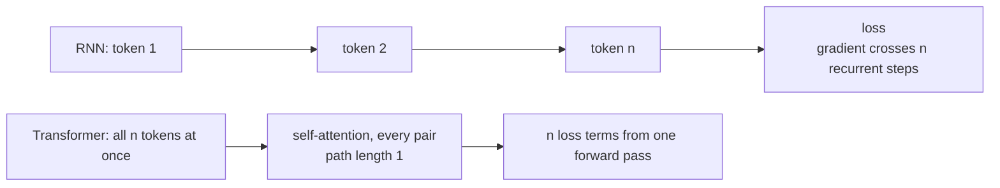

**Follow-ups:** What's the inference-time cost transformers pay that RNNs don't? Why does causal masking make training so sample-efficient per forward pass? What are state-space models trying to recover?

</details>

### 2. Walk me through what happens inside a single transformer decoder block.

<details><summary><b>Answer</b></summary>

A decoder block takes hidden states of shape (n_tokens × d_model) and applies two sublayers, each wrapped in a residual connection with a normalization:

1. **Norm → masked self-attention → add.** The input is normalized (RMSNorm in modern models), then projected into queries, keys, and values. Scaled dot-product attention with a causal mask mixes information *across positions* - each token gathers a weighted summary of earlier tokens. The result goes through an output projection and is *added* to the original input (residual).
2. **Norm → MLP → add.** The updated stream is normalized again and passed through a position-wise feed-forward network - typically up-project to ~3-4× d_model, nonlinearity (SwiGLU in Llama-family models), down-project - applied identically and independently at every position. Added back to the residual stream.

So the division of labour is: **attention moves information between tokens; the MLP transforms information at each token** (it's where most parameters and, plausibly, most stored "knowledge" live). The residual stream acts as a shared workspace that each sublayer reads from and writes small updates into - a framing that explains why you can stack 100+ blocks: the identity path means each block only needs to make an incremental refinement.

Placement of the norm matters: modern models are **pre-norm** (norm inside the residual branch), which keeps the residual path clean and training stable at depth; the 2017 original was post-norm. In a real model each attention sublayer also applies RoPE to Q and K, and the block repeats N times (e.g. 32 blocks for a 7-8B model, 80 for a 70B), followed by a final norm and the LM head projecting to vocabulary logits.

**Worth sketching.** Draw the residual line straight across first, then hang the two sublayers off it: that ordering is the whole point of the block.

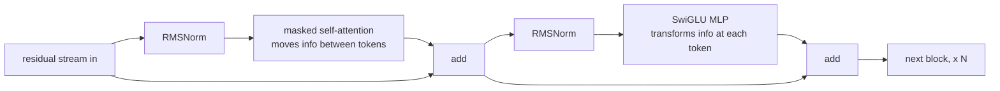

**Follow-ups:** Roughly what fraction of a block's parameters are in the MLP vs attention? Why do residual connections matter more as depth grows? What changes in this picture for an MoE model?

</details>

### 3. Explain self-attention step by step. What exactly are Q, K, and V?

<details><summary><b>Answer</b></summary>

Every token's vector is linearly projected three ways: a **query** ("what am I looking for?"), a **key** ("what do I contain, for others to match against?"), and a **value** ("what content do I contribute if attended to?"). Attention is a soft, differentiable key-value lookup: token i's query is compared to every token's key; the resulting weights mix the values.

Steps, for X of shape (n, d_model):

1. Q = XW_q, K = XW_k, V = XW_v - three learned projections.
2. Scores = QKᵀ / √d_k - an (n, n) matrix; entry (i, j) is how relevant token j is to token i.
3. Apply the causal mask: set scores where j > i to −∞.
4. Row-wise softmax → each row becomes a probability distribution over previous positions.
5. Output = weights · V - each token's output is a convex combination of value vectors, then a final output projection W_o maps back to d_model.

```python
import numpy as np
def attention(Q, K, V, causal=True):
    s = Q @ K.T / np.sqrt(K.shape[-1])
    if causal:
        s[np.triu(np.ones_like(s, dtype=bool), k=1)] = -np.inf
    w = np.exp(s - s.max(-1, keepdims=True))
    w /= w.sum(-1, keepdims=True)
    return w @ V
```

The crucial conceptual point: the weights are **computed from the data at runtime**, not fixed like convolution kernels. The same layer can route "pronoun → antecedent" in one sentence and "verb → subject" in another. Why separate K and V? Because what makes a token *findable* (key) and what it should *deliver* once found (value) are different roles - collapsing them forces one vector to serve both, which is measurably worse.

**Worth sketching.** It keeps the three projections and the two matmuls straight, which is where people fumble under pressure.

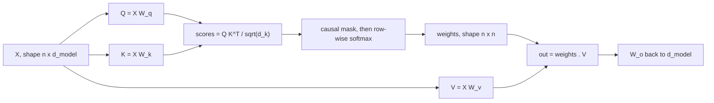

**Follow-ups:** Why divide by √d_k? What is the computational complexity of step 2 and what does that imply for long contexts? In a decoder generating token-by-token, which of Q, K, V get cached and why?

</details>

### 4. Why does scaled dot-product attention divide by √d_k?

<details><summary><b>Answer</b></summary>

To keep the softmax from saturating. If the components of q and k are roughly independent with zero mean and unit variance, their dot product q·k is a sum of d_k terms and has variance ≈ d_k - so the standard deviation of the logits grows like √d_k. With d_k = 128, unscaled logits routinely reach magnitudes of ±20 or more.

Softmax of large-magnitude logits collapses to nearly one-hot: one attention weight ≈ 1, the rest ≈ 0. In that regime the softmax's Jacobian is nearly zero (the gradient of softmax involves p·(1−p) terms, which vanish as p → 0 or 1), so almost no gradient flows back through the attention scores. Early in training that means the attention layers barely learn; it can also cause loss spikes and instability. Dividing by √d_k renormalizes the logit variance back to ~1 regardless of head dimension, keeping the softmax in a regime with usable gradients and appropriately soft attention distributions.

Two points that distinguish a strong answer:

- It's a **variance argument about initialization/training dynamics**, not a mathematical requirement - the model could in principle learn scaled-down projections, but starting saturated makes optimisation much harder.
- The same idea shows up elsewhere: logit **soft-capping** in some models (bounding attention or final logits with tanh) and **QK-norm** (applying LayerNorm/RMSNorm to queries and keys before the dot product, used in several modern architectures) attack the same failure mode - attention logits growing without bound during training - more aggressively than the static √d_k scale.

A concrete way to phrase the intuition: √d_k scaling makes the temperature of the attention softmax independent of head size, so architecture choices about head_dim don't silently change how peaked attention is.

**Follow-ups:** What is QK-norm and why did some recent models adopt it? What happens to gradients when softmax saturates - walk me through the Jacobian? Would you expect scaling issues to be worse with larger or smaller head dimensions?

</details>

### 5. What is causal masking, why is it needed, and how is it implemented?

<details><summary><b>Answer</b></summary>

Causal masking prevents position i from attending to positions j > i, enforcing that predictions depend only on the past. It's needed for two linked reasons. First, at inference time future tokens don't exist - the model must generate left to right, so training must match that conditional structure. Second, and more subtly, it's what makes causal LM training efficient and non-degenerate: with a causal mask, one forward pass over an n-token sequence produces n valid next-token predictions trained in parallel. Without the mask, predicting token t+1 while attending to token t+1 is trivial copying - the model would learn nothing.

Implementation: before the softmax, add a mask matrix that is 0 on and below the diagonal and −∞ (in practice a large negative number like −1e9, or dtype min) strictly above it. After softmax, those positions get exactly zero weight, and the renormalization happens automatically because softmax normalizes over the remaining finite entries.

```python
mask = np.triu(np.ones((n, n), dtype=bool), k=1)   # True above diagonal
scores = np.where(mask, -1e9, scores)               # before softmax
```

In production kernels (FlashAttention), the mask is never materialised as an n×n tensor - the kernel simply skips computing blocks that are entirely masked, which also halves the work since roughly half the score matrix is masked out.

Details worth volunteering: encoder models (BERT) deliberately omit the mask - they trade generation ability for bidirectional context. Prefix-LM setups mask causally only over the generated portion while allowing bidirectional attention over the prompt. And during batched inference you additionally need *padding* masks so tokens don't attend to padding - a distinct mask that beginners often conflate with the causal one.

**Worth sketching.** It shows the mask lands before the softmax, so renormalisation is automatic rather than a second step you bolt on.

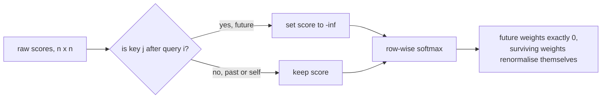

**Follow-ups:** Why does the mask go before the softmax rather than after? What's a prefix LM and when is bidirectional prompt attention useful? How does FlashAttention exploit the causal structure for speed?

</details>

### 6. Why does the transformer use multiple attention heads instead of one large one?

<details><summary><b>Answer</b></summary>

Because a single softmax produces a single weighting over positions per token - one "view" of the context. A token often needs several different relations resolved simultaneously: which noun does this pronoun refer to, what's the syntactic head of this phrase, what came just before me, which delimiter opened this bracket. Averaging those into one attention distribution destroys information. Multi-head attention runs h independent attention operations in parallel subspaces so each can specialise.

Mechanically: instead of one attention over d_model-dimensional Q/K/V, split into h heads of dimension d_model/h (e.g. 4096 → 32 heads × 128). Each head gets its own learned Q/K/V projections into its subspace, computes attention independently, and the h outputs are concatenated and mixed by the output projection W_o. Total parameter count and FLOPs are approximately the same as one full-width head - you're partitioning the computation, not adding to it. What you gain is h independent softmaxes; what each head loses is representational width (a 128-dim dot product is a lower-rank similarity measure than a 4096-dim one).

Empirically, interpretability work has found heads with recognisable roles - previous-token heads, positional heads, and famously **induction heads** (pairs of heads implementing "find the previous occurrence of this token and copy what followed it"), which are central to in-context learning. It's also empirically true that many heads are redundant after training - head-pruning studies showed you can remove a substantial fraction with modest quality loss - which is part of the intuition for why sharing K/V across query heads (MQA/GQA) works.

Head count is a tuned hyperparameter: too few heads underfits the diversity of relations; too many makes each head's subspace too narrow. head_dim between 64 and 128 has been a stable sweet spot across model generations.

**Worth sketching.** It makes clear you are partitioning one computation, not stacking h copies of it.

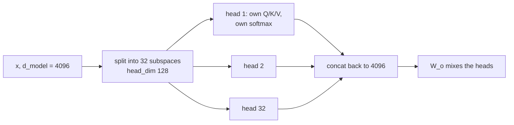

**Follow-ups:** What is an induction head and why does it matter for in-context learning? If many heads are redundant, what architectural optimisations does that motivate? Does multi-head attention cost more FLOPs than single-head at equal d_model?

</details>

### 7. Compare encoder-only, decoder-only, and encoder-decoder architectures. What is each used for?

<details><summary><b>Answer</b></summary>

**Encoder-only** (BERT lineage): bidirectional self-attention - every token sees the whole sequence - trained with masked-LM. Produces rich contextual representations but has no natural generation mechanism. Today it survives where representation quality per FLOP matters: embedding models for retrieval, rerankers, classifiers, PII/toxicity filters. Small, fast, cheap to serve.

**Decoder-only** (GPT, Llama, Claude, Gemini): causal self-attention, trained on next-token prediction. This is the architecture of essentially every modern general-purpose LLM. Why it won: (1) generation is native; (2) every token position provides training signal in each pass, so it's data-efficient at scale; (3) one architecture and one objective handle every task via prompting - no task-specific heads; (4) it scales cleanly, and the entire tooling ecosystem (KV caching, serving stacks, RLHF pipelines) is built around it.

**Encoder-decoder** (original transformer, T5, Whisper, many translation models): the encoder reads the input with bidirectional attention; the decoder generates autoregressively while cross-attending to encoder outputs. Strongest fit when there's a clear input→output transform with a fixed input: translation, speech-to-text, structured summarisation. The bidirectional encode of the source is a genuine advantage there. Drawbacks for general chat: the input/output split is awkward for multi-turn conversation, and you can't incrementally extend "the input" the way a decoder-only model just appends to context.

A nuance worth adding: decoder-only models can emulate the encoder-decoder pattern - the prompt plays the role of the encoded input - and prefix-LM variants allow bidirectional attention over the prompt while generating causally. In practice the industry consolidated on decoder-only for generative workloads and encoder-only for embeddings/reranking, with encoder-decoder holding niches like ASR (Whisper) and translation.

**Worth sketching.** Draw what attends to what rather than three labelled boxes: the attention pattern is the actual difference.

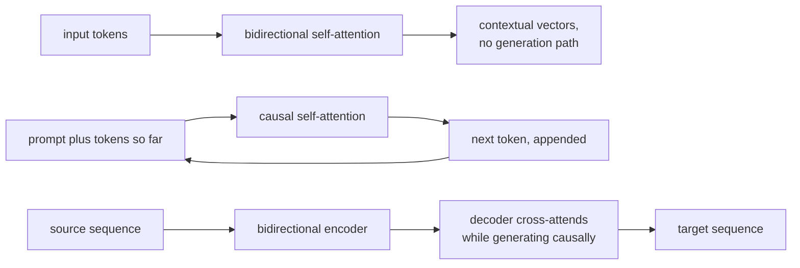

**Follow-ups:** Why do embedding models still use bidirectional attention? What's a prefix LM? If you were building a translation system today, would you pick encoder-decoder or a decoder-only LLM, and on what criteria?

</details>

### 8. What's the difference between causal language modeling and masked language modeling as pretraining objectives?

<details><summary><b>Answer</b></summary>

**Causal LM (CLM)**: predict token t+1 given tokens 1..t, at every position, with attention causally masked. The loss is cross-entropy summed over all positions - an n-token sequence yields n prediction problems per forward pass, and 100% of tokens contribute signal.

**Masked LM (MLM)**: corrupt the input by masking a subset of tokens (BERT masked ~15%) and predict the originals using *bidirectional* context. Only the masked positions produce loss, so per forward pass you get signal from ~15% of tokens.

Implications:

- **Generation**: CLM models generate natively - sampling from the model *is* the objective's inference mode. MLM models can't generate coherently; there's no left-to-right factorization of the joint distribution.
- **Representation quality**: MLM sees both sides of every position, which historically gave better representations per parameter for understanding tasks - why BERT dominated classification benchmarks in 2019-2020 and why embedding models still favour bidirectional attention.
- **Scaling and universality**: CLM turned out to be the objective that scales into general-purpose capability. Next-token prediction over diverse data implicitly requires syntax, world knowledge, reasoning, and style - and in-context learning falls out of it. The 15%-signal inefficiency of MLM plus its lack of a generative mode made it a dead end for frontier-scale general models.
- **Train/inference mismatch**: MLM's [MASK] token never appears at inference - a distribution shift BERT-era papers worked around; CLM has no such mismatch (though it has *exposure bias*: training always conditions on ground-truth prefixes, inference conditions on its own possibly-erroneous outputs).

Also worth knowing: T5-style **span corruption** is an encoder-decoder middle ground (mask contiguous spans, generate them), and some diffusion-style text models revisit non-autoregressive objectives, but CLM remains the backbone of every frontier model.

**Follow-ups:** What is exposure bias and how much does it matter in practice? Why does in-context learning emerge from next-token prediction? When would you still pretrain or fine-tune with MLM today?

</details>

### 9. Why do LLMs use subword tokenization instead of whole words or raw characters?

<details><summary><b>Answer</b></summary>

It's a compression/coverage tradeoff, and subwords are the sweet spot between two bad extremes.

**Word-level** fails on coverage: natural language has an unbounded vocabulary (names, typos, morphology, code identifiers, other languages). You either carry a vocabulary of millions - an enormous embedding matrix and softmax - or you map everything unseen to an `<UNK>` token and lose information. Morphologically rich languages make this catastrophic.

**Character-level** (or raw bytes) has perfect coverage but terrible compression: sequences get ~4-5× longer than subword tokenization in English, and attention cost is quadratic in sequence length - so you pay a large constant factor in compute and effective context. Each character also carries almost no meaning by itself, so the model burns capacity reassembling words before it can do anything else.

**Subword tokenization** (BPE and relatives) learns a vocabulary of frequent chunks: common words become single tokens, rare words decompose into meaningful pieces ("tokenization" → "token" + "ization"), and with a byte-level base alphabet *any* string is representable - no OOV ever. You get sequences ~4× shorter than character-level with a vocabulary of manageable size (roughly 32k - 256k), and frequent tokens get well-trained embeddings.

The interview-worthy caveat: this efficiency is bought by hiding the character level from the model - which causes the classic failures (letter counting, spelling games, some arithmetic) - and compression quality varies wildly by language, so non-English text is often 2-4× more tokens for the same content, meaning higher cost and less usable context. Tokenization is one of the few remaining hand-engineered, non-learned stages of the pipeline, and there's ongoing research on byte-level models with learned patching (e.g. the Byte Latent Transformer line) aimed at removing it.

**Follow-ups:** How does byte-level BPE guarantee no out-of-vocabulary strings? What's the effect of tokenizer choice on multilingual pricing and quality? Why hasn't character/byte-level modeling replaced BPE yet?

</details>

### 10. Why do LLMs famously miscount the number of r's in "strawberry"?

<details><summary><b>Answer</b></summary>

Because the model never sees letters. The tokenizer maps "strawberry" to one or two token IDs (e.g. "str" + "awberry", or a single token), and the model receives only those IDs' embedding vectors. There is no character-level view anywhere in the forward pass - asking it to count r's is like asking someone to count the letters in a word they've only ever heard spoken. To answer correctly, the model must have *memorised* the spelling of that specific token from training data (e.g. from spelling lists or character-separated text), then perform counting - a two-step process where both steps are unreliable.

Counting itself is the second failure: transformers perform a fixed number of layers of parallel computation per token, and counting is an inherently sequential operation. Without externalising intermediate steps into generated tokens (chain of thought like "s-t-r-a-w-b-e-r-r-y: r appears at positions 3, 8, 9 → 3"), the model attempts the count "in its head" in one shot, where it's guessing from memorised associations. This is why the same model that fails the direct question usually succeeds if you ask it to spell the word letter-by-letter first - and why reasoning models, which are trained to externalise steps, largely fixed this class of error.

The general lesson interviewers want: **this is a tokenization artifact, not evidence about intelligence**. The same root cause explains poor performance on rhyming and wordplay, string reversal, base64-ish character manipulation, and off-by-one behaviours in character-precise editing. Practical implication for engineers: don't build character-level string operations on raw LLM output - do them in code, and use the LLM for the parts it's actually good at.

**Worth sketching.** It puts a finger on the exact step where characters stop existing, which is also why spelling it out first works.

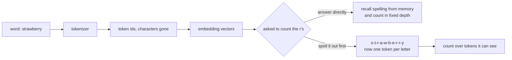

**Follow-ups:** Why does asking the model to spell the word first fix the count? What other task categories fail for the same root cause? How would a byte-level model differ here?

</details>

### 11. What does the temperature parameter actually do? Give the formula.

<details><summary><b>Answer</b></summary>

Temperature rescales the logits before the softmax that converts them into a probability distribution over the vocabulary:

p_i = exp(z_i / T) / Σ_j exp(z_j / T)

- **T = 1**: the model's raw distribution.
- **T → 0**: differences between logits are amplified; the distribution collapses toward the argmax - deterministic, greedy-like decoding. (T = 0 in APIs is implemented as argmax; true division by zero is undefined.)
- **T > 1**: differences are compressed; the distribution flattens, low-probability tokens become likelier - more diverse, more error-prone output.

Key properties worth stating: temperature is a *monotonic* transform - it never reorders tokens, only sharpens or flattens the distribution, so greedy decoding is unaffected by it. It operates per generation step on the conditional distribution, and its effects compound over a long generation: small increases in per-token entropy produce noticeably more divergent completions.

Practical guidance a strong candidate gives: use T = 0 (or near it) for extraction, classification, structured output, and code where there's a correct answer - you want the mode. Use T ≈ 0.7-1.0 for creative writing and brainstorming where diversity is the point. Note that T = 0 does not guarantee bit-identical outputs across API calls in practice (batching non-determinism, floating-point non-associativity across kernels, infrastructure changes), a common misconception worth flagging. Also note temperature interacts with truncation samplers: it's applied with top-p/top-k/min-p, and the order of operations (typically temperature first, then truncation, though implementations vary) changes behaviour at high T - min-p in particular was designed to stay robust at T > 1.

One more useful framing: temperature trades off exploitation of the model's confidence against exploration of its uncertainty - the same knob as in softmax exploration in RL.

**Follow-ups:** Why can T=0 still produce different outputs across identical API calls? If you increase temperature, why do you usually also want min-p or top-p? What temperature would you use for an LLM-as-judge evaluation and why?

</details>

### 12. Compare greedy decoding, top-k sampling, and top-p (nucleus) sampling.

<details><summary><b>Answer</b></summary>

**Greedy** takes the argmax token every step. Deterministic and cheap, fine for short factual answers and structured extraction. Failure mode: repetition loops ("the the the", or paragraph-level cycles) and blandness - locally optimal tokens don't compose into globally good text, and the model can enter self-reinforcing repetition where prior repeats make the next repeat *more* likely.

**Top-k** restricts sampling to the k highest-probability tokens (renormalized), typically k = 20-50. Problem: k is static while the distribution's shape varies enormously per step. When the model is confident (one token at 0.95), k = 40 admits 39 junk tokens; when it's genuinely uncertain across 200 plausible continuations (start of a story sentence), k = 40 truncates valid diversity.

**Top-p / nucleus** (from Holtzman et al., "The Curious Case of Neural Text Degeneration") adapts: keep the smallest set of tokens whose cumulative probability ≥ p (e.g. 0.9), renormalize, sample. Confident step → nucleus is 1-2 tokens; uncertain step → nucleus is large. This adaptivity is why top-p became the default. Its residual weakness: at high temperature the flattened distribution lets the nucleus swell to include genuinely bad tokens - which is what **min-p** (keep tokens with p ≥ min_p × p_max) addresses by anchoring the cutoff to the top token's confidence.

The key insight behind all truncation sampling: the model's probability mass is well-calibrated at the head of the distribution and unreliable at the tail - a long generation will eventually sample a tail token, and one bad token can derail everything after it (errors compound autoregressively). Truncation cuts the tail; temperature shapes what remains. In practice these compose: temperature + top-p (+ optionally top-k as a hard cap) is the standard stack, with greedy/T≈0 for anything with a right answer.

**Worth sketching.** It fixes the order of operations, which is what makes the top-p versus min-p difference concrete.

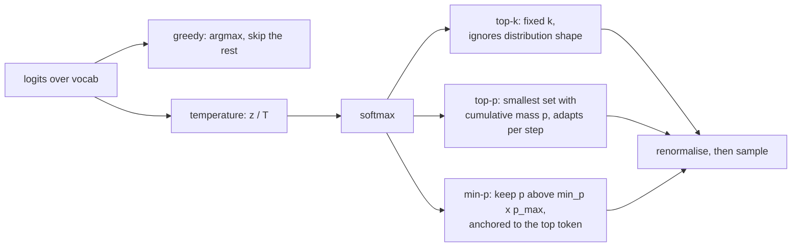

**Follow-ups:** Why does greedy decoding loop, mechanistically? When does top-p fail and how does min-p fix it? Why is sampled text at T=1 often *worse* than the model's "true" distribution would suggest?

</details>

### 13. What is the KV cache and why does it make generation fast?

<details><summary><b>Answer</b></summary>

During autoregressive generation, each new token's attention needs the keys and values of *all previous tokens* at every layer. Those K and V vectors depend only on the tokens that produced them (and their positions) - they don't change as generation proceeds. The KV cache stores them so each step computes Q/K/V only for the single new token, attends against cached K/V, and appends its own K/V to the cache.

Without the cache you'd re-run the full forward pass over the whole prefix for every generated token: generating token n costs O(n) recomputation, so a full generation costs O(n²) forward-pass work (with the attention inside making it effectively cubic-ish in total FLOPs). With the cache, each step does one token's worth of projections plus attention reads over n cached entries - generation becomes linear in tokens generated, which is the difference between usable and unusable latency.

This creates the two-phase structure every serving stack is built around: **prefill** (process the whole prompt in parallel - compute-bound, populates the cache) and **decode** (one token at a time - memory-bandwidth-bound, because each step must read the entire cache from GPU memory while doing relatively few FLOPs). Time-to-first-token is prefill; inter-token latency is decode.

The cost is memory: per token you store 2 (K and V) × n_layers × n_kv_heads × head_dim elements. For a 70B-class model with GQA (80 layers, 8 KV heads, head_dim 128, fp16) that's ~320 KB per token - ~40 GB for one 128k-token sequence. That memory pressure is why GQA/MQA exist (fewer KV heads), why vLLM's PagedAttention manages cache in non-contiguous blocks, why prefix/prompt caching shares cache across requests, and why cache quantization (fp8/int8 KV) is common.

**Worth sketching.** The loop back into the cache is the point: draw it and the linear-versus-quadratic argument makes itself.

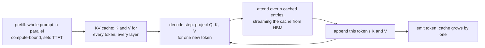

**Follow-ups:** Why is decode memory-bandwidth-bound rather than compute-bound? What is prefix caching and when does it save money? Why can't you cache the queries too?

</details>

### 14. What does the feed-forward network in a transformer block actually do, and why is SwiGLU the default now?

<details><summary><b>Answer</b></summary>

Attention moves information between positions; the FFN transforms information at each position independently. It is also where most of the parameters live, roughly two thirds of a dense transformer's weights.

The classic version is two linear layers with a nonlinearity between them, expanding to about 4x d_model and projecting back:

```python
def ffn(x, W1, W2):
    return gelu(x @ W1) @ W2   # d_model -> 4*d_model -> d_model
```

SwiGLU replaces the single up-projection with a gated pair:

```python
def swiglu_ffn(x, W_gate, W_up, W_down):
    return (silu(x @ W_gate) * (x @ W_up)) @ W_down
```

That is three matrices instead of two, so to hold the parameter count fixed you shrink the hidden dimension from ~4x d_model to ~8/3 x d_model. Llama-family models do exactly this, and it is why you see odd intermediate sizes like 11008 rather than a clean multiple of 4.

Why it won: it consistently gives lower loss at matched parameters and FLOPs. The gate makes the nonlinearity data-dependent and multiplicative, so a unit can be switched off based on the input rather than passed through a fixed pointwise curve. The GLU-variants work that popularised it is refreshingly honest that the justification is empirical rather than theoretical. GeGLU (GELU instead of SiLU as the gate activation) performs about the same; the choice is mostly convention.

A useful mental model from interpretability: treat W_gate/W_up rows as pattern detectors and W_down columns as the content those patterns write back into the residual stream, so the FFN behaves like a key-value memory.

The misconception worth killing is that the FFN is a boring MLP tacked onto the interesting part. It holds the bulk of the parameters, dominates FLOPs at short and moderate context, and it is exactly the component Mixture-of-Experts replaces, because that is where the capacity is.

**Worth sketching.** Three matrices meeting at a multiply: it shows immediately why the hidden dimension shrinks to keep the parameter count fixed.

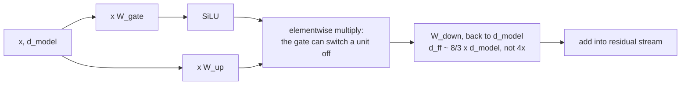

**Follow-ups:** Where does the FFN stop dominating FLOPs and attention take over? Why does MoE swap out the FFN rather than attention?

</details>

### 15. What is weight tying, and why do some models tie the embedding and output matrices while others do not?

<details><summary><b>Answer</b></summary>

Weight tying means the input embedding matrix and the output LM head are the same matrix, used transposed at the output. Both map between token identity and residual-stream space, so the argument is that one matrix should serve.

The saving is vocab x d_model parameters. With a 128k vocab and d_model 4096 that is ~524M parameters, which is a serious fraction of an 8B model and a rounding error in a 400B one. That size asymmetry basically explains the split in practice: small models tend to tie (Gemma ties, and with a ~256k vocab the saving is enormous relative to the body), while large models increasingly untie because the parameters are cheap and untying measurably improves loss.

Why untying helps is the interesting part. The two matrices want different geometries. The embedding wants tokens that appear in similar contexts to sit close together. The unembedding wants tokens that are interchangeable as predictions to sit close together. Those are related but not identical, and forcing one matrix to satisfy both constrains it. There is also a rank argument: the logit matrix is bounded by d_model, the softmax bottleneck, and tying does not help there.

Two details worth knowing. First, gradients behave differently: the embedding side receives sparse updates for tokens actually present in the batch, while the head receives dense updates from the full-vocab softmax, and with tying they land on the same matrix, which changes its effective learning rate relative to the rest of the model. Second, scale mismatch is real, which is why several tied models multiply embedding outputs by sqrt(d_model).

The original arguments came from Press and Wolf and from Inan et al. around 2016 and 2017, in an era of small models where the embedding table genuinely was most of the model. The tradeoff has shifted since, which is the point.

**Follow-ups:** How does the vocabulary size decision interact with the tying decision? What happens to a tied model if you want to extend the vocabulary post-hoc?

</details>

### 16. Explain speculative decoding. Why doesn't it change the model's output distribution?

<details><summary><b>Answer</b></summary>

A small draft model autoregressively proposes k tokens. The large target model then scores all k+1 positions in a single forward pass. An acceptance rule walks the proposals left to right, accepting each with probability min(1, p_target(x)/p_draft(x)); on the first rejection you resample that token from a corrected residual distribution and discard the rest. It is a rejection-sampling scheme, and the proof is that the resulting samples are distributed exactly as if you had sampled from the target model directly. This is the crucial point: it is lossless, not an approximation. If someone tells you speculative decoding trades quality for speed, they have it confused with a smaller model.

Why it is faster comes down to arithmetic intensity. Decode is memory-bandwidth-bound: to produce one token you stream every weight from HBM and do almost no arithmetic with them. Scoring 5 positions costs nearly the same wall clock as scoring 1, because the weight-loading cost dominates and is amortised. You are spending idle FLOPs to buy back time. Typical wins are ~1.5-3x, governed by the acceptance rate and how cheap the draft is.

What a strong answer adds:

- It stops helping when the batch is large. At high batch you are already compute-bound and there are no spare FLOPs to spend, so the speculative overhead can make things worse. It is a low-latency, low-batch technique.
- Acceptance rate is everything, and it depends on distribution match, not draft quality in the abstract. The best drafts are distilled from the specific target model, so the KL between them is small. A generically good 1B model drafting for an unrelated 70B can accept badly.
- Variants avoid the second model entirely: Medusa and EAGLE add draft heads on the target's own trunk, n-gram or prompt-lookup drafting works well for copy-heavy work like RAG and code edits, and DeepSeek-V3 reuses its multi-token-prediction module as the draft.

**Worth sketching.** The branch at the acceptance test is what proves you understand this is rejection sampling, not an approximation.

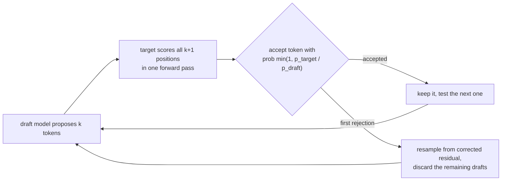

**Follow-ups:** How would you measure whether speculative decoding is actually helping in a live serving deployment? What acceptance rate do you need for it to break even?

</details>

### 17. What is in-context learning, and how do you decide between it and fine-tuning?

<details><summary><b>Answer</b></summary>

In-context learning is a model performing a task specified entirely in the prompt, via instructions or examples, with no weight update. It emerged from pretraining rather than being designed in, and it is the reason the API-call era exists at all.

Why it works: pretraining on enormously diverse data makes "infer what task this prefix implies and continue consistently" the loss-minimising behaviour, because the corpus is full of implicit task demonstrations. Mechanistically the best-understood ingredient is induction heads: a two-head circuit that finds an earlier occurrence of the current token and copies what followed it. Their formation coincides with a sharp jump in in-context ability during training, which is one of the cleaner mechanistic stories we have.

The decision framework:

Use in-context learning when the task is describable, changes often, has low volume, or you are still iterating. It costs nothing to set up and you can change it in a text editor. The ceiling is your context budget and per-call token cost.

Use fine-tuning when the task is stable and high volume so amortised token cost dominates, when you need lower latency or a smaller model, when you have thousands of good examples, or when the behaviour resists description in a prompt (tone, a house style, a specialised output format).

One thing worth flagging because interviewers like it: for most real tasks, examples mostly are not teaching a new task. Min et al. (2022) showed that on classification, replacing demonstration labels with random wrong ones barely hurts. What the demonstrations convey is the label space, the input distribution and the output format, not the mapping. The nuance: later work found the largest models can follow consistently flipped labels, so the mapping is not ignored entirely, but the practical lesson holds. So the practical implication is that example selection and diversity matter far more than example count, and 30 near-identical examples are mostly wasted context.

**Worth sketching.** A decision tree keeps this from turning into a generic list of pros and cons.

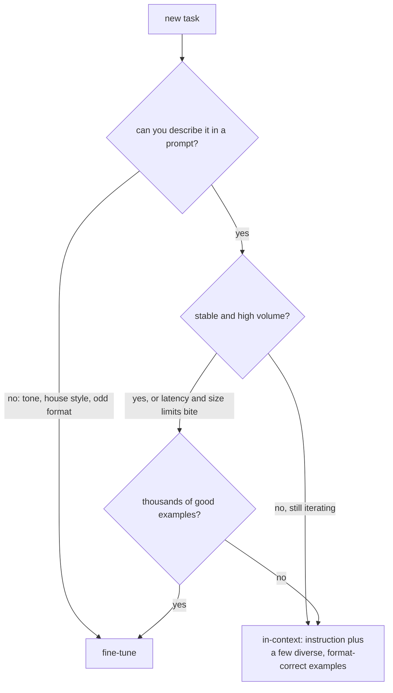

**Follow-ups:** If wrong labels barely hurt, what does that imply about how you should choose few-shot examples? When have you seen in-context learning genuinely fail where fine-tuning succeeded?

</details>

### 18. What does perplexity measure, and why can't you compare it across models with different tokenizers?

<details><summary><b>Answer</b></summary>

Perplexity is the exponentiated average negative log-likelihood per token on held-out text: PPL = exp(-(1/N) Σ log p(x_t | x_<t)). Intuitively it is the effective number of tokens the model is choosing between at each step: a perplexity of 8 means the model is, on average, as uncertain as a uniform choice among 8 tokens. Lower is better, and it is the training loss, just exponentiated.

The trap is the denominator. "Per token" depends on the tokenizer. A model with a 200k vocabulary splits the same document into fewer, larger tokens than a 32k-vocab model, so each prediction carries more information and per-token perplexity rises even if the model predicts the text better. Comparing per-token perplexity across tokenizers is comparing numbers in different units.

The fix is to normalise by something tokenizer-independent. Bits per byte (BPB) divides the document's total negative log-likelihood, in bits, by its UTF-8 byte count: BPB = (loss in nats per token / ln 2) / (bytes per token). The total log-likelihood of a document is comparable across models; dividing by a model-specific unit is where it goes wrong. Byte-level and tokenizer-free papers report BPB for exactly this reason.

Other ways perplexity misleads:

- Post-trained models usually score worse perplexity on web text than their base models, because SFT and RL sharpen the distribution toward a chat style. That is not a capability regression.
- The average is dominated by easy tokens. Function words and boilerplate are predicted well by any model; the tokens that carry reasoning are a small fraction of the mean.
- Contamination: if the eval text was in pretraining, perplexity collapses and tells you nothing.
- It says nothing about instruction following, factuality or tool use.

Where it is still the right tool: comparing checkpoints within one run, data-mixture and tokenizer ablations (in BPB), detecting domain shift, and filtering pretraining data by a reference model's perplexity.

**Follow-ups:** Convert a loss of 2.0 nats per token into perplexity. Tokenizer A averages 3.5 bytes per token and tokenizer B averages 4.5: how do you compare their losses? Why might a better model show higher perplexity on your eval set?

</details>

## Intermediate

### 19. Pre-norm vs post-norm - what's the difference and why did everyone move to pre-norm? And why RMSNorm?

<details><summary><b>Answer</b></summary>

**Post-norm** (original 2017 transformer): `x = Norm(x + Sublayer(x))` - normalization sits *on* the residual path, after the add. **Pre-norm** (GPT-2 onward, essentially all modern LLMs): `x = x + Sublayer(Norm(x))` - normalization is inside the branch, and the residual path is a pure identity.

Why it matters: with post-norm, the gradient from the loss to early layers must pass through every LayerNorm on the trunk, and each norm rescales gradients in ways that compound with depth - deep post-norm transformers are notoriously hard to train, requiring careful learning-rate warmup and still prone to divergence. With pre-norm, there is an unobstructed identity path from the loss to every layer - gradients reach early layers unattenuated, warmup requirements shrink, and training is stable at 80-100+ layers. Since a frontier training run can cost tens to hundreds of millions of dollars, stability wins over everything: pre-norm became universal.

The honest nuance: post-norm, *when you can train it*, sometimes achieves slightly better final quality - pre-norm's identity path means later layers can behave more like an ensemble of shallow paths, arguably wasting some depth. This motivated hybrids (e.g. "peri-norm"/double-norm arrangements, or Gemma-style normalizing both the branch input and output), but plain pre-norm remains the default.

**RMSNorm** vs LayerNorm: LayerNorm subtracts the mean, divides by standard deviation, then applies learned gain and bias. RMSNorm drops mean-centring and the bias - just divide by the root-mean-square of the vector and apply a learned gain: x / RMS(x) · g. Ablations (from the RMSNorm paper onward, confirmed at scale by Llama-family models) show the mean-centring isn't needed; RMSNorm is cheaper (fewer reductions, fewer params, one fewer memory-bound op) and equally stable. At thousands of norm invocations per forward pass, the savings are real.

**Worth sketching.** Draw both residual paths and the difference is immediate: one has a norm sitting on the trunk.

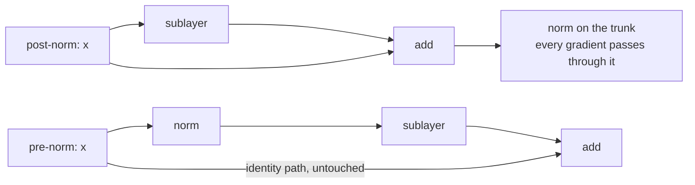

**Follow-ups:** Why does warmup interact with post-norm? What does normalizing do to the loss landscape geometry? Where else in modern architectures do norms appear besides the two block positions (QK-norm, final norm)?

</details>

### 20. Walk me through the BPE training algorithm step by step.

<details><summary><b>Answer</b></summary>

Byte-Pair Encoding learns a vocabulary of subword merges from a corpus:

1. **Initialize** the vocabulary with the base alphabet - in byte-level BPE (GPT-2 onward), all 256 byte values, which guarantees any string is representable. Represent the corpus as sequences of these base symbols.
2. **Count** all adjacent symbol pairs across the corpus.
3. **Merge** the most frequent pair into a new single symbol, add it to the vocabulary, and record the merge rule (e.g. `t` + `h` → `th`).
4. **Repeat** steps 2-3 until the target vocabulary size is reached (e.g. ~50k merges for GPT-2's 50,257 vocab; ~128k for Llama 3's).

The output is an ordered list of merge rules. **Encoding** at inference time replays them: split the text into base symbols, then apply merges in the order they were learned wherever they occur, greedily, until no more apply. Encoding is deterministic; the learned merge order is the tokenizer.

```python
from collections import Counter
def bpe_step(corpus):                     # corpus: list of (symbol_tuple, freq)
    pairs = Counter()
    for word, freq in corpus:
        for a, b in zip(word, word[1:]):
            pairs[(a, b)] += freq
    return max(pairs, key=pairs.get)      # pair to merge next
```

Practical details that signal real understanding: real tokenizers apply a **pre-tokenization** regex first (splitting on whitespace/category boundaries, so merges don't cross word boundaries - GPT-2's regex famously special-cases contractions like `'s`), and they handle leading spaces as part of tokens (`" the"` and `"the"` are different tokens). Frequency-based merging means the vocabulary mirrors the training corpus distribution - which is exactly why tokenizers trained on English-heavy data fragment other languages. Note also the contrast: **WordPiece** picks the merge maximising corpus likelihood rather than raw frequency, and **unigram-LM** (SentencePiece's other algorithm) works top-down - start with a large candidate vocab and prune tokens whose removal least hurts likelihood.

**Worth sketching.** The loop and its exit condition are the algorithm; everything else is bookkeeping.

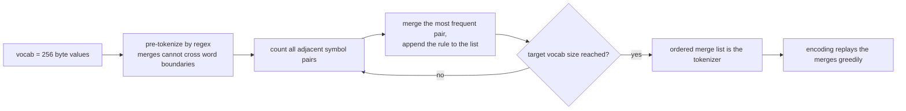

**Follow-ups:** Why does pre-tokenization matter - what would go wrong without word-boundary constraints? Why do `"the"` and `" the"` need to be separate tokens? How does unigram-LM tokenization differ conceptually from BPE?

</details>

### 21. Compare BPE, WordPiece, SentencePiece, and byte-level BPE.

<details><summary><b>Answer</b></summary>

These are two algorithms, a library, and a base-alphabet choice - a distinction that itself scores points, because people wrongly treat them as four parallel algorithms.

**BPE** (algorithm): bottom-up, greedy - repeatedly merge the most *frequent* adjacent pair. Used (in byte-level form) by GPT-2/3/4-family tokenizers (tiktoken) and Llama 3.

**WordPiece** (algorithm, BERT): same bottom-up scheme but merges the pair that maximises training-corpus *likelihood* - score ≈ freq(ab) / (freq(a)·freq(b)) - favouring pairs that co-occur more than chance rather than just often. Recognisable by its `##` continuation-piece convention. Encoding uses longest-match-first rather than merge replay.

**Unigram-LM** (algorithm, often used via SentencePiece): top-down - start with a large candidate vocabulary, iteratively prune tokens whose removal least damages the corpus likelihood under a unigram model; encoding picks the most probable segmentation (Viterbi). Supports sampling alternative segmentations for regularization during training.

**SentencePiece** (library, not an algorithm): implements both BPE and unigram-LM. Its distinctive property: it operates on raw text as a character stream with **no external pre-tokenization** - whitespace is encoded as a meta-symbol (▁, U+2581) - making it language-agnostic (works for Chinese/Japanese/Thai where there are no spaces) and exactly reversible. Standard for multilingual and many open models (Llama 1/2, T5, Gemma).

**Byte-level BPE** (base-alphabet choice): run BPE over the 256 byte values instead of Unicode characters. Guarantee: *no string is ever out-of-vocabulary* - anything, any language, emoji, binary-ish garbage, decomposes to bytes at worst. Cost: rare non-Latin characters can fragment into multiple byte tokens. SentencePiece offers an equivalent escape hatch called byte-fallback.

Practical engineering relevance: tokenizer choice determines token counts (cost, latency, effective context) per language, and mismatched tokenizers are a classic source of bugs when swapping models - never assume token counts transfer across model families.

**Follow-ups:** Why does SentencePiece encode whitespace explicitly - what property does that buy? What is byte-fallback? Given the same vocab size, why might unigram-LM produce more linguistically natural segmentations than BPE?

</details>

### 22. What are the tradeoffs in choosing vocabulary size?

<details><summary><b>Answer</b></summary>

Vocab size trades sequence-length compression against parameter cost and tail-token quality. The industry trend tells the story: GPT-2 used 50,257; Llama 2 used 32k; Llama 3 moved to ~128k; GPT-4o's tokenizer is ~200k.

**Larger vocabulary - benefits:**
- **Fewer tokens per text**: more strings become single tokens, so the same document costs fewer tokens - directly cheaper inference, lower latency, and more content fits in the context window. Gains are largest for non-English languages and code, which small English-centric vocabs fragment badly. This is a major reason Llama 3 quadrupled Llama 2's vocab.
- Fewer autoregressive steps for the same output → faster generation.

**Larger vocabulary - costs:**
- **Embedding + LM-head parameters** scale as 2 × vocab × d_model (unless weight-tied). At d_model = 4096, a 128k vocab means ~525M embedding params and the same again for the output head - for small models this is a huge fraction of the budget (a 1B model can spend >30% of params on vocab), while for a 70B model it's noise. This is why small models almost always tie the embedding and LM head and are far more sensitive to vocab size, while large models can afford huge vocabularies.
- **Softmax compute** over the vocab at every position (mostly matters for small models, and for training throughput).
- **Under-trained tail tokens**: with more tokens, each rare token gets fewer training occurrences. Pathological case: "glitch tokens" (the SolidGoldMagikarp story - tokens present in the vocab but nearly absent from training data, whose embeddings are essentially uninitialized, producing bizarre behaviour when triggered).
- Larger multilingual vocabs make each token cover *more* text, which slightly reduces per-token granularity the model can exploit.

Rule of thumb: vocab size should scale with model size and with the breadth of languages/domains served. There's published work on compute-optimal vocab scaling showing frontier models had been under-sizing vocabularies.

**Follow-ups:** What are glitch tokens and what causes them? Why does weight-tying the embedding and LM head matter more for small models? How would you evaluate whether a tokenizer serves your target languages well?

</details>

### 23. Beyond letter counting, what failure modes does tokenization cause? Think arithmetic, multilingual text, and code.

<details><summary><b>Answer</b></summary>

**Arithmetic.** Numbers tokenize inconsistently: "1234" might be one token while "1235" splits as "12"+"35", and the same quantity chunks differently depending on surrounding text. Place-value alignment - the core of digit-wise algorithms - is destroyed when operands have inconsistent boundaries. This is why several model families force single-digit tokenization for numbers (each digit its own token), which measurably improves arithmetic: consistent structure lets the model learn positional algorithms. Comma formatting ("1,234,567") adds another layer of chunking chaos.

**Multilingual inefficiency.** Tokenizers are trained on a corpus; the merges reflect its language mix. English-heavy vocabs fragment other scripts - Hindi, Thai, Khmer, and others can cost 2-5× more tokens than English for equivalent content (byte-level fallback can reduce rare script characters to multiple byte tokens each). Consequences are concrete: users of those languages pay more per request, exhaust context windows sooner, hit output-token limits earlier, and get worse quality because the model reasons over fragmented units. It's an equity issue baked in before any learning happens - and a reason Llama 3 and newer tokenizers expanded vocab with explicitly multilingual data.

**Code.** Whitespace is syntax in Python, and tokenizers handle indentation via whitespace-run tokens (e.g. a token for 4 spaces, 8 spaces...). Models can confuse indentation levels - an off-by-one-level bug is a tokenization-adjacent failure. Tabs vs spaces tokenize entirely differently. Identifier splitting (`getUserById` → `get`+`User`+`By`+`Id`) is usually semantically reasonable, but rare identifiers fragment unpredictably. Modern code-aware tokenizers added dedicated whitespace and indentation handling, which was a real contributor to code-generation quality gains.

**General diagnostic habit** interviewers want: when an LLM fails at something character- or format-precise - spelling, string manipulation, character offsets in structured output, off-by-one edits - check the tokenization first. Pasting the failing input into a tokenizer visualiser resolves a surprising fraction of "model is dumb" bug reports.

**Follow-ups:** Why does single-digit number tokenization improve arithmetic? If your product targets Southeast Asian languages, what would you check before choosing a model? How would tokenization affect a code-diff-generation feature?

</details>

### 24. Attention is O(n²) in sequence length. Where does that actually bite in practice - prefill vs decode?

<details><summary><b>Answer</b></summary>

The n×n score matrix means attention FLOPs scale quadratically with sequence length, but *where* that hurts differs by phase, and strong candidates separate them.

**Prefill** (processing the prompt): genuinely quadratic compute. All n tokens attend to all prior tokens in parallel - total attention FLOPs ~O(n²·d) per layer. Doubling prompt length roughly quadruples attention prefill work (the MLP part scales linearly, so the blended exponent depends on length - at short contexts MLPs dominate; at 100k+ attention dominates). This is why time-to-first-token grows superlinearly for long prompts, and why serving stacks use chunked prefill to avoid stalling decode traffic behind a 100k-token prompt.

**Decode** (generating token-by-token, with KV cache): each step is O(n·d) - the new token attends over n cached entries. Quadratic total across a full generation, but the per-step cost is linear in context. The real constraint here isn't FLOPs at all - it's **memory bandwidth and capacity**: every step must stream the entire KV cache from HBM, and the cache itself grows linearly with n (that ~320 KB/token for a 70B-class GQA model → ~40 GB at 128k). Long context at decode time is a memory problem.

Consequences that follow: (1) long-context pricing - some providers price long-context requests higher because prefill compute and cache memory both balloon; (2) architectural responses - GQA/MQA/MLA shrink the cache, sliding-window attention (Mistral-style) bounds it, hybrid SSM-attention models attack both; (3) FlashAttention fixes attention's *memory* footprint (no materialised n² matrix) and IO but not the FLOP count - prefill is still quadratic; (4) product implications - "just stuff everything in context" has a real quadratic cost floor, which keeps RAG and context curation economically relevant even as windows grow.

**Worth sketching.** Splitting the two phases before you talk shows the interviewer you know where the bottleneck actually sits.

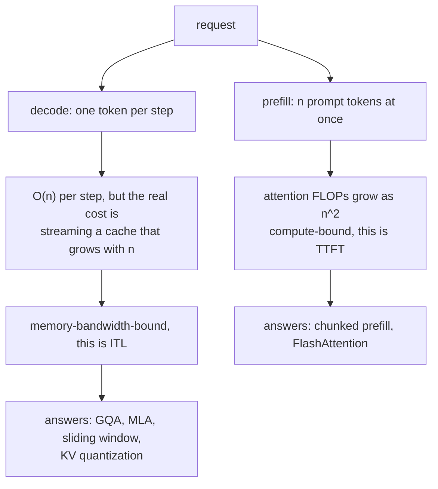

**Follow-ups:** Why is decode memory-bandwidth-bound - walk me through the arithmetic intensity? What does sliding-window attention give up? Why doesn't FlashAttention change the asymptotic FLOP complexity?

</details>

### 25. Explain FlashAttention's core idea. What does it optimise, and what doesn't it change?

<details><summary><b>Answer</b></summary>

FlashAttention's insight is that standard attention is bottlenecked not by FLOPs but by **memory traffic**: the naive implementation materialises the n×n score matrix in GPU HBM, writes it, reads it back for softmax, writes the probabilities, reads them again to multiply by V. GPU compute vastly outpaces HBM bandwidth, so the kernel spends its time waiting on memory. FlashAttention is an **IO-aware, exact** reimplementation - same math, radically less memory movement.

Three mechanisms:

1. **Tiling**: split Q, K, V into blocks sized to fit in on-chip SRAM (orders of magnitude faster than HBM). Compute attention block-by-block, keeping intermediate products on-chip, fusing score computation, softmax, and the V-multiply into one kernel.
2. **Online softmax**: softmax normally needs the full row (for the max and the normalizer) before any output. The streaming trick maintains a running maximum and running sum as blocks arrive, rescaling previous partial results when the max updates - mathematically exact, no full row ever needed. This is the piece that makes tiling possible.
3. **Recomputation in backward**: instead of storing the n×n probability matrix for the backward pass, store only the row statistics (max, normalizer) and recompute attention blocks on the fly. Extra FLOPs, far less IO - a favourable trade on modern hardware.

Results: memory footprint for attention drops from O(n²) to O(n), wall-clock speedups of ~2-4× on typical shapes, and long-context training/inference becomes practical. FlashAttention-2/3 refine parallelization and exploit newer hardware (Hopper async execution, fp8), and FlashAttention-4 (2026) redesigns the kernel for Blackwell, where tensor-core throughput has outgrown the softmax and memory units around it.

What it does **not** change: the FLOP count is still O(n²) - prefill remains quadratic in compute; it's not sparse, linear, or approximate attention. And it doesn't shrink the KV cache - those are orthogonal problems solved by GQA/MLA/quantization. Common interview trap: calling FlashAttention an approximation. It's bit-for-bit the same attention (up to floating-point reordering), which is exactly why adoption was universal - no quality tradeoff to litigate.

**Worth sketching.** Contrasting the memory traffic in both versions makes it obvious the maths never changed.

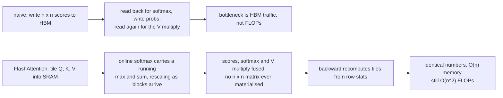

**Follow-ups:** Walk me through the online softmax rescaling. Why is recomputation faster than storing the matrix? How does FlashAttention interact with causal masking?

</details>

### 26. How do sinusoidal positional encodings work, and how do they compare to learned positional embeddings?

<details><summary><b>Answer</b></summary>

Self-attention is permutation-invariant, so position must be injected explicitly. The original transformer added **sinusoidal encodings** to token embeddings: for position pos and dimension pair i, PE(pos, 2i) = sin(pos / 10000^(2i/d)) and PE(pos, 2i+1) = cos(pos / 10000^(2i/d)). Each dimension pair oscillates at a different frequency, geometrically spaced from wavelength 2π up to ~10000·2π - like a binary counter in continuous form, or clock hands ticking at different speeds. Low-frequency dims distinguish coarse position; high-frequency dims distinguish adjacent tokens.

Two elegant properties: no learned parameters (works for any position, including ones never seen in training - in theory), and for any fixed offset k, PE(pos+k) is a *linear function* of PE(pos) - a rotation in each frequency pair - so relative offsets are, in principle, easy for attention to compute. In practice extrapolation beyond trained lengths still degrades, because the model never learned to *use* the unseen combinations.

**Learned absolute embeddings** (GPT-2, BERT): just an embedding table indexed by position, added to token embeddings. Simpler, lets the model learn whatever positional structure helps, and empirically matched sinusoidal at trained lengths. Hard limitations: the table has a fixed size - position 1025 simply has no embedding in a 1024-trained model - and each position index is trained only as often as it appears, so late positions are under-trained.

Both share a deeper weakness: they encode **absolute** position, while language mostly cares about **relative** position ("the adjective before this noun"), and adding position to the *embedding* entangles content with position throughout the residual stream. That motivated the modern generation of methods that inject *relative* position directly into the attention computation - RoPE (rotate Q/K per position, so scores depend on offset) and ALiBi (distance-penalty bias on scores) - which is what current models actually use. Sinusoidal/learned absolute embeddings are now mostly of historical and conceptual importance.

**Follow-ups:** Why is relative position more useful than absolute for language? Show why a fixed offset is a linear transform of a sinusoidal encoding. Why does adding position to embeddings entangle content and position, and why does that matter?

</details>

### 27. Explain RoPE. What's the rotation intuition and why did it become the default?

<details><summary><b>Answer</b></summary>

Rotary Position Embedding injects position by **rotating** the query and key vectors rather than adding anything to embeddings. Pair up the dimensions of each head (dim 0-1, 2-3, ...) and treat each pair as a 2D vector; for a token at position m, rotate pair i by angle m·θ_i, where θ_i = 10000^(−2i/d) gives geometrically spaced frequencies - fast-spinning pairs encode fine/local position, slow-spinning pairs encode coarse/long-range position.

The payoff is what happens in the dot product. Rotations preserve norms, and the angle between a query rotated by m·θ and a key rotated by n·θ changes by exactly (m−n)·θ. So the attention score between positions m and n depends only on their **relative offset m − n** (and the content vectors) - relative position encoding, achieved multiplicatively, with zero learned parameters, applied only to Q and K (V is left alone; the output carries no positional contamination). The clock-hands intuition: each dimension pair is a clock hand spinning at its own rate as position advances; attention compares the *difference* in clock readings between two tokens.

Why it won (Llama, Qwen, Mistral, most modern open models - and it's the assumption behind most long-context tooling):

- Relative position matches what language needs, without the extra attention terms older relative-position schemes (T5 bias, Shaw et al.) required.
- No parameters, no position-table length cap; compatible with KV caching (each token's K is rotated once by its absolute position, then cached - relative behaviour emerges in the dot product).
- Decaying inter-token dependency with distance falls out naturally at standard frequency settings.
- Crucially, it turned out to be **extensible**: because position lives in rotation angles, context extension becomes frequency surgery - position interpolation, NTK-aware scaling, and YaRN all work by rescaling θ or positions, which is far cleaner than retrofitting an embedding table.

Limitation: vanilla RoPE still degrades sharply past trained length - unseen angle ranges are out-of-distribution - which is exactly what the extension methods address.

**Worth sketching.** The two rotations meeting at one dot product is the whole proof sketch in a picture.

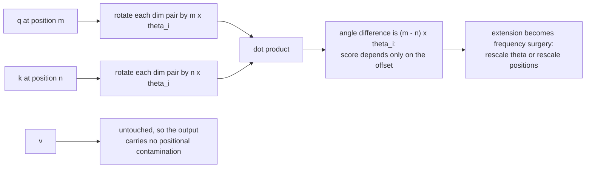

**Follow-ups:** Prove that the score depends only on m−n for a single 2D pair. Why is RoPE applied to Q and K but not V? How do position interpolation and YaRN manipulate RoPE's frequencies?

</details>

### 28. How does ALiBi encode position, and what's its claim to fame?

<details><summary><b>Answer</b></summary>

ALiBi (Attention with Linear Biases) uses **no positional embeddings at all**. Instead, it adds a static penalty directly to attention scores proportional to the distance between query and key: score(i, j) += −slope · (i − j) for j ≤ i. Each head gets a different fixed (not learned) slope, drawn from a geometric sequence (e.g. 1/2, 1/4, ..., 1/2⁸ for 8 heads) - so some heads are strongly recency-biased, effectively local, while shallow-slope heads can still attend far back. Position is expressed purely as "farther = softly down-weighted," and the model learns everything else from content.

Its claim to fame is **length extrapolation**: train at 1k - 2k context and run inference at much longer lengths with far less degradation than sinusoidal, learned, or vanilla-RoPE models, whose behaviour collapses on out-of-distribution position values. ALiBi has no out-of-distribution positions - the bias formula is the same linear function at any distance - so nothing structurally breaks at unseen lengths. It's also simple (a few lines in the attention kernel), parameter-free, and adds negligible compute. MPT and BLOOM shipped with it.

Honest limitations, which explain why RoPE still dominates: the built-in recency bias is a strong inductive prior - helpful for perplexity, but it means genuinely long-range retrieval must fight the penalty, and empirically ALiBi models are weaker at long-range recall tasks than extended-RoPE models; "doesn't blow up at length" is not the same as "uses length well." It's also awkward to combine with some attention optimisations, and the ecosystem's tooling consolidated around RoPE - once position interpolation and YaRN made RoPE extensible cheaply, ALiBi's headline advantage mattered less.

Conceptually it remains an important data point: relative position can be expressed as a *score-space bias* rather than embedding-space content, and the sliding-window-like behaviour of steep-slope heads prefigured explicit local-attention designs.

**Follow-ups:** Why does ALiBi extrapolate where RoPE doesn't? What's the cost of a recency prior for retrieval-heavy tasks? Compare ALiBi's bias to T5's learned relative-position buckets.

</details>

### 29. A model was pretrained at 8k context. You need 128k. What are your options? Explain position interpolation and YaRN.

<details><summary><b>Answer</b></summary>

The failure you're fixing: RoPE encodes position as rotation angles, and positions past 8k produce angle combinations the model has never seen - attention behaviour degrades catastrophically out-of-distribution. Naive fine-tuning at 128k from scratch positions is expensive and slow to converge, so the practical methods rescale RoPE so long contexts land inside (or near) the distribution the model already understands.

**Position interpolation (PI)**: compress positions linearly - to run at 32k on an 8k-trained model, multiply every position by 1/4 (equivalently, scale RoPE frequencies down) so the full range maps into [0, 8k]. All angles are now in-distribution; the cost is resolution - adjacent tokens are only a quarter of a "position unit" apart, blurring the fine-grained local distinctions the high-frequency dimensions were providing. A short fine-tune (order of ~1B tokens) recovers most quality. Simple and effective; local precision suffers most at large scale factors.

**NTK-aware scaling** (the intermediate idea): instead of compressing all frequencies equally, rescale the RoPE base so **low-frequency (long-wavelength) dims get interpolated a lot** while **high-frequency dims stay nearly intact** - preserving local resolution while stretching long-range coverage. Popular because it works surprisingly well even *without* fine-tuning.

**YaRN** combines and refines these: divide RoPE dimensions into bands by how many full wavelengths fit in the trained context - high-frequency bands are left untouched (they've seen all phases; they encode local structure), low-frequency bands are fully interpolated (their absolute angles matter), and a middle band is smoothly ramped between the two - plus a small attention-temperature adjustment (scaling attention logits) that compensates for the entropy shift longer contexts induce. YaRN reaches strong long-context quality with roughly an order of magnitude less fine-tuning data than plain PI, and it's the basis of many open-model long-context variants.

Also mention: production long-context models typically combine such scaling with dedicated **long-context mid-training** (continued pretraining on genuinely long documents) - frequency surgery makes long positions representable; training on long-range dependencies makes them *usable*. And verify with retrieval evals (needle-in-a-haystack and, better, multi-fact reasoning benchmarks like RULER-style suites) - advertised length ≠ usable length.

**Worth sketching.** Banding the frequencies is what separates a YaRN answer from a plain position-interpolation answer.

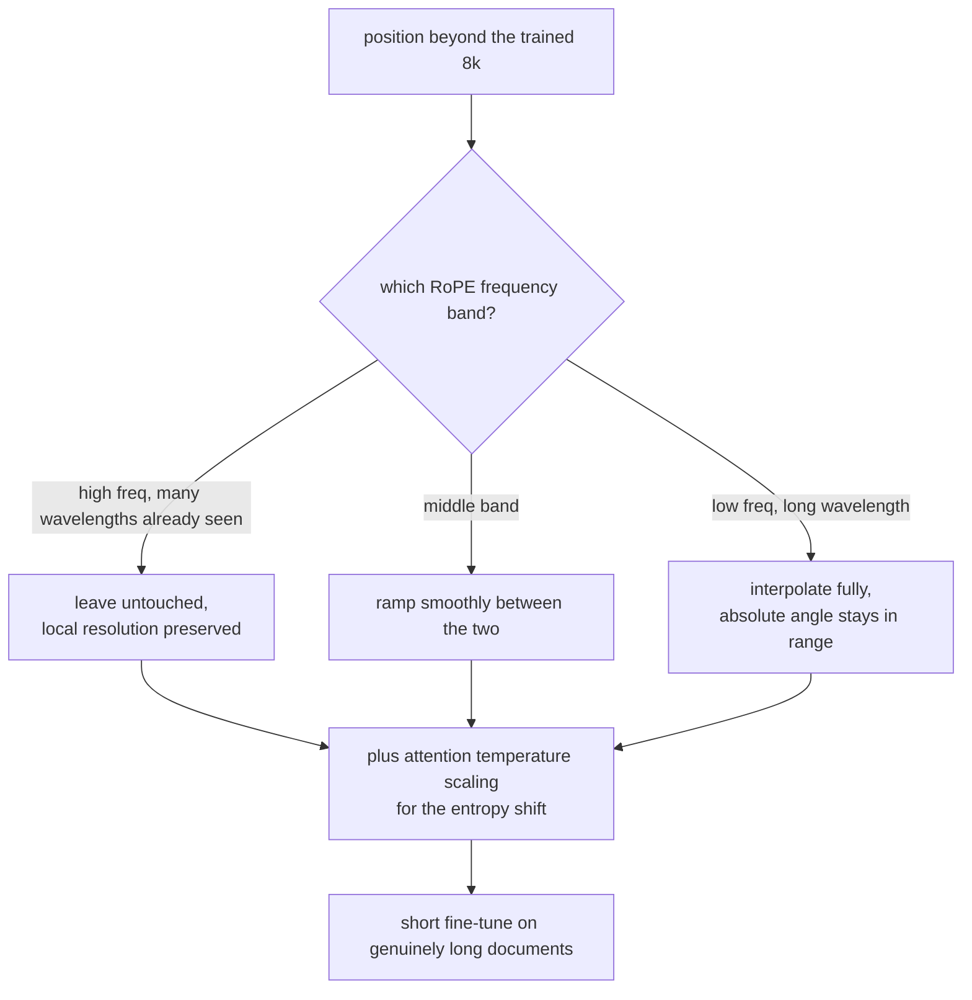

**Follow-ups:** Why do high-frequency RoPE dims need no interpolation? Why does long-context extension usually still require some fine-tuning on long documents? How would you verify usable context length before shipping?

</details>

### 30. What are MQA and GQA, and why do they exist?

<details><summary><b>Answer</b></summary>

They exist because of KV cache memory. In standard multi-head attention (MHA), every one of h heads has its own K and V projections, so the cache stores h keys and h values per token per layer. Cache size - not FLOPs - is the binding constraint on serving throughput: it determines how many concurrent sequences fit on a GPU (batch size), and decode speed is bounded by streaming the cache from HBM every step. Cutting KV heads attacks both.

**MQA (multi-query attention)**, from Shazeer's "Fast Transformer Decoding: One Write-Head is All You Need": keep h query heads but share a **single** K/V head across all of them. Cache shrinks by h× (e.g. 32×), decode bandwidth drops proportionally. Cost: measurable quality regression on some tasks, and training can be less stable - one K/V representation has to serve every query head's needs.

**GQA (grouped-query attention)**, Ainslie et al.: the interpolation. Partition the h query heads into g groups, each group sharing one K/V head - e.g. Llama-style 70B models use 64 query heads with 8 KV heads (groups of 8). Cache shrinks 8×, and quality is empirically near-indistinguishable from MHA. The GQA paper also showed you can **uptrain** an existing MHA checkpoint into GQA by mean-pooling its K/V heads and continuing training briefly - you don't need to pretrain from scratch. GQA has been the default in most open models since 2023 (Llama 2/3 large variants, Mistral, Qwen...), with MLA as the main alternative in the DeepSeek and Kimi lineages.

Concrete impact: a 70B-class model at fp16 with 80 layers and head_dim 128 stores ~2.6 MB/token with 64 KV heads versus ~320 KB/token with 8 - the difference between fitting ~4 and ~30+ long sequences in the same memory.

The natural follow-on is **MLA** (multi-head latent attention, DeepSeek): compress K/V into a shared low-rank latent vector per token and reconstruct per-head K/V from it - cutting cache further while *increasing* effective head diversity versus GQA. Worth mentioning to show you know where this design line went.

**Worth sketching.** Query heads on one side, KV heads on the other: the sharing ratio is the entire design space.

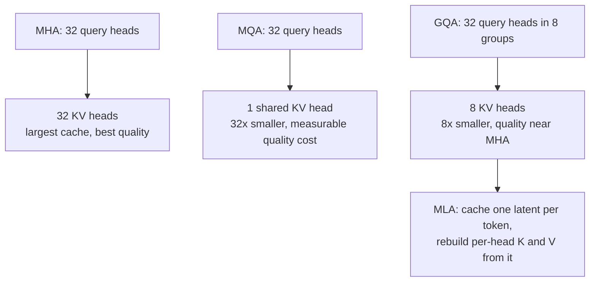

**Follow-ups:** Why is decode throughput bounded by memory bandwidth, and how does GQA change the arithmetic? How does the GQA uptraining recipe work? What does MLA do differently?

</details>

### 31. Derive the KV cache memory formula and compute it for a concrete model.

<details><summary><b>Answer</b></summary>

Derivation from what's stored: for each token, at each layer, the cache holds that token's key and value vectors for every KV head. A key (or value) vector per head has head_dim elements. So:

**bytes per token = 2 × n_layers × n_kv_heads × head_dim × bytes_per_element**

(2 for K and V; multiply by seq_len for a sequence, and by batch size for a serving node.) Note it's **kv** heads - with GQA the query head count is irrelevant to the cache.

Concrete: a Llama-3-70B-shaped model - 80 layers, 8 KV heads (GQA), head_dim 128, fp16 (2 bytes):

```python
bytes_per_token = 2 * 80 * 8 * 128 * 2      # = 327,680 ≈ 320 KB/token
seq_128k = bytes_per_token * 131_072        # ≈ 42 GB for one sequence
seq_8k   = bytes_per_token * 8_192          # ≈ 2.7 GB
```

So a single 128k-context conversation consumes ~40+ GB of GPU memory *beyond* the ~140 GB of fp16 weights. With full MHA (64 KV heads) it would be 8× worse: ~2.6 MB/token, ~340 GB at 128k - completely unservable. That one comparison is the entire justification for GQA.

Engineering consequences to draw out: (1) batch capacity - cache memory, not weights, caps concurrent users, so cache size directly sets cost per request; (2) **PagedAttention** (vLLM) exists because naively pre-allocating max-length contiguous cache wastes most of it - paging allocates on demand in blocks, like virtual memory; (3) **KV quantization** to fp8/int8 halves or quarters this again with modest quality cost; (4) **prefix caching** shares the cache of common prompt prefixes (system prompts, few-shot examples) across requests - huge savings for agentic workloads that repeatedly re-send growing conversations; (5) speculative decoding, beam search, and parallel sampling all multiply cache pressure.

Sanity-check habit: memorise the formula, not model numbers - interviewers vary the architecture and want to watch you compute.

**Worth sketching.** Writing the multiply chain out means you can recompute it live when the interviewer changes the architecture on you.

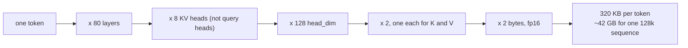

**Follow-ups:** How does PagedAttention reduce waste, and what problem does fragmentation cause? On an 8×80 GB node serving this model, how many concurrent 32k-token sequences fit after the weights? How does sliding-window attention change the formula?

</details>

### 32. Explain min-p sampling and repetition/frequency penalties. When do standard sampling settings fail?

<details><summary><b>Answer</b></summary>

**Min-p** keeps only tokens whose probability is at least min_p × p_max (the top token's probability), then renormalizes and samples. The threshold *scales with model confidence*: if the top token has p = 0.9, min_p = 0.1 keeps only tokens above 0.09 - essentially just the head; if the top token has p = 0.1 (genuine uncertainty), tokens above 0.01 survive - wide, appropriate diversity. Contrast with top-p, whose cumulative-mass criterion degrades at high temperature: flattened distributions push the nucleus deep into the junk tail. Min-p stays anchored to the best token, which is why it enables stable sampling at temperatures like 1.5-3 where top-p output falls apart - popular in creative-writing and open-model communities, supported in vLLM and llama.cpp.

**Repetition-family penalties** exist because autoregressive models have a self-reinforcing loop: repeated text raises the probability of repeating further, and greedy/low-temperature decoding can lock into cycles. Three standard variants: **repetition penalty** (divide/multiply logits of previously seen tokens by a factor like 1.1-1.3), **frequency penalty** (subtract an amount proportional to the token's count so far - punishes heavy reuse progressively), and **presence penalty** (flat subtraction for any token that has appeared at all - pushes topic novelty). OpenAI-style APIs expose the latter two.

**When standard settings fail** - the part that shows production experience:

- **Structured output/code with penalties on**: JSON needs to repeat `"`, `{`, `,`, field names; code needs repeated identifiers and indentation tokens. Repetition penalties corrupt exactly these - a classic cause of malformed JSON. Turn them off (or near-off) for structured generation; use constrained decoding instead.
- **High temperature + top-p**: incoherence via tail sampling - switch to min-p or lower T.
- **T = 0 for long free-form generation**: repetition loops - the thing penalties were invented for.
- **Aggressive presence penalty in long conversations**: the model starts avoiding necessary domain terms it already used.
- Also: penalties apply to *token IDs*, not words - they can't see that "dog" and " dog" are the same word, another tokenization leak.

**Follow-ups:** Why does top-p specifically break down at high temperature? How would you generate guaranteed-valid JSON - sampling settings or constrained decoding? Why do repetition penalties operate on tokens rather than words, and what artifacts does that cause?

</details>

### 33. What are logprobs, and what are they useful for in production systems?

<details><summary><b>Answer</b></summary>

A logprob is the log of the probability the model assigned to a token - log softmax(z) - at a given step. APIs (e.g. OpenAI's `logprobs`/`top_logprobs`) can return, per output token, its logprob plus the top-k alternative tokens and theirs. They're the closest thing you get to the model's internal confidence, and they're free - no extra forward pass.

Production uses:

- **Classification with confidence.** Frame the task so the answer is a single token ("yes"/"no", "A" - "D"); the logprob is a confidence score. Route low-confidence cases to a bigger model, a human, or an abstention path. This is the cleanest way to get calibrated-ish scores out of an LLM classifier, and to set precision/recall thresholds like a normal ML system.
- **Hallucination/uncertainty heuristics.** Low or entropy-spread logprobs on content-bearing spans (names, numbers, dates) flag likely fabrications. Not a guarantee - models can be confidently wrong - but a usable signal for triggering verification or citation checks.
- **Reranking and scoring.** Score candidate completions, retrieval passages, or MCQ options by total/average logprob; perplexity of a document under the model is a fluency/anomaly signal (also used heavily in pretraining data filtering).
- **Evals.** Perplexity-based evaluation; MCQ benchmarks (score each option, pick the max - the standard trick behind many benchmark harnesses) - cheaper and lower-variance than parsing generated answers.
- **Debugging.** When output goes weird at a specific point, per-token logprobs show exactly where the model got uncertain, and top-k alternatives show what it almost did - invaluable for prompt debugging and for spotting tokenizer artifacts.
- **Distillation/data work.** Soft targets for training smaller models; confidence-based filtering of synthetic data.

Caveats a strong candidate raises: RLHF-tuned models are notoriously **miscalibrated** relative to base models (alignment sharpens distributions), so treat logprobs as relative signals, tune thresholds on your own data; sequence-level probability ≠ answer correctness (many phrasings share the same answer - its true probability is spread across paraphrases); and closed APIs may not expose logprobs on all endpoints/models, sometimes for distillation-prevention reasons.

**Follow-ups:** Why does RLHF hurt calibration? Design a confidence-thresholded router using logprobs - what would you validate? Why is the probability of an *answer* not the same as the probability of a *sequence*?

</details>

### 34. Describe the modern LLM training pipeline: pretraining → mid-training → SFT → RL.

<details><summary><b>Answer</b></summary>

**Pretraining** - next-token prediction over trillions of tokens (web crawl, code, books, papers; heavily filtered, deduplicated, and mixture-weighted). This is where most compute has traditionally gone (months on thousands of accelerators) and where capabilities - language, knowledge, code, latent reasoning - actually come from. Output: a *base model* that completes text but doesn't follow instructions or converse; it might answer your question or continue it with three more questions.

**Mid-training** (continued pretraining) - the messy-but-crucial middle stage labs now name explicitly: still next-token prediction, but on deliberately curated data for targeted goals: injecting high-quality domain data (math, code, synthetic textbooks), **context-length extension** (long documents + RoPE rescaling - long context is a mid-training deliverable, not a pretraining default), and **annealing** - decaying the learning rate over the highest-quality data, upweighting instruction-formatted and exam-style material so the base model lands closer to its post-trained destination.

**SFT (supervised fine-tuning)** - cross-entropy on curated (prompt, response) pairs, loss usually masked to response tokens. Teaches format and behaviour: chat structure, instruction following, tool-call syntax, refusal style, persona. Relatively tiny (order of 10⁴ - 10⁶ examples) and cheap versus pretraining. Key mental model: SFT *elicits and shapes* what pretraining built; it adds behaviour, not (much) knowledge - pushing new facts via SFT tends toward memorisation and can even encourage hallucination-shaped behaviour.

**RL / preference optimisation** - align outputs with human or verifiable preferences beyond what demonstrations capture. Classic **RLHF**: train a reward model on human preference pairs, optimise the policy with PPO under a KL leash to the SFT model. **DPO** and successors skip the explicit reward model, optimising preferences directly - simpler, cheaper, widely used. **RLVR** (RL from verifiable rewards, e.g. **GRPO**): reward comes from checkable outcomes (unit tests pass, math answer matches) - this is what trains o1/R1-style reasoning models and represents the current frontier, because it can *extend* capabilities rather than just steer style.

Framing that lands well: pretraining ≈ building the engine; mid-training ≈ upgrading components; SFT ≈ teaching it to drive on roads; RL ≈ coaching it against outcomes. Historically each stage was orders of magnitude cheaper than the previous; reasoning-focused RL has narrowed that gap sharply since 2025, with RL budgets at some labs now a substantial fraction of pretraining. Either way, the later stages disproportionately determine perceived quality.

**Worth sketching.** Labelling the edges with what each stage adds stops the four stages all sounding like the same stage.

```mermaid
flowchart LR
    PT["pretraining: trillions of tokens,<br/>next-token prediction"] -->|"the bulk of compute"| BM["base model: completes text,<br/>does not converse"]
    BM -->|"curated data, long documents"| MT["mid-training: domain mix,<br/>context extension, annealing"]
    MT -->|"10^4 to 10^6 pairs"| SFT["SFT: chat format, instruction following,<br/>tool syntax, refusal style"]
    SFT -->|"preferences or verifiers"| RL["RL: RLHF and DPO for style,<br/>RLVR and GRPO for checkable outcomes"]
    RL --> SHIP["shipped model"]
```

**Follow-ups:** Why does SFT on new facts encourage hallucination? What does the KL constraint in RLHF prevent? Why did verifiable rewards unlock reasoning gains that preference-based RLHF didn't?

</details>

### 35. What is an attention sink, why does it exist, and what breaks if you evict it from the KV cache?

<details><summary><b>Answer</b></summary>

An attention sink is a position, almost always the very first token, that soaks up a large share of attention mass across most heads and layers regardless of its content. It is not a bug and it is not about the token being important.

It exists because softmax must sum to 1. A head that has nothing relevant to fetch at this position still has to put its full weight somewhere. It learns to dump it on a token every position can see (position 0, under causal masking) whose value vector contributes close to nothing. So the sink is how a model expresses "attend to nothing" inside a mechanism with no null option.

The practical consequence is StreamingLLM's finding. If you run naive sliding-window KV eviction and the window rolls past token 0, perplexity does not degrade gracefully, it explodes. The mass that was harmlessly parked on the sink gets redistributed onto real tokens, distorting every attention distribution in the model. The fix is almost embarrassingly cheap: pin the first ~4 tokens' KV permanently alongside the rolling window, and stability is restored out to millions of streamed tokens.

Be precise about what that does not do. It does not extend effective context. Tokens evicted from the middle are gone. It is for endless streaming, a chat session that never terminates, not for long-context recall.

Architectural responses: train with a dedicated learnable sink token so the behaviour is explicit rather than emergent; or give the softmax an escape valve, either an off-by-one formulation with an extra zero logit in the denominator or a learned per-head bias, so heads do not need to hijack a real token to no-op.

The connection interviewers love: sink positions carry enormous activation outliers, since the model pushes huge values through specific residual dimensions to win that competition. That is a large part of why naive activation quantization falls over, and it ties this straight into serving.

**Worth sketching.** The branch at eviction is the memorable part: one token rolls off and every attention distribution shifts.

```mermaid
flowchart TD
    S["softmax must sum to 1"] --> NN["a head with nothing to fetch<br/>still has to put its mass somewhere"]
    NN --> T0["token 0: visible to every position,<br/>value vector contributes ~ nothing"]
    T0 --> EV{"sliding window rolls past token 0?"}
    EV -->|"evicted"| BOOM["mass lands on real tokens instead,<br/>perplexity explodes"]
    EV -->|"first ~4 tokens pinned"| OK["stable over millions of streamed tokens"]
    OK --> NOTE["but no extra recall:<br/>evicted middle tokens are still gone"]
```

**Follow-ups:** How does a learned softmax bias change the quantization story? Would you expect attention sinks in an encoder-only model?

</details>

### 36. Explain sliding-window attention and hybrid local/global stacks. What do you gain and what do you give up?

<details><summary><b>Answer</b></summary>

Sliding-window attention restricts each token to the last w tokens instead of the whole prefix. Time goes from O(n^2) to O(n*w), and more importantly the KV cache for those layers is capped at w entries rather than growing with n. Mistral 7B popularised it with a 4096 window; Gemma 2 and 3 interleave it with full-attention layers.

The point candidates usually miss: a stack of windowed layers is not as myopic as it sounds, because the receptive field compounds with depth exactly like a CNN. With window w and L layers, information can in principle travel ~L*w positions. But propagation through many hops is lossy and diffuse, and any single-hop exact retrieval, quoting a string sitting further than w back, simply cannot happen in a local layer.

Hence the modern pattern: hybrid stacks. Interleave mostly local layers with occasional full-attention layers, for example Gemma 3's 5:1 local-to-global ratio with 1024-token windows. The global layers do exact long-range retrieval; local layers do the cheap bulk of the work. Published ablations show minimal perplexity cost, and the KV savings at 128k are large because only 1 layer in 6 has a cache that scales with n.

What you give up and what to watch:

- Effective retrieval context is governed by the global layers, not by the advertised window. The ratio is a real quality knob, not free.
- The remaining full-attention layers become the memory bottleneck, which is why teams stack further tricks on exactly those layers: cross-layer KV sharing, MLA, cache quantization.
- Prefix caching and cache reuse get fiddlier when layers have heterogeneous cache semantics.
- Mask bugs in local layers are silent at short context and only surface at long context, so your test suite needs long cases or you will ship it.

Compared to a learned sparse pattern, sliding windows hard-code the assumption that relevance is local. That is a good prior for prose and a poor one for code with distant definitions, which is part of why learned sparsity has moved from research into shipped models: DeepSeek-V3.2's sparse attention uses a lightweight indexer to score prior positions and lets each query attend only to the top-scoring ones.

**Worth sketching.** Drawing the 5:1 block shows exactly which layers still carry a cache that grows with context.

```mermaid
flowchart LR
    IN["tokens"] --> L1["local layer, window 1024<br/>cache capped at w"]
    L1 --> L2["five local layers in a row"]
    L2 --> G["one full-attention layer<br/>cache grows with n"]
    G --> OUT["repeat the block"]
    L2 --> RF["receptive field compounds to ~ L x w,<br/>but multi-hop propagation is lossy"]
    G --> EX["exact long-range retrieval<br/>can only happen here"]
```

**Follow-ups:** How would you choose the local-to-global ratio for a code model versus a chat model? What does sliding-window attention do to prefix caching in a multi-turn agent?

</details>

### 37. What is Multi-head Latent Attention, and how is it actually different from GQA?

<details><summary><b>Answer</b></summary>

GQA shrinks the KV cache structurally: fewer KV heads, shared across groups of query heads. You are throwing away head diversity in K and V and hoping it does not matter much.

MLA takes a different cut. Project the hidden state down to a small latent vector, cache only that latent, and reconstruct per-head K and V with learned up-projections at attention time. Conceptually every head keeps its own K and V; you just store a compressed representation. It came from DeepSeek-V2 and carried into V3.

Why it is not just "GQA with extra steps": the up-projection matrices are static, so they can be algebraically absorbed into the query and output projections. At inference you never materialise full per-head K, you compute scores against the latent directly. That makes it a genuine memory win rather than trading memory for recompute. DeepSeek reported roughly a 93% KV cache reduction versus their MHA model at V2, with quality matching or beating GQA in their ablations, which is the unusual part: normally cache compression costs you something.

The complication is RoPE, and this is the detail that separates people who have read the paper from people who have read a summary. RoPE applies a position-dependent rotation, and you cannot absorb a position-dependent rotation into a static up-projection, so the absorption trick breaks. DeepSeek's answer is decoupled RoPE: split the head dimension into a compressed no-RoPE part and a small separate RoPE-carrying part that is cached uncompressed and shared across heads.

When would I pick it? Only when KV memory at long context is genuinely my binding constraint and I control the serving stack. MLA is materially harder to implement and to shard under tensor parallelism, kernel support (improved since dedicated MLA kernels and mainstream serving engines added it) is still narrower than for GQA, and the reported quality advantage shows up mainly at large scale. Below roughly 100B most teams still choose GQA, and that is a defensible engineering call: GQA is simple, supported everywhere, and good enough. Complexity you cannot serve is negative value.

**Worth sketching.** The separate RoPE-carrying path is the detail that shows you read the paper rather than a summary of it.

```mermaid
flowchart LR
    H["hidden state"] --> C["down-project to a small latent"]
    C --> CACHE["cache the latent only"]
    CACHE --> UP["up-projections rebuild per-head K and V"]
    UP --> ABS["static, so absorb them into W_q and W_o:<br/>score against the latent directly"]
    H --> RP["small RoPE-carrying slice, cached<br/>uncompressed and shared across heads"]
    ABS --> SC["attention scores"]
    RP --> SC
```

**Follow-ups:** How does MLA interact with tensor parallelism compared to GQA? Would you expect MLA or KV cache quantization to be the better first move on an existing GQA model?

</details>

### 38. Why is quantizing activations harder than quantizing weights, and how does that shape architecture choices?

<details><summary><b>Answer</b></summary>

Weights are static, roughly Gaussian per channel, and well behaved. You compute scales offline, per channel, once, and move on. Activations are dynamic and dominated by outliers: a small number of feature dimensions carry values orders of magnitude larger than everything else, consistently in the same channels, and the problem worsens with model scale. Since a quantization scale is set by the max, one outlier crushes every other value in that tensor toward zero.

Where the outliers come from is architecture-linked, which is the connection worth making: attention sinks. Heads that want to no-op push extreme values through specific residual dimensions, and norm gains amplify particular channels. The quantization problem and the softmax-has-no-null-option problem are the same problem.

Responses, roughly in order of sophistication:

- Isolate them. LLM.int8() keeps outlier dimensions in fp16 and quantizes the rest. Correct, but it breaks the fast path, so you often lose the speed you came for.
- Move the difficulty. SmoothQuant migrates scale from activations into weights with a per-channel equalisation, because weights tolerate it. AWQ uses activation statistics to identify salient weight channels and protects those.
- Change the format. FP8 (E4M3) has far wider dynamic range than INT8 at identical bit width, which is exactly what outliers need, and modern accelerators have native FP8. This is why serving stacks largely went FP8 rather than fighting INT8, and Blackwell-class hardware pushes the same logic down to 4-bit floating-point formats (MXFP4, NVFP4) that pair tiny elements with fine-grained block scales.
- Design for it. QK-norm, a learned softmax bias so heads have a real no-op option, and training natively in low precision (DeepSeek-V3 reported FP8 pretraining) all attack the cause rather than the symptom.

KV cache quantization is a separate axis and usually the cheapest long-context win, since at 128k the cache dwarfs the weights. Asymmetry worth knowing: K has persistent per-channel outliers that V lacks, and RoPE complicates K further by mixing channel pairs (some methods quantize keys before RoPE is applied for this reason), so stacks commonly quantize V more aggressively than K, or use per-channel scales for K and per-token for V.

**Follow-ups:** You quantize weights to 4-bit and see no benchmark drop. What would make you distrust that result? Why does quantization hurt long generations more than short ones?

</details>

### 39. A vendor advertises 1M context with 100% needle-in-a-haystack. What has that actually proven, and how would you evaluate long context properly?

<details><summary><b>Answer</b></summary>

It proves the model can retrieve one lexically distinctive span from an otherwise unrelated haystack. That is close to the easiest long-context task that exists. The needle is out-of-distribution against the filler, so attention finds it by contrast, not by comprehension. Saturating NIAH is necessary but very weak evidence. It is a smoke test, and treating it as a capability claim is the mistake.

What it does not test:

- Multiple needles, and needles that must be combined across separated positions (multi-hop).
- Aggregation over the whole context: count, sort, or summarise every mention. Retrieval attention cannot shortcut this, and accuracy falls off a cliff much earlier here than on NIAH.
- Distractors. Real corpora are full of near-duplicate and contradictory passages. A single unique needle in unrelated filler is nothing like your actual documents.
- Negatives. Can the model say the fact is not present? A model trained to always find something will invent a needle, and NIAH never measures that.
- Reasoning over retrieved content rather than quoting it.

What I would actually build: an eval on our own documents at our real lengths, with multi-fact and multi-hop queries, hard distractors mined from the corpus, a meaningful share of unanswerable questions to get a false-positive rate, at least one full-context aggregation task, and a sweep across depth and length so I get a degradation curve rather than one number. The output I want is effective context: the length at which accuracy crosses our bar. Public suites worth borrowing structure from are RULER, which generates variable-difficulty synthetic tasks and consistently puts effective context well below advertised context, realistic-task suites in the LongBench family, and BABILong for multi-hop.

Then the economics. Prefill is quadratic and KV memory is linear in length. If effective context is 32k, paying to stuff 1M tokens is buying latency and cost to get a worse answer than good retrieval would give. Long context does not retire RAG; it changes the chunk size.

**Follow-ups:** How would you construct hard distractors automatically from a customer's corpus? What does an unanswerable-question false-positive rate tell you that accuracy does not?

</details>

### 40. What is multi-token prediction as a training objective, and what does it buy you?

<details><summary><b>Answer</b></summary>

Instead of a single head predicting token t+1, multi-token prediction adds heads or modules that also predict t+2, t+3 and so on from the same trunk, trained with auxiliary losses. There are two payoffs and they are quite different in character.

First, better representations. Forcing the hidden state at position t to encode information about several future tokens pushes the model to plan slightly ahead instead of optimising a purely local greedy signal. Gloeckle et al. (2024) found the gains grow with model scale and are largest on code and generative benchmarks, and notably that it can hurt small models. That scale dependence is why it is not universal.

Second, and more concretely valuable, a free draft model. The extra heads are a speculative-decoding draft that shares the trunk, costs almost nothing, and is by construction distribution-matched to the target, which is the thing that usually limits acceptance rate. DeepSeek-V3 trains an MTP module and reuses it at inference exactly this way, reporting a high acceptance rate for the next predicted token. This is the Medusa and EAGLE idea folded into pretraining rather than bolted on after the fact.

Design details that matter: DeepSeek's version is sequential, each module conditioning on the previous module's prediction, rather than the independent parallel heads of the original formulation. That keeps the causal chain intact and improves acceptance, at the cost of some parallelism. The heads can also simply be dropped at inference, so if you only want the representation benefit the cost is training-time only.

Tradeoffs: extra parameters and memory during training, another loss-weighting hyperparameter to tune, and a benefit that is scale-dependent enough that you need your own ablation rather than a citation. And I would be honest that the "it learns to plan" story is contested; some of the improvement may just be a denser training signal acting as regularisation. The speculative-decoding payoff, unlike the planning claim, is unambiguous and easy to measure.

**Worth sketching.** One trunk feeding several heads makes the free-draft-model claim self-evident.

```mermaid
flowchart LR
    TR["shared trunk, position t"] --> H1["head: predict t+1"]
    TR --> H2["module: predict t+2,<br/>conditioned on t+1"]
    H2 --> H3["module: predict t+3"]
    H1 --> LOSS["auxiliary losses, training only"]
    H2 --> LOSS
    H3 --> LOSS
    H2 --> SD["at inference: a draft that shares the trunk<br/>and is distribution-matched by construction"]
```

**Follow-ups:** Why does an MTP draft head achieve higher acceptance than a separately trained 1B draft model? How would you weight the auxiliary losses across the t+2, t+3 heads?

</details>

### 41. Mamba and state-space models were supposed to replace transformers. What actually happened, and why?

<details><summary><b>Answer</b></summary>

They did not replace transformers, they got absorbed into hybrids. The reason is the cleanest illustration of the central tradeoff in sequence modelling, which is why the question is asked.

Mechanism: an SSM or linear-attention layer carries a fixed-size recurrent state. Per-token inference is O(1) in time and memory regardless of position, with no KV cache growing with n. Mamba's specific contribution (S6) was making the state transition input-dependent, which earlier SSMs lacked, while keeping a parallel scan so training still parallelises across the sequence.

The catch is information-theoretic and no amount of engineering fixes it. A fixed-size state cannot losslessly retain an arbitrarily long prefix. A transformer's KV cache is a lossless, growing record, which is precisely why it can quote an exact string from 100k tokens back. An SSM must decide at write time what to keep, before it knows what will be asked. So SSMs are competitive on language-modelling perplexity and aggregation, and measurably weaker on exact recall, copying, and in-context retrieval. Multi-query associative recall probes showed this early and clearly. That weakness is fatal for the thing people most want long context for.

Hence hybrids, which is where the field actually landed: keep a small fraction of full-attention layers, from roughly 1 in 4 down to around 1 in 10 or fewer in shipped models like Jamba, Zamba, Nemotron-H, Qwen3-Next and Kimi Linear, for exact retrieval, and make everything else linear or SSM. You get near-flat memory growth in context length and much better long-context throughput at close to transformer quality. The structure mirrors hybrid local/global attention, and for the same reason: a few exact layers plus many cheap ones.

Practical caveats in 2026: kernel and serving support is thinner than for attention; prefix caching semantics differ, because you are caching a recurrent state that is not sliceable or reusable the way a KV cache is, which matters a lot for agent workloads; and the best-controlled public comparison (NVIDIA's 2024 study training transformer, Mamba-2 and hybrid models at 8B on identical data) favoured the hybrid, but nothing equivalent exists at frontier scale, so architecture choice remains partly conviction plus your own ablations.

**Worth sketching.** Put the fixed state and the growing cache side by side and the hybrid draws itself as the obvious consequence.

```mermaid
flowchart LR
    A["SSM layer: fixed-size recurrent state"] --> B["O(1) per token, nothing grows with n"]
    A --> C["must decide what to keep at write time,<br/>before it knows the question"]
    D["attention layer: KV cache"] --> E["lossless growing record,<br/>can quote a string from 100k back"]
    D --> F["memory grows linearly with n"]
    C --> HY["hybrid: 1 attention layer<br/>in every 4 to 10 or so"]
    E --> HY
    HY --> R["near-flat memory growth,<br/>exact retrieval preserved"]
```

**Follow-ups:** Why does prefix caching get harder with a recurrent state than with a KV cache? For an agent doing long tool-use trajectories, would you take a hybrid or a pure transformer?

</details>

### 42. Reasoning models expose a thinking budget or reasoning effort setting. How do you tune it, and what goes wrong?

<details><summary><b>Answer</b></summary>

Treat it as an explicit accuracy-versus-cost-and-latency knob, and calibrate it per task with an eval rather than by intuition. The shape is a saturating curve: accuracy climbs steeply over the first stretch of thinking tokens, flattens, and on easy tasks can actually decline.

First, know which control you have, because they behave differently:

- A hard token cap enforced at decode. The model gets cut off and forced to answer, which can truncate mid-derivation and produce something worse than no thinking at all.
- A trained control token or effort level the model was RL'd to respect, which is a soft budget it plans around and degrades gracefully.
- A prompt hint like "think briefly", which models follow unreliably.

What I do:

- Build a task-level eval, sweep the budget, plot accuracy and p95 latency together, and pick the knee. Different tasks have wildly different knees. Extraction and classification usually want zero.
- Route rather than pick one setting. A cheap classifier sends the hard slice to high effort and everything else to low or off. Most production traffic does not need thinking, and paying for it uniformly is the single most common way teams overspend here.
- Watch for overthinking, which is a real and measurable failure: on easy problems, long chains talk the model out of a correct initial answer. Watch also for the model burning its whole budget on an underspecified problem instead of asking a question.
- Respect the cost model. Thinking tokens bill as output tokens, output tokens are the expensive ones, and they are generated serially, so budget maps almost linearly onto latency. A 10x budget is roughly a 10x latency hit on that call.
- Do not plan around reading them. Providers commonly summarise, encrypt or strip the traces, and whether earlier reasoning is carried into later turns (typically passed back as opaque or encrypted reasoning items during tool use) is provider-specific and changes between API versions, so building logic that inspects reasoning content is building on sand.

The answer that fails this question is "set it high for quality". That is not a tradeoff, that is a bill.

**Worth sketching.** It reframes the answer as routing and calibration rather than picking a number and defending it.

```mermaid
flowchart TD
    R["incoming request"] --> CL{"cheap classifier: does this earn thinking?"}
    CL -->|"no: extraction, classification, formatting"| OFF["thinking off, fast path"]
    CL -->|"yes: multi-step, verifiable"| HI["high effort budget"]
    HI --> EV["sweep the budget on a task eval,<br/>plot accuracy against p95 latency"]
    EV --> KNEE["ship the knee, not the maximum"]
    KNEE --> W["watch for overthinking, and for hard caps<br/>truncating mid-derivation"]
```

**Follow-ups:** How would you build the router that decides which requests get high effort? What would you monitor in production to detect that your chosen budget has drifted out of calibration?

</details>

### 43. What is the reversal curse, and what does it reveal about how LLMs store knowledge?

<details><summary><b>Answer</b></summary>

The reversal curse (Berglund et al., 2023) is the finding that a model trained on "A is B" does not automatically learn "B is A". Fine-tune a model on statements like "Daphne Barrington is the director of 'A Journey Through Time'" and it answers "Who is Daphne Barrington?" but does no better than chance on "Who directed 'A Journey Through Time'?". The same asymmetry shows up for real facts: models name a celebrity's parent far more reliably than they name that parent's famous child.

Why: next-token prediction only trains the direction the text was written in. The gradient from "A is B" strengthens the path from A's representation to B's tokens, and nothing in that update teaches the model to retrieve A when given B. This fits the picture of FFN layers as key-value memories: the fact is stored under a key built from the subject, and a lookup keyed on the object finds nothing. Parametric knowledge is a set of directed associations, not a symmetric database.

The distinction that matters: in context, models reverse fine. Put "A is B" in the prompt and ask who B is, and the model answers, because attention can read the context in any order. The curse is about knowledge stored in weights, which is the same split you see between knowledge editing and retrieval.

Practical consequences:

- Do not assume fine-tuning a fact teaches its inverse or its consequences. This is the same failure as ripple effects in knowledge editing.
- If you inject knowledge by fine-tuning, state each fact in both directions and several phrasings. Paraphrasing alone did not fix it in the original experiments; explicitly including the reverse direction, or training on reversed text, does help.
- Famous facts often survive in both directions only because pretraining saw them written both ways.
- It is one more argument for retrieval when facts must be queryable from arbitrary angles.

It is also a useful antidote to anthropomorphising. A person who learns "A is B" gets "B is A" for free. A model has to have seen it.

**Follow-ups:** Why does reversal work in context when it fails in weights? How would you structure fine-tuning data so a set of product facts is retrievable from any direction? Would you expect a bidirectional encoder to show the same asymmetry?

</details>

## Advanced

### 44. What is "lost in the middle," and why doesn't a long context window equal reliable retrieval?

<details><summary><b>Answer</b></summary>

"Lost in the middle" (Liu et al., 2023) is the empirical finding that models retrieve and use information best when it sits at the **beginning or end** of the context, with a pronounced accuracy dip for content in the middle - a U-shaped curve, demonstrated on multi-document QA and key-value retrieval tasks. Strikingly, this held even for models explicitly built for long contexts - extended-context variants were no better at using mid-context information than their short-context siblings at equal positions.

Why it happens (plausible mechanisms, worth presenting as such): training data has positional structure - important content clusters at document starts (headlines, abstracts) and recency matters for next-token prediction, so attention learns primacy and recency priors; attention mass also concentrates on early tokens ("attention sinks") and recent tokens by construction. Add causal masking's asymmetry and there's no pressure during pretraining to weight the middle of a 100k-token window uniformly.

Why long context ≠ retrieval - the engineering takeaways:

- **Advertised ≠ usable.** A model accepting 1M tokens is not a promise of uniform recall over 1M tokens. Needle-in-a-haystack tests are the *easy* case (verbatim retrieval of a distinctive string); realistic tasks - aggregating several mid-context facts, reasoning across them, resisting distractors - degrade much earlier, which is what harder suites (RULER-style, multi-needle, long-form reasoning benchmarks) show.
- **RAG survives long context.** Retrieval + curation puts the relevant 2k tokens where the model performs best, at a fraction of the prefill cost and latency of stuffing 500k tokens per query - quadratic prefill and per-token pricing make brute-force context economically dominated even when quality holds.
- **Position-aware prompting matters**: put instructions and the most critical material at the start and end; re-state key constraints near the end for long agentic transcripts; summarise/compact long histories rather than letting them grow.

Nuance for 2026: frontier models have substantially improved mid-context recall - the effect has shrunk, not vanished - and it remains worst on aggregation-style tasks. Verify against your own workload; don't assume either the 2023 pathology or vendor claims.

**Follow-ups:** How would you design an eval for *usable* context length on your workload? Why do needle-in-a-haystack results overstate long-context ability? What are attention sinks and how do they connect?

</details>

### 45. Compare Kaplan and Chinchilla scaling laws. What did Chinchilla change?

<details><summary><b>Answer</b></summary>

Both fit power laws relating loss to model size (N), data (D), and compute (C ≈ 6ND for training) - the shared, load-bearing conclusion being that loss improves predictably and smoothly as a power law across many orders of magnitude, which is what makes betting hundreds of millions on a training run rational.

**Kaplan et al. (2020, "Scaling Laws for Neural Language Models")** concluded that for a fixed compute budget, you should scale **parameters much faster than data** - most incremental compute goes into a bigger model. The field followed: GPT-3 (175B on ~300B tokens) and Gopher (280B on 300B tokens) are Kaplan-shaped - enormous models, comparatively little data.

**Chinchilla (Hoffmann et al., 2022)** re-ran the analysis with a crucial fix: Kaplan's experiments had used a roughly fixed (and too-short, non-optimised) learning-rate schedule across runs, undertraining the smaller models and biasing the fit toward "parameters matter more." With schedules tuned per compute budget (plus IsoFLOP analyses and a parametric loss fit), the corrected answer: **scale N and D roughly equally** - compute-optimal is approximately **~20 tokens per parameter**. The demonstration: Chinchilla, 70B params on 1.4T tokens, same compute as Gopher (280B/300B), outperformed it across the board. The field's flagship models were 3-4× oversized and correspondingly data-starved.

Consequences: an immediate industry pivot toward smaller-N/bigger-D training; data collection, cleaning, and deduplication became first-class engineering concerns (and "are we running out of high-quality tokens?" became a serious question, pushing synthetic data); and inference costs dropped since equal-quality models got smaller.

Sharp caveats that distinguish a strong answer: Chinchilla-optimal minimises loss *for a fixed training budget only* - it ignores inference entirely, which is why nobody follows it anymore (see the overtraining question); the laws predict *pretraining loss*, not downstream capabilities, and the loss→capability mapping can be nonlinear; and the fitted constants are data- and architecture-dependent - 20 tokens/param is a rule of thumb from one setup, not a physical constant.

**Follow-ups:** Why did Kaplan's learning-rate schedule choice bias the conclusion? What does C ≈ 6ND assume? If high-quality data becomes the binding constraint, how does the optimal allocation shift?

</details>

### 46. Why do modern models train far past Chinchilla-optimal?

<details><summary><b>Answer</b></summary>

Because Chinchilla answers the wrong question for a product company. It minimises loss subject to a fixed **training** compute budget - treating training as the only cost. But training is paid **once**, while inference is paid on **every** request for the model's entire deployed life. For any model with real traffic, lifetime inference compute dwarfs training compute, and inference cost scales with parameter count. So the economically relevant optimisation is: minimise *training + lifetime-inference* cost subject to a quality target - and its solution is a **smaller model trained on far more data** than Chinchilla prescribes.

Mechanics: past the ~20 tokens/param point, additional data still improves a fixed-size model - with smoothly diminishing returns, but no wall. You spend "inefficient" extra training FLOPs to push a small model to a quality level Chinchilla would achieve with a larger model - then harvest the savings on every single inference call, forever. The exchange rate is favourable whenever expected serving volume is high.

Concrete evidence of the regime shift: Chinchilla-optimal for an 8B model is ~160B tokens; Llama 3 8B trained on ~15T tokens - roughly **~1,900 tokens per parameter**, about 100× past "optimal" - precisely because Meta optimised for deployment (including edge/on-device viability), not training-loss-per-FLOP. Essentially every serious open-weights release since (Llama, Qwen, Gemma, Mistral small models) is heavily overtrained in this sense, and the same logic governs closed models' small/fast tiers (the -mini/-flash/-haiku class), typically combined with distillation from larger internal models.

Additional forces pushing the same direction: small models unlock latency-sensitive and on-device products regardless of FLOP accounting; memory footprint (weights + KV cache) constrains serving concurrency, favouring fewer params; distillation makes overtraining even more effective by improving the training signal per token; and MoE complicates the arithmetic further by partially decoupling capacity (total params) from inference cost (active params).

Crisp summary line: Chinchilla tells you the cheapest way to *reach* a loss; inference economics tells you the cheapest model to *serve* at that loss. Modern labs optimise the second.

**Follow-ups:** Sketch the total-cost-of-ownership optimisation that replaces Chinchilla's. How does distillation change the overtraining calculus? Why is MoE another answer to the same economic pressure?

</details>

### 47. What are "emergent abilities," and what is the mirage critique? Where does that debate land practically?

<details><summary><b>Answer</b></summary>

**The claim** (Wei et al., 2022, "Emergent Abilities of Large Language Models"): some capabilities - multi-step arithmetic, certain BIG-Bench tasks, instruction following - show near-random performance across small scales, then jump sharply above some model size. "Emergent" = not predictable by extrapolating from smaller models. This mattered doubly: scientifically (capabilities aren't smooth in scale even though loss is) and for safety planning (if abilities appear unpredictably, you can't forecast what the next 10× model will do).

**The mirage critique** (Schaeffer et al., 2023, "Are Emergent Abilities of Large Language Models a Mirage?"): the sharpness is largely an artifact of **discontinuous metrics**, not discontinuous model improvement. Exact-match on a 5-digit arithmetic problem scores 0 unless *every* token is right; a model can be improving steadily on per-digit accuracy while exact-match sits at zero - until per-token quality crosses the threshold where whole answers start landing, and the metric leaps. Replace exact match with continuous measures (per-token likelihood, edit distance) and the curves become smooth; conversely, you can manufacture "emergence" in ordinary systems by choosing a harsh enough metric. The underlying model improvement is a smooth power law all along.

**Where it lands** - the nuanced position interviewers want:

- The mirage critique is substantially right about *measurement*: much reported emergence dissolves under continuous metrics, and smooth internal progress often precedes visible capability. Loss curves genuinely are smooth.
- But it doesn't make thresholds irrelevant: **the discontinuous metric is often the real-world requirement**. Code either passes tests or doesn't; an agent either completes a task or doesn't; arithmetic is only useful exactly right. If deployment utility is a step function of smooth underlying skill, then *product-level* emergence is real even when *model-level* emergence is a mirage - you still experience "suddenly it works" between model generations.
- Practical synthesis: track smooth leading indicators (per-token metrics, pass@k at high k, log-likelihood on target tasks) to *forecast* when threshold metrics will flip; don't conclude "the model can't do X" from a harsh metric at one scale; and for capability/safety forecasting, assume smooth competence growth with metric-dependent visibility.

**Follow-ups:** Give a concrete task where the deployment metric is inherently discontinuous - what smooth proxy would you monitor? How does this debate affect scaling-law-based capability forecasts? Does chain-of-thought change what appears emergent?

</details>

### 48. Explain Mixture-of-Experts: the router, top-k experts, total vs active parameters. Why does it win?

<details><summary><b>Answer</b></summary>

MoE replaces each transformer block's dense MLP with **E parallel expert MLPs** plus a lightweight learned **router** (typically a single linear layer producing scores over experts, per token, per layer). For each token, the router selects the **top-k** experts (k = 1 or 2 classically; DeepSeek-style designs use finer-grained experts with larger k, often plus an always-on shared expert); the token is processed by only those experts, and their outputs are combined weighted by the router's (softmaxed) gate values. Attention layers usually stay dense; routing decisions are made independently per token and per layer.

This decouples two things dense models entangle: **capacity** (total parameters - all experts) and **per-token compute** (active parameters - only k experts' worth). Mixtral 8x7B: 8 experts, top-2, ~47B total but ~13B active per token. DeepSeek-V3: ~671B total, ~37B active. In a dense model those numbers are equal by definition.

Why it wins: scaling laws reward parameters, but dense parameter growth raises per-token FLOPs proportionally. MoE buys parameter count - more stored knowledge, more specialised computation - at a fraction of the FLOP cost. Empirically, an MoE reaches a given loss with substantially less training compute than a dense model of equal quality, and serves with the latency profile of its *active* size. The implicit bet, which holds in practice, is that not every token needs every parameter: experts specialise (observed specialisation is often syntactic/token-level - code, punctuation, numbers - rather than the tidy topical "math expert" story), and conditional computation exploits that. It's the same economic logic as overtraining: optimise quality per *inference* FLOP, not per parameter.

The costs (previewing the follow-up question): routing is a discrete, load-balancing-sensitive operation that complicates training; and at inference **all experts must be resident in memory** - you pay memory for total params while only computing with active ones, which shapes where MoE makes deployment sense (large batched serving, expert-parallel clusters) and where it doesn't (single consumer GPU).

**Worth sketching.** Draw the idle experts too: that is where the memory-versus-FLOPs distinction lives.

```mermaid
flowchart LR
    T["one token, one layer"] --> R["router: linear layer scores E experts"]
    R --> TK["take top-k, softmax the gates"]
    TK --> E1["expert 3 MLP"]
    TK --> E2["expert 7 MLP"]
    E1 --> S["sum, weighted by gate value"]
    E2 --> S
    S --> RES["back into the residual stream"]
    R -.-> IDLE["other experts skipped this token<br/>but still resident in memory"]
```

**Follow-ups:** Why route per-token rather than per-sequence? What do experts actually specialise in, empirically? Is a 47B-total/13B-active MoE comparable to a 13B dense model or a 47B dense model - on what axis?

</details>

### 49. What goes wrong when training MoE models, and what's the inference memory caveat?

<details><summary><b>Answer</b></summary>

**Training instabilities - mostly downstream of one problem: routing is a discrete decision trained with gradient descent.**

- **Router collapse / load imbalance**: the rich-get-richer loop. Early-favoured experts get more tokens, train faster, get better, attract more traffic - until a few experts absorb everything and the rest are dead weight. Standard fix: an **auxiliary load-balancing loss** penalising deviation from uniform expert utilisation per batch. But this creates a tension - the balancing loss actively fights the router's quality-driven preferences, and overweighting it hurts the model. (DeepSeek-V3 notably pushed an auxiliary-loss-free balancing scheme using learned per-expert bias adjustments, precisely to escape this tension.)
- **Router logit blowup**: router logits growing large destabilises training (saturated softmax, huge gradients) - mitigated by the **router z-loss** (from ST-MoE, Zoph et al.), penalising large logsumexp of router logits. MoE runs are empirically more spike- and divergence-prone than dense runs, requiring more careful precision handling (routers often kept in fp32).
- **Non-differentiable top-k**: gradients flow only through selected experts' gate weights; the "would another expert have been better?" counterfactual gets no direct signal - routing learning is noisy.
- **Systems coupling**: experts are sharded across devices (expert parallelism), so token routing becomes all-to-all network communication; load imbalance is now also a *hardware* stall problem. **Capacity factors** cap tokens per expert; overflow tokens get dropped (silently skipping computation) - a quality/throughput knob dense models don't have. Fine-tuning MoEs is also touchier (routers can destabilise on narrow distributions).

**The inference memory caveat**: sparsity saves FLOPs, not memory. Every expert must be loaded and resident, because any token may route anywhere - a ~47B-total/13B-active model needs ~94 GB in fp16, the memory of a 47B dense model with the latency of ~13B. Consequences: MoE suits high-throughput batched serving on memory-rich, fast-interconnect clusters (where large batches keep all experts busy and per-token bandwidth for weights is amortised); it's a poor fit for single-GPU or on-device deployment, where a dense model of equal *quality* often deploys better. At small batch sizes the advantage narrows further - you stream lots of weights for few tokens.

**Worth sketching.** Drawing the feedback loop makes the fix and the cost of the fix land together.

```mermaid
flowchart LR
    A["expert happens to be favoured early"] --> B["receives more tokens"]
    B --> C["trains faster, gets better"]
    C --> A
    C --> D["remaining experts starve,<br/>become dead capacity"]
    D --> F["fix: auxiliary load-balancing loss,<br/>or bias-adjusted balancing"]
    F --> G["cost: the balancing term fights the<br/>router's quality-driven preference"]
```

**Follow-ups:** Why does the load-balancing loss trade quality for stability? What does expert parallelism do to inference latency tails? When would you recommend dense over MoE despite MoE's training-compute win?

</details>

### 50. What are the root causes of hallucination, and what actually mitigates it?

<details><summary><b>Answer</b></summary>

Root causes, from the objective outward:

1. **The training objective optimises plausibility, not truth.** Next-token prediction rewards continuing text the way the corpus would - a fluent, confident, *wrong* citation and a correct one can be nearly indistinguishable in loss. The model learns the *form* of factual assertion, and form generalises beyond the facts that back it: ask for a paper on topic X by author Y and it will assemble a plausible title because that's exactly what its objective taught it to do.
2. **No calibrated abstention channel.** Pretraining contains almost no examples of "I don't know" issued *because the writer lacked knowledge* in a way correlated with the model's own knowledge gaps. And the incentive analysis (formalised in OpenAI's 2025 work on why models hallucinate) is blunt: under binary-graded training and evals, guessing has positive expected value and abstaining scores zero - models are systematically trained to be confident test-takers. Post-training can make it worse: human raters historically preferred confident, complete-looking answers.
3. **Knowledge is parametric, lossy, and frozen** - compressed statistics over a corpus with a cutoff, no provenance, no lookup; interpolation between memorised fragments produces confabulated composites. Sampling adds stochastic error, and autoregression **compounds** it: one fabricated entity early forces the model to stay consistent with its own fiction.

Mitigations, roughly in order of practical leverage:

- **Grounding (RAG + citation)**: retrieve source text into context and require quoted/cited answers - converts recall into constrained reading comprehension, plus makes verification possible. The single biggest lever for knowledge tasks.
- **Tool use**: calculators, code execution, search - route the failure-prone operation out of the weights entirely.
- **Abstention-aware post-training and evals**: train and grade with credit for calibrated "I don't know" and penalties for confident errors, not just accuracy - attacking cause #2 directly; frontier labs now report hallucination/abstention metrics.
- **Verification layers**: self-consistency (sample k, check agreement), a checker pass validating claims against sources, logprob/entropy flags on entities → escalate or verify.
- **Product design**: show citations, expose uncertainty, keep humans in the loop where errors are costly.

Honest framing: mitigations reduce rate and blast radius; nothing eliminates it - a system claim ("verified against sources"), not a model claim, is what you can actually ship.

**Follow-ups:** Why can RLHF *increase* confident hallucination? Design a hallucination eval for a RAG product - what's the metric? When is a hallucination-shaped answer actually desirable (creative tasks) and how do you switch regimes?

</details>

### 51. What are reasoning models, and how does test-time compute change the picture? When would you use one versus a standard model?

<details><summary><b>Answer</b></summary>

Reasoning models (OpenAI's o1 lineage, DeepSeek-R1, and the extended-thinking modes of frontier models) are LLMs post-trained with **RL against verifiable rewards** to produce long chains of thought before answering. The recipe R1 made public: take a strong base model, run RL (GRPO - group-relative policy optimisation, comparing sampled solutions within a group to compute advantages without a value network) on problems with checkable answers - math with known solutions, code with unit tests. Reward correctness; the emergent result is that the model *learns* to think longer - exploring, backtracking, self-checking ("wait, let me reconsider") - because those behaviours win reward. Length isn't directly incentivised; it emerges because deliberation pays.

The conceptual shift is **test-time compute as a scaling axis**: accuracy on hard problems scales with tokens spent thinking, not just with parameters or training compute. Instead of buying capability once at training time, you spend it per-query, proportional to difficulty - a knob (thinking budgets, effort settings) that didn't exist before. Related techniques - self-consistency (sample k, majority-vote), best-of-n with verifiers - are the parallel-sampling version of the same idea.

**When to use reasoning models**: multi-step math and quantitative analysis; hard debugging and non-boilerplate code; planning in agentic loops; problems with verifiable structure where being right matters more than being fast. Gains are large precisely where standard models fail by skipping steps.

**When not to**: extraction, classification, summarisation, routine formatting - thinking adds cost and latency, not accuracy; latency-sensitive UX (thinking can add seconds-to-minutes before the first visible answer token); high-volume cheap paths. The tradeoff is stark: 10-100× more output tokens, output tokens priced above input, and you pay for thinking tokens you may never display. Overthinking is a real failure mode - simple questions answered slowly, occasionally *worse* through second-guessing.

The 2026 production pattern is routing and budgeting: hybrid models expose thinking as a dial (off / bounded budget / high effort); systems route easy traffic to fast paths and reserve deliberation for queries that earn it. Treat reasoning as a resource to allocate, not a model to default to.

**Follow-ups:** Why do verifiable rewards matter so much - what goes wrong RL-training reasoning against a learned preference reward? How does GRPO differ from PPO? How would you decide a thinking budget per request class in production?

</details>

### 52. What is distillation, and how is it used in the LLM ecosystem?

<details><summary><b>Answer</b></summary>

Distillation trains a small **student** model to imitate a large **teacher**, transferring capability into a cheaper deployment footprint. The classic form (Hinton et al., 2015) matches the teacher's **soft targets**: minimise KL divergence between student and teacher output distributions, per token. The full distribution is far richer than the one-hot label - the teacher's relative probabilities over plausible alternatives ("dark knowledge") encode similarity structure a hard label discards - so the student learns more per example than from ground truth alone.

In the LLM world, two regimes:

- **Logit/white-box distillation**: requires teacher logits, so teacher weights must be accessible (your own model, or open weights). Token-level KL on shared vocabulary; richest signal, most infrastructure.
- **Sequence-level / black-box distillation**: generate outputs from the teacher and SFT the student on them - no logits needed, works through an API-shaped boundary. This is by far the dominant mode today: frontier labs distill their flagship internal models into the -mini/-flash/-haiku serving tiers, and the open ecosystem trains small models on synthetic data from large ones. DeepSeek-R1's release made the pattern vivid: R1-generated reasoning traces fine-tuned into Qwen and Llama models produced small models with strong reasoning - **reasoning distillation** (student imitates the teacher's chain of thought, not just final answers) turned out to transfer capability remarkably well, and much more cheaply than running RL on the small model directly.

Why it beats training small models from scratch: the teacher acts as a data engine and curriculum - its outputs are cleaner, more consistent, and better-formatted than raw web text, so the student reaches quality per parameter that its own scale couldn't extract from raw data. Combined with overtraining (question 44), it's how modern small models got so good.

Limits and caveats: the student inherits the teacher's errors, biases, and style ceiling - you generally can't distill *past* the teacher; coverage gaps in generated data become student blind spots; quality/diversity filtering of teacher outputs is most of the actual engineering; and most commercial API terms prohibit distilling their outputs into competing models - the legal/ToS dimension is a real consideration, and a reason labs restrict logprob exposure.

**Follow-ups:** Why do soft targets carry more information than hard labels - can you formalise it? When does on-policy distillation (student generates, teacher corrects/scores) beat plain imitation of teacher outputs? How would you build a distillation data pipeline with quality filtering?

</details>

### 53. Beam search is standard in machine translation. Why is it rarely used for open-ended LLM generation?

<details><summary><b>Answer</b></summary>

Beam search maintains the B highest-scoring partial sequences, expanding each with candidate next tokens and keeping the global top B by cumulative log-probability - approximate maximum-a-posteriori decoding for the full sequence, fixing greedy's myopia (a locally suboptimal token can win later).

It works in translation/ASR/constrained summarisation because those tasks have a **narrow set of acceptable outputs tightly determined by the input** - the highest-likelihood sequence is genuinely likely to be the best answer, and beam sizes of 4-10 reliably help. The output distribution is low-entropy for good reason.

For open-ended generation it fails for a deeper reason than cost - **the mode of the distribution is not what you want**. Holtzman et al. ("The Curious Case of Neural Text Degeneration") showed high-likelihood text from LLMs is degenerate: repetitive, generic, self-looping (repetition self-reinforces, so a repeating beam keeps scoring well), while natural human text is consistently *lower*-probability under the model - humans routinely choose "surprising" continuations, and there are astronomically many good continuations, each individually improbable. Maximising sequence likelihood chases a mode that corresponds to bland, loop-prone text; sampling from the (truncated) distribution matches the entropy profile of natural language. In short: open-ended quality ≈ a *sample* from a well-shaped distribution; translation quality ≈ the *argmax* of a peaked one.

Secondary but real practical reasons: beam search multiplies KV cache memory and compute by B - expensive precisely where the KV cache is already the binding constraint - and it serializes poorly in batched serving stacks (vLLM and friends treat it as a second-class citizen). Length bias (log-prob sums favour short sequences, requiring length normalization hacks) adds more friction.

Where beam-shaped ideas persist: constrained decoding (forcing outputs into a grammar/JSON schema), some structured-output and speech pipelines, and - reframed - best-of-n sampling with a *verifier or reward model* replacing likelihood as the ranking function, which fixes exactly the "likelihood ≠ quality" failure and is core to test-time-compute methods.

**Follow-ups:** Why does likelihood diverge from quality specifically for open-ended tasks - what's the entropy argument? Why does best-of-n with a reward model succeed where beam search fails? What's length bias in beam search?

</details>

### 54. Where do the parameters and FLOPs actually live in a transformer? Walk me through the budget.

<details><summary><b>Answer</b></summary>

Per decoder block, for a Llama-2-7B-shaped model (d_model = 4096, 32 heads, head_dim 128, SwiGLU d_ff = 11008, full MHA):

- **Attention**: four projections W_q, W_k, W_v, W_o, each d×d → 4d² ≈ 67M params. With GQA (e.g. 8 of 32 KV heads), K and V shrink 4× → ~2.5d² ≈ 42M.
- **MLP (SwiGLU)**: three matrices (gate, up, down), each d × d_ff → 3 · 4096 · 11008 ≈ **135M params - roughly 2/3 of the block**. (SwiGLU uses d_ff ≈ 2.7d with three matrices instead of the classic 4d with two - roughly parameter-neutral by design.)
- **Norms**: negligible (~2d each).

Times 32 blocks: ~6.5B. Plus **embeddings/LM head**: vocab × d = 32000 × 4096 ≈ 131M each (262M untied). The scaling insight: embedding params are *linear* in d while block params are *quadratic*, so vocab matters enormously for small models (a 1B model with a 128k vocab can spend >30% of params on embeddings - why small models tie weights and historically kept vocabs small) and is noise at 70B+.

**FLOPs**: training ≈ 6·N·D (forward 2ND + backward 4ND); inference forward pass ≈ 2·N per token - matrix-multiply params dominate. The critical caveat: **attention's QKᵀ and weights·V FLOPs scale with sequence length** (~per-token cost ∝ n·d per layer) and *aren't in N*. At short contexts (≤4k), MLPs dominate compute and 2N is accurate; at 100k+, attention score computation overtakes the parameter FLOPs - the crossover is why long-context prefill is expensive and why attention-efficiency work matters even though attention holds a minority of parameters.

Why this budget matters practically: (1) it explains why **MoE targets the MLP** - that's where the parameters are, so that's where conditional compute pays; (2) LoRA placement discussions and quantization sensitivity analyses are really conversations about this map; (3) interpretability's working hypothesis that MLPs store knowledge while attention routes it aligns with where the capacity sits; (4) at decode time the whole budget becomes a *bandwidth* budget - every parameter is read per token, so params ≈ bytes moved, which is why small-batch decode speed tracks model size in GB, not FLOPs.

**Worth sketching.** A budget drawn as a tree is far easier to defend than a recited list of numbers.

```mermaid
flowchart TD
    B["one decoder block, d_model 4096"] --> AT["attention: 4 d^2 ~ 67M params<br/>(~2.5 d^2 with GQA)"]
    B --> MLP["SwiGLU MLP: 3 x d x d_ff ~ 135M<br/>roughly two thirds of the block"]
    B --> NM["norms: ~2d each, negligible"]
    AT --> X32["x 32 blocks = ~6.5B"]
    MLP --> X32
    X32 --> EMB["plus vocab x d for embedding and head:<br/>linear in d, so it dominates small models"]
    EMB --> FL["FLOPs: 2N per token, until attention's<br/>n x d term overtakes at long context"]
```

**Follow-ups:** Derive the 6ND training-FLOP estimate. At what context length does attention compute overtake MLP compute for this architecture? How does GQA change the parameter and bandwidth budgets differently?

</details>

### 55. Open-weights vs closed-weights models: how do you think about the tradeoff as an engineer in 2026?

<details><summary><b>Answer</b></summary>

Frame it as an engineering decision with several axes, not an ideology question.

**Capability and velocity.** Frontier closed models (API-served: OpenAI, Anthropic, Google) generally lead on the hardest tasks - deep reasoning, long-horizon agentic work - with the gap to top open-weights models (Qwen, DeepSeek, Kimi, GLM, gpt-oss, Llama and Mistral lineages, among others) repeatedly compressing to months on measurable benchmarks, then reopening at each frontier release. Practical rule: if your workload needs the frontier, closed usually wins today; if a 6-12-month-old capability level suffices - most production workloads: extraction, summarisation, classification, RAG answering, routine codegen - open weights are typically adequate and far cheaper per token when self-hosted at scale.

**Control and deployment.** Open weights give you: on-prem/VPC deployment for data-sovereignty, privacy, and regulated environments; full fine-tuning/distillation/quantization rights (subject to licence); pinned versions forever - no silent model drift under your evals, no deprecation on a vendor's schedule, no rate limits; logits/internals access (custom decoding, interpretability, research). Closed gives you: zero infra burden, immediate access to frontier capability, elastic scaling, and vendor-side safety/abuse tooling.

**Cost structure.** Closed = opex, linear in tokens, zero fixed cost - wins at low/spiky volume and lets you start instantly. Self-hosted open = GPU capacity + serving engineering (vLLM/SGLang/TensorRT-LLM, monitoring, upgrades) - wins at high sustained volume, especially with a distilled/fine-tuned small model tuned to one task. The crossover is a real calculation (utilisation matters more than list prices); many teams get it wrong in both directions.

**Risk axes.** Closed: vendor lock-in, model deprecations breaking prompt-tuned behaviour, data-handling contracts, price changes. Open: licence terms are not uniformly permissive (read them - "open weights" ≠ open source; training data and code usually stay closed either way), you own safety/red-teaming, and you own incidents.

**The 2026 default architecture** is pragmatic hybridity: frontier closed API for the hardest paths, cheap models (often open, often distilled) for high-volume paths, a router/gateway abstraction so models are swappable, and your own evals as the arbiter - because the honest answer to "which is better" is "against your workload, measured, this quarter."

**Follow-ups:** Sketch the break-even math for self-hosting a 70B-class model versus API pricing. What contractual/data-governance questions matter when sending regulated data to a closed API? How do you design a system so the model layer stays swappable?

</details>

### 56. Walk me through training a reasoning model with RLVR. Why GRPO instead of PPO, and what breaks in practice?

<details><summary><b>Answer</b></summary>

RLVR is RL where reward comes from a programmatic verifier rather than a learned reward model: does the answer match, do the tests pass, does the proof check. That removes RLHF's central weakness, a learned reward model being an approximation the policy can hack, and gives you a signal that is cheap, plentiful and much harder to hack, though not impossible, as the failure list below shows.

The loop: sample G completions per prompt from the current policy, verify each, compute advantages, take a policy-gradient step with a KL penalty toward a reference model.

GRPO over PPO: PPO needs a critic to estimate advantages, which is a second network of comparable size, trained jointly, and it is notoriously hard to fit under long-horizon sparse reward, where a single scalar arrives after thousands of tokens. GRPO deletes the critic and uses the group as its own baseline: advantage = (r_i - mean(r_group)) / std(r_group). It is a variance-reduction trick, not a new objective. You remove an entire model from memory and the most fragile component of the pipeline, and you pay for it with G rollouts per prompt. DeepSeek used it for R1 and it became the default.

What actually breaks:

- Length hacking. Longer chains correlate with reward, so the policy inflates length without accuracy. Dr. GRPO identified bias terms in the original objective that push this: per-response length normalisation penalises long wrong answers less than short ones, and dividing by the group std adds a separate question-difficulty bias.
- Entropy collapse. The policy sharpens, sampling diversity dies, all G rollouts become identical, advantages go to zero, learning stalls. Countered with entropy and KL terms, asymmetric clipping, temperature.
- Degenerate groups. All-correct or all-wrong groups give zero advantage and burn compute for nothing. You need curriculum and filtering to keep prompts near the capability frontier, and that data engineering is most of the real work.
- Verifier gaming: passing tests without solving the problem, exploiting the checker, finding answer leakage.
- The elicitation question. Pass@k analyses suggest RLVR sharpens what the base model can already sometimes do more than it adds new capability. Practically: base quality caps your ceiling, and no RL budget rescues a weak base.
- Transfer beyond verifiable domains is the live open question.

**Worth sketching.** The loop plus the degenerate-group branch shows where the compute actually leaks.

```mermaid
flowchart LR
    P["prompt"] --> G["sample G completions from the policy"]
    G --> V["verifier: tests pass, answer matches, proof checks"]
    V --> A["advantage = r minus group mean,<br/>divided by group std, no critic network"]
    A --> U["policy-gradient step, KL leash<br/>to the reference model"]
    U --> P
    V --> DEG{"all correct or all wrong?"}
    DEG -->|"yes"| ZERO["advantage is zero, rollouts wasted:<br/>fix with curriculum and filtering"]
```

**Follow-ups:** How would you construct the prompt curriculum to avoid degenerate groups? If RLVR mostly elicits, what does that imply about where to spend your next dollar?

</details>

### 57. There's a line of work claiming in-context learning is implicit gradient descent. What's the claim, what's the evidence, and does it change what you do?

<details><summary><b>Answer</b></summary>

The claim: a forward pass over demonstrations can implement an optimisation algorithm over an implicit internal model, so "learning" from examples is literal learning, just inside activations instead of weights.

The evidence is genuinely strong but narrow. It is constructive: von Oswald et al. and Akyurek et al. hand-built transformer weights whose attention layers implement one step of gradient descent per layer for linear regression, then showed transformers trained from scratch on such tasks converge to solutions matching GD or ridge-regression predictors layer by layer. Dai et al. drew a dual-form correspondence between attention and gradient-descent updates. On small, synthetic, well-specified function classes, trained transformers demonstrably behave like known learning algorithms.

What it does not support is the extrapolation people make from it: that a frontier LLM doing few-shot classification is running gradient descent internally. The mechanistic evidence in real LLMs points elsewhere. Induction heads (prefix-match then copy) explain a lot of the copying behaviour. Task vectors explain more of the rest: work from Hendel et al. and Todd et al. shows demonstrations get compressed into a single activation direction that names a task the model already knows, and you can extract that vector and inject it with no demonstrations present and recover much of the performance. Min et al.'s wrong-label finding is very hard to reconcile with genuine in-context fitting of a mapping, and easy to reconcile with task selection.

So my honest read: two different phenomena share a name. Small models on synthetic regression really do learn in context. Large models on natural tasks mostly retrieve and specify a capability they already have.

Why it matters practically, which is the part interviewers are fishing for. If demonstrations select rather than teach, then example count has fast-diminishing returns and example diversity and representativeness dominate. Spend context on a precise instruction plus a few well-chosen, format-correct, edge-case-covering examples, not fifty near-duplicates. And if the mapping is genuinely novel, not present anywhere in pretraining, expect ICL to be weak and reach for fine-tuning early rather than escalating prompt engineering.

**Follow-ups:** How would you test whether a specific task is being selected versus genuinely learned in context? Does the task-vector view suggest anything about how to compress long system prompts?

</details>

### 58. What is grokking, and does it have any bearing on how you actually train models?

<details><summary><b>Answer</b></summary>

Grokking (Power et al., 2022) is delayed generalisation. On small algorithmic tasks like modular arithmetic, a network fits the training set perfectly early, sits at chance test accuracy for orders of magnitude more steps, then abruptly generalises. It is arresting because it violates the intuition that train and test curves move together and that prolonged overfitting is terminal.

The mechanism is now reasonably well understood. Two solutions compete: a memorising one, quick to reach and structureless, and a generalising one, a Fourier-like circuit for modular addition, slower to form but far more weight-efficient. Weight decay penalises the memorising solution harder, so given enough steps regularisation walks the network from memorisation to the circuit. Nanda et al.'s progress-measures work is the important part: they traced the circuit forming continuously during the plateau. Nothing sudden happened inside the model. The discontinuity was in the metric. Grokking largely vanishes without weight decay, or with enough data.

Bearing on real training: mostly negative, and saying so plainly is the point. You will not observe grokking while pretraining an LLM. It requires a tiny, fully-specified task and heavy overparameterisation relative to data, which is the exact opposite of the trillion-token regime, where you make roughly one pass and never memorise the training set to begin with.

Where it does inform practice:

- A flat metric can conceal real internal progress. Do not kill a fine-tune or an ablation on an accuracy plateau; look at loss or a continuous proxy.
- It is the same lesson as the emergent-abilities mirage argument, arrived at from a different direction: discrete metrics manufacture discontinuities that are not in the model.
- It is evidence that weight decay does something structural, selecting among solutions, not merely numerical damping.
- The memorise-versus-generalise tension is real in the regime you do hit: small fine-tunes on a few thousand examples, where regularisation and early stopping genuinely decide which solution you land on.

If someone tells you they are waiting for their 70B to grok, they have misread the setting.

**Follow-ups:** What continuous proxy metric would you watch during a fine-tune that looks plateaued? How does the mirage critique of emergent abilities connect to this?

</details>

### 59. When does model merging work, and what's actually going on underneath?

<details><summary><b>Answer</b></summary>

Merging combines several fine-tunes of the same base model into one weight set with no training. The organising idea is task vectors (Ilharco et al.): tau = theta_finetuned - theta_base is a direction in weight space encoding a capability. Add them for multi-task behaviour, scale them to dial strength, negate one to unlearn. Methods range from plain averaging (model soups, for checkpoints of one run), to TIES (resolve sign conflicts and trim small deltas before averaging), DARE (randomly drop and rescale deltas, exploiting how redundant they are), and SLERP for two models.

Why it works at all: fine-tuning from a shared pretrained initialization stays inside one loss basin, so the fine-tunes are linearly mode-connected and the straight path between them does not cross high loss. That precondition is the whole thing, and it is also exactly the failure condition.

When it fails:

- Different base models or different pretraining runs. Not the same basin, and permutation symmetry means neuron i in A has no relationship to neuron i in B, so averaging yields noise. Git Re-Basin attempts permutation alignment; it is not production practice.
- Fine-tunes that drifted far: long continued pretraining, large RL runs.
- Interference. Two task vectors touching the same parameters with opposite signs cancel. This is what TIES and DARE address, and it is why merging three models often works and merging ten often does not.

Where it is genuinely used: checkpoint averaging within a run for a nearly free quality bump, consolidating several SFT specialists into one deployable model, and heavily in the open-weights community, where it visibly shapes leaderboards.

My honest framing: merging is an empirical search, not a technique. You merge, you eval, you tune coefficients, you often discard. It is not a substitute for a proper multi-task SFT mix when you have the data and the compute, because that gives a better and more predictable model. But it costs GPU-minutes instead of a training run, which makes it an excellent thing to try first and a bad thing to depend on. Also worth saying: if your eval is a leaderboard, merging is very good at gaming leaderboards specifically.

**Follow-ups:** Why does merging inflate leaderboard scores more than real capability? How would you decide merge coefficients without a huge eval budget?

</details>

### 60. A stakeholder wants to "just edit the fact into the model's weights" instead of maintaining a RAG pipeline. Talk me through it.

<details><summary><b>Answer</b></summary>

Knowledge editing is real research and I would not build a product on it. Let me explain both halves, because the reason matters more than the verdict.

How it works: the locate-then-edit line (ROME, then MEMIT) treats mid-layer FFNs as a linear key-value memory. Causal tracing localises where a factual association gets retrieved, then you solve a constrained least-squares update to the FFN down-projection so the key for "the Eiffel Tower is located in" maps to a new value, while minimising drift on other keys. MEMIT scales this to thousands of edits spread across layers. It is elegant and the causal-tracing evidence is real.

Why it does not survive production:

- Ripple effects. You change the literal fact, not its consequences. Ask what country the Eiffel Tower is in, or what language is spoken where it stands, and the old answer comes back. RippleEdits and MQuAKE exist to measure exactly this, and editing methods do poorly. The model now holds mutually inconsistent beliefs, which is worse than the original error.
- Sequential editing degrades the model. Accumulate thousands and general capability measurably erodes, eventually catastrophically.
- Locality failures: unrelated facts move, and you find out from a user.
- The evaluation is self-deceiving. Report efficacy on the exact edit prompt and it looks like 100%. Paraphrase it and it falls apart. Anyone showing you a demo is showing you the exact prompt.
- Operationally it is untenable: no audit trail, no rollback short of restoring a checkpoint, re-editing required after any fine-tune, no way to tell a user or a regulator why the model said something.

What I would do instead, and how I would sell it: facts that need editing are facts that change, and that is the entire argument for retrieval. RAG or tool calls give provenance, instant updates without touching weights, per-tenant isolation, and a deletion story that survives a compliance review. If what they actually want is stylistic or behavioural rather than factual, that is a fine-tune. Editing stays where it belongs: research, and narrow offline uses like scrubbing one memorised string.

The stakeholder's instinct is not stupid, though. It comes from a mental model of the weights as a database. Correcting that model is most of the conversation.

**Follow-ups:** Where would you draw the line at which fine-tuning beats retrieval for factual content? What would change your mind about knowledge editing?

</details>

### 61. What's the case for tokenizer-free models, and why hasn't the tokenizer died yet?

<details><summary><b>Answer</b></summary>

The case is that every tokenizer pathology traces to one root cause: a fixed, frozen, corpus-specific vocabulary chosen before training and never revisited. Character-level blindness, arithmetic that depends on how digits happen to chunk, several-fold token inflation for low-resource scripts (a real cost and quality tax paid by non-English users), glitch tokens from under-trained tail entries, brittleness to typos and unusual whitespace, and the fact that you cannot change the vocabulary post-pretraining without rebuilding the embedding matrix. It is the last hand-designed, non-learned component in the stack, and history says those lose.

The obstacle is compute. Bytes give roughly 4x more positions per document than BPE tokens. With quadratic prefill and a fixed per-position FLOP cost, naive byte modelling is around an order of magnitude more expensive for the same text, and the model burns depth relearning spelling.

The interesting designs sidestep this with hierarchy rather than brute force:

- MegaByte: fixed-size patches, a large global model over patches plus a small local model within them.
- Charformer and CANINE-style learned downsampling.
- Byte Latent Transformer (Meta, 2024), where the key idea is entropy-based dynamic patching. A small byte-level model predicts next-byte entropy and patch boundaries are placed where entropy spikes. Predictable runs get long, cheap patches; surprising regions get short patches and more compute. Compute allocation becomes content-adaptive, which a static vocabulary can never be. They report matching Llama-3-class performance under training-FLOP-controlled comparison at scale, with better robustness on character-level and noisy-input tasks.
- H-Net pushes toward end-to-end learned hierarchical chunking with no separate entropy model.

Why the tokenizer is still here in 2026: nothing has yet shown a decisive win at frontier scale, and the burden of proof is a frontier-scale run, which nobody gambles casually. Meanwhile the entire ecosystem assumes tokens: kernels, prefix caching, evals, context accounting, and pricing are all denominated in them. BPE is nearly free at inference and its failures are annoying rather than fatal. The dynamic-compute argument is the strongest one, and it is why I would not bet against this changing, just not this year.

**Follow-ups:** How would pricing and context accounting work for a model with no fixed token unit? Does dynamic patching interact well or badly with prefix caching?

</details>

### 62. Your team extended a model from 32k to 256k with YaRN plus a short fine-tune. Long-context evals improved, but users say it got worse on ordinary short prompts and it's noticeably more verbose. Debug it.

<details><summary><b>Answer</b></summary>

This is expected, not mysterious. Context extension is not free at short lengths, and this symptom pattern usually has two independent causes stacked. I would separate them before changing anything.

Isolate first. Run the original short-context eval suite against three configurations: base model, extended model, and extended model with RoPE scaling disabled at inference. That third one is the diagnostic that splits the two hypotheses.

Cause 1, the scaling itself. Static RoPE scaling applies at every length, including a 200-token prompt. You have compressed rotation angles the model was pretrained on, so short-range positional resolution degrades even when nothing long-range is happening. Fixes: apply scaling only above the original trained length, which is what NTK-by-parts and YaRN's ramp are designed for, or use a length-conditional scale factor if your stack supports it. Also verify the attention-temperature term is set as the method prescribes rather than left at a default, because it is commonly dropped in reimplementations. And check that rope_theta and the scaling factor match exactly between training and serving. A silent mismatch there is one of the most common bugs in this whole area and it looks exactly like this.

Cause 2, and my prior favourite, the fine-tuning data. Long-context SFT corpora are overwhelmingly long documents with long answers. If you fine-tuned only on those, you taught the model that answers are long and you catastrophically forgot short-form instruction following. The verbosity complaint is the tell, since RoPE scaling has no reason to make outputs longer. Fix: replay. Mix a substantial share of the original short-context SFT distribution into the extension fine-tune. Its absence is the single most likely cause here.

Then the boring checks that embarrass people: did the chat template or tokenizer change, is the eval using a different sampling config, is the new serving path quantizing the KV cache when the old one did not.

And I would reopen the requirement. If RULER-style evals put effective context at 64k, we paid a short-prompt quality tax for a number on a slide. I would want the effective-context measurement before defending 256k.

**Worth sketching.** The three-configuration isolation step is the answer; everything else follows from which branch you land on.

```mermaid
flowchart TD
    S["short prompts worse, output verbose"] --> ISO["run the old short-context suite on three configs:<br/>base, extended, extended with scaling disabled"]
    ISO --> D{"does disabling RoPE scaling restore quality?"}
    D -->|"yes"| SC["scaling is applying at every length:<br/>use the YaRN ramp above trained length,<br/>check attention temperature and rope_theta"]
    D -->|"no"| DATA["fine-tune data was all long docs<br/>with long answers, hence the verbosity"]
    DATA --> RP["mix short-context SFT back in as replay"]
    SC --> CHK["then the boring checks: chat template,<br/>sampling config, KV cache quantization"]
    RP --> CHK
```

**Follow-ups:** How much short-context replay data would you mix in, and how would you pick that ratio? If disabling RoPE scaling restores short-prompt quality, what's your next move?

</details>

### 63. What is superposition, and what have sparse autoencoders actually shown about what a model represents?

<details><summary><b>Answer</b></summary>

Superposition is the hypothesis, with strong toy-model and empirical support, that a network represents far more features than it has dimensions by storing them as nearly orthogonal directions in activation space. In d dimensions only d directions can be exactly orthogonal, but vastly more can be almost orthogonal. If features are sparse, so any input activates only a few, the interference from overlap is small and the network accepts it in exchange for capacity. The visible symptom is polysemantic neurons: one neuron fires on unrelated concepts because features do not line up with the neuron basis. That is why neuron-by-neuron interpretability mostly failed.

Sparse autoencoders (SAEs) are the tool built for this. Train an autoencoder on one layer's activations, usually the residual stream, with a hidden layer far wider than the model dimension and a sparsity constraint, so each activation is reconstructed from a handful of dictionary directions. The learned directions are often far more interpretable than neurons: a feature for Python exceptions, a specific city, code with a security flaw. Anthropic, OpenAI and Google DeepMind all scaled this to production-size models in 2024, with dictionaries running to millions of features.

What it has shown, and what it has not:

- Features are causal. Clamping one up or down steers behaviour, most famously a model fixated on the Golden Gate Bridge.
- Many features are abstract and multilingual, firing on one concept across languages.
- Reconstruction is lossy. Splicing SAE reconstructions back into the model measurably raises loss, so the error term holds real computation you are not seeing.
- Features split as the dictionary widens, so the feature set is partly an artifact of the method.
- On downstream tasks such as detecting harmful intent, SAE features have often failed to beat simple linear probes, and at least one major lab publicly deprioritised SAE research for that reason.

Practical read: useful for auditing, not a safety guarantee or a substitute for evals. Transcoders and attribution graphs extend the idea from features to circuits.

**Worth sketching.** It shows where the interpretable part lives and where the unexplained part hides.

```mermaid
flowchart LR
    A["residual activation, d dims"] --> E["SAE encoder"]
    E --> Z["sparse code: many latents,<br/>a handful active"]
    Z --> D["decoder: sum of feature directions"]
    D --> R["reconstruction"]
    A --> ERR["error term: computation<br/>the SAE does not explain"]
    Z --> ST["clamp one feature to steer behaviour"]
```

**Follow-ups:** Why does sparsity make superposition cheap? How would you check that an SAE feature is causally used by the model rather than merely correlated with an input property? When would you reach for a linear probe instead of an SAE?

</details>

### 64. How do diffusion language models generate text, and why haven't they displaced autoregressive models?

<details><summary><b>Answer</b></summary>

A diffusion language model generates by iterative denoising instead of left to right. The dominant text variant is masked diffusion: start from a sequence of mask tokens, have a bidirectional transformer predict every masked position at once, commit the most confident predictions, leave or re-mask the rest, and repeat for a set number of steps. Training generalises masked language modelling: sample a masking ratio between 0 and 1, mask that fraction, and train the model to recover the originals, which yields a bound on likelihood. LLaDA showed this scales to 8B and competes with similarly sized autoregressive models, and Inception's Mercury and Google's Gemini Diffusion pitched it on speed.

Why it can be fast: each step updates many tokens in parallel, so a 500-token answer might take tens of passes rather than 500 sequential decodes. Autoregressive decode is memory-bandwidth-bound; diffusion trades it for fewer, compute-heavier passes, which suits GPUs at low batch. Bidirectional context during generation also makes infilling and editing natural.

Why it has not taken over:

- Quality per step. Tokens committed in the same step are predicted independently and can contradict each other, so cutting steps degrades coherence. The speed and quality knobs are the same knob.
- Caching. Bidirectional attention means every step recomputes over the whole sequence. Block-wise schemes recover caching by denoising one block at a time, left to right, which hands back part of the autoregressive structure.
- Output length is awkward: you choose it up front or bolt on mechanisms to extend it.
- Post-training recipes, RL for reasoning, and serving stacks are all built around autoregression, and porting them is open work.
- At high batch, autoregressive serving is already compute-efficient, which erases much of the speed advantage.

Practical read: a credible option for latency-critical, short-to-medium generation such as code completion and edits, and a design space worth tracking. Not the default for frontier reasoning.

**Worth sketching.** The loop is the whole idea, and the commit step is where both the speedup and the coherence risk come from.

```mermaid
flowchart LR
    S["L mask tokens"] --> P["bidirectional model predicts<br/>every masked position"]
    P --> C{"confident enough?"}
    C -->|"yes"| K["commit those tokens"]
    C -->|"no"| M["keep masked"]
    K --> N{"steps left?"}
    M --> N
    N -->|"yes"| P
    N -->|"no"| O["final sequence"]
```

**Follow-ups:** Why do tokens committed in the same denoising step risk being mutually inconsistent? How does block-wise diffusion recover KV caching, and what does it give up? Which product would you pilot a diffusion LM on first, and what would you measure?

</details>

### 65. Linear attention was written off for years. What do gated delta-rule layers like Gated DeltaNet change, and why are they showing up in hybrid models?

<details><summary><b>Answer</b></summary>

Gated delta-rule layers fix the reason linear attention lost: its memory could only accumulate, never overwrite or forget.

Linear attention drops the softmax so attention becomes a running state: o_t = S_t q_t, with S_t = S_{t-1} + v_t k_t^T, a matrix accumulating key-value outer products. Memory per token is constant, there is no growing KV cache, and training still parallelises. But the update only adds. Every new pair is written on top of all earlier ones, so the fixed-size state fills with interference and recall degrades as context grows.

Two fixes, now combined:

- Gating. Multiply the state by a data-dependent decay alpha_t between 0 and 1 each step: S_t = alpha_t S_{t-1} + v_t k_t^T. This is the Mamba-2 and GLA idea. The model can clear memory, but only by fading everything, not by targeting one entry.
- The delta rule. Before writing, read what the state currently returns for this key, v_old = S_{t-1} k_t, and write only the correction: S_t = S_{t-1} + beta_t (v_t - v_old) k_t^T. That is one step of online gradient descent on the loss ||S k_t - v_t||^2, so the layer replaces the value bound to a key instead of stacking a second one on top. It directly targets the associative-recall weakness of earlier linear models.

Gated DeltaNet uses both: alpha_t for fast bulk forgetting, beta_t for precise edits. What made it practical is a chunkwise parallel algorithm, using a WY-style factorisation of the chained rank-one updates, so training runs as matrix multiplies on tensor cores rather than a slow sequential scan.

Where it shipped: Qwen3-Next interleaves Gated DeltaNet with full attention at about 3:1, and Kimi Linear's KDA refines it with finer-grained, per-channel gating. Full-attention layers stay because a fixed-size state is still lossy however clever the update; the hybrid gets exact retrieval from a few layers and near-constant memory from the rest.

The framing interviewers like: the delta rule turns a recurrent layer into a test-time learner, a fast-weight memory trained online during the forward pass. That links it to test-time training work and explains why the update rule, not the state size, became the design frontier.

**Follow-ups:** Show that the delta-rule update is one gradient step on ||S k - v||^2. Why does gating alone not fix associative recall? What does a recurrent state, rather than a KV cache, do to prefix caching in an agent workload?

</details>
