# Inference, Serving & Production LLM Systems - Interview Questions

56 questions: 14 basic, 22 intermediate, 20 advanced.

> **On the diagrams: drawing is optional.** Some answers include a small sketch you could
> reproduce on a whiteboard or in a shared doc. You never have to draw anything to score well,
> and a clear spoken answer stands on its own. But in architecture, pipeline, and system design
> questions, sketching while you talk keeps the interviewer with you and shows you can structure
> a problem. Treat these as good to have, not as homework.

## Basic

### 1. Walk me through what happens inside the server when an LLM processes a request. Why are prefill and decode bottlenecked differently?

<details><summary><b>Answer</b></summary>

Two phases. **Prefill**: the whole prompt is run through the model in one forward pass - every prompt token is processed in parallel, so the work is large matrix-matrix multiplies. That's high arithmetic intensity, and the GPU is **compute-bound**. Prefill produces the first output token and populates the KV cache; its duration is what dominates time-to-first-token. **Decode**: output tokens are generated one at a time. Each step, the model does a forward pass for a *single* token - matrix-vector multiplies - but still has to read **every weight of the model (plus the KV cache) from HBM** to produce that one token. Very few FLOPs per byte moved, so decode is **memory-bandwidth-bound**: the GPU spends its time streaming weights, not computing.

Concrete consequence: a 70B model in FP16 is ~140 GB of weights. On a GPU with ~3.35 TB/s of HBM bandwidth, batch-1 decode can't exceed roughly 3350/140 ≈ ~24 tokens/s regardless of compute - you're rate-limited by memory reads.

This asymmetry drives essentially all serving design:

- **Batching** helps decode enormously (one weight-read serves the whole batch) but barely helps prefill (already compute-saturated).
- **Weight quantization** speeds decode (~fewer bytes to stream) more than prefill.
- **TTFT and TPOT are different SLOs** with different levers: TTFT is about queueing + prompt length; TPOT is about bandwidth and batch contention.
- Mixing the two phases on the same GPUs causes interference (long prefills stall everyone's decode), which is why chunked prefill and prefill/decode disaggregation exist.

**Worth sketching.** It puts both bottlenecks on one picture, so the interviewer sees you know which phase is starved of compute and which of bandwidth.

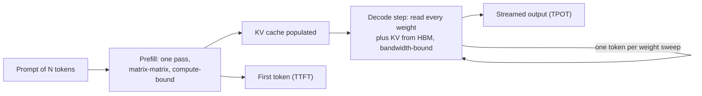

**Follow-ups:** Why doesn't adding more compute (a faster GPU with the same bandwidth) speed up batch-1 decode? At roughly what batch size does decode become compute-bound? How would you speed up TTFT specifically?

</details>

### 2. What is the KV cache, why is it needed, and how big does it get? Ballpark it for a 70B-class model at 128K context.

<details><summary><b>Answer</b></summary>

At each decode step, the new token's query attends to the keys and values of *all* previous tokens. Without caching you'd recompute every past token's K/V projections at every step - O(n²) redundant work per generated sequence. The KV cache stores each layer's K and V vectors for every processed token, making each decode step incremental. It's what makes autoregressive generation computationally feasible; the price is memory.

Size formula:

```
KV bytes/token = 2 (K and V) × n_layers × n_kv_heads × head_dim × bytes_per_elem
```

Worked example, Llama-3-70B shape: 80 layers, 8 KV heads (GQA), head_dim 128, FP16:

```
2 × 80 × 8 × 128 × 2  ≈ 320 KB per token
8K context   → ~2.6 GB per sequence
128K context → ~41 GB per sequence
```

Note that's *with* GQA - with full multi-head attention (64 KV heads) it would be 8× larger, which is exactly why GQA/MQA/MLA exist.

Why it matters operationally: on an 80 GB GPU, after ~40 GB of 4-bit weights, the KV cache is the budget that determines **how many sequences you can serve concurrently** - i.e., your batch size, and therefore your throughput. A single 128K-context request can evict dozens of short-context users' worth of cache. Mitigations: fewer KV heads (architecture), KV-cache quantization (FP8 halves it), paged allocation (PagedAttention, to stop fragmentation waste), prefix sharing, and sliding-window attention for some layers.

**Follow-ups:** Why does GQA shrink the KV cache but not the weight count meaningfully? What happens in vLLM when the KV cache fills up mid-generation? How would the math change for a mixture-of-experts model?

</details>

### 3. Define TTFT, TPOT, and tokens/sec. What drives each one, and what are reasonable targets for a chat product?

<details><summary><b>Answer</b></summary>

- **TTFT (time to first token)**: request arrival → first generated token. Driven by queue wait + prefill time, so it scales with prompt length and system load. This is the "is it responsive?" metric.
- **TPOT (time per output token)**, a.k.a. inter-token latency (ITL): average gap between subsequent tokens during decode. Driven by memory bandwidth, model size, batch contention, and interference from other requests' prefills. This is the "does the stream feel smooth?" metric.
- **Tokens/sec** comes in two flavours people conflate: *per-request decode speed* (≈ 1/TPOT) and *aggregate system throughput* (all tokens across all requests - the capacity/cost number). A system can have great aggregate throughput and terrible per-request speed simultaneously.

Total request latency ≈ `TTFT + TPOT × output_tokens`. That formula is worth internalising: for a 500-token answer, shaving TPOT from 50 ms to 30 ms saves 10 s - far more than any TTFT optimisation - while for a 20-token classification, TTFT dominates.

Reasonable chat targets (order-of-magnitude, product-dependent): P50 TTFT a few hundred ms, P99 under ~1-2 s; streaming rate comfortably above reading speed - people read at roughly 5 words/s, so ~15-30+ tokens/s per request feels fluid, and 50+ feels instant. Autocomplete-style features are different: tiny outputs, total-latency budget of a few hundred ms. Long agentic workflows care more about aggregate completion time and cost than ITL.

Always report percentiles (P50/P95/P99) per metric, segmented by prompt-length bucket - averages hide exactly the failures users notice.

**Worth sketching.** A latency waterfall shows which term each metric owns, which stops the conversation drifting into "latency" as one blurred number.

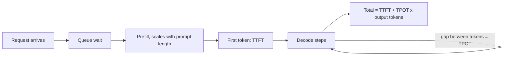

**Follow-ups:** Your P99 TTFT doubled but P50 is flat - what are your top hypotheses? Which metric does speculative decoding improve, and which can it hurt?

</details>

### 4. Why do LLM products stream responses, and how does streaming actually work over HTTP?

<details><summary><b>Answer</b></summary>

Because perceived latency is dominated by *time to first visible output*, not total time. A 600-token answer at 30 tokens/s takes ~20 s to finish - unacceptable as a blank spinner, perfectly fine as a stream that starts in 400 ms. Streaming converts the user-perceived latency from `TTFT + TPOT × N` to roughly `TTFT`. It also enables early cancellation (user stops a bad generation → you stop paying for output tokens) and progressive downstream processing.

Mechanics: the standard transport is **Server-Sent Events (SSE)** - a plain HTTP response with `Content-Type: text/event-stream` that the server keeps open, writing incremental events:

```
data: {"delta": {"text": "The"}}

data: {"delta": {"text": " answer"}}

data: [DONE]
```

Each event is a `data:` line terminated by a blank line; clients parse events as they arrive. OpenAI's Chat Completions streams token deltas and ends with a `[DONE]` sentinel; Anthropic's Messages API and OpenAI's newer Responses API stream named, typed events instead (for example `message_start`, `content_block_delta`, `message_stop` on Anthropic, `response.output_text.delta` on OpenAI). WebSockets are an alternative when you need bidirectional traffic (e.g., voice), but SSE is simpler and proxy-friendly for one-way token streams.

Production gotchas worth mentioning: intermediate proxies/load balancers buffering responses (must disable buffering, watch idle timeouts); handling reconnects (most LLM APIs can't resume a stream - a retry restarts generation, so the client must handle replacement); heartbeats/keep-alives during long tool-use pauses; and the fact that usage/cost accounting typically arrives in the final event, so billing code can't assume it exists if the stream is aborted. Tool calls and JSON arrive as partial fragments and need accumulation before they're parseable.

**Follow-ups:** How would you design retry behaviour for a stream that dies at token 400 of 600? What breaks when you put a naive CDN or proxy in front of SSE?

</details>

### 5. How do you estimate whether a model fits on a given GPU? Will a 70B model fit on one 80 GB card?

<details><summary><b>Answer</b></summary>

Start with `weights = params × bytes/param`, then add KV cache and runtime overhead:

```
FP32: 4 B/param   FP16/BF16: 2   INT8/FP8: 1   INT4: ~0.5-0.6 (incl. scales)
```

70B model: FP16 → ~140 GB - does **not** fit on one 80 GB GPU; you'd need 2 GPUs with tensor parallelism. FP8/INT8 → ~70 GB - technically fits but leaves almost nothing for KV cache, so it's not serveable on one card in practice. INT4 → ~35-40 GB - fits comfortably, leaving ~30+ GB for KV cache and buffers. That's why "70B on a single 80 GB GPU" almost always means 4-bit.

The full budget is:

```
total ≈ weights
      + KV cache (bytes/token × total cached tokens across all sequences)
      + activations & workspace buffers (batch- and seqlen-dependent, ~GBs)
      + CUDA context / framework overhead (~1-2 GB)
```

For inference you do *not* need optimizer states or gradients - that's a training concern (where the multiplier is ~16+ bytes/param for full fine-tuning). A common interview trap is forgetting the KV cache: a model that "fits" with 2 GB to spare serves a batch size of ~zero. Serving frameworks make this explicit - vLLM pre-allocates a fraction of GPU memory (`gpu_memory_utilization`, default ~0.9) and dedicates whatever remains after weights to the paged KV pool.

Small-end intuition to have ready: 8B FP16 ≈ 16 GB (fits a 24 GB consumer card); 8B INT4 ≈ ~4.5 GB (runs on a laptop); 1-3B INT4 runs on phones.

**Follow-ups:** How much memory does the KV cache add if you serve 32 concurrent 8K-context sequences on that 70B? Why might you still choose 2×GPU FP8 over 1×GPU INT4?

</details>

### 6. Why do output tokens cost more than input tokens, and how should that shape how you build?

<details><summary><b>Answer</b></summary>

Because they cost the provider more to produce. Input tokens are processed in parallel during prefill - one compute-efficient pass amortised across the whole prompt. Each output token requires its own full sequential forward pass through the model, monopolising memory bandwidth, and long generations occupy KV-cache memory (and a batch slot) for their entire duration. Providers price accordingly: output tokens typically cost ~4-8× input tokens across OpenAI, Anthropic, and Google price lists (check the current list for your model, since ratios shift between generations). And on reasoning models, hidden chain-of-thought/reasoning tokens **bill as output tokens** - a "one-sentence answer" can carry thousands of billed reasoning tokens behind it.

Design implications:

- **Be terse on output, generous on input.** Moving work from generation to context is usually cheaper: few-shot examples, retrieved docs, schemas in the prompt are input-priced (and cacheable); verbose generated prose is output-priced.
- **Cap `max_tokens` per feature** and tune prompts to answer concisely; ban "let me explain step by step" boilerplate where you don't need it. Tune reasoning-effort settings per task on reasoning models.
- **Prefer structured, minimal output formats** - a JSON object with short fields, not markdown essays. Enum/ID answers instead of restated content.
- **Don't make the model echo its input** (classic waste: "return the full document with edits" vs returning a diff or edit list).
- Combined with prompt caching - which discounts *cached input* dramatically - the economics push toward architectures with large stable cached prefixes and small generated outputs.

Sanity-check example: at $3/M input and $15/M output, a request with 4K in / 1K out costs $0.012 + $0.015 - the 1K of output costs more than the 4K of input.

**Follow-ups:** How do reasoning tokens change your cost model for an agentic loop? When is it worth paying more output tokens for chain-of-thought?

</details>

### 7. What is quantization for inference? Explain weights-only vs weights-and-activations, and the typical tradeoffs.

<details><summary><b>Answer</b></summary>

Quantization stores numbers in fewer bits (FP16 → INT8/FP8/INT4) to cut memory and, depending on the scheme, speed up compute. For LLM inference there are two distinct families, and knowing which bottleneck each attacks is the key insight:

**Weights-only (e.g., W4A16)**: weights are stored in 4 or 8 bits, dequantized on the fly, and the math still happens in FP16. Since batch-1 decode is bound by *streaming weight bytes from HBM*, shrinking weights 4× directly raises the decode-speed ceiling up to ~4× and cuts memory ~4× (freeing room for KV cache). It does little for prefill or large-batch serving, which are compute-bound. GPTQ and AWQ are the standard 4-bit post-training methods; GGUF k-quants serve the llama.cpp/Ollama ecosystem.

**Weights + activations (e.g., W8A8 INT8 or FP8)**: both operands are low-precision, so matmuls run on INT8/FP8 tensor cores - roughly 2× the FLOPs of FP16. This is what helps *compute-bound* regimes: prefill and high-batch throughput serving. The hard part is activations, which have extreme outlier channels; techniques like SmoothQuant migrate that difficulty into weights. FP8 (native from Hopper onward) is the mainstream production workhorse; FP4-family formats (NVFP4/MXFP4) are natively accelerated on Blackwell-class GPUs and increasingly used in production there, and some open-weight models ship natively in MXFP4. FP4 is more quality-sensitive than FP8, so it needs the same task-level evaluation.

Typical quality cost: 8-bit ≈ negligible; well-done 4-bit weights ≈ small but real degradation - often ~1-2% on benchmarks, but occasionally much worse on specific capabilities (math, code, low-resource languages). The professional answer: **always evaluate the quantized model on your own task suite**, not perplexity alone. KV-cache quantization is a separate, composable lever (see the dedicated question).

**Follow-ups:** Why does W4A16 barely help a high-batch serving deployment? What are activation outliers and why do they make W8A8 hard?

</details>

### 8. What's the difference between static and continuous batching, and why did continuous batching become universal?

<details><summary><b>Answer</b></summary>

**Static batching**: group N requests, run them through the model together, return when all are done. Two problems. First, the **convoy effect**: sequences finish at different times (one asks for 10 tokens, another 800), but the batch slot is held until the longest finishes - finished sequences waste compute as padding, and new requests wait for the entire batch to drain. Second, arrival mismatch: you either wait to fill a batch (adds latency) or run underfull batches (wastes throughput).

**Continuous (in-flight) batching** - introduced by Orca (OSDI '22), now standard in vLLM, TGI, TensorRT-LLM, SGLang: scheduling happens at the *iteration* level, not the request level. Each decode step, the engine assembles whichever sequences are active: a sequence that emits its EOS token leaves the batch *that step*, and a queued request can be admitted immediately (its prefill is run, then it joins the decode stream). The batch is a constantly churning population rather than a fixed cohort.

Why it wins: decode throughput scales with batch size almost for free (one weight-read serves everyone), so keeping the batch as full as possible at every step directly converts to throughput - several-fold to order-of-magnitude improvements over naive static batching, with *better* average latency because nobody waits for stragglers. It also makes latency more predictable and lets the scheduler enforce policies (priorities, fairness, preemption when KV memory runs low).

The interaction to mention for extra credit: admitting a new request means running its prefill, which can stall in-flight decodes and spike everyone's ITL - the problem chunked prefill exists to solve.

**Worth sketching.** Two short timelines side by side make the convoy effect obvious without any arithmetic.

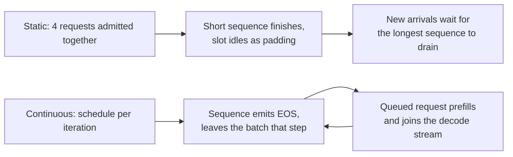

**Follow-ups:** What new scheduling problems does continuous batching create? How does the engine decide when to preempt a running sequence, and what happens to its KV cache?

</details>

### 9. What is prompt (prefix) caching, and why is it one of the biggest cost levers available?

<details><summary><b>Answer</b></summary>

Prefill work depends only on the tokens processed so far, so if two requests share an identical token prefix, the KV cache computed for that prefix is reusable. Prompt caching stores it and skips recomputation. The canonical wins: a long system prompt + tool definitions shared by every request; multi-turn conversations (each turn re-sends the whole history - the previous turns are a shared prefix); many questions over the same long document; agent loops re-sending large contexts every step.

Self-hosted: vLLM does hash-based automatic prefix caching over KV blocks; SGLang's RadixAttention keeps a radix tree of cached prefixes and its scheduler routes matching requests to them. Cache hits cut TTFT dramatically (prefill collapses to the uncached suffix) and free compute.

Provider APIs monetise the same mechanism: **cached input tokens are billed at a steep discount**. Anthropic's is explicit (`cache_control` breakpoints): cache writes cost ~1.25× base input, cache reads ~0.1× - a 90% discount - with a ~5-minute refreshing TTL (longer TTL available). OpenAI's is automatic for prompts past a minimum length (~1024 tokens), with the cached-input discount varying by model generation, from ~50% on older models to ~90% on newer ones. Gemini offers both implicit (automatic) caching on recent models and explicit context caching with storage-based pricing. Exact multipliers and TTLs change, so read the current price page rather than memorising them. For an agent re-sending a 20K-token context 30 times per session, caching is the difference between paying for ~600K input tokens and ~600K mostly-discounted ones - often the single largest line-item saving available with zero quality impact.

The engineering discipline it imposes: **stable prefix first, variable content last**. Any changed byte invalidates everything after it - so no timestamps/request IDs early in the system prompt, deterministic tool-definition ordering, and append-only conversation structure. Cache hit rate belongs on your cost dashboard.

**Worth sketching.** Drawing the hit path makes the prefix discipline self-evident: anything volatile early moves every request onto the miss branch.

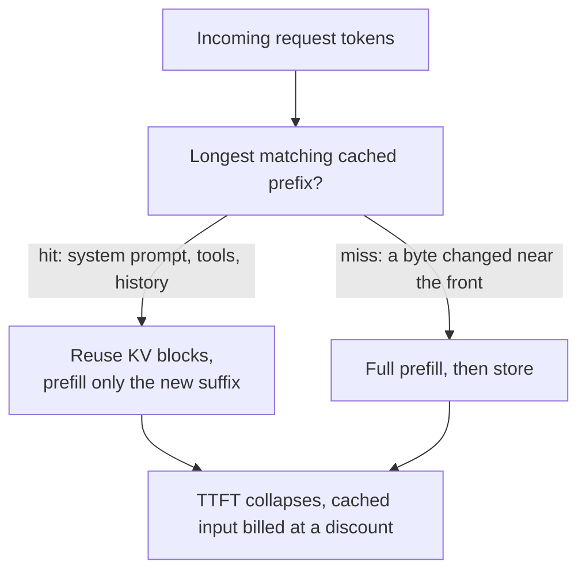

**Follow-ups:** Why does inserting the current date at the top of a system prompt destroy caching? How does prefix caching interact with per-user personalisation? What's the difference between this and semantic caching?

</details>

### 10. Your app is getting 429s from your LLM provider at peak traffic. How do you handle rate limits properly?

<details><summary><b>Answer</b></summary>

Layered answer - immediate handling, then prevention, then architecture:

**Immediate handling**: retry with **exponential backoff + full jitter** (`sleep = random(0, min(cap, base × 2^attempt))`). Jitter is non-negotiable: without it, all throttled clients retry in synchronised waves and re-spike the provider (thundering herd). Respect the `Retry-After` header when present. Cap attempts (2-3) and enforce a **retry budget** - if more than a few percent of traffic is retrying, stop retrying and shed instead, or you amplify the overload. Distinguish error classes: 429 and 5xx are retryable; 400/422 (bad request, context too long) will never succeed - fail fast.

**Prevention**: rate limits are usually RPM + TPM (tokens/min) + concurrency. Track your own consumption client-side and gate with a token-bucket/semaphore *before* hitting the API, so you queue internally rather than burning requests into 429s. Prioritise traffic classes: interactive user requests get capacity first; background jobs (evals, enrichment) yield, or move to the batch API entirely - that's often the real fix, since offline work is what commonly eats the quota.

**Architecture**: request higher limits or provisioned/committed throughput for the baseline; spread across regions/accounts where the provider's terms allow; add a **fallback chain** (same model on another provider/cloud, or a smaller model) behind a circuit breaker for sustained throttling; smooth bursts with a queue and honest UX for non-interactive features.

Also instrument it: 429 rate, retry rate, queue depth, and time-to-success should be on a dashboard - chronic 429s are a capacity-planning signal, not an error-handling problem.

**Follow-ups:** Why is full jitter better than plain exponential backoff? Your retries are succeeding but P99 latency tripled - what's happening and what do you change?

</details>

### 11. We set temperature to 0, so outputs should be deterministic. Why do users still get different answers to the same prompt?

<details><summary><b>Answer</b></summary>

Temperature 0 makes the *sampling* step deterministic (take the argmax), but it does not make the *logits* bit-identical between runs. Once two candidate tokens are close in probability, a last-bit difference flips the argmax, and the continuation diverges from there.

Where the non-determinism comes from:

- **Kernels are not batch-invariant.** Floating point addition is not associative, so the order of reductions changes the result in the last bits. Matmul and attention kernels pick split strategies and reduction orders based on the shape of the batch. Under continuous batching, your request is batched with different neighbours every time, and batch composition depends on other users' traffic. That is the dominant cause.
- **MoE routing** can depend on batch composition when implementations use per-expert capacity limits.
- **Fleet heterogeneity**: different GPU generations, kernel or driver versions, tensor-parallel degree, or quantization all change numerics. Providers also roll model snapshots underneath you.

What helps: a `seed` parameter removes sampling randomness only, so it is necessary but not sufficient. Providers expose a backend fingerprint precisely because they cannot promise more than best effort. True bitwise reproducibility needs batch-invariant kernels (fix the reduction order regardless of batch shape) plus a pinned model version, hardware type, and parallelism config, and you pay throughput for it.

The practical stance: do not build systems that depend on exact token equality. Test on semantics (schema validity, evals with tolerance, property checks), not string comparison. Log outputs, because you cannot reliably regenerate them.

The misconception to kill: "greedy means deterministic." Greedy is deterministic given identical logits. The logits are the problem.

**Follow-ups:** Why does a busier server make divergence more likely? How would you write a regression test for an LLM feature that cannot rely on exact output matching?

</details>

### 12. What does FlashAttention actually do, and how is it different from PagedAttention?

<details><summary><b>Answer</b></summary>

They solve different problems at different layers, and you use them together rather than choosing between them.

**FlashAttention is a kernel.** It is an exact, IO-aware implementation of attention. Instead of materialising the full n x n score matrix in HBM, it tiles Q, K and V into on-chip SRAM and computes the softmax in a streaming pass, keeping a running max and running sum. Extra memory drops from O(n^2) to O(n), and HBM reads and writes fall by a large constant factor because the score matrix never leaves SRAM (the FLOPs are still quadratic), which is what makes long contexts tractable. It is exact, not an approximation: outputs match naive attention up to floating point. It wins most on prefill and long context, where the score matrix is large. Decode has a query length of 1, so there is almost no parallelism along the query axis, which is why decode-oriented variants split along the KV length and combine partial softmaxes afterwards.

**PagedAttention is memory management.** Store the KV cache in fixed-size blocks (16 tokens is the common default) indexed through a per-sequence block table, so a sequence's KV does not need to be contiguous. That kills the fragmentation you get from pre-allocating max-length buffers, so the same HBM supports a much larger batch, and prefix sharing becomes a block-table pointer instead of a copy. The attention kernel then has to gather KV through the block table.

So: FlashAttention makes the attention computation cheap in memory *traffic*; PagedAttention makes the KV cache cheap in memory *capacity*. A modern server runs FlashAttention-style kernels over a paged KV layout, and picking an "attention backend" is picking which such kernel you get.

Red flag phrasing: "we use PagedAttention instead of FlashAttention." Also worth saying: neither one changes output quality.

**Worth sketching.** Two boxes stacked as layers kill the "one instead of the other" misconception in a single stroke.

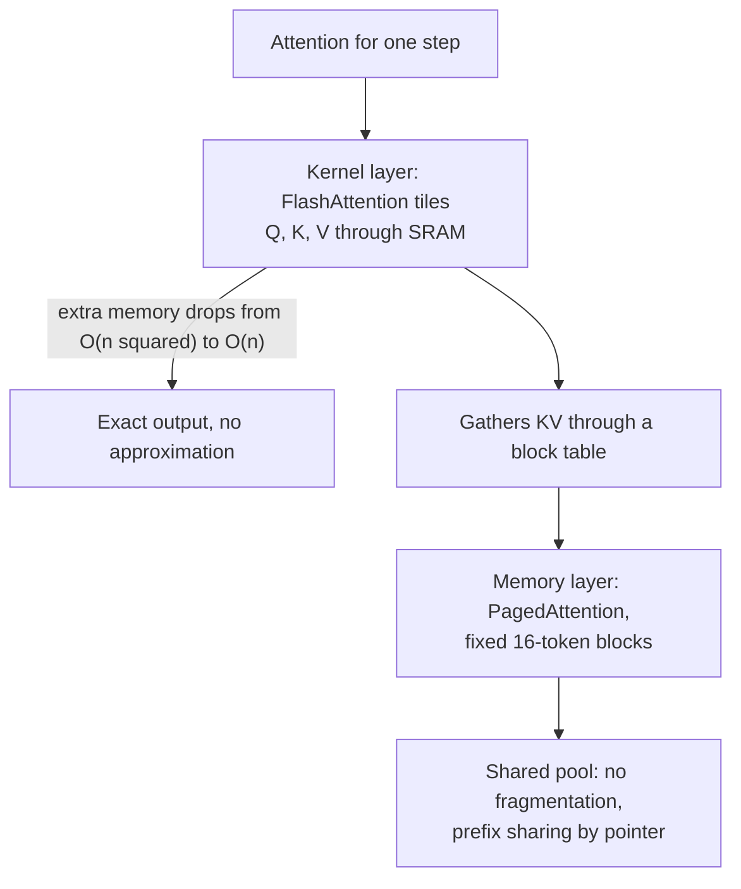

**Follow-ups:** Why does decode need a differently shaped kernel than prefill? What does changing the attention backend actually change for you operationally?

</details>

### 13. A user closes the tab halfway through a streamed response. What happens on the server, and what should happen?

<details><summary><b>Answer</b></summary>

By default, more than you would like: unless cancellation is propagated all the way from the HTTP connection down to the engine scheduler, the model keeps generating tokens nobody will ever read, holding a KV slot and burning GPU time for the full `max_tokens`. On a self-hosted server that is wasted capacity and worse P99 for everyone else. Against a provider API, you are typically still billed for tokens generated before the abort actually lands, so an undetected disconnect is a silent cost line.

Mechanically: a client disconnect on an SSE stream shows up as a write failure or a disconnect event on the connection. The web framework has to notice it, close the generator, and the engine has to abort the request. Two things commonly break this chain. First, proxies: nginx, load balancers and CDNs buffer responses, so the server may not see the disconnect promptly, or at all, until it tries to flush. Disable proxy buffering for streaming routes and send periodic heartbeats so the socket is exercised. Second, client SDKs: you have to actually cancel the request or context, not just stop reading.

There is also a correctness angle. If the generation has side effects (tool calls, writes), being killed mid-flight leaves partial state, so steps need to be idempotent and checkpointed.

The better design for anything long-running: do not tie the generation's lifetime to the browser connection at all. Generate server-side into a durable stream that the client subscribes to and can resume after a reconnect (a stream with a resume token). Then a refresh does not lose the answer, and cancellation happens because the user pressed stop, not because a socket dropped.

What to measure: aborted-request rate, and tokens generated after client disconnect.

**Worth sketching.** The value is in showing the whole chain, because every hop is somewhere the cancellation can silently fail to land.

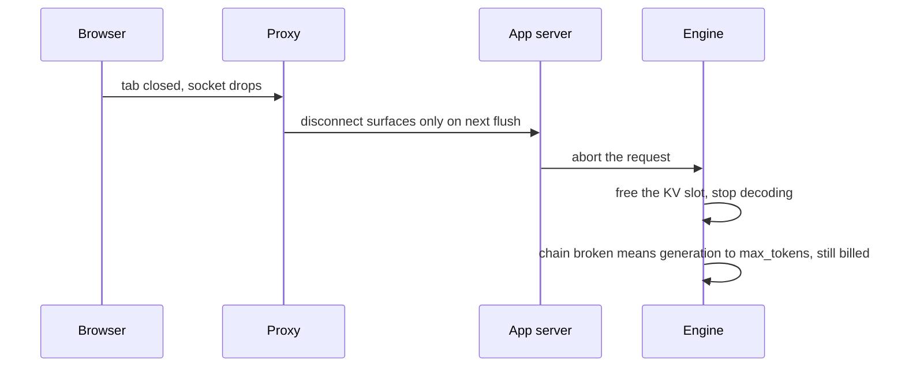

**Follow-ups:** How would you implement a resumable stream? What is the cost signature in your metrics of disconnects that are never detected?

</details>

### 14. Your production code reads the response text but never checks `finish_reason` (or `stop_reason`). Why is that a bug, and what should you do with each stop reason?

<details><summary><b>Answer</b></summary>

Because a response can end for reasons other than "the model was done", and the text alone will not tell you. Every major API reports why generation stopped: `finish_reason` in OpenAI's Chat Completions, a `status` plus incomplete details in its Responses API, `stop_reason` on Anthropic, `finishReason` on Gemini. Ignoring it means shipping truncated or filtered output as if it were complete.

Each value maps to a distinct action:

- **Natural stop** (`stop`, `end_turn`): the model finished. Validate and use it.
- **Length** (`length`, `max_tokens`): truncated at the cap. Prose ends mid-sentence. JSON or a tool call is unparseable, and constrained decoding does not save you, because the grammar cannot close the object once the budget is gone. Raise the cap for that feature, ask for a shorter format, or continue the generation, but never parse it as complete. On reasoning models, thinking tokens usually count against the same budget, so a request can hit the cap before writing any visible answer.
- **Stop sequence** (`stop_sequence`): one of your stop strings fired. Expected if you designed it, a bug if that string can legitimately appear in content.
- **Tool use** (`tool_calls`, `tool_use`): the model wants a tool run. Agent loops should branch on this field, not on whether the text looks empty.
- **Safety or refusal** (`content_filter`, `refusal`): the provider blocked the output or the model declined. Show a deliberate UX, do not blindly retry the same input, and log it for review.

Production habits that go with it:

- Log the stop reason on every call and chart the rate of length stops per feature. A jump after a prompt or model change is an early sign of verbosity creep, and it shows up before users complain about cut-off answers.
- Alert on a rising refusal rate per feature, since it often means a prompt change tripped a policy boundary.
- In streams, the reason arrives in the final event, so code that aborts early or drops the last event silently loses it.
- Treat an unknown value as an error. Providers add new ones, and a default branch that assumes success is how a new stop reason ships truncated data.

**Follow-ups:** How would you safely continue a generation that was truncated in the middle of a JSON object? Your length-stop rate doubled after a model upgrade with no prompt change: what happened, and what do you change?

</details>

## Intermediate

### 15. Why do we obsess over P99 latency rather than the average, and what causes tail latency in LLM serving specifically?

<details><summary><b>Answer</b></summary>

Because users experience the tail, not the mean. A user making 100 requests over a week hits the P99 about once - and for multi-call features it's far worse: an agent chaining 10 sequential LLM calls has a ~10% chance per run that *some* call hits the P99, so the workflow's tail is dominated by per-call tails compounding. Averages also hide bimodality: P50 flat + P99 exploding is the classic overload signature, invisible in the mean.

LLM-specific tail sources:

- **Queueing spikes**: bursty arrivals against near-saturation capacity - queue delay is hyper-sensitive near the throughput knee.
- **Prompt-length variance**: a 100K-token prefill takes orders of magnitude longer than a 500-token one; without chunked prefill it also stalls *other* requests' decode (head-of-line blocking), spreading its latency to innocent bystanders' ITL.
- **Output-length variance**: total latency scales with generated tokens; unbounded `max_tokens` means unbounded latency.
- **Preemption**: when KV memory runs out, engines evict sequences and recompute/restore them later - a hidden latency cliff that shows up only under memory pressure.
- **Cold anything**: cold prefix cache, freshly scaled replica warming up, first request compiling kernels/CUDA graphs.
- **Provider-side variance** when using APIs - you inherit someone else's multi-tenant tail.

Mitigations map one-to-one: admission control and headroom for queueing; chunked prefill and separate long-context pools for prompt variance; `max_tokens` caps; monitoring preemption counts and KV utilization; warm-up on deploy; hedged requests for API tails (send a duplicate after ~P95, take the first response - spends money to buy tail latency, so budget it).

Measure percentiles per prompt-length bucket and per feature; a global P99 mixes autocomplete with deep research and tells you nothing.

**Follow-ups:** Why does an agent workflow's end-to-end tail degrade faster than any single call's? What are the risks of hedged requests for non-idempotent operations?

</details>

### 16. Explain arithmetic intensity and the roofline model as applied to LLM inference. Why does batching improve decode throughput so dramatically?

<details><summary><b>Answer</b></summary>

**Arithmetic intensity** = FLOPs performed per byte moved from memory. The **roofline model** says achievable performance = `min(peak_FLOPs, intensity × memory_bandwidth)`: below a ridge point you're memory-bound (perf grows linearly with intensity), above it compute-bound. The ridge for an H100 at BF16 is roughly `~989 TFLOPs ÷ ~3.35 TB/s ≈ ~300 FLOPs/byte`; for an A100 it's ~150.

Now place the two inference phases on that roofline. **Batch-1 decode**: for each weight element (2 bytes in FP16) you do one multiply-add (2 FLOPs) - intensity ≈ 1 FLOP/byte. That's two orders of magnitude below the ridge: the GPU streams 140 GB of weights to emit one token while its tensor cores sit ~99% idle. **Prefill**: a 4K-token prompt reuses each loaded weight 4096 times - intensity in the thousands, firmly compute-bound.

Batching decode raises intensity almost for free: with batch size B, each weight byte loaded performs B multiply-adds - intensity ≈ B FLOPs/byte. Throughput therefore scales ~linearly with B until B approaches the ridge (~a few hundred sequences), where decode finally becomes compute-bound. Since the weight-read cost was being paid anyway, tokens 2..B are nearly free - this is *the* economic fact of LLM serving, and why every scheduler fights to keep batches full.

Limits on B: KV-cache memory (each sequence's cache must be resident - usually the real cap), per-token latency growth as compute share rises, and the KV-read component of attention, which unlike weights is per-sequence and doesn't amortise - at long contexts, KV reads, not weight reads, dominate the bandwidth bill.

This lens also explains quantization's asymmetry (weight-only quant lifts the memory-bound regime; W8A8/FP8 lifts the compute-bound one) and why speculative decoding works (trades idle compute for fewer sequential memory sweeps).

**Worth sketching.** Placing the three regimes against the ridge point is what turns "batching helps" into a number you can defend.

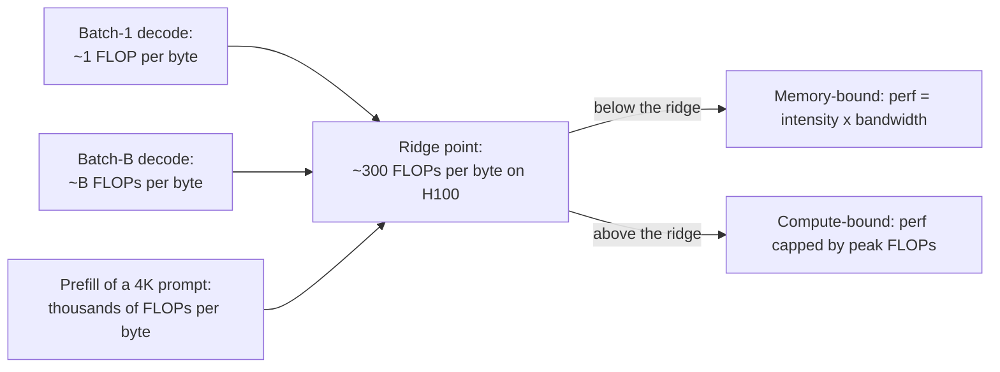

**Follow-ups:** Why doesn't the KV cache read amortise across the batch like weights do? Where does MoE sit on the roofline compared to a dense model at the same active-parameter count?

</details>

### 17. What problem does PagedAttention solve, and how does it work?

<details><summary><b>Answer</b></summary>

It solves **KV-cache memory fragmentation**. Pre-vLLM systems allocated each sequence's KV cache as one contiguous buffer sized for the *maximum possible* length (since output length is unknown in advance). That wastes memory three ways: internal fragmentation (a sequence that stops at 300 tokens reserved 2048), reservation waste (memory held for tokens not yet generated), and external fragmentation (variable-sized contiguous chunks leave unusable gaps). The vLLM paper measured that in prior systems only ~20-40% of KV memory held actual token state. Since KV memory caps batch size and batch size is throughput, this waste was directly throttling serving.

**PagedAttention** applies the OS virtual-memory playbook: chop the KV cache into fixed-size **blocks** (e.g., 16 tokens each), allocate them on demand from a shared pool, and give each sequence a **block table** mapping logical positions → physical blocks. The attention kernel walks the block table, so blocks needn't be contiguous. Consequences:

- Waste collapses to at most one partially-filled block per sequence - near-100% utilization, so effective batch size (and throughput) jumps; the paper reported ~2-4× throughput over the prior state of the art.
- **Sharing becomes trivial**: multiple sequences can map the same physical blocks. Parallel sampling (n candidates from one prompt) and shared system-prompt prefixes are handled with block sharing + copy-on-write when a shared block would be written.
- **Preemption is clean**: under memory pressure the scheduler evicts a sequence's blocks (recompute or swap to CPU) and restores later.

The mental model to say out loud: *virtual memory and paging for the KV cache* - block table = page table, block = page, fragmentation fixed the same way OSes fixed it in the 1960s. Follow-on work (vLLM's prefix caching, SGLang's RadixAttention) builds cross-request reuse on top of this block abstraction.

**Worth sketching.** Draw two block tables pointing at one shared block and the sharing story tells itself, no paper needed for the analogy.

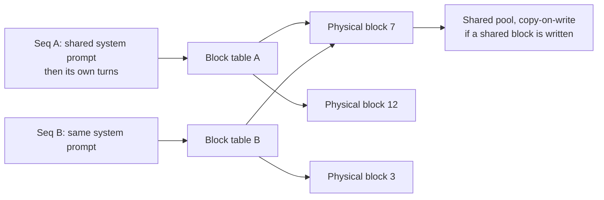

**Follow-ups:** What's the cost of paging - why not make blocks 1 token each? How does copy-on-write work for beam search or n-best sampling?

</details>

### 18. What is chunked prefill and what scheduling problem does it fix?

<details><summary><b>Answer</b></summary>

The problem: in a continuously batched engine, prefills and decodes share the GPU. A newly admitted request with a long prompt runs a big, compute-saturating prefill - and while it runs, every in-flight decode stalls. Users see their token streams freeze; ITL spikes from tens of milliseconds to seconds. Schedulers that prioritise prefill optimise TTFT at the cost of ITL; schedulers that hold prefills back protect ITL but wreck TTFT and throughput. With 50K - 100K-token prompts this isn't an edge case - one document-heavy request degrades everyone.

**Chunked prefill** (popularised by Sarathi/Sarathi-Serve, now standard in vLLM and others) splits the prompt into chunks - e.g., 512-2048 tokens - and processes one chunk per iteration, *batched together with the ongoing decode steps*. The long prefill becomes a background process that advances incrementally instead of a bulldozer that monopolises the GPU.

Two benefits:

- **Stall-free decodes**: ITL stays stable regardless of what prompts arrive. The tail of inter-token latency - the thing chat users actually feel - is protected.
- **Better GPU efficiency**: decode-only batches are memory-bound (compute idle); prefill chunks are compute-heavy (bandwidth spare). Mixing them in one batch fills both pipes - the prefill piggybacks on the weight-reads decode was doing anyway.

Costs: the chunked prompt's own TTFT gets somewhat worse (its prefill is spread over many iterations, and each chunk's attention must re-read the KV of all earlier chunks, adding some bandwidth overhead), and there's a tuning knob - chunk size - trading TTFT against ITL protection. Interviewers like hearing the framing: chunked prefill converts an *interference* problem into an explicit, tunable *scheduling* tradeoff. It's also a stepping stone to the fuller fix: disaggregating prefill and decode onto separate pools.

**Worth sketching.** One iteration drawn as a mixed batch shows why this is a utilisation win, not just a fairness patch.

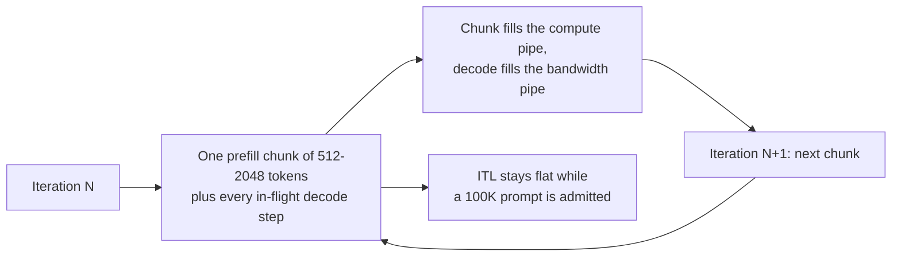

**Follow-ups:** How would you pick the chunk size? Why does mixing a prefill chunk into a decode batch improve hardware utilization rather than just sharing the pain?

</details>

### 19. Explain speculative decoding. Why is the output provably faithful to the target model, and when does it actually help?

<details><summary><b>Answer</b></summary>

Decode is memory-bound: each token costs a full weight-sweep, while compute idles. Speculative decoding spends that idle compute to cut the number of sequential sweeps. A cheap **draft model** autoregressively proposes k tokens (fast - it's small). The **target model** then scores all k proposals *in one parallel forward pass* (cheap per-token, like prefill). Accepted tokens are emitted; at the first rejection, a corrected token is sampled from the target and drafting resumes. Best case you emit k+1 tokens for one target sweep.

Faithfulness comes from the **acceptance rule** (Leviathan et al. 2022; Chen et al. 2023): accept draft token x with probability `min(1, p_target(x)/p_draft(x))`; on rejection, resample from the residual distribution `normalize(max(0, p_target − p_draft))`. This is a rejection-sampling construction whose marginal distribution is *exactly* `p_target` - provable, not approximate. So speculative decoding is purely a latency optimisation: same output distribution, including with temperature sampling. Any implementation that changes outputs (beyond floating-point noise) is buggy or is deliberately doing lossy "relaxed" acceptance.

When it helps: expected tokens per target pass rise with the **acceptance rate** α (how well the drafter matches the target). Predictable text - code, structured output, formulaic prose - drafts well; high-entropy creative text doesn't. It shines at low batch sizes with compute headroom, typically ~2-3× ITL improvement. When it hurts: at high batch, the GPU is already compute-saturated, so verification passes steal throughput; a poorly matched or too-slow drafter can net negative; and the draft model consumes memory. Drafter options: a small same-tokenizer model, self-drafting heads (Medusa, EAGLE), or **n-gram/prompt-lookup** drafting - copying candidate continuations from the prompt itself, essentially free and very effective for extraction/editing workloads.

**Worth sketching.** The draft-verify-accept loop with the rejection branch on it is exactly the diagram that proves you understand why output is unchanged.

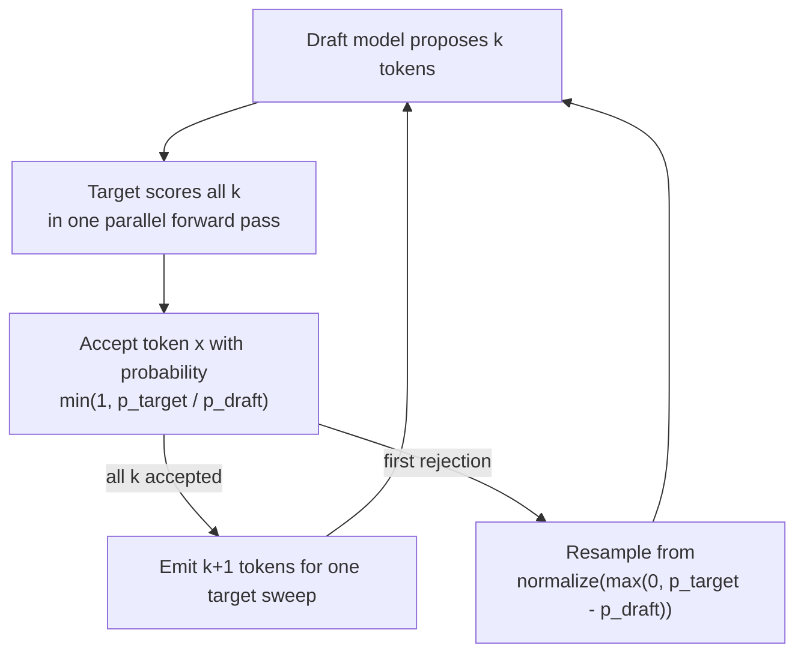

**Follow-ups:** Derive why the acceptance rule preserves the target distribution. How does batch size change the economics? When would n-gram lookup beat a trained draft model?

</details>

### 20. Compare GPTQ, AWQ, GGUF, INT8, and FP8. How do you actually choose a quantization approach for a deployment?

<details><summary><b>Answer</b></summary>

They're not interchangeable - they differ in what's quantized, how, and where they run:

- **GPTQ**: post-training, weights-only (usually 4-bit). Quantizes layer-by-layer, using (approximate second-order) error compensation against a calibration set - rounding later weights to absorb earlier rounding error. Mature GPU kernel support.
- **AWQ**: post-training, weights-only 4-bit. Observation: a small fraction of weight channels matter disproportionately, identified by *activation* magnitudes; AWQ rescales those salient channels before quantizing to protect them. No backprop, calibration-light, tends to be robust and fast with good kernels (works well for instruction-tuned models).
- **GGUF**: not an algorithm - the llama.cpp *file format*, carrying its family of k-quants/i-quants (Q4_K_M, Q5_K_S, ...) with per-block scales. The lingua franca of CPU/Metal/edge inference via llama.cpp and Ollama, with per-layer mixed precision.
- **INT8 W8A8**: weights *and* activations in INT8 (LLM.int8(), SmoothQuant lineage) - accelerates the matmuls themselves. Activation outliers are the difficulty.
- **FP8 (E4M3/E5M2)**: Hopper-native W8A8; floating-point structure handles outliers more gracefully than INT8. Near-lossless in practice and the default for high-throughput production serving; also used for KV cache. FP4-family (NVFP4/MXFP4) is the Blackwell-native follow-on, now in production use on Blackwell fleets, but with a larger and more task-dependent quality cost than FP8, so evaluate it carefully.

Choosing - ask three questions. (1) **Bottleneck**: latency-sensitive/low-batch → weights-only 4-bit (AWQ/GPTQ) attacks the bandwidth bound; high-batch throughput → FP8 W8A8 attacks the compute bound. (2) **Hardware/stack**: H100-class + vLLM/TensorRT-LLM → FP8; Blackwell-class → FP8, or NVFP4 where evals allow; consumer GPU → GPTQ/AWQ; CPU/Apple Silicon/edge → GGUF. (3) **Quality bar**: run *your* eval suite on the quantized artifact - perplexity deltas hide task-specific regressions (math, code, multilingual are the usual victims). Many teams land on: FP8 for the serving fleet, INT4 for the memory-constrained tier, GGUF for local/dev.

**Worth sketching.** Branching on the bottleneck rather than on the format name is the whole point, and the loop back through evals is where seniority shows.

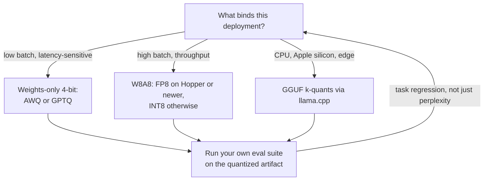

**Follow-ups:** Why do activation outliers make W8A8 harder than W4A16? What would make you reject a 4-bit model that passes perplexity checks?

</details>

### 21. What is KV-cache quantization, and when is it the right lever?

<details><summary><b>Answer</b></summary>

Storing the KV cache in fewer bits - FP8 or INT8 instead of FP16, with more aggressive 4-bit variants in research and llama.cpp. It's orthogonal to weight quantization and attacks a different constraint: weights are a *fixed* cost, but KV grows with `sequences × context length`, and on a busy server it's the KV pool, not weights, that caps concurrency.

The payoff is direct: FP8 KV halves bytes/token - our 70B example drops from ~320 KB to ~160 KB/token - which literally **doubles** either max batch size (throughput) or max servable context at the same memory. It also reduces attention's memory traffic at long contexts, where reading the KV cache (which, unlike weights, doesn't amortise across the batch) becomes the bandwidth bottleneck - so long-context decode gets faster too.

Quality: 8-bit KV (especially FP8) is generally near-lossless and widely used in production; vLLM, TensorRT-LLM, and llama.cpp all support it. Below 8 bits it gets delicate - attention is sensitive to key precision (keys enter the dot-product logits; error there perturbs the softmax over *all* positions), and research consistently finds **keys need gentler treatment than values**, motivating per-channel key quantization and asymmetric K/V schemes. Long multi-step tasks accumulate error, so evaluate on long-context and agentic benchmarks, not short QA.

When to reach for it: (1) KV-bound deployments - high concurrency or long context, where the dashboard shows KV utilization pegged and preemptions climbing; (2) fitting a long-context model on fixed hardware; (3) squeezing more batch out of a GPU already serving 4-bit weights. Caveat: stacking aggressive weight quant + aggressive KV quant compounds error - re-run evals on the combination, not each in isolation.

**Follow-ups:** Why are keys more quantization-sensitive than values? Your KV utilization is at 95% with rising preemptions - walk through your options and their tradeoffs.

</details>

### 22. Describe the throughput - latency tradeoff curve for an LLM server, and explain goodput.

<details><summary><b>Answer</b></summary>

Sweep offered load (or max batch size) on a fixed deployment and plot aggregate tokens/sec against per-request latency (TPOT and TTFT percentiles). The curve has three regions. At low load, latency is flat and near-optimal - adding traffic just fills idle capacity, throughput rises ~linearly (decode is memory-bound; extra sequences ride the same weight-reads). Approaching saturation there's a **knee**: batches are large enough that compute and KV memory contend, TPOT creeps up, and queueing delay - which is hyper-sensitive to utilization near 1 - starts exploding TTFT. Past the knee, throughput plateaus (hardware roofline reached) while latency grows without bound as the queue lengthens. Every serving deployment is choosing a point on this curve: batch-heavier = cheaper per token, worse per-user experience.

**Goodput** (the DistServe framing) is the correction to a classic misleading metric: it counts only throughput that *meets your SLOs* - e.g., requests/sec served with P99 TTFT < 1 s and TPOT < 50 ms. Raw tokens/sec can be gamed by running deep in saturation where every request violates latency targets; goodput goes to zero there. It's the right optimisation target and the right benchmark-comparison metric - two engines with equal max throughput can differ 2× in goodput under a tight SLO because of scheduling quality (chunked prefill, preemption behaviour, admission control).

Operationally: load-test each config to find the knee, then run at ~60-70% of knee capacity for headroom against bursts; autoscale on leading indicators (queue depth, KV utilization) rather than the lagging latency metrics; and evaluate scheduler/engine changes by goodput-vs-cost, not peak tokens/sec. Also note the SLO itself defines the curve you care about - interactive chat's tight ITL SLO forces a different operating point (and possibly different hardware split) than an offline batch pipeline on the same model.

**Follow-ups:** Why does queueing delay explode near saturation? Your P99 TTFT breaches SLO but GPU utilization shows 60% - what do you investigate?

</details>

### 23. vLLM, SGLang, TensorRT-LLM, TGI, llama.cpp/Ollama - how do you choose a serving stack?

<details><summary><b>Answer</b></summary>

Decide on workload shape, hardware, and how much engineering you'll invest - not GitHub stars:

- **vLLM**: the default open-source choice. PagedAttention, continuous batching, chunked prefill, prefix caching, speculative decoding, quantization support, tensor/pipeline parallelism, OpenAI-compatible server, broad model coverage (including day-one support for most open releases) and multi-hardware backends. Pick it unless you have a specific reason not to.
- **SGLang**: strongest when requests share prefixes heavily - agentic workloads, multi-turn chat, few-shot batteries - thanks to RadixAttention (tree-structured automatic prefix cache reuse) and a scheduler that exploits it; also known for very fast constrained/structured generation. Often benchmark-competitive or ahead of vLLM on these patterns.
- **TensorRT-LLM**: NVIDIA's maximum-performance path - heavily tuned kernels, aggressive fusion, first-class FP8/FP4. Since its 1.0 release the PyTorch-based runtime is the default, with the older compiled-engine workflow still available. Best raw numbers on NVIDIA hardware, but you pay in tuning complexity, sometimes slower model onboarding, and NVIDIA lock-in. Choose when serving cost at scale justifies dedicated inference engineers (often behind Triton or NVIDIA's Dynamo orchestration).
- **TGI (Text Generation Inference)**: Hugging Face's former production server. Hugging Face moved it into maintenance mode in late 2025 and now points users to vLLM and SGLang, so new model architectures will not land there. Treat it as a migration item, not a choice for a new deployment.
- **llama.cpp / Ollama / MLX**: the edge/local tier. CPU, Apple Silicon (Metal / MLX), consumer GPUs; GGUF quantized models; trivially easy to run. Right for on-device products, privacy-constrained local inference, and dev laptops - not for high-QPS datacenter serving.

Decision drivers to name: hardware (NVIDIA datacenter vs AMD/TPU vs laptop), workload (prefix-heavy agentic → SGLang; general → vLLM; cost-obsessed at scale → TensorRT-LLM), features needed (structured output, multi-LoRA serving, spec decoding), team ops maturity, and community velocity for new model support. Also mention the "buy" option: managed endpoints (Bedrock, Vertex, Fireworks, Together, etc.) when you don't want to run the stack at all.

**Follow-ups:** Your workload is 90% shared-system-prompt agent traffic - which stack and why? What does a vendor-tuned stack like TensorRT-LLM buy over a portable engine, and what does it cost you when you want to add AMD capacity?

</details>

### 24. Explain tensor parallelism vs pipeline parallelism for inference. When do you need each?

<details><summary><b>Answer</b></summary>

Both split a too-big model across GPUs; they cut along different axes with different communication and latency profiles.

**Tensor parallelism (TP)** shards *within* each layer: attention heads and MLP matrices are split across N GPUs, each computes its slice of every layer, and results are combined with all-reduces (typically two per transformer block - after attention's output projection and after the MLP). Every GPU participates in every token, so TP genuinely **reduces per-token latency** (each GPU does ~1/N of the FLOPs and streams ~1/N of the weight bytes) - but it's chatty: an all-reduce every layer, dozens of times per token, demands NVLink-class bandwidth. Rule of thumb: TP within a node (2/4/8 GPUs), never across slow interconnects. TP=8 over NVLink is the standard way a 70B+ FP16 model gets served.

**Pipeline parallelism (PP)** shards *across* layers: GPU 0 holds layers 1-20, GPU 1 holds 21-40, etc.; activations flow stage to stage. Communication is tiny (one hidden-states tensor per stage boundary), so PP tolerates Ethernet/IB across nodes. But it does **not** reduce per-token latency - each token still traverses all layers serially, plus hop overhead - and stages idle ("bubbles") unless enough concurrent work keeps every stage busy. Interviewers like this contrast stated plainly: TP is a latency *and* capacity tool; PP is a capacity tool whose throughput depends on keeping the pipeline full (which continuous batching happily provides).

Practical serving playbook: fit on one GPU if quantization allows (parallelism-free is simplest); TP within a node for bigger models; add PP only when a model exceeds a single node (e.g., frontier-scale or long-context monsters) - TP intra-node × PP inter-node. One-liner extensions worth naming: **expert parallelism** for MoE (experts sharded across GPUs, all-to-all routing) and **data parallelism** (independent replicas behind a load balancer) as the scaling mechanism once a single replica's shape is chosen.

**Worth sketching.** Drawing the cut axis next to its communication cost is what justifies "TP inside a node, PP across nodes" without hand-waving.

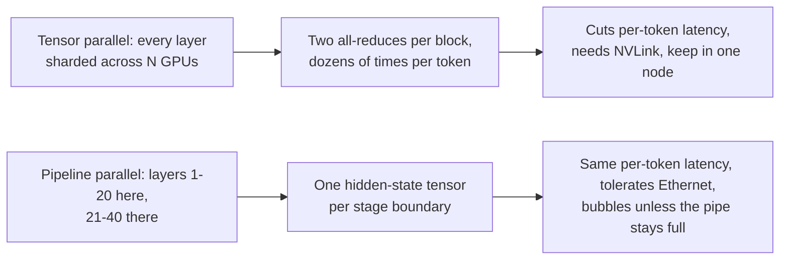

**Follow-ups:** Why does TP=8 across two 4-GPU nodes over Ethernet perform terribly? How does MoE change the parallelism picture?

</details>

### 25. Self-host an open-weights model or call a provider API - walk me through the decision.

<details><summary><b>Answer</b></summary>

Framework with six axes, then the math:

1. **Quality requirements**: if the task needs the very best frontier capability, APIs are usually the only option - the strongest open-weight models trail the closed frontier, and the ones that come closest are very large MoEs that are expensive to self-host well. If an open model (possibly fine-tuned) clears your eval bar, self-hosting is on the table. Evals decide this, not vibes.
2. **Utilization economics**: GPUs bill by the hour whether busy or idle; APIs bill per token. Self-hosting wins only with **high, steady utilization**. Sketch the math: an H100 at ~$2-4/hr serving a well-batched 70B-class model can produce on the order of a few thousand output tokens/sec aggregate - call it ~$0.10-0.50 per million tokens at good utilization, versus API prices often 5-20× that. But at 10% utilization your effective cost multiplies 10×, and spiky diurnal traffic makes sustained utilization genuinely hard. Include the hidden line items: engineers on-call, capacity headroom, evals/upgrades.
3. **Privacy/compliance/residency**: hard requirements (regulated data, air-gapped, data-residency) can force self-hosting - or at least VPC-deployed provider offerings (Bedrock, Vertex, Azure) as a middle path.
4. **Latency control**: self-hosting buys colocation with your services, no rate limits, control over the full tail. APIs give you someone else's multi-tenant P99.
5. **Customisation**: heavy fine-tuning, custom decoding (grammars, spec decoding tricks), LoRA-per-tenant serving - much easier on your own stack.
6. **Team**: running inference infra is a real ops commitment (GPU procurement, driver/kernel issues, engine upgrades, incident response). A two-person team shipping product should almost always start on APIs.

The mature answer is usually **hybrid**: frontier API for the hard, low-volume reasoning paths; self-hosted small models for high-volume narrow tasks (classification, extraction, embeddings); revisit quarterly as models and prices move. Start with APIs to find product-market fit, then in-source the workloads whose token bills exceed the fully-loaded cost of serving them.

**Follow-ups:** What monthly token volume would make you re-evaluate? How do provisioned-throughput offerings change this calculus?

</details>

### 26. When would you use a batch API, and how do you design a pipeline around one?

<details><summary><b>Answer</b></summary>

Batch APIs (OpenAI Batch, Anthropic Message Batches) accept a file/list of requests, process them asynchronously with a completion window of up to ~24 h (often much faster in practice), and charge **~50% of interactive pricing**. The provider is selling you their off-peak/spare capacity; you're selling them scheduling flexibility. Batch jobs also typically draw on separate, much larger quota than your interactive rate limits - so they stop background work from cannibalising your production TPM.

Use it for anything without a user waiting: eval suites, embeddings/classification backfills, document summarization pipelines, data enrichment and labelling, synthetic-data generation, content moderation sweeps, nightly report generation, re-processing after a prompt change. A shocking fraction of many teams' token spend is this shape and silently paying interactive prices. Never use it for user-facing latency-bound paths - and for the middle ground ("results within minutes"), you still need the interactive API.

Pipeline design points:

- **Idempotent request identity**: attach your own `custom_id` per request; results return keyed by it, unordered. Make re-submission safe (dedupe on custom_id) because you *will* resubmit.
- **Chunk jobs** into bounded batches (both providers cap requests/bytes per batch) and track job state in a durable store: submitted → in_progress → completed/expired/failed.
- **Handle partial outcomes**: individual requests inside a batch can fail or the window can expire with a subset done - reconcile per-request, resubmit only the missing/failed, with a retry cap.
- **Poll or webhook** for completion; on completion, download results, validate (schema-check outputs), then commit downstream.
- **Combine with the other cost levers**: prompt caching applies to batch traffic too on some providers; dedupe identical requests before submission.
- **Backpressure**: a batch pipeline that fans out from user actions needs a queue with rate control so a spike doesn't create a million-request batch storm.

**Follow-ups:** How do you handle a batch that comes back 2% failed? Your nightly batch now needs 4-hour freshness - what changes?

</details>

### 27. What is semantic caching, how is it different from prompt/prefix caching, and what are its failure modes?

<details><summary><b>Answer</b></summary>

Semantic caching stores previous request→response pairs and serves the cached **response** when a new request is *semantically similar*: embed the incoming query, nearest-neighbour search over cached query embeddings, and if similarity clears a threshold (e.g., cosine ~0.95), return the stored answer without calling the model at all.

The contrast with prompt/prefix caching is the key point interviewers want: prefix caching reuses **computation** (the KV cache of an *exact, token-identical* prefix) - the model still runs and generates a fresh output; it's lossless. Semantic caching reuses the **answer** on a *fuzzy* match and skips inference entirely; it's ~100% savings on a hit, but lossy - you're asserting two different strings deserve the same response.

Failure modes, roughly in order of pain:

- **False hits**: embeddings blur exactly what matters - negation ("refund policy" vs "no-refund policy"), numbers, entity swaps ("reset password for account A vs B"), and dates all embed nearby. A wrong cached answer served confidently is worse than a slow one.
- **Context leakage**: caching across users can leak personalised or permissioned content. Cache keys must be scoped - per-tenant at minimum, and personalisation-affecting state must be in the key.
- **Staleness/invalidation**: the cached answer embeds a moment in time - model version, system prompt version, RAG corpus snapshot. Any of those changing must flush or version-partition the cache; teams forget the prompt-version dimension constantly.
- **Threshold tuning**: too tight = no hits; too loose = wrong answers. Measure **hit precision** (are hits actually correct?) with sampled human/LLM-judge review, not just hit rate.

Where it shines: high-repetition, low-personalisation traffic - FAQ-style support, public search-ish queries - where 20-40%+ of traffic is near-duplicates. Where to avoid it: personalised, multi-turn, or high-stakes answers. A reasonable middle path: use a semantic hit as a *candidate* that a small verifier model confirms before serving.

**Worth sketching.** The threshold and the verifier are the two places this design goes wrong, so put them on the page where they can be argued about.

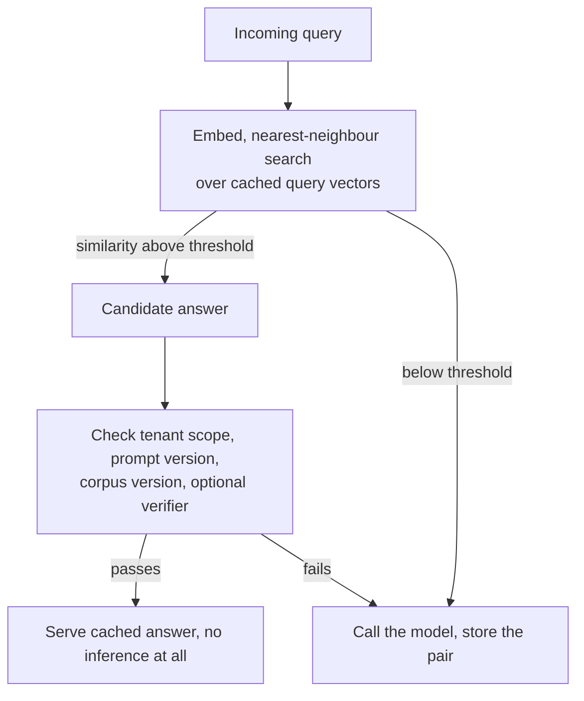

**Follow-ups:** Design the cache key for a multi-tenant RAG product. How would you detect that your threshold is causing false hits in production?

</details>

### 28. How do you handle streaming when the model is emitting tool calls or structured JSON?

<details><summary><b>Answer</b></summary>

The tension: streaming exists to show incremental progress, but tool calls and JSON are only actionable when syntactically complete. The stream delivers fragments - `{"loc` ... `ation": "par` - and naive `json.loads` on partial data throws.

Mechanics first: providers stream structured content as typed deltas. OpenAI's Chat Completions sends `tool_calls` deltas carrying an index, the function name (early), and incremental `arguments` string fragments, and its Responses API emits typed `response.function_call_arguments.delta` events; Anthropic sends `content_block_start` / `input_json_delta` events per block, with blocks possibly interleaving text and tool use. The client's job is an **accumulator**: route each delta to its block/tool-call by index, concatenate argument fragments, and mark completion on the block-stop/finish event. Only then parse, validate against the tool's schema, and dispatch.

Patterns on top of that:

- **Buffer-then-act** for execution: never execute a tool on partial arguments. The block-complete signal is your commit point; schema validation is your safety net (models occasionally emit malformed JSON - have a repair-or-retry path).
- **Partial-JSON parsing** for display: best-effort parsers that close open brackets/strings let you render progressive UI from incomplete JSON (streaming a table row by row, showing which tool is being called and its arguments as they form). Several SDKs now expose partial-parse helpers for exactly this.
- **Interleaving**: modern models mix prose and tool calls in one response; keep per-block state machines rather than assuming one content type per message.
- **Streaming through your own API**: if your backend proxies to clients, re-emit clean, versioned events (text delta / tool started / tool result / done) rather than leaking provider formats - this is where multi-provider normalization earns its keep.
- **Failure handling**: a stream dying mid-JSON means an unusable fragment - treat as a failed generation, retry idempotently, and make double-execution of tools impossible (idempotency keys on tool side effects).

**Worth sketching.** It separates the display path from the execution path, which is the distinction that keeps a half-formed tool call from firing.

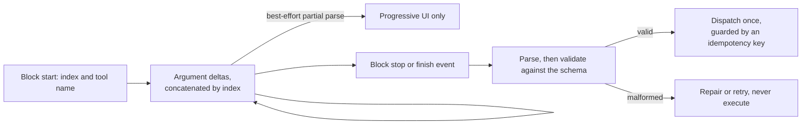

**Follow-ups:** Where do you put schema validation when the model streams a 10-item JSON array you want to render progressively? How do you prevent a tool from executing twice when a stream retry replays the tool call?

</details>

### 29. You need to serve 200 customer-specific fine-tunes of the same 8B base model. How do you do that on a handful of GPUs, and what breaks first?

<details><summary><b>Answer</b></summary>

Multi-LoRA serving. Load the base weights once and treat each tenant as a rank-r adapter: for each targeted projection, y = Wx + scale * (B A x). The expensive base matmul is shared across the whole batch, and only the small low-rank terms are per-adapter, so one batch can mix adapters and you keep continuous batching. The alternative, 200 full model replicas, is absurd: 200 x ~16 GB versus 1 x 16 GB plus 200 x tens of MB.

The kernel is what makes it work. A naive loop over adapters serialises the batch. Production systems sort tokens by adapter into contiguous segments and do one grouped GEMM (the SGMV approach from Punica, used by LoRAX, vLLM and SGLang). vLLM exposes this as `--enable-lora` with `--max-loras` (distinct adapters allowed in one batch), `--max-lora-rank`, and `--max-cpu-loras` (host-side pool); the request names the adapter it wants.

What breaks:

- **Rank heterogeneity.** Grouped kernels pad to the max rank, so one rank-64 adapter taxes every rank-8 tenant sharing the batch. Standardise ranks across tenants.
- **The `max_loras` cap.** If more distinct adapters are concurrently active than the cap allows, the scheduler serialises across adapter groups and TTFT tails explode. Fix it by routing: give each replica a subset of adapters (adapter affinity) so concurrency per replica stays under the cap.
- **Cold adapter fetch.** Adapters are small, so host RAM paging is fast, but pulling from object storage on first request is a visible spike. Prefetch on session start.
- **Prefix cache does not cross adapters.** KV is adapter-specific, so a shared system prompt is cached separately per adapter. This surprises people.
- **Evaluation.** You now own 200 quality surfaces, not one.

Expect a real throughput cost versus a base-only server, growing with distinct adapters per batch. Measure it on your traffic rather than trusting a headline number.

**Worth sketching.** Showing the shared base matmul beside the per-adapter term explains in one glance why 200 tenants fit where 200 replicas never would.

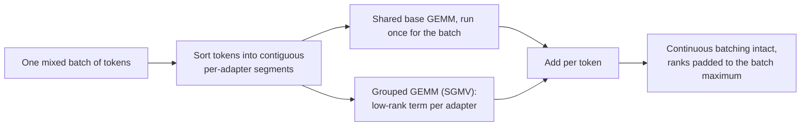

**Follow-ups:** Why can't a shared system prompt's KV be reused across two different adapters? When would you merge an adapter into the base weights and serve it as its own model instead?

</details>

### 30. How do you load test an LLM service so the numbers actually mean something?

<details><summary><b>Answer</b></summary>

Most LLM load tests are wrong in the same three ways: closed-loop load, unrealistic prompts, and reporting means.

**Open loop, not closed loop.** A closed-loop test (N workers, each sends a request and waits) throttles itself when the server slows down, so you never observe the queue building. That is coordinated omission, and it hides exactly the failure you are testing for. Generate arrivals from a Poisson process at a target rate, independent of responses:

```python
import asyncio, random

async def open_loop(rate, duration, send, next_prompt):
    loop = asyncio.get_event_loop()
    end, tasks = loop.time() + duration, []
    while loop.time() < end:
        await asyncio.sleep(random.expovariate(rate))  # do not wait on responses
        tasks.append(asyncio.create_task(send(next_prompt())))
    return await asyncio.gather(*tasks)
```

**Realistic token distributions.** Sample input and output lengths from production logs, including the tail; a fixed 512-in/128-out synthetic workload tells you nothing about a service that occasionally sees 100K-token prompts. Critically, get the prefix-cache realism right: replaying one identical prompt gives a ~100% cache hit rate and a fantasy TTFT. Mirror your real ratio of shared to unique prefixes.

**Sweep, don't spot-check.** Ramp the rate from idle to saturation and plot TTFT and ITL percentiles against throughput. What you want is the knee, and the maximum rate at which you still meet the SLO. Report **goodput** at the SLO, plus P50/P95/P99, never the mean. Tools like vLLM's serve benchmark and GuideLLM do the sweep and the Poisson arrivals for you.

**Warm up and hold.** Weight load, CUDA graph capture and compilation make the first requests unrepresentative. Discard the warm-up window and measure at steady state for a fixed duration.

Then test the ugly parts: behaviour past saturation (does it queue, shed, or fall over?), preemption rate, a mixed multi-tenant workload, and a long soak for leaks and fragmentation. Against a provider API, you are mostly testing your own rate limits and their variance by time of day, so do not tune to a single run.

**Follow-ups:** Why does a closed-loop test with 100 workers understate P99 latency? How would you design the prompt corpus for a benchmark of an agentic workload?

</details>

### 31. Your product is moving from a standard chat model to a reasoning model with extended thinking. What changes for capacity, SLOs, and design?

<details><summary><b>Answer</b></summary>

Almost everything downstream of "tokens per request", because that number jumps by roughly an order of magnitude and gets a much fatter tail.

**Capacity.** Thinking tokens are generated tokens: they bill as output, they occupy KV, and they consume decode steps. A request that used to emit ~300 tokens might emit several thousand. Since fleet sizing is driven by total decode tokens, not requests, plan in tokens. The comforting part is that reasoning traffic is decode-heavy and batches well, so per-GPU throughput holds up; the problem is per-request latency and KV occupancy.

**The tail is the enemy.** Output length becomes heavy-tailed and unpredictable per request. You cannot size on the mean, and a handful of requests can hold KV slots for minutes, causing head-of-line blocking and preemption cascades that hurt everyone. Cap it: hard `max_tokens`, and use the provider's thinking budget or reasoning-effort control rather than hoping. Watch preemption rate as a first-class metric.

**SLOs must change.** TTFT is close to meaningless when the first token can be a thinking token the user may never see. Track time to first *answer* token and total time to answer. Interactive budgets move from hundreds of milliseconds to seconds or tens of seconds, and the UX has to carry that: stream a progress or status surface, or move the work to a background job with a notification.

**Scheduling.** Do not mix long reasoning generations and fast chat in one queue; the long ones will wreck chat's P99. Separate pools or priority classes, routed by effort.

**Design levers.** Route by difficulty: cheap non-reasoning model first, escalate on signals of hardness. Prompt caching does not help thinking tokens, since they are generated fresh every time. Whether earlier reasoning is carried forward differs by provider: some drop prior-turn thinking from context, others expect you to pass reasoning items or thinking blocks back within a tool-use loop, which keeps both continuity and cache hits. Read your provider's rules, because getting this wrong silently costs either quality or cache hits. Speculative decoding often does well here because long traces contain predictable structure. And for anything not interactive, a batch API path is the right answer.

**Follow-ups:** How would you pick the thinking budget per request rather than setting one global value? Which is worse for your fleet: one 30K-token reasoning request or thirty 1K-token chat requests, and why?

</details>

### 32. Explain KV cache offloading and cross-request reuse beyond a single GPU's memory. When does loading a cached prefix beat just recomputing prefill?

<details><summary><b>Answer</b></summary>

GPU HBM only holds a small working set of KV, so blocks get evicted and the next request re-prefills the same prefix from scratch. Offloading adds tiers below HBM: host RAM first, then NVMe, then a shared network tier so any replica can pull a prefix another replica computed an hour ago. LMCache and vLLM's KV connector interface are the common implementations, and the same machinery moves KV from prefill nodes to decode nodes under PD disaggregation.

The decision is a bandwidth comparison: recomputing a prefix costs prefill FLOPs, loading it costs bytes over a link. Work it per model.

```python
kv_bytes_per_token = 320_000        # ~320 KB, 70B-shape model, FP16 KV
link_bw = 50e9                      # ~50 GB/s achievable over PCIe Gen5 x16
load_tokens_per_s = link_bw / kv_bytes_per_token   # ~156K tokens/s
# prefill for a 70B model is order of a few thousand tokens/s per GPU
```

Host RAM wins by a wide margin, so offloading to CPU memory almost always beats recompute *when the hit is real*. NVMe at single-digit GB/s is a closer call, and a network tier closer still. The model architecture flips the answer: MLA-style attention with tiny KV per token makes loading trivially cheap, while a fat-KV model pushes you back toward recompute.

Failure modes worth naming:

- **Hit rate is everything.** A 20% hit rate means you mostly pay transfer overhead for nothing.
- **Interference.** Fetch and decompression contend with inference for PCIe bandwidth and SMs, so a naive implementation slows the requests it is trying to help.
- **Correctness.** The cache key must include model version, quantization, adapter, TP layout and positional handling. Serving KV computed under a different config is a silent quality bug, and it is a classic outage.

Where it pays: multi-turn chat and agents with long stable prefixes, RAG over a repeated corpus, and document Q&A where one long document is queried many times.

**Follow-ups:** What exactly must go into the cache key? At what hit rate does an NVMe tier stop paying for itself?

</details>

### 33. How do you choose inference hardware: NVIDIA GPUs, AMD, TPUs, or cloud silicon like Inferentia and Trainium?

<details><summary><b>Answer</b></summary>

Start from the workload's binding constraint and the software you would have to own, not the spec sheet, and settle it with a benchmark denominated in dollars per million tokens at your SLO.

**Match the constraint.** Decode is memory bandwidth and capacity bound, so HBM capacity and TB/s matter more than peak FLOPS. Capacity has a second-order effect people miss: a 192 GB MI300X can hold a model that would need two 80 GB cards, which removes tensor-parallel all-reduces from every layer and can beat the "faster" option. An H200 at 141 GB tells a similar story. Prefill and large-batch serving are compute bound, so there tensor-core throughput and low-precision support (FP8, and FP4 on Blackwell-class parts) is what you are buying.

**Software usually casts the deciding vote.** NVIDIA gets day-one support in vLLM, SGLang and TensorRT-LLM, plus the widest kernel coverage for speculative decoding, LoRA and structured output. ROCm has closed a lot of ground and MI300X is supported in the main open stacks. TPUs are strong for large steady-batch serving through JAX and XLA and can be excellent on price-performance, but the ecosystem is narrower. Inferentia and Trainium need Neuron compilation, so model and feature coverage is the risk you are underwriting; the payoff is unit cost if your model is supported.

**The metric that matters** is dollars per million tokens at your SLO, on your model, with your traffic shape. Sticker price per GPU-hour is meaningless. A cheaper chip that halves your achievable batch size is more expensive, and a chip that misses your latency target at any batch size is infinitely expensive.

**Then reality.** Availability and commitment terms often dominate the technical comparison: the best chip you cannot get for six months loses to the adequate one you can reserve today. Multi-minute weight loads make spot capacity a poor fit for interactive serving. Hedge portability by keeping an OpenAI-compatible serving interface and avoiding hand-written kernels, so switching is a config change and a requalification, not a rewrite.

**Follow-ups:** Why might one GPU with more HBM beat two smaller GPUs with the same total memory? What would make you reject a chip that wins on dollars per token?

</details>

### 34. When does on-device or edge inference make sense, and what actually constrains it?

<details><summary><b>Answer</b></summary>

It makes sense when privacy or data residency, offline operation, per-request cost at very high volume, or near-zero network latency matters more than peak model quality. Typical real deployments: text prediction, on-device summarisation and transcription, classification or redaction before anything goes to the cloud, and local agents on laptops.

The constraints, in the order they bite:

- **Memory.** A phone realistically gives an app a couple of GB. That puts you around 1B to 4B params at 4-bit (roughly 0.5 to 2.5 GB), with ~8B at 4-bit (~4.5 GB) only on high-memory devices. KV cache competes for the same budget, so usable context is short. Laptops are far more generous, which is why the local-agent story is a laptop story first.
- **Bandwidth.** You are at batch 1 forever, so decode is purely memory-bandwidth bound. Phone LPDDR5X sits in the tens of GB/s versus a datacentre GPU's TB/s, so expect an order of magnitude fewer tokens/s. The batching trick that saves you in the cloud does not exist here.
- **Thermals and battery.** Sustained generation throttles. A benchmark's first 30 seconds is a lie; measure a long run and measure power.
- **Distribution.** Multi-GB model downloads hurt install rates and updates. OS-provided on-device models sidestep this, at the price of less control.
- **Toolchain.** llama.cpp/GGUF, MLX on Apple silicon, ONNX Runtime, Core ML and vendor NPUs. NPU support is uneven, and operator coverage plus supported quantization formats decide feasibility more often than raw TOPS.

The design that usually wins is hybrid: a small local model handles classification, routing, redaction and drafting, and hard queries escalate to the cloud; offline degrades to local-only. Evaluate the small model on your task, not on general leaderboards. The quality cliff from a frontier model to a 3B is task-dependent: often acceptable for extraction and classification, poor for open-ended reasoning.

**Follow-ups:** How do you decide where the local/cloud routing boundary sits? What breaks about your evaluation and observability story when inference runs on the user's device?

</details>

### 35. At low batch sizes your decode is slower than the bandwidth math predicts, and the GPU timeline shows gaps between kernels. What is CPU overhead in LLM serving, and how do CUDA graphs and overlapped scheduling fix it?

<details><summary><b>Answer</b></summary>

At small batch sizes a decode step is so short that the host side, not the GPU, becomes the bottleneck. One step is hundreds of small kernels (several per layer across dozens of layers), and each launch costs microseconds of CPU time in Python, the framework dispatcher and the driver. Add the scheduler's per-step work (choosing the batch, updating block tables, sampling, detokenizing, streaming) and the GPU idles between steps. A profile shows gaps on the GPU timeline and one pegged CPU core. On a small model, where a step's weight read takes well under a millisecond, overhead can be a large share of the step.

The fixes, roughly in the order engines adopted them:

- **CUDA graphs.** Capture the whole decode step once and replay it with a single launch, so launch overhead collapses. The catch is that graphs are static in shape: engines capture a set of batch-size buckets at startup and pad each step to the nearest bucket, which costs memory and startup time. Dynamic pieces, such as some attention backends, MoE routing or custom ops, can break capture and force eager mode.
- **Compilation and fusion.** `torch.compile` and hand-fused kernels merge elementwise work (norms, activations, rotary embeddings) into fewer, larger kernels, which means fewer launches and fewer HBM round trips.
- **Overlapped scheduling.** Prepare step N+1 on the CPU while the GPU runs step N, so the scheduler leaves the critical path. SGLang's overlap scheduler and vLLM's async scheduling do this. The subtlety is that step N+1 needs the token sampled in step N, so everything else is prepared ahead and the token is filled in last.
- **Move work off the hot loop.** Run tokenization, detokenization, streaming and HTTP handling in separate processes from the engine core.

The interview point: this is why measured batch-1 tokens per second on a small model can sit well below the bandwidth ceiling, and why an engine upgrade sometimes buys more latency than a faster GPU. It matters most for small models, low batch, speculative decoding (many tiny verify steps), and architectures with weaker graph coverage.

**Worth sketching.** It shows where the idle time comes from and which fix removes each slice of it.

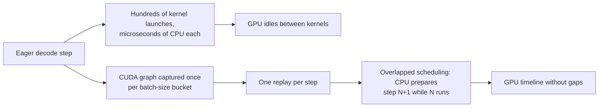

**Follow-ups:** Why do CUDA graphs need batch-size buckets, and what does padding to a bucket cost you? How would you confirm from a profile that a latency problem is host overhead rather than memory bandwidth?

</details>

### 36. Providers now sell the same model at several service tiers: standard, priority, flex or batch, and provisioned throughput. How do you decide which traffic goes where?

<details><summary><b>Answer</b></summary>

Treat tiers as different points on a price, latency and capacity-guarantee curve, and send each workload to the cheapest tier that still meets its SLO. The model is the same in every tier. What you are buying is scheduling priority and how firmly the provider guarantees capacity.

- **Standard on-demand.** Per-token pricing, shared capacity, best-effort latency, per-organisation rate limits. The default for interactive features at moderate volume.
- **Priority.** OpenAI's priority `service_tier`, Anthropic's Priority Tier and similar offerings charge a premium or require a commitment in exchange for being scheduled first when the provider is busy, so tail latency and availability at peak improve. Worth it for the latency-critical slice where a P99 miss costs revenue, not for all traffic.
- **Flex and batch.** Discounted, often around half price, in exchange for slower or asynchronous completion and the chance of being deprioritised or refused at busy times. Flex keeps the synchronous API shape with longer timeouts. Batch takes a file of requests and a completion window. Both suit evals, backfills, enrichment and anything a person is not waiting on.
- **Provisioned throughput.** Bedrock, Vertex AI, Azure and direct commitments reserve capacity in model units or tokens per minute, billed whether you use it or not. It buys predictable latency and no 429s up to your reservation, and its economics are the self-hosting economics: it pays only at high, steady utilisation.

How to decide: classify traffic by latency tolerance and business value. Fill provisioned capacity up to your sustained baseline, burst on standard, route the critical slice to priority, and push everything deferrable to flex or batch. Review reserved-capacity utilisation weekly, because an unused commitment is pure waste.

Pitfalls:

- Tiers can differ in rate limits and feature support, so test prompt caching, tool use and structured output on each tier you route to.
- Flex traffic needs longer timeouts and a defined behaviour when capacity is refused: retry later, fall back to standard, or queue.
- Prices, discounts and terms change often. Keep the tier routing table in configuration, tag every request with the tier that served it, and attribute cost per tier so the next renegotiation uses real data.

**Follow-ups:** Your provisioned capacity runs at 40% utilisation overnight: what do you route into it? How do you decide whether a feature's P99 is worth paying priority-tier prices for?

</details>

## Advanced

### 37. Build the full GPU memory budget for a serving deployment, and show how it determines maximum batch size and concurrency.

<details><summary><b>Answer</b></summary>

Budget for one H100 80 GB serving a 70B-class model (80 layers, 8 KV heads, head_dim 128) quantized to 4-bit:

```
Weights:   70e9 params × ~0.56 B/param (4-bit + scales)  ≈ 39 GB
Runtime:   CUDA context + engine buffers                  ≈ 2 GB
Activations/workspace (batch- & chunk-size dependent)     ≈ 4 GB
------------------------------------------------------------------
Available for KV cache (at ~0.9 memory utilization)       ≈ 27 GB
```

KV cache at FP16 is ~320 KB/token (2 × 80 × 8 × 128 × 2 B), so the pool holds:

```
27 GB ÷ 320 KB ≈ ~84K tokens of total resident context
```

That single number *is* your concurrency budget: ~21 concurrent sequences at 4K context, ~10 at 8K, and a single 84K-context request consumes the entire pool. Since decode throughput scales with batch size, this is why **KV memory - not compute - caps throughput** for most deployments, and why a long-context feature quietly destroys the economics of a shared pool.

Levers, with their effect on the same arithmetic: FP8 KV cache → 160 KB/token → ~168K resident tokens (2× concurrency); GQA is already in this model (with full MHA it'd be 8× worse); a second GPU with TP=2 roughly doubles the KV pool *and* halves weight bytes per GPU; smaller model or shorter context caps obviously help. PagedAttention matters here as the enabler: it makes ~all of that 27 GB *usable* (prior contiguous allocation wasted most of it), and prefix caching means shared system prompts don't multiply-count against the pool.

Close the loop with behaviour at the limit: when admission would exceed the pool, the scheduler queues (TTFT grows) or preempts running sequences (evict-and-recompute - ITL spikes). So "KV utilization" and "preemption rate" are the dashboards that tell you this budget is exhausted before users do.

**Worth sketching.** Drawing the budget as one flow from card capacity to concurrent sequences makes the KV pool visibly the thing that caps throughput.

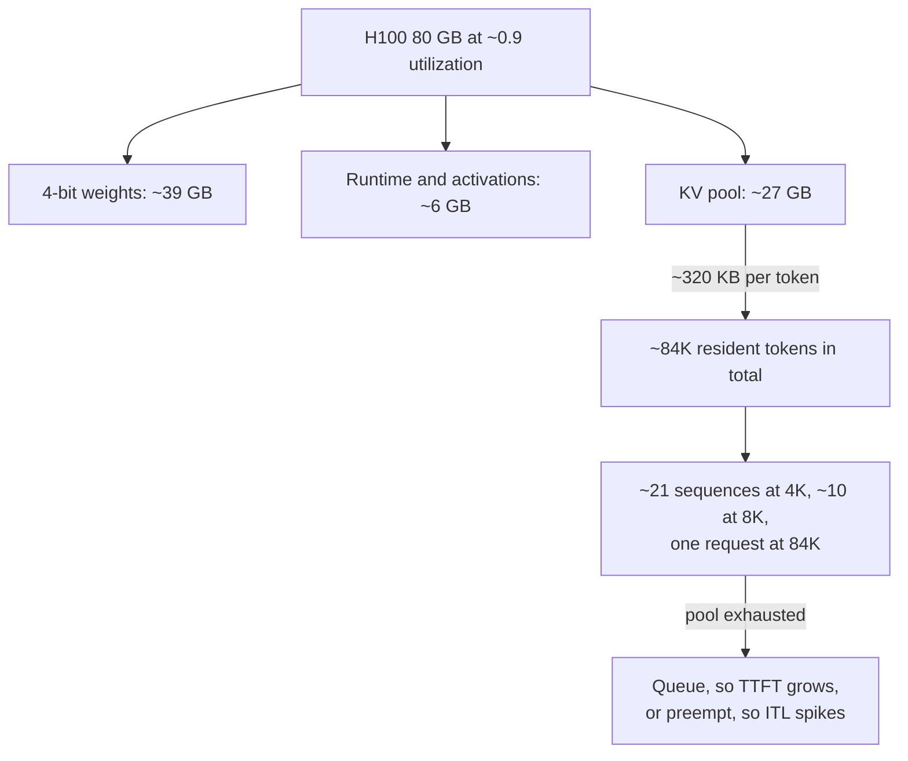

**Follow-ups:** Redo the math with FP8 weights on 2 GPUs. Your product wants to raise the context limit from 8K to 128K - what does that do to cost per request?

</details>

### 38. Design the SLOs for a new LLM-powered feature. What do you promise, and how do you measure it?

<details><summary><b>Answer</b></summary>

Start from what the user perceives, per interaction pattern - one global "latency SLO" is a category error:

- **Interactive chat (streamed)**: P99 TTFT (say, < 1.5 s; P50 a few hundred ms) + P99 inter-token latency or a stream-rate floor (tokens/s comfortably above reading speed). Total duration matters less because streaming hides it.
- **Autocomplete/inline suggestions**: total completion latency (P95 < ~300-500 ms) - TTFT alone is meaningless since output is short and unusable until whole.
- **Agentic/multi-step tasks (non-streamed steps)**: end-to-end task completion time budget, decomposed into per-step budgets - remembering tails compound across sequential calls.
- **Batch/background**: freshness SLO (results within N hours) + completion rate, not latency.

Beyond latency: **availability** (successful-response rate, with degraded-mode responses counted separately), **quality guardrails** where measurable (schema-valid output rate, tool-call validity rate, refusal/error rate) - a fast wrong answer isn't meeting the objective - and often a **cost SLI** internally (per-request cost distribution) even if it's not a promise.

Measurement discipline: measure at the client edge or gateway, not just the server (users experience the network and your middleware); percentiles per feature per prompt-length bucket; define events precisely (TTFT = request sent → first *content* token, excluding provider handshake?); include timeouts and errors in the latency distribution rather than dropping them (classic gaming). Set targets from data - run the feature, look at the achievable curve, pick targets you meet ~99%+ of the time with headroom - then attach an **error budget** and agree on what happens when it burns: freeze risky changes, shed load, scale.

Finally, wire SLOs to action: alerts on budget burn rate (not point-in-time blips), dashboards that decompose breaches (queueing vs prefill vs provider vs network), and load-shedding priorities that explicitly protect the SLO'd interactive tier by sacrificing background traffic first.

**Follow-ups:** Your provider's P99 is worse than the SLO you want to offer - what are your options? Why measure timeout-terminated requests inside the latency distribution?

</details>

### 39. Capacity planning: you're told to expect 100 requests/sec at peak with ~2K input and ~300 output tokens per request. Walk me through estimating the GPU fleet.

<details><summary><b>Answer</b></summary>

Method first, numbers second - interviewers are grading the process.

**1. Characterise demand.** Peak 100 req/s × 2K in / 300 out ⇒ ~200K input tok/s prefill and ~30K output tok/s decode, sustained. Check the distribution too: means hide the 32K-token document uploads that dominate tail behaviour. Apply expected prompt-cache hit rate (shared system prompt across requests can cut effective prefill dramatically).

**2. Measure per-replica goodput - don't trust datasheets.** Take the target model/engine/GPU config (say 70B FP8, TP=2 on H100s), load-test with production-shaped traffic (same in/out lengths, arrival bursts), sweep concurrency, and find max throughput *under your SLO* (goodput) - e.g., you might measure a replica sustaining ~X thousand output tok/s with P99 TTFT under budget. Sanity-check X from first principles: decode is bandwidth-bound, so bytes-per-token × tokens/s must fit within aggregate HBM bandwidth; if your measurement is way off the roofline estimate, something's misconfigured.

**3. Divide with headroom.** `replicas = peak_demand / per_replica_goodput × headroom` - headroom ~1.4-1.7× because queueing latency explodes near saturation (target ~60-70% utilization at peak), plus N+1 for failure/deploys, plus multi-zone if required. Diurnal shape decides how much is reserved/committed capacity vs autoscaled.

**4. Don't forget the non-GPU parts**: gateway, tokenization, KV transfer if disaggregated - and that prefill and decode demand may justify *different* pool shapes.

**5. Validate and iterate**: shadow traffic or gradual rollout, watch goodput/queue depth/KV utilization, re-plan monthly - traffic mix drift (longer contexts, agentic loops) invalidates plans faster than growth does.

The trap to avoid: quoting a tokens/s number from a blog benchmark run with 128-token prompts and calling it a plan. Also state the alternative: at this scale, compare against API provisioned-throughput pricing - the fleet you just sized has a fully-loaded cost that may or may not beat it.

**Follow-ups:** How does a 30% prompt-cache hit rate change the answer? Peak is 3× the daily average - how do you split reserved vs autoscaled capacity?

</details>

### 40. GPU cold starts take minutes. How do you autoscale an inference fleet anyway?

<details><summary><b>Answer</b></summary>

First decompose the cold start: (1) obtaining a GPU node - minutes if capacity exists, unbounded if it doesn't (GPU scarcity is real); (2) pulling a multi-GB container image; (3) loading weights - 140 GB from object storage at 1-5 GB/s is minutes by itself; (4) warmup - engine init, CUDA graph capture, compilation, prefix-cache priming. Naively that's 5-15 minutes from scale-decision to serving - hopeless against a traffic spike that builds in 30 seconds.

So the strategy is: **scale on leading indicators, shrink the cold path, and keep warm buffers.**

- **Right signals**: queue depth/wait time, in-flight concurrency, KV-cache utilization, tokens/s vs known per-replica goodput. Not GPU utilization (memory-bound decode reads ~100% while meaning little) and not CPU. Scale-up thresholds aggressive, scale-down slow and hysteretic (drain streams gracefully - sequences in flight must complete or migrate).
- **Shrink the cold path**: pre-baked AMIs/images (no pull), weights on local NVMe or warmed page cache, fast loaders (safetensors mmap, streaming loaders like tensorizer), snapshot/restore techniques where available. Getting load time from 10 min to <1 min changes what autoscaling can do.
- **Warm pools**: nodes with image+weights resident, GPU attached, process paused or serving at low priority - expensive standby, but the only true answer to sharp spikes. Size the warm buffer from historical spike magnitude.
- **Predictive/scheduled scaling** handles the diurnal bulk: scale ahead of the 9 a.m. ramp by schedule or forecast, keeping reactive scaling only for residuals.
- **Absorb what you can't scale for**: admission control with prioritised queueing (background traffic yields first), degraded modes (smaller fallback model already warm), and burst-overflow to an API provider as pressure relief - often the cheapest "warm pool" of all.

Mention the economic frame explicitly: autoscaling GPUs is about trading standby cost against SLO risk; the right answer differs for a chat product (warm buffers mandatory) vs batch pipeline (queue it, scale lazily).

**Worth sketching.** Laying the cold path out stage by stage is how you justify a warm pool to someone who thinks autoscaling is a config value.

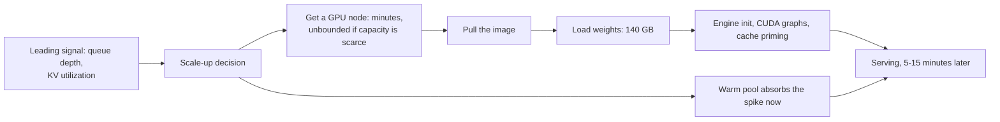

**Follow-ups:** Why is GPU utilization a bad scaling signal for decode-heavy workloads? Design the scale-down path so long-running streams aren't killed.

</details>

### 41. What do you monitor in production LLM serving, and what pages someone at 3 a.m.?

<details><summary><b>Answer</b></summary>

Four layers, each with distinct signals:

**User-experience (SLO) layer**: TTFT and ITL percentiles per feature and prompt-length bucket, request success rate, timeout rate, stream-abort rate, schema-valid output rate for structured endpoints. Measured at the gateway/edge, not just the engine.

**Engine layer** (vLLM et al. export these via Prometheus): queue depth and wait time, running/waiting sequence counts, batch size, **KV-cache utilization**, **preemption/eviction counts**, prefix-cache hit rate, tokens in/out per second. These are the leading indicators - KV utilization pegged plus rising preemptions predicts latency cliffs before users feel them.

**Hardware layer**: HBM usage, memory-bandwidth vs SM utilization (a memory-bound decode fleet showing "100% GPU util" is normal; the interesting question is which roof you're hitting), temperature/power throttling, ECC errors, NVLink/interconnect errors for TP groups, node health.

**Cost & provider layer**: tokens and $ per request/feature/tenant, cache hit rates (prompt + semantic), 429/5xx rates per provider, provider latency drift, budget burn anomalies.

**Page at 3 a.m.** (user-impacting, needs a human now): availability/error-rate SLO burn-rate alerts; sustained P99 TTFT/ITL breach; queue depth growing without bound (saturation/incident); replica crash-loop or OOM storm; provider hard-down with fallback also failing; security anomalies. **Ticket for morning**: cost anomalies, cache hit-rate regressions, single-replica degradation with headroom, gradual quality-signal drift. The 3 a.m. bar is "is user experience or data at risk *and* can a human act on it" - paging on cost or on raw GPU util is how teams burn out on-call.

Two practices worth naming: burn-rate alerting (alert on error-budget consumption speed, not instantaneous blips) and decomposition dashboards - when TTFT breaches, you want one screen separating queue wait vs prefill time vs provider time vs network, because the remediation for each is completely different.

**Follow-ups:** KV utilization is 95%, preemptions are climbing, but GPU "utilization" looks fine - what's happening and what do you do? What would you add for a multi-tenant platform?

</details>

### 42. Design the reliability layer for calls to an LLM provider: timeouts, retries, circuit breakers, idempotency.

<details><summary><b>Answer</b></summary>

**Timeouts - layered, never one number.** A single 120 s timeout is wrong for a streaming call: it can't distinguish "slow but progressing" from "hung." Use: connect timeout (seconds); **TTFT timeout** (no first token within ~10-20 s → dead request); **inter-chunk inactivity timeout** (stream silent for ~30 s → hung; beware legitimate pauses during provider-side tool use - heartbeats help); total wall-clock cap per feature. Tune per model class - reasoning models legitimately think for a long time before the first visible token.

**Retries - bounded and honest.** Retry 429/5xx/network failures with exponential backoff + full jitter, honoring `Retry-After`; never retry 4xx validation errors. Cap at 2-3 attempts with an overall latency budget, and a global retry budget (if >~10% of traffic is retrying, you're amplifying an outage - shed instead). Mid-stream failure is the nasty case: a retry regenerates from scratch, possibly producing *different* text - the UI must replace, not append, and anything already acted on downstream must be handled (see idempotency). Hedged requests (fire a second call at ~P95, take the winner) buy tail latency for money - use only on idempotent, high-value paths.

**Circuit breakers - per provider × model.** Track failure rate over a sliding window; open the breaker on sustained failure (fail fast, stop feeding a dying dependency), pass limited probes half-open, close on recovery. On open: route to the fallback chain - same-family smaller model, or another provider - *pre-validated with evals*, because prompts don't transfer 1:1 and a silent quality collapse is worse than an error page. Bulkhead traffic classes so background jobs can't exhaust connections/quota needed by interactive traffic.

**Idempotency.** The LLM call itself is stateless - safe to retry, at worst you pay twice. The danger is **side effects around it**: a retried agent step re-executing a tool (double email, double write). Assign idempotency keys to side-effectful operations, dedupe at the tool layer, and make pipeline steps replay-safe (retried batch item overwrites by `custom_id`, not appends). State machines, not vibes: each request has an ID and a durable status.

**Worth sketching.** The three breaker states plus the half-open probe are the part people describe vaguely, and the sketch forces the transitions to be exact.

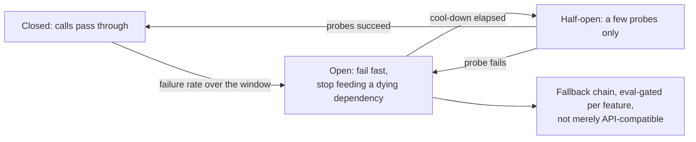

**Follow-ups:** A stream dies at token 400 of a 600-token answer the user is reading - walk through exactly what happens. Why must fallback models be eval-gated rather than just API-compatible?

</details>

### 43. Traffic doubles overnight and you can't get more GPU capacity for a week. What are your graceful-degradation options?

<details><summary><b>Answer</b></summary>

The principle: **degrade quality and features before availability, and degrade the least valuable traffic first.** Have the ladder designed, flagged, and load-tested *before* the incident.

Roughly in order of user pain:

1. **Shift work off-peak/offline**: anything non-interactive (enrichment, evals, digests) → batch API or paused. Often recovers 20-40% of capacity instantly because background loads hide inside "production" traffic.
2. **Maximise cache aggression**: raise prompt-cache TTLs, precompute popular responses, cautiously loosen semantic-cache thresholds for FAQ-like traffic (watching hit precision).
3. **Shrink tokens per request**: cap `max_tokens` harder, trim history windows and RAG chunk counts, reduce reasoning-effort settings, disable verbose modes. Cuts both compute and KV footprint - recall each resident token is KV memory, so context trimming directly raises concurrency.
4. **Model downshift**: route mid-difficulty traffic to a smaller/cheaper model (already warm, already eval'd - this is why cascades should exist before you need them). Users get slightly worse answers; they still get answers.
5. **Feature shedding**: turn off LLM-powered nice-to-haves (suggestions, auto-summaries, speculative prefetch) via kill switches.
6. **Prioritised admission control**: interactive > background; paying tiers > free; within tier, queue with honest UX (position/ETA) rather than timeouts. Explicit load shedding of lowest-priority requests with a clear error beats everyone timing out.
7. **Burst overflow to an API provider** (if policy allows): the rented warm pool. Costs money, saves the SLO.
8. **Last resort**: waitlist/static responses for the lowest tier - an honest "we're at capacity" preserves trust better than a hung spinner.

Two operational notes that distinguish senior answers: every rung needs a **feature flag and a rollback**, exercised in game days, because inventing degradation during an incident fails; and instrument the degraded modes separately - you need to know how much capacity each rung actually recovered, and product needs to consent to the quality ladder in advance, not at 3 a.m.

**Follow-ups:** Which of these change KV-memory pressure vs compute pressure? How do you decide the priority order between free-tier chat and paid-tier background jobs?

</details>

### 44. How is structured output actually enforced at the serving layer, and what does it cost?

<details><summary><b>Answer</b></summary>

The mechanism is **constrained (guided) decoding**: compile the target format - JSON Schema, regex, or a context-free grammar - into an automaton (FSM for regex/JSON, pushdown for CFGs), and at every decode step **mask the logits** of all tokens that would violate the format before sampling. The model can only ever emit valid continuations, so the output is syntactically valid *by construction* - no parse-and-retry loops. This is what Outlines and XGrammar implement, what vLLM/SGLang expose as guided/structured output, what llama.cpp's GBNF grammars do, and what the hosted APIs run server-side: OpenAI's `strict` JSON-schema mode, Anthropic's structured outputs and strict tool use, and Gemini's response schemas. Each supports a different subset of JSON Schema, so know your provider's exact guarantees.

Subtleties that show depth: masking operates on **tokens, not characters** - a JSON string can span token boundaries arbitrarily, so the automaton must be compiled against the tokenizer's vocabulary (the expensive precomputation that Outlines/XGrammar optimise); schema features don't all map cleanly to grammars (unbounded recursion, some regex features, `additionalProperties` handling), so check the supported subset.

Costs, in three buckets:

- **Compile time**: schema→automaton compilation can take noticeable time for complex schemas - cache compiled grammars keyed by schema hash (first-request latency spikes are the telltale of a missing cache).
- **Per-step overhead**: computing the valid-token mask each step; modern implementations get this to near-negligible, but naive ones bottleneck the decode loop.
- **Quality tax - the subtle one**: forcing format can force *premature commitment*. If the schema demands `{"answer": ...}` first, the model must answer before it reasons. Mitigations: put a free-text `reasoning` field before the constrained answer fields, or run two phases (unconstrained thinking → constrained extraction). Also, over-tight enums/patterns can corner the model into confidently wrong values - leave an escape hatch (`"other"`, nullable fields).

Guarantee scope: constrained decoding guarantees **syntax, not semantics** - the JSON will parse; the *values* can still be wrong. Keep application-level validation.

**Worth sketching.** The per-step mask-and-advance loop is the mechanism; drawing it separates "valid by construction" from "we retry until it parses".

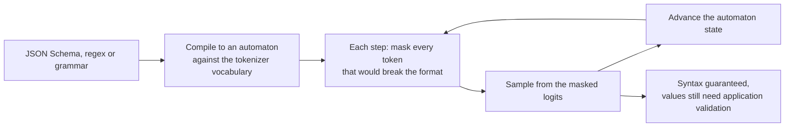

**Follow-ups:** Why must the grammar be compiled against the tokenizer vocabulary? When would you prefer parse-and-retry over constrained decoding?

</details>

### 45. Your LLM bill tripled this quarter. Design a cost-engineering programme - attribution, cascades, context management.

<details><summary><b>Answer</b></summary>

**Step 1: attribution before optimisation.** You can't fix what you can't see. Instrument every call with input/output/cached/reasoning token counts × current prices, tagged by feature, tenant, model, and prompt version; dashboard cost per request / per feature / per active user, plus anomaly alerts on burn rate. Nine times out of ten the trebling has a specific cause: an agent loop re-sending un-cached 20K-token contexts every step, a runaway retry path, reasoning-token creep after a model upgrade, or one enthusiastic B2B tenant. Find it before redesigning anything.

**Step 2: the mechanical levers, in typical ROI order.**

- **Prompt caching**: restructure prompts to stable-prefix-first; on Anthropic-style pricing cached reads are ~10% of input price. For agent/chat traffic this alone often cuts input spend 50%+.
- **Batch API** for everything offline: ~50% off with a 24 h window.
- **Output discipline**: `max_tokens` caps, terse formats, no input-echoing, tuned reasoning effort. Output is typically ~4-8× input-priced, so output tokens are where trimming pays most.
- **Context management**: sliding-window + summarization for history, fewer/better RAG chunks (retrieval precision is a cost feature), prune verbose tool results in agent loops. Watch for the quadratic-ish pattern: context that grows per turn while being re-billed every turn.

**Step 3: model tiering/cascades.** Route by predicted difficulty: a cheap router (heuristics, small classifier, or logprob-based confidence) sends easy traffic to a small model and escalates hard cases - FrugalGPT-style cascade: try cheap, verify (validators, self-consistency, judge), escalate on failure. Right-size per feature via evals; many features run fine on models 10-30× cheaper than the default-to-frontier choice. Guard rails: eval-gate every routing change, monitor escalation rate (a cascade that escalates 60% of traffic costs *more* than direct-to-big).

**Step 4: make it stay fixed.** Cost-per-feature in weekly review, budget alerts per tenant, regression tests on token counts in CI (a prompt edit that doubles tokens should fail a check), and re-price quarterly as models/prices shift.

**Follow-ups:** How do you build a difficulty router without labelled data? A model upgrade improved quality but doubled reasoning tokens - how do you decide?

</details>

### 46. Go deeper on speculative decoding: acceptance-rate math, modern drafters like Medusa/EAGLE, and when it backfires.

<details><summary><b>Answer</b></summary>

**The math.** Let α be the per-token acceptance rate (draft token accepted by the target's rejection-sampling check). Drafting k tokens per cycle, the expected tokens emitted per target forward pass is `(1 − α^(k+1)) / (1 − α)` (Leviathan et al.). At α = 0.8, k = 4: ~3.4 tokens per target pass. Wall-clock speedup ≈ that, divided by the cycle cost `1 + k·c` where c is the drafter's per-token cost relative to the target - so a drafter must be *both* well-aligned (high α) and cheap (low c). α is empirical and domain-dependent: high on code, boilerplate, extraction; lower on open-ended creative text. Larger k has diminishing returns (α^k decay wastes draft work past the first rejection), so k is tuned per workload (~4-8 typical).

**Modern drafters.** Separate small models need a matching tokenizer and still burn sequential time drafting. Self-drafting removes that: **Medusa** bolts extra decoding heads onto the target to predict several future tokens in one pass; **EAGLE** autoregresses in the target's *feature space* (reusing its top-layer representations) which gets substantially better acceptance than token-level heads, verified over a **tree** of candidate continuations rather than a single chain (tree attention verifies multiple branches in one pass - raising expected accepted length). **Prompt-lookup/n-gram** drafting retrieves candidate spans from the existing context - zero model cost, brutal effectiveness on tasks whose outputs copy inputs (editing, extraction, RAG quotes). Models trained with **multi-token prediction (MTP)** modules, DeepSeek-V3 being the well-known example, ship their own drafter, which engines can use directly with no separate training. Engines like vLLM/SGLang/TensorRT-LLM ship several of these.

**When it backfires**: (1) high-batch serving - verification consumes compute that regular decoding of other sequences would have used; when the fleet is compute-bound, spec decoding *reduces* aggregate throughput, so it's primarily a low-batch/latency-tier tool; (2) low α - drafting overhead with nothing accepted (mismatched domains, high temperature settings hurt); (3) memory - a draft model or extra heads eat KV/weight budget that could have been batch size; (4) engineering complexity - two models' KV caches, tree verification correctness, scheduler interaction. Always A/B on production-shaped traffic: measure ITL *and* aggregate goodput *and* cost, per domain.

**Follow-ups:** Why does temperature affect acceptance rates? Sketch how tree verification amortises one target pass across candidate branches.

</details>

### 47. What is prefill/decode disaggregation, and why do large-scale deployments separate the two?

<details><summary><b>Answer</b></summary>

Running both phases on the same GPUs creates **interference**: prefill bursts are compute-hungry and stall co-resident decodes (ITL spikes); decode steady-state is bandwidth-bound and leaves compute idle that queued prefills want. Chunked prefill softens this but only trades along the same curve - one pool must satisfy two SLOs (TTFT and TPOT) with anti-correlated resource profiles. **Disaggregation** (DistServe, Mooncake, NVIDIA Dynamo-style architectures; supported in vLLM) splits the fleet: a **prefill pool** processes prompts and produces KV caches; a **decode pool** receives the KV and streams tokens. The handoff transfers the sequence's KV cache over NVLink/RDMA/IB.

Why it wins at scale:

- **Independent SLO tuning**: prefill nodes optimise TTFT (run compute-saturated, big chunks, no one to disturb); decode nodes optimise ITL and batch density (stable, memory-optimised). DistServe showed large goodput gains under tight dual SLOs versus colocated serving.
- **Independent scaling and hardware**: prompt-heavy traffic scales the prefill pool; chatty long-generation traffic scales decode. The pools can even use different parallelism strategies or GPU SKUs (compute-optimised vs memory-bandwidth/capacity-optimised) - and prefill capacity can pull double duty with a global prefix-cache store (Mooncake's KV-centric design).
- **Isolation**: one 100K-token document upload can't freeze every stream on the box.

Costs and open problems: **KV transfer** is the tax - hundreds of MB to GBs per long sequence, needing fast interconnect and overlap-with-compute engineering; **orchestration complexity** (two-stage scheduling, failure handling mid-handoff, cache placement/affinity so prefix reuse still works); latency floor added by the hop; and it only pays past a scale where pool sizes can be balanced - a 4-GPU deployment should use chunked prefill and move on. Interview framing: chunked prefill = time-multiplexing one pool; disaggregation = space-partitioning into two specialised tiers. Same tension, stronger medicine, more moving parts.

**Worth sketching.** Two pools with the KV handoff drawn as the edge makes the tax explicit rather than letting it hide inside the architecture.

```mermaid
flowchart LR
    R["Request"] --> PP["Prefill pool: compute-optimised,<br/>tuned for TTFT"]
    PP -->|"KV cache over NVLink, RDMA or IB"| DP["Decode pool: bandwidth-optimised,<br/>tuned for ITL"]
    DP --> S["Streamed tokens"]
    PP --> SC["Scales with prompt volume"]
    DP --> SD["Scales with generation volume"]
```

**Follow-ups:** Estimate the KV bytes transferred for an 8K-token prompt on a 70B GQA model - is that transfer a problem on NVLink vs Ethernet? How does disaggregation interact with prefix caching?

</details>

### 48. Design a multi-provider LLM gateway: routing, fallbacks, and the pitfalls teams hit.

<details><summary><b>Answer</b></summary>

**Core**: one internal API (in practice, usually OpenAI-compatible plus extensions) with per-provider adapters normalizing request/response formats, streaming event shapes, tool-call conventions, and error taxonomies (whose 429 means what). Centralise credentials, per-tenant quotas, logging/cost metering, and PII redaction in the gateway - it's the one chokepoint where governance is enforceable. Build-vs-buy: LiteLLM/OpenRouter-style gateways or cloud-native (Bedrock/Vertex fronting multiple model families) cover the plumbing; you still own routing policy and evals.

**Routing** layers, from static to dynamic: (1) *policy routing* - each feature pinned to a model tier via config, changeable without deploys; (2) *difficulty routing* - a cheap classifier/heuristic sends easy traffic to small models, escalating hard cases (cascade with verification); (3) *operational routing* - cost/latency/health-aware selection among equivalent backends, honoring residency and data-handling constraints per tenant.

**Fallbacks**: per provider×model circuit breakers; on open, walk a fallback chain. The non-obvious rule: **a fallback must be eval-gated, not just API-compatible**. Prompts don't transfer 1:1 across model families - swapping silently can collapse quality while dashboards stay green. Maintain per-backend eval scores per feature, and mark responses with which model actually served them.

**Pitfalls that actually bite**:

- **Tokenizer divergence**: token counts (limits, truncation logic, cost estimates) differ per provider - never reuse one tokenizer's counts for another's budget.
- **Feature disparity**: structured-output guarantees, tool-call semantics, prompt-caching mechanics, streaming event types all differ; your abstraction must expose capabilities honestly rather than pretending to a false common denominator.
- **Silent model updates**: pin model versions; treat provider upgrades as deploys with eval runs.
- **Streaming normalization**: re-emit clean internal events; don't leak provider formats to clients.
- **Cache fragmentation**: prompt caches don't transfer across providers - failover forfeits cache discounts and TTFT gains; factor that into failover cost.
- **The lowest-common-denominator trap**: over-abstracting forfeits each provider's best features - the gateway should route and govern, not flatten.

**Worth sketching.** The request path drawn end to end shows where governance is enforced and where the fallback decision actually sits.

```mermaid
flowchart LR
    A["App request"] --> GW["Gateway: auth, quota,<br/>redaction, cost metering"]
    GW --> RT["Router: policy, difficulty,<br/>health and cost"]
    RT --> P1["Primary model"]
    P1 -->|"breaker open"| P2["Fallback model,<br/>eval-gated per feature"]
    P1 --> N["Normalize stream events and errors"]
    P2 --> N
    N --> A
```

**Follow-ups:** How do you run evals continuously across backends without exploding cost? Where does the gateway enforce prompt-injection and data-egress controls?

</details>

### 49. You run 40 replicas of the same model behind a load balancer, and round-robin gives you a terrible prefix cache hit rate. Design the routing layer.

<details><summary><b>Answer</b></summary>

The KV cache is per-replica state, so a stateless load balancer throws away the single biggest cost lever you have. The goal is cache locality without destroying load balance, and the tension between those two is the whole design.

**Key the request.** Hash the longest *stable* prefix, block-aligned to the engine's block size, typically the system prompt plus tool definitions plus conversation history up to the latest turn. The key must include model version, quantization and LoRA adapter, since KV is not portable across them.

**Route by longest prefix match.** Maintain a router-side approximation of what each replica has cached, either a radix tree over prefixes (the SGLang router's approach) or consistent hashing over the first N blocks, and send the request to the replica with the longest match.

**Never route on cache alone.** Score candidates on something like `w1 * match_length - w2 * (queue_depth + running)`, or take the top few cache candidates and apply power-of-two-choices on load among them. Overflow to the next best replica when the best is saturated. This is what turns a hot tenant from a hotspot into merely a warm spot.

**Session affinity is the cheap 80%.** Sticky routing by conversation id gets most of the benefit for chat and agents with a fraction of the machinery. Its costs: you need a graceful fallback when a replica drains or dies, and it correlates failures with sessions.

**The scalable end state** is a shared KV tier that any replica can fetch from, which turns the router's job from "be right" into "be approximately right", and composes with prefill/decode disaggregation, where prefix-aware routing applies to the prefill pool.

Pitfalls to raise unprompted: the router's view goes stale when the engine evicts blocks, so measure the *actual* hit rate reported by the engine, not the router's belief. Every rolling deploy and scale-up resets caches, so stagger them and expect a TTFT and cost spike each time. And measure hit rate on **tokens**, not requests, since that is what you pay for.

**Worth sketching.** Putting the score on the page makes the cache-versus-load tension concrete, which is the thing the question is really testing.

```mermaid
flowchart TD
    R["Request"] --> K["Key: block-aligned stable prefix<br/>plus model, quant, adapter"]
    K --> M["Radix tree: longest match per replica"]
    M --> S["Score = w1 x match length<br/>minus w2 x load"]
    S -->|"best match saturated"| N["Overflow to the next best"]
    S --> REP["Chosen replica"]
    N --> REP
    REP --> V["Trust the engine-reported hit rate<br/>in tokens, not the router's belief"]
```

**Follow-ups:** How does prefix-aware routing interact with autoscaling, and what does that do to your scale-up policy? What hit rate would justify a shared KV tier over simple sticky sessions?

</details>

### 50. How does serving a large sparse mixture-of-experts model differ from serving a dense model, and what does expert parallelism change?

<details><summary><b>Answer</b></summary>

MoE decouples memory from FLOPs: total parameters are enormous, but only a small fraction activate per token. So compute per token is cheap and quality is high, but you must hold every expert somewhere, and routing is data-dependent. That combination rewrites the serving playbook.

**Parallelism choice.** The weights do not fit on one GPU. You can tensor-parallel the experts (every GPU holds a slice of every expert), or use **expert parallelism**: each GPU holds whole experts, and tokens are shipped to the right GPU with all-to-all dispatch and combine (this is what DeepEP-style kernels optimise). EP keeps each expert's GEMM whole and large, which is efficient, and it shrinks weight memory per GPU, but it puts two all-to-alls per MoE layer on the critical path of every token.

**Batch size stops being optional.** All-to-all cost amortises over tokens, and each expert needs enough tokens to make its GEMM worthwhile. At low QPS you pay for all that memory and interconnect and get dense-like latency with none of the throughput. A sparse MoE at low traffic is a bad deal, and that is the point most candidates miss.

**Load imbalance is the defining problem.** Routing is data-dependent, so some experts run hot. The slowest GPU sets the step time and everyone waits at the all-to-all barrier, so imbalance shows up as latency, not as a partial slowdown. Mitigations: replicate hot experts, rebalance expert placement periodically from observed routing statistics (DeepSeek's EPLB is the public example), and run bigger batches so routing averages out.

**Prefill and decode want different parallelism.** Prefill is compute-bound and naturally batchy; decode is all-to-all latency bound. Wanting different EP degrees on each side is one of the strongest arguments for prefill/decode disaggregation, which is exactly the shape of published large-scale MoE deployments.

**Re-derive your memory model.** MLA-style attention makes KV per token small, so KV stops being what caps batch size and expert weights plus communication become the constraint instead. Do not carry the dense model's intuitions across.

**Worth sketching.** Two all-to-alls on the critical path and one hot expert at the barrier explain both the latency floor and the imbalance problem at once.

```mermaid
flowchart LR
    T["Token batch"] --> G["Router picks top-k experts per token"]
    G -->|"all-to-all dispatch"| E1["GPU 1: experts 0-15"]
    G -->|"all-to-all dispatch"| E2["GPU 2: experts 16-31"]
    E1 -->|"all-to-all combine"| C["Combine, then next layer"]
    E2 -->|"all-to-all combine"| C
    E1 --> HOT["A hot expert sets step time<br/>for everyone at the barrier"]
```

**Follow-ups:** Why does low traffic hurt an MoE deployment more than a dense one of similar quality? How would you detect and quantify expert imbalance in production?

</details>

### 51. You run a shared LLM platform for 30 internal teams on one GPU fleet. Design the tenancy model: fairness, isolation, and cost attribution.

<details><summary><b>Answer</b></summary>

**Fairness first, and in the right unit.** Continuous batching is effectively first-come-first-served over tokens, so a tenant that fires 10K requests starves everyone else with no error and no signal. You need admission control at the gateway plus fair scheduling in the engine. The unit must be *work*, not requests: per-tenant token buckets on tokens per second, with output tokens weighted higher than input. Requests-per-second quotas are the classic mistake, because one 200K-token prompt is worth thousands of chat turns. In the scheduler, prefer the tenant that has consumed least service recently (a virtual-token-counter style fair queue) rather than pure arrival order.

**Isolation is a ladder, pick a rung per tenant.** Shared engine is cheapest and weakest. Separate pools by traffic class is the sweet spot: nearly every org needs exactly two, interactive (latency SLO, headroom, priority) and background/batch (preemptible, no SLO, backfills the trough). That split is also the cheapest capacity trick available. Dedicated fleets only for the tenants with genuine compliance requirements.

**Attribution.** Log per request: tenant, model, input/output/reasoning/cached-token counts, and measured GPU-seconds. Bill on tokens for legibility, but reconcile against GPU-seconds, because they diverge badly. A tenant with 90% prefix cache hits is nearly free; a tenant with unique 50K-token prompts pays real prefill. Then decide explicitly what happens to unattributable cost (idle headroom, warm pools, failed requests), because otherwise your chargeback never sums to the invoice. Charge it as an overhead rate or eat it centrally, but decide.

**Guardrails**: per-tenant context and max_tokens caps, per-tenant circuit breakers, and spend alerts on burn rate rather than month-end totals.

**The subtle failure modes**: noisy neighbours act through KV, not just compute, so one long-context tenant evicts everyone's blocks and triggers preemption cascades. Track preemption rate per tenant. And a shared prefix cache is a cross-tenant timing channel: a fast TTFT reveals that someone else recently sent that prefix. If tenants are mutually untrusted, namespace cache keys per tenant and accept the hit rate loss.

**Follow-ups:** Why are requests-per-second quotas the wrong unit, and what would you use instead? How do you price internal chargeback when 60% of a tenant's input tokens are cache hits?

</details>

### 52. Your traffic is shifting from single-turn chat to agents: 20 to 50 model calls per task, tool calls in between, sessions lasting tens of minutes. What does that do to your serving design?

<details><summary><b>Answer</b></summary>

It changes what you are optimising for, from per-token latency to task completion time and cost per task.

**Prefix reuse stops being an optimisation and becomes the economics.** Every step resends the whole trajectory, so cumulative input tokens grow roughly quadratically with step count. Without prefix caching you re-prefill the entire history each step; with it you prefill only the delta. That makes context discipline a serving concern: append-only history, never reorder or edit earlier turns, stable tool definitions, and nothing volatile near the front of the prompt. Pair it with cache-aware routing or session affinity, otherwise the cache exists but nobody hits it.

**Idle gaps.** Tool calls take anywhere from ~100 ms to seconds, during which the session's KV sits there earning nothing. Retain it (memory pressure, fewer concurrent sessions) or drop it (re-prefill on return)? This is the natural home for a KV offload tier: evict to host memory on a tool-call boundary, reload on return, which is cheap because host bandwidth vastly exceeds prefill throughput.

**Burstier queueing.** Sub-agents fan out in parallel and then go quiet, so arrivals are correlated rather than Poisson. Your P99 will be worse than the average-rate arithmetic predicts, and capacity sized on mean QPS will miss.

**Latency budget per step.** Thirty steps at two seconds is a minute. That is fine if you stream progress, but the SLO you defend is task completion time, and the metric split you need is model latency versus tool latency, because it is often the tools.

**Lifecycle.** A user cancelling a task must kill in-flight generations and pending tool calls; long tasks need durable server-side execution rather than living on one HTTP connection. Background agents should be preemptible and backfill the interactive pool's trough, in a separate priority class, or one batch job will wreck chat P99.

**Guardrails.** Cap steps and total tokens per task. An agent loop without a budget is an unbounded cost incident waiting for a bad Tuesday.

Metrics: tokens per task, cache hit rate per step, model vs tool latency split, steps to completion, task success rate.

**Follow-ups:** Why is input token growth in an agent loop roughly quadratic in steps, and what would you change to flatten it? Make the case for and against keeping session KV resident during a 5-second tool call.

</details>

### 53. After a routine deploy, P99 TTFT went from ~600 ms to ~4 s. Throughput, error rate, GPU utilization and the model version are all unchanged. Debug it.

<details><summary><b>Answer</b></summary>

Roll back first, debug second: a 4 s P99 TTFT is a user-visible incident, and the deploy is the obvious suspect.

Then the decomposition. TTFT = queue wait + prefill. Unchanged throughput with worse TTFT means we are not simply overloaded: either each request is prefilling more tokens, or the scheduler is admitting them later. So the first thing I want is those two components instrumented separately, because that single number bisects the whole search space.

**If queue time grew**, it is scheduling and admission. Candidates: `max_num_seqs` or the batched-token budget changed; chunked prefill got disabled or its threshold moved, so one long prefill now stalls the queue; preemption rate is up because of KV pressure, so requests are evicted and re-queued; replica count dropped via an autoscaler config change or a rollout still draining; a new priority or routing rule.

**If prefill time grew**, we are prefilling more tokens, and the prime suspect is the prefix cache hit rate collapsing. Check hit rate measured in tokens. If it went from ~80% to near zero, someone put something volatile at the front of the prompt: a timestamp, a request id, a user name, a reshuffled tool list, a reordered RAG block. Everything after the change point is a miss. Same symptom from a routing change that lost cache affinity, an adapter or quantization bump (cache keys include them), or simply a rolling restart that reset every cache, and that one recovers, so check whether the graph is flat or climbing back.

Other prefill growers: a longer prompt template, RAG returning more chunks, a chat-template or tokenizer change, or a new tenant sending 100K-token prompts into the shared queue.

**Why "GPU utilization unchanged" proves nothing:** utilization counts busy SMs, and both a bandwidth-starved decode and a compute-bound prefill read as busy.

**Method:** diff the deploy including config and prompt templates, not just model code; break P99 down by tenant, route and prompt-length bucket, since an aggregate regression is usually one segment; replay yesterday's traffic against both configs.

The tempting wrong move is adding replicas. That hides a cache regression at several times the cost.

**Worth sketching.** Drawing the bisect first shows you debug by splitting the metric, not by guessing causes in a list.

```mermaid
flowchart TD
    T["P99 TTFT: 600 ms to 4 s"] --> RB["Roll back, then debug"]
    RB --> S["Split TTFT into queue wait<br/>versus prefill time"]
    S -->|"queue grew"| Q["Scheduling: token budget, chunked prefill off,<br/>preemptions, replica count, routing rule"]
    S -->|"prefill grew"| P["Check prefix cache hit rate, measured in tokens"]
    P -->|"collapsed"| V["Volatile bytes at the front, lost cache affinity,<br/>adapter or quantization bump"]
    P -->|"steady"| L["More tokens: template change, more RAG chunks,<br/>a new long-prompt tenant"]
```

**Follow-ups:** How would you alert on prefix cache hit rate without paging on every deploy? What deploy-time check would catch a prompt-prefix change before it ships?

</details>

### 54. You are moving from a dense transformer to a Mamba-attention hybrid. What changes in your serving stack?

<details><summary><b>Answer</b></summary>

Short version: the model gets much cheaper at long context, and your cache manager gets much harder. Memory stops growing with context, and prefix caching stops being free.

**Layers no longer share a cache shape.** In a dense transformer every layer stores the same KV per token, so one uniform block pool works. A hybrid mixes full-attention layers, which append per-token KV, with Mamba or linear-attention layers, which hold a fixed-size recurrent state updated in place. Engines handle this with a unified allocator over heterogeneous per-layer state: vLLM groups layers by type and forces one page size across groups, which in practice means raising the attention block size until an attention page is at least as large as a Mamba page. That produces attention block sizes in the hundreds of tokens instead of 16.

**Prefix caching is where it bites.** A KV block is token-addressable, so you can match, share and roll back at token granularity. A recurrent state is one vector summarising everything seen so far: you cannot slice it or trim the last 30 tokens, only snapshot it at chosen boundaries and replay forward. So reuse becomes explicit state checkpointing, with a mode choice trading pool memory against hit rate, and engine support for it is still maturing.

The trap follows from the block size. Matching is block-granular, so a prompt shorter than one block has zero complete blocks and gets roughly a 0% hit rate, while a prompt just past the block boundary can hit almost entirely. Short-prompt chat traffic falls off a cliff with no obvious cause.

**Memory flips.** KV no longer grows linearly with context on most layers, so your ceiling is not KV-per-token times context times batch any more. Concurrency is capped by a near-flat per-sequence state, on the order of megabytes for mid-sized hybrids. Redo the memory budget and the fleet-sizing arithmetic from the capacity questions rather than carrying the old formula across.

**Anything that moves cache must move state.** Prefill/decode disaggregation and KV offload now transfer recurrent state as well as blocks. Also watch low-concurrency latency: the Mamba kernels are typically Triton, so CUDA graph coverage matters more than on a dense model.

**Worth sketching.** It shows how one allocator constraint turns into a short-prompt cache cliff.

```mermaid
flowchart TD
    M["Hybrid model: a few attention layers,<br/>mostly Mamba or linear layers"] --> A["Attention layer: KV blocks,<br/>token-addressable, sliceable"]
    M --> S["Mamba layer: fixed-size state,<br/>updated in place, not sliceable"]
    A --> U["Unified allocator, one page size<br/>across all layer groups"]
    S --> U
    U --> B["Attention block size raised to match<br/>mamba page, hundreds of tokens"]
    B --> H["Prompt shorter than one block:<br/>no complete block, 0% cache hit"]
    S --> C["Reuse needs explicit state checkpoints<br/>plus replay forward"]
```

**Follow-ups:** Why can you not roll a Mamba state back by 30 tokens the way you can drop KV blocks, and what does that cost an agent that edits its own history? Your hybrid deployment reports a 0% prefix cache hit rate on chat traffic but 90% on RAG traffic. What do you check first?

</details>

### 55. Product wants to offer a 1M-token context window on a model you self-host. What breaks in serving, and how do you make it work?

<details><summary><b>Answer</b></summary>

Three things break at once: the KV cache for one request outgrows a GPU, prefill takes long enough to be a product problem of its own, and a single such request can starve everyone else on the box. Size it before agreeing to it.

**Memory.** With the 70B GQA shape used earlier (~320 KB per token at FP16), 1M tokens is ~330 GB of KV for one sequence, several GPUs' worth of HBM. FP8 KV halves that. Architectures with MLA, sliding-window layers or linear-attention hybrid layers cut it far further, which is why long-context models are built that way. Either way, a 1M request needs its own capacity class.

**Prefill.** Attention FLOPs grow quadratically, so at 1M tokens attention dominates the linear-layer work, and on one GPU prefill would take tens of minutes even if memory allowed it. The fix is **context parallelism**: shard the sequence across GPUs, each holding a slice of Q, K and V, and pass KV blocks around a ring (ring attention) or gather them, overlapping communication with compute. Prefill time drops roughly with GPU count, and the KV cache ends up sharded across devices.

**Decode.** Every step reads the whole KV cache, and that read does not amortise across the batch the way weights do, so per-token latency rises with context. Keep the KV sharded: each GPU computes partial attention over its slice, and a small combine merges the partial softmaxes.

**Scheduling.** Route long requests to a dedicated pool so a multi-minute prefill never shares a queue with chat. Admission control must reserve KV for the whole request up front, otherwise it gets preempted halfway and recomputed, the most expensive preemption there is.

**Economics and quality.** Prefix caching is what makes it affordable: users ask many questions of the same corpus, so the 1M prefill is paid once and reused, ideally from an offload tier. Price long context separately, as some providers do above a threshold. And run long-context evals first, because many models degrade well before their advertised limit.

**Worth sketching.** It shows the long request taking its own path from admission to reuse, which is the core of the design.

```mermaid
flowchart TD
    R["1M-token request"] --> A["Admission: reserve the whole KV<br/>before accepting"]
    A --> L["Dedicated long-context pool"]
    L --> CP["Context-parallel prefill,<br/>sequence sharded across GPUs"]
    CP -->|"KV blocks passed around a ring"| KV["KV cache sharded,<br/>FP8 to halve it"]
    KV --> D["Decode: partial attention per GPU,<br/>then a combine"]
    KV --> PC["Prefix cache or offload tier<br/>for the next question"]
```

**Follow-ups:** Why does context parallelism help prefill far more than it helps decode? A customer sends a different 900K-token document with every request: how does that change your pricing and capacity plan?

</details>

### 56. What changes in your serving design when the NVLink domain grows from 8 GPUs in a server to 72 GPUs in a rack, as with GB200 NVL72-class systems?

<details><summary><b>Answer</b></summary>

The boundary between "fast interconnect" and "slow network" moves from the server to the rack, and that changes which parallelism plans are affordable. On an 8-GPU server the rule was tensor parallelism inside the box and anything crossing boxes over InfiniBand or Ethernet, roughly an order of magnitude slower. In a 72-GPU NVLink domain such as GB200 NVL72, every GPU reaches every other through NVLink switches at ~1.8 TB/s per GPU.

What it unlocks:

- **Wide expert parallelism.** The all-to-all dispatch and combine that dominate large-MoE decode were painful across nodes. Inside one NVLink domain you can spread experts over dozens of GPUs, so each GPU holds few experts, most of its HBM goes to KV cache, and per-GPU batch grows. Published large-MoE deployments on these racks lean on exactly this.
- **Bigger instances without pipeline parallelism.** A model too big for 8 GPUs no longer needs pipeline stages over a slow link, so you avoid bubbles and stage-hop latency.
- **Cheap KV movement.** Prefill/decode handoff and shared KV tiers inside the rack move bytes at NVLink speed, which shrinks the disaggregation tax.

What it costs:

- **Blast radius.** One serving instance may span most of a rack, so a single GPU or link fault can take out a large replica. Health checking, failover and spare capacity planning move from per-GPU to per-rack thinking.
- **Coarse granularity.** Fewer, larger replicas mean lumpier autoscaling and a worse deal at low traffic, the same low-QPS trap as MoE in general.
- **Software has to know the topology.** You need all-to-all kernels built for the domain, topology-aware expert placement, and rack-aware orchestration such as NVIDIA Dynamo or llm-d. A stack tuned for 8-GPU nodes leaves most of the benefit unused.
- **Facilities.** Liquid cooling and rack power density decide where you can actually get this capacity.

The interview point: topology decides the parallelism plan. Re-derive TP, EP and prefill/decode splits from the new domain size instead of porting the 8-GPU plan.

**Worth sketching.** It contrasts where the slow link sits in each topology, which is what drives every downstream choice.

```mermaid
flowchart LR
    S["8-GPU server"] -->|"NVLink inside the box"| TP["Tensor parallel within 8"]
    S -->|"InfiniBand or Ethernet between boxes"| PP["Pipeline stages or narrow EP,<br/>slow all-to-all"]
    R["72-GPU NVLink rack"] -->|"NVLink across the rack"| WEP["Wide expert parallelism,<br/>fast all-to-all"]
    WEP --> KV["Most HBM freed for KV cache"]
    R --> BR["Larger blast radius,<br/>coarser scaling units"]
```

**Follow-ups:** Why does wide expert parallelism free HBM for KV cache, and how does that change achievable batch size? A single NVLink switch tray fails in the rack: what happens to your serving instance, and how do you design for it?

</details>
