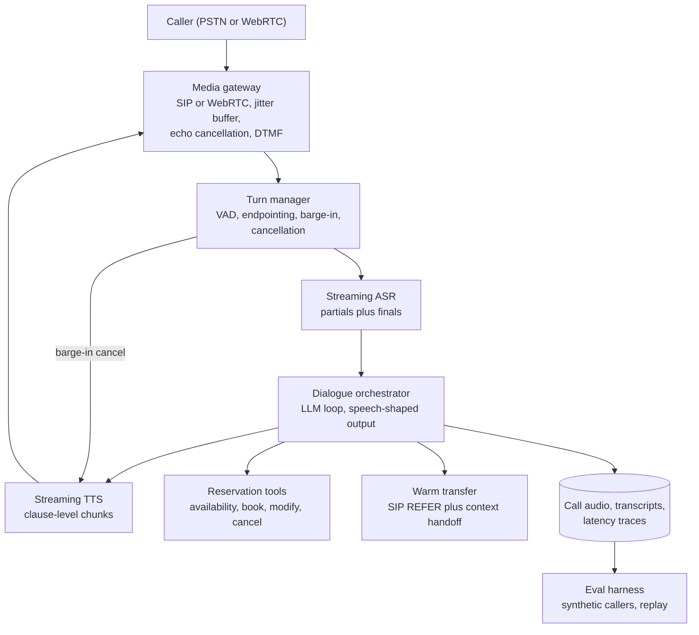
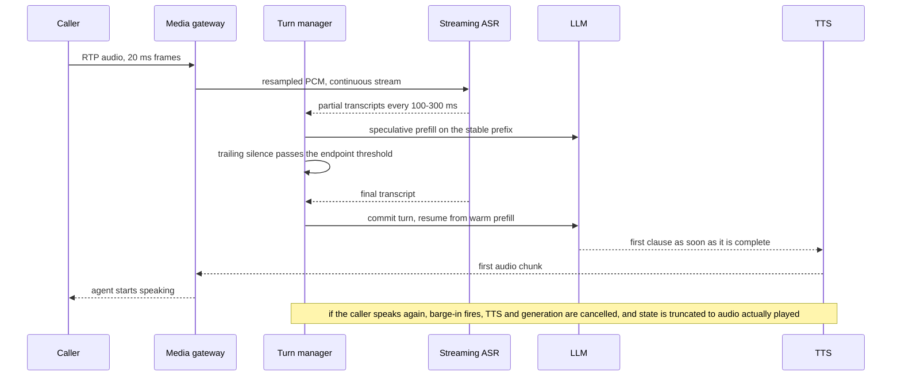
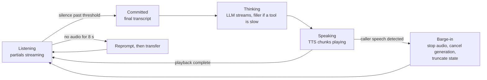

# Case Study 09: Real-Time Voice Agent (Phone Reservations and Helpline)

> "Design a voice agent for restaurant reservations end-to-end. It answers the phone, books, changes and cancels tables, answers the usual questions, and hands off to a human when it should."

## Problem statement

A restaurant group runs 400 locations plus one central reservations line. Roughly 60k inbound calls/day land on a phone tree that most callers hate, and about a third abandon during peak dinner-booking hours because nobody picks up. Build an agent that answers on the first ring over PSTN and over in-app WebRTC calls, handles the transactional intents (new booking, modify, cancel, confirm, hours and directions, allergen and parking questions), and transfers to a human with context when it should not proceed.

The business logic here is easy - it is a four-tool CRUD agent over an availability system. What makes this a different interview from the chat-agent one is that **latency is the product** and **the channel is hostile**: 8 kHz narrowband audio, background restaurant noise, accents, callers who interrupt, and no screen to render anything on. A chat agent may take five seconds to answer. A voice agent that takes five seconds has already lost the caller.

## Clarifying questions & assumptions

| Question | Assumption |
|---|---|
| Volume and concurrency? | 60k calls/day, average handle time ~3.2 min; peak ~900 concurrent calls at 18:00-20:00 local, against a 24-hour mean of ~130 (60k × 3.2 min ÷ 1,440 min), so ~7x the daily mean and ~3-4x the mean over opening hours |
| Channels? | ~85% PSTN via SIP trunks (G.711 mu-law, 8 kHz), ~15% WebRTC from the mobile app (Opus, 16-48 kHz) |
| Intent mix? | Booking 45%, modify or cancel 20%, confirm an existing booking 10%, information questions 20%, everything else 5% |
| What may the agent do autonomously? | Reads and confirmations freely; create, modify and cancel bookings within policy; never takes payment, never overrides a full service, never makes goodwill promises |
| Latency bar? | **p50 voice-to-voice under 800 ms, p95 under 1.5 s**, and no unexplained silence longer than 1.5 s at any point in the call |
| Languages? | English and Spanish at launch, per-language eval suites, no code-switching mid-call in v1 |
| Existing systems? | Reservation platform with an availability API, a contact centre with SIP-based transfer, call recording already in place with disclosure |
| Success metric? | **Containment rate** (resolved without a human) at equal-or-better booking accuracy and caller satisfaction, with abandonment as the headline business win |

Scoping statement worth making early: containment must be defined as "no transfer AND no callback within 24 hours AND the reservation record matches what the caller actually asked for." A voice agent can trivially fake containment by being hard to escape from, and callers punish that harder than chat users because hanging up is free.

## Requirements

### Functional
- Answer inbound PSTN and WebRTC calls, place outbound confirmation calls (v2), full-duplex audio with barge-in.
- Tools: `search_availability`, `create_booking`, `modify_booking`, `cancel_booking`, `lookup_booking`, `get_location_facts`.
- Caller identification from ANI (calling number) where available, with spoken confirmation of identity before touching an existing booking.
- DTMF (keypad) fallback for confirmation codes, party size and phone-number capture when speech recognition confidence is low.
- Warm transfer to a human with structured context, plus a hard fallback to the legacy phone tree if the agent stack is down.
- Full call artefacts: audio, aligned transcript, per-turn latency waterfall, every tool call, replayable.

### Non-functional
- **Scale**: ~900 concurrent calls at peak, which is ~900 call-minutes per minute and ~280 new calls arriving per minute (900 ÷ 3.2 min). Capacity is planned in *concurrent sessions*, not QPS - a ringing phone cannot be queued.
- **Latency**: p50 voice-to-voice < 800 ms, p95 < 1.5 s, barge-in stop-audio latency < 120 ms, no dead air > 1.5 s.
- **Audio quality**: works at 8 kHz mu-law with 1-2% packet loss and restaurant-level background noise (roughly 10-15 dB SNR).
- **Correctness**: booking-accuracy error rate < 0.5% on audited calls (right party size, right date, right time, right location, right name spelling).
- **Availability**: 99.95% on the call path. Degradation path is always a working phone call: agent down means calls route to the legacy tree or an overflow queue, never to silence.
- **Cost**: < $0.06 per call-minute all-in, measured per minute of call rather than per token.

## High-level architecture



The load-bearing box is the **turn manager**. Everything else is a streaming service you can buy; the turn manager is the part that decides when the caller has finished speaking, when to stop talking because they interrupted, and what the agent should believe it already said. Get that wrong and no amount of model quality saves the call.

### One turn, end to end



### Turn state machine



## Component deep-dives

### The latency budget is the design

Humans leave roughly 200 ms gaps between conversational turns. Sub-second voice-to-voice is the bar; 500-800 ms feels natural. Write the budget down in milliseconds before choosing a single vendor, because the budget picks the vendors.

| Stage | What it covers | p50 | p95 | Main lever |
|---|---|---|---|---|
| Inbound transit | 20 ms packetisation, jitter buffer, carrier hop | 60 ms | 100 ms | adaptive jitter buffer, region pinned to the carrier POP |
| VAD + endpointing | trailing silence before we declare the turn over | 200 ms | 350 ms | adaptive threshold per dialogue state, semantic endpointing |
| ASR finalisation | flushing partials into a stable final | 80 ms | 130 ms | accept the last stable partial, do not wait for the polite final |
| LLM time-to-first-token | first token of the reply | 200 ms | 420 ms | small fast model, cached prefix, speculative prefill, co-location |
| First clause assembled | enough text for a natural chunk | 40 ms | 70 ms | clause-level chunking, short opening sentence |
| TTS time-to-first-audio | synthesis start plus first codec frame | 120 ms | 210 ms | streaming TTS, pre-warmed session, small first chunk |
| Return transit | encode, jitter, carrier hop | 60 ms | 100 ms | same region pinning |
| **Voice to voice** | | **760 ms** | **1.38 s** | |

Three things fall out of this table that are worth saying out loud in the interview:

1. **Endpointing is the single largest line item and it is not an engineering constant, it is a product decision.** A 200 ms trailing-silence threshold interrupts anyone who pauses to think or reads a phone number in chunks. A 700 ms threshold makes the agent feel sluggish on every short answer. So make it stateful: tight (roughly 150-250 ms) when the expected answer is short and constrained ("how many people?"), loose (roughly 500-800 ms) when the caller is likely mid-list or reading digits, and let a lightweight semantic check on the partial transcript hold the turn open when the text is obviously incomplete ("my number is four one five").
2. **Everything streams or the budget is gone.** Waiting for a complete LLM response before starting TTS adds the entire generation time to the budget. Start synthesis on the first clause.
3. **The p95 is what callers remember.** A p50 of 760 ms with a p95 of 3 s is a bad product, because one stall per call is enough to break the illusion. Budget and alert on p95 per stage, not on an end-to-end average.

### Cascade or native speech-to-speech

| | Cascade: ASR -> LLM -> TTS | Native speech-to-speech |
|---|---|---|
| Voice-to-voice latency | budgeted above, ~800 ms with hard work | lower, typically a few hundred ms less end to end once network and telephony are included, and latency is the main selling point |
| Controllability | text in the middle, so deterministic policy checks, redaction and refusal handling are straightforward | harder, guardrails must act on audio or on model-emitted events |
| Observability and audit | free: the transcript *is* the log, and it is what compliance wants | you must transcribe your own model output to log it, and the transcript is a reconstruction |
| Tool calling | mature, same schemas and retry semantics as any text agent | supported by the major realtime APIs and improving quickly, but with fewer proven patterns for long or failing tool calls and fewer places to put a deterministic policy check between steps |
| Prosody and paralinguistics | lost at the ASR boundary, agent cannot hear frustration or hesitation | preserved, hears tone, can match energy, sounds markedly more human |
| Vendor risk | mix and match, swap any stage independently | one vendor owns the whole turn |
| Cost model | per audio-minute for ASR and per character for TTS, plus text tokens | per audio token in and out (effectively per second of audio), with the growing conversation context re-processed each turn unless cached, so not comparable line for line |
| Eval tooling | reuse text evals for the dialogue policy, add audio evals around it | evals must be audio-first end to end |

**Decision: cascade for v1.** This agent moves real state - a booking is a promise to a customer and a held table for the restaurant - so the auditable text boundary and deterministic policy layer are worth more than the latency and prosody gains. Say the reversal condition explicitly: if the eval suite shows the caller-experience metrics (abandonment, interruption rate, satisfaction) are bounded by *how the agent sounds* rather than *what it does*, then a hybrid becomes worth the complexity, with speech-to-speech on the open-ended segments and the cascade on transactional ones. The reason that hybrid is a v2 and not a v1 is not model quality, it is that two dialogue engines have to agree on state and share one voice identity mid-call.

### Turn taking

- **Barge-in with echo cancellation.** VAD runs continuously on the inbound line even while TTS plays. On PSTN the agent's own audio leaks back through the carrier and through the caller's speakerphone, so acoustic echo cancellation at the media gateway is a precondition, not a nicety - without it the agent interrupts itself. Require energy above the noise floor for a minimum duration (roughly 120-200 ms) before firing, so a cough or a "mm-hmm" backchannel does not stop the agent mid-sentence.

Endpointing tuned as a product decision, in code. Note that the threshold is a function of dialogue state and of the partial text, not a constant:

```python
def endpoint_threshold_ms(state: TurnState, partial: str) -> int:
    if state.expected == "digits":          # phone number, confirmation code
        return 800                          # people chunk digits, do not cut them off
    if state.expected in ("party_size", "yes_no"):
        return 180                          # short constrained answers, be snappy
    if ends_mid_utterance(partial):         # "my number is four one five"
        return 900                          # hold the turn open, they are not done
    return 400                              # open conversation default
```

- **Cancellation must be real.** On barge-in: stop playback immediately, flush the audio buffer at the gateway, cancel the in-flight TTS stream, and abort the LLM generation. A cancelled generation that keeps billing tokens is a cost bug; a cancelled TTS that keeps buffering is a *behaviour* bug, because the caller hears the agent talk over them.
- **Truncate state to what the caller actually heard.** This is the subtle one. The LLM generated "I can do 7:30 or 8:15 at the Mission location, and there is street parking on Valencia", but playback was cut after "I can do 7:30 or 8:15 at the Mis". The conversation state must record roughly what was played, not what was generated, or the agent will later reference parking the caller never heard. Practically: the TTS chunker keeps a byte-to-text mapping per chunk, the gateway reports how many milliseconds were actually rendered, and the orchestrator rewrites the assistant turn to the spoken prefix plus a marker that it was interrupted.

```python
def on_barge_in(turn: AssistantTurn, played_ms: int) -> str:
    tts.cancel(turn.stream_id)              # stop synthesising
    gateway.flush_playout()                 # drop buffered audio, not just future audio
    llm.cancel(turn.generation_id)          # stop paying for text nobody will hear
    spoken = turn.text_up_to(played_ms)     # chunk map: ms of audio -> text offset
    return spoken + " [interrupted by caller]"   # this, not turn.text, enters state
```

The marker matters as much as the truncation: without it the model sees a sentence that trails off and often just restarts the same thought, which is exactly the behaviour the caller interrupted to avoid.
- **Dead air is a failure state with its own timer.** If nothing has been sent to the caller for more than about 1.5 s and no generation is in flight, something has broken. Fire a filler, then a reprompt, then transfer.

### Latency masking

The budget above assumes no tool call. A real availability lookup adds 200-600 ms, and a slow one adds seconds. Two techniques buy that back:

- **Speculative processing on partial transcripts.** ASR partials arrive long before the endpoint fires. Start prefilling the LLM on the stable prefix of the partial and, for read-only tools, start prefetching: when the partial reads "table for four on Friday", fire `search_availability` speculatively while the caller is still finishing the sentence. Rules that keep this safe and cheap: speculate only on read-only tools, only when the partial prefix has been stable for a couple of revisions, cap it at one in-flight speculation per turn, and discard on revision. Prefill is cheap and prefetch results are cacheable for the turn, so the hit rate does not have to be high to pay for itself.
- **Fillers, from a small curated set, pre-rendered.** If a tool call is still outstanding after roughly 400 ms, play a short acknowledgement ("let me check that", "one moment"). Keep them pre-synthesised as cached audio so they cost zero TTS latency and always sound identical, rotate within a small set so a caller in a long call does not hear the same phrase five times, and never let a filler play more than once per turn. A filler is a promise that something is happening, so if the tool then fails, the agent must say so rather than resume as if nothing happened.

### Speech-shaped output

The dialogue policy changes, not just the formatting. Constraints enforced in the system prompt *and* checked in a deterministic post-processor before text reaches TTS:

- No bullet lists, no tables, no markdown, no URLs, no email addresses read aloud. If the caller needs a link or an address, offer to send it by SMS - that single affordance removes the worst class of unspeakable output.
- Cap replies at roughly two sentences and 40 words. Long turns are unlistenable and they are also expensive, because they raise both TTS cost and the chance of a barge-in that wastes the whole generation.
- **Narrow first, then offer two.** Reading six available times aloud is unusable - callers retain the first and last. The strategy is to constrain, then present at most two options: "Friday at 7 is full. I have 6:30 or 8:15, which works better?" This is a dialogue-design change, not a prompt tweak, and it is the thing most chat-to-voice ports get wrong.
- **Confirmation strategy for anything alphanumeric.** Names, confirmation codes and phone numbers are where ASR fails hardest. Read back with phonetic disambiguation for spellings ("S as in Sierra"), group digits in threes and fours, and confirm the whole booking once at the end rather than after each field. Where confidence is low or the line is noisy, switch to DTMF: "tap your six-digit code on the keypad."
- Numbers, dates and times get normalised into spoken form before synthesis ("7:30 PM" becomes "seven thirty this evening"), and a per-brand pronunciation lexicon handles restaurant and dish names so the agent does not mangle the brand on every call.

The prompt asks for these constraints; the post-processor enforces them, because a prompt-only rule fails a few times per thousand turns and each failure is a caller listening to a URL being spelled out:

```python
def speech_safe(text: str) -> str:
    text = URL_RE.sub("a link I can text you", text)
    text = EMAIL_RE.sub("an address I can text you", text)
    text = strip_markdown(text)              # bullets, bold, headings, tables
    text = spoken_form(text)                 # 7:30 PM -> seven thirty, 4 -> four
    text = lexicon.apply(text)               # brand and dish pronunciations
    if word_count(text) > 45:                # hard cap, then regenerate shorter
        raise TooLongForSpeech(text)
    return text
```

`TooLongForSpeech` is worth a beat in the interview: the recovery is not to truncate mid-sentence, it is to regenerate with a tighter instruction while a filler covers the extra latency. Truncating speech output produces a sentence that stops in the middle, which sounds like a dropped call.

### Dialogue orchestrator and booking safety

The agent loop itself is unremarkable and should be, but three constraints are voice-specific:

- **Turn budget, not just step budget.** Cap tool calls per caller turn at two or three, hard. A chat agent can afford an eight-step reasoning loop; on the phone every extra step is audible silence. If the agent needs more than that, it should say something and then continue, not think in silence.
- **Bookings commit once and are idempotent.** Calls drop mid-turn, callers redial, and speculative prefetching means a `search_availability` may have already run twice. Every write carries an idempotency key derived from the call ID and the booking intent, so a redial or a retried request cannot produce two tables held for the same party. A reconciliation job sweeps holds that were never confirmed.
- **Identity before mutation.** ANI (the calling number) is a *hint*, not authentication - it is spoofable and phones are shared. Reading back an existing booking to whoever called the restaurant is low risk; modifying or cancelling it requires confirming a second factor the caller states (name on the booking, or date and party size). Anything beyond that, or any mismatch, goes to a human. State this explicitly, because it is the one place this agent can cause real harm: cancelling a stranger's anniversary dinner.

```python
def may_mutate(booking, caller) -> Decision:
    if booking.phone != caller.ani:
        return RequireSecondFactor("name on the booking")
    if caller.confirmed_fields < 2:                  # ANI alone is not enough
        return RequireSecondFactor("date and party size")
    if booking.party_size > LARGE_PARTY or booking.is_private_event:
        return Transfer("large party, human handles changes")
    return Allow()
```

### Telephony realities

- **8 kHz narrowband is the default case, not the edge case.** G.711 mu-law over PSTN throws away everything above 4 kHz, which is exactly where the fricatives that distinguish "s" from "f" live. Run ASR models tuned for telephony, and hold two configurations: narrowband for SIP and wideband for the WebRTC app path. Every eval set must include real 8 kHz audio, because WER measured on studio-quality 16 kHz audio is a fiction that will not survive launch.
- **DTMF is a first-class input.** Accept RFC 4733 telephone-events (the successor to RFC 2833, which many SIP stacks still name it after) and in-band tones throughout, not just in an escape menu. It is the reliable channel when the caller is in a car, a bar, or a language the ASR handles poorly, and it is mandatory if card capture is ever added, with recording paused during entry.
- **Warm transfer carries context.** Trigger on caller request (always honoured, first ask, no retention loop), policy escalation (large parties, disputes, anything about an allergy incident), repeated ASR failure (two failed confirmations of the same field), and loop detection. Transfer via SIP REFER, with a structured summary pushed to the agent desktop before the call lands: caller identity, intent, what was already collected, what failed, and the transcript. Post-transfer handle time is the metric that proves the handoff was warm rather than nominal.
- **Failure modes unique to voice.** One-way audio from NAT or SIP misconfiguration is the classic: the call connects, neither side hears anything, and every application-level health check reports green. Detect it with an inbound-RTP watchdog per call - zero inbound packets or pure silence for several seconds means tear down and reroute, not wait. Similarly, callers who say nothing (pocket dials, hold music from another IVR) get two reprompts and a polite disconnect.

## Data & context strategy

- **ASR biasing is the highest-leverage data work here.** Per-location phrase lists (restaurant names, neighbourhood names, signature dishes) and caller-specific hints from the ANI lookup (their name, their upcoming booking's date) get injected as a biasing list when the stream opens. Entity accuracy improves far more from this than from swapping ASR vendors.
- **Entity WER beats overall WER as a target.** Getting "the" wrong costs nothing. Getting "Thursday" versus "Tuesday" wrong costs a table. Track WER separately for names, dates, times, party sizes and digits, and gate releases on those.
- **Live state comes from tools, never from an index.** Availability changes minute to minute. Location facts (hours, parking, allergen policies) are small and slow-moving, so they are retrieved and pinned into the cached prefix per location.
- Per-turn context budget: system prompt and persona plus location facts ~1.2k tokens as a **cached prefix** (identical across every call at that location, so it caches extremely well), caller profile ~150 tokens, running transcript ~400-900 tokens. Roughly 1.8-2.3k input tokens per turn, of which most is cached.
- **The flywheel**: consented recordings feed a weekly human-correction queue. Corrected transcripts become both ASR adaptation data and new WER-conditioned eval cases. Calls that ended in transfer are the highest-value sample to review.
- Retention and consent: disclosure at call start, retention windows configured per jurisdiction, and PII redaction on transcripts at rest (phone numbers, card fragments if any ever appear) with the audio held on a shorter clock than the text.

## Evaluation plan

The hard part is that you must evaluate the **composed** system at the audio level. A perfect dialogue policy over perfect transcripts tells you almost nothing about how the agent behaves when ASR hears "for" instead of "four".

**Component level**
- ASR: WER and entity-WER on held-out telephony audio, sliced by accent, background-noise level, codec (8 kHz vs wideband) and speaking rate. Slices matter more than the headline number.
- TTS: MOS from a small human panel on a fixed script set, plus an automated intelligibility proxy (synthesise the script, transcribe with an independent ASR, measure WER against the source text) that can run on every release, plus pronunciation spot checks against the brand lexicon.
- Endpointing: cut-off rate (turns where the caller was still speaking) and mean added latency, measured on labelled real calls. These two trade against each other directly and the tuning target should be stated as a ratio, not a threshold.

**Composed system, audio in and audio out**
- **Synthetic caller simulation.** An LLM persona drives a TTS voice against the real stack over a real media path, with a voice bank spanning accents, ages and speaking rates, mixed with background noise at fixed SNRs and pushed through a codec and packet-loss simulator. Personas include the cooperative caller, the caller who changes their mind twice, the caller who talks over the agent, the caller who mumbles, and the caller in a moving car. Score task success against a mock reservation API, plus turns-to-completion.
- **WER-conditioned test cases.** Replay real dialogues with realistic ASR errors injected from the observed confusion matrix, not random noise, and assert the dialogue policy recovers: does it re-ask, does it confirm, or does it silently book the wrong day? This is the suite that catches agents which look great in text and fail on the phone.
- **Interruption suite.** Scripted barge-ins at three points (during the first clause, mid-sentence, at the very end) plus false barge-ins (background TV, cough, backchannel "uh huh"). Metrics: stop-audio latency, false-barge-in rate, and state-truncation correctness, asserted by checking the agent never later references content that was cut off.
- **Dead-air suite.** Inject tool latency, provider errors and a silent caller. Assert the longest unexplained silence stays under the bar and that a filler is always followed by a real outcome.

**Online**
- Containment rate on the honest definition, reported alongside transfer rate and 24-hour callback rate so it cannot be gamed:

```python
contained = (
    call.ended_without_transfer
    and not caller.called_back(within_hours=24)
    and booking_matches_request(call)          # audited on a sample, not asserted
    and call.duration_s > 15                   # a hang-up is not a resolution
)
containment_rate = contained_calls / total_calls    # report per intent
```

The `duration_s` clause exists because early hang-ups otherwise count as containment, which makes a hated agent look like a successful one.
- Voice-to-voice p50 and p95 broken down by stage, per region and per carrier - a carrier route change shows up here before anywhere else.
- Booking accuracy from a sampled audit: reservation record versus the recording. Start at 100% audit, sample down as the error rate holds.
- Caller-experience signals: hang-up within the first 10 seconds (the "I want a human" tell), barge-in rate, repeat-request rate ("sorry, what?" from either side), and post-call SMS satisfaction.
- **Autonomy ratchets by intent**, same discipline as any action-taking agent: information-only first, then confirming and cancelling existing bookings, then modifications, then new bookings at peak times. Each step promotes on audited accuracy, not on a demo.

## Cost estimate

Voice is priced per minute of call, not per token, and per-minute thinking changes which optimisations matter. Assumed ~prices, illustrative:

| Component | Assumption | ~Cost per call-minute |
|---|---|---|
| Telephony | inbound DID plus SIP trunk at ~$0.008/min | ~$0.008 |
| Streaming ASR | continuous for the whole call at ~$0.011/min | ~$0.011 |
| LLM turns | ~4 turns/min, ~2k input of which ~70% is cached prefix at ~10% price, ~70 output tokens, fast mid-tier model at ~$1/M in and ~$5/M out | ~$0.005 |
| TTS | agent speaks ~40% of the call, ~350 characters/min at ~$30/M characters | ~$0.011 |
| Media and orchestration compute | one pinned session per call, echo cancellation and VAD are CPU-bound | ~$0.004 |
| Recording, storage, traces | audio plus transcripts plus latency traces | ~$0.001 |
| **Total** | | **~$0.040/min** |
| **Per call** | 3.2 min average | **~$0.13** |

Compare against a human: at roughly $28/hour fully loaded, a 3.2-minute call plus one minute of wrap-up is about **$1.95**, so roughly 15x. Note where the money actually is: ASR and TTS together are more than half the bill, and both bill on *wall-clock audio*, so the biggest cost lever is not token efficiency, it is **talking less and ending calls sooner**. Shortening the agent's turns from three sentences to two cuts TTS spend and improves the product at the same time, which is a rare alignment worth pointing out.

Two further notes for the interview. First, ASR runs continuously for the whole call while the LLM only runs on turns, which is why per-minute and per-token accounting give completely different pictures of the same system. Second, a native speech-to-speech model bills audio tokens in *and* out, which track seconds of audio rather than words, and each turn typically re-processes the accumulated conversation, so per-minute cost rises as the call gets longer unless the provider caches that context. Its price sheet is not comparable line by line with the cascade - convert both to cost per call-minute at current list prices, on your real call-length distribution, before letting cost decide the architecture.

## Failure modes & mitigations

| Failure | Impact | Mitigation |
|---|---|---|
| Endpointing fires too early | Agent talks over a caller mid-sentence, caller repeats themselves, call time doubles | State-dependent thresholds, semantic hold on incomplete partials, cut-off rate tracked as a release gate |
| Endpointing fires too late | Agent feels slow and dead, callers repeat or hang up | Same knob from the other side, tuned as an explicit ratio against cut-off rate |
| Echo, agent hears itself | Self-interruption loops, garbage transcripts | Acoustic echo cancellation at the gateway, minimum-duration energy gate before barge-in fires |
| False barge-in from background noise | Agent stops mid-sentence for a passing siren | Noise-floor-adaptive VAD, minimum speech duration, false-barge-in rate in the interruption suite |
| ASR mangles a name, date or digit string | Wrong booking, angry caller at the door | Entity-level biasing, phonetic readback, end-of-call whole-booking confirmation, DTMF fallback, entity-WER gates |
| Dead air after a slow or failed tool call | Caller assumes the line dropped and hangs up | 400 ms filler timer with pre-rendered audio, 1.5 s dead-air alarm, explicit failure message, transfer path |
| One-way audio (SIP or NAT fault) | Call connects, nobody hears anything, health checks stay green | Per-call inbound-RTP watchdog, tear down and reroute on silence, alert on rate |
| Barge-in without state truncation | Agent references things the caller never heard | Playback-position reporting from the gateway, assistant turn rewritten to the spoken prefix |
| Call drops mid-booking | Half-created reservation, or a double booking on redial | Idempotency key per booking intent, bookings committed in one call to the reservation API, reconciliation job on orphaned holds |
| Provider outage (ASR, TTS or LLM) | Whole call path down | Per-stage fallback vendor behind the gateway, pre-warmed and eval-verified, and a final fallback to the legacy phone tree - a working phone tree beats a broken agent |
| Latency spike from a model deploy | p95 blows the bar, calls feel broken | Per-stage latency SLOs with automatic rollback, canary on a small carrier route first |
| Caller wants a human and cannot get one | Reputational damage, worse than not launching | Transfer honoured on the first ask, plus keypad zero-out at any point, both tested every release |
| Silent or pocket-dial calls | Wasted concurrency at peak | Two reprompts then a polite disconnect, silent-call rate monitored |

## Scaling & ops

- **Capacity is measured in concurrent calls.** Each call pins a media session with continuous VAD, echo cancellation and an open ASR stream, so a node's limit is set by CPU and socket count, not request rate. Autoscale on concurrent sessions with real headroom (target ~60% utilisation at peak) because you cannot queue a ringing phone. Pre-warm capacity on the known dinner-booking curve rather than reacting to it.
- **Deploys must drain, never cut.** New calls route to the new version; existing calls finish on the old one. A rolling restart that kills in-flight calls is a customer-visible outage even if every dashboard stays green.
- **Region pinning.** Put the media path near the carrier POP and the ASR, LLM and TTS in the same region as the media path. Two extra cross-region hops per turn is 100 ms of the budget, which is more than the entire clause-assembly line item.
- **Observability is a per-call latency waterfall.** Every call trace carries per-stage timings, VAD events, barge-in events, tool timings and the full transcript, so a "the agent felt slow" complaint resolves to a specific stage. Dashboards: p50 and p95 voice-to-voice per stage, barge-in and false-barge-in rates, dead-air incidents per call, transfer rate by trigger, entity-WER proxies, cost per call-minute.
- **Ops runbook staples**: one-switch fallback to the legacy phone tree, per-stage vendor failover drill, prompt and dialogue-policy rollback in minutes (versioned config, not a code deploy), weekly review of transferred and abandoned calls feeding the eval sets, and a carrier-side test call from each major route on a schedule.
- **Expansion path**: information intents, then cancellations and confirmations, then modifications, then new bookings, then outbound confirmation calls, then Spanish with its own eval suite, then a hybrid speech-to-speech lane only if caller-experience metrics say prosody is the binding constraint.

## Likely interviewer follow-ups

- *"You have a 300 ms latency-reduction budget. Where do you spend it?"* (Endpointing first, because it is the largest line and the cheapest to change - state-dependent thresholds plus a semantic hold. Then LLM TTFT via a smaller turn-level model and prefix caching. Then co-location to kill cross-region hops. Model swaps are the last resort because they cost quality; the first two cost only tuning.)
- *"How do you regression-test barge-in?"* (Scripted audio fixtures that inject caller speech at fixed offsets into the agent's playback, run against the real media path. Assert stop-audio latency, that generation was actually cancelled, and that the recorded assistant turn equals the spoken prefix. Plus a false-barge-in set of coughs, backchannels and TV noise. It is a fixture suite, not a manual test, or it will silently rot.)
- *"The agent booked Tuesday when the caller said Thursday. Walk me through the fix."* (Confirm the failure is ASR, not policy, by checking the transcript against the audio. If ASR: entity biasing on weekday terms, and force phonetic or numeric readback for dates. If policy: the model accepted a low-confidence entity without confirmation, so gate irreversible fields on a confidence threshold with mandatory readback. Then add the case to the WER-conditioned suite so it stays fixed.)
- *"Why not native speech-to-speech, given it is faster?"* (Text in the middle buys deterministic policy checks, a transcript that satisfies audit, mature tool calling, and vendor independence per stage - all of which matter more than a few hundred ms when the agent creates real bookings. I would revisit when caller-experience metrics show prosody is the bottleneck, and I would hybridise rather than switch wholesale.)
- *"Peak is 900 concurrent calls and you are at capacity. What happens?"* (No queue for a ringing phone, so the choice is made in advance: overflow routes to the legacy tree or a callback offer, and the agent sheds the lowest-value intent first. Never let calls degrade into long silence, which is what an over-subscribed media node produces.)
- *"What is different about the Spanish launch beyond a translated prompt?"* (A separate ASR model and biasing lists, a separate voice and pronunciation lexicon, different endpointing tuning because speaking rate and pause patterns differ, spoken-form normalisation for numbers and dates, and a full parallel eval suite with native-speaker synthetic callers. Quality is never uniform across languages, so the launch gate is per language.)
- *"How would you cut cost per call-minute by half?"* (Shorten agent turns, which cuts TTS characters and call duration together. Then end calls faster with better dialogue design. Then consider self-hosting ASR at this volume, since it bills continuously and is the largest line. Token-level optimisation is last, because tokens are already the smallest line item.)
- *"A growing share of your callers are other AI agents, or synthetic voices. What changes?"* (Consumer assistants now place calls on a user's behalf, and cloned voices are cheap, so treat voice as carrying no identity at all: the second-factor rule for mutations already assumes this, and voice biometrics stay off the table. Add per-ANI and per-name booking limits so an automated caller cannot hoard prime tables, watch for machine-speed turn patterns, and keep disclosing at call start that the agent is automated. The better long-term answer is to give agent callers a structured channel, a booking API or tool endpoint with the same policy layer behind it, so they never need to speak to a voice agent at all.)
