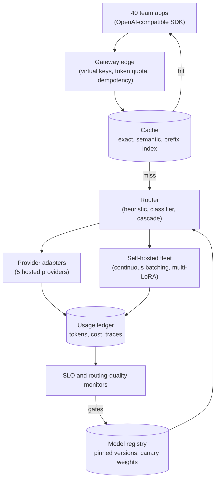
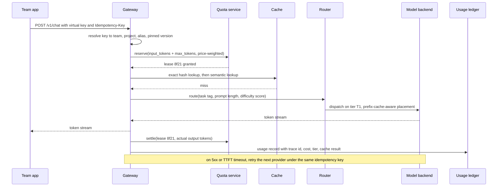
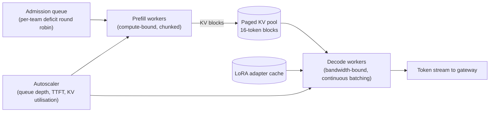

# Case Study 10: LLM Gateway & Serving Platform

> "Design an LLM gateway for a company with 40 teams calling 5 model providers. You also run your own open-weight fleet, so the same platform has to serve inference, not just proxy it."

## Problem statement

Forty product and internal teams each discovered LLMs independently. Today that means five sets of provider credentials in five secret stores, no idea which team spent what, no shared cache, no failover, and a model upgrade that breaks three teams because nobody pinned a version. Build the platform layer: a **control plane** (one OpenAI-compatible endpoint with auth, quota, routing, caching, failover, attribution, and a model registry) and a **data plane** (a self-hosted GPU fleet serving open-weight base models plus hundreds of team fine-tunes).

Two things make this interesting and neither is the proxy code. First, the unit of cost and capacity is the **token**, not the request, and you do not know how many output tokens a request will consume until it finishes. Second, once you own the serving fleet you own KV-cache memory, batching, and multi-tenant fairness, which is where the real engineering is.

This case also covers the "roll out a new model to 5% of traffic safely" prompt: on this platform that is a registry entry and a canary weight, not a bespoke project.

## Clarifying questions & assumptions

| Question | Assumption |
|---|---|
| Traffic shape? | ~6M requests/day across 40 teams, avg ~2,300 input / ~300 output tokens; ~70 rps average, ~280 rps at peak; heavily skewed, top 3 teams are ~60% of spend |
| Who are the tenants? | Internal teams only (no external customers), but treat them as untrusted tenants anyway: a bad deploy by one team must not degrade the other 39 |
| Which providers? | 5 hosted providers behind one adapter interface, plus a self-hosted fleet of ~24 H100-class GPUs |
| Why self-host at all? | Fine-tunes (hundreds of LoRA adapters), data-residency workloads that may not leave our VPC, and a predictable latency floor. Not primarily price at this volume |
| Can the gateway change a team's model? | Yes by default (routing is the point), with a per-route opt-out. Any team may pin an exact model version |
| Latency budget for the gateway itself? | p50 < 8ms, p99 < 25ms of added latency excluding model time. The gateway is on the critical path of every LLM call in the company |
| Is streaming required? | Yes, most traffic is streamed. This constrains caching, quota settlement, and retries |
| What is success? | Blended cost per task down materially at flat quality, plus availability higher than any single provider, plus a bill every team can reconcile |

Scoping statement worth making early: **a gateway that only proxies is a liability**, because it adds a hop and a failure domain and returns nothing. It earns its place through routing, caching, failover, and attribution. Say what the platform gives back before you draw a single box.

## Requirements

### Functional
- One OpenAI-compatible surface (`/v1/chat/completions`, `/v1/embeddings`, and `/v1/responses` for teams on the newer Responses-style API, streaming and non-streaming) so teams migrate by changing a base URL.
- Per-team virtual API keys scoped to a project, an environment, an allowed model set, and a budget. Keys mint and revoke without touching provider credentials.
- Token-denominated rate limits and quotas, enforced before the call and settled after it.
- Routing: heuristic, learned classifier, and cascade-with-verifier tiers, per route, with an opt-out.
- Caching: exact-match, semantic (opt-in), and shared-prefix prompt caching against both providers and the self-hosted fleet.
- Failover across providers, bounded retries, hedged requests, and idempotent write semantics.
- Model registry with pinned versions, aliases, canary and shadow traffic weights, and one-click rollback.
- Usage ledger: every call attributed to team, project, route, tier, and cost, reconcilable against provider invoices.
- Self-hosted serving: continuous batching, paged KV cache, multi-LoRA, scale-to-zero for the long tail.

### Non-functional
- **Scale**: 6M requests/day, ~11B input and ~1.5B output tokens/day reaching models after caching; peak 280 rps; a single team may burst to 40% of platform capacity without starving anyone.
- **Availability**: 99.95% for the gateway. The platform must be *more* available than any provider it fronts, which is only true if failover is real and tested.
- **Latency**: gateway overhead p99 < 25ms. On the fleet: p95 TTFT < 700ms for interactive routes at 4k prompt, p95 inter-token latency < 40ms.
- **Isolation**: no team can push another team's TTFT past SLO through prompt size, concurrency, or a runaway loop.
- **Accuracy of accounting**: ledger within 0.5% of the provider invoice each month, per provider.
- **Safety of change**: no model version reaches 100% of a route without passing the routing-quality suite and a canary.

## High-level architecture



The load-bearing pieces are the **registry** and the **ledger**. The registry means no team ever names a raw provider model string, which is what makes upgrades, canaries, and rollbacks a config change. The ledger means every decision the router makes is measurable in dollars after the fact, which is what makes routing arguments end in data rather than opinion.

A single request, end to end:



## Control plane deep-dives

### Virtual keys and per-team identity

- A virtual key resolves to a **principal**: `(team, project, environment, allowed_aliases, budget, default_route)`. Provider credentials live in one place, held by the gateway, and rotate without a single team redeploying. That alone justifies the platform to a security reviewer.
- Keys are short-lived where possible (SDK exchanges a workload identity for a 1-hour token), long-lived only for legacy callers, and every key is revocable in seconds with a deny-list checked on the hot path from local cache.
- The principal, not the caller, decides which models are reachable. A team asking for a model outside its allowlist gets a typed 403 naming the alias it should use, not a silent downgrade. Silent substitution is the fastest way to lose a platform's credibility.
- Every request carries a trace id propagated to the provider where supported, and the response carries it back, so a team debugging a bad answer and the platform team looking at the ledger are looking at the same row.

### Token-based rate limiting and quota

Request-per-minute limits are the wrong primitive here, and being able to say why is most of the value in this section.

- Cost is billed per token by every provider. One request can be 200 tokens or 200,000. Two teams at the same RPM can differ by three orders of magnitude in spend.
- Capacity is consumed per token too. Prefill work scales with input tokens (plus a quadratic attention term at long context), and decode work scales with output tokens because each one is a full forward pass. On the self-hosted fleet the scarce resources are GPU-seconds and KV-cache blocks, both of which track tokens, not requests.
- Output tokens typically cost several times input tokens, so the limiter has to weight them differently rather than counting "tokens" as one pool.

So the platform enforces three limits per principal: **weighted tokens per minute** (the budget dimension), **concurrent requests** (the tail-latency dimension, since concurrency drives queueing), and **dollars per day** (the finance dimension, with a soft warn and a hard stop).

The awkward part is that output length is unknown at admission. The answer is a two-phase reserve and settle:

```python
def admit(req, principal):
    price = registry.price(req.resolved_model)          # $/M in, $/M out
    w_in, w_out = price.input, price.output
    # max_tokens is required by policy: unbounded requests get the route default
    reserve = w_in * count_tokens(req) + w_out * req.max_tokens
    lease = quota.reserve(principal, reserve, ttl=req.timeout + 60)
    if lease is None:
        raise TooManyRequests(retry_after=quota.next_refill(principal))
    return lease

def settle(lease, usage):
    actual = w_in * usage.input_tokens + w_out * usage.output_tokens
    quota.settle(lease, actual)      # releases reserve - actual back to the bucket
```

Details that matter in the follow-up questions:

- **`max_tokens` is mandatory** at the platform boundary. If a caller omits it, the route default applies. Without a declared ceiling the reservation is unbounded and the limiter is decorative.
- **Streaming settles incrementally.** A long generation holds its full reservation for the whole call otherwise. Settling every 256 tokens returns unused headroom early and keeps utilisation high.
- **Leases have a TTL.** A gateway pod that dies mid-request must not leak reserved quota forever. Expired leases settle at their last observed usage.
- **Client disconnects still settle.** Provider billing does not stop because the caller hung up, so neither does ours, and the abort is propagated to the backend to actually stop generation.
- **Distributed enforcement without a hot-path round trip.** The bucket lives in Redis, but each gateway pod leases a slice of it (say 1/N of the refill, rebalanced every few seconds) and enforces locally. Exactness is traded for latency deliberately: a limiter that costs 3ms on every call is a limiter the platform team will be asked to remove.
- **Overage behaviour is a product decision, stated explicitly**: soft limits queue with a `Retry-After`, hard limits reject with a typed error, and the daily dollar stop pages the owning team rather than silently degrading a production feature.

### Routing tiers

Routing is where the platform pays for itself, and the only defensible way to present it is with the measured quality delta per tier, not with adjectives.

| Tier | Mechanism | Share of calls | Added latency | Relative cost per 1k calls | Quality delta vs frontier-always |
|---|---|---|---|---|---|
| T0 cache | Exact hash, then semantic lookup | 18% of requests | ~6ms | ~0 | 0 by construction on exact, small negative on semantic |
| T1 heuristic | Task tag + prompt length + regex signals pick a small model | 35% | ~0 | 1x | -0.4 pts on suite average, concentrated in two task tags |
| T2 classifier | Small difficulty classifier scores the prompt, picks small / mid / frontier | 25% | ~25ms | ~4x | -1.1 pts, no tag worse than -3 |
| T3 cascade | Small model answers, a verifier scores it, escalate on low score | 12% | ~+180ms on escalation | ~2.5x blended | -0.3 pts at ~22% escalation rate |
| T4 direct | Pinned frontier, no routing, for opted-out routes | 10% | 0 | ~14x | 0 by definition |

Read the table as the *shape* of the answer. The numbers come from the platform's own regression suite against its own traffic, and they are the artefact you rebuild every time a model version changes, because the deltas move.

Design notes per tier:

- **Heuristic first.** Most routing wins are embarrassingly simple: embeddings and classification go to a small model, summarisation of short documents goes to a small model, anything with tool schemas and multi-step reasoning goes up a tier. Ship this, measure it, and only then argue for a learned router.
- **The classifier** is a small encoder trained on labelled traffic where the label is "did the small model's answer match the frontier answer under the task's grader". It predicts escalation need, not quality. Keep it under 30ms or it eats its own savings on short requests.
- **The cascade** is the highest-quality-per-dollar tier but the riskiest for latency, because an escalation pays for both calls. Gate it to routes whose SLO tolerates the tail, and cap escalation rate: if the verifier escalates more than ~35% of the time the cascade is losing money and should collapse to direct frontier.
- **The verifier must be cheaper than the escalation it prevents.** A frontier-model judge on every small-model answer is not a cascade, it is frontier-always with extra steps. Use a small fine-tuned scorer or a task-specific check (does the JSON validate, does the SQL parse and run, does the citation exist).
- **Opt-out is a feature, not a defeat.** A team that has evaluated its route and pinned a model is behaving correctly. Charge routing savings back to teams that accept routing, and the opt-out rate takes care of itself.

### Failover, retries, hedging, and idempotency

- **Health-aware provider selection.** Each provider adapter reports rolling error rate, p95 TTFT, and 429 rate. A provider that trips its circuit breaker is removed from the eligible set for the route and probed with a trickle of traffic until it recovers. Do not fail over on a 400: a schema error will fail identically everywhere and you will just triple the bill.
- **Retry policy is narrow on purpose.** Retry 429, 5xx, and connection resets. Exponential backoff with full jitter, at most 2 retries, and a global retry budget (retries capped at ~10% of traffic) so a provider brownout does not turn into a self-inflicted DDoS. The retry budget is the single control that stops a partial outage becoming a total one.
- **Failover changes the model, so failover changes quality.** The fallback for each alias is declared in the registry and has run through the routing suite. An undeclared fallback is a silent quality regression. Responses carry the model actually used so teams can attribute their own weirdness.
- **Hedged requests** for latency-sensitive routes: if no first token has arrived by the route's p95 TTFT, fire a second request to the next provider and take whichever streams first, cancelling the loser. Cap hedging at a few percent of traffic, never hedge non-idempotent tool-calling turns, and remember you pay for both legs' prefill. It trades money for tail latency, so enable it per route with that trade stated.
- **Idempotency.** Clients send an `Idempotency-Key`. The gateway stores `key -> (request fingerprint, response, usage)` for 24 hours. A retry with the same key returns the stored response and does not re-bill. A reused key with a different fingerprint is rejected (422 in the IETF Idempotency-Key draft, with 409 reserved for a duplicate arriving while the original is still in flight), which catches a real class of client bug. Retries and hedges of one logical call share the key, so the ledger records one billable unit even when two legs ran, with the wasted leg tagged as hedge cost.
- Streaming complicates all of this: once bytes have gone to the client you cannot transparently retry. Retries are only free before first token. After it, the gateway surfaces a typed terminal error mid-stream and the SDK decides. "Just retry" is the wrong answer for streaming.

### Caching

Three distinct caches, often conflated in interviews:

1. **Exact-match cache.** Key is a hash of `(resolved model version, all params, full message list, tools)`. Scoped per team by default. This is nearly free, safe, and gets meaningful hit rates on eval loops, retries, batch jobs, and identical health-check style prompts. Bypass it when `temperature > 0` unless the route opts in, and never serve a cached response past its TTL when the prompt embeds live data.
2. **Semantic cache.** Embed a normalised form of the request, ANN lookup, serve when cosine similarity exceeds a per-route threshold. **Opt-in per route**, because "similar prompt" and "same correct answer" are not the same claim: "refund order 4471" and "refund order 4472" are neighbours in embedding space and opposite in meaning. Rules that keep it safe: scope keys per team and per model version (cross-team hits are a data-leak path), never cache requests carrying tool results or user-specific context, keep TTLs short, and sample hits into the eval set continuously. Report its quality delta alongside its savings or you are hiding half the trade.
3. **Shared-prefix prompt caching.** The highest-value and least-discussed one. Long system prompts, tool schemas, and few-shot blocks repeat on every call of a route. On providers: honour their prompt-cache markers, structure the message list so the shared prefix is byte-identical and comes first, pin a route to the same provider account and region so their cache stays warm, and pass the provider's cache-routing key where one exists. On the fleet: prefix-aware routing, hashing the longest shared prefix and sending matching requests to the replica whose KV blocks already hold it, so prefill skips the work entirely.

The gateway is the right place for all three because it is the only component that sees every team's traffic, and prefix caching in particular only works if something is deliberately co-locating requests.

### Cost attribution and chargeback

- Every call writes one usage record: `(ts, team, project, env, alias, resolved_model_version, tier, cached, input_tokens, cached_input_tokens, output_tokens, cost_usd, latency, trace_id)`. Columnar store, partitioned by day and team.
- **Cost is computed at write time from the registry price sheet**, and the price sheet is versioned. Recomputing history when a provider changes prices is how ledgers stop reconciling.
- Monthly reconciliation against each provider invoice, per provider, with an alert if the gap exceeds 0.5%. Common causes of a gap: hedged legs not recorded, failed calls that still billed prefill, and streamed calls the client aborted.
- Chargeback needs a **showback period first**. Publish per-team dashboards for a quarter before anyone's budget is actually debited, because the first month of real numbers always surfaces one team accidentally sending 100k-token prompts in a retry loop, and you want that found in a dashboard, not an invoice dispute.
- Attribute the platform's own savings back to teams: each record carries a counterfactual cost (what T4 frontier-always would have cost). Reporting "your team spent $4,100 and routing saved you $12,800" is how you keep teams opted in.

### Model registry, pinning, and safe rollout

Teams call aliases: `summarise-fast`, `support-agent-v3`. An alias resolves to a registry entry:

```yaml
alias: support-agent-v3
route_class: interactive
default:
  model: provider-b/model-x@2026-04-11     # pinned version, never a floating tag
  params: {temperature: 0.2, max_tokens: 800}
  prompt_prefix_id: sp_9c2a                # stable for prompt caching
fallbacks:
  - provider-d/model-y@2026-02-02          # eval-verified, quality delta on record
canary:
  candidate: provider-b/model-x@2026-08-01
  weight: 0.05
  sticky_key: session_id
  guards: [error_rate, p95_ttft, output_tokens_per_response, refusal_rate, judge_score]
  auto_rollback: true
shadow:
  candidate: self-hosted/base-8b-lora@team-support-r16
  sample: 0.10
```

Rollout path for any model change, which is exactly the "5% of traffic safely" prompt:

1. **Offline gate.** Candidate runs the routing-quality suite for every route that would touch it. No task tag may regress beyond its threshold. This blocks most bad candidates for free.
2. **Shadow.** Mirror 5-10% of live requests to the candidate, discard the responses, compare offline. Shadow is paired by construction (same input, both models), which makes it far more statistically efficient than a canary and costs only tokens, never a user-visible error. Do not shadow anything with side effects: a shadowed tool-calling turn must run against a stubbed tool layer or not at all.
3. **Canary at 1%, then 5%, 25%, 100%,** with a soak at each step. Bucket on `hash(sticky_key)` so a conversation never flips models mid-thread, which would otherwise produce "the assistant forgot its own tone" bug reports that are impossible to diagnose.
4. **Guards with auto-rollback.** Error rate and p95 TTFT are obvious. Two less obvious ones earn their place: **output tokens per response** (a chattier model is a cost regression and a latency regression before it is a quality regression, and it shows up within minutes) and **refusal rate** (the fastest signal that a new version's safety behaviour shifted under your prompts).
5. **Rollback is a weight change**, sub-minute, no deploy. Registry entries are config with an audit log, and the previous entry is never deleted.

Two things the registry buys that teams cannot build themselves: nobody is ever pinned to a floating alias that a provider silently repoints, and deprecation becomes tractable, because the registry knows exactly which 6 of 40 teams still reference the version being retired.

## Data plane deep-dive



### Continuous batching

Static batching wastes the GPU on ragged workloads: a batch of 32 where one sequence generates 900 tokens and the rest generate 40 leaves 31 slots idle for most of the batch's life. Continuous batching schedules at **iteration** granularity: after each decode step, finished sequences leave the batch and queued ones join. Throughput then becomes a function of how many sequences you can hold in KV memory rather than of the longest generation in the batch.

The knobs to name: `max_num_seqs` (batch width ceiling), `max_num_batched_tokens` (the per-iteration token budget that bounds prefill chunks), the scheduling policy (FCFS is the default and is unfair under mixed tenants, which is why the admission queue in front of it exists), and the preemption policy when KV runs out (recompute versus swap or offload to host memory; vLLM's V1 engine recomputes by default).

The trade-off to state: larger batches raise throughput and raise inter-token latency for everyone in the batch. Interactive and batch routes therefore want different `max_num_seqs`, which is an argument for separate replica pools rather than one pool with clever scheduling.

### KV-cache memory math and paged attention

This is the arithmetic interviewers want to see done, not described.

```
kv_bytes_per_token = 2 (K and V) * layers * kv_heads * head_dim * bytes_per_element
```

For a 70B-class model with 80 layers, GQA with 8 KV heads, head_dim 128, fp16:

```
2 * 80 * 8 * 128 * 2 = 327,680 bytes = 320 KiB per token
```

So an 8k-token conversation holds 2.5 GiB of KV. Now size a replica: fp16 weights are ~140 GB, which does not fit on one 80 GB GPU, so TP=4 gives 320 GB total, leaving roughly 160 GiB for KV after weights and activation headroom. That is `160 GiB / 320 KiB = ~512k tokens`, or about 64 concurrent 8k-token sequences per replica. Halve the KV element size with fp8 and you double concurrency, at a quality cost you must measure rather than assume.

The formula assumes every layer is full GQA attention, which many current open-weight models are not. Sliding-window layers cap their KV at the window length regardless of context, and MLA (DeepSeek-V3-class) caches one compressed latent per layer instead of per-head K and V, so read the model config before reusing this arithmetic: the same parameter count can differ several-fold in KV per token.

For an 8B-class model (32 layers, 8 KV heads, head_dim 128, fp16) the same formula gives 128 KiB per token, ~16 GB of weights, and roughly 60 GiB of KV on a single 80 GB GPU: about 480k tokens, or ~60 concurrent 8k sequences on one GPU. This is why the small tier is cheap and why almost all routing savings come from moving traffic onto it.

**Paged attention** exists because the naive allocator reserves contiguous memory for `max_seq_len` per sequence. A request that declares 32k context but generates 300 tokens holds 32k tokens' worth of KV the whole time. Paging stores KV in fixed blocks (16 tokens is typical) with a per-sequence block table, so allocation grows with actual length and internal fragmentation is bounded by one partial block per sequence: at most 15 tokens, under 5 MiB even on the 70B model. The second benefit is sharing: two requests with the same system prompt point at the same physical prefix blocks with a reference count, which is exactly the mechanism prefix caching rides on, and it makes beam search and n-way sampling nearly free on the shared portion.

### Prefill and decode disaggregation

The two phases have opposite bottlenecks. Prefill runs large GEMMs over the whole prompt and is **compute-bound**; it is one pass and it saturates tensor cores. Decode produces one token per pass, re-reading the entire weight matrix each step, and is **memory-bandwidth-bound**; the only way to make it efficient is a wide batch.

Co-locating them means a 32k-token prefill stalls the decode steps of every sequence in the batch, and the symptom is inter-token latency spikes that correlate with somebody else's long prompt. Two fixes:

- **Chunked prefill.** Split prefill into pieces sized to the per-iteration token budget and interleave with decode. One pool, no interconnect requirement, much of the benefit. This is the default for a fleet this size.
- **Full disaggregation.** Separate prefill and decode pools, KV transferred over NVLink or RDMA. It lets you scale and even hardware-match the two phases independently, and it removes the interference entirely. The cost is the transfer: at 320 KiB/token, a 4k-token prompt moves 1.25 GiB, which at ~50 GB/s effective RDMA is around 25ms added to TTFT, less when the transfer is pipelined layer by layer behind the prefill. Open-source stacks now ship it (vLLM and SGLang KV-transfer connectors, NVIDIA Dynamo, llm-d), so the cost has shifted from building it to operating two pools. Worth it when the prefill:decode token ratio is high and the interconnect is fast, not worth it on a fleet of a few nodes.

### LoRA multiplexing

Teams want fine-tunes. Full fine-tunes do not multiplex: each one is a separate 16 GB to 140 GB weight set and a separate replica, so 200 fine-tunes is not a fleet you can afford.

LoRA changes the arithmetic. At rank 16 over the attention projections of an 8B model (d=4096, 32 layers), an adapter is roughly `4 * 2 * 16 * 4096 * 32 ≈ 17M` parameters (an upper bound: GQA's narrower K and V projections bring it nearer 14M), about 34 MB in fp16. Two hundred adapters is under 7 GB, which sits in GPU memory next to the base model. Serving batches requests for *different* adapters together using segmented or grouped GEMM kernels (the Punica and S-LoRA line of work), so one replica serves the whole long tail with a single copy of the base weights. Paged KV still applies, but prefix sharing is **per adapter**: an adapter on the K and V projections changes the cached values, so prefix blocks are keyed by adapter id and a system prompt shared by ten adapters is cached ten times.

What to state honestly: multi-LoRA adds per-token decode overhead versus base-only serving, growing with the number of distinct adapters in a batch, so benchmark it on your own adapter mix. High-rank adapters and adapters that touch MLP layers cost more. And an adapter that gets genuinely heavy traffic should graduate to its own dedicated replica, which is a registry change, not a code change.

### Cold starts and scale-to-zero

Loading 16 GB of weights from object storage at 1-2 GB/s is 10-20 seconds, and a 70B model is a minute or more. That is unacceptable as a request-path latency, so the fleet is tiered:

- **Always-on** for any model above a traffic threshold. Cheapest per token, no cold start.
- **Warm pool** with a keep-alive window: scale down only after N minutes idle, and keep one hot spare per popular model so a scale-up event is not user-visible.
- **Scale-to-zero** only for the genuine long tail, with the cold start mitigated by node-local NVMe weight caches (seconds, not tens of seconds), weight streaming that starts the first layers before the last have landed, and a queued-request page that tells the caller a wait is happening rather than timing out.
- **LoRA is the real answer for the tail.** A 34 MB adapter loads in well under a second onto an already-running base model, so hundreds of team-specific models get warm-start behaviour without hundreds of warm replicas. Design the tail to be adapters, and scale-to-zero becomes a much smaller problem.

### Autoscaling on queue depth

GPU utilisation is a bad autoscaling signal, because a decode-bound replica can show high utilisation while doing very little useful work, and a replica can be at 100% while the queue is empty. Scale on the signals that map to the SLO:

- **Queue depth and queue wait time** as the primary trigger. By Little's law, requests in flight equal arrival rate times time in system. The fleet carries ~30% of calls, ~21 rps on average, and a streamed request lives ~10 s (TTFT plus ~300 output tokens at ~30 ms each), so expect ~210 sequences in flight on average and ~850 at the 4x peak. Size batch slots and KV for that, and treat a queue that stays non-empty at those levels as a capacity shortfall, not a blip.
- **KV-cache utilisation** as the second trigger. Sustained utilisation above ~85% means the scheduler is close to running out of free blocks and preempting, which shows up as inter-token latency cliffs before it shows up anywhere else.
- **p95 TTFT** as the guard. If it breaches while queue depth is low, the problem is prefill interference, not capacity, and adding replicas will not fix it.

Scale up aggressively and down slowly (asymmetric cooldowns), because the cost of a cold start is paid by users and the cost of a spare GPU is paid in dollars. Above the fleet's ceiling, overflow routes to hosted providers: the gateway makes burst capacity a routing decision, which is the strongest argument for owning both planes in one platform.

### Multi-tenant fairness and noisy neighbours

The three ways one team ruins the fleet for everyone: submitting enormous prompts that monopolise prefill, opening unbounded concurrency, and running a batch job that fills the KV pool.

- **Fair queueing in tokens, not requests.** Deficit round robin over per-team queues where the deficit is measured in weighted tokens. A team submitting 100k-token prompts consumes its share in fewer, larger requests rather than getting 50 times the GPU for the same request count.
- **Per-team caps on running batch slots and KV blocks.** No tenant may hold more than a configured share of the KV pool. This is the structural version of the fairness guarantee, and unlike a rate limit it holds even when only one team is sending traffic that hour, which is the case you actually want to bound.
- **Latency classes with preemption.** Interactive and batch traffic run on separate queues, and batch sequences are preemptible: on KV pressure they are evicted, with their KV either recomputed or swapped to host memory when they resume. Batch pays for the fleet's spare capacity without holding the interactive SLO hostage.
- **Admission control at the gateway, not at the engine.** Once a request is inside the engine's queue, rejecting it wastes the work already done and the queue is invisible to the caller. Shed at the edge with a `Retry-After` derived from measured queue wait.
- **Context-length ceilings per route.** A 200k-token prompt on an interactive route is almost always a bug, and refusing it with a clear error is kinder than serving it at 40 seconds TTFT.

## Data & context strategy

The platform owns surprisingly little data, and being clear about what it stores is a compliance question you will be asked:

- **Usage ledger**: metadata and token counts, no prompt bodies by default. Retained for years, because finance needs it.
- **Traces**: prompts and completions, sampled (100% for errors, ~2% otherwise), retained days to weeks, encrypted, access-controlled per team, and **opt-out per route** for teams under stricter data rules. Redaction runs before write, not after.
- **Caches**: keyed and partitioned per team, so a cache hit can never cross a tenant boundary. This is a structural guarantee, not a policy one.
- **Eval corpora**: sampled and consented traffic, frozen with versioned reference outputs.
- **Registry**: config, audit-logged, the source of truth for prices, versions, prompts and rollout state.

The context-engineering point that belongs to the gateway rather than to any team: message-list ordering is a platform concern. Putting the volatile part (user turn, retrieved chunks) last and the stable part (system prompt, tool schemas, few-shots) first is what makes every prompt cache in the stack work, and the SDK should make the wrong ordering hard to write.

## Evaluation plan

Evals here are not "is the model good", they are **platform SLOs plus a routing-quality regression suite**.

**Platform SLOs, monitored continuously:**

| SLO | Target | Why it is the number |
|---|---|---|
| Gateway availability | 99.95% | Must exceed any single provider's, which is only achievable with tested failover |
| Gateway added latency | p50 < 8ms, p99 < 25ms | It is on every LLM call in the company |
| TTFT, interactive routes | p95 < 700ms at 4k prompt | The threshold where streaming stops feeling responsive |
| Inter-token latency | p95 < 40ms | 25 tokens/s keeps the stream several times ahead of reading speed with headroom for jitter, and keeps multi-step agent loops, where code rather than a person consumes the tokens, from compounding into seconds |
| Ledger accuracy | within 0.5% of invoice, per provider | Chargeback is worthless if teams can dispute it |
| Failover success rate | > 99% of eligible failovers succeed | Measured by game day, not by hope |

**Routing-quality regression suite:**

- ~2,000 requests sampled from real traffic, stratified by team and task tag, frozen with reference outputs from the top tier and a **grader per task tag** (exact match, schema validation, execution check, or a calibrated judge, in that order of preference).
- Runs on every routing rule change, classifier retrain, model version bump, cache-threshold change, and provider fallback change. Gate: no task tag regresses beyond its declared threshold, and blended cost does not rise.
- Reported as a per-tier delta table (the one above), regenerated each run. When a provider ships a new version, the deltas move, and the routing policy that was optimal last quarter is not optimal now. Treat the table as a living measurement.
- Judge calibration first: at least 150 human-labelled items per grader, target agreement above ~85%, or the suite is measuring the judge's preferences instead of quality.
- **Cache-quality sampling**: a continuous slice of semantic-cache hits is replayed against the real model and graded, so the semantic cache's quality cost is a number on a dashboard rather than an assumption.
- **Failover drills** in CI and in production game days: kill a provider adapter, verify traffic shifts, verify the ledger still balances, verify the declared fallback's quality delta is what the registry claims.

## Cost estimate

Assumed ~prices, illustrative. Daily volumes are the ~4.9M model calls that survive an 18% cache hit rate, carrying ~11.3B input and ~1.5B output tokens, with ~45% of input tokens served from prompt caches at ~10% of list price.

| Tier | Share of calls | Math | ~Cost/day |
|---|---|---|---|
| Self-hosted fleet | 30% | 24 H100-class GPUs at ~$2.50/GPU-hour, 24h (16 for the 8B multi-LoRA tier, 8 for two TP=4 70B replicas) | ~$1,440 |
| Hosted small | 35% | 3.95B in (~$0.15/M, 45% cached at ~$0.015/M) + 0.52B out at ~$0.60/M | ~$665 |
| Hosted mid | 25% | 2.8B in (~$0.80/M, 45% cached) + 0.37B out at ~$4/M | ~$2,810 |
| Hosted frontier | 10% | 1.13B in (~$3/M, 45% cached) + 0.15B out at ~$15/M | ~$4,260 |
| Gateway infra | - | ~40 pods, Redis, columnar ledger, ANN index for semantic cache | ~$400 |
| Cache embeddings | - | ~6M keys/day at ~$0.02/M tokens | ~$50 |
| **Total** | | | **~$9,600/day, ~$290k/month** |

Counterfactual, which is the number that funds the platform: the same traffic on frontier-always, with the same prompt caching but no routing and no response cache, puts all 6M calls (13.8B input, 1.8B output tokens) on the frontier tier: `7.6B uncached x ~$3/M + 6.2B cached x ~$0.30/M + 1.8B out x ~$15/M ≈ $22.8k + $1.9k + $27k ≈ $52k/day`, about **$1.55M/month**. Routing plus caching is therefore a ~5x reduction against a measured suite delta of about a point, and the suite is what makes that claim defensible rather than rhetorical. Note that output tokens are over half the counterfactual bill, which is why output-tokens-per-response is a guard metric throughout this design.

Two honest notes an interviewer will probe. First, **the self-hosted fleet is not cheaper than the cheapest hosted small model at this volume**: the fleet's ~3.4B input and ~0.44B output tokens/day would cost roughly $570/day on the hosted small tier, and only ~$1.1-1.5k/day if the 70B share (a fifth to a third of fleet tokens) were priced at the hosted mid tier, against $1,440/day of GPUs. The fleet is justified by fine-tunes, data residency, and capacity predictability, and it only wins on price above a utilisation threshold, so track fleet utilisation as a first-class metric and be willing to shrink it. Second, hedging and retries are real spend: budget them explicitly (a few percent) rather than discovering them in the reconciliation gap.

## Failure modes & mitigations

| Failure | Impact | Mitigation |
|---|---|---|
| Gateway is a single point of failure | Every LLM call in the company stops | Stateless pods, multi-AZ, no synchronous dependency on the ledger (fire-and-forget writes), quota fails open to a local conservative limit if Redis is down, and a documented direct-to-provider break-glass path |
| Provider outage or brownout | Broad breakage | Circuit breakers, declared eval-verified fallbacks, retry budget capped at ~10% of traffic, hedging on latency-sensitive routes |
| Retry storm during a partial outage | Self-inflicted total outage | Global retry budget, full jitter backoff, client SDK honours `Retry-After`, load shedding by principal priority |
| One team's runaway loop | Budget burn and fleet starvation | Token quotas with hard daily dollar stops, concurrency caps, per-team KV block caps, anomaly alert on tokens/hour deviation |
| Semantic cache serves a wrong answer | Silent quality regression, possible data exposure | Opt-in per route, per-team key scoping, short TTLs, no caching of context-bearing requests, continuous replay sampling of hits into the eval set |
| Provider silently repoints a floating alias | Unattributable quality shift across teams | Pinned versions only in the registry, response reports the resolved version, drift alarm on output-token and refusal-rate baselines |
| Canary looks fine, quality regresses | Slow-burn degradation | Shadow with paired comparison before canary, judge score and output-tokens-per-response as guards, per-team delta reporting, sub-minute rollback |
| KV pool exhaustion on the fleet | Preemption storms, inter-token latency cliffs | Per-team KV caps, admission control at the edge, autoscale on KV utilisation, batch traffic preemptible with swap or recompute |
| Long prefill blocks decode | TTFT and ITL spikes for unrelated tenants | Chunked prefill, per-route context ceilings, separate interactive and batch pools, disaggregation if the interconnect justifies it |
| Cold start on a scale-to-zero model | Multi-second first request | Warm pool and keep-alive windows, NVMe weight cache, LoRA for the long tail, honest queue signalling to the caller |
| Ledger drifts from provider invoices | Chargeback loses credibility | Versioned price sheet, cost computed at write time, hedge and abort legs recorded, monthly reconciliation with a 0.5% alarm |
| Cross-team data exposure via cache or traces | Privacy incident | Cache keys partitioned by team, trace access controlled per team, redaction before write, per-route opt-out |

## Scaling & ops

- **Growth path**: the gateway scales horizontally and trivially, because the only shared state is Redis (quota, idempotency) and the caches. The interesting scaling limit is the ledger write rate, solved with local batching and an async pipeline into the columnar store, never a synchronous write on the request path.
- **Regionality**: run a gateway per region with local caches and local fleet capacity, and pin a route's traffic to a region so provider prompt caches stay warm. The registry replicates globally, the ledger aggregates centrally.
- **Observability**: per-team and per-route dashboards for tokens, cost, tier mix, cache hit rate, and quality delta. Per-provider dashboards for error rate, 429 rate, TTFT and drift in output length. Fleet dashboards for queue depth, KV utilisation, batch size, preemption rate, and adapter mix. The single most useful alert is output-tokens-per-response moving on a route, because it catches model changes, prompt changes, and cost regressions with one signal.
- **Ops runbooks**: drain a provider (one registry weight change), roll back a model (one registry change), raise a team's quota (one config change with an audit trail), shed batch traffic (one queue-class switch), break-glass direct provider access when the gateway itself is degraded.
- **Change management**: registry entries are code-reviewed config with an audit log. Routing policy changes go through the regression suite the same way model changes do, because a routing change *is* a model change for the affected traffic.
- **Roadmap order**: proxy plus keys plus ledger first (this alone earns adoption and produces the data everything else needs), then exact cache and prefix ordering, then heuristic routing, then failover and registry, then the self-hosted fleet, then the classifier and cascade. Building the router before you have the ledger means you cannot prove the router works.

## Likely interviewer follow-ups

- *"Why token-based rate limiting rather than requests per minute?"* (Cost and capacity both scale with tokens, and a request can vary by three orders of magnitude in size. Reserve on input plus declared `max_tokens`, settle on actuals, settle incrementally while streaming, expire leases so a dead pod does not leak quota, and make `max_tokens` mandatory so the reservation is bounded.)
- *"A team says routing made their feature worse. What do you do?"* (Pull their route's per-tag deltas from the regression suite and their traces from the ledger. If the suite shows the regression, tighten or disable that tier for their tag. If it does not, their suite coverage is missing a tag, so add it from their traffic. Meanwhile pin them to T4, because losing a tenant's trust costs more than the routing savings.)
- *"Roll out a new model version to 5% of traffic safely."* (Offline suite gate, then shadow with paired comparison, then canary at 1/5/25/100 bucketed on a sticky key so conversations do not flip mid-thread, guards on error rate, p95 TTFT, output tokens per response, refusal rate and judge score, auto-rollback as a weight change. The 5% is the least interesting part: the sticky bucketing and the guard choice are the answer.)
- *"How much KV cache does a 70B model need and where does it go?"* (`2 * layers * kv_heads * head_dim * bytes` per token, 320 KiB at 80 layers with 8 KV heads in fp16, so 2.5 GiB for an 8k conversation and roughly 64 concurrent 8k sequences on a TP=4 replica after weights. Paged blocks bound fragmentation to one partial block per sequence and let identical prefixes share physical blocks.)
- *"Why not just use one big model for everything?"* (Roughly 5x the bill for about a point of suite delta at this traffic mix, plus the latency floor of a frontier model on tasks a small model does exactly as well. The defensible version of that answer requires the regression suite, which is the actual deliverable.)
- *"Prefill/decode disaggregation: when is it worth it?"* (When long prefills are measurably interfering with decode and the interconnect is fast. At 320 KiB/token a 4k prompt moves 1.25 GiB, roughly 25ms over fast RDMA. On a small fleet, chunked prefill captures most of the benefit with none of the operational cost.)
- *"How do you stop one tenant from ruining the fleet?"* (Fair queueing in weighted tokens, per-team caps on batch slots and KV blocks, separate preemptible batch class, admission control at the edge rather than in the engine, and per-route context ceilings. The caps are the structural guarantee: rate limits do not bind when only one tenant is sending traffic.)
- *"When should a team stop using the gateway?"* (When their route needs a capability the platform's abstraction cannot express, for example provider-specific features the adapter flattens away. The right response is to extend the adapter or offer a pass-through mode with attribution intact, not to let them go around the platform and lose the ledger entry.)
- *"Your gateway is down. What happens?"* (Everything stops, which is why it is stateless and multi-AZ, why quota fails open to a conservative local limit, why ledger writes are async, and why there is a documented break-glass path with provider keys held in escrow for the top few production routes. Say the break-glass part unprompted: an interviewer is listening for whether you noticed you built a company-wide single point of failure.)
- *"Teams want provider-side conversation state and built-in tools, including remote MCP servers the provider calls for them. What does that do to the platform?"* (Server-side state pins a conversation to one provider and account, so failover and routing for those routes must be session-sticky, or the gateway owns state by storing history itself and replaying it statelessly, which keeps failover but gives up some provider-side caching. Built-in tools and hosted tool calls bill outside the token count, so the ledger needs per-tool line items or reconciliation drifts. Remote MCP means the provider calls third-party servers with your data, so the registry allowlists MCP servers per route, the residency rules apply to them like any other egress, and tool outputs re-enter the model as untrusted input. The rule of thumb: every capability a provider runs on your behalf is a capability the gateway must still meter, scope and be able to turn off.)
