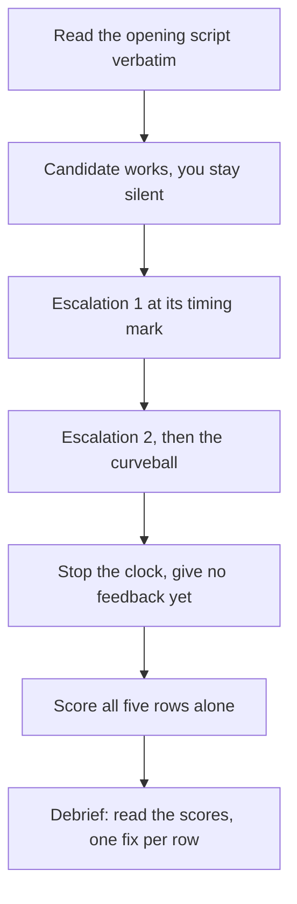

# 🎬 Mock Interview Kit

Most mock interviews fail for the same reason: the person running it does not know what to say, so they turn into a study buddy. They rescue you at the first silence, they skip the hard follow-up because you looked uncomfortable, and at the end they say "yeah, that was good." You learn nothing.

This kit removes the improvisation. Five rounds, one per stage of the loop described in [Anatomy of the 2026 AI Engineer loop](ML%20Interview/AI%20Fundamentals/AI-Engineer-Interview-Questions/13-interview-process-and-behavioral/README.md#anatomy-of-the-2026-ai-engineer-loop): practical LLM coding, domain deep-dive, AI system design, behavioural, and take-home defence. Each round gives the interviewer a script to read out loud, planned escalations on a clock, one curveball, a five-row rubric with anchors written for someone who has never trained a model, and a "what a 3 sounds like vs. what a 5 sounds like" transcript so the scoring has a reference point.

Hand this file to a friend, a partner, or anyone who can hold a timer. They do not need to know what a KV cache is. If you have nobody, use the [self-mock protocol](#self-mock-protocol-no-partner) at the end.

> **Want an experienced interviewer instead?** A friend with this script beats no mock at all, but an interviewer who knows what strong AI engineering answers sound like will catch things a script cannot. You can book a mock interview or a mentorship session at [enginebogie.com/u/om](https://enginebogie.com/u/om) or [topmate.io/ombharatiya](https://topmate.io/ombharatiya).

## For the interviewer: how to run a round

You are not teaching. You are collecting evidence. The whole job is: read the script, start the clock, stay quiet, deliver the escalations on time, and score alone before you say anything nice.



**Six rules, and the round is only valid if you follow them:**

1. **Do not rescue.** When they go quiet, count to ten in your head before speaking. Real interviewers let silence run. Most people fill it themselves with something useful.
2. **Do not teach mid-round.** Save every correction for the debrief. A hint given at 0:20 invalidates the score for the rest of the round.
3. **Deliver escalations on the clock, not on their progress.** If they are struggling at 0:15, escalation 1 still goes in at 0:15. That is the point: real interviews do not slow down for you.
4. **Do not react.** No "good", no "hmm", no nodding at the right answer. Warmth is fine at the start and the end, never in the middle.
5. **Score before you talk.** Fill in all five rows in silence. If you debrief first, your scores move to match the mood in the room.
6. **Use the term check.** Any time they use a word you do not know, say: "Define that in one sentence for me." A strong candidate can define anything they said. This one move lets a non-expert grade depth accurately, and it is what a cross-functional interviewer actually does.

**Scoring.** Each row is 1 to 5. The tables give you anchors for 1, 3 and 5. Award **2** when the answer clears the 1 anchor but misses part of the 3 anchor. Award **4** when it clears the 3 anchor and shows some, but not all, of the 5 behaviours. If you have to deliberate between two numbers, take the lower one - interviewers do not deliberate, they write down their first impression and defend it in the debrief.

**Reading a round total (out of 25):** 20+ means this round is ready. 15-19 means it holds up but one row is dragging, fix that row. Under 15 means run the round again next week before you sit the real thing.

**Debrief format (10 minutes, no more).** Read the five scores aloud with no commentary. Then one sentence per row: the single thing that would have moved it up a point. Then stop. Long debriefs feel productive and change nothing.

---

## Round 1: Practical LLM coding (45 minutes)

The "build a thing that calls an LLM" round. Tests API fluency, async and error handling, and whether the candidate has actually run an agent loop in anger or only read about one.

**Interviewer setup:** they need an editor and a screen share. You need nothing but this page and a clock. You are playing the model, so when their code calls `call_model`, they tell you what they sent and you say what the model returns. Make it return a tool call the first two times and a plain answer the third.

### Script

- **0:00 - Frame it.** Read: "Forty-five minutes. I'll give you a problem, you write real code in your editor, I'll watch. Talk while you work - if you go quiet I have nothing to grade. Docs and search are fine, coding assistants are not unless I say otherwise. Anything you'd normally look up, tell me what you'd look up and I'll answer it."
- **0:03 - Opening prompt.** Read: "You have a chat model that can call tools. I want the loop around it. Send the conversation to the model, and if it comes back asking for a tool call, run the tool, feed the result back in, and repeat until it answers in plain text. I'll play the model: define a function called `call_model` with a stub, tell me what you're sending, and I'll tell you what comes back. Two tools, both plain Python functions: `get_order(order_id)` and `issue_refund(order_id, amount)`. Start whenever you're ready."
- **0:15 - Escalation 1.** Read: "`get_order` now times out on roughly one call in five. Make the loop survive that."
- **0:26 - Escalation 2.** Read: "The model just handed you tool arguments as a string that isn't valid JSON. It'll do that maybe two percent of the time. What happens in your code right now, and what do you want to do about it?"
- **0:34 - Escalation 3.** Read: "We're getting 429s from the provider. Add whatever you'd normally add."
- **0:38 - Curveball.** Read: "Last thing, and stop typing for this one. This loop is going to run unattended overnight across fifty thousand support tickets, with `issue_refund` wired to the real payments API. Tell me what you change, what you refuse to change, and what you want on a dashboard by morning."
- **0:43 - Close.** Read: "Stop there. Anything you'd want me to know that you didn't get to?"

### Crib sheet for a non-expert interviewer

Strong answers usually contain a cap on the number of loop iterations, a check that the model's output is what it claims to be before it gets used, retries that wait longer each time rather than hammering the API, and - on the curveball - a limit on how much money the loop can move without a human. If none of that appears, that is a real finding, not a gap in your knowledge. Reference implementations: [agent loop](../12-coding-challenges/10_agent_loop.py), [rate limiter and retry](../12-coding-challenges/11_rate_limiter_and_retry.py), [constrained JSON decoding](../12-coding-challenges/18_constrained_json_decoding.py).

### Rubric

| Row | 1 | 3 | 5 |
|---|---|---|---|
| **Working code on the clock** | Nothing runs by 0:43. Still rearranging structure at the end, or spent the round on setup | The basic loop runs on the happy path by roughly 0:30 | Something runs by roughly 0:20 and it is still running after every escalation, because they tested as they went |
| **Talking while coding** | Silences longer than a minute. You cannot tell what they are attempting without asking | Explains each piece after writing it, answers clearly when you ask | States the plan in one or two sentences before typing, flags choices as they make them, and says out loud when they are guessing |
| **Handling escalations** | Each new requirement restarts the design, or gets waved away ("the library handles that") | Implements each one, needed a nudge on one of them | Implements each without help and names the specific bad outcome it prevents, such as a loop that never stops or every client retrying at the same instant |
| **Failure handling nobody asked for** | Code assumes the model and the tools always return exactly what is expected | Adds error handling when reminded, caps the loop when reminded | Before you raise it: caps the iterations, checks the model's output before trusting it, and has decided what happens when a tool fails twice in a row |
| **The curveball** | Rejects the premise, freezes, or answers with one word | Names one or two sensible changes | Names concrete changes, names what they would deliberately not change, says who or what gets to stop the run, and says what they would log so a human can audit it in the morning |

### What a 3 sounds like vs. what a 5 sounds like

> **3.** "OK so I'll wrap the tool call in a try/except... [45 seconds of silence, typing] ...yeah, and if it throws I'll just return the error string back to the model and let it decide."
>
> *Interviewer: "What if it keeps failing?"*
>
> "Uh, then it'd loop, I guess. I could add a counter."

> **5.** "Two things break with a flaky tool. One is the immediate crash, which is a try/except. The other is worse: I hand the error back to the model, the model retries the same tool, and now I've got a loop that never terminates and burns tokens. So I'm doing both - catch it, return a short error the model can actually act on, and a hard cap of five iterations that raises. I'll set the cap low so it fails loudly in testing rather than at 3am. Retries on the tool itself get backoff with jitter, because if this runs across fifty thousand tickets every worker retries at the same millisecond otherwise."

---

## Round 2: Domain deep-dive (45 minutes)

The round where the interviewer probes until the candidate breaks. The material is sections [01](../01-ml-and-dl-foundations/README.md) through [10](../10-multimodal/README.md) of this repo. What is actually being graded is not encyclopaedic recall - it is whether the candidate knows where their knowledge ends and says so instead of bluffing.

**Interviewer setup:** ask the candidate for their resume beforehand and pick one bullet that mentions a model. That bullet is your target for the whole round.

### Script

- **0:00 - Frame it.** Read: "This round is depth, not breadth. I'm going to pick one thing you've built and keep asking until we reach the edge of what you know. Reaching that edge is expected and it is not a failure - 'I don't know, and here's how I'd find out' scores better with me than a confident guess. One house rule: any time you use a term I don't know, I'll ask you to define it in one sentence."
- **0:03 - Opening prompt.** Read: "Take this line from your resume: [read the bullet]. Walk me through what actually happens from the moment a user submits a request to the moment they see an answer. Take about five minutes, then I'll start interrupting."
- **0:12 - Escalation 1 (mechanism).** Read: "Go back to the step where the model gets its context. How did you decide what went in, what did you try before that, and how did you know the new way was better?"
- **0:22 - Escalation 2 (evidence).** Read: "How do you know the system works? Be specific: what's in the test set, who wrote it, what score did you get, and what does that score fail to catch?"
- **0:32 - Escalation 3 (diagnosis).** Read: "Suppose retrieval is perfect - the right document is in the context every single time - and the answer is still wrong. Where do you look first, and what would you look at second?"
- **0:39 - Curveball (one step off their patch).** Pick one they did not mention, read it, and grade the response, not the recall: "Different topic, slightly off your ground. [Choose one:] What does turning temperature up actually do to the model's choices? / What is a KV cache storing, and why is it worth the memory? / With LoRA, what's actually saved at the end compared with a full fine-tune? If you don't know, say so and tell me how you'd find out."
- **0:43 - Close.** Read: "That's time. What's the part of that system you understand least well?"

### Crib sheet for a non-expert interviewer

You do not need the right answers - you need the term check. Every time they say a word you do not recognise, ask for a one-sentence definition, and note whether the definition was crisp, waffly, or absent. Three waffly definitions in a row is the finding. On the curveball, an honest "I haven't worked with that, here's how I'd figure it out in an hour" is a **5**; a fluent-sounding answer that collapses when you ask them to define their own terms is a **1**. Background if you want it: [LLM fundamentals](../02-llm-fundamentals/README.md), [RAG and retrieval](../04-rag-and-retrieval/README.md), [evaluation](../07-evaluation-and-observability/README.md).

### Rubric

| Row | 1 | 3 | 5 |
|---|---|---|---|
| **Owns the mechanism** | Describes the tools and frameworks used, not what happens to the request. Cannot go one level below the API call | Describes each stage in order and what it does | Describes each stage, why it exists, what was tried before it, and which stage they would remove first if forced |
| **Term check** | Uses terms they cannot define when asked. Two or more definitions come back vague or circular | Defines terms correctly when asked, sometimes after a pause | Defines every term in one clean sentence, and reaches for a plain-language version unprompted when the definition needs one |
| **Evidence, not assertion** | "It worked well" / "users liked it" with nothing behind it. No test set exists | Names a test set and a metric, gives a number when pushed | Gives numbers without being asked, says who wrote the test cases and how many, and names what the metric does not catch |
| **Behaviour at the edge of knowledge** | Bluffs. Answer gets longer and vaguer rather than stopping | Says "I'm not sure" and stops there | Says exactly where the boundary is, offers the part they do know, and gives a concrete route to the answer: what they would read, run, or measure |
| **Diagnostic thinking** | Answers the "still wrong" question with a restatement of the problem, or blames the model | Names one plausible cause and a way to check it | Names several candidate causes, says which is most likely and why, and says what evidence would tell them which one it is before changing anything |

### What a 3 sounds like vs. what a 5 sounds like

> **3.** *Interviewer: "How do you know it works?"*
>
> "We had an eval set. It scored around 85 percent, I think, on faithfulness. We used an LLM as a judge for it."
>
> *Interviewer: "Define faithfulness in one sentence."*
>
> "It's like, whether the answer is grounded in the retrieved documents. Whether it's accurate to the sources."

> **5.** "Three hundred cases, pulled from real tickets, labelled by two support leads rather than by me - that mattered, because my own labels were biased toward cases I'd already fixed. Two scores per case: does the answer follow from the retrieved documents, and would it have resolved the ticket. We got to about 90 percent on the first and 74 on the second, and the gap between those two numbers is the interesting part: plenty of answers were technically supported by the docs and still useless to the customer. What the set doesn't catch is anything outside the ticket distribution - it has almost no billing questions in it, so I don't trust our billing numbers at all."

---

## Round 3: AI system design (45-60 minutes)

Do not restate the criteria here. This round is scored against the material already in [11-ai-system-design](../11-ai-system-design/README.md): run the clock against the [8-step answer framework](../11-ai-system-design/README.md#the-8-step-answer-framework) time budget, grade against [What interviewers grade](../11-ai-system-design/README.md#what-interviewers-grade), and watch for the [red flags](../11-ai-system-design/README.md#red-flags-interviewers-watch-for). Prompts come from the [rapid-fire list](../11-ai-system-design/README.md#rapid-fire-practice-prompts); the worked answer for the prompt below is [case study 01](../11-ai-system-design/case-studies/01-enterprise-rag-assistant.md), which the interviewer should skim first.

### Script

- **0:00 - Frame it.** Read: "Fifty minutes. Whiteboard or a shared doc, whichever you'd use at work. I'm the person who asked for this system, so ask me anything you need - but I'll only answer what you actually ask. I won't volunteer requirements."
- **0:02 - Opening prompt.** Read: "Design a company-wide knowledge assistant over our wikis, docs, and tickets."
- **Answer key - read these out only when asked.** Twelve thousand employees. Roughly two million documents across three systems. About thirty thousand questions a day, peaking around eight per second on Monday mornings. Leadership wants an answer starting inside three seconds. Finance has given you five cents per question. Documents carry per-team permissions today and legal is firm about that. Content changes daily. If they ask something not on this list, answer "you decide, tell me your assumption and move on."
- **0:20 - Escalation 1 (permissions).** Read: "One team's documents are legally restricted to twenty named people. What in your design changes, and what breaks if you get it wrong?"
- **0:32 - Escalation 2 (scale shock).** Read: "The CEO mentions this in an all-hands and traffic goes up fiftyfold for two hours. Walk me through what happens to your system, in order."
- **0:42 - Curveball (the budget cut).** Read: "Finance has re-run the numbers and your design costs about five times the budget. Cut it. Tell me exactly what quality you're trading away and how you'd know if you cut too far."
- **0:48 - Close.** Read: "If you could only build one part of this in the first two weeks, which part, and what would it prove?"

### Crib sheet for a non-expert interviewer

Three things you can grade without knowing the field. Did they ask questions before drawing anything, or start drawing immediately? Did any numbers appear on the board - requests, tokens, costs, seconds - or is it only boxes and arrows? And when you asked how they would know it works, did they have an answer with data in it? Those three map to the top three items in [What interviewers grade](../11-ai-system-design/README.md#what-interviewers-grade), and they separate strong candidates from weak ones more reliably than any architecture detail.

### Rubric

Criteria are defined in the linked sections above. This table only tells you how to turn what you hear into a number.

| Row (defined in [11-ai-system-design](../11-ai-system-design/README.md#what-interviewers-grade)) | 1 | 3 | 5 |
|---|---|---|---|
| **Clarifying questions first** | Starts drawing within a minute. Asks nothing, or asks only after the design is fixed | Asks a handful of questions up front, mostly about scale | Asks about users, scale, the quality bar and the budget before drawing, and states the assumptions they are making where you refuse to answer |
| **Tradeoff articulation** | Choices arrive as facts. No alternatives mentioned | Names alternatives when you ask why | Every significant choice comes with the option rejected, the reason, and what evidence would change their mind |
| **Eval literacy** | Quality never comes up, or arrives as "we'd test it" | Mentions a test set and a metric when prompted | Raises measurement unprompted, separates the retrieval score from the answer score, and says what gates a change from shipping |
| **Cost awareness** | No arithmetic at any point | Does rough token maths when you push on the budget | Does the arithmetic unprompted early, states the assumptions in it, and uses the result to drive a design decision such as routing cheap traffic to a cheaper model |
| **Failure-mode thinking** | Design assumes everything works. The curveball or the permissions escalation is the first mention of anything going wrong | Handles the failures you raise, sensibly | Raises failures before you do - the provider going down, stale content, someone seeing a document they should not - and each one has a defined behaviour rather than an alarm |

### What a 3 sounds like vs. what a 5 sounds like

> **3.** "For permissions I'd filter the results after retrieval, so we'd get the top documents back and then drop the ones the user can't see."
>
> *Interviewer: "What breaks if you get it wrong?"*
>
> "Someone sees something they shouldn't, which would be bad. We'd want to test that carefully."

> **5.** "Filtering after retrieval is the wrong shape here and I want to say why before I draw it. If I retrieve first and filter second, two things go wrong. The user with narrow access gets fewer results than everyone else and quality quietly degrades for exactly the people legal cares most about. And the failure mode is silent: the day someone reorders those two steps, we leak, and nothing throws an error. So permissions go into the index as a filter that runs during search, and the request carries the identity the whole way through. On the twenty-named-people corpus specifically, I'd keep it in a separate index rather than a filter on the shared one, because I want the blast radius of a bug to be bounded by infrastructure, not by a boolean. Cost of that is a second index to keep fresh, which I'd accept. And I'd put a permissions case in the eval set - a query that must return nothing for a user who shouldn't see it - so a regression fails CI rather than fails in production."

---

## Round 4: Behavioural (45 minutes)

At senior levels this round carries as much weight as any technical one, and the debrief line that kills offers is "strong technically, but couldn't explain what they shipped." Questions come from [questions.md](questions.md); the [red flags](ML%20Interview/AI%20Fundamentals/AI-Engineer-Interview-Questions/13-interview-process-and-behavioral/README.md#red-flags-interviewers-watch-for) list is what you are listening for.

**Interviewer setup:** none. This is the round a non-expert can run best, because the failure modes are audible: no numbers, no ownership, no reflection.

### Script

- **0:00 - Frame it.** Read: "Forty-five minutes, four or five questions, and I'll interrupt to go deeper on whichever one interests me. I'm listening for what you specifically did and what actually happened, so numbers help. If I cut you off it means I've got what I need, not that you're doing badly."
- **0:02 - Opening prompt.** Read: "Walk me through an LLM feature you shipped end to end."
- **0:10 - Escalation 1 (ownership).** Read: "Which parts of that were yours and which were the team's?" Then, whatever they say, pick the most technical thing they claimed and ask: "Take me three levels into that. How did it actually work?"
- **0:20 - Escalation 2 (failure without a redemption arc).** Read: "Tell me about an AI project that failed. Not one that turned around - one that got killed."
- **0:30 - Escalation 3 (judgement under conflicting evidence).** Read: "Tell me about a time your eval numbers and your users disagreed. Which did you trust, and what happened?"
- **0:38 - Curveball (disagreement with the interviewer).** Read, referring back to something they actually said: "I want to push on something. Earlier you said [X]. I think that was the wrong call - you should have fine-tuned there rather than used retrieval. Convince me, or change your mind."
- **0:42 - Close.** Read: "What questions do you have for me?" Score this. Their questions are part of the round.

### Crib sheet for a non-expert interviewer

Keep a tally sheet with four marks: every number they say, every "we" where you expected "I", every time they blame something outside their control, and every time they say what they would do differently. Those four counts do most of the scoring for you. On the curveball, you are not grading whether they hold their position - you are grading whether they engage with your argument, ask what you are seeing that they are not, and either give ground for a reason or hold it for a reason. Both are 5s. Instant capitulation and stubborn repetition are both 1s. Depth guidance for every question is in [questions.md](questions.md).

### Rubric

| Row | 1 | 3 | 5 |
|---|---|---|---|
| **Numbers in the story** | No users, no time, no cost, no scores. Everything is "significantly" and "a lot" | A number or two arrive when you ask for them | Numbers arrive unprompted: scale, before and after, how long it took. Says "roughly" and "I don't remember exactly" where honest rather than inventing precision |
| **Ownership under probing** | Story is in "we", and the three-levels-deep question gets a shrug or a topic change | Distinguishes their work from the team's, survives one follow-up | Draws the line clearly and unprompted, then goes three levels deep on their part without strain, and is specific about what a named colleague did better |
| **Failure honesty** | Cannot produce a failure, or produces one that is secretly a success. Cause is always external | Tells a real failure, mostly explains the cause | Tells a genuine dead project, names their own contribution to it, says what the earliest visible warning sign was and what they now watch for |
| **Handling disagreement** | Folds immediately, or repeats the original point louder with no new argument | Defends the choice with the original reasoning | Asks what you are seeing first, restates your argument fairly, then either concedes on a stated reason or holds with a reason and names the evidence that would settle it |
| **Their questions for you** | None, or only perks and logistics | Two or three sensible questions about the team and the work | Questions that are diagnostic: how quality changes get approved, what the last model migration looked like, who is on call for a bad answer. Listens to the answer and follows up |

### What a 3 sounds like vs. what a 5 sounds like

> **3.** *Interviewer: "Tell me about a project that got killed."*
>
> "We built a summarisation feature that never launched. Honestly the timing was bad - leadership shifted priorities to something else and the team got reassigned. It was frustrating because the tech worked fine. I learned a lot about summarisation from it."

> **5.** "A meeting-notes assistant, killed after four months, and it was the right call. Two things I own. First, I never established what good looked like before we started building - we shipped demos to stakeholders and everyone nodded, and nodding is not a metric. By the time I built a proper test set in month three, we were at about 60 percent on 'would you send this to your team unedited', and that number had probably been flat since week two - I just had not been measuring it. Second, I ignored the earliest signal: our own team stopped using it after the first fortnight. I told myself it was a UI problem. Now I watch two things from week one on anything I build - a real acceptance number, and whether the team dogfoods it voluntarily. Voluntary usage inside your own team is the cheapest eval that exists and I threw it away for two months."

---

## Round 5: Take-home defence (30 minutes)

The follow-up call after a submission, where they ask you to defend every line. The assumption behind this round is stated plainly in the [take-home section](ML%20Interview/AI%20Fundamentals/AI-Engineer-Interview-Questions/13-interview-process-and-behavioral/README.md#take-home-assignments): use whatever tools you want, but if you cannot explain a design choice, you did not make it.

**Interviewer setup, done before the round (30 minutes of your time):**

1. Clone the repository fresh, on a machine that has never run it. Follow the README literally. Time how long until it does something useful, and stop at 15 minutes whether or not it works. That timing is row one of the rubric, already scored before the round starts.
2. Pick three lines to ask about: one that looks clever, one that looks suspicious, and one that looks like it was pasted in.
3. Run their evals if they have any. Note whether the numbers in the README match what you got.

### Script

- **0:00 - Frame it.** Read: "Thirty minutes. I've read it and I've run it. I'll ask you to defend specific choices. 'I'd do that differently now' is a perfectly good answer if you can tell me why."
- **0:02 - Opening prompt.** Read: "Before anything else: in one sentence, what's the biggest weakness in what you submitted?"
- **0:06 - Escalation 1 (the line).** Read: "Open [file], line [N]. Why is that there, and what happens if I delete it?" Repeat with your second chosen line if the first is answered fast.
- **0:14 - Escalation 2 (the evidence).** Read: "Show me how you know this works. Then show me a case it gets wrong, and tell me why it gets it wrong."
- **0:22 - Escalation 3 (the change of requirements).** Read: "The corpus is a hundred times bigger and it updates every hour. What's the first thing that breaks, and what's the second?"
- **0:27 - Curveball (provenance).** Read: "How much of this did an assistant write, and how did you check what it gave you?"
- **0:29 - Close.** Read: "What would you have built with another two days?"

### Crib sheet for a non-expert interviewer

Row one you have already scored by trying to run it. For the rest, you are grading fluency with their own submission, which needs no domain knowledge: hesitation on their own code, surprise at their own numbers, or a shrug at a line they wrote is the finding. On the provenance question, the answer "an assistant wrote most of it" is not a failure - "an assistant wrote most of it and I checked it by [nothing]" is. What good submissions look like is set out in the [take-home section](ML%20Interview/AI%20Fundamentals/AI-Engineer-Interview-Questions/13-interview-process-and-behavioral/README.md#take-home-assignments).

### Rubric

| Row | 1 | 3 | 5 |
|---|---|---|---|
| **It runs** | Did not run in 15 minutes from a clean clone. Missing steps, unpinned dependencies, or an undocumented key | Ran after a small fix you could work out yourself | One command, ran first time, and it told you what it was doing while it ran |
| **Defends any line** | Cannot say why a line they wrote is there, or claims it is needed when deleting it changes nothing | Explains the chosen lines correctly after a pause | Explains instantly, says what it protects against, and volunteers where it is weak or which line they would delete first |
| **Named their own shortcuts** | The weakness question gets a non-answer ("more tests, I guess"), and the README claims more than the code does | Names a real weakness, matching something you noticed | Names the weakness you had already written down, before you raise it, and says why they accepted it inside the timebox rather than apologising for it |
| **Evidence of quality** | No evals. Quality is asserted in the README | Some test cases exist, they can run them, numbers roughly match the README | Can pull up a failing case in seconds, explains the cause, and has grouped the failures into a small number of patterns rather than a list |
| **Scope discipline** | Gold-plated in one place and hollow in another. Heavy framework use for a small problem | Sensible scope, can say what was left out when asked | States what they deliberately did not build and why, and the "another two days" answer targets their weakest measured area rather than a new feature |

### What a 3 sounds like vs. what a 5 sounds like

> **3.** *Interviewer: "What's the biggest weakness in what you submitted?"*
>
> "I'd say test coverage. I ran out of time on tests, so there's not much there. And the chunking is pretty basic - I just split on a fixed size because that was quickest. With more time I'd have tried something smarter."

> **5.** "The retrieval fails on anything phrased as a comparison, and I know exactly how often: it is nine of my sixty test cases, all of them questions like 'what's the difference between X and Y'. Single-vector retrieval pulls documents about X or about Y and never the one that discusses both. I found it in hour four, and I chose not to fix it, because fixing it properly means query decomposition and that's a day I didn't have. What I did instead was write it down in the README with the failure count, and add those nine cases to the eval set so whoever picks this up has the regression test ready. If you gave me two more days I'd spend them there, not on the API surface."

---

## Self-mock protocol (no partner)

You can run every round in this kit alone. It is worse than a real partner in one way only - nobody interrupts you - and better in two: you can run it tonight, and the recording does not flatter you.

**The setup.**

1. **Record the screen and the audio.** Both. The audio is where the round is actually won or lost, and you will not remember your own silences.
2. **Put the escalations on index cards, face down**, one per timing mark, with the timing written on the back. Set alarms on your phone for each mark. When the alarm goes, you turn the card over and read it out loud, whatever state you are in. Reading it aloud matters: it forces the context switch that a real interviewer forces.
3. **Read only the opening script**, then start the clock. Do not read ahead to the rubric. Scoring yourself against anchors you memorised an hour ago is worthless.
4. **No pausing, no restarting, no editing.** If your code does not compile at 0:43, that is the take. One recording per round, per week.

**The 24-hour rule.** Do not watch it back the same day. Wait a full day, minimum. Same-day review scores what you *meant*; day-later review scores what you *said*, which is the only thing an interviewer ever hears. This single delay is what makes self-mocking work at all.

**Scoring yourself, a day later.**

1. **Transcribe it first** with any speech-to-text tool, then read the transcript before watching the video. Text strips out your tone of voice, which is exactly the thing that has been fooling you.
2. On the transcript, mark four things: every silence over ten seconds, every number you said, every term you used without defining, and every sentence that ends in a trailing "...yeah" or "or whatever". The density of the last category is your nervousness score.
3. **Score all five rows** before watching the recording, using only the transcript. Then watch, and adjust only if the video shows something the text could not.
4. **Take the lower number** on any row where you hesitated between two, and write one sentence per row saying what would have made it a point higher.

**What to do with the score.** Rewrite the two worst rows only. Not the whole round, not every answer - two. Then re-run the identical round in a week and compare the two score sheets side by side. Improvement that shows up on the same round with the same script is real; a good feeling about a different question is not.

**A trap worth naming:** running the same round repeatedly until you score well means you have memorised one answer, not built a skill. Rotate the prompt each time you re-run a round - a different rapid-fire prompt for design, a different resume bullet for the deep-dive, a different story for behavioural.

## Printable score sheet

One sheet per round. Copy it, print it, or paste it into a doc. Interviewer fills it in silently before any debrief.

```text
MOCK ROUND SCORE SHEET

Candidate ......................  Interviewer ......................
Date ..........  Round: coding / deep-dive / design / behavioural / take-home
Prompt used ......................................................

Rules: score 1-5 per row. 2 = clears the 1 anchor, misses part of 3.
4 = clears 3, shows some of 5. Undecided between two numbers: take the lower.
Fill this in ALONE, before you say anything to the candidate.

ROW                                  SCORE   EVIDENCE (quote what they said)
1 .................................  [   ]   ...............................
2 .................................  [   ]   ...............................
3 .................................  [   ]   ...............................
4 .................................  [   ]   ...............................
5 .................................  [   ]   ...............................

                             TOTAL   [    ] / 25
    20+ ready   |   15-19 one weak row, fix it   |   under 15 re-run this round

Timing marks hit on the clock?      yes / no
Did I rescue, hint, or react?       yes / no   (if yes, the scores are inflated)

Three things to fix, most important first:
1 ................................................................
2 ................................................................
3 ................................................................

One thing that was genuinely strong (say this last, not first):
..................................................................

Re-run this round on (date) ..........
```

## Where to go next

- Round content and depth guidance: [questions.md](questions.md) for behavioural, [11-ai-system-design](../11-ai-system-design/README.md) for design, [12-coding-challenges](../12-coding-challenges/README.md) for the coding round.
- Where mocks sit in a wider schedule: [STUDY_PLAN.md](../STUDY_PLAN.md).
- The night before the real thing: [CHEATSHEET.md](../CHEATSHEET.md).
