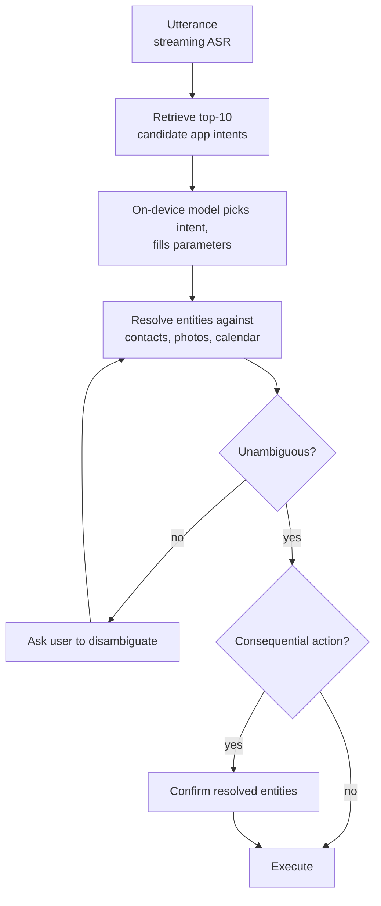
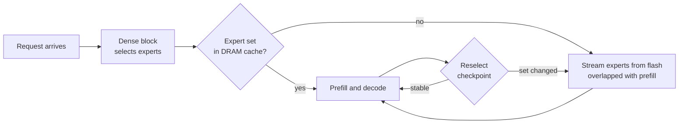

# 🍎 Apple - AI Engineer Interview Questions

> **Last reviewed: October 2026.** Based only on public information - official pages, engineering blogs, and publicly shared candidate reports. Processes change and vary by team; treat this as a map, not a contract. No confidential or leaked material.

## TL;DR

- **There is no single "Apple loop."** Apple does not publish an interview guide, and hiring is famously decentralized: each team designs its own process, and interviewers write their own questions. Two ML candidates in the same month can have meaningfully different loops. Everything below is a composite of public reports - verify specifics with your recruiter.
- **On-device is the differentiator.** The third generation of Apple Foundation Models (June 2026) pairs AFM 3 Core, a 3B dense on-device model, with AFM 3 Core Advanced, a 20B sparse on-device model that keeps its full weights in flash and activates roughly 1-4B parameters at a time, plus a family of server models on Private Cloud Compute. The 2025 generation's published techniques (2-bit quantization-aware training, KV-cache sharing) are still the best-documented background. Expect quantization, latency, memory-budget, and efficiency questions that a generic "big tech ML" playbook won't cover.
- **Apple now builds on a partner base.** In January 2026 Apple and Google announced that the next generation of Apple Foundation Models would be based on Gemini models and cloud technology, and Apple's June 2026 write-up credits the collaboration, including running its most capable server model on NVIDIA GPUs in Google Cloud under Private Cloud Compute. Expect "adapt and compress a model you didn't pretrain" questions alongside the classic efficiency ones (reported, varies by team).
- **Privacy is a first-class design constraint, not a compliance checkbox.** Candidates consistently report that treating privacy as an afterthought in system-design answers is a noticed failure mode. Know differential privacy, federated learning, and the Private Cloud Compute model at a conversational level.
- **The typical shape (reported):** recruiter screen → 1-2 technical phone screens (CoderPad, LeetCode-medium plus ML fundamentals) → a 5-7 round onsite mixing coding, ML depth, ML system design, domain deep-dive, and behavioural/hiring-manager rounds. Reported timelines run ~4-6 weeks.
- **Domain fit matters more than at peers.** You're hired by a specific team (foundation models, CV, speech/NLP, ML infra, applied research), and the technical rounds are built around that team's daily work. Research the team, and have a team-specific "why Apple" ready.

## Company context

Apple's AI work centres on Apple Intelligence - generative features (writing tools, summarisation, image generation, Siri, semantic search) integrated across iPhone, iPad, Mac, and Vision Pro - built by the AIML org and product teams on top of in-house foundation models. The engineering identity is hybrid AI at consumer scale: compact on-device models running on Apple silicon for latency and privacy, escalating to larger server models on Private Cloud Compute. Since 2026 that stack has been developed in collaboration with Google, with the next-generation models based on Gemini, while Apple keeps the on-device and Private Cloud Compute privacy architecture as the non-negotiable boundary. "AI engineer" at Apple usually means one of: training/adapting foundation models, squeezing models onto the Neural Engine (quantization, adapters, serving), building ML infrastructure and data pipelines, or shipping ML-powered product features - nearly always with hardware-software co-design and privacy in the job description.

## Roles & titles they hire

Actual posting titles (from [jobs.apple.com](https://jobs.apple.com/en-us/search?team=machine-learning-and-ai-SFTWR-MCHLN)) are usually prefixed with the org:

- **AIML - Machine Learning Engineer, Foundation Models** (pre-training, mid-training, post-training of Apple's foundation models)
- **AIML - Machine Learning Research Engineer** (e.g., Foundation Models, Responsible AI and Safety)
- **Machine Learning Engineer / Sr. Machine Learning Engineer** on product teams (Siri, Intelligence System Experience, Services, Health)
- **Software Engineer - Machine Learning Infrastructure** (training platforms, data infrastructure, serving)
- **Research Scientist / Research Engineer** in the careers sub-teams Apple lists publicly: Machine Learning Infrastructure; Deep Learning and Reinforcement Learning; Natural Language Processing and Speech Technologies; Computer Vision; Applied Research
- **Annotation/Data Science roles** in AIML Data Operations (evaluation and data quality for Siri and Apple Intelligence)

Levels are internal "ICT" levels (ICT2 - ICT6 for ICs). Compensation data is publicly tracked on [levels.fyi](https://www.levels.fyi/companies/apple/salaries/software-engineer).

## The interview loop

**Public info here is thinner and noisier than for OpenAI or Meta - Apple publishes nothing official about its loop, and the process genuinely varies by team.** The table below is the *commonly reported* shape for ML/AI roles, assembled from prep-site guides and candidate reports; treat every row as "(reported, varies)".

| Stage | Format | What's evaluated |
|---|---|---|
| Recruiter screen | ~30 min call (reported) | Background, domain fit, communication; resume walk-through |
| Hiring manager screen | 30-60 min (reported, varies; sometimes merged with recruiter stage) | Project depth, team fit, motivation for this specific team |
| Technical phone screen(s) | 1-2 × 45-60 min CoderPad with a senior IC (reported) | LeetCode-medium coding; ML fundamentals questions mixed in depending on team |
| Onsite / virtual onsite | 5-7 rounds, often a full day (reported, varies widely) | Mix of: 1-2 coding rounds; ML fundamentals/depth; ML system design under on-device and privacy constraints; domain deep-dive tied to the team's area; behavioural (STAR-style) |
| Hiring manager / senior manager round | Within onsite (reported) | Resume deep-dive, ownership, decision-making, "why Apple / why this team" |
| Decision | Team-driven; no central hiring committee like Google (reported) | Timelines reported at ~4-6 weeks end-to-end, sometimes longer |

Notes from public reports:

- How much pure DSA coding you get depends on the team - some run conventional coding rounds, others replace them with applied ML challenges that mirror the team's work.
- Interviewers are typically future teammates, and questions are written by the team, not pulled from a central bank.
- Candidates for Apple Intelligence-adjacent teams report GenAI-focused rounds: hallucination handling, embeddings and vector search, RAG, and on-device/server orchestration.
- Expect interviewers to be guarded about unreleased work (secrecy culture). Don't press for roadmap details; do show you understand the shipped stack.

## What they emphasise

- **Efficiency engineering.** Quantization (including quantization-aware training), pruning, distillation, KV-cache optimisation, memory and power budgets, and Apple-silicon awareness (Neural Engine vs GPU vs CPU). This is the single most Apple-specific technical axis.
- **Privacy-preserving ML as architecture.** On-device processing by default, Private Cloud Compute for heavier requests (stateless, auditable, no privileged access), differential privacy, and improving models without collecting raw user data. Weave this into system-design answers unprompted.
- **Hardware-software co-design.** Apple controls the silicon, OS, frameworks (Core ML, MLX, the Foundation Models framework), and product. They value engineers who reason across that whole stack rather than treating the model as a black box behind an API.
- **Product and user-experience judgment.** Features ship to a billion-plus devices in dozens of locales. Evaluation rigor, graceful degradation, and "what does the user actually experience" reasoning score well.
- **Team-domain depth.** Because the loop is team-built, deep competence in the target team's area (speech, CV, foundation models, infra) beats broad shallow coverage.
- **Discretion and collaboration.** Behavioural rounds probe ownership and cross-functional work; Apple's need-to-know culture means comfort with ambiguity and not oversharing is part of fit.

## Representative questions

*Representative questions synthesised from this company's publicly known focus areas and role descriptions - not leaked questions.*

### 1. You need to run a ~3B-parameter language model on a phone with tight memory and power budgets. What changes versus serving the same model in a datacenter?

<details><summary><b>Answer</b></summary>

Almost everything. In a datacenter you optimise throughput across batched requests on HBM-rich accelerators; on device you optimise latency and energy for batch size 1 on shared LPDDR memory, and the model must coexist with the OS and apps.

Concretely: (1) **Weights must shrink.** A 3B model in fp16 is ~6 GB - untenable. Aggressive quantization (4-bit, and Apple has published 2-bit quantization-aware training for its on-device model) brings that under ~1 GB. Low-bit PTQ degrades badly, so you train with quantization in the loop and often add small recovery adapters. (2) **KV cache becomes the marginal cost.** With no cross-request batching, you shrink it via grouped-query attention, KV-cache sharing across layers, quantized caches, and context limits. (3) **Compute targets change.** You compile for the Neural Engine/GPU, which constrains ops, favours static shapes, and rewards architectures co-designed with the hardware. (4) **Energy and thermals are first-class.** Sustained decode drains battery and throttles; you budget tokens/joule, not just tokens/sec. (5) **One model, many features.** You can't ship a model per feature, so a shared base plus swappable LoRA adapters replaces per-task fine-tunes. (6) **No server-side telemetry.** Evaluation and debugging must work without logging user content.

**Follow-ups:** Which of these constraints would make you choose a different architecture (e.g., fewer, wider layers vs deeper)? When would you give up and route the request to a server model instead?

</details>

### 2. Explain post-training quantization versus quantization-aware training. What breaks when you push weights to 2-4 bits, and how do you recover quality?

<details><summary><b>Answer</b></summary>

**PTQ** quantizes a trained fp16/fp32 model after the fact - calibrate scales on a small dataset, round weights, ship. Cheap, no training infra needed, and typically fine at 8-bit and often 4-bit with good methods (per-channel scales, GPTQ/AWQ-style error compensation that accounts for activation statistics). **QAT** simulates quantization during training - fake-quantize in the forward pass, straight-through estimator for gradients - so the network learns weights that are robust to rounding. It costs training compute but is what makes very low bit-widths viable; Apple's published on-device model uses 2-bit QAT.

What breaks at low bits: outlier weight/activation channels dominate the quantization range and crush resolution for everything else; sensitive components (embeddings, first/last layers, layernorms) degrade disproportionately; and errors compound across depth, showing up as repetition, factual drift, and broken instruction-following rather than a smooth perplexity slide.

Recovery levers, roughly in order: mixed precision (keep sensitive layers at higher bits), finer granularity (per-group scales instead of per-tensor), rotation/smoothing methods that redistribute outliers before quantizing, QAT or quantized fine-tuning on a representative mix, and small high-precision LoRA "recovery" adapters trained on top of the quantized base to claw back quality. Always validate on task-level evals, not just perplexity - perplexity can look fine while guided generation or tool-calling reliability collapses.

**Follow-ups:** How would you decide the bit-width per layer with a fixed 1 GB budget? What does 2-bit quantization do to your fine-tuning story for downstream teams?

</details>

### 3. Design the routing layer that decides whether a user request is handled on-device, by a first-party server model, or by a third-party model.

<details><summary><b>Answer</b></summary>

Start from the constraint hierarchy: privacy first (prefer on-device; escalate only with minimal necessary context), then quality (does the small model suffice for this task?), then latency/availability (offline must still work), then cost.

**Routing signals:** task type (summarise-this-notification is on-device territory; open-ended world-knowledge questions are not), prompt length vs on-device context limit, device state (battery, thermal, memory pressure), and a learned or calibrated "capability classifier" that predicts whether the small model will produce an acceptable answer - trained offline on task distributions, since you can't log user content to learn online.

**Escalation design:** on-device handles the request by default; if the capability check fails, escalate to the first-party server tier - Apple's public design here is Private Cloud Compute: stateless processing, no data retention, verifiable server images - sending only the needed context, never ambient device data. Third-party models (user-consented, per-request) are a separate tier for tasks the first-party stack doesn't cover; the UX must make that boundary explicit.

**Failure handling:** offline → degrade to on-device-only features rather than erroring; server timeout → fall back with a quality disclaimer or queue. **Evaluation:** offline eval suites per route, shadow routing on internal/opt-in traffic, and aggregate, differentially private telemetry (route rates, latencies - never content).

The key thing interviewers reportedly look for: privacy as a load-bearing design input, not a paragraph at the end.

**Follow-ups:** How do you keep the router itself cheap enough to run on every request? How do you detect that the on-device model is silently producing worse answers than the server would have?

</details>

### 4. You have one on-device base model but a dozen features - summarisation, rewriting, reply suggestions, tone adjustment. How do you specialise without shipping a dozen models?

<details><summary><b>Answer</b></summary>

Ship one frozen, quantized base model and a set of small task-specific **LoRA adapters** swapped in at runtime - this is publicly how Apple Intelligence works, and its Foundation Models framework exposes adapter fine-tuning to developers.

Why adapters win here: each adapter is low-rank deltas on attention/MLP projections - megabytes, not gigabytes - so a dozen features cost roughly one base model plus a few percent overhead. Loading an adapter is fast enough to swap per-request; the memory-mapped base stays resident. Adapters are trained per task (instruction data for summarisation style, rewriting, etc.) on top of the *quantized* base, which also recovers some quantization loss.

Engineering considerations: (1) **Base-model versioning** - every adapter is coupled to the exact base weights; a base update invalidates all adapters, so you need infrastructure to retrain and requalify the whole adapter fleet per release. (2) **Runtime** - cache hot adapters, prefetch on feature entry, and define behaviour when two features are active simultaneously. (3) **Quality isolation** - adapters can't fix base-model capability gaps; if a task consistently fails, it needs routing to a server model, not a bigger adapter. (4) **Eval per adapter** - each adapter gets its own eval suite plus a shared safety suite, because a rewrite adapter can regress safety behaviours the base model had.

Alternatives - prompt-only specialisation (weaker control, burns context) or multi-task fine-tuning one model (task interference, no independent shipping) - lose on this profile.

**Follow-ups:** How do you update one feature's adapter without a full OS release? What breaks if the base model is re-quantized between releases?

</details>

### 5. Estimate the KV-cache memory for a 3B on-device model at 4k context, and name the levers that shrink it.

<details><summary><b>Answer</b></summary>

Formula per token: `2 (K and V) × n_layers × n_kv_heads × head_dim × bytes_per_element`. Take a representative 3B-class config - 28 layers, 8 KV heads (already GQA), head_dim 128, fp16: `2 × 28 × 8 × 128 × 2 B ≈ 115 KB/token`. At 4k context that's ~470 MB - comparable to or exceeding the quantized weights themselves, on a phone where the whole feature might have a ~1 GB envelope. That's the punchline interviewers want: at long contexts, the cache, not the weights, is the memory problem.

Levers: (1) **Grouped/multi-query attention** - 8 KV heads instead of, say, 24 query heads is already a 3× saving; MQA goes further at some quality cost. (2) **KV-cache quantization** - int8 or int4 cache halves or quarters it; keys are more sensitive than values. (3) **Cross-layer KV sharing** - adjacent layers share one cache (Apple's published on-device design uses KV-cache sharing), cutting the layer term. (4) **Sliding-window or local attention** in some layers so only global layers pay full-context cost. (5) **Context policy** - cap effective context, summarise or evict old turns, and cache common prefixes (system prompts) once. (6) **Prompt-cache reuse across features** sharing the same base.

The design mindset: pick the architecture for the memory budget *before* training - retrofitting GQA or sharing after the fact is expensive.

**Follow-ups:** Which would you try first if you needed 2× headroom for a new feature? What does int4 KV quantization do to long-context retrieval quality, and how would you measure it?

</details>

### 6. How would you improve an on-device model using signals from user devices without collecting user content?

<details><summary><b>Answer</b></summary>

Layered answer, weakest-to-strongest signal: (1) **Aggregate, differentially private telemetry** - count events (feature acceptance rates, retry rates, error categories) with local DP noise added on-device before anything leaves it, so you learn *where* the model fails without ever seeing *what* the user typed. Apple has publicly used local DP for analytics for years. (2) **Federated learning / federated evaluation** - devices compute gradients or eval metrics locally on user data; only updates or metrics are sent, aggregated across many devices (secure aggregation so no single device's update is inspectable), optionally with DP on the aggregate. Practical caveats on phones: participation gated on charging/Wi-Fi/idle, stragglers, and non-IID data. For LLM-scale models, full federated training is unrealistic - federate small components (adapters, rerankers, classifiers) instead. (3) **Synthetic data guided by private signals** - use DP-aggregated failure statistics to target which synthetic training data to generate server-side; Apple has publicly described comparing synthetic candidates against on-device data via DP-protected mechanisms to select representative synthetic examples. (4) **Opt-in human feedback** with explicit consent as a last resort.

The failure mode to avoid in the interview: proposing "log the prompts where the model failed." The whole premise of this product architecture is that raw content never leaves the device; improvements must be engineered around that.

**Follow-ups:** How do you debug a locale-specific quality regression when you can't read any user prompts? Where does the DP epsilon budget actually bind in your design?

</details>

### 7. Coding: implement nucleus (top-p) sampling over a logits vector. Then explain how temperature interacts with it.

<details><summary><b>Answer</b></summary>

```python
import numpy as np

def top_p_sample(logits: np.ndarray, p: float = 0.9,
                 temperature: float = 1.0, rng=None) -> int:
    rng = rng or np.random.default_rng()
    logits = logits / temperature
    # stable softmax
    z = logits - logits.max()
    probs = np.exp(z) / np.exp(z).sum()

    order = np.argsort(probs)[::-1]          # descending
    sorted_probs = probs[order]
    cumulative = np.cumsum(sorted_probs)
    # smallest prefix with cumulative mass >= p (always keep >= 1 token)
    cutoff = int(np.searchsorted(cumulative, p) + 1)

    kept = order[:cutoff]
    kept_probs = sorted_probs[:cutoff] / sorted_probs[:cutoff].sum()
    return int(rng.choice(kept, p=kept_probs))
```

Points that earn credit: numerically stable softmax; renormalizing over the kept set; the ≥1-token guarantee; O(V log V) from the sort (a partial sort or threshold trick can do better when the head is small).

Temperature is applied *before* the top-p cut, so they interact: low temperature sharpens the distribution, so fewer tokens fit inside mass `p` - the nucleus shrinks and output gets more deterministic on both counts. High temperature flattens the distribution, the nucleus widens, and top-p becomes the safety rail that keeps the long tail of junk tokens excluded - this is why top-p degrades more gracefully than top-k as temperature rises: k is fixed while the nucleus adapts to the distribution's actual shape.

**Follow-ups:** How would you make this deterministic for reproducible on-device tests? What changes if logits arrive quantized to int8?

</details>

### 8. Your on-device model must emit valid, schema-conforming tool calls. How do you guarantee validity rather than hope for it?

<details><summary><b>Answer</b></summary>

Use **constrained decoding**: at each step, mask the logits so only tokens that can extend a valid output under the schema's grammar are sampleable. Compile the JSON schema (or Swift type, in Apple's Foundation Models framework, which publicly exposes exactly this as "guided generation" and constrained tool calling) into a state machine/grammar; during decoding, track the current state and zero out invalid continuations. Validity becomes guaranteed by construction - critical on-device, where a 3B model's raw JSON reliability is far below a frontier server model's, and where a retry loop costs user-visible latency and battery.

Implementation realities: (1) **Tokenization misalignment** - grammar terminals don't align with BPE token boundaries, so the mask must be computed over token strings, typically via a token-level automaton built ahead of time. (2) **Per-step overhead** - naive masking touches the whole vocabulary each step; precompiled masks per automaton state make it cheap. (3) **Constrained ≠ correct** - the model can emit *valid* but *wrong* calls (right shape, wrong tool or arguments). You still need fine-tuning on tool-use data and evals for semantic accuracy; the grammar only eliminates the parse-failure class. (4) **Escape hatch** - schemas should permit a "no tool applies" output, or the constraint will force hallucinated calls when nothing matches. (5) Distribution shift: heavy masking can push the model off its trained distribution mid-generation, so keep schemas simple and train on constrained-format data.

**Follow-ups:** How do you evaluate semantic (not syntactic) tool-call accuracy without logging user requests? How do constrained decoding and speculative decoding interact?

</details>

### 9. You're shipping notification summarisation to hundreds of millions of users in 30+ locales, and you cannot log user content. Design the evaluation and regression-detection story.

<details><summary><b>Answer</b></summary>

**Pre-ship, offline:** build per-locale eval suites from synthetic and licensed/internal data that mirror real notification distributions - group chats, fragments, sarcasm, mixed languages, emergency alerts. Grade with a rubric (faithfulness, key-info retention, tone) using both human raters and calibrated LLM-judges; validate the judge against human agreement per locale, since judge quality itself varies by language. Add **adversarial suites** for the known catastrophic class: summaries that invert meaning, merge senders, or misstate urgent alerts - for a headline feature at this scale, faithfulness failures are front-page news (Apple publicly paused a notification-summary category after media reports of misleading summaries of news alerts, which is exactly the failure class to design for). Gate release on worst-locale performance, not the average.

**Post-ship, privacy-preserving:** you can't read content, so instrument behaviour - expansion/dismissal rates, feature-disable rates, per-locale error-category counters - collected with differential privacy and aggregation. Sudden per-locale shifts in these proxies are your regression alarms. Complement with opt-in feedback ("was this summary accurate?") and dogfooding populations who *have* consented, plus continuous canary evals: replay the offline suites against each model/adapter/OS build.

**Rollout mechanics:** staged by locale and notification category (news and emergency categories last or excluded), per-category kill switches, and adapter-level rollback that doesn't require an OS update.

**Follow-ups:** Your DP proxy metrics look flat but journalists post screenshots of bad summaries - what went wrong in your eval design? How do you decide a category (e.g., breaking news) shouldn't be summarised at all?

</details>

### 10. Time-to-first-token for your on-device feature is 1.8 s. Walk me through diagnosing and fixing it.

<details><summary><b>Answer</b></summary>

**Decompose first.** TTFT = model/adapter load + prompt construction + tokenization + prefill + first decode step. Profile each; on device the usual suspects are load and prefill, not decode.

**Model load:** if weights load per-request, that's the bug - keep the base model memory-mapped and resident (or OS-managed with warm-up on feature entry), and preload the likely adapter when the user opens the surface, not when they hit generate. Cold-start after memory pressure eviction needs a UX answer (progressive indicator), not just an engineering one.

**Prefill:** compute scales roughly linearly with prompt length. Cut the prompt - shorter system instructions, retrieve less context, dedupe boilerplate. Then **prefix caching**: the static system/instruction prefix is identical across requests, so persist its KV state once per model/adapter version and only prefill the user-specific suffix. Chunked prefill can also let the pipeline overlap with decode start.

**Hardware mapping:** verify the graph actually runs on the intended accelerator - a single unsupported op can silently fall back to CPU and dominate latency. Static shapes and quantized compute paths matter for Neural Engine execution.

**What TTFT fixes don't help:** speculative decoding accelerates *decode throughput*, not first token - mention it, but for tokens/sec. Also set a budget per stage (e.g., <300 ms perceived), and consider streaming UX so perceived latency drops even before the engineering lands.

**Follow-ups:** How do you catch a TTFT regression across thousands of device/OS combinations before ship? Prefix cache invalidation: what versions it, and how big is it allowed to get?

</details>

### 11. Behavioural: tell me about a time you had to make progress with incomplete information - you couldn't be told the full context of what you were building.

<details><summary><b>Answer</b></summary>

This question maps directly to Apple's need-to-know culture: teams routinely build components for unannounced products without full visibility, and interviewers reportedly probe whether you can operate - and stay motivated - under that constraint.

A strong STAR answer shows: (1) **Extracting the real requirements** - you couldn't be told *what* the product was, so you nailed down the *contract*: interfaces, performance envelopes, failure modes, and the acceptance tests that define done. (2) **Designing for the unknown** - you made conservative, well-documented assumptions, kept them explicit and revisitable, and built in flexibility precisely where ambiguity was highest (e.g., configurable limits instead of hardcoded ones). (3) **Disciplined communication** - you asked your lead sharply scoped questions that could be answered without disclosure ("will inputs exceed X?" rather than "what is this for?"), and you respected the boundary rather than fishing. (4) **Ownership of quality anyway** - you tested to the contract rigorously because you knew you wouldn't get a second pass once the integration context appeared.

Avoid: framing secrecy as purely frustrating, describing how you worked around information barriers socially, or examples where ambiguity meant you stalled waiting for clarity. Also be ready for the mirror question - evidence you've handled confidential work respectfully (don't reveal a previous employer's secrets in the interview; interviewers notice).

**Follow-ups:** What did you do when one of your assumptions turned out wrong late? How do you keep a team motivated on work they can't talk about?

</details>

### 12. A user says "send Maya the photos from Saturday's hike." Design the on-device path from that utterance to a structured app action with resolved parameters.

<details><summary><b>Answer</b></summary>

Treat this as three staged problems, not one prompt: action selection, parameter resolution, and commitment.

**Action selection.** The device holds a registry of app-declared actions - Apple's App Intents framework is the public surface, with typed `AppIntent` parameters and `AppEntity` types for each app's domain objects. Do not stuff every installed app's intents into the prompt; with hundreds of apps that blows both the on-device context limit and the TTFT budget. Retrieve first: embed the utterance, run semantic retrieval over intent descriptions and app-shortcut phrases, keep ~10 candidates, then let the model select one and fill parameters under constrained decoding against that intent's schema, so the call parses by construction.

**Parameter resolution** is the harder half, and mostly not the model's job. "Maya" resolves against contacts, "Saturday's hike" against photo-library date and scene metadata. Those are on-device indexes; the model proposes a query, the resolver returns ranked candidates with confidence. That structure is also why personal data never enters a prompt - you resolve references locally instead of shipping the user's contact graph anywhere.

**Ambiguity and commitment.** Two Mayas, or three matching date ranges, is a disambiguation turn, not a guess; framework-level disambiguation is cheaper and more predictable than model-level guessing. Then gate on consequence: read-only actions can just run, while mutating or externally visible ones (sending, sharing, purchasing, deleting) need confirmation that displays the *resolved* entities. The asymmetry is the point - a wrong recipient on a photo share is unrecoverable, a wrong timer is not.

**Speech and latency.** Stream ASR so intent retrieval starts before endpointing, and budget the whole turn - a spoken assistant feels broken past roughly a second of dead air.

**Worth sketching.** The staged pipeline, and where the two user-facing gates sit.



**Follow-ups:** The utterance matches no installed intent - what does the system do, and what does the user hear? How would you measure end-to-end action accuracy across third-party apps without logging what people actually asked for?

</details>

### 13. Your new on-device model is a 20B sparse model whose full weights live in flash, with only 1-4B parameters active at a time. How do you serve it on a phone?

<details><summary><b>Answer</b></summary>

Treat flash as the weight store and DRAM as a cache, and make expert selection coarse and infrequent. The binding constraint is flash read bandwidth, not FLOPs.

Do the arithmetic first. 20B parameters at ~4 bits is ~10 GB, which cannot sit in DRAM next to the OS and foreground apps. An active set of 1-4B at the same precision is ~0.5-2 GB, which can. Phone flash reads at low single-digit GB/s, so loading an expert set costs hundreds of milliseconds: affordable once per request, fatal once per token. That rules out standard MoE routing, where every token can pick different experts. Apple's June 2026 description matches this reasoning: a lightweight dense block selects a fixed set of experts during initial processing and periodically reselects during generation, so the task, not the token, decides what is resident.

Serving mechanics: (1) keep the dense shared core pinned in DRAM permanently. (2) Lay each expert out contiguously in flash and read in large chunks, since small random reads waste most of the bandwidth (Apple's 2023 "LLM in a Flash" paper made the same argument with row-column bundling). (3) Overlap expert loading with prefill of the prompt. (4) Cache recent expert sets in DRAM across requests, so a burst of summarisation calls pays the load once. (5) Add hysteresis to reselection: only swap when the new choice differs materially, and swap incrementally rather than all at once.

Tradeoffs to name: quality loss versus a fully resident model (measure it offline against the same weights with every expert loaded), latency spikes when a conversation changes topic and forces a reselect, OS eviction under memory pressure, and the energy cost of flash reads on battery.

**Worth sketching.** Selection happens per request, not per token, and the cache absorbs repeats.



**Follow-ups:** How would you decide how often to reselect during a long generation? What does this design do to your time-to-first-token budget on a cold start after the OS has evicted the cache?

</details>

## How to prepare

**Repo deep-dives, in priority order for Apple:**

- **[08-inference-and-production](../08-inference-and-production/README.md)** - the highest-leverage directory for Apple. Quantization (PTQ vs QAT, low-bit), KV-cache optimisation, speculative decoding, latency/TTFT engineering, memory budgets. Nearly every Apple-specific question above lives here.
- **[02-llm-fundamentals](../02-llm-fundamentals/README.md)** - attention variants (GQA/MQA), sampling, tokenization, context handling; the phone screens mix these into coding rounds.
- **[05-fine-tuning-and-alignment](../05-fine-tuning-and-alignment/README.md)** - LoRA/adapters are the backbone of Apple's one-base-many-features architecture; know them cold, including adapter-versioning implications.
- **[09-safety-security-and-responsible-ai](../09-safety-security-and-responsible-ai/README.md)** - privacy-preserving ML (differential privacy, federated learning) is an Apple-specific emphasis most candidates under-prepare.
- **[01-ml-and-dl-foundations](../01-ml-and-dl-foundations/README.md)** - team-dependent, but ML-fundamentals rounds are consistently reported.
- **[07-evaluation-and-observability](../07-evaluation-and-observability/README.md)** - evaluation without content logging is a distinctive Apple constraint; standard eval knowledge plus the privacy twist.
- **[10-multimodal](../10-multimodal/README.md)** - required if targeting Computer Vision or Speech/NLP teams; skim otherwise.
- **[12-coding-challenges](../12-coding-challenges/README.md)** - LeetCode-medium DSA still appears in most reported loops; don't skip it because the role says "ML."

**Closest system-design case study:** [08-meeting-assistant](../11-ai-system-design/case-studies/08-meeting-assistant.md) - speech + summarisation over personal data is the closest analogue to Apple Intelligence features; practise re-answering it with an on-device-first, no-content-logging constraint. [05-content-moderation-pipeline](../11-ai-system-design/case-studies/05-content-moderation-pipeline.md) is a useful second for the safety-adapter and eval angles.

**Company-specific moves:**

1. **Read the Apple Intelligence Foundation Language Models Tech Report (2025)** on machinelearning.apple.com - it's still the most detailed public document on how Apple builds this stack (3B on-device model, 2-bit QAT, KV-cache sharing, PT-MoE server model, adapters, Private Cloud Compute). Then read "Introducing the Third Generation of Apple's Foundation Models" (June 2026) for what changed: the AFM 3 lineup, the 20B sparse on-device model served from flash, and the Google collaboration. Be able to explain both in your own words.
2. **Read the Private Cloud Compute announcement** on Apple's Security Research blog and be able to explain its guarantees (stateless computation, no privileged access, verifiable images) in one minute.
3. **Browse Apple Machine Learning Research** (machinelearning.apple.com) for posts from your target team's area - speech, CV, efficiency - and reference them in "why this team."
4. **Use Apple Intelligence seriously** if you have compatible hardware: writing tools, summaries, Siri. Form opinions on where it's good, where it fails, and what you'd fix - product judgment questions reward this.
5. **Identify your target team before the loop** and tailor everything: the loop is team-built, so ask the recruiter directly what rounds to expect - they will usually tell you, and "it varies" is the honest baseline.

## Sources

- [Apple Machine Learning and AI - Careers at Apple](https://www.apple.com/careers/us/work-at-apple/teams/machine-learning-and-ai.html) (org sub-teams and disciplines)
- [jobs.apple.com - Machine Learning and AI job search](https://jobs.apple.com/en-us/search?team=machine-learning-and-ai-SFTWR-MCHLN) (current posting titles, incl. AIML Foundation Models roles)
- [Apple Intelligence Foundation Language Models Tech Report 2025 - Apple Machine Learning Research](https://machinelearning.apple.com/research/apple-foundation-models-tech-report-2025)
- [Introducing the Third Generation of Apple's Foundation Models - Apple Machine Learning Research](https://machinelearning.apple.com/research/introducing-third-generation-of-apple-foundation-models) (June 2026; AFM 3 Core, AFM 3 Core Advanced, server models, Google collaboration)
- [Joint statement from Google and Apple - Google blog](https://blog.google/company-news/inside-google/company-announcements/joint-statement-google-apple/) (January 2026; next-generation Apple Foundation Models based on Gemini)
- [Apple Machine Learning Research blog](https://machinelearning.apple.com/)
- [Private Cloud Compute - Apple Security Research blog](https://security.apple.com/blog/private-cloud-compute/)
- [App Intents framework - Apple Developer Documentation](https://developer.apple.com/documentation/appintents) (intents, entities, parameter resolution, disambiguation, confirmation)
- [Apple introduces Siri AI - Apple Newsroom](https://www.apple.com/newsroom/2026/06/apple-introduces-siri-ai-a-profoundly-more-capable-and-personal-assistant/) (personal context, onscreen awareness, systemwide app actions)
- [Exponent - Apple Machine Learning Engineer Interview Guide](https://www.tryexponent.com/guides/apple-machine-learning-engineer-interview)
- [Interview Query - Apple Machine Learning Engineer Interview Guide](https://www.interviewquery.com/interview-guides/apple-machine-learning-engineer)
- [Glassdoor - Apple Machine Learning Engineer interview reports](https://www.glassdoor.com/Interview/Apple-Machine-Learning-Engineer-Interview-Questions-EI_IE1138.0,5_KO6,31.htm)
- [levels.fyi - Apple](https://www.levels.fyi/companies/apple/salaries/software-engineer) (compensation data)
