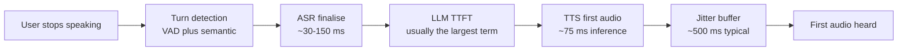
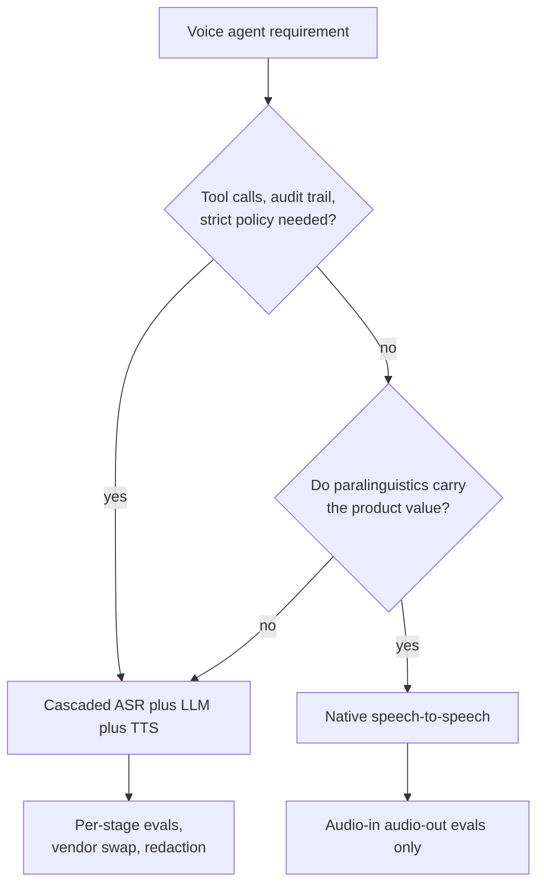
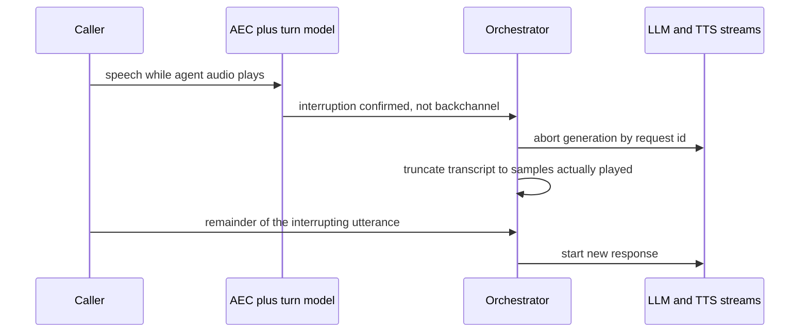
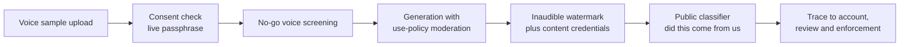
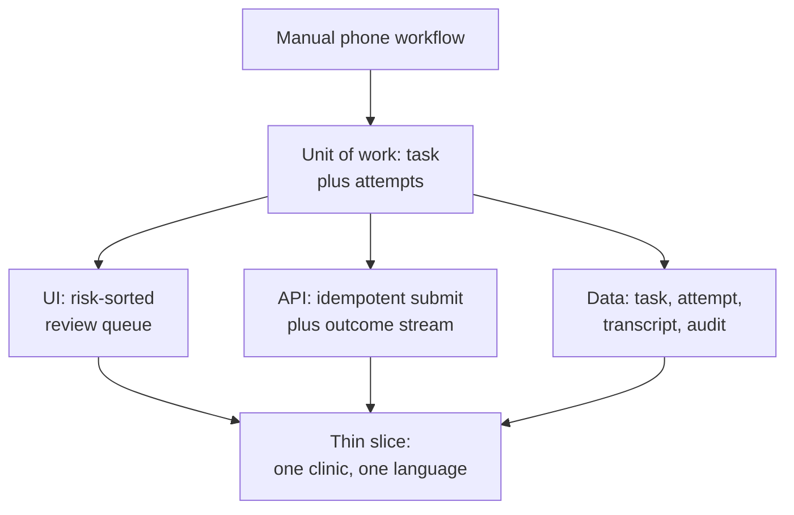
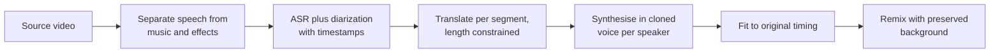

# 🎙️ ElevenLabs - AI Engineer Interview Questions

> **Last reviewed: October 2026.** Based only on public information - official pages, engineering blogs, technical reports, and publicly shared candidate reports. Processes change and vary by team; treat this as a map, not a contract. No confidential or leaked material.

## TL;DR

- Reported loop is five stages: recruiter screen, async coding screen (~90 min on CoderPad, 2-3 practical problems), project deep-dive/behavioural, a live practical coding round framed as a customer problem, and a **Product Decomposition** round. The official careers page adds that most processes end with a founder or Bar Raiser conversation.
- **Product Decomposition is the round candidates fail.** It is not infra system design. You get a messy real-world workflow and must decompose it into UI, API, data model and backend, then defend the trade-offs. One publicly shared Forward Deployed Engineer report describes the interviewer role-playing an airline CTO whose team reschedules flights by hand.
- Before your first live recruiter call you may meet an **ElevenLabs conversational agent**. The company has publicly described voice agents cloned from two of its own recruiters that answer candidate questions ahead of the human screen (2026 guides name them Becky and Oscar). Treat it as an FAQ, not a scored stage (reported, varies).
- Coding leans practical: data manipulation, API logic, "build something a customer would actually use." One report describes live Python in a Google Doc rather than an IDE (reported, varies). But at least one 2026 software-engineer guide describes the async screen as two LeetCode-medium problems plus a separate 60-minute live algorithmic screen (tree traversal, cycle detection, string manipulation) before the virtual onsite, so do not skip standard medium problems (reported, varies). Individual ownership is weighted heavily throughout - team-level language is explicitly discounted in several reports.
- Public loop information is **moderate**: third-party guides broadly agree on the five stages, plus a small number of first-hand candidate write-ups. Timeline is reported at roughly 2-5 weeks, with at least one report closer to six. Treat stage details as "reported, varies" and confirm with your recruiter.

## Company context

ElevenLabs builds audio AI: text to speech, speech to text (Scribe), voice cloning, dubbing, music, and an Agents platform that stitches ASR, an LLM and TTS into real-time voice agents over web and telephony. The technical centre of gravity is **latency under a hard real-time deadline** - their own guidance targets sub-700 ms end-to-end for natural conversation. As of October 2026 the models docs list Flash v2.5 at roughly 75 ms model inference, **Eleven v4 Turbo** as the most expressive real-time model at a median of roughly 100 ms across 90+ languages, Eleven v3 Conversational at roughly 280 ms, and Scribe v2 Realtime partial transcripts at roughly 150 ms (its launch post quoted 30-80 ms). Eleven v3 itself went GA in February 2026 as the expressive but non-real-time flagship. "AI engineer" here rarely means training foundation models; outside the research group it means shipping product on top of speech models fast, usually full-stack, often with a customer on the call. The company is a heavy hirer of **Forward Deployed Engineers** and Enterprise Solutions Engineers across dozens of countries, and the interview loop is shaped around that: can you take an ambiguous customer workflow and ship an end-to-end thing that works.

## Roles & titles they hire

From the public ElevenLabs careers board (August 2026):

- **Forward Deployed Engineer - Software Engineer** - posted across ANZ, Belgium, Brazil, Canada, Denmark, France, Germany, Italy, LATAM, Netherlands, Poland, Saudi Arabia, Singapore, Spain, Sweden, Switzerland, UAE and the US
- **Enterprise Solutions Engineer** - a similarly wide regional spread
- **Full-Stack Engineer**, plus **Back-End Leaning** and **Front-End Leaning** variants (remote across many locations)
- **Engineering - ElevenAPI** - the public API surface
- **Engineering - Internal AI Transformation**
- **Research Engineer** - the model-side group
- **Audio Engineering** - London, New York, San Francisco, Dublin, Tokyo, Warsaw, Bangalore
- **Safety Engineer - Free Tier Abuse**, **Detection Engineer**, **Infrastructure Security Engineer**, **Compliance Engineer** - the misuse and abuse side is staffed as its own discipline
- **Data Engineer**, **Android Engineer**, plus growth and IT roles
- **Enterprise Deployment - Chief of Staff**

The board is remote-first and unusually international, which matters: at least one public candidate report describes an offer falling through because the team ultimately hired only in San Francisco, so confirm location scope early.

## The interview loop

Public information is moderate. There is no official process page beyond a short paragraph on the careers site, so the table below merges that paragraph with several third-party guides and a small number of publicly shared candidate write-ups. Expect variation by role and region.

| Stage | Format | What's evaluated |
|---|---|---|
| Recruiter agent (pre-screen) | Self-serve conversation with an ElevenLabs voice agent modelled on a real recruiter | Not a scored stage. Answers process, benefits and culture questions before the human call (reported, varies) |
| Recruiter screen | ~30 min call, sometimes with the head of HR | Background, motivation, genuine interest in audio, and specifically what *you* built end to end |
| Async coding screen | ~60-90 min timed, CoderPad, reported as 2-3 medium to medium-hard problems. Some reports describe a CodeSignal-style 3-question hour instead | Practical data manipulation and API logic rather than algorithm puzzles. Front-end tracks may get a React take-home (reported, varies) |
| Live technical screen (some 2026 reports) | ~60 min live with a peer engineer | Algorithmic problem-solving such as tree traversal, cycle detection and string manipulation. Not every report includes this stage (reported, varies) |
| Project deep-dive / behavioural | 45-60 min | Projects you personally led. Probes decisions, failures, cost, deployment. Side projects with real users reportedly land well (reported, varies) |
| Practical coding | ~60 min live, framed as a customer problem | Requirements clarification then working code, usually Python. One report describes coding in a Google Doc, not an IDE (reported, varies) |
| Product decomposition | ~60 min, no code | Decompose a workflow into UI, API, data model and backend, and defend trade-offs. One FDE report: interviewer role-plays an airline CTO with manual flight rescheduling (reported, varies) |
| Final: hiring manager, founder or Bar Raiser | Conversation | The careers page states most processes end with a founder or Bar Raiser round |

Reported timeline is roughly 2-5 weeks, with at least one first-hand account nearer six. For account executive roles, 2026 guides report that the CEO personally holds the final conversation (reported, varies). Candidate sentiment on Glassdoor is mixed: interviews are rated moderately difficult, and the recurring complaints are patchy communication between rounds and rejections without feedback. Drive the process actively and ask for timelines in writing.

## What they emphasise

- **Real-time latency as a product constraint, not an optimisation.** Their public material treats sub-700 ms end-to-end as the bar for natural conversation and publishes per-stage numbers for ASR, TTS and network. Expect to be asked to build a latency budget out loud, with a number attached to each term.
- **End-to-end ownership.** Every public description of the loop repeats it: individual contribution, shipped to production, including the unglamorous parts. Rehearse projects where you owned deployment, cost and the on-call pager, not just the model.
- **Product judgement over infrastructure depth.** Product Decomposition explicitly replaces the classic system design round. They want to see you think like the founder of the feature: what is the user's job, what is the thinnest thing that ships, where does a human stay in the loop.
- **Customer-facing engineering.** FDE and Enterprise Solutions Engineer roles dominate the board. The practical coding round and the case study are both framed as customer problems, and diagnostic questioning before solutioning is scored.
- **Safety and misuse as first-class engineering.** Voice cloning consent verification, no-go voice blocking, an inaudible watermark plus the AI Speech Classifier, provenance work with C2PA, and traceability back to the generating account. They staff dedicated abuse and detection engineering roles, which tells you how seriously the topic is taken in interviews.
- **Evaluation without a ground truth.** There is no single correct waveform for an utterance. How you would measure "does this sound right" at scale is a live problem for them, and a reasonable probe in any technical round.

## Representative questions

*Representative questions synthesised from this company's publicly known focus areas and role descriptions - not leaked questions.*

### 1. Budget the end-to-end latency for a real-time voice agent. Why is time-to-first-audio a different problem from an LLM's time-to-first-token?

<details><summary><b>Answer</b></summary>

Name the target first. ElevenLabs' public guidance puts natural conversation below roughly 700 ms measured from the end of the user's speech to the first audible response: under 500 ms feels immediate, 500-1000 ms is noticeable and callers start repeating themselves, above 1 s they abandon.

In a cascade the floors add, so budget term by term:

- **Turn detection.** Silence-based VAD costs whatever hangover you configure, commonly 200-500 ms. This is usually the cheapest place to buy time back, which is why semantic turn prediction using prosody and syntax beats a fixed silence timer.
- **ASR finalisation.** Scribe v2 Realtime was quoted at 30-80 ms at launch, and the current models docs give roughly 150 ms for partial transcripts. Measure it on your own audio rather than trusting either number.
- **LLM time-to-first-token.** ElevenLabs' own writing calls this the single biggest contributor in most systems. Model choice and system prompt length are your levers.
- **TTS time-to-first-audio.** Flash v2.5 is quoted at ~75 ms model inference, with ~135 ms end-to-end to first audio byte. Eleven v4 Turbo, the more expressive real-time option, is quoted at a median of ~100 ms.
- **Network.** 20-200 ms per hop depending on geography, largely irreducible.
- **Player jitter buffer.** A 500 ms buffer is common and can silently dominate everything above it.

The difference from text TTFT is the deadline that starts *after* the first token. Text streaming has no real-time obligation once it begins. Audio does: from first sample you must sustain 1x real time forever, and an underrun is an audible gap, not a slower scroll. So you optimise two quantities at once, TTFA and probability of underrun, which means you cannot simply shrink the buffer. And the tail is what users feel: p99 TTFA is what gets described as "the bot froze".

**Worth sketching.** The additive budget makes it obvious which term to attack first.



**Follow-ups:** Which term would you attack first if the p50 is fine but p99 is 2.5 s? How does the budget change over PSTN telephony rather than WebRTC?

</details>

### 2. Cascaded ASR plus LLM plus TTS, or a native speech-to-speech model? Argue both sides for an enterprise support deployment.

<details><summary><b>Answer</b></summary>

Default to the cascade for enterprise support in 2026, and be able to say precisely why.

**The cascade wins on control.** You get a transcript, which is the artefact the whole enterprise stack is built around: redaction, compliance retention, QA scoring, analytics, guardrail checks on the text before it reaches TTS. You can swap any stage independently when a better ASR or a cheaper LLM lands. You can unit-test each stage. Tool calling and structured output are mature at the LLM layer. And when something goes wrong you have a span tree, not a mystery waveform.

**Speech-to-speech wins on what text destroys.** Reducing audio to text discards paralinguistics: the caller's frustration, hesitation, sarcasm, accent, whether they trailed off or finished. A native model keeps prosody and emotion in the representation and can respond in kind, and it removes two serialisation hops so latency floors drop materially. Published comparisons put S2S in the 250-350 ms range against 400-600 ms for tuned cascades.

**Where S2S is still uncomfortable for enterprise:** tool-calling maturity, harder guardrailing (you must moderate audio, or transcribe anyway and lose the advantage), no vendor hot-swap, evaluation that requires scoring audio in and audio out, and reported cost roughly an order of magnitude higher once conversational context accumulates per turn.

The honest answer is hybrid: cascade as the production spine, and lift specific paralinguistic signals such as detected emotion or interruption intent into the LLM context so you get some of the S2S benefit without giving up the transcript.

**Worth sketching.** The choice reduces to two questions, not a vendor comparison table.



**Follow-ups:** How would you moderate a speech-to-speech agent's output without transcribing it? What would make you migrate a shipped cascade to S2S?

</details>

### 3. Design barge-in for a voice agent. What breaks if you get it wrong?

<details><summary><b>Answer</b></summary>

Barge-in is the single feature that separates a voice agent from an IVR, and it has four parts.

**Hearing the user over yourself.** The agent's own audio is coming out of the caller's speaker and back into their microphone. Without acoustic echo cancellation your VAD triggers on the agent's voice and the agent interrupts itself into a loop. AEC is table stakes and needs a reference signal of exactly what you played.

**Deciding it is a real interruption.** A cough, a background TV, or a "mm-hmm" backchannel should not stop the agent. A word-count or duration threshold plus energy gating is the crude version; ElevenLabs' platform exposes model-driven turn detection that uses semantic and prosodic signals rather than raw silence, which handles backchannels far better.

**Stopping fast and everywhere.** On detection you must cancel the in-flight TTS generation, drop the client-side playback buffer, and cancel the LLM stream if it is still generating. If you only stop playback, you keep paying for tokens and audio nobody hears. Every stage needs a cancellation path, which is why request IDs and idempotent aborts matter.

**Repairing the context.** This is the part people miss. The agent's transcript must be truncated to what the caller *actually heard*, not what was generated. If the model generated three sentences and the buffer played one, storing all three means the agent believes it said things the caller never received, and the rest of the conversation is built on a false premise. Track played-sample count and truncate on a word boundary.

Get it wrong and you get talk-over loops, agents that repeat cancelled content, or agents that stubbornly finish a paragraph while the caller shouts.

**Worth sketching.** The cancellation fan-out and the transcript repair are the two non-obvious edges.



**Follow-ups:** How do you tune the backchannel threshold without a labelled dataset? What changes when the caller is on a speakerphone in a car?

</details>

### 4. Walk me through streaming TTS. How do you chunk input text, and how do you size the jitter buffer?

<details><summary><b>Answer</b></summary>

Streaming does not make the model faster. It changes *perceived* latency by starting playback on the first chunk instead of waiting for full synthesis. Everything below follows from that.

**Input chunking.** In an agent you are feeding TTS from an LLM that is itself streaming, so you choose when to flush partial text. Flush too early, on every token, and the model loses the prosodic context it needs: "Dr." before a name, a question mark that should raise the final pitch, a number whose reading depends on the following word. Flush too late and you burn your latency advantage. The practical rule is to buffer to a sentence or strong clause boundary for the first chunk, then relax for later chunks where prosody continuity matters less because the voice is already established. Keep a persistent WebSocket connection with context so successive chunks share conditioning rather than restarting cold; that is the main reason to prefer WebSocket over per-request HTTP for agents.

**Output buffering.** The player must absorb network jitter. Too small and any hiccup produces an audible dropout; too large and you have added hundreds of milliseconds that no model optimisation can recover. A 500 ms buffer is common as a starting point, but the right answer is adaptive: measure inter-chunk arrival variance and grow the buffer only when jitter warrants it. On a stable connection you can run 100-200 ms.

**Things that silently ruin it.** Proxies that buffer responses, no flush per chunk, TLS renegotiation mid-stream, and resampling. Also decide the failure policy up front: if generation stalls mid-utterance, do you play silence, insert a filler, or re-prompt. Silence past about 1 s reads as a dropped call.

**Follow-ups:** How would you make buffer sizing adaptive without oscillating? Where do you meter characters for billing when a stream is cancelled halfway?

</details>

### 5. Design the safety stack for voice cloning. Consent, watermarking, and abuse response.

<details><summary><b>Answer</b></summary>

Treat this as defence in depth, because a single control will be bypassed. ElevenLabs describes exactly that framing publicly: layered defences so that if one is bypassed the next catches the misuse.

**At upload: consent and identity.** Instant cloning from a short sample is inherently higher risk than professional cloning. For high-fidelity cloning, require the speaker to record a system-generated passphrase, which proves live access to the voice rather than access to a podcast feed. Screen against a **no-go list** of public figures, politicians and other high-risk voices, and re-screen periodically since the list grows. Capture consent scope explicitly: what use, what territory, what duration, and a revocation path, because the legal exposure is downstream of scope, not of the clone itself.

**At generation: policy plus provenance.** Text-side moderation for prohibited use classes, tighter limits on unverified free-tier accounts (they staff a dedicated free-tier abuse engineering role for a reason), and an inaudible watermark embedded in every output plus C2PA-style content credentials in the container.

**After the fact: detection and traceability.** A public classifier that answers "did this come from us", and per-account traceability so a flagged sample maps to the generating account. Both have real limits worth stating in an interview: watermarks degrade under aggressive re-encoding and re-recording through the air, classifiers have false positives that matter enormously when the accusation is fraud, and metadata is stripped by most platforms. So detection supports investigation, it does not replace upstream controls.

**Operationally:** red-team before release, human review queues, user reporting, and a law-enforcement escalation path.

**Worth sketching.** Each layer catches a different failure of the one before it.



**Follow-ups:** A journalist submits audio your classifier says is synthetic, but the account trace is empty. What do you tell them? How would you handle a legitimate voice actor whose clone is later revoked?

</details>

### 6. There is no single correct output for an utterance. How do you evaluate speech quality at scale?

<details><summary><b>Answer</b></summary>

Split the problem into things that have a ground truth and things that do not, and use different machinery for each.

**Objective, has a ground truth.** Run an ASR model over your own TTS output and measure word error rate against the input text. This catches the failures that actually generate support tickets: skipped words, hallucinated repetitions, mangled names, wrong number readings. Add pronunciation checks against a lexicon for domain terms, and duration and speaking-rate checks. These are cheap, deterministic and regression-testable in CI.

**Subjective, no ground truth.** Naturalness and expressiveness need human preference. MOS on a 1-5 scale is the classic instrument but drifts between rater pools, so **CMOS**, side-by-side comparison against a reference system, is more reliable for release decisions because each rater judges a pair rather than an absolute. Public Elo-style TTS arenas that collect pairwise votes on anonymised samples work on the same principle at population scale, and ElevenLabs models are ranked on them.

**Automated proxies** such as UTMOS-style predictors and speaker-similarity embeddings for clone fidelity let you screen thousands of samples, but calibrate them against human votes before you trust a regression signal.

**Online is where truth lives.** For an agent, quality is task success: did the caller complete the task, how often did they say "what?" or ask for repetition, interruption rate, call abandonment, escalation to human. Those correlate with perceived quality better than any offline number.

Two traps worth naming: cherry-picked demo sentences hide long-form failures, so evaluate on long, ugly, real text including code-switching and abbreviations; and any single aggregate hides per-language and per-voice regressions, so always slice.

**Follow-ups:** How do you build a regression suite that catches a prosody regression an ASR-based WER check would pass? How many CMOS raters do you need to detect a small quality change?

</details>

### 7. Product decomposition: a hospital group schedules and confirms outpatient appointments by phone, manually, with three staff on a rota. Design what we would build for them.

<details><summary><b>Answer</b></summary>

Start by refusing to design until you understand the workflow. Ask: what fraction of calls are inbound versus outbound reminders, what happens today when the patient does not answer, who is liable if a slot is booked wrongly, what system of record holds the calendar, what languages, and what the staff actually spend their time on. In a decomposition round, the diagnostic questions are scored as heavily as the design.

**Name the unit of work.** Not "a call": a **task** with an outcome, such as "confirm or reschedule appointment X". A task may span several call attempts, a voicemail and an SMS fallback. Everything else hangs off that model.

**Data model.** Task, attempt, transcript, extracted outcome, and an audit record. Attempts are immutable, tasks carry current state. This is what makes retries, reporting and compliance possible later.

**API.** Idempotent task submission keyed by appointment ID so a retried request never double-calls a patient, a status stream or webhook for outcomes, and a structured outcome payload rather than free text.

**Backend.** Agent orchestration with tool calls into the scheduling system, a retry policy with quiet hours, and a hard escalation path to a human queue on any low-confidence outcome. Consent and recording notices are a legal requirement, not a feature.

**UI.** The staff-facing surface is a review queue, not a dashboard. Sort by risk: failed identity checks, ambiguous outcomes, patients who asked for a human. Every row plays the audio next to the transcript and the extracted outcome so a human can confirm in seconds.

**Scope.** Ship outbound confirmations only, in one clinic, one language, with human review on 100% of outcomes. Loosen review as the confusion matrix earns it.

**Worth sketching.** The three surfaces all fall out of the task model, which is the point of the round.



**Follow-ups:** How do you decide when to stop reviewing 100% of outcomes? What is your rollback if the agent misbooks a slot at 2am?

</details>

### 8. Practical coding: write a service that proxies streaming TTS to a browser and cancels cleanly when the user navigates away.

<details><summary><b>Answer</b></summary>

The requirement worth surfacing before writing code: a disconnected client must cancel the upstream generation. Otherwise you keep paying for characters nobody hears, and at agent scale abandoned streams become a real cost line.

```python
import asyncio, contextlib
from fastapi import FastAPI, Request
from fastapi.responses import StreamingResponse

app = FastAPI()

@app.post("/speak")
async def speak(request: Request):
    body = await request.json()
    upstream = await tts.open_stream(body["text"], body["voice_id"])

    async def audio():
        played = 0
        try:
            async for chunk in upstream:
                if await request.is_disconnected():
                    break
                played += len(chunk)
                yield chunk
        except asyncio.CancelledError:
            raise
        finally:
            with contextlib.suppress(Exception):
                await upstream.close()      # idempotent, stops billing
            await meter.record(body["request_id"], played)

    return StreamingResponse(audio(), media_type="audio/mpeg")
```

Points to say out loud. The `finally` block is the contract: close upstream on disconnect, on exception and on normal completion, and make close idempotent. Metering on bytes actually delivered, not characters submitted, is the honest choice and it is also what you need for the transcript truncation problem in a live agent. Do not buffer the whole response to set `Content-Length`; chunked transfer with flush per chunk is the point. Disable proxy buffering explicitly or your carefully optimised time-to-first-audio disappears into nginx.

For an agent rather than a one-shot request, upgrade this to a WebSocket so successive text chunks reuse the same conditioned stream, and add a client-to-server cancel message so barge-in does not have to rely on TCP teardown, which can take seconds to notice.

**Follow-ups:** How do you propagate a mid-stream upstream failure to a client that already received a 200 and some audio? Where would you add a cache, and what is the cache key for a voice plus text pair?

</details>

### 9. Design the dubbing pipeline: an English video becomes Spanish, same speakers, same timing.

<details><summary><b>Answer</b></summary>

Six stages, and the hard problem is not translation.

**Source separation.** Split speech from music and effects first. If you skip this, the dubbed track loses the original score and ambience, and every viewer notices. The separated background is remixed back at the end untouched.

**ASR with diarization and timestamps.** You need who spoke, what they said, and precise start and end times per segment. Diarization errors propagate: a mis-attributed segment gets synthesised in the wrong voice, which is far more jarring than a translation error.

**Translation with a length constraint.** This is the stage people underestimate. Spanish is typically longer than English for the same content, so a faithful translation overruns its slot. You need translation that optimises for meaning *and* target duration, which means generating candidates and selecting on estimated speech length, or explicitly instructing for brevity per segment. Context across segments matters too: pronouns and formality register need the surrounding dialogue.

**Voice cloning per speaker.** Clone from clean separated speech per diarized speaker so the Spanish keeps the original timbre. Quality here depends entirely on the separation stage.

**Timing fit.** Even with length-aware translation you will be off. Levers in order of how much they degrade quality: adjust pauses between phrases, mild speaking-rate adjustment (roughly within 10%, beyond that it sounds like a chipmunk or a sedative), and only then time-stretching the audio. Lip-sync-grade fit needs viseme-aware alignment and is a different product tier.

**Remix and QC.** Recombine with the preserved background, then evaluate: ASR the output in Spanish and check against the translation, check per-segment drift, and human-spot-check the emotional register.

**Worth sketching.** Separation at the front is what makes the last stage possible.



**Follow-ups:** Two speakers overlap for four seconds. What does your pipeline do? How do you handle a proper noun that should not be translated but must be pronounced natively?

</details>

### 10. Text normalisation is where TTS quality actually dies in production. Walk me through it.

<details><summary><b>Answer</b></summary>

A modern TTS model handles prosody well and still says "one thousand two hundred and thirty four" when the customer meant a room number. Normalisation is the unglamorous layer that decides whether an enterprise deployment is usable.

**The categories that break.** Numbers are context-dependent: 1234 is a year, a quantity, a room, a PIN or part of a phone number, and each is read differently. Currency and units need locale rules. Dates and times differ by region, so 03/04 is ambiguous by construction. Abbreviations are homographs: "Dr." is Doctor or Drive, "St." is Saint or Street. Acronyms may be spelled out or pronounced as words, and the same string can be either depending on domain. Then URLs, emails, code identifiers, and IDs that must be read character by character with grouping pauses so a human can write them down.

**Homographs need semantics.** "lead", "read", "live", "bass", "wound" cannot be resolved lexically. Either the model learns it from context or you disambiguate upstream.

**Code-switching.** A Spanish sentence containing an English product name needs the product name in English phonology, not Spanish. Naive normalisation makes this worse, not better.

**How to build it.** Rules first for the deterministic locale-bound cases, because they are auditable and a customer can file a bug against a rule. A learned normaliser handles the long tail but can hallucinate, so constrain it or verify with a round-trip check. Give customers explicit control: a pronunciation lexicon, phoneme overrides, and alias mappings for their brand and product names. In practice, shipping a per-customer lexicon fixes more perceived quality complaints than any model upgrade.

**Verification.** ASR the output and compare against the *expected spoken form*, not the raw input string. That is the regression test.

**Follow-ups:** A bank wants account numbers read in groups of four with pauses. Where does that live, the normaliser or the model? How do you version a customer lexicon without regressing their old audio?

</details>

### 11. As an FDE: a contact centre wants to replace its IVR with voice agents. Run the engagement.

<details><summary><b>Answer</b></summary>

**Diagnose before designing.** Pull their call taxonomy and volumes. Typically a small number of intents cover most calls, and those are where the value is. Ask what their current containment rate is, what average handle time costs them, what their CSAT baseline is, and which calls they would never let an agent touch. Get the number that defines success before proposing anything.

**Expect the telephony to be the hard part**, not the AI. PSTN audio is 8 kHz narrowband on a G.711 or G.729 codec, which is materially worse input than the clean 16 kHz your demo used, so ASR accuracy drops and you must benchmark on their actual recordings. Carrier and SIP hops add latency on top of your model budget. DTMF still has to work because callers press keys. You need warm transfer to a human agent carrying context, not a cold re-queue. And recording notices, consent, and data residency are gating requirements in most jurisdictions.

**Prove it narrowly.** Take one intent, shadow it first against recorded calls, then run a small percentage of live traffic with a human fallback on every uncertain turn. Measure containment, escalation rate, handle time, and abandonment rather than a model metric.

**Then be honest about the boundary.** Tell them which intents should stay with humans and which should stay as DTMF because a menu is genuinely faster than a conversation. An FDE who scopes a customer *down* to something that works in three weeks earns more trust than one who promises full replacement.

**Integration reality.** Their CRM and scheduling APIs will be slow, inconsistent and occasionally down. Design tool calls with timeouts short enough to fit inside the conversational latency budget, and have the agent say something natural while waiting rather than going silent.

**Follow-ups:** Their ASR accuracy on your benchmark is 8 points worse than your marketing number. What do you say in the room? How do you price a pilot when you do not yet know the containment rate?

</details>

### 12. Serving real-time TTS is a different capacity problem from serving a text LLM. Why, and how do you plan capacity?

<details><summary><b>Answer</b></summary>

Text LLM serving optimises tokens per second per GPU, and you buy throughput by batching aggressively because decode is memory-bandwidth-bound and idle FLOPs are free. Real-time speech inverts several of those assumptions.

**You are concurrency-bound, not throughput-bound.** Every active stream must be served at or above 1x real time, continuously, for the length of the utterance. A batching policy that raises aggregate throughput while pushing any individual stream below real time produces audible stutter, so the batch dial has a hard ceiling that a text service does not have. Capacity is "how many simultaneous streams can I hold at real time", and that is what you provision against.

**The latency distribution matters more than the mean.** In text serving a slow p99 request is a slow answer. In speech it is a broken call. So you provision for p99 headroom, keep utilisation targets lower than you would for a batch text service, and treat a rising underrun rate as the paging metric rather than queue depth.

**Traffic shape is different.** Agent traffic is bursty and correlated with business hours per region, and a call holds a slot for minutes rather than seconds. Autoscaling on GPU utilisation lags badly against that; scale on concurrent sessions and admission-control at the edge, because rejecting a session at connect time is far better than degrading fifty live calls.

**Model tiering is the main cost lever.** Low-latency real-time models (Flash v2.5, Eleven v4 Turbo) for interactive agents, larger expressive models for asynchronous generation such as audiobooks and dubbing, which *is* a throughput problem and can be batched hard on cheaper capacity. Routing correctly between the two tiers matters more than kernel work.

Also: geography. A model close to the caller saves 20-200 ms of the budget, so replication is a latency decision, not just a redundancy one.

**Follow-ups:** How would you drain a region for a deploy without dropping live calls? What is your admission-control policy when demand exceeds real-time capacity by 20%?

</details>

### 13. A customer's voice agent runs on Flash v2.5. Product wants the newer, more expressive real-time model. How do you decide, and how do you roll it out?

<details><summary><b>Answer</b></summary>

Treat it as a product experiment with a latency and risk budget, not a model upgrade. In 2026 the lineup forces a real choice: Flash v2.5 at roughly 75 ms, Eleven v4 Turbo described as the most expressive real-time model at a median of roughly 100 ms, and Eleven v3 Conversational at roughly 280 ms for dramatic, multi-speaker delivery. The question is whether the expressiveness buys task outcomes worth the added milliseconds and new failure modes.

**Latency.** Put the new median into the Q1 budget, but decide on p95 and p99 TTFA measured from the customer's regions over their telephony path. A 25 ms median gap is noise next to LLM TTFT, while a fatter tail is not. A 280 ms model eats much of a sub-700 ms budget on its own.

**Behaviour.** Expressive models interpret text. That is the point, and also the risk: a cheerful lilt on "your claim was denied", inconsistent delivery of the same scripted line across calls, or a regulated disclosure read with the wrong emphasis. If emotion is steered by tags the LLM emits, those tags are now model output that needs guardrails, because a prompt-injected caller can influence them.

**Consistency.** The same voice ID can sound different on a different model. For a brand voice, rerun cloning and voice-design checks, and get the customer to sign off on samples before any live traffic.

**Evaluation.** Re-run the WER-on-own-output suite, including numbers, names and normalisation edge cases, because a new model can regress them. Then A/B on live traffic, split by call rather than by turn so a caller never hears the voice change mid-conversation. Score containment, repeat-request rate, interruption rate, abandonment and CSAT, not a naturalness rating.

**Rollout.** Model choice should be per agent and ideally per intent: expressive for sales or companionship flows, Flash for authentication and payments, where clarity and predictability beat warmth. Keep instant rollback to the old model with the old voice settings.

**Follow-ups:** The A/B shows higher CSAT but a small rise in "can you repeat that?". What do you ship? How would you guardrail emotion tags without flattening delivery?

</details>

## How to prepare

**Repo topics, in priority order:**

- **[11-ai-system-design](../11-ai-system-design/README.md)** - Product Decomposition is the round that decides the loop. Closest case study is **[03-customer-support-agent](../11-ai-system-design/case-studies/03-customer-support-agent.md)**: swap the text channel for voice and the latency budget, human handoff and escalation logic all transfer directly. Practise Q7 above out loud, with a timer.
- **[06-agents-and-tool-use](../06-agents-and-tool-use/README.md)** - their Agents platform is the product. Tool calling, state, interruption, escalation and failure handling all come up.
- **[10-multimodal](../10-multimodal/README.md)** - the audio-specific material: ASR, TTS, speech representations, and where speech-to-speech models sit.
- **[08-inference-and-production](../08-inference-and-production/README.md)** - streaming, cancellation, latency budgets, capacity. Q1, Q4 and Q12 above live here.
- **[12-coding-challenges](../12-coding-challenges/README.md)** - the async screen is practical rather than algorithmic, but there is still a timed screen to pass. Practise API and data-manipulation problems under time.
- **[07-evaluation-and-observability](../07-evaluation-and-observability/README.md)** - evaluating output with no ground truth is a genuine open problem for them and a fair probe in any round.
- **[09-safety-security-and-responsible-ai](../09-safety-security-and-responsible-ai/README.md)** - consent, cloning misuse, watermarking, provenance. They staff this as its own discipline.
- **[13-interview-process-and-behavioral](../13-interview-process-and-behavioral/README.md)** - individual ownership is weighted unusually heavily. Rewrite your stories in "I" and include the cost, the deploy and the failure.

**Company-specific moves:**

1. **Build something on their API before the interview.** Wire up a voice agent, measure your own time-to-first-audio, break it deliberately. Public reports say side projects with real users are premium material, and "I built X and hit Y ms" is the strongest possible opener.
2. **Read their latency material closely.** The docs page on latency, the conversational AI latency posts, the Flash and Scribe announcements, and the current models overview, which is where newer real-time models such as Eleven v4 Turbo appear first. Memorise the per-stage numbers so you can build a budget out loud in Q1's shape.
3. **Rehearse Product Decomposition as a format, not a topic.** Take three messy manual workflows you know, and for each produce the unit of work, data model, API, UI surface and a one-week thin slice in twenty minutes. Ask diagnostic questions before designing.
4. **Convert every project story to first person and to shipped outcomes.** Multiple reports say interviewers actively separate your work from your team's. Have the deploy, the cost and the thing that broke ready.
5. **If you are interviewing for FDE or Enterprise Solutions Engineer,** prepare for role-play. Practise being handed a hostile, vague customer problem and asking five sharp questions before saying a single word about architecture.
6. **Confirm location scope with your recruiter early.** The board is global but at least one public account describes a role narrowing to San Francisco late in the process.

## Sources

- [ElevenLabs - Careers](https://elevenlabs.io/careers) (fetched August 2026; interview-process paragraph and hiring philosophy)
- [ElevenLabs - Open positions](https://elevenlabs.io/careers/positions) (fetched August 2026; role titles and locations above)
- [ElevenLabs Jobs on Ashby](https://jobs.ashbyhq.com/elevenlabs/)
- [ElevenLabs - Agents and the candidate experience](https://elevenlabs.io/blog/agents-and-candidate-experience) (the recruiter voice agents)
- [ElevenLabs docs - Understanding latency](https://elevenlabs.io/docs/eleven-api/concepts/latency) (time-to-first-audio components, buffering, model trade-offs)
- [ElevenLabs - How do you optimize latency for Conversational AI?](https://elevenlabs.io/blog/how-do-you-optimize-latency-for-conversational-ai) (per-stage budget and the sub-700 ms target)
- [ElevenLabs - Scribe v2 Realtime in ElevenLabs Agents](https://elevenlabs.io/blog/scribe-v2-realtime-in-elevenlabs-agents) (30-80 ms ASR latency, FLEURS WER claim)
- [ElevenLabs - Meet Flash](https://elevenlabs.io/blog/meet-flash) and [Models overview](https://elevenlabs.io/docs/overview/models) (fetched October 2026; Eleven v4 Turbo ~100 ms median, Eleven v3 Conversational ~280 ms, Scribe v2 Realtime partials ~150 ms, Agents Platform model recommendations)
- [TechPrep - ElevenLabs's interview process (2026)](https://www.techprep.app/blog/elevenlabs-interview-process) (third-party guide; recruiter agents, two-problem async screen, live algorithmic screen, 2-4 week timeline)
- [ElevenLabs - Eleven v3](https://elevenlabs.io/blog/eleven-v3)
- [ElevenLabs - Safety](https://elevenlabs.io/safety) (layered defences, no-go voices, AI Speech Classifier, C2PA, traceability)
- [Exponent - ElevenLabs Forward Deployed Engineer interview experience](https://www.tryexponent.com/experiences/eleven-labs-solutions-architect-interview-ce0689) (first-hand: five rounds, airline CTO case study, Google Doc coding, six-week timeline)
- [Exponent - ElevenLabs software engineer interview guide](https://www.tryexponent.com/guides/elevenlabs-software-engineer-interview) (third-party guide; stage formats marked "reported" above)
- [DesignGurus - What is the ElevenLabs interview process like, round by round](https://www.designgurus.io/answers/detail/what-is-the-elevenlabs-interview-process-like-round-by-round) (third-party guide; five-stage breakdown and 3-5 week timeline)
- [Glassdoor - ElevenLabs interview questions](https://www.glassdoor.com/Interview/ElevenLabs-Interview-Questions-E9081894.htm) (aggregate sentiment and difficulty; the page blocks automated fetch, figures cited above came via search summaries)
- Artificial Analysis text-to-speech leaderboard, which ranks ElevenLabs models by pairwise-preference Elo (referenced in Q6)
