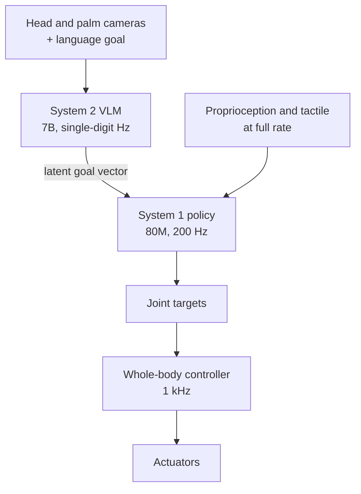
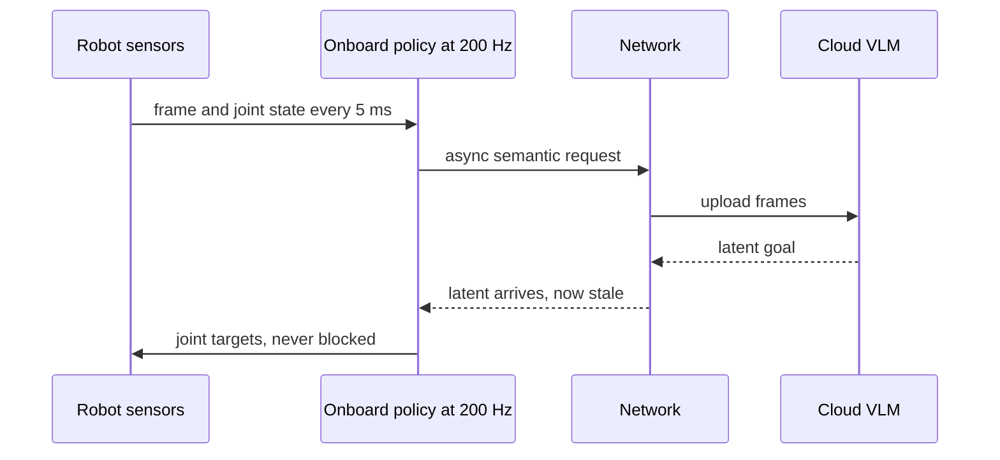
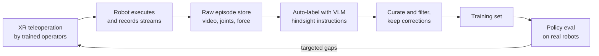
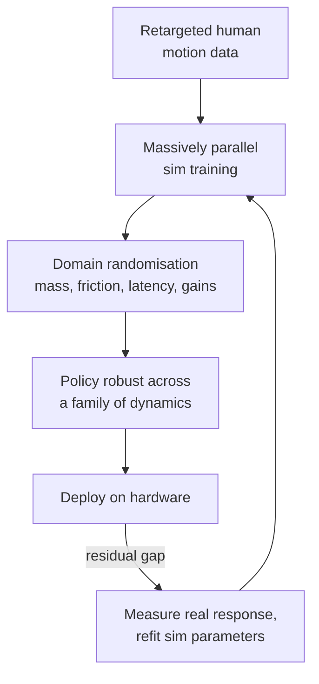
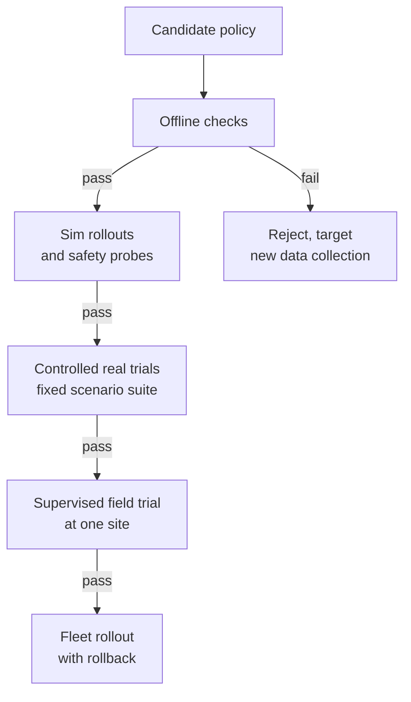
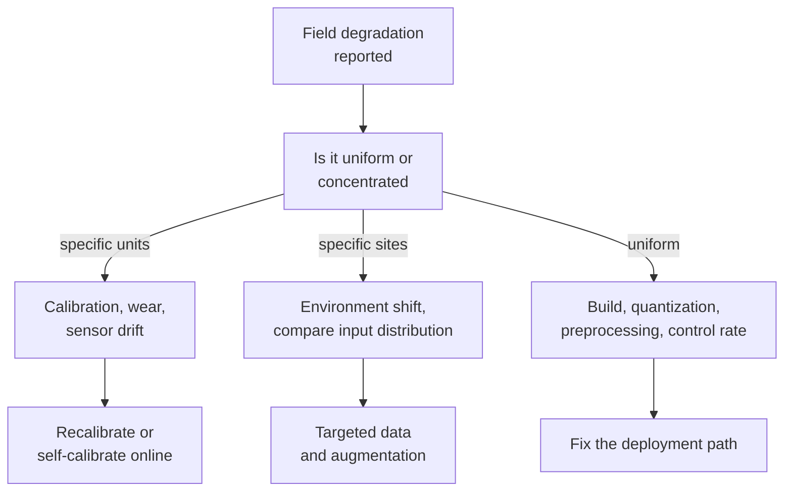
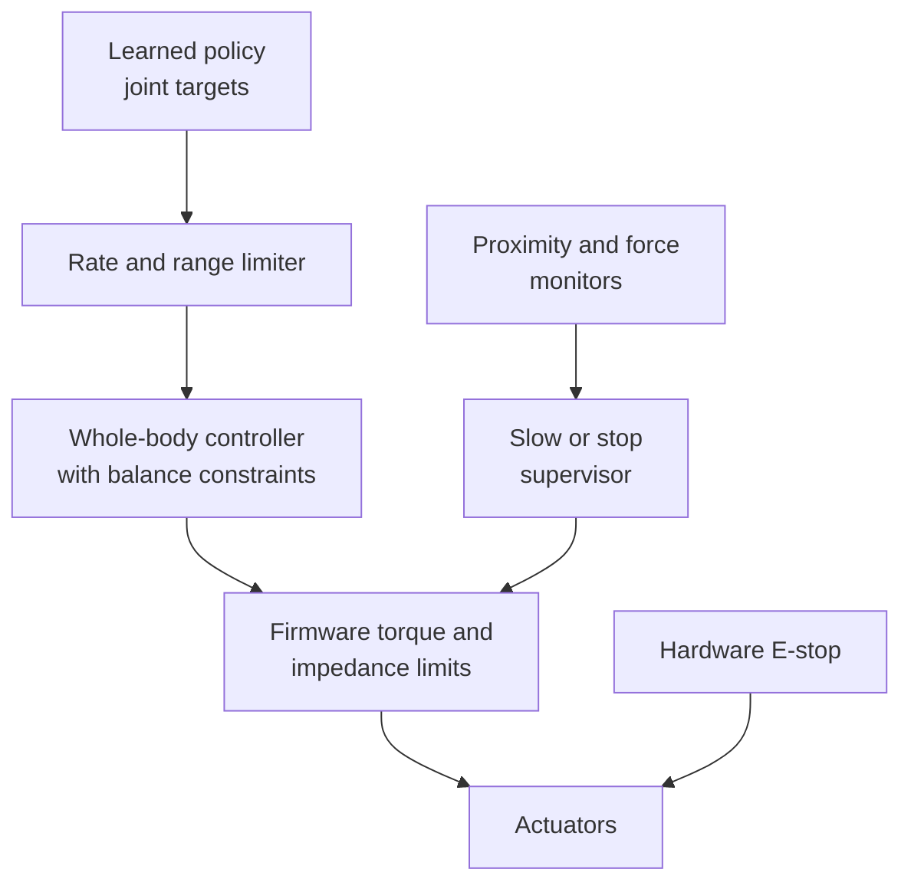

# 🤖 Figure AI - AI Engineer Interview Questions

> **Last reviewed: October 2026.** Based only on public information - official pages, engineering blogs, technical reports, and publicly shared candidate reports. Processes change and vary by team; treat this as a map, not a contract. No confidential or leaked material.

## TL;DR

- Public detail on Figure's loop is **thin**. There is no official process page, and the candidate reports that exist are sparse and skewed towards non-AI roles. The shape below is **inference** from a handful of Glassdoor-style reports plus what is typical for a robotics-plus-frontier-model startup: recruiter screen → one or two technical conversations with engineers → a project or case-study deep-dive → onsite in San Jose → leadership round.
- One publicly reported detail worth knowing: a first technical round described as roughly 30 minutes with an engineer, **no coding**, conceptual questions on behaviour cloning and reinforcement learning (reported, varies). Do not assume a LeetCode gate; assume a "can you actually reason about embodied learning" gate.
- The centre of gravity is the **Helix** stack: a vision-language-action model split into a slow semantic layer and a fast reactive controller, running entirely onboard the robot. If you cannot explain why that split exists, you will not get far.
- Expect probing on **data**, not just models. Figure's published results turn on teleoperation data volume, curation quality, and auto-labelling far more than on architecture novelty. Data collection is the bottleneck in this field and they know it.
- The 2026 shift is **human video as pretraining data**. In August 2026 Figure launched **Index**, a consumer app through which paid contributors record themselves doing everyday tasks, and in September it reported that **Helix 2.5**, pretrained from scratch on Index, reached 56 percent zero-shot success across 30 unseen homes against 9 percent for a scratch-trained baseline. Expect questions on the embodiment gap and on how you would judge a claim like that. The board also now lists Helix data-infrastructure, backend and Android engineering roles (reported, varies).
- Expect **physical-consequence thinking**: latency budgets in milliseconds, sim-to-real transfer, evaluation where every trial costs robot time, and safety around humans. Roles are onsite in San Jose, reportedly five days a week, because you cannot debug a humanoid over Slack.

## Company context

Figure builds general-purpose humanoid robots (the Figure 03 platform) and the AI system that drives them (Helix). Helix is a vision-language-action model: cameras, tactile sensors, proprioception and a natural-language goal go in, continuous joint commands come out, with a single set of weights covering many behaviours rather than a policy per task. They manufacture their own robots at a facility called BotQ and deploy them into logistics and industrial customers, which means every fielded robot is also a data-collection unit. In 2026 they added a second data engine, Index, a crowd-sourced human-video dataset collected through a contributor app, and signed a compute partnership with Nscale for up to 100,000 GPUs. Engineers want in because this is one of the few places where a frontier-scale learned model closes the loop on physical hardware at commercial scale, and because the hard problems (data, generalisation, evaluation) are genuinely unsolved. "AI engineer" here means modelling, robot learning, RL, perception, pretraining, training infrastructure, and whole-body control - not LLM API plumbing.

## Roles & titles they hire

From Figure's public Greenhouse board (August 2026), the AI group is organised as the **Helix Team**, with a separate **Controls** group:

- **Helix AI Engineer, Modeling** - core architectures for perception, reasoning and action across multimodal inputs; world models and representation learning listed as preferred background
- **Helix AI Engineer, Robot Learning** - visuomotor manipulation policies, explicitly weighted towards real-robot deployment over simulation; owns data collection through deployment
- **Helix AI Engineer, Reinforcement Learning** - policy optimisation, reward modelling, robustness to noise and partial observability, distributed training infrastructure
- **Helix AI Engineer, Perception**
- **Helix AI Engineer, Pretraining** and **Helix AI Engineer, Video Pretraining**
- **Helix AI Engineer, Training Performance** - large-scale training throughput
- **Helix AI Engineer, Generative AI**
- **Helix AI Engineer, Localization and Mapping**
- **Helix AI Engineer, XR** - the teleoperation and demonstration-capture side
- **AI Engineer, Post-Training - Helix Team**
- **Robot Manipulation Engineer - Helix Team**
- Controls: **Reinforcement Learning Engineer - Whole Body Control**, **AI Training Infrastructure Engineer - Humanoid Whole Body Control**, **State Estimation Engineer - Data Collection Systems**
- Data side: **Helix Data Creator** (teleoperation operators) and **AI Data Operations Manager**

A recheck of the board in October 2026 (roughly 98 open roles) also showed **Helix AI Engineer, Data Infrastructure**, **Helix AI Engineer, Backend**, **Helix AI Engineer, Android** and a **Humanoid Robot Pilot** role, while some titles above were no longer listed. Postings rotate, so treat the list as a snapshot.

Most AI roles are San Jose, CA, onsite. The postings name PyTorch, behaviour cloning, reinforcement learning, imitation learning, offline RL, distributed training, and simulation and digital-twin tooling. Several list prior work at a frontier lab (OpenAI, DeepMind, Anthropic, xAI are named in postings) as a bonus, which tells you the calibre bar and the fact that they hire pure ML people without robotics backgrounds. Figure AI is listed on [levels.fyi](https://www.levels.fyi/jobs/company/figure-ai) if you want to track postings there.

## The interview loop

**Public information on Figure's loop is thin and should be treated as inference, not fact.** There is no official interview-process page. Glassdoor holds a small number of reports across all job families (many for technician and manufacturing roles rather than AI), reporting an average time to hire of roughly two weeks, an interview-difficulty rating just under 3 out of 5, and a notably low positive-experience rate with complaints about slow recruiter follow-up. Third-party prep guides exist but appear to be inferred rather than sourced. The table below is the shape you should plan for, drawn from the few reports available plus the standard pattern at a robotics-plus-frontier-model startup of this size.

| Stage | Format | What's evaluated |
|---|---|---|
| Recruiter screen | ~30 min call | Background, why embodied AI, willingness to be onsite in San Jose (reported, varies) |
| Technical conversation 1 | ~30 min with an engineer, reportedly no coding | Conceptual depth on behaviour cloning, RL, imitation learning; how you think about robot data (reported, varies) |
| Technical conversation 2 / coding | Live coding or a take-home in Python and PyTorch | Implementing a training or data-pipeline component; tensor and shape fluency (inferred, category-typical) |
| Project or case-study deep-dive | Presentation plus grilling, reported to need real prep time | Your own past work defended in detail: what you built, why, what failed, what the data showed (reported, varies) |
| Onsite in San Jose | Back-to-back rounds, cross-functional | Modelling depth, systems design for a robot learning stack, collaboration with controls, perception and operations (inferred) |
| Hiring manager / leadership | Conversation | Speed, ownership, comfort with hardware-in-the-loop iteration (inferred) |

Plan for the deep-dive as the round that decides the outcome. In a shop that ships weekly and measures itself on real-robot task success, the strongest signal is a detailed account of a system you actually got working on hardware, including the parts that did not work.

## What they emphasise

- **Real robots over simulation.** The Robot Learning posting is explicit that the emphasis is real-world deployment, and asks for people who have shipped learning systems onto physical hardware. A candidate whose entire experience is sim benchmarks will be pushed on what breaks in the transfer.
- **One model, many behaviours.** Helix's public claim is a single set of weights covering all behaviours with no task-specific fine-tuning. Expect scepticism towards answers that reach for a per-task policy, a state machine, or hand-engineered fallbacks.
- **Data quality beats data volume, but volume still matters.** Their logistics write-ups show both: a curated dataset beating one with a third more data, and a clean scaling curve from 10 to 60 hours of demonstrations. Be able to argue both sides with numbers.
- **The full-body, pixels-to-actuators story.** Helix 02 extended control from upper body to legs, torso, head, arms, wrists and fingers, with a learned whole-body controller replacing a very large hand-written C++ controller. The direction of travel is: replace engineered layers with learned ones, and prove it with task success, not elegance.
- **Latency is a hard constraint, not a metric.** Published rates are a semantic layer in the single-digit Hz, a visuomotor policy at 200 Hz, and a whole-body controller at 1 kHz, all onboard. Any answer that assumes a cloud round trip in the control loop is wrong here.
- **Commercial deployment discipline.** Robots are running at customer sites, so throughput per unit time, reliability across a fleet of hundreds, and behaviour near people are business metrics, not research curiosities.

## Representative questions

*Representative questions synthesised from this company's publicly known focus areas and role descriptions - not leaked questions.*

### 1. What is a vision-language-action model, and how is it different from an LLM with tools?

<b>Answer</b>

A VLA maps raw sensor observations plus a language goal directly to continuous low-level actions, autoregressively or in chunks, inside a tight closed loop. An LLM with tools maps text to a discrete symbolic call, a tool executes it, and the result comes back as text. The difference is not the size of the model, it is the nature of the output space and the loop rate.

Three concrete consequences:

**Output space.** A tool call is a token sequence from a small vocabulary that either parses or does not. A VLA emits real-valued joint targets across tens of degrees of freedom. Helix's public description covers wrist poses, finger flexion and abduction, torso and head orientation, and in the Helix 02 generation the legs as well. There is no retry, no parse error, and no "the model chose the wrong tool" - there is a trajectory the hardware follows.

**Loop rate.** A tool-using agent can take seconds per step. A humanoid policy has to close the loop fast enough to react to contact and to keep balance. Figure publishes a visuomotor policy at 200 Hz and a whole-body controller at 1 kHz. Anything that cannot run at that rate has to live outside the loop.

**Error dynamics.** An LLM's mistake produces a wrong answer. A VLA's mistake changes the world, and the model's next input is the world it just changed. Errors compound through the state distribution rather than through a context window.

The overlap is real: a VLA typically starts from a pretrained vision-language model so that "pick up the red mug" transfers to a mug it has never seen. But the pretrained model contributes semantics, not control. Figure's Helix 2.5 is a notable exception: it reports pretraining from random initialisation on its own human-video dataset instead of starting from an internet VLM.

**Follow-ups:** Where do discrete tool calls still make sense on a humanoid? What would you have to give up to make a VLA fully autoregressive over single actions instead of chunks?

### 2. Helix splits into a large slow model and a small fast one. Why not run a single end-to-end network?

<b>Answer</b>

Because the two jobs have incompatible requirements. Semantic understanding ("that is a dish rack, the mug goes bowl-down") wants a big internet-pretrained model and tolerates latency. Reactive control (recover from a slipping grasp, keep the torso balanced) wants milliseconds and tolerates being small and dumb about the world.

Figure's published numbers make this concrete: System 2 is a 7B open-weight VLM running at roughly 7 to 9 Hz, distilling the scene and instruction into a latent vector. System 1 is an 80M cross-attention encoder-decoder transformer that consumes that latent plus full-rate sensing and emits control at 200 Hz. Helix 02 adds System 0, a 10M-parameter learned whole-body controller emitting joint-level actuator commands at 1 kHz. These are the published Helix and Helix 02 figures. The Helix 2.5 post does not restate the architecture, so do not quote them as current without checking.

Run one network end to end and you pick a single rate. Run it at 200 Hz and the semantic model must be tiny, so generalisation to unseen objects collapses. Run it at 8 Hz and the robot cannot react to contact events, which is where manipulation actually lives.

The interface is the design decision worth defending. A latent vector rather than text keeps it differentiable and low bandwidth, lets S1 learn what to do with information S2 cannot verbalise, and means S2 can be swapped or upgraded without retraining low-level motor skills. The subtle part is the asynchrony: S1 is always acting on a latent that is one or more S2 cycles stale. Figure's published approach is to reproduce that same temporal offset during training so that inference does not sit outside the training distribution. That is the kind of detail an interviewer is listening for.

**Worth sketching.** The two rates and where full-rate sensing bypasses the slow model.

**Follow-ups:** What happens to behaviour if S2 stalls for a full second? How would you decide whether a new capability belongs in S2, S1, or the data?

### 3. A colleague wants to move the semantic layer to the cloud so you can use a much bigger model. Walk me through the latency budget.

<b>Answer</b>

Split the loop first, because the answer differs by layer.

**The 200 Hz layer cannot move.** One control step is 5 ms and the 1 kHz controller under it is 1 ms. A cloud round trip is tens of milliseconds at best on a good wired link, hundreds on industrial Wi-Fi with contention, and unbounded when the AP hands off or the uplink saturates. You would miss thousands of control cycles per minute. This layer stays onboard, full stop. Figure runs the whole stack on onboard embedded GPUs for exactly this reason.

**The semantic layer is arguable.** It already runs at roughly 7 to 9 Hz, so its own period is 110 to 140 ms, and S1 is already tolerant of a stale latent. Adding, say, 150 ms of network and queueing might be survivable in a static scene.

The reasons it still usually loses:

- **Tail latency, not mean.** A p50 of 80 ms with a p99 of 900 ms means once every few hundred cycles the robot acts on a latent that is a second old. In a warehouse where a package is being pulled from a moving flow, that is a mis-grasp.
- **Failure mode.** Network loss must degrade gracefully. You need an onboard fallback anyway, and once you have one you have paid most of the cost.
- **Bandwidth and privacy.** Streaming multi-camera video off every robot in a customer facility is a link-budget and contract problem, not just a latency one.
- **Fleet economics.** Hundreds of robots each holding a live inference session on a large model is a serving bill that scales with fleet size, whereas onboard compute is a one-time bill of materials cost.

The defensible version is a **third tier**: a cloud model for slow, non-reactive work - task planning over minutes, offline scene understanding, operator queries - explicitly outside the control loop, with the robot fully functional when it is unreachable.

**Worth sketching.** Where the round trip lands relative to the control period.

**Follow-ups:** How would you measure whether staleness is actually hurting task success? What onboard fallback would you ship for a network partition?

### 4. Explain action chunking. Why predict a sequence of future actions instead of the next one?

<b>Answer</b>

An action chunk is a short trajectory - typically tens to a few hundred milliseconds of future actions - predicted in one forward pass and executed open loop before the next inference.

Three reasons it wins for manipulation:

**It decouples inference rate from control rate.** If the policy runs at 30 Hz but the robot needs commands every 5 ms, a chunk covering 33 ms bridges the gap without an interpolating hack. This is the mechanism that lets a comparatively heavy network drive a fast controller.

**It suppresses compounding jitter.** Single-step policies re-decide every cycle, and small per-step noise turns into visible chatter and non-committal behaviour. A chunk commits to an intention, which matters most in contact-rich phases where dithering breaks the grasp.

**It matches how humans demonstrate.** Teleoperated data is smooth and intentional over hundreds of milliseconds. Predicting at that granularity fits the data better than predicting one 5 ms delta, which is nearly all noise.

The costs are real. Longer chunks mean slower reaction to surprises, because you are open loop for the chunk duration. The standard mitigations are overlapping chunks with blending at the boundary, or replanning early when a monitored signal (contact force, tracking error) says the world changed. Chunk length is a genuine hyperparameter, not a detail: too short and you are back to jitter, too long and the robot ploughs into a moved object.

One Figure-specific twist worth knowing: their logistics work describes a "sport mode" that linearly re-samples a predicted chunk, compressing a T-millisecond trajectory into 0.8T while still emitting at the original 200 Hz. That bought up to a 50 percent execution speedup with no retraining, though effective throughput degraded past that point - a nice illustration that the chunk is a trajectory you can manipulate, not an opaque blob.

**Follow-ups:** How would you choose chunk length empirically? What signal would trigger an early replan, and what does replanning too eagerly cost you?

### 5. Behaviour cloning on teleoperation data has a well-known failure mode. What is it, and what do you do about it on a real humanoid?

<b>Answer</b>

The failure mode is **covariate shift**, sometimes called compounding error. Supervised learning assumes train and test draw from the same distribution, but a policy's own actions determine what it sees next. A small error takes the robot slightly off the expert's state distribution, where the policy is less accurate, which produces a bigger error, and the trajectory diverges. Error grows roughly quadratically in horizon rather than linearly, which is why a policy with excellent validation loss can still fail on the robot.

It bites hardest on long-horizon tasks. A four-minute autonomous sequence with dozens of chained loco-manipulation actions has enormous opportunity to drift, and a single unrecovered slip ends the episode.

What actually helps, in rough order of leverage:

- **Corrective data.** Collect demonstrations that start from off-distribution states, or use interactive collection where the operator takes over exactly when the policy is going wrong and the correction is labelled. This is the DAgger idea in practice. Figure's logistics write-up makes the related point that they deliberately keep corrective behaviours produced by environmental stochasticity in the dataset instead of filtering them out as messy.
- **Recovery behaviours in the demonstration protocol.** Instruct operators to occasionally perturb and recover, so retries are in-distribution rather than novel.
- **Action chunking**, which shortens the effective decision horizon and reduces the number of places drift can start.
- **Multi-operator, multi-robot data**, which widens the state distribution instead of memorising one person's style.
- **Closed-loop evaluation.** Validation loss on held-out demonstrations does not measure this at all. Only rollouts do.

**Follow-ups:** How do you decide which failure states are worth the cost of collecting corrections for? Why can adding more expert-quality data sometimes fail to fix this at all?

### 6. Design the teleoperation data pipeline. Why is data collection the bottleneck in robotics rather than compute?

<b>Answer</b>

Because there is no internet of robot actions. Language models train on text that already exists. Robot action data has to be manufactured: a human operator, wearing VR or XR gear, drives a physical robot through a task in real time. One hour of data costs one hour of a robot, an operator, and a physical workspace. You cannot parallelise it beyond the number of robots and operators you own, and Figure's early Helix result was trained on around 500 hours - which they noted was under 5 percent the size of previously published VLA datasets. Compute is buyable; robot-hours are manufactured.

A pipeline that holds up:

1. **Capture.** Operator teleoperates via XR; record synchronised streams: multi-camera video, joint states, commanded actions, force and tactile channels, and timestamps that actually line up. Clock skew between streams silently poisons everything downstream.
2. **Annotate cheaply.** Manual instruction labelling does not scale. Figure's published approach uses a VLM to generate hindsight instructions from video clips: show the model what happened, ask what instruction would have produced it. Backwards labelling turns unstructured operator sessions into instruction-conditioned data.
3. **Curate hard.** This is where the leverage is. Their logistics work reports a curated set achieving 40 percent better throughput while trained on a third less data. Filter on task success, smoothness, operator identity, and coverage - but keep genuine corrective behaviour rather than only pristine takes.
4. **Version and index.** Datasets are the artefact you are actually shipping. Content-hash episodes, track which model saw which slice, and make ablations reproducible.
5. **Close the loop.** Evaluate on robots, find the failure modes, direct the next collection session at those specific gaps. The queue of what to collect next should be driven by evaluation output, not by a spreadsheet written a month ago.

The strategic answer is that fielded robots doing customer work generate operational data continuously, which is why deployment and data strategy are the same strategy. Figure's 2026 move adds a second source: Index, crowd-sourced human video that is cheap per hour but carries no robot actions, so robot data plausibly shifts from being the whole dataset to being the adaptation layer on top of a video-pretrained model (see Q13).

**Worth sketching.** The pipeline is a cycle, and evaluation is what steers collection.

**Follow-ups:** How would you detect a systematically bad operator without watching every episode? What would make you accept a lower-quality episode into the training set?

### 7. You have 10 hours of demonstrations for a new task and budget for 50 more. How do you decide what to collect, and what return do you expect?

<b>Answer</b>

First, get the curve before spending the budget. Train on 10 hours, then on subsets, and plot task success and throughput against data volume. Figure has published exactly this kind of ablation for a logistics task at 10, 20, 40 and 60 hours, with the 60-hour model reaching roughly a 58 percent throughput increase over the 10-hour baseline. Two things follow: the returns are large but not linear, and you can measure the slope before committing.

Then decide **what** to collect, which usually matters more than how much:

- **Coverage of the failure modes you actually see.** Run the 10-hour policy, log every failure, cluster them. If 60 percent of failures are on transparent or deformable items, the next 50 hours should be weighted to those, not to more of the easy centre of the distribution.
- **Environmental variation.** Lighting, clutter density, container types, object poses. Generalisation comes from variation in the data, not from a regulariser.
- **Robot and operator variation.** Multiple units and multiple operators, so the policy does not fit one arm's calibration or one person's rhythm.
- **Corrective and recovery episodes**, per the covariate-shift argument.

Expect diminishing returns and plan for them: if 10 to 60 hours buys most of the gain, 60 to 300 probably will not repeat it, and the next lever becomes architecture, curation, or a pretrained representation. Their logistics work also showed a curated set beating a larger one, so run curation as a parallel experiment rather than treating volume as the only dial.

Finally, define the metric before collecting. Task success rate alone hides the interesting part; for a throughput-bound task, seconds per unit and a downstream success signal (for example, whether the barcode actually scanned) tell you far more.

**Follow-ups:** How would you tell whether a plateau is a data problem or a model-capacity problem? Would you rather have 50 hours on one task or 10 hours each on five related tasks, and why?

### 8. A whole-body controller trained entirely in simulation has to run on real hardware. What transfers, what does not, and how do you close the gap?

<b>Answer</b>

Simulation gives you what real robots cannot: Figure's System 0 is described as trained entirely in simulation across more than 200,000 parallel environments with extensive domain randomisation, on over 1,000 hours of retargeted human motion. You cannot run 200,000 real humanoids, and you cannot let a real one fall over a million times.

**What transfers well:** gross kinematics and coordination, balance strategies, contact-rich locomotion where the physics is dominated by rigid-body dynamics you can model. Anything driven by geometry and gravity.

**What transfers badly:** actuator dynamics (backlash, friction, torque saturation, thermal derating), sensor noise and bias, communication and computation latency, deformable or granular objects, and fine contact with compliant materials. Perception transfers worst of all when the sim renderer's appearance statistics do not match real cameras.

**Domain randomisation** is the main tool: randomise mass and inertia, joint friction and damping, controller gains, actuator delay, sensor noise, ground friction, and external pushes. The policy is then forced to learn something that works across a whole family of dynamics, and the real robot is one more member of that family. The trade-off is real: randomise too little and you overfit to the simulator, too much and you get a conservative, sluggish policy that hedges against worlds that do not exist. The practical rule is to centre the randomisation range on measured hardware parameters and widen until real-world performance stops improving.

Complements worth naming: **system identification** to fit sim parameters to measured hardware responses, **actuator networks** that learn the real motor's response from bench data and replace the analytic model, and **real data fine-tuning** on a small amount of hardware experience. For appearance gaps, randomise textures and lighting or train perception on real data and only the dynamics in sim.

**Worth sketching.** The gap closes through a measure-and-retune loop, not a single transfer.

**Follow-ups:** How would you tell an overfit-to-sim failure from a genuinely under-trained policy? Why does randomising latency matter more than it sounds like it should?

### 9. How do you evaluate a manipulation policy when every trial costs robot time and every failure has physical consequences?

<b>Answer</b>

Accept up front that offline metrics are close to useless here. Validation loss on held-out demonstrations measures imitation of the expert's state distribution, not performance under the policy's own. Only closed-loop rollouts count, and they are expensive.

**Build a staged gate** so that expensive evaluation only sees candidates that survived cheap evaluation:

1. **Offline checks.** Action-prediction error, and cheap red flags such as commanding out-of-range joints. Rejects the obviously broken, promotes nothing.
2. **Simulation rollouts.** Cheap, parallel, and useful for relative ranking and for safety probes, but the sim-to-real gap means absolute numbers lie.
3. **Controlled real trials.** Fixed scenario suite, fixed object set, fixed initial conditions, in a caged or supervised cell. This is your primary signal.
4. **Supervised field trials.** Real site, real variation, human watching with a stop control.
5. **Fleet rollout** behind a version flag with fast rollback.

**The statistics matter more than people expect.** With 20 trials, a 70 percent success rate has a confidence interval running from roughly 46 to 88 percent. You cannot distinguish a 70 percent policy from an 85 percent one at that sample size. Decide the effect size you care about before you start, and either buy the trials or accept that you are ranking on noise. Paired designs help enormously: run both policies from identical initial conditions and compare per-scenario outcomes rather than aggregate rates.

**Measure more than binary success.** Time to completion, intervention rate, near-miss and force-limit events, and downstream outcomes. Figure's logistics reporting tracks seconds per package alongside barcode scan success, which is exactly this: one number for speed, one for whether the work was actually done. A policy that is fast and fails silently is worse than a slow one.

**Worth sketching.** A staged gate, cheapest signal first.

**Follow-ups:** How would you build a regression suite that stays meaningful as the policy improves? What would you do if a policy improved throughput 10 percent and raised near-miss events 5 percent?

### 10. You ship a policy to 300 robots. It works in the lab and degrades in the field. Debug it.

<b>Answer</b>

Localise before theorising. The first question is whether degradation is uniform across the fleet or concentrated.

**If it is concentrated on specific units**, suspect hardware and calibration. Individual robots differ: camera extrinsics drift after a knock, gripper wear changes contact geometry, an actuator degrades, a tactile sensor loses sensitivity. A policy trained mostly on the development fleet quietly encodes those units' calibration. Figure's published answer to this is a **learned visual proprioception model** that estimates end-effector pose from onboard vision and self-calibrates online, removing manual per-robot recalibration. Without something like that, per-unit variation eats you as the fleet grows.

**If it is concentrated on specific sites**, suspect environment shift: different lighting, different container or package types, different floor friction, different clutter. Compare the input distribution at that site to training data - a simple embedding-space distance on frames will usually show it immediately.

**If it is uniform**, suspect the deployment path itself: a different model build, quantization applied at export, a changed preprocessing step, a control-rate mismatch, or a firmware update that changed actuator response. A shocking share of "the model got worse" incidents are a preprocessing or precision difference between the training and onboard runtimes.

**Instrumentation you should already have**: per-robot success and intervention rates, per-site breakdowns, latency and control-rate histograms, action-magnitude and force distributions, and a rolling sample of episodes recorded for offline replay. Without recorded episodes you are guessing.

**The fix ladder**: recalibrate or repair the outlier units, collect targeted data from the failing site, widen randomisation or augmentation for the shifted factor, and only then consider retraining broadly. Retraining first is the expensive way to discover that three robots had bent camera mounts.

**Worth sketching.** The triage split determines everything that follows.

**Follow-ups:** What single dashboard would have caught this before the customer did? How would you A/B a policy across a fleet without exposing customers to a regression?

### 11. Design the safety architecture for a learned whole-body policy operating near people.

<b>Answer</b>

The governing principle: **do not ask the learned policy to be the safety system.** A neural network trained on demonstrations gives you no bound on what it emits when the input is out of distribution. Safety comes from layers below and beside it that are simple enough to reason about.

**Layered defence, outermost inward:**

- **Physical and electrical.** Hardware emergency stop wired to actuator power, independent of software. Mechanical design that limits stored energy and pinch hazards. This layer must work when every computer on the robot is wedged.
- **Firmware limits.** Per-joint torque, velocity and position limits enforced below the control stack, plus impedance or compliance so an unexpected contact yields instead of pushing through. A learned policy commanding a nonsensical target should produce a bounded motion, not a maximum-torque swing.
- **Runtime monitors.** Independent processes watching proximity to humans, contact force, tracking error, and control-loop timing, with the authority to slow or stop. Kept simple deliberately, because a monitor you cannot reason about is not a monitor.
- **Speed and separation.** Scale allowed velocity with distance to the nearest person. This is the standard industrial collaborative-robot idea and it maps directly onto a humanoid. Full speed when the cell is clear, reduced when someone enters, stop on close approach.
- **Behavioural.** Predictable, legible motion so people can anticipate the robot. Sudden reorientation near a person is unsafe even if it never makes contact.

**Then the process layer**, which interviewers care about as much as the architecture: a hazard analysis that enumerates failure modes before you write code, staged deployment from caged to supervised to shared space, near-miss logging treated as a leading indicator, and a change-control path so a model update goes through the same gate as a firmware update. Regulatory reality: a humanoid in a customer facility sits under industrial machinery safety expectations, and "the model was trained not to do that" is not an argument you can make to a safety assessor.

**Worth sketching.** The learned policy sits inside the constraint layers, not above them.

**Follow-ups:** How would you validate the monitors themselves? What changes when the robot walks rather than stands at a fixed station?

### 12. Where does reinforcement learning fit on top of imitation learning for manipulation, and what makes the reward the hard part?

<b>Answer</b>

Imitation learning gets you to competence fast because a demonstration contains the answer. RL gets you past the demonstrator, but it needs a reward and it needs experience, and on real hardware both are expensive.

**The productive division of labour** in current practice:

- **Whole-body control and locomotion:** RL in simulation works well, because the reward is definable (track this reference motion, stay balanced, respect torque limits) and simulation is faithful enough for rigid-body dynamics. Figure's System 0 is described as sim-to-real RL over retargeted human motion, which is exactly this pattern: human data supplies the prior of what natural motion looks like, RL supplies robustness across randomised dynamics.
- **Manipulation:** imitation dominates, because the reward for "loaded the dishwasher correctly" is not a function you can write. RL enters as a refinement on top of a behaviour-cloned policy rather than from scratch.

**Why reward is the hard part.** Task success in manipulation is semantic and often only observable at the end of a long horizon, which gives a sparse signal that RL cannot climb. Hand-shaping a dense reward invites reward hacking: reward gripper-object proximity and you get a robot that hovers, reward object height and you get a robot that throws. Getting the reward from a learned model (a VLM judging success from video, or a preference model over trajectories) scales better but introduces an exploitable approximation, and a policy optimising against a learned critic will find its errors.

**What I would actually reach for:** behaviour cloning for the bulk of the skill, offline RL on logged data including failures so you learn from what did not work without new rollouts, and online RL only where the reward is genuinely measurable - cycle time, retry count, force-limit violations - and where a safety layer bounds exploration. Note that the RL posting explicitly lists reward modelling, offline RL and imitation learning together, which is the same picture.

**Follow-ups:** How would you use failed episodes that imitation learning throws away? What safeguards would let you run online RL on a real humanoid at all?

### 13. Figure reports that pretraining on human video lifted zero-shot success in unseen homes from 9 to 56 percent. How do you get robot-useful pretraining from video that contains no robot actions, and how would you stress-test that claim?

<b>Answer</b>

Human video gives you scale and diversity that teleoperation never will. Index reports hundreds of unique tasks and more than a hundred environments per thousand hours. What it does not give you is actions in the robot's own joint space. So pretraining learns what to do and what the world looks like, and a smaller amount of robot data grounds how this body does it. Figure's post does not say which mechanism it uses, so present the options as options.

**Ways to extract signal from action-free video:**

- **Predictive representation learning.** Train the model to predict future frames or future embeddings. That forces it to encode object permanence, contact and task progress, which transfers even when the body does not.
- **Latent actions.** Infer a discrete or continuous "what changed between frames" code, pretrain the policy to predict it, then learn a small mapping from latent actions to real joint commands on robot data.
- **Retargeted hand and body pose.** Estimate 3D human hand and wrist trajectories and map them onto the robot. A humanoid with dexterous hands makes this far more plausible than it is for a parallel gripper.
- **Language structure.** Index annotates clips with hierarchical captions, which teaches task decomposition such as "tidy room" into "pick toy" and "place in bin".

**Stress-testing the 9 to 56 percent result.** First, the baseline: scratch-trained is the weakest comparison, so ask how it compares with VLM initialisation. Figure's answer is that Helix 2.5 matched Helix 02 with half the adaptation data. Second, statistics: 30 homes and three tasks is a modest sample, so ask for per-task and per-home spread and confidence intervals, though a gap this size is unlikely to be noise. Third, leakage: verify the evaluation homes and objects were truly withheld, which the post says they were. Fourth, the success definition: all-or-nothing completion criteria fixed in advance is the strict, credible choice.

Crowd-sourced, paid data also brings its own risks: fraud, staged clips and task-mix skew. That is why Figure's pipeline lists fraud review, deduplication and rebalancing alongside filtering and annotation.

**Follow-ups:** Which embodiment differences between a human and the humanoid would most limit transfer, and how would you measure them? How would you decide the ratio of video pretraining compute to robot adaptation data for the next model?

## How to prepare

**Repo topics, in priority order:**

- **[01-ml-and-dl-foundations](../01-ml-and-dl-foundations/README.md)** - the deepest requirement here. Transformers, training dynamics, optimisation, generalisation, distribution shift. The postings are modelling postings, and the first technical round is reportedly conceptual.
- **[10-multimodal](../10-multimodal/README.md)** - Helix is a multimodal model. Vision encoders, fusion strategies, VLM architecture, and how visual representations are learned. Second only to foundations.
- **[08-inference-and-production](../08-inference-and-production/README.md)** - onboard inference under a fixed power and latency budget: quantization, batching, model size versus latency, edge deployment. Frame everything in milliseconds.
- **[07-evaluation-and-observability](../07-evaluation-and-observability/README.md)** - evaluating a policy you cannot cheaply test is a first-class problem here. Statistical power, regression suites, fleet telemetry.
- **[11-ai-system-design](../11-ai-system-design/README.md)** - no case study is a robot, but the closest transferable one is **[05-content-moderation-pipeline](../11-ai-system-design/case-studies/05-content-moderation-pipeline.md)**: a tiered cascade of a fast cheap model and a slow expensive one, a hard latency budget, asymmetric failure costs, and humans in the loop. The structure of the reasoning maps almost one to one onto the System 2 / System 1 split. Then practise Q6 and Q9 above as standalone design exercises.
- **[09-safety-security-and-responsible-ai](../09-safety-security-and-responsible-ai/README.md)** - reframe it physically: this is a machine that can injure someone, so read it with layered defence and runtime monitoring in mind.
- **[12-coding-challenges](../12-coding-challenges/README.md)** - assume Python and PyTorch fluency is tested, with tensor shapes, data pipelines and training loops more likely than graph algorithms.
- **[02-llm-fundamentals](../02-llm-fundamentals/README.md)** - the semantic layer is a pretrained VLM, so attention, tokenization and pretraining objectives are still assumed knowledge.
- **[05-fine-tuning-and-alignment](../05-fine-tuning-and-alignment/README.md)** - directly relevant to the Post-Training role, and RLHF-style reward modelling is the same machinery as reward modelling for robot policies.
- **[13-interview-process-and-behavioral](../13-interview-process-and-behavioral/README.md)** - the project deep-dive is reportedly the round that needs the most preparation. Build it properly.

**Company-specific moves:**

1. Read Figure's Helix write-ups end to end: the original Helix technical post, Helix 02, the logistics posts, and the 2026 Index and Helix 2.5 posts on human-video pretraining. Know the numbers - the 7B semantic layer at single-digit Hz, the 80M policy at 200 Hz, the 10M whole-body controller at 1 kHz, the data-scaling ablation, the curated-versus-larger-dataset result. Interview vocabulary comes from this material.
2. Prepare one project deep-dive in real depth, ideally something you deployed on physical hardware. What you measured, how many trials, what the failure modes were, what you changed. If you have no hardware experience, be explicit about it and show you understand what would break.
3. Get hands-on with an open robot-learning stack before the interview. Train a behaviour-cloning policy on a public manipulation dataset, or run a locomotion policy in a physics simulator with domain randomisation. Even a small amount of first-hand experience changes how you answer Q5 and Q8.
4. Read the current open-source VLA literature so you can compare approaches rather than only describe Helix. Being able to contrast architecture choices, action-representation choices and data strategies across published models is exactly the "advance learning approaches" signal the Modeling posting asks for.
5. Be honest about the onsite requirement. AI roles are San Jose, reportedly five days a week, and the whole premise is being near the robots. Hedging on this in the recruiter screen is a fast way to stall.

## Sources

- [Figure - Helix: A Vision-Language-Action Model for Generalist Humanoid Control](https://www.figure.ai/news/helix) (fetched August 2026; S1/S2 architecture, parameter counts, control rates, ~500 hours of teleoperated data, auto-labelling)
- [Figure - Introducing Helix 02: Full-Body Autonomy](https://www.figure.ai/news/helix-02) (fetched August 2026; System 0, 1 kHz whole-body control, sim training with domain randomisation, tactile and palm cameras)
- [Figure - Helix Accelerating Real-World Logistics](https://www.figure.ai/news/helix-logistics) (fetched August 2026; stereo vision, learned visual proprioception, sport mode, curation result)
- [Figure - Scaling Helix: a New State of the Art in Humanoid Logistics](https://www.figure.ai/news/scaling-helix-logistics) (fetched August 2026; data-scaling ablation, seconds-per-package and barcode-success metrics)
- [Figure - Helix 02 Living Room Tidy](https://www.figure.ai/news/helix-02-living-room-tidy) (fetched August 2026)
- [Figure - Introducing Index](https://www.figure.ai/news/introducing-index) (fetched October 2026; contributor app, per-1,000-hour task and environment diversity, filtering, fraud review, deduplication, rebalancing and captioning pipeline)
- [Figure - Helix 2.5: Zero-Shot 30-Home Generalization](https://www.figure.ai/news/helix-2-5-zero-shot-30-home-generalization) (fetched October 2026; pretraining from random initialisation on Index, 56 percent vs 9 percent zero-shot success, half the adaptation data of Helix 02)
- [Figure - Figure and Nscale strategic partnership](https://www.figure.ai/news/figure-and-nscale-sign-strategic-partnership) (September 2026; compute context)
- [Figure - News index](https://www.figure.ai/news) and [Helix overview](https://www.figure.ai/helix)
- [Figure - Careers](https://www.figure.ai/careers) (fetched August 2026; no interview-process detail published)
- [Figure - Greenhouse job board](https://job-boards.greenhouse.io/figureai) (fetched August 2026 and rechecked October 2026; role titles and team structure above)
- [Helix AI Engineer, Robot Learning posting](https://job-boards.greenhouse.io/figureai/jobs/4649851006), [Helix AI Engineer, Modeling posting](https://job-boards.greenhouse.io/figureai/jobs/4671712006), [Helix AI Engineer, Reinforcement Learning posting](https://job-boards.greenhouse.io/figureai/jobs/4671707006) (fetched August 2026; requirements quoted above)
- [Glassdoor - Figure AI interview questions](https://www.glassdoor.com/Interview/Figure-AI-Interview-Questions-E9642582.htm) (blocks automated fetch; stage counts, timeline, difficulty rating and the no-coding first-round report reached via search summaries and marked "reported, varies")
- [levels.fyi - Figure AI](https://www.levels.fyi/jobs/company/figure-ai)
- Figure's Figure 03 production-ramp and BMW deployment posts on figure.ai/news, for commercial context
