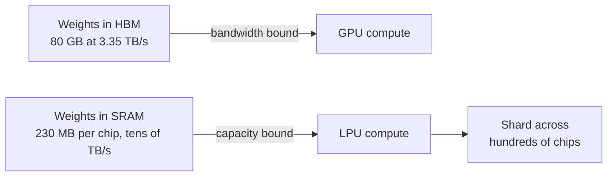
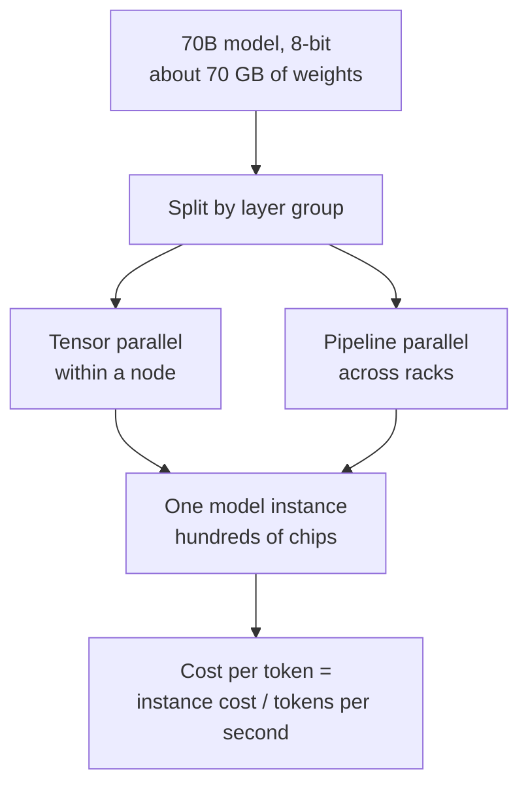
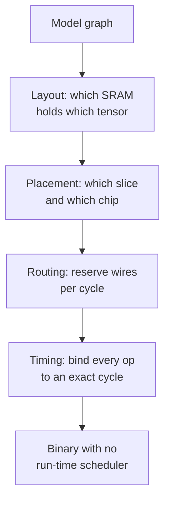
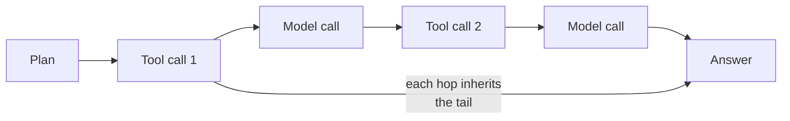
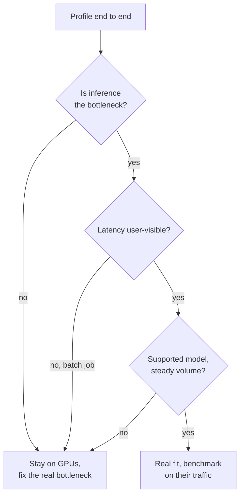
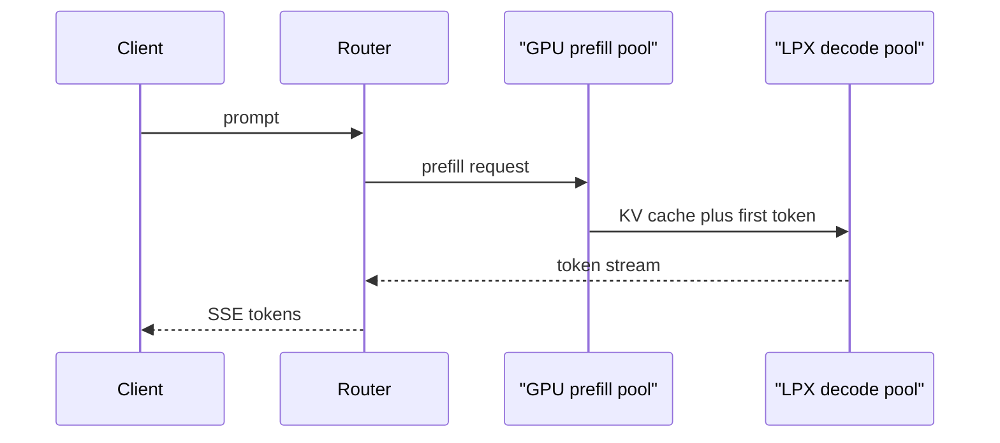
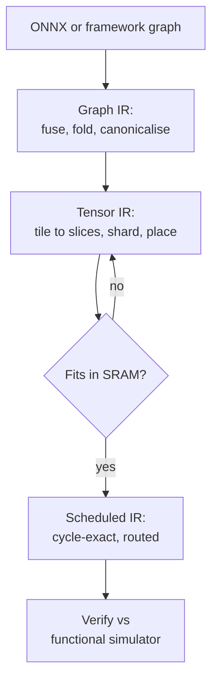

# ⚡ Groq - AI Engineer Interview Questions

> **Last reviewed: October 2026.** Based only on public information - official pages, engineering blogs, technical reports, and publicly shared candidate reports. Processes change and vary by team; treat this as a map, not a contract. No confidential or leaked material.

## TL;DR

- Reported loop: recruiter screen → 45-60 min hiring manager or technical phone screen → virtual onsite of roughly five 45-min sessions plus a shorter closing round with the hiring manager. One publicly shared systems-software report describes a 5.5-hour onsite day with a 30-min break (reported, varies).
- The technical centre of gravity is **C++, compilers and low-level systems**, not algorithm grinding. Public candidate reports for compiler and systems roles describe C++ fundamentals, data structures, dataflow scheduling and IR work rather than LeetCode marathons. Third-party guides summarise Groq's own framing as "show what you have built" (reported).
- The distinctive material is architectural: an SRAM-only accelerator with **no HBM**, a compiler that statically schedules every instruction and every wire transfer, and a model that must be sharded across many chips because one chip holds only a few hundred MB. If you cannot reason about that, nothing else you know will land.
- **Company context changed materially in late 2025 and 2026.** NVIDIA took a non-exclusive licence to Groq's inference technology and hired the founder, president and a chunk of the team; Groq continues as an independent inference cloud under a rebuilt leadership team (new CEO, COO, CTO and CPO by mid-2026), and now sells both LPU capacity and LPX-plus-GPU capacity. Ask your recruiter which side of that line the team sits on.
- Public interview information is **thin**: a handful of Glassdoor and Blind reports plus third-party aggregator guides, and no official process page. Stage-level details below are marked "(reported, varies)" for that reason.

## Company context

Groq builds custom inference silicon and sells inference as a cloud. The LPU (originally the Tensor Streaming Processor) is a spatial, compiler-scheduled dataflow chip with roughly 230 MB of on-die SRAM and no external HBM at all: weights live in SRAM next to the compute, and the compiler places and times every operation and every chip-to-chip transfer ahead of run time. That single decision produces the whole company: very low and very predictable per-token latency, but a fleet where any interesting model spans dozens or hundreds of chips. The published architecture work (ISCA 2020 "Think Fast", Hot Chips 34 in 2022) is the best primer, and it is fair to assume interviewers have read it.

The corporate picture shifted in December 2025, when NVIDIA licensed Groq's inference technology on a non-exclusive basis and hired founder Jonathan Ross, president Sunny Madra and others. Groq remained independent and kept GroqCloud running. By June 2026 TechCrunch reported co-founder Doug Wightman as CEO, alongside a newly hired COO, CTO and CPO. Funding figures in the press differ: TechCrunch covered a $650M round announcement in June 2026, and Bloomberg reported in August a $350M raise at a $3.5B valuation, roughly half the 2025 peak, with NVIDIA participating. Its current public positioning is a "neocloud for fast inference" building hundreds of megawatts of capacity, serving both LPU and LPX-based systems, where LPX handles latency-critical decode alongside NVIDIA GPUs doing prefill and attention. So "AI engineer" at Groq today means one of three things: compiler and kernel work on the spatial toolchain, inference-runtime and serving work across heterogeneous hardware, or customer-facing work getting real workloads onto that fleet.

## Roles & titles they hire

Groq's live board is JavaScript-rendered and does not extract cleanly, so the list below mixes titles visible on aggregators in 2026 with archived 2025 postings, labelled as such.

- **Senior Staff / Sr. Staff Software Engineer, High Performance Inference Systems** and **High Performance GPU Inference Systems** (Palo Alto, San Francisco; visible 2026) - low-latency runtime systems coordinating large accelerator fleets
- **Senior Compiler Engineer** (archived 2025 posting, Toronto) - optimisations for the spatial compiler targeting the TSP, asking 5+ years C/C++ with LLVM, plus MLIR, ONNX and PyTorch/TensorFlow exposure, and naming FPGA/CGRA spatial-architecture experience as an asset
- **Principal Inference Stack Engineer** (archived 2025 posting, Toronto) - mapping partner and cloud ML workloads onto the LPU, extending the Groq runtime API, benchmarking compiler output
- **Cloud / infrastructure engineering** - the data-centre and capacity side of the neocloud build-out
- **Forward Deployed AI/ML Engineer** (archived 2025 posting) - customer-side workflow design, model evaluation, deployment on Groq
- **Developer Relations Engineer**, and **compiler / cloud backend internships** run in winter and summer cohorts

Compensation data points exist on [levels.fyi](https://www.levels.fyi/companies/groq/jobs).

## The interview loop

Public information is **thin**. There is no official interview-process page, and what exists is a small number of Glassdoor and Blind reports for compiler and systems-software roles plus third-party aggregator guides that summarise them. The table below is the reported shape, not a published one; treat the row-level detail as inference from a handful of reports and confirm with your recruiter.

| Stage | Format | What's evaluated |
|---|---|---|
| Recruiter screen | ~30 min call | Background, what you have built, motivation, logistics (reported, varies) |
| Hiring manager call | ~45 min video | Depth of the work on your CV, team fit, what you want to own next (reported, varies) |
| Technical phone screen | ~60 min, live coding plus discussion | C++ fundamentals, data structures, and prior compiler / accelerator / systems experience (reported, varies) |
| Virtual onsite ×5 | ~45 min each, one or two interviewers per session; one report describes ~5.5 hours total with a 30-min break | Coding, systems or architecture deep-dive, compiler / runtime specifics, design, behavioural (reported, varies) |
| Closing round | ~30-60 min with hiring manager or an executive | Ownership, judgement under ambiguity, conviction about the problem (reported, varies) |

Reported end-to-end timeline is roughly three to four weeks, longer for compiler roles. Glassdoor's aggregate difficulty for Groq sits around 3.2 out of 5 with a majority-positive experience rating, and candidate write-ups consistently praise scheduling flexibility and clear communication. Two caveats worth planning around: the loop is described as experience-led rather than puzzle-led, so a portfolio you can actually explain matters more here than at most companies; and after the 2026 leadership changes, team composition and role scope may not match older reports.

## What they emphasise

- **Compiler-scheduled determinism.** The compiler decides where every tensor lives and on which cycle every instruction issues and every packet crosses a link. There is no dynamic scheduler, no cache hierarchy, no arbitration to hide behind. Expect to be asked what that buys and what it costs.
- **Memory hierarchy as the whole argument.** Roughly 230 MB of SRAM per chip at on-die bandwidth in the tens of TB/s, versus tens of GB of HBM at single-digit TB/s on a GPU. Every question about batching, sharding, model size and cost per token comes back to that trade.
- **Scale-out as a first-class problem.** A node is several chips, a rack is dozens, and published system designs scale to thousands with a bounded hop count and hardware-assisted deskew so the whole fabric behaves like one synchronous machine. Sharding is not an optimisation here, it is the deployment model.
- **What you have actually built.** Public framing and candidate reports both point the same way: portfolio and shipped work over algorithm puzzles. Bring specifics, including the failures.
- **Heterogeneous serving.** With LPX pairing decode acceleration to NVIDIA GPUs doing prefill and attention, disaggregated prefill/decode is no longer a research topic at Groq, it is the product. Know the interface between the two phases cold.
- **Latency as the product, not a metric.** The pitch is time-to-first-token and inter-token latency that stay flat under load. Tail behaviour, agentic multi-step chains, and real-time voice are the workloads they sell into.

## Representative questions

*Representative questions synthesised from this company's publicly known focus areas and role descriptions - not leaked questions.*

### 1. An LPU has no HBM at all, just on-die SRAM. Redo the decode roofline argument for that machine and tell me what changes.

<b>Answer</b>

On a GPU, batch-1 decode is memory-bandwidth-bound: every weight is read from HBM once per token, so tokens/s ≈ HBM bandwidth ÷ weight bytes. A 70B model at 8-bit on a 3.35 TB/s H100 gives an upper bound near 48 tokens/s, and the tensor cores idle. The entire GPU serving playbook - continuous batching, quantization, speculative decoding - exists to raise arithmetic intensity against that ceiling.

Take HBM away and the numerator changes by more than an order of magnitude. On-die SRAM on the published LPU design runs in the tens of TB/s (Groq's product material quotes around 80 TB/s), and it is not a cache, it is where the weights live. The bandwidth term stops being the binding constraint on latency, so batch 1 is no longer pathological: you can serve a single sequence near the machine's peak rate instead of at 1/100th of it.

The constraint moves to **capacity**. Roughly 230 MB per chip means a 70B model at 8-bit needs on the order of 300 chips just to hold the weights, before activations, KV cache and any headroom. So the roofline argument inverts: on a GPU you fight bandwidth per chip and can fit the model in a handful of devices; on an LPU you have bandwidth to spare per chip and fight to assemble enough chips, with the interconnect and the static schedule now carrying the risk. The economic consequence follows directly: a GPU deployment is bandwidth-limited and cheap to fill, an LPU deployment is capacity-limited and only pays back at high, steady occupancy.

**Worth sketching.** Where the bottleneck sits on each machine.

**Follow-ups:** At what model size does the crossover favour SRAM-only? What does removing the cache hierarchy do to your ability to reason about worst-case latency?

### 2. A 70B dense model at 8-bit weights, chips with ~230 MB of SRAM each. Walk me through the deployment and the unit economics.

<b>Answer</b>

Start with capacity. 70B at 8-bit is ~70 GB of weights. At 230 MB per chip and realistically 70-80% of that usable after activations, scratch buffers and instruction storage, you need on the order of 350-450 chips. Round to racks: if a node is eight chips and a rack is nine nodes, that is roughly five to six racks holding one model instance. State the assumptions out loud, because the interviewer cares about the method, not a memorised figure.

Then the parallelism strategy. Pure pipeline parallelism across 400 chips gives a 400-stage pipeline: fine for throughput once full, terrible for a single interactive request, and it makes the bubble at the start of each sequence dominate TTFT. Pure tensor parallelism splits every layer across all chips and turns each matmul into a fabric-wide collective, which on a statically scheduled network is feasible but pushes hard on hop count and deskew. The real answer is a hybrid: tensor-parallel within a node or rack where links are cheapest, pipeline across racks, chosen so the per-token critical path stays inside a bounded number of hops.

The economics fall out of that. Your unit of capacity is not a chip, it is a whole model instance spanning racks, and it is indivisible: you cannot serve half a model. So cost per token = (cost of the whole instance per second) ÷ (tokens/s it produces). Because latency is excellent even at low concurrency, throughput per instance rises with concurrency far less steeply than on a GPU, which means **occupancy is the entire margin story**. An instance at 20% utilisation costs five times per token what the same instance costs when saturated. That is why the commercial model is a high-volume API rather than per-customer dedicated boxes.

**Worth sketching.** How one logical model maps onto the physical fleet.

**Follow-ups:** How does the answer change for a sparse MoE of the same total parameter count? Where would you spend a 2x quantization win: fewer chips per instance, or longer context?

### 3. Our compiler statically schedules every instruction and every chip-to-chip transfer. What does that compiler need to know that an NVCC-style compiler does not, and what breaks when it is wrong?

<b>Answer</b>

A GPU compiler emits instructions and hands the timing problem to hardware: warp schedulers hide latency, caches paper over locality mistakes, and the memory controller arbitrates contention at run time. A spatial compiler for a deterministic dataflow machine has none of those safety nets, so it must know things that are normally run-time properties.

Concretely, it needs exact cycle latency for every functional unit and every data movement, a complete model of where each tensor physically sits in SRAM at every point in the program, a routing plan for the on-chip and off-chip network with no possibility of two flows contending for the same wire in the same cycle, and a global time base so that a value produced on chip 40 arrives at chip 41 on precisely the cycle its consumer expects. Published Groq system work handles the last part with hardware alignment counters and ISA support for deskew, giving the illusion of one globally synchronous machine.

What breaks: a mis-modelled latency does not cost you performance, it costs you correctness, because the consumer reads a buffer before the producer wrote it. A routing conflict does not degrade gracefully, it corrupts. A schedule that overflows SRAM does not spill to DRAM, because there is no DRAM. This is why the compiler owns memory allocation as a first-class scheduling constraint rather than a downstream detail, and why the toolchain leans on a functional simulator that is bit-accurate against hardware. The upside is what you buy: no cache misses, no arbitration jitter, no kernel-launch variance, so the same program takes the same number of cycles every single run, and you can compute latency rather than measure it.

**Worth sketching.** What the spatial compiler must resolve before anything runs.

**Follow-ups:** How would you make the compiler robust to a model whose shapes are not known until run time? What is your fallback when the scheduler cannot find a feasible assignment?

### 4. Determinism is the headline claim. What does it actually buy at p99, and why do you think we keep pointing at agentic workloads?

<b>Answer</b>

Determinism means the variance term goes to roughly zero for the compute itself. On a GPU, per-token latency is a distribution shaped by cache behaviour, kernel launch overhead, continuous-batching decisions, preemption when KV blocks run out, and whichever neighbours share the device. Median looks fine and p99 is several times worse. On a statically scheduled machine, the same program takes the same cycles every run, so remaining variance comes from queueing, the network and the host, all of which you can attack separately.

The agentic argument is arithmetic. A single chat turn hides a bad tail: the user waits once, and a p99 outlier is annoying but survivable. An agent that makes twelve sequential model calls before producing an answer inherits the tail on every hop. If each call is p99 at 3x the median, the chance that at least one call in the chain lands in that tail is close to certain, so the **chain's** median tracks the **step's** tail, not the step's median. Cut per-step variance and the end-to-end distribution tightens far more than the per-step improvement suggests.

That is also the honest limit of the claim. Determinism fixes the compute term. It does nothing for a slow tool call, a cold retrieval index, a rate-limited third-party API, or a queue that is oversubscribed at the front door. If a customer's agent spends 80% of its wall-clock waiting on their own database, moving inference to a deterministic accelerator changes very little, and saying so is the answer an interviewer wants to hear.

**Worth sketching.** How per-step tail compounds along an agent chain.

**Follow-ups:** How would you measure this properly for a customer rather than asserting it? Which parts of your own stack reintroduce variance after the accelerator has removed it?

### 5. On a GPU you batch to amortise weight reads. What is the batching calculus on an SRAM-only machine, and how should that change how we price?

<b>Answer</b>

On a GPU, batching is close to free throughput: each added sequence reuses the same weight read, so throughput climbs steeply while inter-token latency degrades only slowly, until arithmetic intensity crosses the roofline ridge. That is why continuous batching is the single highest-leverage trick in GPU serving and why serverless pricing can be aggressive.

On an SRAM-resident machine the weight-read amortisation argument mostly disappears, because the read was never the bottleneck. Adding sequences buys you real compute utilisation, since the matrix units are genuinely busier with a wider batch, but the multiplier is far smaller than on a GPU and it arrives with a harder constraint: batch size is a **compile-time** property. The schedule was built for a specific shape, so you cannot grow the batch mid-flight the way a continuous-batching scheduler does. You choose a small set of supported shapes, compile a program for each, and route requests to whichever instance is running the right one.

That reshapes pricing in two ways. First, the value you are selling is latency at low concurrency, which is exactly where GPUs are worst, so per-token price should reflect that you are competing on the interactive tier, not the bulk-batch tier. Second, since occupancy rather than batch efficiency drives margin, the business needs steady aggregate demand across a shared fleet more than it needs any one customer to send large batches. Practically: charge per token, keep the fleet pooled, avoid dedicated instances unless the customer's volume genuinely fills one, and be wary of long-context workloads that consume disproportionate SRAM per request.

**Follow-ups:** How would you support many batch shapes without an unmanageable number of compiled binaries? What does a long-context request cost you that a long-generation request does not?

### 6. A prospective customer runs their workload on H100s. Talk me through when you would tell them not to move.

<b>Answer</b>

The honest cases where they should stay are the majority of cases, and saying that credibly is the point of the question.

Stay on GPUs when the workload is **throughput-shaped and latency-tolerant**: offline batch scoring, nightly document processing, evaluation runs, synthetic data generation. Those are exactly where large-batch GPU serving is most efficient and where a latency-optimised machine sells nothing.

Stay when they need **flexibility**. Fine-tuning, LoRA multiplexing across thousands of adapters, custom architectures, day-zero support for a model released this morning, or anything requiring bespoke kernels. A compiler that must statically schedule a graph is slower to absorb novelty than a runtime that can execute arbitrary CUDA, and adapter-per-request multiplexing does not map naturally onto a fixed compiled schedule.

Stay when they do **both training and inference** and want one fleet, when their spend is small enough that a self-managed GPU box is simply cheaper than any API, or when the bottleneck is not inference at all. That last one is common: profile the request first, and if 80% of end-to-end latency is retrieval, tool calls or their own service mesh, a faster decoder is a rounding error.

The genuine fit is narrower and worth naming precisely: interactive, latency-critical, high-volume traffic on a widely used open model, especially real-time voice, live translation, code completion and multi-step agent loops, where per-token latency is user-visible and volume is steady enough to keep pooled capacity busy.

**Worth sketching.** The qualification path a forward-deployed engineer should walk.

**Follow-ups:** How do you run that benchmark so the result is credible to their engineers? What would make you walk away from a deal that looks good on paper?

### 7. We now pair LPX decode accelerators with NVIDIA GPUs doing prefill and attention. Design the serving path across those two machines.

<b>Answer</b>

The premise is that prefill and decode are different workloads. Prefill is compute-bound, embarrassingly parallel across the prompt, and benefits from the GPU's raw FLOPs and its large HBM for long-context KV. Decode is sequential, latency-critical, and benefits from a machine with no scheduling jitter and weights already resident in SRAM. Running both on one device means one of them is always mis-served, and the classic symptom is a long prefill spiking inter-token latency for every other sequence sharing the batch.

The design: a router terminates the request and sends the prompt to a GPU prefill pool. Prefill produces the KV cache and the first token. That KV cache then has to reach the decode side, and this transfer is the crux of the whole design - it is proportional to prompt length and can be hundreds of megabytes for long contexts, so it needs a high-bandwidth path and it needs to be overlapped with the tail of prefill rather than serialised after it. Decode then runs on the LPX side, streaming tokens back through the router. Attention over a growing KV cache may stay on the GPU in a hybrid split, with the decoder consuming attention outputs, which is what the published pairing implies.

What to defend: TTFT is now prefill time plus transfer time, so long prompts pay a penalty you must measure and bound. Failure domains are independent, so you need per-phase health checks and a plan for a decode instance dying mid-stream. Capacity planning becomes two-dimensional, since prefill and decode pools scale on different signals (prompt tokens/s versus concurrent sequences), and a mismatch leaves one side idle. Finally, the router must be latency-aware and cheap, because you have just added a network hop to a system whose selling point is latency.

**Worth sketching.** The two-pool path and where the KV cache moves.

**Follow-ups:** How would you decide the ratio of prefill to decode capacity? What happens to prefix caching when prefill and decode live on different machines?

### 8. How would you serve a large mixture-of-experts model on a statically scheduled fabric when expert selection is data-dependent?

<b>Answer</b>

This is the sharpest tension in the architecture. MoE routing is a run-time decision, and a compiler that must fix every cycle in advance cannot branch on it. The resolution is to make the schedule data-independent while letting the data decide what flows through it.

The practical approach: keep all experts resident. Because there is no HBM to page from, an expert that is not on-chip is not reachable, so the capacity requirement is the full parameter count even though only a fraction activates per token. A 400B-parameter MoE therefore needs roughly the same chip count as a 400B dense model, which is the honest cost, and it is why MoE is a smaller win on this machine than on a GPU where sparsity saves bandwidth.

Given residency, the schedule becomes fixed-shape gather and scatter: route tokens to expert locations with a fixed capacity factor per expert, run every expert slot on its statically scheduled program regardless of how many real tokens landed there, and mask the empty slots. You pay for the padding, and choosing the capacity factor is the real trade: too low and you drop or reroute tokens and lose quality, too high and you burn cycles on masked-out lanes. Token dropping, expert-choice routing rather than token-choice, and auxiliary load-balancing losses at training time all change how bad that padding gets.

The upside is that expert placement is now a compiler problem you can solve well: co-locate experts that frequently co-activate to cut fabric traffic, and balance experts across chips so the all-to-all is uniform. On a machine where the network is statically routed, a good static placement removes congestion entirely rather than merely reducing it on average.

**Follow-ups:** How would you pick the capacity factor from production traffic rather than from the training config? What would you measure to know that expert placement is hurting you?

### 9. Design the IR and pass pipeline for a compiler targeting a spatial dataflow accelerator. Where does the memory-residency decision live, and why?

<b>Answer</b>

Three levels of abstraction, mirroring what MLIR is built for and what the archived Groq compiler postings describe when they ask for LLVM plus MLIR plus ONNX experience.

**High level**: the model graph, framework-agnostic, ingested from ONNX or a framework exporter. Shapes and dtypes known, no hardware notion. Passes here are the classic graph rewrites: constant folding, operator fusion, layout canonicalisation, dead subgraph elimination, quantization annotation.

**Mid level**: a tensor dialect that knows the machine has functional slices (matrix, vector, shift/permute, memory, control) but not yet exact cycles. This is where you tile operations to slice geometry, decide parallelism strategy across chips, and materialise the communication operations. Crucially this is also where **memory residency is decided**, and it must be here rather than at the back end, because on a chip with no DRAM, residency is not a spill decision made after scheduling, it is a feasibility constraint that determines whether a partitioning is legal at all. If you defer it, the back end discovers infeasibility after the expensive work is done and has no legal fallback.

**Low level**: per-slice instruction sequences bound to exact cycles, plus a routing plan reserving links per cycle. Passes here are software pipelining, latency-exact bundling, deskew insertion for cross-chip flows, and verification against a bit-accurate functional simulator.

The pipeline should be resumable and diagnosable: when the mid level fails to find a legal partitioning, the useful output is which tensor overflowed which chip's budget, not a generic scheduling error. Compile times on spatial machines are long, so incremental compilation and a good cache keyed on subgraph plus target config are engineering requirements, not luxuries.

**Worth sketching.** The three-level lowering and where feasibility is decided.

**Follow-ups:** How would you represent chip-to-chip communication in the mid-level dialect? What is your strategy when compile time for a large model reaches hours?

### 10. Write me the host-side runtime that feeds a deterministic accelerator across many chips. What is genuinely hard about it?

<b>Answer</b>

The hard part is that the accelerator's determinism ends at its input queue. Everything the host does - allocation, DMA, interrupt handling, thread scheduling, tokenization, network I/O - is a normal, jittery, non-deterministic system, and if you are careless the host becomes the source of exactly the tail latency the hardware was designed to eliminate.

The core structure I would defend:

- **Pre-allocate everything.** No allocation on the hot path. Pinned buffer pools sized at startup, ring buffers for descriptors, no dynamic containers in the submission loop. A malloc under lock in the token path is a p99 outlier.
- **Lock-free submission.** Single-producer single-consumer queues between the request layer and each device thread, so submission never blocks on a mutex held by a slow consumer. This is the area that publicly reported systems interviews at Groq are said to probe, and it is worth being able to reason about memory ordering rather than just naming `std::atomic`.
- **Pin threads, isolate cores.** One submission thread per device, pinned, on cores isolated from the general scheduler, with interrupts steered away. Otherwise the OS scheduler injects the variance back in.
- **Batch shapes are compile-time.** The runtime routes each request to an instance running a compatible compiled program rather than reshaping the batch, so admission control and shape-aware routing sit in the runtime, not in a dynamic batcher.
- **Cancellation must be real.** A disconnected client should free its slot immediately, or the instance carries dead work for the length of the generation.

Observability deserves a mention: because the device side is deterministic, any measured variance is by definition host, network or queueing, which makes the runtime unusually diagnosable if you timestamp at the right boundaries.

**Follow-ups:** How would you detect that the host, not the device, is the tail-latency source? What is your failure model when one chip in a several-hundred-chip instance goes down mid-request?

### 11. A model passes bit-exact against the functional simulator on one chip, but produces wrong output at rack scale. How do you find it?

<b>Answer</b>

The framing that matters: on a deterministic machine a scale-dependent bug is almost never numerical noise, it is a timing, routing or synchronisation defect. So the first move is to establish reproducibility, which should be trivial here - same input, same binary, same output every run. If the failure is **not** reproducible, that is itself the most informative result, because it points at the host, the fabric or a hardware fault rather than the compiled schedule.

Then bisect along three independent axes rather than guessing:

1. **Scale.** Does it fail at two chips? One node? One rack? The smallest failing configuration is the cheapest thing to debug, and the boundary where it first appears usually names the mechanism: failing exactly when you cross a node boundary points at the inter-node link or the deskew logic, not at the maths.
2. **Layer.** Dump intermediate tensors at layer boundaries and compare against the simulator running the same partitioning. Find the first divergent layer, then the first divergent tensor inside it. Divergence in a value that crossed a chip boundary implicates transport; divergence in a purely local computation implicates the compiled kernel.
3. **Schedule.** Recompile with conservative settings: disable aggressive software pipelining, add slack to cross-chip timing, force a simpler routing. If the failure disappears, you have localised it to the scheduler and can reintroduce optimisations one at a time.

Common culprits worth naming: an off-by-one in deskew so a consumer reads a buffer one cycle early, two flows sharing a link the router believed was free, a reduction whose partial ordering differs from the simulator's, and a hardware fault on one specific chip which you catch by permuting the placement and seeing whether the failure follows the physical device or the logical rank.

**Follow-ups:** How would you build this bisection into CI so it never reaches production? What tooling would you want that does not exist today?

### 12. Tell me about a performance optimisation you shipped. Give me the numbers, and tell me why I should believe them.

<b>Answer</b>

This is the question the loop is built around, given how consistently Groq's public framing and candidate reports point at real work over puzzles. Answer it as an engineer defending a result, not as a candidate telling a story.

Structure that works:

- **The baseline, measured.** What was slow, how you knew, and what the profile actually said. "It felt slow" is a failing answer; "the trace showed 60% of step time in an exposed all-gather" is a passing one.
- **The hypothesis and why it was plausible** from the machine's characteristics, not from a blog post. If the fix was a memory-layout change, say which level of the hierarchy you were targeting and what the expected ceiling was.
- **The result with a denominator.** Absolute numbers plus the fraction of the theoretical maximum you reached. A 3x speedup that lands at 12% of peak is a different result from a 1.4x that lands at 85%, and knowing which one you got is the signal.
- **Why the measurement is trustworthy.** Warmup handling, run-to-run variance, whether you compared like for like, whether the win held on production shapes rather than only on the microbenchmark. Anyone can produce a favourable benchmark; interviewers here are looking for someone who tried to break their own result.
- **What it cost.** Compile time, code complexity, generality lost, a regression somewhere else. Optimisations that only have upsides usually mean the downside was not measured.

Have two of these ready at different scales: one deep and narrow (a kernel, a data structure, a compiler pass) and one broad (a pipeline or system-level change). Being able to say "and this one did not work, here is why" is a stronger signal than a third success.

**Follow-ups:** What would you do differently now? What did you decide not to optimise, and how did you make that call?

## How to prepare

**Repo topics, in priority order:**

- **[08-inference-and-production](../08-inference-and-production/README.md)** - the core of this loop. Serving economics, batching, KV cache, prefill/decode separation, quantization. Learn the GPU version thoroughly first, because every distinctive Groq question is "how does this change without HBM".
- **[11-ai-system-design](../11-ai-system-design/README.md)** - the design rounds are inference infrastructure. The closest transferable case study is **[02-ai-code-assistant](../11-ai-system-design/case-studies/02-ai-code-assistant.md)**: latency-critical streaming inference where tail latency is user-visible, which is precisely the workload Groq sells into. Practise Q2, Q7 and Q12 above as standalone design exercises.
- **[12-coding-challenges](../12-coding-challenges/README.md)** - a live coding round is reported for the phone screen. For compiler and systems roles, C++ is the language: pointers, memory model, RAII, lock-free structures, and being fluent without an IDE.
- **[02-llm-fundamentals](../02-llm-fundamentals/README.md)** - attention variants, GQA, MoE routing, KV-cache mechanics. You need these at implement-it depth to reason about how a model maps onto a fixed schedule.
- **[06-agents-and-tool-use](../06-agents-and-tool-use/README.md)** - the agentic tail-latency argument is central to the company pitch, so understand where multi-step loops actually spend time.
- **[13-interview-process-and-behavioral](../13-interview-process-and-behavioral/README.md)** - the loop leans hard on what you have built. Prepare specific projects with numbers, including one that failed.
- **[07-evaluation-and-observability](../07-evaluation-and-observability/README.md)** - useful for the forward-deployed and solutions roles, where proving a latency claim on a customer's real traffic is the job.

**Company-specific moves:**

1. Read the published architecture work before anything else: the ISCA 2020 Tensor Streaming Processor paper and the Hot Chips 34 scale-out paper. They are the only genuinely deep public source on how the machine works, and the vocabulary (functional slices, streaming register file, deskew, software-scheduled network) is what interviewers will use.
2. Use GroqCloud yourself and measure. Run the same prompt against a GPU-hosted endpoint and a Groq endpoint, record TTFT and inter-token latency distributions rather than averages, and be ready to discuss what you saw. "I measured your p99 and here is what surprised me" is a strong opener.
3. Build the napkin math into reflex: chip SRAM capacity, weight bytes at each precision, how many chips a given model needs, hop counts, and cost per token from an instance cost. Interviewers on this kind of hardware reward numbers over adjectives.
4. Get hands-on with a compiler stack if you are targeting compiler or kernel roles. Write an MLIR dialect and a lowering pass, or study XLA/TPU compilation, which is the closest widely documented analogue to a statically scheduled accelerator toolchain.
5. Know the corporate situation and ask about it directly. The NVIDIA licensing deal, the leadership move and the 2026 funding round are all public, and asking a hiring manager how the team's roadmap changed is a reasonable, senior question rather than an awkward one.

## Sources

- [Groq - homepage](https://groq.com/) (fetched August 2026; current positioning, LPU and LPX, capacity build-out, $350M round)
- [Groq - Careers](https://groq.com/careers) and [Careers at Groq](https://groq.com/careers-at-groq) (fetched August 2026; hiring philosophy statements; live role list is JavaScript-rendered)
- [Groq blog - Inside the LPU: Deconstructing Groq's Speed](https://groq.com/blog/inside-the-lpu-deconstructing-groq-speed) and [From Speed to Scale: How Groq Is Optimized for MoE and Other Large Models](https://groq.com/blog/from-speed-to-scale-how-groq-is-optimized-for-moe-other-large-models) (RealScale chip-to-chip interconnect, day-one Llama 4 Maverick deployment)
- "Think Fast: A Tensor Streaming Processor (TSP) for Accelerating Deep Learning Workloads", ISCA 2020, and "A Software-defined Tensor Streaming Multiprocessor for Large-scale Machine Learning", ISCA 2022 (searchable by title in the ACM and IEEE libraries; PDF mirrors were unreachable at time of writing)
- [The Groq Software-defined Scale-out Tensor Streaming Multiprocessor (Hot Chips 34, IEEE Computer Society)](https://www.computer.org/csdl/proceedings-article/hcs/2022/09895630/1GZiGmbsBk4)
- [The Architecture of Groq's LPU - Coding Confessions](https://blog.codingconfessions.com/p/groq-lpu-design) (third-party architectural walk-through of the TSP)
- GroqChip Processor product brief, v1.7 (vendor datasheet carrying the SRAM capacity and on-die bandwidth figures; hosted PDF mirrors were unreachable at time of writing)
- [Inside NVIDIA Groq 3 LPX (NVIDIA developer blog, March 2026)](https://developer.nvidia.com/blog/inside-nvidia-groq-3-lpx-the-low-latency-inference-accelerator-for-the-nvidia-vera-rubin-platform) (heterogeneous prefill on GPU, decode on LPX)
- [Nvidia's Groq deal: acquisition, acquihire or creative licensing deal? - Constellation Research](https://www.constellationr.com/insights/news/nvidias-groq-deal-acquisition-acquihire-or-creative-licensing-deal) (deal terms, leadership change)
- [Nvidia to license tech from Groq, hire its leadership - Data Center Dynamics](https://www.datacenterdynamics.com/en/news/nvidia-to-license-tech-from-ai-inference-chip-company-groq-hire-its-leadership/)
- [AI chipmaker Groq confirms $650M raise, re-staffs after Nvidia's $20B not-acqui-hire deal - TechCrunch, June 2026](https://techcrunch.com/2026/06/22/ai-chipmaker-groq-confirms-650m-raise-re-staffs-after-nvidias-20b-not-acqui-hire-deal/) (new CEO, COO, CTO and CPO; 13 data centres)
- [Groq Valued at $3.5 Billion in Funding Round After Nvidia Deal - Bloomberg, August 2026](https://news.bgov.com/private-equity/groq-valued-at-3-5-billion-in-funding-round-after-nvidia-deal) ($350M at $3.5B, NVIDIA participating)
- [landedjobs/ai-interview-guides - Groq guide](https://github.com/landedjobs/ai-interview-guides/blob/main/guides/groq.md) (third-party aggregation of Glassdoor and Blind reports; stage details marked "reported" above)
- [Glassdoor - Groq System Software Engineer interview questions](https://www.glassdoor.com/Interview/Groq-System-Software-Engineer-Interview-Questions-EI_IE2473036.0,4_KO5,29.htm) (difficulty and sentiment ratings; site blocks automated fetch)
- [Blind - Groq discussions](https://www.teamblind.com/company/groq/posts) (candidate reports on onsite length and format)
- [Built In - Groq Senior Compiler Engineer (archived posting)](https://builtin.com/job/compiler-engineer/2376090) and [Principal Inference Stack Engineer (archived posting)](https://builtin.com/job/principal-inference-stack-engineer/3632812) (role requirements: C/C++, LLVM, MLIR, spatial architectures)
- [levels.fyi - Groq jobs](https://www.levels.fyi/companies/groq/jobs)
