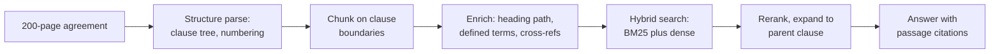
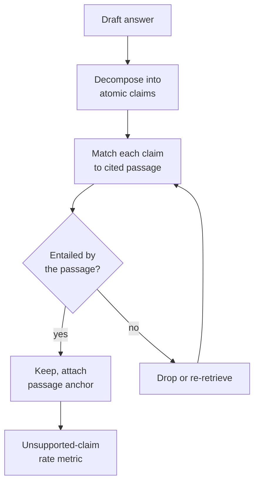
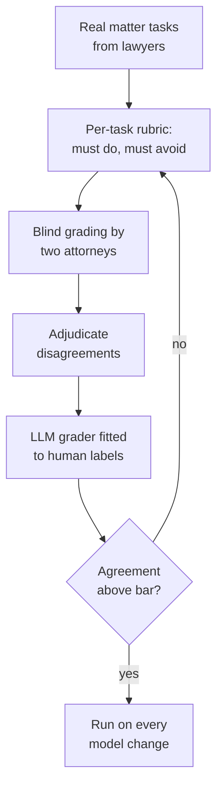
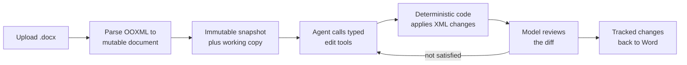
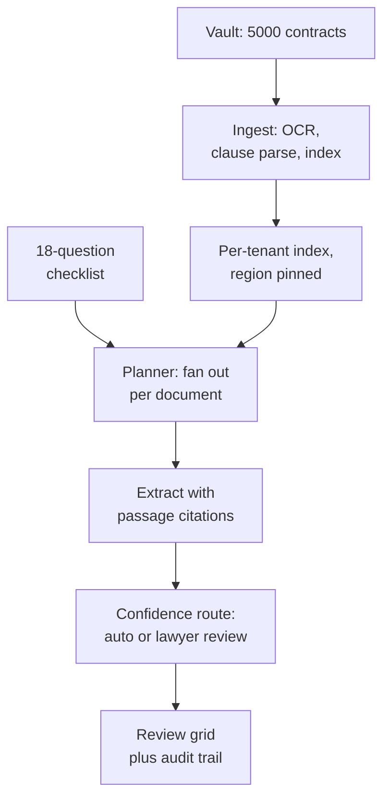
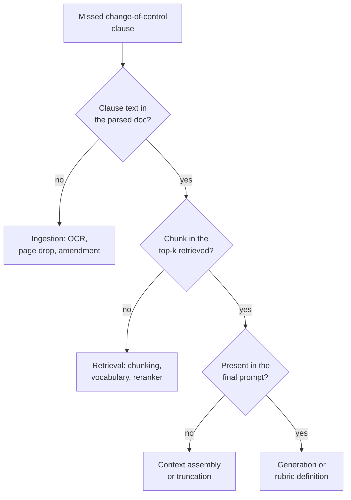
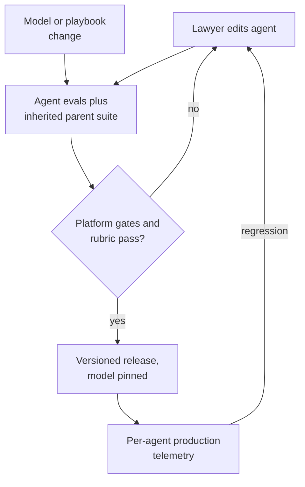

# ⚖️ Harvey - AI Engineer Interview Questions

> **Last reviewed: October 2026.** Based only on public information - official pages, engineering blogs, technical reports, and publicly shared candidate reports. Processes change and vary by team; treat this as a map, not a contract. No confidential or leaked material.

## TL;DR

- Reported loop: recruiter screen → ~45-min hiring manager call → a timed ~1-hour take-home coding assessment (proctored, single tab) → ~60-min paired coding round with a Harvey engineer → ~60-min solution architecture presentation to a panel → a director or founder conversation. Roughly 3-5 weeks end to end (reported, varies).
- The **solution architecture presentation** is the round that decides most offers. You screen-share slides or diagrams for a past project or a hypothetical design, then defend it against a panel of engineers and researchers. Prepare it like a conference talk, not a whiteboard scribble.
- The paired coding round is reported to be AI-flavoured rather than pure algorithms - tokenization, vector storage, retrieval plumbing - and candidates report being allowed to use their normal tools including LLM assistants, with the interviewer offering few hints. Autonomy under mild pressure is part of the signal.
- Technical centre of gravity: **retrieval over very long legal documents, citation grounding, and evaluation without ground truth**. Harvey publishes BigLaw Bench, its own answer/source scoring rubrics, and hallucination-rate measurements, so these are not abstract interests.
- Public loop information is **moderate and inconsistent between sources**: several third-party guides describe slightly different stage sets (some list a classic phone screen plus a 4-5 round onsite instead of take-home plus paired coding). Treat every stage row below as "reported, varies" and confirm with your recruiter.
- A newer shape appears in an August 2026 candidate report for an agent-focused role: a three-round final of system design, a project deep dive, and a coding round that builds a bare-bones embedding and RAG pipeline in a notebook. It was scheduled at an office, but the interviewers joined by video, so ask whether "onsite" means in the room (reported, varies).

## Company context

Harvey builds domain-specific AI for legal and professional services: an assistant grounded in a firm's own documents, Vault for storing and bulk-analysing large document sets, Knowledge for research across case law and regulatory sources, Contract Intelligence, an agent builder, and deep integrations into Word and the document management systems lawyers already live in. Their own materials describe 1,500+ customers across 60+ countries, including large law firms and in-house legal teams. In May 2026 Harvey reported 500+ prebuilt use-case agents live across practice areas, with Agent Builder in early access so firms can tailor those agents to their own knowledge and processes, and agents that output Word, PowerPoint, and Excel files rather than chat replies. Engineers want in because the constraints are genuinely hard: a 200-page credit agreement whose defined terms sit 150 pages from the clause you care about, an answer that is worthless unless every assertion links to a verifiable passage, and a client base for whom a confidentiality breach is a regulatory event. "AI engineer" here means applied LLM systems work - retrieval, agents, evals, inference plumbing, and the enterprise security envelope around them - in close partnership with in-house lawyers who write the rubrics and grade the outputs.

## Roles & titles they hire

From their public Ashby job board and careers site (August 2026):

- **Software Engineer, Machine Learning** - applied model and pipeline work
- **Staff Applied AI Engineer** - senior applied LLM systems, closest to the product surface
- **Senior Software Engineer, AI Platform** - the platform layer the AI products are built on
- **Software Engineer, AI Infrastructure** - serving, orchestration, and inference plumbing
- **Senior Software Engineer, Core Infrastructure**
- **Senior Software Engineer, Full Stack** and **Senior Software Engineer, Frontend**
- **Sr. AI Enablement Engineer** - internal and customer-facing AI adoption
- **ML Operations Engineer** - the role one widely circulated third-party interview guide is written against
- **Senior Product Security Engineer** - meaningful here, given the customer base
- **Applied Legal Researcher** and **Legal Engineer** / **Legal Engineer, EMEA** / **Legal Engineer - Product Specialist (In-House)** - practising lawyers who write evals, build workflows, and sit in the loop on quality

Locations reported across postings include San Francisco, New York, London, and Madrid, among others.

## The interview loop

Public information is moderate but **not consistent**. Multiple third-party guides describe Harvey's loop and they disagree on the middle stages: one describes a take-home plus paired coding plus an architecture presentation, another describes a conventional technical phone screen plus a 4-5 round virtual onsite. The table below follows the more specific and more distinctive account, with the alternative noted. Every row should be read as reported rather than official.

| Stage | Format | What's evaluated |
|---|---|---|
| Recruiter screen | ~30 min call | Background, motivation, why legal AI specifically, expectations |
| Hiring manager call | ~45 min | Role fit, depth of relevant production experience, what you have actually owned (reported, varies) |
| Timed coding assessment | ~1 h, proctored, complete in one sitting without leaving the tab | General problem solving and clean code under time pressure; reportedly not Harvey-product specific (reported, varies) |
| Paired coding with a Harvey engineer | ~60 min screen-share; your own tools, LLM assistants reportedly permitted | Applied AI coding - tokenization, chunking, vector storage, retrieval plumbing - plus autonomy with minimal hints (reported, varies) |
| Solution architecture presentation | ~60 min, panel of engineers and researchers; you present slides or diagrams | Architecture choices, trade-off awareness, scale and stability thinking, how you handle stakeholder pushback (reported, varies) |
| Director or founder conversation | ~60 min, informal | Understanding of the role and the domain, experimentation mindset, collaboration style (reported, varies) |
| Alternative shape reported elsewhere | ~60-min technical phone screen then a 4-5 round virtual onsite: 1-2 coding, system design, LLM-application round, behavioural | Same competencies, different packaging (reported, varies) |

Timeline: reported at roughly 3-5 weeks, with some accounts stretching to 4-6. Notably, at least one account reports **no separate culture round** on the engineering track, with those signals assessed through the technical rounds instead (reported, varies).

## What they emphasise

- **Retrieval that respects document structure.** Harvey's published retrieval work spans case law, legislation, EUR-Lex, firm memoranda, contract portfolios, and discovery email, and notes that performance differs even between near-neighbour document types such as merger agreements and stock purchase agreements. They report their system finding up to 30% more relevant content than alternative embedding-based methods. Generic "embed and cosine" answers will not survive contact with this panel.
- **Citation grounding as a product requirement.** Their BigLaw Bench scoring separates an **answer score** ("what percentage of a lawyer-quality work product does the model complete?") from a **source score** ("what percentage of correct statements does the model support with an accurate source?"). Internally they hold outputs to passage-level links, not document-level ones.
- **Hallucination measured, not asserted.** Harvey publishes a two-step measurement approach - decompose an answer into factual claims, then verify each against source documents, validated against human review - and reports rates of 0.2% for Harvey Assistant across 1,688 response sentences versus higher figures for the foundation models they compared against. Expect to be asked how you would build that measurement, not whether hallucinations are bad.
- **Lawyers in the loop by design.** Benchmarks are built from lawyer time entries, ground truth comes from an in-house legal research team, and bespoke per-task rubrics define what a model must do and must avoid. If your evaluation story has no domain expert in it, it is incomplete here.
- **Agents that produce work product.** Their document drafting agent parses .docx into a mutable in-memory representation, keeps an immutable original alongside a working copy, exposes typed edit tools to the model, and lets the model review its own diff. They report a 40% increase in edit acceptance rates after that redesign. The unit of output is a redline or a memo, not a chat turn.
- **Enterprise security as a first-class constraint.** Logical workspace separation, role-based access, ethical-wall policy sync, contractual prohibitions on model providers training on customer data, zero data retention requirements, and data residency options across the EU/Switzerland, US, and Australia. SOC 2 Type II, ISO 27001, ISO 27701, and ISO 42001 are listed.

## Representative questions

*Representative questions synthesised from this company's publicly known focus areas and role descriptions - not leaked questions.*

### 1. A lawyer asks a question about a 200-page credit agreement where the operative clause on page 140 depends on a defined term on page 8. How do you build retrieval that gets this right?

<details><summary><b>Answer</b></summary>

Naive fixed-size chunking fails here in a specific way: the retrieved chunk contains "Permitted Indebtedness" but not its definition, so the model either guesses or answers vaguely. The fix is to treat the document's structure as a first-class object rather than a stream of tokens.

Parse first. A credit agreement has a clause tree: articles, sections, sub-clauses, schedules, exhibits, plus a definitions article. Chunk on **clause boundaries**, never mid-clause, and carry the full heading path as chunk metadata ("Article VII, Section 7.02(b), Negative Covenants - Indebtedness").

Then enrich. Two mechanisms matter more than embedding choice:

- **Defined-term resolution.** Build a document-level dictionary from the definitions article plus inline definitions (the `("Borrower")` pattern). At index time, attach to each chunk the definitions of the capitalised terms it uses. At answer time, the model sees the clause and its vocabulary together.
- **Cross-reference expansion.** Resolve "subject to Section 6.01" into an edge in a document graph, and expand retrieved nodes one hop before generation.

Retrieval itself should be hybrid. Legal text is full of exact tokens that dense retrievers blur - section numbers, party names, dollar thresholds - so run BM25 alongside dense retrieval and fuse. Rerank with a cross-encoder, then expand each surviving chunk back to its parent clause so the model reads a complete provision.

Harvey's published retrieval work reports that performance varies even between similar contract types, which is the practical lesson: evaluate per document type, and expect that a chunking strategy tuned on merger agreements will not transfer unchanged to stock purchase agreements.

**Worth sketching.** The pipeline makes clear that parsing and enrichment happen before any embedding, which is the part candidates skip.



**Follow-ups:** How would you handle an amended and restated agreement where an amendment on page 190 supersedes the clause on page 140? What breaks when the document is a scanned PDF rather than a native one?

</details>

### 2. Every assertion in a Harvey answer needs to link back to a specific passage. Design the grounding system, and tell me how you would measure the unsupported-claim rate.

<details><summary><b>Answer</b></summary>

Asking the model to "cite your sources" in the prompt is the weakest available design: models will produce plausible-looking citations that do not support the sentence, and will fabricate references outright when pressed. Grounding needs to be a verification step, not an instruction.

The architecture I would build has three parts.

**Constrained citation.** The model can only cite passage IDs that were actually in its context window. Retrieved passages are injected with stable IDs, the output format requires an ID per assertion, and any ID not in the retrieved set is rejected at parse time. This kills fabricated citations by construction, but not misattributed ones.

**Claim-level verification.** Post-generation, decompose the answer into atomic factual claims and check each claim for entailment against the passage it cites, using an NLI model or a targeted LLM verifier. Unsupported claims are either dropped, re-retrieved for, or surfaced to the user as unsupported. Harvey has publicly described a two-step system along these lines - models decompose an answer into claims, then verify each against source documents - validated against human review before it was used for measurement.

**Anchoring in the UI.** A citation should scroll the lawyer to the exact passage in the source document, not to the document. Store character offsets or bounding boxes at ingest so the link is precise.

For measurement: unsupported-claim rate = unsupported claims ÷ total claims, reported per practice area and per document type, not as a single global number. Validate the automated verifier against human-labelled samples and report the agreement rate alongside the metric. Harvey publishes figures at this granularity - 0.2% for Harvey Assistant across 1,688 response sentences in one published comparison - and the important detail is that the denominator is sentences, so a terse answer can flatter the metric. Track coverage (what fraction of assertions carry any citation) as a paired metric.

**Worth sketching.** The loop shows verification as a gate before the answer ships, which is the structural difference from prompt-based citing.



**Follow-ups:** How do you handle a correct synthesis that no single passage supports? What is your latency budget for verification, and would you run it inline or stream the answer and revise?

</details>

### 3. You need an eval set for a new contract-review capability. There is no labelled ground truth and the only people who can judge quality bill at partner rates. How do you build it?

<details><summary><b>Answer</b></summary>

Start by accepting that the bottleneck is attorney time, so the design goal is to spend it once and reuse it forever.

**Source tasks from real work.** Harvey built BigLaw Bench from lawyer time entries, converting billable work into prompt and document pairs. That framing is the right one: take actual matter tasks rather than inventing prompts, and stratify by practice area, document type, and difficulty. A hundred well-chosen tasks beat a thousand synthetic ones.

**Write rubrics, not answers.** For open-ended legal work there is no single correct output, so ask the attorney to specify what a good answer **must do** and **must avoid**, with positive points for requirements met and negative points for failures like hallucination, wrong tone, or irrelevant material. Harvey's published framing splits this into an answer score (what fraction of a lawyer-quality work product is complete) and a source score (what fraction of correct statements carry an accurate source). Rubrics are far cheaper to write than gold answers and they survive model changes.

**Calibrate a grader.** Have two attorneys grade a subset blind, adjudicate disagreements, and use the resulting labels to fit and validate an LLM grader against the rubric. Report the grader's agreement with humans; if it is below your bar, the rubric is ambiguous, not the grader. Once agreement is acceptable, the LLM grader runs on every model or prompt change and attorneys only audit a sample plus every disagreement near a decision boundary.

**Keep it alive.** Add every production failure a customer reports as a new task. Freeze a held-out slice you never tune against. Version the eval set alongside the model, because a rising score on a drifting eval means nothing.

**Worth sketching.** The loop makes visible that human labelling is the calibration step for an automated grader, not the ongoing cost.



**Follow-ups:** How do you stop the rubric author's own style preferences from becoming the metric? What would make you throw an eval task out entirely?

</details>

### 4. Design an agent that takes a draft NDA and returns a redlined Word document reflecting the firm's playbook, not a chat response.

<details><summary><b>Answer</b></summary>

The framing matters: the deliverable is a .docx with tracked changes that a lawyer opens in Word, so the agent's job is to produce edits, not prose about edits.

**Document representation.** Parse the .docx into a mutable in-memory model with real Office Open XML support, and keep two copies: an immutable snapshot of the original and a working copy the agent mutates. Diffing the two gives you tracked changes for free and gives the model something to review. Harvey has publicly described exactly this design, and reported a 40% increase in edit acceptance rates after moving to it from an approach that fanned sub-agents out over fixed document chunks.

**Edit as typed tools, not generated XML.** Expose narrow tools - insert text after a clause, replace a range, add a list item, change a defined term everywhere - and let deterministic backend code handle numbering, styles, tables, and the OOXML state. Letting a model emit raw XML produces documents that open with a repair prompt, which is an instant loss of trust with a legal audience.

**Playbook as retrieval, not as prompt.** The firm's positions on liability caps, governing law, and mutual versus one-way confidentiality live in a playbook. Retrieve the relevant positions per clause and pass them as constraints with their sources, so each proposed edit can carry a rationale that cites the playbook provision it enforces.

**Self-review before returning.** After editing, hand the model a readable diff and let it iterate if the result misses a playbook position or introduces an inconsistency (a defined term changed in one place but not another).

**Context strategy by size.** Read a short NDA whole; for a long agreement, search and retrieve targeted sections rather than paging through the document.

**Worth sketching.** The two-copy plus typed-tool loop is the mechanism that separates this from "ask the model to rewrite the contract".



**Follow-ups:** How would you make edits idempotent when the agent is re-run on a document it already edited? What is your rollback story when a lawyer rejects half the redlines and asks for another pass?

</details>

### 5. Two partners at the same firm are on opposite sides of a deal. Design the data isolation for that, on top of normal multi-tenancy.

<details><summary><b>Answer</b></summary>

This is the question that separates people who have shipped to regulated customers from people who have not. There are three nested layers, and candidates usually only see the first.

**Tenant isolation** between firms is the baseline: logical workspace separation, per-tenant encryption keys, tenant ID enforced in the data layer rather than the application layer, and index-level separation so a retrieval query can never span tenants even if a filter is dropped. Harvey publicly describes logical workspace separation with strict role-based access control, and contractually prohibits model providers from training on customer data with zero data retention required.

**Matter-level and ethical walls** are the layer this question is really about. Law firms already maintain conflict systems and ethical walls, so the correct answer is to **sync and enforce the firm's existing policy** rather than invent a new permission model - which is what Harvey says it does. Concretely: every document carries a matter ID, every user has a matter access set derived from the firm's system, retrieval filters on that set at query time, and the filter is applied in the index, not by post-filtering results a model has already seen. Anything cached - embeddings, extracted clauses, summaries, prompt caches - inherits the same ACL, because a shared cache is the classic leak path.

**Residency and audit** sit on top. Harvey lists processing region options across the EU/Switzerland, the US, and Australia, so region is part of routing, including which model endpoint a request may reach. Every retrieval and generation should be logged with user, matter, documents touched, and model version, because firms will be asked to reconstruct who saw what.

The trap to name out loud: derived data. Firm-wide analytics, usage dashboards, or a "similar clauses across your portfolio" feature can silently cross a wall. Every derived artifact needs an access set, not just source documents.

**Follow-ups:** How would you test the ethical wall in CI so a regression cannot ship? Where would you allow cross-matter reuse, and what would you require before enabling it?

</details>

### 6. Present the architecture for a workflow that reviews 5,000 contracts in a Vault against an 18-question diligence checklist and returns a review grid.

<details><summary><b>Answer</b></summary>

This is close to the shape of the solution architecture presentation round, so structure the answer as you would structure that talk: requirements, architecture, trade-offs, failure modes, and what you would measure.

**Requirements to state first.** Turnaround expectation for the full batch (hours, not seconds, for a diligence sweep), per-answer citation to a specific passage, region pinning, a clear definition of what "not found" means, and a cost per document the deal economics tolerate.

**Ingest once, query many.** Contracts land in a per-tenant, region-pinned store. Ingestion does OCR where needed, structural parsing into a clause tree, defined-term extraction, and indexing. This is the expensive step and it should be idempotent and content-hash deduplicated, because the same master agreement appears in a data room many times.

**Fan out per document, not per question.** For each contract, retrieve once per question but assemble context from a shared per-document parse. Batch the 18 questions where the retrieved context overlaps, which it usually does for related covenants. Cache aggressively: the same base agreement answered for a previous matter should not be re-extracted from scratch, subject to the access rules in Q5.

**Confidence routing.** Every extraction returns a value, a citation, and a confidence. High confidence auto-populates the grid; low confidence routes to a lawyer review queue with the candidate passages pre-surfaced. Reviewer corrections become eval data. Choosing the threshold is a business decision about review budget, and saying so is part of the answer.

**Failure modes to name.** Documents that are pure scans, documents in a second language, amendments that supersede the base agreement, and the checklist question that is genuinely ambiguous. Also: partial batch failure - the job must be resumable per document, not restarted.

**What I would measure.** Per-question precision and recall against an attorney-graded sample, review-queue rate, and cost per contract.

**Worth sketching.** The diagram separates the one-time ingest cost from the per-question fan-out, which is where the economics live.



**Follow-ups:** The client adds three questions after the batch has run. What re-runs and what does not? How would this design change if turnaround had to be under ten minutes?

</details>

### 7. Paired coding: write a chunker for a legal document that never splits a clause and carries enough context that a retrieved chunk is self-contained.

<details><summary><b>Answer</b></summary>

The interesting part is not the token counting, it is deciding what travels with the chunk. Talk through the boundary rules before writing code.

```python
import re
from dataclasses import dataclass, field

CLAUSE = re.compile(r"^\s*(\d+(?:\.\d+)*)\s+(.{0,120}?)\s*$")   # "7.02  Indebtedness"
DEFINED = re.compile(r'"([A-Z][A-Za-z ]+)"')                     # "Permitted Indebtedness"

@dataclass
class Chunk:
    text: str
    heading_path: list[str] = field(default_factory=list)
    section: str = ""
    defined_terms: dict[str, str] = field(default_factory=dict)
    cross_refs: list[str] = field(default_factory=list)

def chunk(lines, definitions, max_tokens, count):
    """Split on clause boundaries. Oversized clauses split on sentences,
    keeping the heading on every piece so no fragment is orphaned."""
    out, buf, path, section = [], [], [], ""
    for line in lines:
        m = CLAUSE.match(line)
        if m:                                   # boundary: flush what we have
            if buf:
                out += emit(buf, path, section, definitions, max_tokens, count)
            section, path, buf = m.group(1), update_path(path, m), [line]
        else:
            buf.append(line)
    if buf:
        out += emit(buf, path, section, definitions, max_tokens, count)
    return out

def emit(buf, path, section, definitions, max_tokens, count):
    body = "\n".join(buf)
    pieces = [body] if count(body) <= max_tokens else split_sentences(body, max_tokens, count)
    return [
        Chunk(
            text=p,
            heading_path=list(path),
            section=section,
            # only the definitions this piece actually uses, so context stays small
            defined_terms={t: definitions[t] for t in DEFINED.findall(p) if t in definitions},
            cross_refs=re.findall(r"Section\s+(\d+(?:\.\d+)*)", p),
        )
        for p in pieces
    ]
```

Points worth saying out loud: the definitions dictionary is built in a prior pass over the definitions article plus inline `("Borrower")` patterns, and only the terms a chunk actually uses are attached, so context stays small. `cross_refs` are stored rather than inlined, so the retriever can expand one hop at query time instead of duplicating text into every chunk. The heading path is repeated on every split piece, which is the cheapest fix for orphaned fragments. And the whole thing is only meaningful with a parser upstream - if the input is a scanned PDF, the regex boundaries are only as good as the OCR.

**Follow-ups:** How would you extend this to a document with schedules and exhibits that are effectively separate documents? What test would tell you this chunker is better than fixed 512-token windows?

</details>

### 8. An agentic research query returns a memo citing a case that was overruled. Where does that get caught?

<details><summary><b>Answer</b></summary>

Three distinct failures hide behind "bad citation", and naming them separately is most of the answer.

1. **The case does not exist.** Fabricated citations come from the model generating from parametric memory rather than from retrieved text. Fix structurally: the model may only cite identifiers present in the retrieved set, validated against the citator database at parse time. Nothing reaches the user unresolvable.
2. **The case exists but does not say what the memo claims.** This is the claim-verification problem from Q2 - decompose, check entailment against the cited passage, drop or flag what fails.
3. **The case exists, says what the memo claims, and is no longer good law.** This one is not a retrieval or generation bug at all, it is a missing data dependency. Negative treatment - overruled, superseded, abrogated, or distinguished - lives in a citator layer. The pipeline needs a validity check on every citation before the memo is returned, and the output should surface treatment status, not silently drop the case, because a distinguished case may still be worth citing with the right framing.

The systems lesson is that recency and validity are metadata problems, not embedding problems. Retrieval scored purely on semantic similarity will happily return the leading pre-reversal authority, because it is the most on-point text in the corpus. You need recency and treatment as retrieval features and as a hard post-check.

Harvey's published research benchmark is explicitly agentic - models use search tools to find case law and return grounded, cited answers - and notes that partly correct answers with citations to the principal cases still give practitioners a foundation, while answers below roughly 60% of the required task criteria stop being useful. That shapes the product decision: flagging an uncertain citation with its treatment status is more useful than suppressing it.

**Follow-ups:** How would you evaluate the validity check itself? What do you do in a jurisdiction where you have no citator coverage?

</details>

### 9. When would you put a whole contract in the context window instead of retrieving over it? Defend the answer with numbers.

<details><summary><b>Answer</b></summary>

Long context and retrieval are not competitors, they are different points on a cost, latency, and recall curve, and the deciding factor is the shape of the question rather than the size of the document.

**Put it all in context when** the document fits comfortably (a 20-page NDA is roughly 15-20k tokens, trivially in budget), the question is global ("summarise every obligation on the seller", "is this consistent with itself"), or the task is drafting where the model needs to match the document's own style and defined-term usage. Global questions are precisely where retrieval fails: there is no top-k that reliably covers "every obligation", because recall has to be near total and each obligation may be its own low-similarity chunk.

**Retrieve when** the document or corpus is large (a 200-page agreement is 150k+ tokens, a Vault of 5,000 contracts is hopeless), the question is local and targeted ("what is the liability cap"), latency matters, or the same corpus is queried many times so the ingest cost amortises. Retrieval also gives you citations for free, since you know which passages were used, which matters more here than in most domains.

**The hybrid is usually right.** Retrieve to select the relevant clauses, then expand generously - the whole article rather than the chunk - and include the document's structural outline plus the definitions of terms appearing in the selected text. That gets local precision with enough global scaffolding for the model to know where it is.

The honest caveats: attention degrades in the middle of very long contexts, so a clause buried at 120k tokens is not as reliably used as one at 5k; prompt cost scales linearly with tokens and a bulk job over thousands of documents makes that dominant; and prefill latency on a 150k-token prompt is seconds, not milliseconds. Measure recall per question type on your own documents rather than trusting a benchmark.

**Follow-ups:** How does prompt caching change this calculus for a document a lawyer asks twenty questions about? At what corpus size would you stop hybridising and go retrieval-only?

</details>

### 10. A new frontier model is released and it scores better on your benchmarks. What happens before it reaches customers?

<details><summary><b>Answer</b></summary>

An aggregate benchmark win is the weakest possible reason to switch a model that sits inside a lawyer's workflow. The gap between "better on average" and "safe for this customer's matter" is where the work is.

**Slice before you decide.** Run the full eval suite and report per practice area, per document type, per jurisdiction, and per workflow. Harvey's own benchmark reporting notes performance differences between closely related document types, so an aggregate gain can easily conceal a regression in, say, EU regulatory research while litigation improves. Any slice that regresses blocks the rollout until it is understood.

**Check the metrics that are not accuracy.** Source score and unsupported-claim rate can move independently of answer quality - a model that writes better prose but cites less reliably is a downgrade in this domain. Also check output format compliance (structured extraction schemas, tool-call formats), refusal behaviour on adversarial or sensitive matter content, and tail latency and cost per token, since bulk Vault jobs are cost-sensitive in a way chat is not.

**Prompt migration is a real workstream.** Prompts tuned for the previous model frequently understate the new one. Re-tune before drawing conclusions, otherwise you are benchmarking your old prompts.

**Ship like an SRE.** Shadow traffic first, comparing outputs offline. Then canary to internal users - Harvey has its own in-house legal team using the product, which is a genuine advantage here. Then a small percentage of customers with automatic rollback on metric regression, then ramp. Some customers will have contractual constraints on which model providers or regions may process their data, so the rollout has to respect per-tenant model routing rather than being a global flag.

**Then watch the humans.** Edit acceptance rate and review-queue rate are the honest production signals; a model that evals well but gets its redlines rejected more often has regressed regardless of the score.

**Follow-ups:** A partner says the new model "feels worse" but every eval slice improved. What is your next move? How would you structure the rollback so a customer mid-matter is not switched underneath them?

</details>

### 11. Estimate the cost and turnaround of running your diligence workflow over a 5,000-document data room, and tell me which lever you would pull first.

<details><summary><b>Answer</b></summary>

State assumptions out loud, then do the arithmetic; the method matters more than the constants.

- **Ingest.** 5,000 contracts averaging 30 pages is roughly 150,000 pages. OCR only the scanned share, say 30%, since native PDFs parse directly. Embedding at roughly 500 tokens per chunk and 60 chunks per document is about 300k chunks, which is cheap relative to generation. Ingest is a one-time cost per document and should be content-hash deduplicated, because data rooms are full of duplicates.
- **Generation dominates.** 18 questions × 5,000 documents = 90,000 extraction calls. At roughly 4k input tokens (retrieved clauses plus definitions plus instructions) and 300 output tokens, that is on the order of 360M input and 27M output tokens. Input tokens are the cost centre, which points at the first lever.

**Levers, in the order I would pull them:**

1. **Cut input tokens.** Share retrieved context across questions that hit the same clauses, so 18 calls per document become perhaps 6 grouped calls. This is typically a 2-3× reduction and costs no quality.
2. **Prompt caching.** The instruction block and rubric are identical across all 90,000 calls. Cache them.
3. **Model tiering.** Route the mechanical extractions (governing law, notice period, term) to a smaller model and reserve the frontier model for judgement questions such as change-of-control interpretation. Validate the split per question with your eval set rather than assuming.
4. **Deduplicate.** Identical base agreements across the data room answer once.

**Turnaround** is a throughput problem, not a latency problem: with concurrency limits as the binding constraint, a batch of this size is an hours-scale job, so design for resumability per document and progressive results in the grid rather than a single completion event. Lawyers would rather see the first 500 documents in ten minutes than all 5,000 in four hours.

**Follow-ups:** How would you decide the smaller-model routing boundary empirically? What changes if the customer requires a specific processing region with lower capacity?

</details>

### 12. A partner reports that Harvey missed a change-of-control clause in a contract it reviewed. Debug it.

<details><summary><b>Answer</b></summary>

Resist the urge to blame the model. Localise the failure by walking the pipeline forward and checking, at each stage, whether the clause text was present.

1. **Is the clause in the parsed document at all?** Pull the extracted text and grep it. If the clause is missing, this is an ingestion bug: a scanned page that OCR mangled, a page dropped by the PDF parser, text trapped in a table or a footnote, or the clause living in an amendment that was never attached to the base agreement. In practice this is the single most common cause and the cheapest to check.
2. **Was the chunk retrieved?** Replay the query and inspect the top-k. If the text is present but not retrieved, the cause is chunking (the clause split across two chunks, so neither is a strong match), vocabulary (the contract says "Assignment upon Change in Control" while the query says "change of control"), or reranker behaviour. Hybrid retrieval and clause-boundary chunking are the fixes, per Q1.
3. **Did it survive context assembly?** A retrieved chunk can still be truncated out by a token budget, or buried in the middle of a long context. Log the exact prompt, not just the retrieval result.
4. **Did the model see it and not report it?** Only now is this a generation problem, and even then it is often a definition problem: the checklist asked for "change of control" and the model applied a narrower reading than the partner had in mind. Ask the partner what they expected the answer to include - the rubric may be the bug.

Then fix the class, not the instance. Add the document and question to the eval set, and check whether the same failure mode appears across the corpus before shipping a patch.

**Worth sketching.** The decision tree is the actual deliverable here - it turns a vague complaint into one of four fixes.



**Follow-ups:** How would you instrument the pipeline so this triage takes minutes instead of a day? What would you tell the partner in the meantime?

</details>

### 13. Firms can now take Harvey's prebuilt agents and customise them, and one firm has built 400 of its own. You cannot hand-grade them all. How do you keep a bad customer-built agent from reaching a client?

<details><summary><b>Answer</b></summary>

Treat a customer-built agent as customer-authored software running on your platform. You will never review each one, so quality has to come from three layers: invariants the platform enforces regardless of what the agent says, evals the builder is required to supply, and production telemetry that catches what both miss.

**Platform invariants.** These sit outside the agent's instructions, so a lawyer cannot configure them away: claim-level citation verification before output ships (Q2), retrieval filtered by matter access and ethical walls (Q5), tools scoped per agent, and validators on generated files. A .docx with broken tracked changes or an .xlsx with misaligned rows fails here, not in front of a partner.

**Builder-supplied evals.** Promotion from personal draft to firm-wide use requires a small eval set: a handful of real inputs plus must-do and must-avoid rubric items written by the lawyer who built it. An agent customised from a prebuilt one also inherits its parent's suite, so a tweak cannot silently break the base behaviour. Make this cheap or nobody will do it: propose test cases from the agent's first runs and let the lawyer accept and label them.

**Versioning and model pinning.** Every agent version records its instructions, knowledge sources, and model. A model upgrade or a playbook change re-runs every affected agent's evals and shows regressions to the owner before anything switches, per Q10.

**Production signals per agent.** Edit acceptance, re-run rate, abandonment, and unsupported-claim rate, compared against the parent agent and peer agents. Outliers go to a sampled human review queue.

The trade-off to name is friction against adoption. Each gate slows builders, so put the strict gates on firm-wide promotion and client-facing output, not on private drafts.

**Worth sketching.** The loop shows that edits, model upgrades, and production regressions all route through the same eval gate.



**Follow-ups:** An agent passes its own evals because the evals are weak. How would you detect a low-quality eval set automatically? How do you move thousands of customer agents to a new model without switching a firm mid-matter?

</details>

## How to prepare

**Repo topics, in priority order:**

- **[04-rag-and-retrieval](../04-rag-and-retrieval/README.md)** - the single highest-value directory for Harvey. Chunking strategies, hybrid search, reranking, and long-document retrieval are the backbone of both the paired coding round and the architecture presentation.
- **[07-evaluation-and-observability](../07-evaluation-and-observability/README.md)** - evaluation without ground truth, LLM-as-judge calibration, hallucination measurement, and per-slice regression testing. Harvey publishes on all of this, so it will come up.
- **[11-ai-system-design](../11-ai-system-design/README.md)** - the architecture presentation is the decisive round. The closest case study is **[06-document-intelligence-pipeline](../11-ai-system-design/case-studies/06-document-intelligence-pipeline.md)** (structured extraction from contracts at scale, confidence scoring, human-in-the-loop routing, per-field provenance), with **[01-enterprise-rag-assistant](../11-ai-system-design/case-studies/01-enterprise-rag-assistant.md)** as the second read for permissions and tenancy.
- **[06-agents-and-tool-use](../06-agents-and-tool-use/README.md)** - Harvey's products are agentic: planners, typed tools, self-review loops, and agents that produce documents rather than messages.
- **[09-safety-security-and-responsible-ai](../09-safety-security-and-responsible-ai/README.md)** - tenant isolation, ethical walls, data residency, and audit are product requirements here, not compliance paperwork.
- **[12-coding-challenges](../12-coding-challenges/README.md)** - two coding rounds are reported, one timed and solo, one paired. Practise both modes; they reward different things.
- **[03-prompt-engineering-and-context](../03-prompt-engineering-and-context/README.md)** - context assembly for long documents, structured output, and citation formats.
- **[13-interview-process-and-behavioral](../13-interview-process-and-behavioral/README.md)** - the director round and the panel's stakeholder questions both need clean ownership stories.

**Company-specific moves:**

1. **Build the architecture presentation before you need it.** This round is reported as a panel where you present slides or diagrams and defend the design. Prepare a real project you owned, with a clearly stated problem, the alternatives you rejected and why, the numbers that drove decisions, and the thing you would do differently. Rehearse it out loud to time, and prepare a second, shorter version in case the panel wants a hypothetical instead.
2. **Read Harvey's BigLaw Bench posts closely** - the original introduction, the retrieval deep dive, the hallucinations post, and BigLaw Bench: Research. Their answer/source scoring split and their claim-decomposition method for measuring hallucinations are the vocabulary the panel uses.
3. **Read their post on building the document drafting and editing agent.** It is the most engineering-dense thing they publish, and it tells you exactly how they think about agents that mutate real work product.
4. **Learn enough contract structure to be credible.** Defined terms, cross-references, schedules and exhibits, amendments and restatements, and why a clause on page 140 is meaningless without page 8. You do not need a JD, but you need to have opened a real credit agreement.
5. **Practise the paired coding round as it is reported to run:** your own editor, LLM assistants allowed, an interviewer who volunteers little. Narrate your reasoning continuously, because with few hints, your commentary is the interviewer's main signal.
6. **Have a view on why legal.** The director conversation reportedly probes genuine interest in the domain and Harvey's approach. "I want to work on LLMs" is a weak answer at a company whose differentiation is domain depth.

## Sources

- [Harvey - Careers](https://www.harvey.ai/careers) (fetched August 2026; company values and benefits)
- [Harvey - Ashby job board](https://jobs.ashbyhq.com/harvey) (role titles above; board is JavaScript-rendered)
- [Harvey - Products](https://www.harvey.ai/products) (Agents, Vault, Knowledge, Spaces, Contract Intelligence, Command Center)
- [Harvey - Security](https://www.harvey.ai/security) (tenant isolation, residency regions, certifications, model-provider terms)
- [Harvey - Introducing BigLaw Bench](https://www.harvey.ai/blog/introducing-biglaw-bench) (answer score, source score, rubric methodology)
- [Harvey - BigLaw Bench Deep Dive: Retrieval](https://www.harvey.ai/blog/biglaw-bench-retrieval) (retrieval evaluation, document types, reported gains)
- [Harvey - BigLaw Bench: Hallucinations](https://www.harvey.ai/blog/biglaw-bench-hallucinations) (definition, claim-decomposition measurement, reported rates)
- [Harvey - Introducing BigLaw Bench: Research](https://www.harvey.ai/blog/introducing-big-law-bench-research) (agentic legal research, usefulness threshold)
- [Harvey - Building an Agent for Complex Document Drafting and Editing](https://www.harvey.ai/blog/building-an-agent-for-complex-document-drafting-and-editing) (OOXML representation, typed edit tools, self-review, reported acceptance-rate gain)
- [Harvey - Introducing Agent Builder](https://www.harvey.ai/blog/introducing-agent-builder)
- [Harvey - Built by Lawyers, Tailored by You](https://www.harvey.ai/blog/built-by-lawyers-tailored-by-you) (May 2026: 500+ use-case agents, Agent Builder early access, Word/PowerPoint/Excel outputs)
- [Harvey - Improved Word Experience](https://www.harvey.ai/blog/improved-word-experience)
- [Exponent - Harvey ML Operations Engineer interview guide](https://www.tryexponent.com/guides/harvey-ml-operations-engineer-interview) (take-home, paired coding, architecture presentation, director round; stage details marked "reported" above)
- [techinterview.org - Harvey interview guide](https://www.techinterview.org/companies/harvey-ai-interview-guide/) (alternative loop shape, timeline, technical focus areas)
- [NoraHQ - Harvey AI software engineer interview guide](https://interview.norahq.com/interview-guides/harvey-ai-software-engineer-interview-guide-2026) (third-party guide; round-by-round table and candidate quotes)
- [PracHub - Harvey AI agent interview experience](https://prachub.com/interview-experiences/harvey-ai-agent-interview-experience-three-rounds-and-a-frustrating-empty-office) (single candidate report, August 2026: three-round final, notebook RAG coding round, remote interviewers at an office booking)
- [Harvey - Legal Engineer posting](https://www.harvey.ai/company/careers/3fc0953f-8a03-46f2-8f4b-d12cf95f2800) (legal-domain hiring bar)
