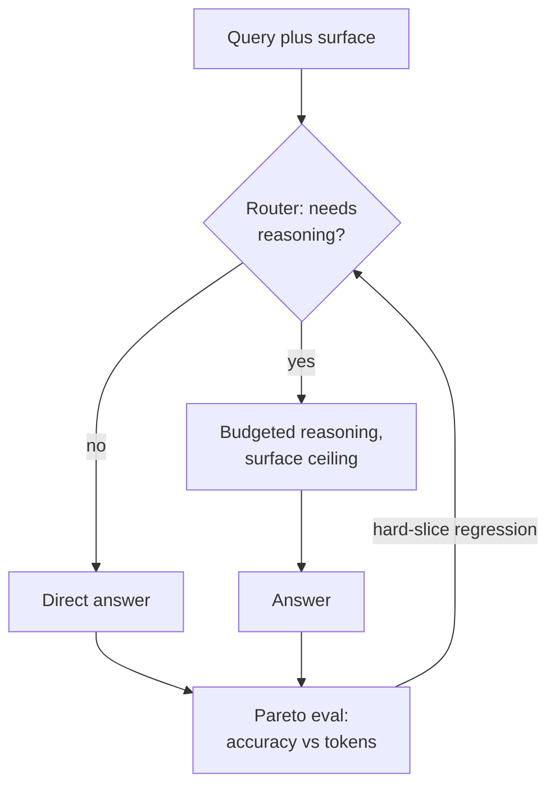

# 🦙 Meta (Superintelligence Labs & product AI) - AI Engineer Interview Questions

> **Last reviewed: October 2026.** Based only on public information - official pages, engineering blogs, and publicly shared candidate reports. Processes change and vary by team; treat this as a map, not a contract. No confidential or leaked material.

## TL;DR

- The loop is the classic standardised Meta big-tech loop adapted for ML: recruiter screen → 45-min coding screen → full loop of up to six 45-min rounds (coding ×2, ML system design, sometimes infra system design, behavioural).
- **Meta now runs an AI-enabled coding round** (piloted from October 2025 and reportedly expanded through 2026 across SWE and engineering-management loops up to E7/M2, typically paired with one classic AI-free coding round - reported, varies): ~60 minutes in a CoderPad-style environment with an LLM assistant (GPT, Claude, Gemini, Llama models available). You're graded on how well you *direct and verify* AI, not on typing speed.
- Candidates consistently report the in-round assistant is **less helpful than in practice environments** (it reportedly will not just point at the bug), so your prompting strategy matters: guide it with your own approach and hypotheses rather than asking for wholesale solutions.
- The coding bar for ML/AI roles is close to a pure SWE loop - Meta expects AI engineers to be strong software engineers first. Don't skimp on data structures and algorithms.
- ML system design is where offers are won at E5+: end-to-end pipelines, ranking/recsys framing, metrics tied to business outcomes (engagement, revenue, integrity coverage) - not academic ML answers.
- Behavioural is a real signal round, scored against five publicly documented axes: resolving conflict, growing continuously, embracing ambiguity, driving results, communicating effectively. Levelling (E4 - E7) is decided largely from scope in your behavioural and design answers.

## Company context

Meta consolidated its AI efforts in mid-2025 into **Meta Superintelligence Labs (MSL)** - comprising TBD Lab (frontier model training), FAIR (research), Products and Applied Research, and MSL Infra - alongside the huge existing surface of product ML: ads ranking, Reels/Feed recommendations, integrity, and the Meta AI assistant. MSL's first public model, **Muse Spark** (April 2026), is a multimodal reasoning model that launched closed: it powers Meta AI across the app, WhatsApp, Instagram, Facebook, Messenger, and Ray-Ban glasses, with API access limited to a partner preview, while Meta says open-weight versions of future models are still planned. That is a real break from the open-weight Llama releases, and a candidate who talks about Meta only as an open-weights lab will sound out of date. "AI engineer" at Meta usually means Machine Learning Engineer or Research Engineer: a strong software engineer who ships models into systems serving billions of users. Engineers want in for frontier-scale training runs, the reach of shipping one model across Meta's apps and devices, the open-weight legacy of Llama, and arguably the largest recsys/ads ML deployment in the industry.

## Roles & titles they hire

- **Machine Learning Engineer** (product ML: ads, ranking, recsys, integrity - the highest-volume AI role)
- **Software Engineer, Machine Learning** (ML infra / PyTorch / serving)
- **AI Research Engineer** and **Research Engineer** in Meta Superintelligence Labs (public postings span media, language/personalization, agents, trust/safety, and evaluations - e.g. "AI Research Engineer, Media" and "Research Engineer, Language - Personalization")
- **AI Research Scientist / Research Scientist** (publication-oriented; separate loop with research talks, typically PhD)
- Levels are the standard Meta E-ladder (E4 - E7 for ICs); see [levels.fyi](https://www.levels.fyi/) for how Meta levels map across the industry.

## The interview loop

Meta's loop is unusually well documented, including an official prep page ([metacareers.com/ML-prep-onsite](https://www.metacareers.com/ML-prep-onsite/)). Typical MLE/AI-engineer path:

| Stage | Format | What's evaluated |
|---|---|---|
| Recruiter screen | 20-30 min call / async questionnaire | Background, ML domain preference (ranking, ads, integrity, GenAI, infra), levelling calibration |
| Technical screen | 45 min, 2 medium DS&A problems, shared editor | Problem solving, clean working code, complexity analysis, communication |
| Full loop: coding ×1-2 | 45 min each, 2 problems per round | Same bar as SWE coding: correctness, verification, speed across two problems |
| Full loop: AI-enabled coding | ~60 min, multi-file CoderPad with built-in LLM chat (choice of GPT, Claude, Gemini, Llama models) | Three reported phases on a pre-written codebase: bug fixing, core implementation (~120+ lines), then optimisation for larger datasets - finishing everything is not required. Graded on problem solving, code understanding, verifying AI output before using it, and communication (rolled out Oct 2025, replacing one classic coding round; now widely reported in MLE loops - varies by role) |
| Full loop: ML system design ×1-2 | 45 min, open-ended ("Design X at Meta scale") | Problem framing, data/features, model choice, training + serving pipeline, metrics tied to business objectives. Recent candidate reports: less time on feature-engineering theory, deeper probing on evaluation (offline and online) |
| Full loop: infra system design | 45 min | Distributed systems, scaling, storage/serving (reported, varies - more common at E5+/infra-leaning roles) |
| Full loop: behavioural | 45 min | Five signals: conflict resolution, continuous growth, ambiguity, driving results, communication; scope determines level |

MSL research-track loops (Research Engineer / Research Scientist) reportedly add research depth interviews and, for scientists, a research talk - public detail here is thinner, so treat MSL-specific structure as (reported, varies).

## What they emphasise

- **SWE bar first.** Public prep guides drawing on Meta's own MLE prep materials describe software engineering as rated at expert level for MLE roles - the same bar as a pure SWE loop. Two-problems-in-45-minutes pacing is the norm; a correct-but-slow single solution is a weak signal.
- **Directing AI, not resisting it.** The AI-enabled round exists because Meta wants engineers who are productive with LLM assistants. Public guidance from candidates and prep sites converges on: use the AI, but demonstrate you understand, test, and can explain every line you keep.
- **Business-metric fluency.** ML design answers are expected to connect model decisions to engagement, revenue, or integrity coverage. "I'd use a transformer" without a metric story loses to a simpler model with a crisp measurement plan.
- **End-to-end ownership.** Data collection → features → training → deployment → monitoring → iteration. Meta's own prep material frames ML design as full-pipeline, not model-architecture trivia.
- **Move-fast culture signals.** Behavioural rounds probe autonomy, ambiguity tolerance, and quantified impact - bring numbers ("reduced p99 latency 40%", "lifted CTR 1.2%").

## Representative questions

*Representative questions synthesised from this company's publicly known focus areas and role descriptions - not leaked questions.*

### 1. Design the recommendation system for Instagram Reels.

<details><summary><b>Answer</b></summary>

Start with the objective: maximise long-term engagement (watch time, likes, shares, follows) subject to integrity and diversity constraints. Then lay out the canonical multi-stage funnel.

**Retrieval:** from billions of videos, pull ~thousands of candidates per request using multiple sources - a two-tower model (user tower vs. item tower, dot-product scored via ANN index), social graph signals, and trending/fresh-content pools. Two-tower matters here because item embeddings can be precomputed and served from an ANN index at low latency.

**Ranking:** a heavier model (large multi-task neural net) scores ~hundreds of candidates on predicted probabilities of discrete events: p(watch>3s), p(like), p(share), p(hide). Combine with a tuned value function, e.g. `score = Σ w_i · p(event_i)`, where weights encode product strategy.

**Re-ranking:** apply diversity rules (don't show 10 videos from one creator), integrity demotions, freshness boosts, and creator-fairness constraints.

**Training:** log impressions + engagements; watch for position bias (correct with position as a feature at train time, removed at serve time) and feedback loops. Features must be logged at serving time to avoid training-serving skew.

**Metrics:** offline AUC/recall@k per head; online A/B on watch time, retention (the real target), plus guardrails: integrity prevalence, creator concentration. Call out the offline-online gap explicitly - offline gains often don't transfer.

**Follow-ups:** How do you handle cold-start for brand-new videos with zero engagement? What breaks in this design at 100k QPS, and where do you spend your latency budget?

</details>

### 2. You're dropped into an unfamiliar multi-file codebase with a failing behaviour and an LLM assistant available. Walk me through how you'd fix it.

<details><summary><b>Answer</b></summary>

This mirrors Meta's AI-enabled coding round, so the answer is a disciplined workflow, not a prompt dump.

1. **Orient before prompting (5 min).** Skim the file tree, entry point, and the test or repro. Form a hypothesis about the data flow. Use the LLM for orientation summaries ("summarise what module X does given this code") rather than "find the bug" - reports from candidates say the interview AI is often constrained from just handing you the defect.
2. **Reproduce and localise.** Run the failing case, add prints/asserts at module boundaries, and bisect the pipeline. Localise to a function before involving the AI in fixes.
3. **Targeted AI use.** Paste the *specific* function plus observed vs. expected behaviour. Ask for candidate failure modes (off-by-one, type coercion, mutation of shared state), not a rewrite.
4. **Verify everything you accept.** Re-run the repro, add a regression test, and check edge cases the AI didn't mention (empty input, unicode, overflow). The publicly reported evaluation axes for this round are problem solving, code quality, *verification*, and communication - verification is the differentiator.
5. **Narrate.** Explain to the interviewer what you asked, why, and how you validated the answer. Silent prompting reads as dependence; narrated prompting reads as tool mastery.

**Follow-ups:** The AI proposes a fix that passes the given test but you suspect it's wrong in general - what do you do? When would you *not* use the assistant at all?

</details>

### 3. Two-part coding warm-up: given a stream of user actions, return the k most engaged-with items. Then: why might your heap solution be the wrong choice in production?

<details><summary><b>Answer</b></summary>

Interview answer first - count then select:

```python
import heapq
from collections import Counter

def top_k(actions: list[str], k: int) -> list[str]:
    counts = Counter(actions)            # O(n)
    return heapq.nlargest(k, counts, key=counts.get)  # O(m log k), m unique items
```

Total O(n + m log k) time, O(m) space. Mention the alternative: bucket sort by count gives O(n + m) if counts are bounded, and Quickselect gives average O(m). Meta coding rounds expect two problems in 45 minutes, so state complexity unprompted and move on.

Production part: at Meta scale the stream doesn't fit in one process's memory and "top-k" becomes an approximate, distributed problem. A Counter over billions of events per hour blows memory (O(m) with m in the hundreds of millions). Real systems use sketches - Count-Min Sketch for frequencies plus a small heap of candidates - accepting bounded overestimation error for O(1) updates and fixed memory. You'd also shard by item ID, aggregate per-shard top-k, and merge, noting that per-shard top-k merge is only approximate unless you re-query counts for the union of candidates. Time-decay matters too: engagement top-k usually wants a sliding window or exponential decay, which a plain Counter can't express.

**Follow-ups:** Implement the sliding-window version. How much error does a Count-Min Sketch with width w and depth d introduce, and how do you size it?

</details>

### 4. Explain the architectural choices in a Llama-class model: why grouped-query attention, RoPE, and SwiGLU instead of the vanilla 2017 Transformer?

<details><summary><b>Answer</b></summary>

Each choice trades a small quality delta for large efficiency or extrapolation gains.

**Grouped-query attention (GQA):** vanilla multi-head attention stores K/V per head, so the KV cache scales with head count - the binding constraint at inference, since cache size limits batch size and therefore throughput. Multi-query attention (one shared K/V) shrinks the cache dramatically but costs quality. GQA interpolates: groups of query heads share K/V heads, recovering most MQA memory savings with near-MHA quality. For a serving fleet the KV-cache reduction directly converts to more concurrent users per GPU.

**RoPE (rotary position embeddings):** instead of adding absolute position vectors, rotate Q/K pairs by position-dependent angles so attention scores depend on *relative* offsets. This behaves better at long context, composes with context-extension tricks (scaling the rotation base, e.g. NTK-aware scaling or YaRN-style methods) and avoids learned-embedding table limits.

**SwiGLU:** a gated FFN (`swish(xW) ⊙ xV`) empirically outperforms ReLU/GELU FFNs at matched parameter count; the gate lets the network modulate information flow. Usually paired with a 2/3-scaled hidden dim to keep FLOPs equal.

Also worth naming: RMSNorm (cheaper than LayerNorm, pre-norm placement for training stability) and no biases in linear layers. The meta-point interviewers want: every deviation from the 2017 recipe is justified by inference cost, training stability, or length extrapolation - not fashion.

**Follow-ups:** How does GQA interact with KV-cache quantization? Why did later frontier models move toward MoE layers, and what does that do to serving?

</details>

### 5. Walk me through a post-training recipe to turn a pretrained base model into a personalized assistant.

<details><summary><b>Answer</b></summary>

This maps to MSL's publicly posted "Research Engineer, Language - Personalization" scope. The recipe, in order:

**1. SFT:** fine-tune the base model on curated instruction - response pairs covering the assistant's target distribution (dialogue, tool use, refusals). Quality beats quantity - tens of thousands of excellent examples outperform millions of noisy ones. This teaches format and instruction-following, not preferences.

**2. Preference optimisation:** collect pairwise comparisons (human and increasingly LLM-judge labelled). Two paths: RLHF (train a reward model, optimise with PPO/GRPO against it, with a KL penalty to the SFT policy to prevent reward hacking) or DPO (directly optimise on preference pairs - simpler, no reward model or rollout infra, but less controllable and more prone to distribution drift on off-policy data). Most production recipes now iterate multiple rounds: generate on-policy samples, label, retrain.

**3. Personalization layer:** the interesting design decision. Options: (a) context injection - retrieve user memory/preferences into the prompt; cheap, auditable, no training; (b) train the model to *use* memory tools and profile signals via targeted SFT/RL data; (c) per-user adapters - rarely worth it at billions of users. In practice (a)+(b): post-train the model to condition on a memory block, and build eval sets that check it respects stated preferences without over-personalizing or leaking them.

**Evaluation:** side-by-side human prefs, per-capability automatic evals, safety regressions after every stage - post-training routinely breaks earlier capabilities, so gate on a full dashboard, not one win-rate.

**Follow-ups:** Where does reward hacking show up concretely, and how do you detect it? How do you evaluate "personalization quality" without violating privacy?

</details>

### 6. Design the harmful-content detection system for Facebook and Instagram uploads.

<details><summary><b>Answer</b></summary>

Frame it as a cost-asymmetric, adversarial, multi-stage pipeline - this is Meta's "integrity" domain.

**Requirements:** billions of uploads/day across text, image, video; multiple policy areas (violence, CSAM, hate, spam) each with its own precision/recall tradeoff; adversarial actors who adapt; human review capacity is the scarce resource.

**Architecture:** (1) cheap synchronous filters at upload - hash matching (PDQ/perceptual hashes for known-bad content), lightweight classifiers - to block the worst instantly; (2) heavier async models within seconds-to-minutes - multimodal classifiers that fuse image/video embeddings with caption and poster signals, since evasive content is often only decodable cross-modally; (3) a routing layer that sends mid-confidence content to human review queues, ranked by predicted severity × predicted reach (virality-aware prioritisation beats FIFO); (4) enforcement actions graded by confidence: delete, demote, warn, or age-gate.

**Key metrics:** prevalence (what fraction of *views* are violating - Meta's publicly reported north star) rather than raw takedown counts; precision of automated actions (false positives burn user trust and appeal capacity); reviewer hours saved.

**Hard parts to name:** adversarial drift (retrain cadence, canary sets of known evasions), policy ambiguity (borderline content needs calibrated scores, not binary), cross-language coverage, and feedback loops - demoted content generates fewer labels, biasing future training. Mitigate with random sampling audits that measure true prevalence independent of enforcement.

**Follow-ups:** How do you evaluate a model change when labels are policy-dependent and reviewers disagree ~15% of the time? Where would you insert an LLM into this pipeline, and for which policy areas is it too slow or expensive?

</details>

### 7. You need to serve a Llama-class 70B+ model to hundreds of millions of assistant users. What does the serving stack look like and where does the money go?

<details><summary><b>Answer</b></summary>

Direct answer: the stack is continuous batching + paged KV cache + quantization + speculative decoding on top of tensor-parallel model shards, and the money goes to *decode-phase memory bandwidth*, not compute.

**Core facts to anchor on:** a 70B model in bf16 is ~140 GB of weights - already multi-GPU (tensor parallelism across 2-8 GPUs). Prefill is compute-bound and parallel; decode is sequential and memory-bandwidth-bound, generating one token per forward pass while re-reading all weights plus a growing KV cache. Per-user KV cache is the real capacity limiter: it scales with layers × kv-heads × head-dim × context length, which is exactly why GQA (Q4) matters.

**Standard levers:**
- **Continuous batching** (schedule at token granularity, not request granularity) - the single biggest throughput win, often several-fold over static batching.
- **Paged KV cache** (vLLM-style) to eliminate fragmentation and push batch sizes up.
- **Quantization:** weights to FP8/INT8/INT4 and KV cache to FP8 - cuts memory and bandwidth with small, eval-gated quality loss.
- **Speculative decoding:** a small drafter proposes tokens, the big model verifies in one pass - 2-3× decode speedups when acceptance is high.
- **Disaggregated prefill/decode** and prefix caching (system prompts shared across all users are computed once).

**SLOs:** time-to-first-token (prefill) vs. inter-token latency (decode) are different budgets with different fixes; say which you're optimising. At Meta assistant scale, routing tiers matter too - send simple queries to a small model, escalate hard ones.

**Follow-ups:** Your p99 TTFT doubles at peak traffic - what are the top three suspects? When does speculative decoding *hurt* throughput?

</details>

### 8. Your ads CTR model shows a 2% offline AUC gain, but the online A/B shows revenue-neutral results with worse calibration. What's going on and what do you do?

<details><summary><b>Answer</b></summary>

This is the offline - online gap, and in ads specifically, calibration is money: predicted CTR feeds directly into the auction (bid × pCTR), so a model can rank better (higher AUC) while producing systematically biased probabilities that misprice every auction.

**Diagnosis order:**
1. **Calibration first.** AUC is rank-only. Check calibration curves per segment (new vs. seasoned ads, high vs. low pCTR buckets). A common failure: the new model overpredicts on the head, inflating effective bids for popular ads, shifting auction outcomes without adding revenue.
2. **Training - serving skew.** Verify features are identical at train and serve time (log serving features, don't recompute). A feature computed from post-click data leaking into training is the classic silent AUC inflator.
3. **Feedback loop / selection bias.** Offline eval uses logs generated by the *old* policy. The new model surfaces different ads whose true CTR was never observed - offline gains on old-policy logs routinely evaporate online. Counterfactual estimators (IPS) or interleaving give better pre-launch estimates.
4. **Auction interaction.** Revenue-neutral can mean CTR gains were offset by lower prices; decompose revenue = impressions × CTR × CPC.

**Actions:** add a calibration layer (Platt/isotonic, or per-segment recalibration) retrained on fresh online data; gate launches on calibration error and revenue, not AUC; if skew is found, fix the logging pipeline before touching the model.

**Follow-ups:** Why is isotonic regression risky with sparse segments? How would you design the holdback experiment to measure long-term advertiser value, not just next-day revenue?

</details>

### 9. What breaks when you scale LLM training from 8 GPUs to thousands, and how do modern stacks deal with it?

<details><summary><b>Answer</b></summary>

Four things break: memory, communication, reliability, and numerics.

**Memory:** the model no longer fits. Plain data parallelism replicates weights + optimizer states (Adam holds 2 extra states; mixed precision means ~16 bytes/param all-in). Answer: shard everything - FSDP/ZeRO-3 shards params, grads, and optimizer states across ranks, gathering shards just-in-time per layer. For frontier scale you compose parallelisms: tensor parallel within a node (needs NVLink-class bandwidth), pipeline parallel across nodes, data parallel across the rest, plus context/sequence parallelism for long sequences and expert parallelism for MoE.

**Communication:** all-reduce/all-gather volume grows with scale; interconnect topology starts dictating the parallelism layout. Overlap comm with compute (bucketed gradient reduction during backward) or the GPUs idle. Pipeline bubbles are attacked with microbatching and interleaved schedules.

**Reliability:** at thousands of GPUs, hardware failure is a *when-per-day*, not an if - Meta's published Llama 3 work reported frequent interruptions across its 16k-GPU runs, largely GPU/HBM-related. You need fast distributed checkpointing (asynchronous, sharded), automated failure detection and job restart, and straggler detection - one slow GPU throttles a synchronous step globally.

**Numerics/stability:** loss spikes at scale - mitigations include bf16 with fp32 master weights, gradient clipping, careful warmup, and skipping/rewinding bad data batches. Silent data corruption on rare bad hosts is a real, publicly documented failure class; detect via redundant computation checks.

**Follow-ups:** How do you pick the TP × PP × DP layout for a given cluster topology? What makes MoE training harder to load-balance than dense?

</details>

### 10. How would you build the evaluation system for a Meta AI assistant before and after each model release?

<details><summary><b>Answer</b></summary>

Layered evals, each catching what the previous layer can't, with a hard gate before ramp.

**Layer 1 - capability suites (per-commit, cheap):** automatic benchmarks across reasoning, coding, instruction-following, multilingual, tool use. Treat public benchmarks as smoke tests only - contamination makes them unreliable for decisions - and maintain internal held-out suites that rotate.

**Layer 2 - LLM-as-judge on production-shaped traffic (nightly):** sample real (privacy-scrubbed) query distributions, generate with candidate vs. incumbent, judge pairwise with a strong model. Critical hygiene: validate the judge against human labels per category, randomise response order (position bias), track judge drift, and never let a model family judge itself unchecked.

**Layer 3 - targeted human evaluation (per-release):** trained raters on stratified samples, focused where judges are weak - factuality on fresh events, cultural nuance, subtle safety. Measure inter-rater agreement; if raters disagree heavily, fix the rubric before trusting the numbers.

**Layer 4 - safety/integrity regressions (blocking):** adversarial red-team suites, jailbreak prompts, self-harm/medical/elections behaviour. These are gates, not dashboards - a capability win never ships with a safety regression.

**Layer 5 - online:** small-percentage ramp with A/B on engagement, thumbs feedback, escalation rates, and latency/cost; automated rollback triggers.

The design principle to state: each layer trades fidelity for cost - commit-time evals are cheap and weakly predictive, online is expensive and definitive - and the release decision aggregates across layers rather than optimising any single number.

**Follow-ups:** Your judge prefers the new model 60/40 but human raters are 50/50 - which do you trust and how do you find out why? How do you eval memory/personalization features without storing sensitive user data in eval sets?

</details>

### 11. How do modern multimodal models get image and video understanding into an LLM, and what changes for video specifically?

<details><summary><b>Answer</b></summary>

The dominant pattern is: a pretrained vision encoder (ViT-family, contrastively or self-supervised trained) produces patch embeddings; a projector/adapter (linear layer, MLP, or a cross-attention resampler like a Perceiver that compresses variable patches into a fixed token budget) maps them into the LLM's embedding space; the image becomes a sequence of "visual tokens" interleaved with text. Training proceeds in stages: adapter-only alignment on image-text pairs first, then instruction tuning with (some or all of) the LLM unfrozen on visual-QA/dialogue data. Early-fusion alternatives (training a single model on interleaved multimodal tokens from scratch, in the style of Meta's published Chameleon work) are cleaner conceptually but costlier to train and harder to stabilise.

**Video changes three things:**
1. **Token budget explodes** - even 1 fps × hundreds of patches/frame overflows context. You need temporal sampling, per-frame token compression, or memory mechanisms; naive "every frame as an image" dies immediately.
2. **Time becomes a first-class signal** - action recognition and causality need motion, not just per-frame semantics; encoders with temporal attention or explicit temporal position encodings outperform frame-independent ViTs on anything dynamic.
3. **Audio and ASR** - much of video meaning is in speech; production systems fuse ASR transcripts and audio embeddings, and the fusion strategy often matters more than the vision encoder choice.

For Meta-scale ranking/integrity use, note the cost tier: you can't run a large VLM on every uploaded video, so distill into small per-surface models and reserve the big model for escalations.

**Follow-ups:** When does a contrastive (CLIP-style) encoder underperform a captioning-trained one as the LLM's eyes? How would you detect that your VLM is answering from the caption text and ignoring pixels?

</details>

### 12. Behavioural: tell me about a time you drove a significant result through ambiguity, and a time you were wrong.

<details><summary><b>Answer</b></summary>

Meta scores behavioural rounds against five published signals - resolving conflict, growing continuously, embracing ambiguity, driving results, communicating effectively - and your *scope* in these stories heavily influences levelling (E5 = owns a problem, E6 = owns a problem space and influences other teams).

Structure each story as situation → your specific actions → quantified result → reflection. For the ambiguity story, strong answers show you *created* structure: "The goal was 'improve model quality' with no definition. I proposed three candidate metrics, got alignment from PM and two partner teams on one, built the eval harness, and shipped a change that moved it 8%." Weak answers describe surviving chaos rather than resolving it.

For the "time you were wrong" story, the trap is picking a fake weakness. Pick a real technical or judgment error with consequences - "I pushed for architecture X, we lost six weeks, the data showed my assumption about traffic patterns was wrong" - then show the loop closing: what you changed in how you make decisions, and evidence the change stuck. Interviewers explicitly probe for "growing continuously"; a candidate who can't name a genuine error reads as unreflective, which caps the level.

Meta-specific calibration: quantify everything (metrics moved, weeks saved, teams unblocked), keep each story under ~3 minutes with room for probing, and prepare ~5 stories covering conflict with a peer, cross-functional influence, a failure, ambiguity, and impact without authority - the coverage set public prep guides consistently recommend.

**Follow-ups:** What would the person you disagreed with say about how you handled it? What did you explicitly decide *not* to do, and why?

</details>

### 13. One reasoning model now serves Meta AI across WhatsApp, Instagram, Facebook, and smart glasses. How would you cut reasoning tokens per query at that scale without losing accuracy?

<details><summary><b>Answer</b></summary>

Treat thinking tokens as a budget allocated per query, not a fixed habit. Most assistant traffic does not need long reasoning, so the wins come in three places: deciding whether to think, making thinking shorter when you do, and proving the hard tail did not regress. Meta pitched its April 2026 MSL model partly on reasoning efficiency, so expect this framing.

**Route before reasoning.** A cheap classifier, or a learned first decision by the model itself, picks no-think, short, or long budget per query. Label training data offline: run queries with and without extended reasoning and mark the ones where reasoning changed the correct answer. Each surface sets a ceiling, because a spoken reply on glasses has a far tighter latency budget than a chat reply.

**Train for concision.** In RL, combine the correctness reward with a penalty on tokens beyond a target budget, or score each sample against the shortest correct answer in its group, which GRPO-style group sampling makes cheap. Separately, distil: sample many traces, keep the shortest correct one, and fine-tune on those.

**Control at inference.** Hard caps that force an answer once the budget is spent, and early exit when intermediate answers stop changing.

**Measure the right thing.** Plot accuracy against tokens per category and compare Pareto curves, not mean token counts. Hold out hard slices, such as multi-step maths and tool use, because averages hide underthinking. Track p95 latency and serving cost per surface.

**Risks to name.** A length penalty can teach the model to guess on hard problems instead of reasoning. Truncated traces can still score well on easy evals. And shorter, compressed reasoning is less legible to the safety monitors that read it, so check monitor recall did not drop.

**Worth sketching.** The flow shows budget decided before generation, with the eval loop feeding back into the router.



**Follow-ups:** Your length penalty cut tokens sharply and the aggregate eval is flat, but complaints on hard queries rise. How do you find the regression? How would you set the budget for a voice reply on glasses versus a chat reply?

</details>

## How to prepare

Mapped to this repo:

- **[01-ml-and-dl-foundations](../01-ml-and-dl-foundations/README.md)** - non-negotiable for product-ML loops: Meta's ML design rounds still lean on classic supervised learning, calibration, and evaluation fundamentals (see Q8).
- **[02-llm-fundamentals](../02-llm-fundamentals/README.md)** - GenAI/MSL-adjacent roles will probe Llama-style architecture details (GQA, RoPE, KV cache); go deep here (see Q4).
- **[05-fine-tuning-and-alignment](../05-fine-tuning-and-alignment/README.md)** - post-training (SFT → RLHF/DPO) is the day job for much of MSL's publicly posted roles (see Q5).
- **[07-evaluation-and-observability](../07-evaluation-and-observability/README.md)** - Meta design rounds are won on measurement plans; internalise offline/online gaps and LLM-judge hygiene (see Q10).
- **[08-inference-and-production](../08-inference-and-production/README.md)** - serving economics (batching, KV cache, quantization, speculative decoding) come up for any assistant/GenAI role (see Q7).
- **[10-multimodal](../10-multimodal/README.md)** - relevant if targeting media/PAR-type teams (see Q11).
- **[11-ai-system-design](../11-ai-system-design/README.md)** - the highest-leverage directory for this loop. The closest case study is **[content moderation pipeline](../11-ai-system-design/case-studies/05-content-moderation-pipeline.md)** - integrity is one of Meta's largest ML surfaces and a common design prompt shape (see Q6).

Company-specific moves:

1. **Practice the AI-enabled round for real.** Recruiters reportedly provide CoderPad practice access - use it. Separately, practice fixing bugs in unfamiliar repos with an LLM in chat-only mode (no autocomplete, no file edits), narrating aloud. The bottleneck is reading unfamiliar code fast, not prompting.
2. **Drill two-problems-in-45-minutes pacing** on Meta-tagged problem lists - the volume-and-speed bar is the most commonly reported failure mode.
3. **Read Meta's official prep page** ([metacareers.com/ML-prep-onsite](https://www.metacareers.com/ML-prep-onsite/)) and download their MLE loop PDF - it's rare for a company to publish its own rubric; use it as ground truth over any third-party guide, including this one.
4. **Read the Llama papers and Meta AI engineering blog posts** on Llama 3/4 training and infrastructure - training-reliability and architecture questions (Q4, Q9) map directly to what Meta has published. Then read the April 2026 Muse Spark launch coverage for where MSL is heading: closed first, reasoning efficiency, and deployment across every Meta surface (Q13).
5. **Use Meta AI and Reels seriously for a week** and form opinions with metrics attached: what would you measure, what's broken, what would you ship first? "Business acumen" is an explicit evaluation axis in their ML loops.

## Sources

- [Meta Careers - Preparing for Your Full Loop Interview (ML)](https://www.metacareers.com/ML-prep-onsite/) (official)
- [Meta Careers - AI teams page](https://www.metacareers.com/teams/technology/ai/) (official)
- [Hello Interview - Meta's AI-Enabled Coding Interview](https://www.hellointerview.com/blog/meta-ai-enabled-coding)
- [PracHub - Meta's AI-Enabled Coding Interview: What to Expect in 2026](https://prachub.com/resources/meta-ai-coding-interview) (third-party; 2026 expansion up to E7/M2, one classic plus one AI-enabled round)
- [Fortune - Meta unveils Muse Spark](https://www.fortune.com/2026/04/08/meta-unveils-muse-spark-mark-zuckerberg-ai-push) (April 2026; first MSL model, launched closed inside Meta products)
- [Exponent - Meta Machine Learning Engineer Interview Guide](https://www.tryexponent.com/guides/meta-machine-learning-engineer-interview)
- [interviewing.io - How to use AI in Meta's AI-assisted coding interview](https://interviewing.io/blog/how-to-use-ai-in-meta-s-ai-assisted-coding-interview-with-real-prompts-and-examples)
- [IGotAnOffer - Meta Machine Learning Engineer Interview](https://igotanoffer.com/blogs/tech/facebook-machine-learning-engineer-interview)
- [Wikipedia - Meta Superintelligence Labs](https://en.wikipedia.org/wiki/Meta_Superintelligence_Labs)
- [Built In - Meta Superintelligence Labs: What We Know So Far](https://builtin.com/artificial-intelligence/meta-superintelligence-labs)
- [levels.fyi](https://www.levels.fyi/) (levelling reference)
