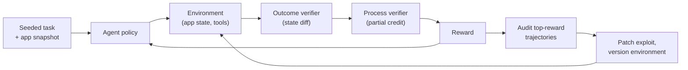

# 📏 Scale AI - AI Engineer Interview Questions

> **Last reviewed: October 2026.** Based only on public information - official pages, engineering blogs, and publicly shared candidate reports. Processes change and vary by team; treat this as a map, not a contract. No confidential or leaked material.

## TL;DR

- Typical loop: recruiter screen → timed HackerRank coding screen → hiring-manager screen → virtual onsite of 4-5 rounds (coding, object-oriented/applied design, debugging, system design, behavioural). ML roles often add a take-home (CV or NLP, ~1 week) and ML deep-dive rounds. Mid-2026 prep guides describe the debugging round as a now-standard onsite fixture (unfamiliar code, a failing test, ~45 minutes, explain as you go) and the whole process as about three weeks from first call to offer (reported, varies).
- System design is **not generic web-scale trivia** - expect their actual problems: data labelling platforms, human-in-the-loop pipelines, LLM evaluation systems, RAG backends, multi-tenant data isolation.
- ML deep dives cover transformers/attention, decoding, post-training (SFT/RLHF/DPO/RLVR), evaluation methodology, and adversarial robustness; some candidates report a research-paper discussion round.
- The behavioural round is a genuine filter: Scale's published credos ("Ownership is the job," "Results speak loudest," and a broader emphasis on truth-seeking and high standards) translate into probing for urgency, extreme ownership, and comfort with intensity. A relaxed, process-heavy vibe reads badly here.
- Context you should know walking in: Meta's June 2025 investment (~49% non-voting stake) and founder Alexandr Wang's departure to Meta reshaped the customer base; under CEO Jason Droege, Scale has leaned into evaluations (SEAL), enterprise agent applications, robotics data, and public-sector work.

## Company context

Scale AI is a data-and-evaluation company for the AI industry: the **Data Engine** (human+model data annotation, RLHF/preference data, RL environments, robotics data), **SEAL** (Safety, Evaluations, and Alignment Lab - private benchmarks and public leaderboards like Humanity's Last Exam, SWE-Bench Pro, and MCP Atlas), an enterprise **GenAI Platform**, and **Donovan** plus other public-sector/defence products. After the June 2025 Meta deal (reported at $14.3B for a ~49% non-voting stake) and Wang's exit to lead Meta's superintelligence effort, some frontier-lab customers pulled back, and the company reoriented towards evaluations, enterprise agents, and government. "AI engineer" at Scale usually means building the systems *around* models - data pipelines, eval harnesses, agent infrastructure, and customer-deployed applications - with a strong customer-facing, ship-this-week flavour rather than pretraining research.

## Roles & titles they hire

Actual posting titles from their careers page / Greenhouse board:

- **Forward Deployed Engineer, GenAI** - full-stack, customer-embedded engineering inside the GenAI Data Engine (RLHF, model evaluation, AI-safety data programs)
- **Software Engineer, Forward Deployed Engineer - GenAI Tasking Experience**
- **Machine Learning Research Engineer** - Agents (Enterprise GenAI), GenAI Applied ML, ML Systems
- **Machine Learning Research Scientist** - Post-Training, Reasoning, Agents
- **Research Scientist** - Agent Robustness, AI Controls and Monitoring (SEAL / Scale Labs)
- **Machine Learning Engineer, Global Public Sector** (Donovan and government deployments)
- **Software Engineer** (product, infrastructure, data platform)

Postings for agents/post-training roles explicitly ask for RLHF/RLVR and PPO/GRPO familiarity and hands-on agent-framework experience (OpenHands, LangGraph, etc.). The ACE (Agent Capabilities & Environments) team pairs researchers with applied AI engineers to build agent benchmarks and RL environments.

## The interview loop

Scale does not publish an official interview guide; the picture below is assembled from multiple third-party guides and candidate reports that are broadly consistent with each other. Composition varies by role and level.

| Stage | Format | What's evaluated |
|---|---|---|
| Recruiter screen | ~30 min call | Background, motivation, comfort with a fast-paced, high-intensity environment. |
| Coding screen | ~60 min HackerRank (sometimes live) | 1-2 medium-to-hard algorithmic problems under time pressure; clean, working code fast. |
| Hiring-manager screen | 30-45 min | Experience deep dive; interest in AI data/infrastructure; role alignment. (reported, varies) |
| ML take-home | CV or NLP task, ~1 week | Practical modelling, code quality, evaluation rigour. ML roles only. (reported, varies) |
| Onsite: coding (x1-2) | 1 hr each | Medium-hard DSA; interval/scheduling patterns show up in reports; speed and edge cases. |
| Onsite: applied / OOD | 1 hr | Object-oriented modelling of a stateful system (card/poker-game simulators are a recurring reported theme); extensibility, state management. (reported, varies) |
| Onsite: debugging | ~45-60 min | Finding logic bugs in an unfamiliar codebase, often starting from a failing test, while narrating your reasoning. Described as standard in mid-2026 reports. (reported, varies) |
| Onsite: system design | 1 hr | Their real problems: labelling platforms, human-in-the-loop orchestration, LLM eval systems, RAG backends, multi-tenant isolation, data flywheels. |
| Onsite: ML deep dive | 1 hr (ML roles) | Transformers/attention, decoding, post-training (SFT/RLHF/DPO), evals, adversarial attacks; sometimes a paper discussion. (reported, varies) |
| Onsite: behavioural | 45-60 min | Values fit: ownership, urgency, results orientation, customer focus. |

Reported end-to-end timeline: roughly 3-6 weeks; some candidates report offers in ~3 weeks.

## What they emphasise

- **Speed with correctness.** Reports consistently describe timed coding at a brisk bar. Scale's culture pages stress "high bias for action" - interviewers reward candidates who get a working solution quickly, then harden it.
- **Human-in-the-loop systems thinking.** Their core business is orchestrating humans and models together. Design answers that account for annotator quality, consensus, re-review queues, and cost/throughput tradeoffs signal you understand the actual product.
- **Evaluation as a first-class discipline.** SEAL is now a headline business line (15 new benchmarks and 450+ evaluations across 50+ model releases in 2025, per their own blog). Expect probing on how you'd measure quality - of labels, of models, of agents - including contamination and rubric design.
- **Post-training literacy.** SFT/RLHF/DPO/RLVR and PPO/GRPO appear directly in job requirements. You should know what data each method consumes - because producing that data is Scale's business.
- **Extreme ownership and customer focus.** FDE and enterprise roles are explicitly customer-embedded with fast turnarounds. Behavioural stories should feature you owning outcomes end-to-end under deadline pressure, not coordinating committees.
- **Adaptability to a shifting company.** Post-Meta-deal, the business mix moved fast (evals, agents, robotics data, public sector). They screen for people energised rather than unsettled by that.

## Representative questions

*Representative questions synthesised from this company's publicly known focus areas and role descriptions - not leaked questions.*

### 1. Design an end-to-end pipeline that produces RLHF preference data for a frontier-lab customer: 100k prompt-response comparisons a week, with quality guarantees.

<details><summary><b>Answer</b></summary>

Decompose into: task generation → routing → annotation → quality control → delivery. Prompts and response pairs land in a task store; a router assigns tasks to annotators based on skill tags (domain, language) and trust score. The annotation UI captures the preference plus a rationale and confidence.

Quality is the hard part, and it's layered. First, **gold tasks**: seed ~5% of the queue with items whose correct answer is known; an annotator's gold accuracy feeds a trust score. Second, **overlap**: route each real task to k annotators (k=3 baseline, k=1 for high-trust annotators on easy tasks, k=5 for safety-critical ones) and compute agreement; disagreements go to an expert re-review queue. Third, **model-assisted screening**: an LLM judge pre-flags likely-wrong or low-effort submissions (rationale too short, response time implausibly fast) for audit rather than auto-rejection - the humans are the ground truth, the model is a smoke detector.

Throughput math matters: 100k comparisons at average k=2.2 overlap and ~4 min/task is ~15k annotator-hours/week; the router must keep utilisation high without starving rare-skill queues. Deliver with per-batch quality metrics (agreement rates, gold accuracy, audit outcomes) so the customer can filter, and version everything - instructions, rubric, annotator pool - because instruction drift silently shifts label distributions.

**Follow-ups:** How does the design change when the customer requires their data never train other customers' models? What breaks when a new task type launches and there are no gold tasks yet?

</details>

### 2. Your annotators have no ground truth - the tasks are subjective preference judgments. How do you measure and improve label quality?

<details><summary><b>Answer</b></summary>

Separate "is the annotator reliable" from "is the label correct," because for subjective tasks only the first is fully measurable.

Reliability toolkit: **inter-annotator agreement** (Cohen's/Fleiss' kappa, not raw agreement - raw agreement is inflated when one class dominates), **gold/honeypot tasks** for objective sub-checks (instruction-following, factuality components of a rubric), **intra-annotator consistency** (re-serve the same item weeks later; self-disagreement flags noise), and **behavioural signals** (time-on-task distributions, straight-lining, copy-paste rationales).

For genuinely subjective judgments, low agreement isn't automatically bad labels - it can be real distributional signal. So: decompose the rubric until components are as objective as possible (correctness, harmlessness, formatting each rated separately, preference derived from weighted components), measure agreement per component, and where residual disagreement persists, *keep* the distribution rather than forcing consensus - for preference data, soft labels (70/30 splits) carry more information than a coin-flip majority vote.

Improvement loop: calibration sessions where annotators grade shared items then discuss deltas against expert adjudication; targeted retraining triggered by per-component agreement drops; and instruction changelogs, because most sudden quality "drops" trace to a rubric edit, not the workforce.

**Follow-ups:** Your kappa is 0.45 on a task the customer insists is objective - walk me through your diagnosis. When would you fire an annotator versus retrain them?

</details>

### 3. Design a private LLM benchmark and leaderboard (SEAL-style). How do you keep it trustworthy as labs optimise against it?

<details><summary><b>Answer</b></summary>

Trustworthiness rests on three pillars: contamination resistance, grading validity, and comparability over time.

**Contamination:** keep the eval set private - never returned via API logs, never shipped to model providers in bulk. Run models through inference endpoints you control, monitor for memorisation tells (verbatim continuations of held-out items), and maintain a rotating refresh pool: retire a slice of items each quarter, replaced by new expert-written ones, with overlap between versions so scores remain comparable via equating. Publish the *methodology*, not the items.

**Grading:** prefer verifiable outcomes (test suites for code, exact-match for math) where possible. Where human judgment is required, use rubric-anchored expert graders with double-grading and adjudication, and report inter-grader agreement alongside scores. If using LLM judges, validate them against human panels per-domain and re-validate whenever the judge model changes - a judge upgrade can silently reorder a leaderboard.

**Comparability:** report confidence intervals (bootstrap over items), fixed decoding configs, and n>1 sampling for high-variance tasks. Elo-style pairwise rankings are robust to item difficulty shifts but hide absolute capability; absolute scores show progress but break on refresh. Publish both.

The adversarial pressure is real: a leaderboard that matters becomes a target. The defence is institutional too - separate the team building evals from any team selling data to the labs being ranked, and disclose conflicts.

**Follow-ups:** A lab disputes their score and demands the failing items - what do you give them? How do you detect that a model was trained on paraphrases of your set?

</details>

### 4. Build the task-lifecycle core of an annotation platform. Start simple; I'll add requirements: consensus of k annotators, then priority re-review, then annotator cooldowns.

<details><summary><b>Answer</b></summary>

This is a progressive-spec OOD problem - protect yourself with a narrow interface and an explicit state machine, because every new requirement is a new state or transition.

```python
from enum import Enum, auto

class State(Enum):
    PENDING = auto(); ASSIGNED = auto(); SUBMITTED = auto()
    NEEDS_REVIEW = auto(); COMPLETE = auto()

class Task:
    def __init__(self, task_id: str, k: int = 1):
        self.id, self.k = task_id, k
        self.state = State.PENDING
        self.labels: list[tuple[str, str]] = []  # (annotator, label)

    def submit(self, annotator: str, label: str) -> None:
        assert self.state in (State.ASSIGNED, State.PENDING)
        self.labels.append((annotator, label))
        self.state = (State.COMPLETE if self._consensus()
                      else State.NEEDS_REVIEW if len(self.labels) >= self.k
                      else State.PENDING)

    def _consensus(self) -> bool:
        if len(self.labels) < self.k:
            return False
        votes = [l for _, l in self.labels]
        return votes.count(max(set(votes), key=votes.count)) > self.k // 2
```

Consensus lands as a pure function on collected labels - swappable for weighted-by-trust voting later. Priority re-review means the queue becomes a heap keyed on `(priority, created_at)` and `NEEDS_REVIEW` items enter with elevated priority. Cooldowns live in the *router*, not the task: `can_assign(annotator, task)` checks a per-annotator recent-history set (no re-labelling your own task, rate caps). Keep assignment policy, consensus policy, and task state in three separate objects - the interviewer is testing whether requirement four forces a rewrite of requirement one.

**Follow-ups:** Two annotators submit simultaneously from different workers - where's your race, and how do you fix it? How would you persist this so a crashed worker's assignment times out?

</details>

### 5. Coding: given annotation sessions as (start, end) timestamps, return the peak number of concurrent annotators, and the intervals during which the platform was at peak load.

<details><summary><b>Answer</b></summary>

Sweep line: convert each session to two events, sort, scan. O(n log n) time, O(n) space.

```python
def peak_load(sessions: list[tuple[int, int]]) -> tuple[int, list[tuple[int, int]]]:
    events = []
    for s, e in sessions:
        events.append((s, 1))
        events.append((e, -1))
    events.sort(key=lambda x: (x[0], x[1]))  # ends before starts at same t

    peak = cur = 0
    for _, delta in events:
        cur += delta
        peak = max(peak, cur)

    cur, intervals, open_t = 0, [], None
    for t, delta in events:
        cur += delta
        if cur == peak and open_t is None:
            open_t = t
        elif cur < peak and open_t is not None:
            intervals.append((open_t, t))
            open_t = None
    return peak, intervals
```

Edge cases to raise unprompted: does a session ending at *t* overlap one starting at *t*? The sort key `(t, delta)` processes ends first, treating [1,5) and [5,9) as non-overlapping - state the convention and ask. Empty input (return `(0, [])`) and duplicate timestamps fall out correctly. Filter zero-length sessions up front: the ends-first ordering processes their end before their start, which briefly dips the counter and can split one peak interval into two. Second pass could be fused into the first by collecting candidate intervals whenever `cur == peak`, but two clean passes beat one clever one under interview time pressure.

Interval/scheduling patterns recur in Scale candidate reports because they mirror the real domain: annotator capacity planning, task-queue load, overlapping labelling shifts.

**Follow-ups:** Now sessions stream in real time - maintain the running peak. Memory limit says you can't store all events - what do you approximate, and with what error?

</details>

### 6. Compare SFT, RLHF, DPO, and RLVR for improving an instruction-tuned model. What data does each need, and when would you pick which?

<details><summary><b>Answer</b></summary>

The methods form a ladder of data cost versus signal precision.

**SFT** needs demonstrations - (prompt, ideal response) pairs. Cheapest to reason about, most expensive per token of human effort at high quality. Pick it to establish format, style, and baseline instruction-following; it can only teach behaviours your demonstrators exhibit.

**RLHF (PPO-style)** needs preference comparisons to train a reward model, then on-policy RL. Preferences are cheaper per judgment than demonstrations and capture "better/worse" where "ideal" is unwritable. Costs: reward-model exploitation (reward hacking), KL-regularization tuning, and heavy infrastructure - four models in memory for PPO.

**DPO** consumes the same preference pairs but optimises the policy directly, no reward model, no RL loop. Dramatically simpler and often comparable for alignment-style objectives; weaker when you need on-policy exploration or fine-grained credit assignment, and it's more sensitive to preference-data distribution shift from the policy.

**RLVR** replaces the learned reward with a programmatic verifier - unit tests, math checkers, environment success signals. No reward model to hack, but it only works where correctness is checkable, and it shifts the data problem to *building environments and verifiers* - which is exactly the product Scale now sells (RL environments were a named 2026 priority in their CEO's public letter). GRPO-style methods cut PPO's cost by using group-relative baselines instead of a value model.

Practical sequencing: SFT → DPO for broad alignment → RLVR on verifiable domains (code, math, agents).

**Follow-ups:** Your DPO run improved chat evals but regressed math - hypotheses? What makes a *good* RL environment, concretely?

</details>

### 7. How would you benchmark an LLM agent's tool use - say, for enterprise workflows composing 10+ APIs?

<details><summary><b>Answer</b></summary>

Outcome grading alone is insufficient; you need trajectory-level evaluation. (Scale's public ToolComp work frames exactly this: process supervision over multi-step tool composition.)

**Environment:** sandboxed, deterministic mock APIs with realistic schemas, latency, and failure modes. Determinism matters - flaky environments make pass rates unreproducible. Seed state per episode (databases, calendars, tickets) so success is checkable against final state.

**Task suite:** stratify by hops (single call → chained calls with dataflow between them → branching plans with error recovery), by ambiguity (fully specified vs. requires clarification), and by distractors (more tools available than needed - tool *selection* is a distinct failure mode from tool *use*).

**Metrics:** end-state success (did the ticket get created with correct fields), plus process metrics: correct-tool selection rate, argument accuracy, redundant-call count, recovery rate after injected API errors, and steps-to-completion versus a reference trajectory. Report pass^k (all k trials succeed) alongside pass@k - enterprises care about reliability, not best-of-n. Grade trajectories with a rubric: human-labelled step correctness on a subset to validate any LLM judge doing the bulk grading.

**Gotchas:** models memorise popular tool schemas, so include renamed/perturbed variants; guard against agents "succeeding" by mutating the checker's own state; and version the environment - any API mock change invalidates score comparability.

**Follow-ups:** An agent scores 90% pass@1 in your benchmark and fails constantly in the customer's staging environment - what did your benchmark miss? How do you inject and score mid-episode failures?

</details>

### 8. An eval pipeline you own suddenly reports a 6-point drop for a customer's model between Tuesday and Wednesday. The model didn't change. Debug it.

<details><summary><b>Answer</b></summary>

Treat it as a diff problem: the model is constant, so enumerate everything else that can move and bisect.

First, **quantify the drop's shape** before hypothesising. Is it uniform across task categories or concentrated? Per-item: which items flipped from pass to fail? Reading 20 flipped transcripts usually identifies the cause faster than any dashboard.

Candidate diffs, in observed-frequency order: (1) **Judge/grader change** - if an LLM judge silently moved to a new model version or its temperature/config changed, scores shift wholesale; check judge version pins. (2) **Decoding/config drift** - sampling params, max tokens (truncation shows up as sudden formatting failures), system prompt, template whitespace. Tokenizer or chat-template updates are notorious. (3) **Eval-set change** - did a refresh, reshuffle, or dedup job run? Row counts and item-ID hashes should be logged per run. (4) **Infra** - timeouts scored as failures during an API slowdown; retry logic papering over errors on Tuesday but not Wednesday; a dependency bump in the harness. (5) **Nondeterminism** - if n=1 sampling at temperature>0, compute the run-to-run variance; a "6-point drop" within a ±4-point CI is noise, and the real bug is reporting point estimates without intervals.

Fix forward: pin and log judge versions, decoding configs, dataset hashes, and harness commit per run; alert on any unpinned dependency; require CIs on every reported score.

**Follow-ups:** The flipped items are all long-output tasks - now what? How would you make this class of incident structurally impossible?

</details>

### 9. Some annotators are pasting your tasks into ChatGPT and submitting the output. How do you detect and handle it?

<details><summary><b>Answer</b></summary>

This is a real, publicly discussed problem for human-data companies, and it's an adversarial arms race - design for layered signals, not one detector.

**Behavioural signals** (strongest, hardest to fake): time-to-submit distributions - an annotator completing 800-word rationale tasks in 90 seconds is either superhuman or pasting; paste events and focus-loss telemetry in the annotation UI; burstiness (long idle, then instant submission).

**Content signals:** stylometric drift from the annotator's own baseline (an annotator's writing style is fairly stable; sudden register shifts flag), LLM-typical phrasing patterns, and canary prompts - tasks containing instructions a human would notice and an LLM pipeline would mangle (e.g., context that contradicts the visible question). Statistical LLM-detectors alone have too many false positives to sanction anyone, especially non-native English speakers - use them for routing to audit, never for automated punishment.

**Structural fixes** beat detection: gold tasks where LLM answers are reliably wrong (deliberately, e.g., tasks requiring the annotator's genuine preference or local knowledge); task designs requiring interaction traces rather than final text; and incentive design - pay tied to audited quality, not volume.

Handle confirmed cases per policy: quarantine their historical labels (re-review anything they touched that shipped), don't just drop the account - the data poisoning is the damage, the account is incidental. And note the irony honestly: for some task types, model-assisted annotation may be *acceptable* - the policy question is disclosure and whether the customer is paying for verified human judgment.

**Follow-ups:** How do you estimate what fraction of already-delivered data is contaminated? The customer asks for a "human-written guarantee" - what can you honestly promise?

</details>

### 10. FDE scenario: an enterprise customer wants a document-Q&A assistant over 2M internal documents, pilot in four weeks, and their security team forbids data leaving their VPC. Scope and design it.

<details><summary><b>Answer</b></summary>

First move is scoping, not architecture: which documents, which users, what does "good" mean? Negotiate the pilot down to one high-value corpus slice (say, 50k policy documents for the support org) with 3 named user groups and an agreed eval set - 100 real questions with expert-approved answers collected in week one. A pilot that's "all 2M docs, everyone" fails on quality and misses the deadline.

Architecture under the VPC constraint: everything runs in their cloud account - ingestion (parsing, chunking, embedding), vector store (pgvector or OpenSearch - prefer what their ops team already runs over a new managed vendor), and inference via their approved route: a private endpoint (AWS Bedrock/Azure OpenAI style) or a self-hosted open-weights model if policy demands. Retrieval: hybrid BM25 + dense with a reranker; chunking tuned per document type; **document-level ACLs enforced at retrieval time** - the assistant must never answer from documents the asking user can't open, which means propagating their existing permission system into the index, often the hardest integration task.

Weeks: (1) access, ingestion of the slice, eval set collection; (2) end-to-end skeleton, ugly but answering; (3) quality iteration against the eval set - retrieval hit rate first, then answer faithfulness with citation rendering; (4) hardening, UAT with the named users, results readout with metrics against the agreed bar and a scale-up plan.

The meta-skill being tested: converting an ambiguous, oversized ask into a shippable slice with a measurable definition of success - that's the FDE job.

**Follow-ups:** The security team also forbids sending data to any LLM judge - how do you evaluate faithfulness? Two weeks in, retrieval hit rate is 55% - what's your triage order?

</details>

### 11. We sell RL environments. Design one for the task "book a multi-city trip in a web travel app", specify the reward, and tell me how you stop the policy hacking it.

<details><summary><b>Answer</b></summary>

An environment is a seeded, resettable snapshot of a system, not a prompt. Concretely: a container holding the app, its database at a known initial state, and the tool or browser surface the agent acts through. An episode is (seed, instruction, verifier). Reset has to be exact, or runs are not comparable and neither training nor evaluation is reproducible.

Reward comes from system state, never from the agent's own report. The outcome verifier diffs the booking database after the episode: three segments in the right order, dates matching the request, one PNR, total under the stated budget, no orphaned holds. That is the RLVR shape, a programmatic check on real state change, which is how Scale's own RL Environments material frames it - expert-designed verifiers over measurable changes in the system. Pure binary outcome reward across a 40-step episode gives dreadful credit assignment, so add process verifiers for partial credit: correct dates searched, no double-booking, no destructive action.

Reward hacking is the policy attacking the verifier instead of the task. Expect writes through a debug endpoint that bypass the booking API, cancel-and-rebook loops that flip a "confirmed" flag, a payment mock accepting any token, and text stuffing if an LLM judge contributes to reward. Defences: score invariants rather than only the goal predicate (a side-effect ledger proving no writes outside the sanctioned surface), randomise mock names and ids so memorisation is not rewarded, cap the reward share of any judged component, and hand-audit the top-reward trajectories every run. That is where exploits live, and nowhere else.

The training-to-production gap is the other failure. Mocks are too clean, so inject latency, rate limits, pagination, stale inventory and partial failures, then measure the gap: score replayed production traces with the same verifier. An 85% environment pass rate against 45% on replay means you are teaching the wrong skill.

**Worth sketching.** The loop, and the point where the exploit audit feeds back into the environment rather than the policy.



**Follow-ups:** Training reward is climbing while the held-out replay score is flat - what do you check first? How do you decide a task belongs in an RL environment at all, rather than in an SFT set?

</details>

### 12. A robotics customer asks for 50,000 hours of manipulation demonstrations across 12 tasks and three robot embodiments. Design the collection and data pipeline, and tell me what makes a single demonstration worth keeping.

<details><summary><b>Answer</b></summary>

Name the constraint first: this data cannot be scraped. It is produced one interaction at a time, which is why the public corpora (DROID, Open X-Embodiment) come to roughly 5,000 hours combined on Scale's own physical-AI writeup, and why Scale built physical collection operations - a prototyping lab plus a distributed contributor network - rather than an ingestion pipeline. So this is a factory design problem with a data pipeline attached.

**Collection.** Teleoperated cells (leader-follower arms or VR controllers) as the primary source, with scripted autonomous rollouts for cheap variation on already-solved sub-tasks. Per episode, capture synchronised multi-view RGB (wrist plus third-person), depth where the rig has it, joint positions and torques at control rate, gripper state, and the language instruction. The unglamorous hard part is time sync: cameras and controller sit on different clocks, so hardware-timestamp every stream and record the offsets. Tens of milliseconds of drift between video and actions quietly wrecks behaviour cloning and shows up in no dashboard.

**Diversity is the deliverable, not hours.** Fifty thousand hours of the same tabletop pick is worth less than five thousand stratified across objects, initial poses, lighting, backgrounds, distractors and operators. Keep a coverage matrix of task x embodiment x condition and route collection into the empty cells, otherwise operators optimise for throughput and you buy a very expensive mode collapse.

**Keep criteria.** Success is table stakes. Also require no teleop dropouts or frame gaps, kinematically valid replay on the target embodiment, and an instruction that matches what actually happened - mislabelled intent is the commonest silent defect. Deliberately retain a labelled share of failures and recoveries, because a policy that has never seen a missed grasp cannot recover from one.

**Quality gates**, cheapest first: automated checks (sync gaps, dropped frames, force spikes, out-of-workspace poses), human review on a sample, then the only test that settles arguments - fine-tune a reference policy per batch and check a held-out real-robot eval moves. Ship per-episode provenance: rig, operator, calibration, firmware.

**Follow-ups:** The customer's policy gets worse after your third batch - how do you establish whether your data caused it? What changes when two of the three embodiments have different gripper kinematics?

</details>

## How to prepare

**Repo deep-dives, in priority order:**

- **[07-evaluation-and-observability](../07-evaluation-and-observability/README.md)** - the single highest-leverage topic. Evals are Scale's product (SEAL, Scale Evaluation); rubric design, LLM-as-judge validation, agreement metrics, and contamination should be conversational for you.
- **[05-fine-tuning-and-alignment](../05-fine-tuning-and-alignment/README.md)** - SFT/RLHF/DPO/RLVR and PPO/GRPO appear verbatim in their job postings; know what data each consumes, since producing it is their business.
- **[06-agents-and-tool-use](../06-agents-and-tool-use/README.md)** - the Agents/ACE teams and ToolComp-style benchmarking make agent architectures and agent *evaluation* a live interview area.
- **[11-ai-system-design](../11-ai-system-design/README.md)** - practise designing human-in-the-loop pipelines specifically: routing, consensus, quality control, throughput math.
- **[12-coding-challenges](../12-coding-challenges/README.md)** - timed medium-hard problems; drill interval/scheduling patterns and stateful OOD design (game simulators, task queues).

**Closest case study:** [05-content-moderation-pipeline](../11-ai-system-design/case-studies/05-content-moderation-pipeline.md) - human-in-the-loop review queues, model-assisted triage, and quality metrics map almost one-to-one onto Scale's Data Engine. For FDE roles, add [01-enterprise-rag-assistant](../11-ai-system-design/case-studies/01-enterprise-rag-assistant.md).

**Company-specific moves:**

1. Read Scale's own blog - especially the SEAL leaderboard posts and the CEO's "next era / building for 2026" letter - so you can speak to their current business mix (evals, enterprise agents, robotics data, public sector), not the 2023-era labelling story.
2. Spend an hour on the SEAL leaderboards at labs.scale.com: know which benchmarks are theirs (Humanity's Last Exam, SWE-Bench Pro, MCP Atlas, ToolComp) and how they handle private vs. public sets.
3. Have an informed, neutral take on the Meta investment and leadership change ready - it *will* come up in "why Scale" conversations, and naivety about it reads poorly.
4. For behavioural rounds, prepare stories tuned to their published values - ownership under deadline, results over process, changing your mind on evidence. Their culture materials are explicit that intensity is expected.
5. For FDE/applied roles, rehearse scoping an ambiguous customer ask out loud: constraint discovery → thin slice → measurable pilot. That conversational skill is the round.

## Sources

- https://www.tryexponent.com/blog/scale-ai-interview-process
- https://www.techprep.app/blog/scale-ai-interview-process
- https://www.techinterview.org/post/3233476369/scale-ai-interview-after-meta-deal/ (July 2026: debugging round now standard, ~3-week timeline)
- https://dataford.io/interview-guides/scale/ai-engineer
- https://www.interviewquery.com/interview-guides/scaleai-machine-learning-engineer
- https://scale.com/careers/4593571005 (Forward Deployed Engineer, GenAI posting)
- https://scale.com/careers and https://job-boards.greenhouse.io/scaleai (role titles)
- https://scale.com/blog/scales-next-era-building-for-2026 (CEO letter: 2025 results, 2026 priorities)
- https://scale.com/blog/scale-ai-announces-next-phase-of-company-evolution (Meta investment / leadership announcement)
- https://techcrunch.com/2025/06/13/scale-ai-confirms-significant-investment-from-meta-says-ceo-alexandr-wang-is-leaving/
- https://techcrunch.com/2025/08/29/cracks-are-forming-in-metas-partnership-with-scale-ai/
- https://scale.com/rlenvironments and https://scale.com/blog/rl-environments (Scale RL Environments: verifiers, tool-use and computer-use environments)
- https://scale.com/physical-ai and https://scale.com/blog/physical-ai (Data Engine for Physical AI: robotics collection and enrichment)
- https://labs.scale.com/leaderboard (SEAL leaderboards)
- https://scale.com/blog/leaderboard (SEAL leaderboards announcement)
