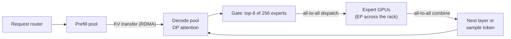

# 🤝 Together AI - AI Engineer Interview Questions

> **Last reviewed: October 2026.** Based only on public information - official pages, engineering blogs, and publicly shared candidate reports. Processes change and vary by team; treat this as a map, not a contract. No confidential or leaked material.

## TL;DR

- Reported loop: recruiter screen → ~60-min technical phone screen → 4-5 round virtual onsite (two coding rounds, system design, ML/research deep-dive for research roles, hiring manager/behavioural). One Glassdoor report describes four technical interviews with different teams plus a final with an infrastructure VP, ~3 weeks end to end.
- Coding skews **applied ML-systems**, not pure LeetCode: attention primitives, streaming generation, request batching - though some candidates report standard DS&A mediums too. Language is Python, C++, or CUDA depending on the role.
- The centre of gravity is **inference performance and economics**: KV-cache math, continuous batching, speculative decoding, quantization, and what a token actually costs on an H100/B200. Their whole business is serving open models faster and cheaper than you could yourself.
- System design rounds reportedly use their real problems: serving 100+ open models on a shared GPU fleet, multi-tenant LoRA, speculative-decoding pipelines. Interviewers reward concrete numbers (GPU memory capacities, KV-cache footprints) over hand-waving.
- Public interview info is **moderate, not deep** - a handful of Glassdoor/Blind reports plus third-party prep guides. Treat stage-level details as "reported, varies" and confirm with your recruiter. 2026 prep guides describe the same shape, with the applied ML-systems round reportedly including KV-cache management logic and design prompts on LoRA-adapter fine-tuning services (reported, varies).
- Context for "why Together": an $800M Series C at a reported ~$8.3B valuation (July 2026) is funding a large capacity build-out, so GPU-cloud, data-centre and inference-infrastructure hiring is heavy, and rack-scale Blackwell serving of large open MoE models is the live engineering problem.

## Company context

Together AI is an "AI-native cloud": a serverless inference API over 100+ open models (Llama, Qwen, DeepSeek, Kimi, MiniMax lines), dedicated endpoints, a fine-tuning/post-training platform, and raw GPU clusters (including on-demand B200s). Their stated mission is to lower the cost of modern AI by co-designing software, hardware, algorithms, and models - and they have the research pedigree to mean it: Tri Dao (FlashAttention) is chief scientist, the FlashAttention line continued with the Blackwell-targeted FlashAttention-4 paper in March 2026, and the company ships work like FlashAttention-3, the Together Kernel Collection, and adaptive speculative decoding (ATLAS) directly into its serving stack. "AI engineer" here spans that whole stack: CUDA kernels, inference engines, serving platforms, GPU-cloud infrastructure, and customer-facing forward-deployed work - this is a place where the model is the workload, and performance engineering *is* the product.

## Roles & titles they hire

From their public Greenhouse board and job postings (July 2026, rechecked October 2026; openings rotate quickly):

- **LLM Inference Frameworks and Optimization Engineer** - the kernels/engine core (SF, Amsterdam, Singapore)
- **AI Researcher, Core ML (Turbo)** - research on inference speedups shipped to production
- **Senior Backend Engineer, Inference Platform** - the serving/API layer above the engine
- **AI Infrastructure Engineer / SRE / Site Reliability Engineering** - GPU fleet, Kubernetes, reliability (SF, Amsterdam)
- **Staff Engineer, Distributed Storage and HPC & AI Infrastructure** - cluster-scale storage and networking
- **Senior/Staff Machine Learning Engineer & Platform Engineer, Voice AI** - a newer product area
- **Platform Engineer, Model Shaping** - the fine-tuning/post-training product
- **Forward Deployed Engineer (Inference & Post-Training)** - hands-on technical partner to strategic customers; posting asks for expert-level experience with vLLM, TensorRT-LLM, or SGLang
- **Senior Software Engineer, Infra Agent Systems** and **Software Engineer, AI Compute (Together Cloud)** - newer postings in the October 2026 check, alongside a GPU-cluster customer-success track and a Mandarin-speaking FDE variant
- Plus data platform, observability, product engineering, network engineering, and data-centre operations roles

Compensation data points exist on [levels.fyi](https://www.levels.fyi/jobs/company/together-ai).

## The interview loop

Public information is moderate: several Glassdoor and Blind reports plus third-party prep guides, but no official interview-process page. The table below merges those reports - expect variation by team and seniority, and confirm specifics with your recruiter.

| Stage | Format | What's evaluated |
|---|---|---|
| Recruiter screen | ~30 min call | Background, motivation, team interest, comp expectations |
| Technical phone screen | ~60 min, one medium-hard coding problem; Python/C++/CUDA by role | Applied ML-systems coding (attention primitive, streaming, batching) or standard DS&A (reported, varies) |
| Online assessment or take-home | OA for some roles; ~4-8 h realistic problem (kernel or systems) reported for some senior/research roles | Real engineering on a scoped problem (reported, varies) |
| Virtual onsite: coding ×2 | Live coding | One algorithms round, one applied ML-systems round (reported, varies) |
| Virtual onsite: system design | Whiteboard | Inference/training infra design - multi-model serving on shared GPUs, speculative-decoding integration, multi-tenant fine-tuned models (reported, varies) |
| Virtual onsite: ML/research deep-dive | Discussion | For research roles: paper walk-through, speculative decoding and quantization trade-offs, experiment design (reported, varies) |
| Hiring manager / behavioural | Conversation | Ownership, shipping velocity, comfort with fast-paced infra work |
| Final leadership round | Conversation | One report: final interview with the infrastructure VP (reported, varies) |

Reported timeline: roughly 2-6 weeks; Glassdoor's average is around 16 days. Candidate sentiment is mixed - interviewers are consistently described as strong and relevant, but at least one public report describes post-onsite ghosting, so drive the process actively.

## What they emphasise

- **Performance engineering as product.** Their differentiation is serving open models faster and cheaper - kernels (FlashAttention-3, Together Kernel Collection), speculative decoding (ATLAS adapts speculators to live traffic), and quantization down to FP4. Expect to be probed at the "why is this faster, with numbers" level, not the buzzword level.
- **Inference economics.** Cost per million tokens, GPU utilization, batch-size trade-offs, and hardware roofline math are business fundamentals here. Interviewers reportedly reward specific numbers: HBM capacities, KV-cache footprints, bandwidth ceilings.
- **Full-stack systems ownership.** They run their own data centers, GPU fleet, and serving stack. Debugging a distributed system end to end - from NCCL to the API gateway - is valued over narrow specialisation, especially for infra roles.
- **Open-model fluency.** The catalogue is open models. Knowing the actual architectures (GQA configs, MoE routing, context-length behaviour) and the OSS serving ecosystem (vLLM, SGLang, TensorRT-LLM - named explicitly in the FDE posting) is table stakes.
- **Research-to-production speed.** Papers ship into the engine within months. Research candidates should expect to defend experimental methodology; engineers should expect "how would you productionise this technique" questions.

## Representative questions

*Representative questions synthesised from this company's publicly known focus areas and role descriptions - not leaked questions.*

### 1. Why is LLM decode memory-bandwidth-bound rather than compute-bound? Walk me through the numbers on an H100.

<details><summary><b>Answer</b></summary>

At batch size 1, generating one token requires reading every weight once: for a 70B-parameter model at FP8, that's ~70 GB of HBM traffic per forward pass. An H100 SXM has ~3.35 TB/s of HBM bandwidth, so the hard ceiling is ~3350/70 ≈ 48 tokens/s - regardless of FLOPs, which sit mostly idle. Each weight byte read supports only ~2 FLOPs per sequence (one multiply-accumulate), while the GPU's roofline ridge point is roughly 989 TFLOPS (dense BF16) ÷ 3.35 TB/s ≈ 300 FLOPs/byte. You'd need on the order of 150+ sequences sharing each weight read before compute becomes the bottleneck - and roughly double that if the matmuls also run in FP8, since FP8 tensor-core peak is about 2× BF16.

That single observation drives most of the inference-serving playbook:

- **Batching** raises arithmetic intensity - every request added to the batch amortizes the same weight reads, which is why continuous batching multiplies throughput at modest latency cost.
- **Quantization** (FP8, FP4) shrinks bytes moved, directly raising the tokens/s ceiling even when compute doesn't change.
- **Speculative decoding** converts several sequential decode steps into one verification pass, amortizing weight reads across multiple tokens of the *same* sequence.
- **KV-cache management** matters because at large batch and long context, cache reads rival weight reads as the dominant traffic.

Prefill is the opposite regime: thousands of tokens share one weight pass, so it's compute-bound. Good schedulers treat the two phases differently for exactly this reason.

**Follow-ups:** At what batch size does the KV cache, rather than weights, dominate bandwidth? How does GQA change that crossover?

</details>

### 2. Estimate the KV-cache footprint for serving a Llama-3-70B-class model, and explain what PagedAttention fixes.

<details><summary><b>Answer</b></summary>

Per token, KV cache = 2 (K and V) × layers × KV heads × head dim × bytes. Llama-3-70B: 80 layers, 8 KV heads (GQA), head dim 128, FP16 → 2 × 80 × 8 × 128 × 2 B = ~320 KB/token. An 8K-context sequence holds ~2.6 GB. On an 80 GB H100 with FP8 weights (~70 GB), you have ~10 GB left - about 4 concurrent 8K sequences. That's why 70B serving is multi-GPU even when the weights technically fit, and why GQA (8 KV heads instead of 64) was an inference-economics decision: full MHA would be 8× worse.

Naive serving allocates each sequence a contiguous buffer sized for max context. Two failure modes: **internal fragmentation** (a request that stops at 500 tokens wasted its 8K reservation) and **external fragmentation** (free memory exists but not contiguously). vLLM's PagedAttention applies virtual-memory thinking: the cache is split into fixed-size blocks (e.g., 16 tokens), a per-sequence block table maps logical to physical blocks, and blocks are allocated on demand. Reported waste drops from 60-80% to a few percent, which converts directly into batch size and therefore throughput.

Paging also enables **prefix sharing**: identical prompt prefixes (system prompts, few-shot headers, parallel sampling) map to the same physical blocks copy-on-write - the idea SGLang's RadixAttention pushes further with an automatic prefix tree.

**Follow-ups:** What's the trade-off in choosing block size? How would you decide between preempt-and-recompute vs swap-to-CPU when memory runs out?

</details>

### 3. Design the scheduler for a continuous-batching inference engine.

<details><summary><b>Answer</b></summary>

Key insight: schedule per **iteration**, not per request. After every model step, completed sequences exit and queued ones join - no waiting for the whole batch to finish (that's static batching, which strands GPU time on the longest request).

Core loop:

```python
def step(self):
    # 1. Free blocks from finished/cancelled sequences
    self.release_finished()
    # 2. Admit new requests while KV blocks + batch budget allow
    while self.queue and self.can_admit(self.queue[0]):
        self.running.append(self.queue.popleft())
    # 3. If out of blocks, preempt lowest-priority running seqs
    while not self.enough_blocks_for_decode():
        self.preempt(self.running.pop_victim())  # recompute or swap
    # 4. Build one batch mixing prefill chunks + decode tokens
    return self.build_batch(self.running)
```

Design decisions to defend:

- **Prefill/decode interference:** a 4K-token prefill in a decode batch spikes inter-token latency for everyone. **Chunked prefill** splits it into pieces co-scheduled with decodes, trading TTFT for stable ITL. (Disaggregated prefill on separate GPUs is the heavier-weight answer.)
- **Preemption policy:** recompute (drop blocks, re-prefill later) is simple and usually wins for short contexts; swapping to CPU wins for long contexts where recompute costs more than PCIe transfer.
- **Admission control:** admit on *worst-case* KV growth (max_new_tokens), or admit optimistically and rely on preemption - vLLM chose optimism.
- **Fairness/SLOs:** FCFS starves interactive traffic behind batch jobs; priority queues with per-tenant token budgets are the standard fix.

**Follow-ups:** How does speculative decoding complicate this loop (variable tokens accepted per step)? What metrics would you expose to detect scheduler pathologies - and what would a rising preemption rate tell you?

</details>

### 4. What does FlashAttention actually optimize? It doesn't reduce FLOPs - so why is it faster?

<details><summary><b>Answer</b></summary>

It optimizes **memory movement, not arithmetic**. Standard attention materializes the N×N score matrix in HBM: write S = QKᵀ, read it back for softmax, write P, read P for PV. At N=8K with 32 heads that's gigabytes of traffic per layer, and since attention ops are bandwidth-bound, HBM round-trips dominate wall time.

FlashAttention is IO-aware: it tiles Q, K, V into blocks that fit in SRAM (~hundreds of KB per SM vs tens of GB of HBM, with ~10× higher bandwidth), computes attention block-by-block, and never writes the N×N matrix to HBM. The enabling trick is **online softmax**: you can compute a numerically stable softmax incrementally, maintaining a running max and running sum per row, rescaling previously accumulated output as new blocks arrive. The backward pass recomputes attention blocks in SRAM instead of storing them - spending FLOPs (which are idle anyway) to save bandwidth (which is scarce). Memory drops from O(N²) to O(N), and wall-clock speed improves severalfold despite marginally *more* FLOPs.

The lineage matters at a company whose chief scientist wrote it: FlashAttention-2 reworked parallelization and warp partitioning to cut non-matmul overhead; FlashAttention-3 targets Hopper - warp specialisation, TMA async copies, and FP8 support, overlapping data movement with tensor-core work. FlashAttention-4 (2026) targets Blackwell, where tensor-core throughput grew much faster than shared-memory bandwidth and the exponential units, so the bottleneck moved to softmax: it uses fully asynchronous MMAs with larger tiles, software-emulated exponentials, conditional rescaling, and tensor memory. Same algorithm family, each generation re-tuned to the hardware's actual bottleneck.

**Follow-ups:** Why does the backward pass recompute instead of caching? What changes about the tiling strategy for decode (one query token) vs prefill - and what does a decode-specific kernel like FlashDecoding parallelize over instead?

</details>

### 5. Explain speculative decoding. When does it help, when does it hurt, and why adapt the speculator to live traffic?

<details><summary><b>Answer</b></summary>

Decode is bandwidth-bound (Q1), so the target model's forward pass costs nearly the same for 1 token as for 8. Speculative decoding exploits this: a cheap **draft** proposes k tokens autoregressively; the target verifies all k in one forward pass; a rejection-sampling rule accepts a prefix and corrects the first rejection, provably preserving the target model's output distribution exactly - it's lossless, unlike quantization.

Expected speedup ≈ (accepted tokens per step) ÷ (relative cost of drafting + one target pass). It helps when acceptance rate is high (predictable text: code, structured output, formulaic prose) and when the draft is much cheaper than the target. It hurts when acceptance is low - you pay draft cost plus wasted verification for ~1 token/step - or when batch sizes are already large enough that decode is compute-bound and there's no idle FLOP headroom to exploit.

Draft-model choice is the design space: a separate small model (flexible, but needs matching tokenizer and its own memory/latency budget), self-speculation via extra decoding heads (Medusa-style) or feature-level drafting (EAGLE-style) that reuse the target's trunk, or n-gram/retrieval lookahead for near-verbatim workloads.

The adaptive angle - which Together has published on with ATLAS - follows from acceptance rate being *workload-dependent*: a static speculator tuned on generic text underperforms when traffic shifts to, say, RL rollouts or a customer's domain. Continuously fitting the speculator to live traffic keeps acceptance high as workloads drift, which is exactly the sort of research-to-production loop an inference vendor monetises.

**Follow-ups:** Why does speculative decoding preserve the output distribution even when the draft is terrible? How does it interact with continuous batching when different sequences accept different numbers of tokens per step?

</details>

### 6. Compare INT8, FP8, and FP4 for serving. What breaks, and how do you validate that a quantized endpoint is "good enough"?

<details><summary><b>Answer</b></summary>

- **INT8**: uniform grid, needs careful scaling. Weight-only (W8A16) is safe and mainly saves memory/bandwidth; W8A8 doubles matmul throughput but hits the **activation outlier** problem - a few channels with huge magnitudes destroy per-tensor scaling (mitigations: per-channel scales, SmoothQuant-style rebalancing between weights and activations).
- **FP8** (E4M3/E5M2, native on Hopper): the exponent absorbs dynamic range, so activations quantize far more gracefully than INT8 - this is why FP8 became the serving default on H100s. Weights and KV cache in FP8 halve bandwidth vs FP16 with typically small quality loss.
- **FP4/NVFP4** (native on Blackwell): another 2× bandwidth and compute win, but 16 representable values is brutal - it needs fine-grained block scaling (two-level scale factors), usually weight-focused, often with higher-precision accumulation and sensitive layers (embeddings, lm_head, sometimes early layers) kept at higher precision.

General rule: the smaller the format, the more the scheme's granularity (per-tensor → per-channel → per-block) does the work.

Validation is where candidates fail. Perplexity on WikiText is nearly useless - it's insensitive to the failure modes customers notice. A credible harness: (1) task evals spanning reasoning, code, and instruction following; (2) **long-context and long-generation** tests, since quantization error compounds over tokens; (3) KL divergence or top-k agreement against the FP16 reference on real traffic samples; (4) domain-specific evals for dedicated-endpoint customers. Ship behind an A/B with a rollback path, not on a benchmark table alone.

**Follow-ups:** Should you quantize the KV cache too, and what's different about it? A customer reports the FP8 endpoint "feels dumber" but your evals show parity - what do you do?

</details>

### 7. Write the server-side handler for streaming token generation. Handle client disconnects correctly.

<details><summary><b>Answer</b></summary>

The subtle requirement: a disconnected client must **cancel the request inside the engine**, or you keep burning GPU time and holding KV-cache blocks for output nobody reads. At scale, leaked generations are a real capacity bug.

```python
from fastapi import FastAPI, Request
from fastapi.responses import StreamingResponse
import asyncio, json

app = FastAPI()

@app.post("/v1/completions")
async def complete(request: Request):
    req = await request.json()
    req_id = engine.submit(req)          # enqueue into batching engine

    async def stream():
        try:
            async for tok in engine.results(req_id):
                # cheap disconnect probe between tokens
                if await request.is_disconnected():
                    break
                yield f"data: {json.dumps({'token': tok})}\n\n"
            else:
                yield "data: [DONE]\n\n"
        except asyncio.CancelledError:
            raise                        # server shutdown / task cancelled
        finally:
            await engine.abort(req_id)   # idempotent: frees KV blocks,
                                         # removes seq from running batch
    return StreamingResponse(stream(), media_type="text/event-stream")
```

Points worth saying out loud: the `finally` block is the contract - abort must run on disconnect, exception, *and* normal completion (idempotently); the engine's `abort` marks the sequence finished so the next scheduler step releases its blocks (Q3). SSE needs flush-per-token and proxy buffering disabled, or TTFT looks terrible despite a fast engine. Backpressure: if the client reads slowly, either buffer tokens (bounded queue) or let the generator's pace throttle - but never block the engine's step loop on a slow consumer; decouple generation from delivery with a per-request queue.

**Follow-ups:** How do you propagate a mid-stream engine failure to a client that already got a 200? Where would you meter tokens for billing - and do aborted requests bill for generated-but-undelivered tokens?

</details>

### 8. Design a serverless inference platform serving 100+ open models on a shared GPU fleet.

<details><summary><b>Answer</b></summary>

Clarify targets first: say TTFT p99 < 2 s for warm models, cost-efficient enough to price per-token, models from 1B to 700B (MoE), spiky per-model demand.

**Fleet tiering by popularity.** Traffic across 100+ models is extremely skewed. Hot tier: top models pinned on dedicated replica pools with autoscaling. Warm tier: mid-tail models resident but sharing capacity. Cold tier: long-tail models scale-to-zero, loaded on demand. The economics of the tail decide margins - this framing is what interviewers want to hear first.

**Cold starts.** A 70B FP8 model is ~70 GB of weights. From object storage at even 10 GB/s that's 7+ s before CUDA graph capture and warmup. Mitigations: weights cached on local NVMe on every node in the model's placement group, streamed/parallel loading, keep-warm based on demand prediction, and honest queuing (accept + queue during load rather than error).

**Placement is bin-packing** on GPU memory: weights + KV budget per model, with tensor-parallel degree as a variable (TP=8 for big models raises throughput but couples failure domains). Small models can be co-resident on one GPU with MPS/MIG or in-engine multiplexing.

**Fine-tunes as LoRA multiplexing:** thousands of customer fine-tunes must not each cost a GPU. Serve adapters on shared base-model replicas (S-LoRA-style: adapters paged in GPU memory, batched heterogeneously); route by adapter ID.

**Routing/autoscaling:** route on queue depth and KV utilization, not CPU; scale on token throughput and TTFT SLO burn. Per-tenant rate limits in the gateway; dedicated-endpoint traffic isolated from serverless.

**Follow-ups:** A new 400B MoE model launches and traffic 100×s in an hour - walk through what happens. How do you run engine upgrades (new vLLM/kernel version) across the fleet without SLO breakage?

</details>

### 9. When would you deploy vLLM vs SGLang vs TensorRT-LLM? (You're advising a customer as an FDE.)

<details><summary><b>Answer</b></summary>

Decision axes: performance ceiling, workload shape, model/hardware flexibility, and operational cost.

- **vLLM** - the default. Broadest model support, fastest to adopt new architectures, huge community, PagedAttention/continuous batching built in, Python-extensible. Choose it when the customer iterates across models, needs day-one support for new releases, or lacks a dedicated inference team. Ceiling is high but not maximal.
- **SGLang** - strongest when the workload has **structure**: heavy shared prefixes (agents, multi-turn chat, batch eval over one system prompt) exploit RadixAttention automatic prefix caching; constrained/JSON decoding is fast. Choose it for agentic pipelines, high prefix reuse, or heavy structured output. Ecosystem is smaller than vLLM's but performance on those shapes is often materially better.
- **TensorRT-LLM** - peak performance on NVIDIA when the deployment is **static**: fixed model, fixed hardware, tightest kernel selection and FP8/FP4 paths. It was historically built around ahead-of-time compiled engines; newer releases have shifted towards a PyTorch-based runtime that cuts much of that build friction, but it remains the most NVIDIA-specific option. Cost: more tuning effort, often slower support for brand-new architectures, less portability. Choose it when the customer owns one model at very large scale and single-digit-percent efficiency is worth engineering time.

The FDE-shaped answer adds the meta-point: benchmark on the *customer's* traffic - their sequence-length distribution, prefix-reuse ratio, and latency SLO - not on marketing numbers, because ranking flips with workload shape. Then be honest about when managed serving (i.e., the thing Together sells) beats self-hosting: below a utilization threshold, dedicated GPUs sit idle and per-token pricing wins; above it, dedicated capacity wins. Knowing where that crossover sits for the customer is the actual job.

**Follow-ups:** What benchmark harness would you set up to make this call rigorously? When would you tell a customer *not* to self-host at all?

</details>

### 10. A customer wants to migrate from a proprietary frontier-model API to an open model. How do you run that engagement?

<details><summary><b>Answer</b></summary>

**Baseline first.** Collect a representative eval set from their production traffic - real prompts, stratified by task type, including the ugly tail. Define quality metrics per task (LLM-judge with human calibration, exact-match where possible) and hard latency/cost targets. Score the incumbent to get the bar. Without this step, the migration is vibes.

**Model selection.** Shortlist 2-3 open candidates sized to the task (a 70B-class dense or mid-size MoE often matches frontier APIs on *narrow* workloads even if it loses on broad benchmarks). Adapt prompts per model - prompt formats, system-prompt conventions, and tool-calling schemas differ, and naive prompt reuse understates open-model quality. Evaluate honestly per slice: overall parity can hide a critical slice regression.

**Close remaining gaps with post-training.** If prompting alone falls short, fine-tune on the customer's traces - including distillation from the incumbent's outputs where their terms permit (check this explicitly; many proprietary ToS restrict training on outputs). For narrow tasks, a fine-tuned smaller model frequently beats the frontier API at a fraction of the cost - this is Together's core FDE pitch, and the posting for the role explicitly covers inference *and* post-training.

**Migrate like an SRE.** Shadow traffic first (compare offline), then canary a small percentage with automatic rollback on metric regression, then ramp. Watch the details that break silently: tokenizer differences shifting truncation behaviour, max-context differences, function-call format drift, safety-refusal behaviour differences, and downstream parsers coupled to the old model's phrasing.

**Follow-ups:** The open model wins on evals but the customer's PM says outputs "feel worse" - what's your next move? How do you set the eval up so it stays useful post-migration?

</details>

### 11. Price a dedicated endpoint: estimate cost per million output tokens for a 70B model, and explain the throughput - latency trade.

<details><summary><b>Answer</b></summary>

Method over memorised numbers (state assumptions clearly):

- Hardware: 4×H100 (TP=4) - 320 GB HBM, ~13.4 TB/s aggregate bandwidth; 70B FP8 weights ≈ 70 GB, leaving a large KV budget.
- Per-token bandwidth cost ≈ weight bytes ÷ aggregate bandwidth ≈ 70 GB ÷ 13.4 TB/s ≈ 5.2 ms → ~190 steps/s ceiling, shared by all sequences in the batch. At batch 64 with realistic (say 50%) bandwidth efficiency, on the order of ~6,000 output tok/s aggregate.
- If the 4 GPUs rent at an illustrative $2.50/GPU-hr → $10/hr: $10 ÷ (6,000 × 3600) × 10⁶ ≈ **$0.46 per million output tokens** at full utilization. At 30% utilization, the true cost is >3× that - utilization, not kernels, is the first-order economic lever for dedicated capacity.

The **throughput - latency trade** is the batch-size dial: each added sequence amortizes the same weight reads (throughput ↑ roughly linearly at first) but adds KV-cache traffic and queuing, so inter-token latency degrades - and once arithmetic intensity crosses the roofline ridge, throughput gains flatten while latency keeps climbing. Serverless pricing wants big batches (cost/token ↓); an interactive customer wants small ones (ITL ↓). That's why dedicated endpoints expose the knob and serverless tiers pick it for you - and why speculative decoding is attractive at low batch: it spends idle FLOPs to cut latency without giving up the economics.

**Follow-ups:** How do prefill-heavy workloads (long prompts, short answers) change this math and pricing? What changes moving this endpoint to B200s?

</details>

### 12. A customer's distributed training job on your GPU cluster gets 55% scaling efficiency at 64 nodes. Debug it.

<details><summary><b>Answer</b></summary>

Triage from cheapest signal to deepest, and localise compute vs communication vs input first.

1. **Profile one step.** Per-GPU timeline (torch profiler / nsys): where does step time go - compute, NCCL collectives, dataloader waits, optimizer/checkpoint stalls? This one artifact usually names the category.
2. **Stragglers.** Synchronous training runs at the slowest rank's pace. Compare per-rank step times: one slow GPU (thermal throttling, a failing HBM stack, ECC retirement storm) or one slow node (a degraded NIC or flapping link) drags all 512 GPUs. Fleet health checks - `nvidia-smi` throttle reasons, NCCL bandwidth tests per node pair - catch this fast, and on a GPU cloud, hardware stragglers are the most common real-world culprit.
3. **Communication shape.** Do collective times match theory? All-reduce moves ~2× model bytes per step; check measured bus bandwidth against NCCL benchmarks for the topology. Common failures: traffic crossing rails/spine because the scheduler placed the job across non-adjacent nodes (topology-aware placement fixes it), wrong NCCL transport config (IB vs Ethernet/RoCE settings), or PXN/NVLS features silently disabled.
4. **Overlap.** Even correct comms can be *exposed* rather than hidden behind backward compute. Check whether gradient buckets are sized to overlap, and whether FSDP/ZeRO prefetch is on. Exposed all-gathers in FSDP at scale is a classic.
5. **Input pipeline and stalls.** Dataloader starvation, synchronous checkpointing, and per-step host-device syncs (`.item()` logging) all masquerade as "bad scaling."

Then fix in that order - hardware first, placement second, overlap third - and re-measure efficiency at each step.

**Follow-ups:** Efficiency is fine for 3 hours, then degrades - what does that suggest? What monitoring would you build so the *platform* catches this before the customer does?

</details>

### 13. Serve a DeepSeek-V3-class open MoE model (671B total parameters, ~37B active per token) on Blackwell. How do you lay it out, and why does expert parallelism change the economics?

<details><summary><b>Answer</b></summary>

Separate memory from compute. Every expert must be resident, so FP8 weights alone are ~671 GB: one 8×B200 node (~180 GB each, ~1.4 TB total) holds them with room for KV cache, 8×H100 does not. Per-token compute is set by the ~37B active parameters, so decode FLOPs look like a mid-size dense model while memory looks like a giant one.

The trap is arithmetic intensity per expert. Each token picks 8 of 256 routed experts per layer, so with a global batch of B tokens each expert sees roughly B/32. At batch 64, every expert's weights are read to serve about two tokens: pure bandwidth-bound decode. Reaching the ~150-300 tokens per weight read the roofline wants means thousands of concurrent tokens per step. Hence **wide expert parallelism**: spread experts across many GPUs, aggregate a very large batch, and move tokens to experts rather than weights to tokens.

Communication becomes the bottleneck. Each MoE layer does an all-to-all dispatch and an all-to-all combine. A rack-scale NVLink domain (GB200 NVL72 puts 72 GPUs on one fabric) keeps that off InfiniBand, and libraries such as DeepEP plus two-micro-batch overlap hide it behind compute.

Decisions to defend:

- **Attention parallelism.** MLA's latent KV cache is small, but tensor-parallel attention replicates it on every rank, so data-parallel attention with expert-parallel FFNs is the usual pairing.
- **Load balance.** Routing is skewed and shifts with traffic, and a hot expert stalls the whole step. Replicate hot experts and re-place them from observed routing statistics.
- **Disaggregation.** Prefill and decode want different parallelism, so run separate pools and ship KV between them over RDMA.

The economics: wide EP pays off only with large aggregate traffic, which suits a shared serverless pool. A low-traffic dedicated endpoint is better on one 8-GPU node with tensor plus expert parallelism, accepting lower utilisation.

**Worth sketching.** One decode step, showing that the expensive hop is moving tokens between GPUs, not loading weights.



**Follow-ups:** A large coding customer onboards and the routing histogram shifts sharply - what happens to p99 inter-token latency, and how do you respond? How does the layout change for a ~1T-parameter model with 384 experts?

</details>

## How to prepare

**Repo topics, in priority order:**

- **[08-inference-and-production](../08-inference-and-production/README.md)** - the core of nearly every round here: batching, KV cache, quantization, speculative decoding, serving economics. Go deepest.
- **[02-llm-fundamentals](../02-llm-fundamentals/README.md)** - attention variants, GQA/MoE architectures, KV-cache mechanics; you need this at implement-it depth, since the coding rounds reportedly include attention primitives.
- **[11-ai-system-design](../11-ai-system-design/README.md)** - the design round is raw serving infrastructure. No case study matches "inference platform" one-to-one; the closest transferable one is **[02-ai-code-assistant](../11-ai-system-design/case-studies/02-ai-code-assistant.md)** (latency-sensitive streaming inference, caching, cost control) - but practice Q8 above as its own design exercise.
- **[12-coding-challenges](../12-coding-challenges/README.md)** - expect one standard algorithms round plus applied ML-systems coding; both live here.
- **[05-fine-tuning-and-alignment](../05-fine-tuning-and-alignment/README.md)** - essential for FDE (Inference & Post-Training) and Model Shaping roles; LoRA mechanics and distillation judgment come up in serving design too.
- **[13-interview-process-and-behavioral](../13-interview-process-and-behavioral/README.md)** - they screen for velocity and ownership; have shipped-under-pressure stories ready.

**Company-specific moves:**

1. Read the [Together research blog](https://www.together.ai/research-blog) and [blog](https://www.together.ai/blog) - especially posts on their inference engine, FlashAttention-3, the Together Kernel Collection, and adaptive speculative decoding (ATLAS). Their interview design prompts reportedly mirror this material.
2. Use the product seriously: run the serverless API across 2-3 models, measure TTFT and tokens/s yourself, try a fine-tuning job. "I benchmarked your API and noticed X" is a strong signal for FDE and platform roles.
3. Know the OSS engine landscape hands-on - the FDE posting names vLLM, TensorRT-LLM, and SGLang explicitly. Read the vLLM PagedAttention paper and SGLang's RadixAttention design; be ready to compare them on a real workload.
4. Drill the napkin math until it's reflexive: H100/B200 memory and bandwidth, KV-cache per token for a model you know, cost per million tokens from GPU rental prices. Multiple reports say interviewers reward specific numbers.
5. For research roles: know Tri Dao's line of work (FlashAttention 1-4, Mamba) and Together's public releases (RedPajama, speculative-decoding work) well enough to discuss trade-offs and propose experiments - a paper walk-through round is reported.

## Sources

- [Together AI - Careers](https://www.together.ai/careers) (fetched July 2026)
- [Together AI - Greenhouse job board](https://job-boards.greenhouse.io/togetherai) (fetched July 2026; role titles above)
- [Together AI - Blog](https://www.together.ai/blog) and [Research blog](https://www.together.ai/research-blog)
- [Glassdoor - togetherAI interview questions](https://www.glassdoor.com/Interview/togetherAI-Interview-Questions-E7364710.htm) (candidate reports: stage counts, timeline, mixed feedback)
- [techinterview.org - Together AI interview guide](https://www.techinterview.org/companies/together-ai/) (third-party prep guide; stage/format details marked "reported" above)
- [Welcome to the Jungle - Forward Deployed Engineer (Inference & Post-Training) posting](https://www.welcometothejungle.com/en/companies/together-ai/jobs/forward-deployed-engineer-inference-post-training_san-francisco_cnxuxncu)
- [Blind - TogetherAI data engineering round](https://www.teamblind.com/post/togetherai-data-engineering-round-gvvgf0nh)
- [levels.fyi - Together AI](https://www.levels.fyi/jobs/company/together-ai)
- VentureBeat coverage of Together AI's ATLAS adaptive speculative decoding (surfaced via search; site blocks automated fetch)
- [BigDATAwire - Together AI raises $800M at $8.3B valuation (July 2026)](https://www.hpcwire.com/bigdatawire/this-just-in/together-ai-raises-800m-at-8-3b-valuation-to-make-frontier-ai-accessible-to-all/)
- [FlashAttention-4: Algorithm and Kernel Co-Design for Blackwell GPUs (arXiv:2603.05451)](https://arxiv.org/abs/2603.05451)
- [techinterview.org - How Together AI interviews backend and infra engineers](https://www.techinterview.org/post/3233475437/together-ai-engineering-interview/) (2026 third-party guide)

