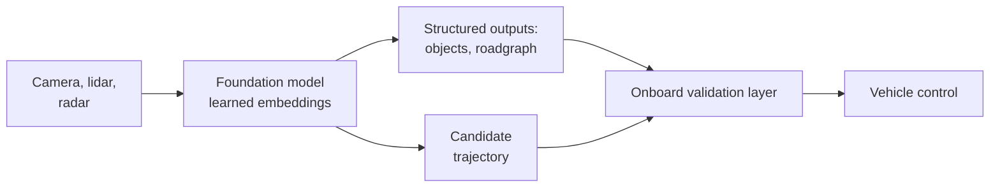
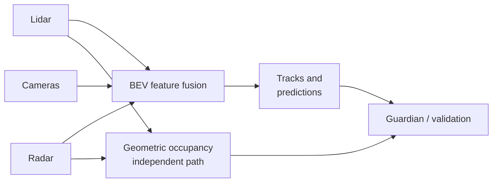
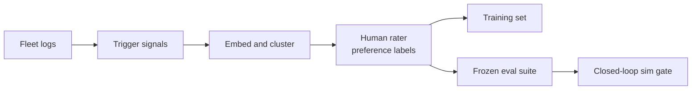
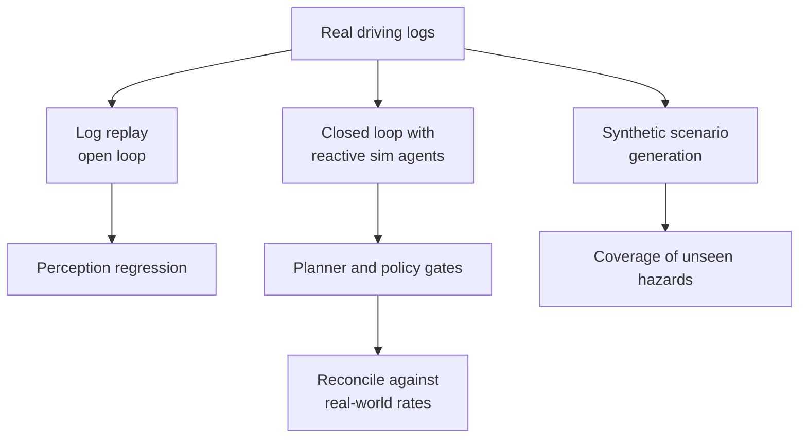
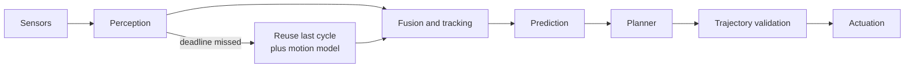
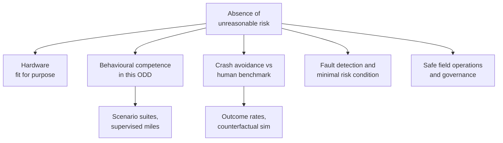
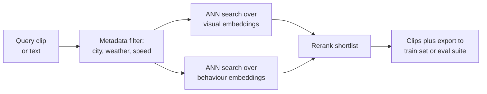
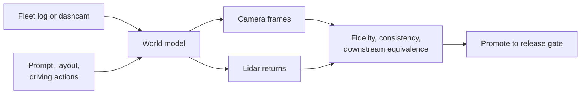

# 🚘 Waymo - AI Engineer Interview Questions

> **Last reviewed: October 2026.** Based only on public information - official pages, engineering blogs, technical reports, and publicly shared candidate reports. Processes change and vary by team; treat this as a map, not a contract. No confidential or leaked material.

## TL;DR

- Public detail on the loop is **thin compared with big-tech software loops**. What exists is third-party prep guides plus Glassdoor-style reports, and they converge on a Google-style shape: recruiter screen → technical phone screen → 5-6 round virtual onsite → hiring committee → team match. Waymo is an Alphabet company and the hiring committee plus team-match tail is consistent with that, but treat stage-level detail as inference, not fact.
- The onsite for ML roles is reported as roughly: one general coding round, one **ML coding round** (numpy-heavy: broadcasting, reshaping, trajectory manipulation), one **ML system design** round, and one to two behavioural or project deep-dive rounds, each 45-60 minutes (reported, varies).
- The DS&A bar is reportedly a real Google-level medium-to-hard bar, and ML candidates are the ones who most often fall over it. Reported flavours skew geometric and graph-shaped: grids, BFS/DFS, collision physics, trajectory maths, sometimes wrapped in driving framing.
- The domain content is what makes this loop distinctive: perception → prediction → planning as a pipeline versus end-to-end learned driving, sensor fusion and why redundancy exists, long-tail scenario mining, closed-loop simulation, and **evaluating a system whose failure rate is one serious event per tens of millions of miles**. Correctness and structured reasoning beat speed here, because the product is safety-critical.
- Waymo publishes a lot: the Foundation Model / Driver-Simulator-Critic architecture, the Genie 3-based Waymo World Model for camera and lidar simulation (February 2026), scaling-law results for motion forecasting and planning, EMMA, Waymax, the Open Dataset challenges, and peer-reviewed crash-rate comparisons. Reading that material is the single highest-leverage prep move, because it is where the interview vocabulary comes from.

## Company context

Waymo builds the Waymo Driver: the autonomy stack, sensor hardware, simulation infrastructure, and fleet operations behind a commercial rider-only robotaxi service. As of their February 2026 World Model post they report nearly 200 million fully autonomous miles, and their peer-reviewed safety work compares rider-only crash rates against human benchmarks over tens of millions of miles. Engineers want in because it is one of the very few places where a learned system makes consequential physical decisions at scale, and where the evaluation problem is genuinely unsolved. "AI engineer" here is broader than LLM plumbing: perception and behaviour prediction modelling, planning and learned policies, foundation and world models, simulation and sim agents, ML platform and data infrastructure, evaluation and metrics, and onboard inference under a fixed power and latency budget. If your mental model of ML is "call an API and evaluate on a benchmark", this loop will not go well.

## Roles & titles they hire

Waymo's careers site groups hiring into Software Engineering, AI Foundations, Hardware Engineering, Product and Design, and Operations and Supply Chain, with Software Engineering by far the largest group. Posting titles visible publicly on their board and on job aggregators (August 2026) include:

- **Director, Foundation Model Data Recipes** - the data side of their world model programme
- **Tech Lead Manager, Foundation Models** - model architecture and training leadership
- **Senior Machine Learning Engineer, Simulation** (London) and **Embedded Software Technical Lead & Manager, Simulation**
- **Staff Machine Learning Infrastructure Engineer** (London)
- **Machine Learning Engineer, ML Resources** - training compute and platform
- **Analysis Infra SWE** and **Data Scientist** - the evaluation and metrics side
- **Senior Software Engineer** roles across depot, fleet, and platform surfaces
- Hardware roles adjacent to the stack: **Electrical Engineer, Sensors**, **ASIC Design Verification Engineer**
- Internships across Bachelors, Masters, MBA, and PhD levels

Typical for the category, and not always visible as live postings: Perception, Behaviour Prediction, Planner, Onboard Inference, and Research Scientist tracks. Waymo is listed on [levels.fyi](https://www.levels.fyi/jobs/company/waymo) if you want compensation data points.

## The interview loop

**Public information here is thin.** Waymo does not publish an interview-process page, and there is far less candidate reporting than for a company like Google or Meta. The table below merges two third-party prep guides with aggregated Glassdoor-style reports. Read the shape as **inference from a Google-style Alphabet loop plus a handful of candidate accounts**, not as a documented process. Confirm every row with your recruiter.

| Stage | Format | What's evaluated |
|---|---|---|
| Recruiter screen | 15-30 min call | Background, motivation, which org and team fits (reported, varies) |
| Technical phone screen | 45-60 min live coding, one medium-hard problem or two smaller ones | DS&A at a genuine Google-level bar; grids, graphs, geometry, sometimes AV-flavoured framing (reported, varies) |
| Recruiter prep call | Short call before the loop | Logistics, round breakdown, what to expect (reported, varies) |
| Onsite: coding | 45-60 min | Runnable code in an IDE, classes and unit tests, edge cases; correctness over speed (reported, varies) |
| Onsite: ML coding | 45-60 min | numpy fluency: broadcasting, reshaping, multi-dimensional reductions, 3D trajectory manipulation, implementing a layer or metric from scratch (reported, varies) |
| Onsite: ML system design | 45-60 min discussion | Designing an ML system end to end: data, training, evaluation, deployment. Reported prompts include scene retrieval over video archives and experiment-tracking platforms (reported, varies) |
| Onsite: project deep dive | 45-60 min | Depth on one project you owned, what you would change, cross-team influence (reported, varies) |
| Onsite: behavioural / leadership | 45-60 min, one or two rounds | Ownership on long-duration projects, conflict resolution, judgement under safety pressure (reported, varies) |
| Hiring committee | Offline packet review | Alphabet-style committee independent of the interviewers (inferred from Alphabet practice, reported) |
| Team match | Conversations with hiring managers | Fit to a specific team and level (reported, varies) |

2026 prep guides still describe a virtual onsite of about five 45-60 minute rounds, and no public change to Waymo's AI-tool policy for interviews has been reported, so ask your recruiter rather than assume assistants are allowed (reported, varies). Reported end-to-end timeline is roughly 4-8 weeks. Aggregated Glassdoor difficulty sits near the middle of the scale with mixed candidate sentiment, so drive scheduling actively.

Domain knowledge in perception, planning, or vehicle kinematics helps but is repeatedly described as not mandatory: they also hire strong generalist engineers with distributed systems or ML backgrounds and expect them to learn the domain. Do not let that stop you preparing the domain, though - it is where you differentiate.

## What they emphasise

- **Safety as an engineering artefact, not a slogan.** Waymo publishes a Safety Framework, a goal-based Safety Case approach, and a readiness-determination process governed by a Safety Board, all built around the phrase "absence of unreasonable risk". Expect at least one moment where the right answer is "I would not ship that yet, and here is what evidence would change my mind."
- **Evaluation of rare events.** Serious crashes are so rare that no A/B test on the road can gate a release. Their public work leans on human-benchmark comparisons per million miles, counterfactual analysis, closed-loop simulation, and leading indicators. Being fluent in why a single headline metric is inadequate is a genuine differentiator.
- **Modular versus end-to-end, resolved as a hybrid.** Their December 2025 post describes a Foundation Model that backpropagates end to end while still materialising structured representations (objects, semantic attributes, roadgraph) so that a separate onboard validation layer can verify the trajectory. Argue the tradeoff, do not pick a tribe.
- **Simulation as first-class infrastructure.** Waymax, the Open Sim Agents Challenge, SceneDiffuser++ and SceneCrafter, WOD-E2E for long-tail scenarios, and since February 2026 the Waymo World Model, adapted from Google DeepMind's Genie 3 to generate controllable camera and lidar scenes: simulation is a research area with its own metrics, not a testing afterthought.
- **Scaling, but measured honestly.** Their 2025 scaling-law work over 500,000 hours of driving shows power-law improvement in motion forecasting and planning with data and compute, while being explicit that open-loop metrics and closed-loop driving quality are different things.
- **Redundancy and hardware reality.** The sixth-generation Driver runs 13 cameras, 4 lidars, and 6 radars plus external audio receivers, deliberately fewer sensors than the previous generation while retaining overlapping coverage. Cost, thermal budget, and fail-operational design are engineering constraints they talk about publicly.

## Representative questions

*Representative questions synthesised from this company's publicly known focus areas and role descriptions - not leaked questions.*

### 1. Modular perception, prediction and planning, or end-to-end learned driving? Make the case, then tell me what you would actually build.

<details><summary><b>Answer</b></summary>

Both extremes are strawmen at scale, and the interesting answer is why.

**Modular** gives you interfaces you can write requirements against. You can unit-test a detector, set a recall target for pedestrians at 60 m, and attach a safety argument to a named component. The costs are real: information is destroyed at every interface (a detector that thresholds away a low-confidence pedestrian has already removed the evidence the planner needed), each module optimises a proxy objective that is not driving quality, errors compound down the chain, and the planner ends up carrying a large hand-tuned cost function that nobody can fully explain.

**End-to-end** optimises the thing you care about, uses all the sensor evidence rather than a summarised subset, and scales with data. Waymo's own scaling-law work over 500,000 hours shows power-law improvement in forecasting and planning against data and compute. The costs are equally real: imitation learning suffers causal confusion and covariate shift, failures are hard to attribute, the tail is sample-starved precisely where it matters, and there is no place to attach a verifiable claim.

The answer Waymo describes publicly is a hybrid: one foundation model trained with full end-to-end backpropagation, but which still materialises compact structured representations (objects, semantic attributes, roadgraph elements) as learned embeddings pass through, plus a separate onboard validation layer that verifies the trajectory the generative model produced. You get joint optimisation and an inspectable, checkable surface.

**Worth sketching.** Where the safety argument attaches in a hybrid stack.



**Follow-ups:** What can that validation layer actually check, and what can it never check? If end-to-end wins on aggregate metrics but you cannot explain one bad clip, do you ship it?

</details>

### 2. Why carry lidar, radar and cameras rather than cameras alone? Where would you fuse them?

<details><summary><b>Answer</b></summary>

The argument is about **uncorrelated failure modes**, not about counting sensors.

Cameras give dense semantics: traffic light colour, text on a sign, gesture of a cyclist, at low cost and high angular resolution. They give no direct range, and they fail in glare, low light, and heavy precipitation. Lidar gives direct centimetre-scale geometry independent of ambient light, which is what you need when a car door opens 1.5 m away, but it is sparse at range and degrades in fog, spray and heavy rain. Radar gives direct radial velocity through Doppler and works through weather and dust at long range, but its angular resolution is poor and its clutter and multipath returns are messy.

A safety case wants each hazard covered by at least one modality whose failure mode is uncorrelated with the others. Sun glare blinds cameras and not lidar. A steam plume defeats lidar and not radar. That is the point, and it is why Waymo's sixth-generation Driver kept three modalities plus external audio receivers for sirens while cutting total sensor count.

**Where to fuse:** early or raw fusion preserves the most information but demands tight time synchronisation and extrinsic calibration, and is expensive. Mid-level feature fusion in a bird's-eye-view space is the modern default: the network can recover weak evidence one modality alone would discard. Late object-level fusion, where each modality produces its own tracks that are then associated, throws away weak evidence but is the easiest to reason about and to argue independence for.

In practice you want both: a mid-level learned path for performance and an independent late-fusion path for the guardian, so one learned model failing does not remove all detection. And watch calibration: 50 ms of desynchronisation at 30 m/s is 1.5 m of displacement, which will look exactly like a fusion bug.

**Worth sketching.** Two parallel paths, one for performance and one for independence.



**Follow-ups:** How would you detect a slowly drifting lidar-to-camera extrinsic in production before it causes a miss? Which modality would you drop first under a cost mandate, and what does that cost you in the safety case?

</details>

### 3. Disengagement rate is a weak safety proxy. How would you actually measure whether the Driver is safe enough to ship?

<details><summary><b>Answer</b></summary>

Disengagement rate is weak for structural reasons, not just noisy ones. It depends on the safety-operator policy, so a more cautious programme reports a worse number. It is not defined consistently across companies. It counts events without weighting severity. It can be improved by driving easier routes. And it is undefined for rider-only operation, where there is nobody to disengage.

Build a hierarchy instead, from most decision-relevant to most diagnostic:

1. **Real-world outcome rates against matched human benchmarks.** Waymo publishes rider-only crash rates per million miles compared against human benchmarks matched on operational design domain, road type and reporting threshold, peer-reviewed in Traffic Injury Prevention at 7.1 million and later 56.7 million miles, with reported reductions such as 92% in pedestrian injury crashes. Matching the benchmark is the hard part: national averages include highway and rural driving your fleet never sees, and under-reporting of minor human crashes biases the comparison.
2. **Counterfactual simulation.** Replay real events with a human-driver model substituted, to ask what would have happened otherwise.
3. **Closed-loop simulation on mined scenario suites**, with severity-weighted metrics rather than a mean.
4. **Leading indicators**: time-to-collision distributions, near-miss rates, hard-braking, rule compliance, responsibility-assigned conflict rates. These carry the weight because serious events are too rare to power a decision.
5. **Component metrics** (detection recall, minADE) as debugging tools, never as release gates.

The statistical point worth saying out loud: if serious-injury events occur near one per ten million miles, detecting a 20% regression with reasonable power needs hundreds of millions of miles. You cannot A/B test your way to a release decision, which is exactly why the industry answer is a structured safety case of claims plus evidence rather than a single number.

**Follow-ups:** Your leading indicators all improve and your outcome rate is flat. What do you conclude? How would you choose the human benchmark for a new city with no comparable published data?

</details>

### 4. You have hundreds of millions of fleet miles. How do you find and use the rare scenarios that matter?

<details><summary><b>Answer</b></summary>

Scale is not the constraint, relevance is. Waymo's own WOD-E2E dataset defines long-tail as scenarios occurring under roughly 0.03% of the time and curates about 4,021 segments, around 12 hours, from a vastly larger corpus. The pipeline that gets you there has five stages.

**Trigger.** Cheap onboard signals flag candidate segments: hard braking, high jerk, planner cost spikes, prediction surprise (a large divergence between the predicted distribution and what actually happened), disagreement between sensing modalities, unusual map interactions, remote-assistance events, rider feedback.

**Embed and cluster.** Every segment gets scene and behaviour embeddings and goes into an approximate-nearest-neighbour index. One interesting event then becomes a query that returns the whole family, which is what turns an anecdote into a measurable cluster.

**Label what matters.** For rare scenarios there is often no single correct trajectory, so log-distance metrics mislead. WOD-E2E's Rater Feedback Score grades a predicted trajectory against human rater preference rather than against the logged path, which is the right shape of label for the tail.

**Split.** Mined clusters become both training data and frozen regression suites. Never train on the eval clusters, and version the suites so a metric movement is attributable.

**Cover what triggers cannot find.** Trigger-based mining is biased towards what the current system already finds hard. Complement it with parameterised scenario families swept over occlusion, speed and agent aggressiveness, and with first-principles hazard analysis for scenarios you have never seen.

**Worth sketching.** How a raw fleet log becomes both training data and a frozen gate.



**Follow-ups:** How do you stop the training distribution collapsing towards triggered events and degrading nominal driving? A cluster has 40 examples and a suspected safety implication. Is that enough to gate a release on?

</details>

### 5. Design the output representation for a behaviour prediction model. What metrics would you gate it on?

<details><summary><b>Answer</b></summary>

Start from the fact that dooms naive regression: the future is **multimodal with semantically distinct modes**. A car at an intersection either turns or goes straight. Regress a single trajectory under an L2 loss and you get the mean of those modes, which is a path through the kerb.

Reasonable representations:

- **Anchor-based classification plus residual regression.** Fixed trajectory anchors, a softmax over them, and a per-anchor offset with covariance. Interpretable, stable to train, limited by anchor coverage.
- **Mixture heads.** K weighted modes with per-timestep uncertainty, trained with a winner-takes-all or full mixture likelihood. Winner-takes-all is easy to train but can collapse modes.
- **Discrete autoregression over motion tokens.** Treat forecasting as language modelling over quantised motion, which is the MotionLM framing. The payoff is that you can sample **joint** multi-agent rollouts rather than marginal per-agent ones.

That marginal versus joint distinction matters more than most candidates realise. Two individually plausible predictions can be jointly impossible, for example both vehicles taking the same gap. A planner reasoning over marginals will either be paralysed or overconfident. You also need predictions conditioned on ego intent, otherwise you get the frozen-robot failure: everyone is predicted to hold their lane, no gap ever opens, and the vehicle never merges.

**Metrics.** minADE and minFDE over K measure coverage, and you can game them by spraying modes, so they are necessary and never sufficient. Pair them with probability calibration (negative log-likelihood, Brier), miss rate at a distance threshold, and the mAP-style measures used on the Waymo Open Motion Dataset. Then remember that open-loop displacement error correlates only weakly with closed-loop driving quality, which is why Waymo's scaling-law work reports both, and why the actual gate is closed-loop.

**Follow-ups:** How would you detect mode collapse in a mixture head during training rather than after? Give me a case where a better minADE makes the planner behave worse.

</details>

### 6. How do you build a simulator you would trust to gate a release?

<details><summary><b>Answer</b></summary>

Trust comes from knowing which regime answers which question, and from validating the simulator against reality rather than assuming it.

**Log replay** is deterministic and cheap and it is the right tool for perception regression: same sensor data in, compare detections. It becomes invalid the moment the ego deviates from the logged path, because the logged agents were reacting to the old ego. Typically you have a second or two of validity before divergence makes the scene fictional.

**Closed loop with reactive sim agents** is what you need for planner evaluation, and it moves the problem: validity now depends on how realistic your agents are. That is exactly why the Waymo Open Sim Agents Challenge exists and why it scores **distributional** realism of generated behaviour rather than distance to one logged trajectory. Waymax is Waymo's accelerated data-driven simulator for running this loop at scale.

**Synthetic generation** covers what you have never logged: parameterised scenario families, and generative scene editing and city-scale traffic synthesis of the kind their SceneCrafter and SceneDiffuser++ work describes.

The three gaps to manage explicitly: **sensor realism** (rendered lidar returns off a wet road are not real returns), **behaviour realism** (sim agents that are uniformly polite make your planner overconfident, uniformly aggressive ones make it timid), and **coverage** (you only simulate what you thought to simulate). The discipline that makes it trustworthy is a standing reconciliation programme: pick metrics measurable in both worlds, check the simulator reproduces known real-world rates, and treat every sim-says-X-road-says-Y discrepancy as a simulator bug until proven otherwise.

**Worth sketching.** Three simulation regimes and what each is allowed to gate.



**Follow-ups:** Your planner improves 8% in sim and is flat on the road. Where do you look first? How would you measure whether your sim agents are too polite?

</details>

### 7. Budget the compute and latency for the onboard stack. What breaks when a model gets bigger?

<details><summary><b>Answer</b></summary>

Frame it as **sense-to-actuation**, not per-model inference time. At 15 m/s in city driving, every 100 ms of latency is 1.5 m of extra travel before the vehicle can react; at highway speed it is closer to 3 m. That budget has to cover sensor exposure and integration, transport, perception, fusion and tracking, prediction, planning, trajectory validation, and the actuation command. Assign each stage a deadline and a defined fallback: if a stage misses, propagate the previous cycle's output through a motion model rather than blocking the loop.

Onboard constraints differ from datacentre serving in ways that invert the usual playbook:

- **Batch size is one.** Throughput tricks that need batching do not apply.
- **Jitter matters more than mean latency.** A p50 improvement that widens the tail is a regression. Prefer fixed-shape graphs, because dynamic shapes cause recompiles and unpredictable spikes.
- **Power and thermal are hard ceilings.** There is no autoscaling, and sustained load causes throttling that only appears on a hot day in a hilly city.
- **Determinism is a feature.** Reproducing an on-road event offline is part of the safety process, so nondeterministic kernels and scheduling are a real cost.

The techniques that pay: quantization and structured sparsity, operator fusion, pipelining so perception starts on the first-arriving lidar sector rather than waiting for a full spin, running the validation path on a simpler, independently verifiable compute path, and priority scheduling that lets the safety path preempt everything else.

When the model genuinely does not fit, distil it. The large generative model can live offboard as teacher, critic and auto-labeller while a smaller student drives, which is precisely the split implied by a Driver, Simulator and Critic architecture. And state the tradeoff explicitly: a detector that is 2% more accurate but 60 ms slower can be net negative for safety.

**Worth sketching.** A deadline per stage, with fallback rather than blocking.



**Follow-ups:** How would you catch a latency regression that only appears at 40 degrees ambient? Would you ever accept a nondeterministic kernel on the safety path, and under what argument?

</details>

### 8. You are opening in a new city. Structure the safety case.

<details><summary><b>Answer</b></summary>

Waymo's public framing is a goal-based, technology-agnostic **safety case**: an explicit top-level claim, decomposed into sub-claims, each supported by evidence, all sitting inside a Safety Framework with governance (a Safety Board, and a readiness determination made against the operational design domain). The top claim is the absence of unreasonable risk, and the discipline is that each sub-claim is falsifiable.

A workable decomposition:

- **The hardware is fit for purpose.** Fail-operational compute, redundant steering and braking, sensor cleaning, and no single point of failure.
- **The Driver is behaviourally competent in this ODD.** Coverage against a hazard and behaviour-competency catalogue, evidenced by simulation suites and supervised miles.
- **The Driver avoids and mitigates crashes at least as well as a competent human benchmark**, evidenced by outcome rates and counterfactual analysis.
- **The system detects its own faults and degradation** and reaches a minimal risk condition safely.
- **Field operations are safe**: remote assistance, depot, towing, first-responder interaction, rider support.
- **The organisation can keep it safe after launch**: monitoring, incident response, release governance.

For a **new city** specifically, the honest observation is that most of that argument is city-independent and what actually changes is the ODD. So enumerate deltas and gather evidence per delta: road furniture and lane markings, unprotected turn geometry, cyclist and scooter density, weather (fog, snow, spray, salt on the lens), emergency-vehicle conventions, local driving norms, and named local hazards such as tram tracks, tunnels, drawbridges, or recurring street events. Then say what would stop you, in advance.

**Worth sketching.** Claims decompose into evidence, and the city delta only touches part of the tree.



**Follow-ups:** Which sub-claim is weakest for a city with real winter weather, and what evidence would you need? How do you keep a safety case current when the model is retrained every few weeks?

</details>

### 9. Where do vision-language models and foundation models genuinely help in an autonomy stack, and where are they a liability?

<details><summary><b>Answer</b></summary>

They help exactly where the long tail lives: **open-vocabulary semantics and world knowledge**. A closed-set detector trained on thirty classes has no representation for a person in a costume, a hand-written detour sign, a police officer waving you through a red light, or a road closed for a marathon. A model with broad world knowledge can at least represent those, and can be asked to explain a scene in a form humans and downstream systems can use.

Waymo's own EMMA work (2024) demonstrated the strong version: a Gemini-based multimodal model mapping camera input directly to planner trajectories, perception objects and roadgraph elements, with all non-sensor inputs and outputs expressed as text, and with co-training across the three tasks improving all three. The paper's stated limitations are the honest counterweight and worth quoting back: few image frames, no lidar or radar, computationally expensive, and weak long-term memory.

So the realistic split today:

- **Offboard**, where they are already high value: auto-labelling, scenario captioning and retrieval, a critic that scores driving quality across millions of clips, and generating counterfactual scenarios.
- **Onboard**, where they must be either distilled, constrained, or advisory: a semantic reasoning component that informs the planner rather than commanding actuation directly.

The liability is verification. A generative model has no bound on what it can emit, and you cannot attach a safety claim to an unbounded output. Waymo's published answer is a separate rigorous onboard validation layer verifying the trajectory the generative model produced. Be ready for the pushback: that layer can check kinematic feasibility, collision-free margin against predicted futures, rule compliance and comfort limits. It cannot check whether the trajectory was a good idea, whether it was socially rude, or whether it stranded the vehicle. And an over-strict validator produces frozen-robot behaviour, which is its own safety failure. Guardrails do not substitute for a competent policy.

**Follow-ups:** How would you evaluate whether a VLM's scene explanation is actually correct rather than plausible? What would you distil first from a large teacher, and how would you know the distillation lost something that only matters in the tail?

</details>

### 10. In numpy, compute minADE and minFDE for multi-modal trajectory predictions with variable-length ground truth. No Python loops.

<details><summary><b>Answer</b></summary>

Shapes: `pred` is `(B, K, T, 2)` for B agents, K modes, T timesteps; `gt` is `(B, T, 2)`; `valid` is `(B, T)` boolean, because agents leave the scene or enter partway through.

```python
import numpy as np

def min_ade_fde(pred, gt, valid):
    dist = np.linalg.norm(pred - gt[:, None, :, :], axis=-1)   # (B, K, T)
    m = valid[:, None, :]                                      # (B, 1, T)
    n = valid.sum(axis=-1, keepdims=True)                      # (B, 1)
    ade = np.where(m, dist, 0.0).sum(-1) / np.maximum(n, 1)    # (B, K)

    best = ade.argmin(axis=1)                                  # (B,)
    T = valid.shape[1]
    last = T - 1 - np.argmax(valid[:, ::-1], axis=1)           # last valid step
    b = np.arange(pred.shape[0])
    fde = dist[b, best, last]

    empty = n[:, 0] == 0
    return (np.where(empty, np.nan, ade[b, best]),
            np.where(empty, np.nan, fde),
            best)
```

The traps interviewers actually watch for: the mask must not contribute to the numerator **or** the denominator; the final valid timestep is usually not `T - 1`, and `argmax` on the reversed mask is the loop-free way to find it; agents with zero valid steps must not silently produce a division by zero; and you must decide whether the reported FDE belongs to the ADE-best mode or is minimised independently, because those are different metrics and mixing them makes numbers incomparable across teams.

Then the judgement point, which matters more than the code. minADE ignores mode probabilities entirely, so a model that sprays K widely separated modes scores well while being useless to a planner that has to commit. Report it next to a probability-weighted error, a calibration measure, and a miss rate at a fixed threshold, and treat all of them as diagnostics rather than gates.

**Follow-ups:** Extend this to joint multi-agent scoring where a scene is correct only if all agents are within threshold. How would you weight timesteps if you cared more about the first two seconds?

</details>

### 11. Design a system that finds driving segments similar to a given one across the entire fleet archive.

<details><summary><b>Answer</b></summary>

This is the tool that makes long-tail work tractable: an engineer sees one bad clip and needs the other four hundred like it by lunchtime.

**Requirements first.** Multi-petabyte archive of sensor logs. Query by example clip, by text description, or by a mined event. Recall matters far more than precision, because a missed cluster member is a missed regression. Seconds of latency is fine. Two different notions of similarity are needed and engineers usually want the second: *visually* similar (same street, same lighting) and *behaviourally* similar (unprotected left with an occluding truck), and confusing them is the most common design mistake.

**Pipeline.** Segment logs into overlapping fixed windows plus event-anchored windows. Compute several embeddings per segment: a visual or bird's-eye-view encoder, an interaction and trajectory encoder over the agent graph, and a text embedding of a model-generated scene caption so natural-language queries work. Index each space separately with HNSW or IVF-PQ. Keep a structured metadata store alongside for hard filters: city, weather, time of day, speed band, agent counts, map element types.

**Query path.** Structured pre-filter to cut the candidate set, then vector search per embedding space, then a reranker that scores scenario-level similarity on the shortlist. Return clips with a one-click path into a training set or a frozen eval suite, which is the whole point of building it.

**Costs and judgement.** Do not embed everything at full fidelity; tier by trigger score and re-embed hot regions on demand. Re-embedding when the encoder changes is the real operational cost, so version embeddings and support querying an older space. Evaluate with a human-judged query set measured on recall@k, not on vibes.

**Worth sketching.** Filter first, then vector search, then rerank.



**Follow-ups:** How would you handle a query where the interesting thing is what did *not* happen, such as a pedestrian who nearly stepped out? What breaks when you swap the encoder for a better one?

</details>

### 12. Two days before a release decision, simulation shows a 15% increase in hard-braking events in one scenario cluster. Walk me through what you do.

<details><summary><b>Answer</b></summary>

Resist the urge to explain it. Triage in order of cheapness, and separate "is the number real" from "is it bad".

**Is the metric real?** Re-run with different seeds and sim-agent samples to get a confidence interval. Check whether the increase is broad across the cluster or driven by three scenarios. Confirm the cluster composition itself has not changed since the baseline, because suite churn produces this exact signal.

**Is it the model or the harness?** Map version changes, sim agent version changes, and metric-definition changes are the most common false positives in every AV evaluation stack. Re-run the baseline candidate through the *current* harness. If the baseline moves too, you have a harness bug, not a regression.

**Localise.** The candidate is a bundle of changes, so bisect over the change list in simulation. Then split the stack: run the new perception with the old planner, and the old perception with the new planner. That usually names the component in one afternoon.

**Watch the clips.** Ten of them, at speed. Hard braking is a comfort metric with safety adjacency, and it is entirely possible the new build brakes because it now detects an occluded pedestrian it previously missed. That is the metric moving the wrong way for the right reason, and only the video tells you.

**Decide with severity.** Quantify whether contact-relevant and time-to-collision metrics moved at all. Comfort regressions and safety regressions get different answers.

**Escalate, do not adjudicate alone.** Waymo describes a Safety Board and a formal readiness determination for exactly this. The default when the picture is uncertain is not to ship: slipping a release is cheap, and "the deadline" is never an argument in a safety-critical organisation. Either way, promote the cluster into the permanent regression suite.

**Follow-ups:** The bisect points to a change nobody expected to matter. How much do you trust that? What monitoring would have caught this a week earlier?

</details>

### 13. Waymo now generates camera and lidar simulation from a world model adapted from a general-purpose video world model. What does that buy over log replay and reconstruction, and how would you decide its output is valid enough to gate a release?

<details><summary><b>Answer</b></summary>

It buys coverage of scenes the fleet has never logged, and it moves the trust problem rather than removing it.

**What it adds.** Log replay and reconstruction-based simulators can only re-render what the sensors actually saw. A world model pre-trained on a very large, diverse video corpus carries priors about how the world looks and moves, so it can render situations with no fleet precedent (Waymo's examples include flooded streets and an animal on the road). It is also steerable: by driving actions for counterfactuals, by scene layout and signal states, and by language for weather or time of day. Waymo says it emits both camera and lidar, and can lift ordinary dashcam footage into a multimodal scenario, which turns public video of rare events into test inputs.

**What it costs.** A generative sensor model can hallucinate: objects that flicker between frames, lidar returns geometrically inconsistent with the camera view, motion that looks plausible but is physically wrong. Its errors may also correlate with your perception stack's blind spots if both learned from similar data. Long rollouts drift, and a cheaper variant trades fidelity for length.

**How I would validate it.** Treat it as a sensor model with its own test suite:

1. **Fidelity:** condition on real logs, generate the held-out continuation, compare per modality against what was actually recorded.
2. **Cross-modal consistency:** project generated lidar into the generated camera frames and measure agreement.
3. **Downstream equivalence:** run perception and the planner on real and regenerated versions of the same scenario. The simulator is valid for gating only where the Driver behaves the same in both, within a stated tolerance.
4. **Control checks:** request rain and verify it appears in both modalities and nothing else changed.

**What it may gate.** Start with discovery and stress testing. Promote a scenario family to a release gate only after it passes downstream-equivalence checks, and never let a world-model-only result carry a safety claim on its own.

**Worth sketching.** Generated scenes earn gate status only through explicit validity checks.



**Follow-ups:** A generated scenario exposes a Driver failure you cannot reproduce on any real log. Is that a Driver bug or a simulator bug, and how do you find out? How would you detect that the world model and your perception stack share a blind spot?

</details>

## How to prepare

**Repo topics, in priority order:**

- **[01-ml-and-dl-foundations](../01-ml-and-dl-foundations/README.md)** - the ML coding round is classical, not LLM-flavoured: implement a layer or a metric from scratch, reason about loss design, calibration and evaluation. Go deepest here.
- **[12-coding-challenges](../12-coding-challenges/README.md)** - the DS&A bar is genuinely Google-level and it is where ML candidates most often fail. Reported flavours skew geometric and graph-shaped, and you are expected to produce runnable, tested code.
- **[07-evaluation-and-observability](../07-evaluation-and-observability/README.md)** - Waymo's hardest open problem is evaluating a system whose failures are one in tens of millions of miles. Rare-event evaluation, leading indicators and offline-online gaps are directly on point.
- **[11-ai-system-design](../11-ai-system-design/README.md)** - the ML system design round. No case study maps one-to-one onto autonomy; the closest transferable one is **[05-content-moderation-pipeline](../11-ai-system-design/case-studies/05-content-moderation-pipeline.md)** (multi-stage real-time classification, a long tail of rare harmful cases, human review in the loop, precision and recall traded under a policy constraint). Practise Q11 above as its own design exercise.
- **[09-safety-security-and-responsible-ai](../09-safety-security-and-responsible-ai/README.md)** - the safety-case reasoning, guardrails-versus-competence argument, and failure-mode analysis transfer directly.
- **[10-multimodal](../10-multimodal/README.md)** - sensor fusion, BEV representations and VLMs in the stack; useful for the EMMA and foundation-model line of questioning.
- **[08-inference-and-production](../08-inference-and-production/README.md)** - onboard latency, quantization, distillation and tail-latency discipline, reframed for a fixed power budget and batch size one.
- **[13-interview-process-and-behavioral](../13-interview-process-and-behavioral/README.md)** - one or two behavioural rounds plus a project deep dive, with a reported emphasis on long-duration, cross-team ownership.

**Company-specific moves:**

1. Read Waymo's own material, because it is where the interview vocabulary comes from: the Demonstrably Safe AI post describing the Foundation Model and the Driver, Simulator and Critic architecture; the 2025 scaling-laws post; the February 2026 World Model post; the EMMA blog and paper; and the Safety Case Approach white paper. Being able to argue with these, not just recite them, is the differentiator.
2. Do something hands-on with the Waymo Open Dataset. Run a Waymax notebook, look at the Sim Agents Challenge metrics, or read the WOD-E2E paper and understand why the Rater Feedback Score exists. "I ran this and noticed X" beats any amount of reading.
3. Prepare one crisp position on modular versus end-to-end and one on how you would evaluate a rare-event system. Those two themes recur across almost every round, and a considered, hedged answer signals more seniority than a confident one.
4. Drill numpy specifically: broadcasting, multi-dimensional reductions, masked means, gather with fancy indexing, and 3D trajectory and rotation manipulation. The reported ML coding round is a numpy round, not a PyTorch round.
5. Practise the "I would not ship it" answer without sounding evasive. Say what evidence you need, how you would get it, and what would change your mind. In a safety-critical organisation, calibrated hesitation is a positive signal.

## Sources

- [Waymo careers](https://careers.withwaymo.com/) (fetched August 2026; team structure and posting titles above)
- [Waymo research](https://waymo.com/research/) (paper index across perception, behaviour prediction, planning, simulation, end-to-end driving)
- [Demonstrably Safe AI for Autonomous Driving](https://waymo.com/blog/2025/12/demonstrably-safe-ai-for-autonomous-driving/) (Foundation Model, Driver / Simulator / Critic, onboard validation layer, 100M+ autonomous miles)
- [New Insights for Scaling Laws in Autonomous Driving](https://waymo.com/blog/2025/06/scaling-laws-in-autonomous-driving/) (500,000 hours, power-law results, open-loop vs closed-loop)
- [Introducing EMMA](https://waymo.com/blog/2024/10/introducing-emma/) and the paper [EMMA: End-to-End Multimodal Model for Autonomous Driving](https://arxiv.org/abs/2410.23262)
- [Meet the 6th-generation Waymo Driver](https://waymo.com/blog/2024/08/meet-the-6th-generation-waymo-driver/) and [Beginning fully autonomous operations with the 6th-generation Waymo Driver](https://waymo.com/blog/2026/02/ro-on-6th-gen-waymo-driver/) (sensor counts, redundancy rationale)
- [Waymo Safety Case Approach white paper](https://assets.ctfassets.net/e6t5diu0txbw/66jOjPtNIjzawaK0ZjpU3q/7f081b392cf29a3355c97d0d758fe6cf/Waymo_Safety_Case_Approach.pdf) and [Waymo's safety methodologies and safety readiness determinations](https://waymo.com/research/waymos-safety-methodologies-and-safety-readiness/)
- [Waymo Safety Impact](https://waymo.com/safety/impact/) and the peer-reviewed [Comparison of Waymo Rider-Only crash rates by crash type to human benchmarks at 56.7 million miles](https://www.tandfonline.com/doi/full/10.1080/15389588.2025.2499887), *Traffic Injury Prevention* (2025)
- [WOD-E2E: Waymo Open Dataset for End-to-End Driving in Challenging Long-tail Scenarios](https://arxiv.org/abs/2510.26125) (0.03% frequency definition, Rater Feedback Score)
- [The Waymo Open Sim Agents Challenge](https://arxiv.org/pdf/2305.12032) and the [Waymax simulator repository](https://github.com/waymo-research/waymax)
- [The Waymo World Model: A New Frontier for Autonomous Driving Simulation](https://waymo.com/blog/2026/02/the-waymo-world-model-a-new-frontier-for-autonomous-driving-simulation/) (Genie 3 base, camera and lidar generation, language, layout and driving-action control, nearly 200M autonomous miles)
- [Exponent - Waymo interview process](https://www.tryexponent.com/blog/waymo-interview-process) (loop shape, ML round breakdown, reported question topics)
- [Exponent - Waymo machine learning engineer interview guide](https://www.tryexponent.com/guides/waymo-machine-learning-engineer-interview) (2026 virtual onsite shape, consulted October 2026)
- [TechPrep - Waymo's interview process](https://www.techprep.app/blog/waymo-interview-process) (stage list, timeline, evaluation emphasis)
- [levels.fyi - Waymo](https://www.levels.fyi/jobs/company/waymo)
- Interview Query and Dataford Waymo software engineer guides (aggregated candidate reports; consulted via search, sites rate-limited automated fetch)
