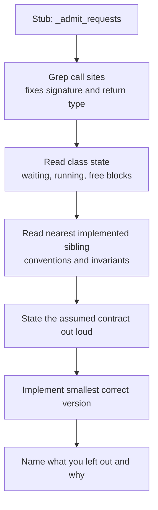

# 🛰️ xAI - AI Engineer Interview Questions

> **Last reviewed: October 2026.** Based only on public information - official pages, engineering blogs, and publicly shared candidate reports. Processes change and vary by team; treat this as a map, not a contract. No confidential or leaked material.

## TL;DR

- Short, fast, almost entirely technical loop: initial engineer call → live coding screen → (for some roles) a time-boxed take-home → in-person onsite → hiring-manager close. Earlier reports put end-to-end time at ~2-3 weeks; a 2026 prep-site writeup puts it at 3-6 weeks with 4-6 onsite rounds (reported, varies).
- Coding rounds are **practical object-oriented building, not LeetCode patterns**: key-value stores with transactions, LRU caches, iterators - then the interviewer layers on requirement changes to test whether your design absorbs them. Working, bug-free code is weighted over asymptotically-optimal-but-broken code.
- A distinctive **codebase-reading component** shows up in reports: you're handed a partially implemented (sometimes LLM-related) codebase and asked to complete functions without a full spec.
- System design skews toward **their scale**: inference batching, rate limiting for LLM APIs, and training/serving infrastructure reasoning shaped by the Colossus GPU buildout.
- There is **no dedicated behavioural, values, or ethics round** per multiple public reports - a sharp contrast with Anthropic/OpenAI. The real culture filter is pace: in-person, intense, ship-fast. Public info on the loop is thinner and noisier than for other frontier labs; expect variation by team.
- **2026 context.** xAI merged into SpaceX in February 2026 and rebranded as SpaceXAI in July 2026; Grok kept its name. In March 2026 Musk said xAI was being "rebuilt from the foundations up" and that he and talent lead Baris Akis were going back through interview history to re-contact declined candidates. A 2026 prep-site writeup describes coding rounds as generally AI-permissive, with fundamentals still checked (reported, varies). Ask your recruiter which entity, team and tool policy apply to your loop.

## Company context

xAI (operating as SpaceXAI since July 2026, after its February 2026 all-stock merger with SpaceX) builds Grok - a frontier LLM family served in the Grok apps, integrated into X, and available via API - and trains it on Colossus, its self-built GPU supercluster in Memphis (publicly described at 100K+ GPUs with stated plans to scale much further). Engineers join for the compute scale, the tiny-team-huge-blast-radius structure, and the speed of shipping. "AI engineer" at xAI means someone who can operate close to the metal - inference systems, training infrastructure, data pipelines, agent products - rather than someone who only orchestrates model APIs.

## Roles & titles they hire

- **Member of Technical Staff** - the dominant title, usually with a team-specific suffix. Real examples from their public Greenhouse board: "Member of Technical Staff - Coding Agents, Post Training - RL, Evals" and "Member of Technical Staff - Coding Agents, Product". The coding-agents push was reinforced in March 2026 by reported hires of two former Cursor product engineering leaders.
- **Member of Technical Staff (New Grad Software Engineer)** - the new-grad entry point.
- **AI Engineer & Researcher** (historically posted with Fullstack / Backend variants on x.ai/careers) - their early canonical title; the dual "engineer & researcher" framing is deliberate.
- Software engineers, ML/infrastructure engineers, and safety engineers across inference, training, data, and product teams; non-engineering "AI Tutor" (data/annotation) roles are hired separately and follow a different process.
- Applications include an **"Exceptional Work Statement"** - a short written piece on the most impressive thing you've built. It gets read and discussed; treat it as a first-round artifact, not a formality.

## The interview loop

Public information on xAI's loop is **thinner and less consistent than for OpenAI or Anthropic** - most of what's below comes from aggregated candidate reports (Exponent, Glassdoor, prep-site writeups), not official documentation. Rows marked "(reported, varies)" conflict across sources or apply only to some roles.

| Stage | Format | What's evaluated |
|---|---|---|
| Application + Exceptional Work Statement | Written | Evidence of exceptional output; concrete, quantified impact |
| Initial engineer call | 15-30 min, virtual, with an engineer (not just a recruiter) | Background, motivation, technical interests; your work statement may come up |
| Technical phone screen | ~60 min live coding (CoderPad-style) | Practical coding; completeness and bug-free execution over cleverness. AI tools reportedly allowed in some coding rounds, with fundamentals still probed (reported, varies) |
| Take-home project | ~4-hour time-boxed build - ship a small working product, often using AI tools | Shipping speed, scoping judgment, code quality under time pressure (reported, varies by role - some loops skip it) |
| Onsite (in person, Bay Area) | 2-5 rounds: coding with layered extensions, codebase reading/completion, system design | OOD under changing requirements, reading unfamiliar production-style code, infra design at scale (round count varies by report) |
| Project deep-dive | ~20 min presentation on your hardest technical problem + adversarial Q&A | Depth, ownership, tradeoff honesty, numbers (reported, varies) |
| Follow-up / HM call | Conversation with hiring manager or team member | Team match, close; the closest thing to a behavioural round |

Logistics note from candidate reports: onsites are in person with real security screening at the door - arrive early.

## What they emphasise

- **Shipping over pedigree.** Multiple reports quote the internal framing that what matters is "the code that you ship." Demos, working artifacts, and the Exceptional Work Statement carry more weight than brand-name employers or publication lists.
- **Practical code under changing requirements.** Their coding rounds start easier than peer labs' and get hard through follow-up extensions. The signal is whether your v1 design survives v2 and v3 of the requirements.
- **Reading unfamiliar code fast.** The codebase-completion round directly tests day-one usefulness in a fast-moving monorepo - a skill most loops never measure.
- **Systems and scale literacy.** Colossus is the company's identity as much as Grok is. Fluency in GPU-cluster reality - batching, KV-cache memory, checkpointing, failure rates at 100K-GPU scale - differentiates candidates for infra-adjacent roles.
- **Appetite for intensity.** No values round, but the culture screen is real: in-person, long hours implicit, flat hierarchy, Musk-style urgency. Reports consistently advise being honest with yourself about this before opting in.

## Representative questions

*Representative questions synthesised from this company's publicly known focus areas and role descriptions - not leaked questions.*

### 1. Build an in-memory key-value store with SET/GET/DELETE, then add transactions with BEGIN/COMMIT/ROLLBACK - including nested transactions.

<details><summary><b>Answer</b></summary>

Model transactions as a stack of write layers over a base dict. Reads walk the stack top-down; writes go to the top layer; COMMIT merges the top layer into the layer below (or the base); ROLLBACK pops it. Deletes need a tombstone so a delete inside a transaction shadows a value below it.

```python
class KVStore:
    _TOMBSTONE = object()

    def __init__(self):
        self.base = {}
        self.layers = []          # stack of pending-write dicts

    def set(self, k, v):
        (self.layers[-1] if self.layers else self.base)[k] = v

    def delete(self, k):
        self.set(k, self._TOMBSTONE)

    def get(self, k):
        for layer in reversed(self.layers):
            if k in layer:
                v = layer[k]
                return None if v is self._TOMBSTONE else v
        return self.base.get(k)

    def begin(self):
        self.layers.append({})

    def rollback(self):
        if not self.layers:
            raise RuntimeError("no open transaction")
        self.layers.pop()

    def commit(self):
        if not self.layers:
            raise RuntimeError("no open transaction")
        top = self.layers.pop()
        (self.layers[-1] if self.layers else self.base).update(top)
```

Tradeoffs to say out loud: reads are O(transaction depth) - fine for nesting depth in the tens; the alternative (copy the whole store on BEGIN) makes reads O(1) but BEGIN O(n). Committing merges into the *parent* transaction, not the base - a classic bug interviewers watch for. State the error behaviour for COMMIT/ROLLBACK with no open transaction before you're asked.

**Follow-ups:** How would you add GET-consistent iteration over all keys mid-transaction? What changes if two threads share the store?

</details>

### 2. Implement an LRU cache with O(1) get/put. Now add per-entry TTL.

<details><summary><b>Answer</b></summary>

Baseline: hash map + doubly-linked list - the map gives O(1) lookup, the list keeps recency order, and both `get` and `put` move the node to the head. In Python, `OrderedDict` with `move_to_end()` gets you there in ~15 lines; know the underlying structure anyway because the interviewer may ban the shortcut.

For TTL, the clean design is **lazy expiry**: store `(value, expires_at)` and treat an expired entry as a miss on `get`, deleting it then. This adds zero background machinery and keeps O(1) operations, but expired entries occupy capacity until touched - under a hot keyspace with long tails, you can evict live entries while dead ones squat. Two fixes, in increasing complexity: (1) on eviction, prefer scanning a few entries for an expired one before evicting the true LRU; (2) maintain a min-heap keyed by `expires_at` and pop expired entries opportunistically on each operation - heap entries can be stale after overwrites, so validate against the map before acting (the "lazy deletion" pattern).

State the concurrency answer preemptively: a single lock around both structures is correct and simple; sharding the cache N ways reduces contention with no algorithmic change. This question at xAI-style loops is less about the classic structure and more about whether the TTL extension slots into your v1 cleanly - if your first version tangles recency and expiry logic together, the extension exposes it.

**Follow-ups:** How does this design change for a multi-process inference server? What would you cache in an LLM serving stack, and what's the invalidation story?

</details>

### 3. Write an iterator class that lazily flattens an arbitrarily nested list of lists/integers. No generators - explicit state.

<details><summary><b>Answer</b></summary>

Keep a stack of (list, index) frames - the iterative equivalent of the recursion you're not allowed to hide inside a generator. The subtlety is the `has_next`/`next` contract: `has_next` must advance past empty lists to know the truth, so do the work in a private `_advance` that both methods share, and make repeated `has_next` calls idempotent.

```python
class FlattenIterator:
    def __init__(self, nested):
        self.stack = [(nested, 0)]

    def _settle(self):
        # Position stack so top frame points at an integer, or empty the stack.
        while self.stack:
            lst, i = self.stack[-1]
            if i == len(lst):
                self.stack.pop()
                continue
            item = lst[i]
            if isinstance(item, list):
                self.stack[-1] = (lst, i + 1)
                self.stack.append((item, 0))
            else:
                return

    def has_next(self):
        self._settle()
        return bool(self.stack)

    def next(self):
        if not self.has_next():
            raise StopIteration
        lst, i = self.stack[-1]
        self.stack[-1] = (lst, i + 1)
        return lst[i]

```

Complexity: amortized O(1) per element; space O(max nesting depth). Test cases to volunteer: `[]`, `[[]]`, `[[[]], 1]`, and calling `next` without `has_next`. This shape of question tests state management discipline - exactly what generators paper over - which is why "no generators" is a common constraint in reports of practical-coding loops.

**Follow-ups:** Add a `peek()` without breaking the contract. What if the nested structure is mutated during iteration - what guarantees would you document?

</details>

### 4. Design a rate limiter for an LLM API where cost scales with tokens, not requests.

<details><summary><b>Answer</b></summary>

Per-request limits are wrong for LLMs because one request can cost 100x another. Rate-limit in **token units** with a token bucket per API key: capacity = burst allowance, refill rate = sustained tokens/min. The hard part: you know input tokens at admission but not output tokens. Standard solution is **reserve-then-reconcile** - at admission, debit `input_tokens + max_tokens` (or a historical p90 estimate of output length); when the request completes, credit back the unused reservation. Overly conservative reservations throttle throughput; underestimates let bursts through - expose the estimator as a tunable and track reservation error.

Distributed enforcement: a Redis bucket per key, with the debit-check-refill sequence in a Lua script so it's atomic; local in-process caches of "definitely has budget" reduce Redis round-trips at the cost of small overshoot. At very high QPS, shard keys across Redis nodes and accept per-shard rather than global precision.

Behaviour at the limit matters as much as the mechanism: return 429 with `Retry-After` derived from refill math, and consider a bounded queue for slightly-over-budget requests rather than hard rejection - smoother client experience, bounded memory. Separate limits per dimension (requests/min AND tokens/min AND concurrent streams), because streaming requests hold GPU slots long after admission.

**Follow-ups:** How do you rate-limit fairly when one customer's requests all have 100k-token contexts? Where does this sit relative to the inference scheduler's own admission control?

</details>

### 5. Walk me through continuous batching in an LLM inference server. Why does it beat static batching?

<details><summary><b>Answer</b></summary>

Static batching admits N requests, runs all of them to completion, then admits the next batch. Because sequences finish at different times (output lengths vary wildly), finished slots sit idle waiting for the longest sequence - GPU utilisation craters and queued requests wait a full batch cycle. **Continuous (iteration-level) batching** - introduced by Orca (OSDI '22) and popularised by vLLM - reschedules at every decode step: when a sequence emits EOS, its slot is immediately refilled from the queue. The batch is a rolling set, not a cohort.

Two phases matter: **prefill** (process the whole prompt; compute-bound, long step time) and **decode** (one token per step; memory-bandwidth-bound). Naively injecting a new request's prefill stalls every in-flight decode for that step, spiking inter-token latency for everyone. Mitigation is **chunked prefill**: split long prompts into pieces and interleave them with decode steps, trading time-to-first-token for stable inter-token latency - a tunable knob, not a free win.

Continuous batching's gains come specifically from output-length variance; public benchmarks from the vLLM/Orca line of work show multi-x throughput improvements over static batching, largest when length variance is high. Pairs naturally with paged KV-cache allocation, since admission depends on whether KV blocks are free, not on a fixed batch shape. Know the admission policy question: schedulers must decide prefill-vs-decode priority per step, which is exactly where the throughput/latency tradeoff lives.

**Follow-ups:** What happens under memory pressure mid-generation - preempt, swap, or recompute? How does speculative decoding interact with batch scheduling?

</details>

### 6. Estimate the KV-cache memory to serve a 70B-class model at 128k context. What do you do when it doesn't fit?

<details><summary><b>Answer</b></summary>

Formula first: `bytes/token = 2 (K and V) × n_layers × n_kv_heads × head_dim × bytes/element`. For a Llama-70B-shaped model - 80 layers, GQA with 8 KV heads, head_dim 128, fp16 - that's 2 × 80 × 8 × 128 × 2 ≈ **0.33 MB per token**. One 128k-token sequence ≈ **43 GB of KV cache** - comparable to half the weights (70B params ≈ 140 GB in fp16). A single 80 GB GPU can't hold weights for this model anyway; even across an 8-GPU node, a handful of full-context sequences exhaust KV memory. That calculation, done cleanly, is most of the answer.

Mitigations, in the order you'd actually deploy them: (1) **Paged KV allocation** (vLLM-style) so memory is allocated in blocks on demand - eliminates fragmentation from pre-reserving max context. (2) **GQA is already in the math**; MQA or MLA-style latent compression shrinks it further at architecture-design time. (3) **KV quantization** to fp8 halves it, usually with negligible quality loss. (4) **Prefix caching** - shared system prompts and few-shot preambles stored once across requests; huge for product traffic where 5-10k tokens of prefix repeat. (5) **Offload/recompute tiers** for idle sessions - swap KV to CPU/NVMe and restore on the next turn, trading resume latency for capacity.

Then close the loop with scheduling: KV memory is the real admission-control currency, so max concurrent sequences = free KV blocks / expected tokens per sequence - this number, not FLOPs, typically caps throughput at long context.

**Follow-ups:** How does prefix caching change your load-balancer design? Redo the math with fp8 KV and MQA - what's the new max batch?

</details>

### 7. Design the serving stack for a consumer chatbot with real-time search over a social-media firehose.

<details><summary><b>Answer</b></summary>

This is the Grok-shaped problem: the differentiator is **freshness** - answers should reflect posts from minutes ago - so the design centres on a streaming index, not a batch-crawled corpus.

**Ingestion/indexing path:** consume the firehose (tens of thousands of posts/sec at X-like scale), filter spam/dedup near-duplicates, embed and index incrementally. Use a tiered index: a small hot tier holding the last ~24-48 hours with second-to-minute indexing latency, and a large cold tier refreshed in batches. Hybrid retrieval (keyword + dense) with recency- and engagement-aware ranking - pure cosine similarity buries the "what's happening right now" signal that justifies the product.

**Query path:** classifier/router decides whether the query needs live retrieval at all (most chit-chat doesn't - skipping retrieval is the biggest latency and cost lever). For retrieval queries: query rewrite → parallel hot+cold search → rerank → context builder with a token budget → inference fleet running continuous batching → streamed response with citations to source posts.

**Latency budget** for p95 ~3-4s to first token on retrieval queries: ~100ms route, ~400-600ms retrieval+rerank, rest is prefill; stream tokens immediately after. Cache aggressively on trending queries - thousands of users ask about the same event within minutes, so a short-TTL (30-60s) semantic cache has a huge hit rate exactly when load spikes.

**Failure and abuse modes to name:** the firehose is adversarial (coordinated posting to poison retrieval - rank with author-credibility signals, not just recency), breaking-news load spikes are correlated with cache effectiveness, and index lag must be monitored as a first-class SLO since it *is* the product promise.

**Follow-ups:** How do you evaluate answer quality when ground truth changes hourly? What's your backpressure story when the firehose spikes 10x during a live event?

</details>

### 8. You're training on tens of thousands of GPUs and hardware fails constantly. How do you keep goodput high?

<details><summary><b>Answer</b></summary>

First, the failure math that motivates everything: at 100K-GPU scale, even optimistic per-component MTBF means an interruption every few tens of minutes fleet-wide - Meta's public Llama 3 report documented over 400 unexpected interruptions in a 54-day run on just 16K GPUs, mostly GPU and HBM faults. So the design goal isn't preventing failures; it's minimising **lost work per failure × failure rate**, i.e., maximising goodput (useful training FLOPs / wall-clock time).

Levers, in rough order of impact: (1) **Checkpoint cost → near zero**: asynchronous, sharded checkpointing - snapshot optimizer/model state to host memory or local NVMe in seconds, drain to object storage in the background - enables checkpointing every few minutes instead of hourly, capping lost work per failure. (2) **Fast detection and attribution**: a hang is worse than a crash; NCCL timeouts must trigger automated which-rank-is-bad diagnosis rather than a human staring at logs. (3) **Hot spares**: keep warm replacement nodes so restart = re-shard onto spares in minutes, not reschedule the cluster. (4) **Straggler management**: one slow GPU rate-limits a synchronous step; continuously profile per-rank step time and evict outliers. (5) **Silent data corruption**: the nastiest class - SDC produces wrong gradients, not crashes; defences include periodic numeric checksums and re-running suspect computations on known-good ranks.

Also name the topology dimension: failures should evict the minimal blast-radius unit (node, not rack) given how tensor/pipeline/data parallelism map onto the network hierarchy.

**Follow-ups:** How would you decide checkpoint frequency quantitatively? What changes when the cluster spans buildings with different network tiers?

</details>

### 9. Loss spikes mid-run on a large pretraining job. Walk me through your debugging process.

<details><summary><b>Answer</b></summary>

Triage in order of likelihood-times-cheapness. **First, data**: correlate the spike step with the data pipeline - a bad shard, an un-deduplicated repetitive document cluster, or a tokenizer edge case (megabytes of the same character) is the most common cause. Because data order is (and must be) reproducible, you can identify exactly which batches fed the spike and inspect them. **Second, numerics**: check gradient-norm and per-layer activation stats around the spike; fp16 without loss scaling overflows, and even bf16 runs can spike from attention-logit growth - mitigations include QK-norm or logit soft-capping, but mid-run your realistic options are gradient clipping (verify it was actually active) and lowering the learning rate. **Third, hardware**: at cluster scale, silent data corruption from a failing GPU produces exactly this signature - rerun the suspect steps on different ranks and compare; if results differ, quarantine the node.

Recovery playbook, which matters as much as diagnosis: resume from the last healthy checkpoint, **skip the offending data window**, and continue; if spikes recur across different data, it's numerics or hardware, not data. Prevention posture to volunteer: monitor gradient norm as a leading indicator (it usually rises before loss does), keep checkpoints frequent enough that rollback is cheap, and maintain deterministic replay - data order, RNG state, kernel determinism flags - because a spike you can't reproduce is a spike you can't attribute.

**Follow-ups:** Loss recovered on its own after the spike - do you still act? How do you distinguish "recoverable spike" from "run is poisoned, restart further back"?

</details>

### 10. Design a deduplication pipeline for a web-scale pretraining corpus. It has to run as a streaming process.

<details><summary><b>Answer</b></summary>

Two distinct problems: **exact dedup** (identical documents from mirrors/reposts) and **near-dedup** (boilerplate variants, templated pages) - public pipeline writeups (RefinedWeb, FineWeb, Gopher's dataset section) treat both as first-class, and near-dup removal measurably improves model quality per token.

**Exact, streaming:** hash normalized document content (strip whitespace/case artifacts first) and check membership. At tens of billions of documents, an exact hash set is hundreds of GB, so shard by hash prefix across workers; a Bloom filter is the cheap alternative - ~10B items at 1% false-positive rate costs roughly 12 GB of RAM - with the caveat that false positives *drop unique documents*, acceptable at 1% for web data but worth stating explicitly as a recall-for-memory trade.

**Near-dup, streaming:** MinHash over shingles (word n-grams), then LSH banding - signatures agreeing in any band become candidate pairs, tuned so ~0.8 Jaccard similarity lands with high probability. Streaming twist: LSH tables grow unboundedly, so partition them the same way you shard exact hashes (band-hash keyed), and age out entries by time window if the stream is truly unbounded - accepting that a duplicate arriving months apart survives.

Design decisions to surface: dedup granularity (document vs paragraph - paragraph-level catches boilerplate but risks shredding coherent long documents), what "canonical copy" to keep (highest quality score, not first-seen), and measurement - track dedup rate by source and validate on a labelled sample, because an over-aggressive pipeline silently deletes your best data and nothing crashes.

**Follow-ups:** How do you dedup the eval sets against the training corpus (decontamination), and why is that a different problem? What breaks if you parallelize MinHash by document rather than by band?

</details>

### 11. You have four hours to build and demo a working AI-powered product. How do you spend them?

<details><summary><b>Answer</b></summary>

This mirrors xAI's reported take-home format, and the grading axis is scoping judgment, not ambition. Budget explicitly. **Minutes 0-20:** pick the thinnest end-to-end slice that is demonstrably an AI product - one user flow, one model call path, one wow moment - and write down what you're *not* building (auth, persistence, settings, mobile). **20-60:** skeleton running end-to-end with hardcoded everything: UI → API → model → response on screen. An ugly working loop at hour one beats a beautiful architecture at hour three, because every subsequent hour is iteration on a live system instead of integration risk. **60-180:** make the core loop genuinely good - prompt iteration against 10-15 test inputs you write down (a micro-eval, and worth calling one in your writeup), streaming output, and handling for the three failure modes a demo will actually hit: model timeout, malformed output, empty input. **180-220:** polish only what the demo path touches. **220-240:** README with run instructions, known limitations, and what you'd do with a week - self-awareness about cuts is itself a signal.

Tool choices are part of the test: boring stack you know cold (FastAPI + a minimal frontend), and use AI coding tools aggressively - a lab building coding agents reads "wrote the boilerplate by hand on principle" as a negative signal. Structured outputs via schema-constrained decoding beat string parsing everywhere. The failure mode that kills candidates: spending two hours on architecture for features that were never going to exist by hour four.

**Follow-ups:** What would you cut first if the model API you planned on is down? How do you demo failure handling without derailing the happy path?

</details>

### 12. Here is a scheduler class from a small LLM inference engine. One method, `_admit_requests`, is left as a stub - no spec, no docstring, no tests. Walk me through your first thirty minutes.

<details><summary><b>Answer</b></summary>

The contract is already written down in the code, just not in prose. Read it in three places before typing anything.

**Call sites first.** Grep the method name. If `step()` does `admitted = self._admit_requests()` and then passes `admitted` to `self._run_model(...)`, you have the return type and you know the method hands back a collection rather than mutating in place. Callers pin the signature faster than any comment would.

**Then the state the class maintains.** `self.waiting`, `self.running`, `self.free_blocks`, `self.max_batch_size` are the constraints the stub has to respect. Every field in `__init__` the method can reach is a hint about an invariant, and an assertion elsewhere such as `len(self.running) <= self.max_batch_size` is effectively your spec.

**Then the nearest sibling.** An implemented `_preempt` or `_evict` on the same class gives you the error-handling convention, the logging convention, and usually half the invariant set. Mirror it. Sixty seconds of `git log -p` on the file is often worth more than either.

Then the move actually being graded: state the contract out loud before implementing it. "I read this as: admit from the waiting queue while free KV blocks cover the request and the batch is not full, return the admitted list, leave preemption to the caller - correct me if that is wrong." A missing spec is not an invitation to guess silently. Write the smallest correct version, then name what you deliberately skipped - starvation under a stream of long-context requests, priority classes, chunked prefill - instead of half-building them.

Failure modes that sink candidates: reading the repo top to bottom and running out of clock, and refactoring surrounding code to suit your implementation. The round measures day-one usefulness in a fast-moving monorepo, not elegance.

**Worth sketching.** The orientation order, which is the whole answer: contract recovered from the code, stated, then implemented.



**Follow-ups:** Your version admits greedily and starves 100k-token requests forever - do you fix that inside this method or in the queue? How would you test it without touching any existing code?

</details>

## How to prepare

Priority order for this repo, given xAI's reported loop:

- **[08-inference-and-production](../08-inference-and-production/README.md)** - highest leverage. Batching, KV-cache management, streaming, and serving economics map directly onto their reported system-design themes (inference batching, rate limiters) and onto what the company publicly is: a serving-and-training-infrastructure business.
- **[02-llm-fundamentals](../02-llm-fundamentals/README.md)** - attention/KV-cache mechanics and sampling; you need the memory math (Q6-style) cold, not hand-wavy.
- **[11-ai-system-design](../11-ai-system-design/README.md)** - use the 8-step framework, but rebalance toward steps 4 and 6 (architecture, deployment/ops); reports suggest xAI weights infrastructure reasoning over eval-framework fluency. Closest case study to their product: **semantic search** (04 in [11-ai-system-design/case-studies](../11-ai-system-design/case-studies/)) - Grok's real-time X integration is semantic search over a firehose with brutal freshness requirements (see Q7).
- **[06-agents-and-tool-use](../06-agents-and-tool-use/README.md)** and **[05-fine-tuning-and-alignment](../05-fine-tuning-and-alignment/README.md)** - for the coding-agents and post-training/RL teams specifically (those MTS postings are real and current).
- **[01-ml-and-dl-foundations](../01-ml-and-dl-foundations/README.md)** - training dynamics and numerics, for research-adjacent roles (Q8/Q9 territory).

Company-specific moves:

1. **Drill practical OOD kata under a timer**: KV store with transactions, LRU+TTL, nested iterators, rate limiter - then practise *extending* each one twice without rewriting. The extension step is the actual interview.
2. **Practise reading unfamiliar code fast.** Time-box 30 minutes to trace one request through vLLM or a similar OSS inference engine and implement a small change. This directly rehearses their reported codebase-completion round.
3. **Use Grok seriously** - the consumer apps, the X integration, and the API. Form opinions on where it beats and trails competitors; "why xAI" answers that reference concrete product behaviour land better at a lab with no behavioural round but real engineer screening calls.
4. **Write the Exceptional Work Statement like it's round one** (it is), and prepare a 20-minute deep-dive on your hardest project with numbers ready: latency, throughput, cost, scale, what failed.
5. **Read xAI's public posts on Grok releases and the Colossus buildout** (x.ai/news) plus public coverage of the Memphis cluster - interviewers reportedly expect you to reason at their scale, and the public record is enough to do so.
6. **Decide about the intensity honestly before the loop.** In-person, fast, demanding - every public account agrees on this. It's a filter; treat it as information, not negotiation.

## Sources

- [Exponent - xAI Interview Process (candidate-verified writeup)](https://www.tryexponent.com/blog/xai-interview-process) - fetched July 2026
- [Exponent - xAI Software Engineer interview guide](https://www.tryexponent.com/guides/xai-software-engineer-interview) - detail on the codebase-completion round (a large existing class, no tests or specs supplied) behind Q12 - consulted August 2026
- [techinterview.org - xAI company interview guide](https://www.techinterview.org/companies/xai/) - fetched July 2026
- [University of Miami Toppel Career Center - Get a Job at xAI (summarising Exponent's candidate reports)](https://customcareer.miami.edu/blog/2026/05/14/get-a-job-at-xai-interview-process-and-top-questions/) - fetched July 2026
- [x.ai/careers](https://x.ai/careers) - official careers page (blocked automated fetch; consulted via search excerpts)
- [xAI's public Greenhouse job board](https://job-boards.greenhouse.io/xai) - source of the Member of Technical Staff posting titles cited above
- [Glassdoor - xAI interview experiences](https://www.glassdoor.com/Interview/xAI-Interview-Questions-E10404667.htm) - aggregated candidate reports (surfaced via search; individual reports unverified)
- [techinterview.org - xAI Interview Process 2026](https://www.techinterview.org/post/3233474930/xai-interview-process-2026/) - 3-6 week timeline, 4-6 round loop, AI-permissive coding rounds (prep-site writeup, consulted October 2026)
- [Gizmodo - xAI rebrands as SpaceXAI](https://gizmodo.com/xai-is-dead-long-live-spacexai-2000782034) - July 2026 rebrand following the February 2026 SpaceX merger
- [Yahoo Finance - Musk admits xAI passed on promising candidates, launches hiring review](https://finance.yahoo.com/news/elon-musk-admits-xai-passing-120627338.html) - March 2026 hiring review, rebuild, Cursor hires
