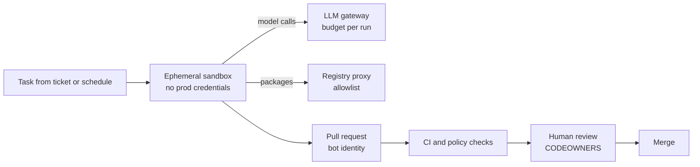

# 🛠️ DevOps / Platform / MLOps Engineer × AI - Interview Guide

You're not being hired to design model architectures. You're being hired to run the most expensive, most operationally hostile workload in the company: GPU fleets that cost six figures a month, serving processes that take minutes to cold-start, deploys where the "binary" is 140GB of weights, and a dependency (the model) whose failures look like *wrong answers*, not 500s. Interview loops for this role now test exactly that operational reality. This guide maps how the loop changed, calibrates depth per topic, and gives you the questions platform engineers actually get at the AI boundary.

---

## How this role's interviews changed (2024 → 2026)

- **"Design our deployment pipeline" became "design our LLM serving platform."** The flagship system-design round is now some variant of: run open-weight models on a shared GPU cluster for N internal teams, or build the gateway that fronts external providers. You're expected to reason about GPU scheduling, autoscaling with multi-minute cold starts, and token-denominated quotas the way you used to reason about pods and CPU requests.
- **GPU economics is a standing interview topic.** Spot vs reserved capacity, bin-packing fractional workloads onto expensive cards, quota systems that stop one team from squatting the fleet, per-team cost attribution. Interviewers ask for numbers: what does an idle H100 cost you, what utilisation do you target, when does self-hosting beat API spend.
- **CI/CD questions grew an eval stage.** "How do you gate a deploy?" now includes prompts and model versions as deployable artifacts. Pipelines that run eval suites as merge gates - with pass/fail thresholds, golden sets, and canary comparisons - are expected vocabulary, the way test coverage gates were in 2020.
- **Incident-response scenarios changed shape.** Less "the API is returning 500s," more "the provider silently updated the model and our refusal rate tripled," "a fine-tune rollout tanked answer quality with zero infra alerts," or "the provider is down - execute failover." Rollback questions now include artifacts that take 10 minutes to load and behaviour that isn't captured by any health check.
- **Observability rounds expect LLM-native metrics.** TTFT, tokens/sec, KV-cache utilisation, queue depth, cost per request, refusal rate - alongside the classic RED/USE metrics. "GPU utilisation was 95% so we were fine" is now a trap answer interviewers deliberately set.
- **A platform-as-product framing is probed explicitly.** Can you design rate limits, budgets, key management, model routing, and fallbacks as a *self-serve internal product* for dozens of teams - not a bespoke integration per team? This is where staff-level candidates separate.
- **Kubernetes grew native vocabulary for inference.** Dynamic Resource Allocation (stable since Kubernetes 1.34) for GPU claims, the Gateway API Inference Extension for model-aware routing, and llm-d or NVIDIA Dynamo for disaggregated prefill/decode now come up by name. Nobody expects API-level detail, but "I'd write a custom scheduler" when the ecosystem already ships one reads as out of date.
- **The platform team now owns AI developer tooling.** Rolling coding agents out to the whole engineering org, running them unattended in CI, keeping an approved list of MCP servers, and attributing their spend is a new design prompt. Expect "what can an agent touch, with whose credentials, and who reviews what it merges?"
- **AI-assisted coding rounds arrived, and AI-tool fluency is graded.** Meta piloted an AI-enabled coding round in October 2025 and expanded it through 2026, typically alongside one classic no-AI round. Google began piloting a Gemini-assisted round for some SWE roles in 2026, and Amazon has added an AI-assisted repository task to some online assessments (all reported, varies by team). For infra candidates the task is often a repo with a broken Terraform module, Helm chart or CI workflow. You're judged on how precisely you direct the tool and whether you catch what it gets wrong: wildcard IAM policies, a plan that destroys and recreates a stateful resource, hallucinated flags, deprecated API versions. Ask the recruiter which rounds allow assistants and practise both modes.
- **De-emphasised:** Kubernetes trivia for its own sake (CKA-style API minutiae), classic "design a CI system for microservices" with no AI twist, and deep ML theory - nobody asks a platform engineer to derive attention. Terraform/K8s fluency is assumed as a floor, not tested as a ceiling, and with an assistant in the room the bar on how much you finish rises with it.

---

## What you're actually expected to know

**The bar, honestly:** everything from the GPU up to the gateway, plus enough model literacy to know why serving LLMs breaks your existing playbooks.

Expected - and probed hard:

- **GPU infrastructure:** scheduling and bin-packing on Kubernetes (device plugins, node pools, topology), quotas and fair-share across teams, spot vs reserved vs on-demand economics, why fleet utilisation is the metric your CFO sees.
- **Serving operations:** what vLLM (or an equivalent) actually does - continuous batching, PagedAttention, KV cache - at the level of *which metrics it exposes and how you autoscale on them*. Cold-start realities: multi-GB image pulls, minutes of weight loading, and what that does to HPA assumptions.
- **LLM-aware traffic management:** why least-connections load balancing is wrong for inference, KV-cache/prefix-aware routing, draining nodes with 10-minute streams open.
- **Gateway/platform design:** API-key issuance, per-team budgets and token-denominated rate limits, model routing config, provider fallbacks, chargeback dashboards.
- **CI/CD with eval gates:** prompts and model versions as versioned, promotable artifacts; eval suites in the pipeline; canary + rollback for things whose failures are semantic.
- **Observability and incident response:** tracing across retrieval → prompt assembly → inference, cost anomaly alerting, drift detection, runbooks for provider outages and bad model rollouts.
- **Secrets and compliance basics:** provider key rotation, prompt/completion retention policy, PII in logs, data-residency routing.

**Not expected - stop over-preparing:**

- Deriving backprop, attention math, or loss functions. "Transformer, autoregressive, memory-bound decode" is all the theory your loop requires.
- Writing CUDA kernels or custom attention implementations. Know what quantization *buys you operationally* (half the VRAM, cheaper cards, small quality tax) - not how to implement AWQ.
- Training models. You operate fine-tuning *jobs* (checkpointing, spot interruption, artifact storage); you don't pick hyperparameters.
- Prompt-engineering artistry or RAG chunking strategy debates. You need to platform-ise these (version them, eval-gate them, serve them), not author them.
- Paper-level literacy. Interviewers care whether your rollback works when quality regresses silently, not whether you read this month's arXiv.

If you can run stateful, expensive, slow-starting workloads and speak tokens as a capacity unit, you're at the bar. The most common miscalibration for this role is grinding ML theory while under-preparing the "your health checks pass but the answers are wrong - now what?" scenarios you already have the instincts for.

---

## Study map

| Repo section | Depth | Why for this role |
|---|---|---|
| [01-ml-and-dl-foundations](../01-ml-and-dl-foundations/README.md) | ⚪ skim | Vocabulary only - embeddings, inference vs training, why GPUs. You will not be asked to derive anything. |
| [02-llm-fundamentals](../02-llm-fundamentals/README.md) | 🟡 solid | Tokens, context windows, autoregressive decoding, KV cache - these are your capacity-planning and cost units. You can't size a fleet without them. |
| [03-prompt-engineering-and-context](../03-prompt-engineering-and-context/README.md) | ⚪ skim | You don't write prompts; you version, deploy, and eval-gate them. Know enough to treat them as config artifacts. |
| [04-rag-and-retrieval](../04-rag-and-retrieval/README.md) | 🟡 solid | RAG is a pipeline you operate: embedding jobs, index rebuilds, sync from source of truth, staleness SLOs. Skip retrieval-quality theory. |
| [05-fine-tuning-and-alignment](../05-fine-tuning-and-alignment/README.md) | ⚪ skim | Know the job-orchestration side (checkpoints, spot interruptions, artifact registry, LoRA adapters as deployables) - not the training math. |
| [06-agents-and-tool-use](../06-agents-and-tool-use/README.md) | 🟡 solid | Agents are long-running, retry-prone workloads that hammer your platform: per-run spend caps, step limits, audit logs, sandboxed execution. |
| [07-evaluation-and-observability](../07-evaluation-and-observability/README.md) | 🟢 deep | Half your interview. Eval gates in CI, traces, token/cost dashboards, drift and refusal-rate alerting - the observability stack is yours to build. |
| [08-inference-and-production](../08-inference-and-production/README.md) | 🟢 deep | The heart of the loop: vLLM, continuous batching, KV cache memory math, autoscaling, quantization tradeoffs, TTFT vs throughput, capacity planning. |
| [09-safety-security-and-responsible-ai](../09-safety-security-and-responsible-ai/README.md) | 🟢 deep | You enforce the controls: key management, data retention, PII redaction in logs, guardrail services, audit trails, tenant isolation. Compliance lands on the platform. |
| [10-multimodal](../10-multimodal/README.md) | ⚪ skim | Operational context only - image tokens cost more, bigger payloads, GPU memory pressure. Rarely a dedicated question. |
| [11-ai-system-design](../11-ai-system-design/README.md) | 🟢 deep | Your main round: design the serving platform, the gateway, the eval pipeline. Practice these end to end with numbers. |
| [12-coding-challenges](../12-coding-challenges/README.md) | 🟡 solid | Expect practical exercises: token-bucket rate limiter, cost-attribution script, a deployment manifest review. Python fluency assumed, and practise some of them with an AI assistant, since several companies now run assisted rounds. |
| [13-interview-process-and-behavioral](../13-interview-process-and-behavioral/README.md) | 🟡 solid | Have incident stories ready: a GPU capacity crunch, a bad model rollout you caught (or didn't), a cost blowup you fixed. |

---

## Role-specific interview questions

### 1. Five teams share a cluster of 64 GPUs for training and inference. Design the scheduling and quota system.

<b>Answer</b>

Start by splitting the workload classes, because they want opposite things. **Inference** needs guaranteed, latency-sensitive capacity with headroom for traffic spikes; **training/batch** wants to soak up everything idle and can tolerate preemption. So: carve a reserved pool for production inference (sized to peak + N+1 for node failure), and run everything else in a shared pool with fair-share scheduling.

Mechanics on Kubernetes: GPU device plugin + node pools per GPU type; a quota layer (Kueue, Volcano, or YuniKorn-style) giving each team a guaranteed floor and a borrowable ceiling - team quotas that hard-partition the cluster waste it, because someone is always idle. Batch jobs run preemptible: when the owning team reclaims its floor, the borrower's job is evicted, which only works if training jobs checkpoint (make that a platform requirement, not a suggestion). Gang scheduling matters for multi-GPU training - an 8-GPU job that gets 6 GPUs deadlocks the cluster; it must be all-or-nothing.

Bin-packing: schedule to *consolidate* - pack small jobs onto shared nodes and keep whole nodes free for multi-GPU jobs; fragmentation is the silent killer of GPU fleets. For sub-GPU workloads (small models, dev notebooks), MIG partitioning or time-slicing raises utilisation at some isolation cost.

Report utilisation per team weekly and price it via showback/chargeback - quota fights end when idle reservations show up on someone's budget. Target fleet utilisation realistically: 60-80% is healthy; 95% means you have no failover headroom.

**Follow-ups:** A team requests 16 GPUs "for a deadline" and uses 3 - what does the system do about it? How do you handle a multi-node training job on spot capacity?

### 2. When do you use spot GPUs, and how do you run workloads on them without getting burned?

<b>Answer</b>

Decision rule: match interruption tolerance to capacity type. **Reserved/committed** for baseline production inference - it's commonly 40-60% cheaper than on-demand and, more importantly for GPUs, it's *available*; high-end cards are supply-constrained, and reservations are your capacity guarantee, not just a discount. **On-demand** for burst and short-lived experiments. **Spot** (often 50-70% off) for anything that can checkpoint and resume: training, fine-tuning, batch inference, embedding backfills, eval runs.

Running spot safely: (1) **Checkpoint discipline** - training jobs checkpoint to object storage on an interval that keeps re-computation cheap, and handle the interruption notice (typically 30s - 2min warning) by flushing a final checkpoint. (2) **Diversify capacity pools** - multiple instance types, zones, and regions; single-pool spot strategies get wiped out simultaneously. (3) **Fallback chain** - spot → on-demand automatically when the job is deadline-bound, with a cost alert because that failover has a price. (4) **For inference on spot** (viable only for interruption-tolerant, non-prod tiers): overprovision replicas across pools, use the interruption notice to drain the load balancer, and never put a single-replica service on spot.

The trap answer interviewers listen for: putting latency-SLO production inference on spot to save money, then hand-waving the reclamation. A 2-minute warning against a 10-minute model cold-start means you *will* serve degraded capacity during reclamation waves - either accept that tier explicitly or pay for reserved.

**Follow-ups:** Spot capacity for your GPU type dries up region-wide for a day - what happens to your training queue? How do you decide between one reserved H100 node vs three spot A100 nodes for the same budget?

### 3. How do you autoscale a vLLM deployment? Why doesn't standard CPU-based HPA work?

<b>Answer</b>

CPU-based HPA fails twice: the bottleneck is the GPU (CPU sits near-idle while the GPU saturates), and the scaling signal you need is *demand pressure*, which CPU doesn't reflect. GPU "utilisation" percentage is also misleading - decode is memory-bandwidth-bound, so the GPU can report high utilisation while having batch headroom, or look busy while throughput has collapsed.

Scale on serving-level metrics vLLM exposes: **queue depth** (`vllm:num_requests_waiting`) is the primary signal - sustained waiting requests mean you're saturated; **KV-cache utilisation** (`vllm:gpu_cache_usage_perc`; metric names shift between releases, so read them off your version's `/metrics`) tells you when new requests will trigger preemption/recompute; and **TTFT p95** is the SLO backstop. KEDA or an HPA on custom metrics wired to these works; scale up aggressively, scale down slowly.

Then the hard part: **cold starts are minutes, not seconds.** A new replica must schedule onto a GPU node (possibly wait for cluster-autoscaler to provision one: 5-10+ min), pull a multi-GB image, load tens of GB of weights, and warm up. So reactive autoscaling alone can't handle spikes. Mitigations, in order of impact: keep a warm pool / overprovision with low-priority placeholder pods that get preempted by real replicas; cut weight-load time (bake weights into node-local NVMe or use a streaming loader like a tensorizer-style path from object storage, rather than pulling through the container image); predictive scaling on traffic patterns (business hours are predictable); and scale-to-zero only for genuinely idle internal models where a 10-minute first-request penalty is acceptable - never for anything with a latency SLO.

**Follow-ups:** Your queue-depth scaler flaps every 5 minutes - how do you stabilise it without eating the spike? What changes when one deployment serves LoRA adapters for ten teams?

### 4. Why is load balancing LLM inference different from load balancing stateless HTTP, and what does a good routing layer do?

<b>Answer</b>

Three properties break classic load balancing. **Requests are wildly heterogeneous** - a 100-token completion and an 8k-token-context, 2k-token-output request differ by orders of magnitude in cost, so round-robin and least-connections produce hot spots; "connections" is the wrong unit. **Replicas are stateful in performance terms** - each holds a KV/prefix cache, and a request whose prompt prefix is already cached on replica A (shared system prompt, multi-turn conversation, agent loop re-sending history) gets dramatically better TTFT there than on replica B, where the prefill runs from scratch. **Streams are long-lived** - minutes-long SSE responses mean naive draining kills in-flight generations on every deploy.

A good routing layer (this is what llm-d, AIBrix, and gateway-inference-extension-style projects formalise): routes on *engine state* - queue depth, KV-cache utilisation, and prefix-cache affinity - not connection counts. Prefix-aware routing hashes the prompt prefix (or session/conversation ID as a proxy) to prefer the replica holding that cache, falling back to least-loaded when the preferred replica is saturated; the win is real because prefill is the expensive, compute-bound phase you're skipping. Load estimation uses *tokens*, not requests: pending prefill tokens per replica is the honest queue metric.

Operationally: connection draining must wait out streams - set termination grace periods to your max generation time (minutes), stop routing new requests early, and let in-flight ones finish. And per-request timeouts should split TTFT from total stream duration, because a healthy long generation and a hung one look identical to a single timeout.

**Follow-ups:** Session affinity vs prefix-hash routing - when does each fail? A rolling deploy of 20 replicas with 5-minute drains takes forever; how do you make deploys faster without killing streams?

### 5. Walk me through deploying a 70B open-weight model to production on Kubernetes. What breaks?

<b>Answer</b>

Sizing first: 70B parameters at FP16 is ~140GB of weights alone - that doesn't fit one 80GB card, so you're tensor-parallel across 2 GPUs minimum, realistically 4 to leave KV-cache room for real batch sizes. Or quantize (INT8/FP8 ≈ ~70GB, 4-bit ≈ ~35-40GB) and trade a small quality tax for half the hardware - say which you'd pick and why, and note that quantized variants must pass the same eval gate before serving. Newer cards move the line: an FP8 70B fits on a single 141GB H200 or ~180GB B200-class GPU with KV-cache room to spare, which removes tensor parallelism from the problem entirely.

What breaks on vanilla Kubernetes:

- **Artifact distribution.** Don't bake 140GB into the container image - pushes, pulls, and registry storage all suffer. Pull weights from object storage into node-local NVMe (init container or a pre-warmed hostPath/PVC), version them like release artifacts with checksums, and pin exact revisions - "latest from the hub" is not a deployable.
- **Probes.** Weight loading takes minutes; default liveness probes will kill the pod in a crash loop before it ever serves. Use startup probes with generous budgets, and a readiness probe that actually runs a test generation, not just a TCP check.
- **Topology.** Tensor parallelism needs all GPUs on one node with NVLink; requesting `nvidia.com/gpu: 4` without topology awareness can land you on PCIe-only paths and halve throughput. Node pools per GPU class, taints/tolerations, and gang-scheduling if multi-pod.
- **Rollouts.** Each replica replacement is a multi-minute event occupying scarce GPUs; a naive rolling update either doubles your GPU footprint (surge) or degrades capacity (unavailable). Plan maxSurge against actual spare GPU capacity, and drain long streams (see routing question).
- **PodDisruptionBudgets + priority classes**, so cluster autoscaler consolidation doesn't evict your only replica mid-stream.

**Follow-ups:** How do you cut replica startup from 12 minutes to under 3? Blue/green vs rolling for a model version bump - which and why?

### 6. Design an internal LLM gateway for ~40 product teams. What does "platform as product" mean concretely here?

<b>Answer</b>

One gateway service (or a thin library + proxy pair) that every team calls instead of hitting providers directly - because the alternative is 40 teams each holding provider keys, each building retries, and nobody able to answer "what did we spend on model X last month?"

Concretely, the product surface: **self-serve onboarding** - a team registers, gets a virtual API key scoped to them (never the raw provider key), picks models from a catalog, and sets a monthly budget, all without filing a ticket. **Token-denominated rate limits and budgets** per key: soft limit alerts the team, hard limit degrades gracefully (cheaper model, queued batch, or clean 429 with `Retry-After`) - never a silent overage that surfaces on the invoice. **Routing config as data, not deploys:** model aliases (`team-x-chat` → concrete model+version) so the platform can move traffic, run canaries, or execute failover without 40 teams changing code. **Fallback chains** that are pre-evaluated - automatic failover on provider 429/5xx only onto models the consuming team has certified against their evals; behaviour isn't portable even when the API is. **Centralised cross-cutting concerns:** provider key custody and rotation, logging/tracing with PII redaction, per-team cost attribution feeding a chargeback dashboard, and org-wide guardrail policies enforced in one place.

Treat it as a product: SLOs published to consumers (added latency budget: single-digit ms, it's a thin proxy), a changelog, deprecation windows for model retirements, and usage docs. Staff-level signal: mention that the gateway is the org's *policy enforcement point* - data residency, retention, and approved-model lists live here, which is why "just let teams call providers directly" loses.

**Follow-ups:** A team demands a model not in your catalog, today - what's the path? Gateway becomes a single point of failure: what's the availability story?

### 7. How do you put eval gates into CI/CD for prompts and model versions?

<b>Answer</b>

Treat prompts and model choices as deployable artifacts with the same lifecycle as code: versioned in git (or a prompt registry with git-like semantics), reviewed, promoted through environments, and gated by tests - except the tests are evals.

Pipeline shape: a PR touching a prompt template, model version, or generation params triggers the eval stage. It runs a **golden set** (curated inputs with expected properties - 50-500 cases is plenty to start) against the proposed configuration, scoring with a mix of deterministic checks (schema validity, required fields, refusal detection, regex/exact-match where applicable) and LLM-as-judge for open-ended quality, with the judge model+prompt pinned and versioned too. The gate compares against the current production baseline, not an absolute bar: fail on regression beyond a threshold (e.g., >2% drop on pass-rate), warn on smaller drift. Report per-case diffs in the PR so review is "these 6 cases changed, here's why," not a red X.

Realities to name: evals are noisy - run at temperature 0 where you can, use multiple samples on stochastic checks, and set thresholds so the gate doesn't cry wolf (a flaky merge gate gets bypassed within a month, which is worse than no gate). Keep the merge-blocking suite fast and cheap (minutes, dollars); run the expensive full suite nightly and on release candidates. Post-merge, canary in production: route 5% of traffic, compare online metrics (refusal rate, feedback, task success) before full rollout. And close the loop - every production incident becomes a golden-set case, which is how the suite earns trust.

**Follow-ups:** LLM-as-judge disagrees with your product team 20% of the time - is the gate still useful? How do you eval-gate a *provider-initiated* model deprecation forcing you onto a new version?

### 8. A new model version rolled out and quality is bad. Walk me through the rollback. What's different from rolling back code?

<b>Answer</b>

Immediate action is the same instinct - restore the last known good - but four things differ.

**Detection is the hard part.** No infra alarm fires: latency, error rate, and health checks are all green while answers get worse. You learn from refusal-rate spikes, thumbs-down trends, online eval scores, or a product manager's Slack message. This is why the rollout should have been a canary with quality metrics compared side-by-side, and why "how did you *know*?" is the interviewer's real question.

**The artifact is heavy.** Rolling back self-hosted weights means multi-minute replica cycles on scarce GPUs - so keep the previous version's replicas warm through the bake period (blue/green with delayed teardown) instead of destroying them at cutover. If you tore blue down to save money, your rollback now includes 10 minutes of cold starts under incident pressure. For provider-hosted models, rollback is a routing-config flip at the gateway - trivial *if* the old version is still offered, which is why pinned model versions and tracked deprecation windows are platform requirements.

**Coupled artifacts roll back together.** Prompts get tuned to model versions; rolling back the model under the new prompt can be worse than either combination. Version them as a unit (model + prompt + params = one release), and roll back the unit.

**Post-incident:** capture the failing traffic into eval cases, so the regression that escaped the gate can't escape twice.

The staff-level point: rollback for AI features is a *quality* control loop, not an availability one - your deploy machinery must subscribe to eval/feedback signals, not just probes.

**Follow-ups:** Quality regressed but only for one language - does your canary design catch that? Provider retires the old version in 30 days - what's the plan?

### 9. Your primary model provider goes down. What does your incident response look like?

<b>Answer</b>

Runbook, in order. **Detect and classify (minutes):** your gateway's synthetic canary probes and error-rate alerts fire before users report; classify severity - full outage vs elevated 429s vs one model family degraded - because response differs (rate-limit storms want load-shedding, not failover).

**Contain:** trip the circuit breaker at the gateway so 60-second timeouts don't tie up upstream worker pools - fail fast now, recover UX second. Kill retries against the dead provider; a retry storm during an outage is self-DoS and a five-figure bill when the provider recovers.

**Failover, per tier:** flip gateway routing to the pre-evaluated fallback (different provider, or self-hosted overflow capacity) for tier-1 features - pre-evaluated is the operative word; failing over to a model nobody tested is trading an outage for a quality incident. Tier-2 features degrade explicitly: queue the work, serve cached responses where safe, or show "AI features temporarily unavailable." Explicit degradation beats silent wrongness.

**Communicate:** status page for internal consumers, incident channel, and paging policy that distinguishes "gateway auto-failed-over, monitor" from "human decision needed."

**Recovery:** fail back gradually - providers coming back from outages often shed load again immediately; ramp 10% → 50% → 100% watching 429s. Reconcile costs (the fallback provider was probably pricier) and check for double-billed ambiguous timeouts.

Preparedness signals interviewers want: capacity math done *in advance* (does the fallback's rate limit even fit your peak traffic? often no - decide who gets degraded ahead of time), quarterly failover game-days, and per-model prompt variants maintained for the fallback path.

**Follow-ups:** Fallback provider's quota is half your peak load - who gets cut, and where is that encoded? How do you test failover without causing an incident?

### 10. What's on your dashboard for an LLM serving platform, and what do you alert on?

<b>Answer</b>

Four layers, top to bottom.

**Product/quality (the layer classic dashboards miss):** refusal rate, guardrail-trigger rate, structured-output validation failure rate, user feedback (thumbs-down rate), and online eval scores on sampled traffic. Alert on deltas - a refusal-rate step-change after zero deploys means the provider changed something, and this layer is your only tripwire.

**Traffic/latency:** TTFT p50/p95/p99 and inter-token latency, *separately* from total duration - for streaming, TTFT is what users feel, and total duration is dominated by output length, so p99 total latency alone is noise. Request rate and *token* throughput in/out (tokens are the capacity unit), error rates split by class: 429 vs 5xx vs content-filter vs context-length, because each has a different runbook.

**Engine/GPU (self-hosted):** queue depth (`num_requests_waiting` - the primary saturation and autoscaling signal), KV-cache utilisation, preemption/recompute counts, batch size, and GPU memory. Plain GPU-utilisation percentage is the famous trap: decode is memory-bandwidth-bound, so "95% util" coexists with terrible throughput - track tokens/sec/GPU as the honest efficiency number.

**Cost:** spend per feature/team/model, cached-vs-uncached token ratio, cost per request trend. Alert on anomalies (2× hourly baseline) exactly like error budgets - a mis-looping agent or retry storm is a cost incident with a latency signature of zero.

Underneath: traces spanning gateway → retrieval → prompt assembly → engine, with prompt-template version, model version, and token counts as attributes (OTel GenAI semantic conventions), so any dashboard anomaly decomposes into which stage and which release caused it.

**Follow-ups:** Which three alerts page a human at 3am, and which wait for morning? How do you keep prompt/completion payloads out of logs while still being able to debug?

### 11. Nothing deployed, no infra alerts - but users say the AI feature "got worse." How do you detect and debug silent quality regressions?

<b>Answer</b>

First, believe the report - this failure mode is real and common: providers update models behind stable aliases, retrieval indexes drift as content changes, upstream data formats shift, and traffic mix changes (a new user cohort asks questions your prompts never saw).

**Detection you should already have:** scheduled evals - run your golden set against production configuration daily and trend the score; this is the single cheapest tripwire for provider-side changes. Online quality proxies trended over time: refusal rate, output-validation failures, response length distributions, feedback rate, retry/regenerate rate. Segment them - regressions often hide in one language, one feature, or one tenant while global averages look flat.

**Debug order:** (1) Diff configuration history anyway - "nothing deployed" is often false; check prompt registry, retrieval index rebuilds, and feature flags. (2) Check the provider: pin-versioned model vs alias? Compare a frozen eval run from last week against today on the identical config - divergence means the model changed under you. (3) Check RAG: retrieval recall against a fixed query set - a re-chunked or stale index degrades answers with zero model involvement. (4) Check traffic: sample recent thumbs-down traces and compare their input distribution against last month's; drift in *inputs* looks identical to drift in the model. (5) Bisect with traces - the pipeline stage whose intermediate output changed is your culprit.

Platform takeaway to state: version and log *everything* that shapes an answer (model, prompt, params, index snapshot, retrieved chunk IDs), because silent regressions are undebuggable exactly to the extent that any of those is unversioned.

**Follow-ups:** Daily golden-set evals cost real money - how do you budget them? Provider denies changing anything; your eval diff says otherwise - what do you do?

### 12. A team wants to self-host a 13B model for ~1M requests/day. Size the GPU fleet.

<b>Answer</b>

Show the method; the numbers are assumptions to state out loud.

**Workload:** 1M req/day ≈ 11.6 req/s average; assume peak 3× ≈ 35 req/s. Say 1,500 input + 300 output tokens per request - so peak ≈ 52k input + 10k output tokens/sec.

**Memory:** 13B at FP16 ≈ 26GB weights, leaving ~50GB on an 80GB card for KV cache. KV per token ≈ 2 × layers × kv_heads × head_dim × 2 bytes - order of 0.5-0.8MB/token for a 13B-class model without grouped-query attention, several times less with GQA. At ~0.5MB/token, 50GB holds ~100k tokens of cache ≈ 55 concurrent requests at 1.8k tokens each. Memory likely isn't the binding constraint here; compute is.

**Throughput:** with continuous batching, a 13B on one H100-class card plausibly sustains a few thousand output tokens/sec at healthy batch sizes - but *measure it*; the honest answer is "benchmark with our real prompt/output distribution, because prefill-heavy traffic and decode-heavy traffic size differently." At ~2.5k output tokens/sec/GPU, 10k output tokens/sec peak ≈ 4 GPUs, plus headroom for prefill bursts and TTFT SLO → 6, plus N+1 and deploy surge → **~8 GPUs peak**, scaled down off-peak.

**Then the question behind the question:** at this volume, compare against API pricing - utilisation is the whole game. 8 GPUs at ~30% average utilisation often loses to a provider; at 70%+ it usually wins. Quantizing to FP8/INT8 roughly halves the fleet if quality passes the eval gate. State that you'd present both options with cost curves, not a single answer.

**Follow-ups:** Traffic is 80% one shared system prompt - how does prefix caching change the math? What breaks in this sizing when someone adds a 32k-context feature?

### 13. How do you handle secrets, data retention, and compliance for an LLM platform?

<b>Answer</b>

**Secrets:** provider API keys are platform-custody only - teams get virtual keys from the gateway, so a leaked team key is revocable and scoped (per-team, per-model, budget-capped) without rotating the org's provider credentials. Provider keys live in a secrets manager (Vault/cloud-native), rotated on schedule and on incident, never in env-var dumps or CI logs. Self-hosted adds artifact integrity: model weights are supply-chain artifacts - pull from a private registry with checksums/signatures, because a poisoned weights file is a rootkit you can't grep for.

**Data flow controls:** the gateway is the enforcement point. Approved-model lists (legal has opinions about which providers see customer data), per-provider data-processing terms tracked as config (zero-retention endpoints where offered, no-training clauses), and regional routing for residency - EU tenant traffic goes to EU-hosted inference, enforced by routing policy, not by convention.

**Logs and retention - the trap topic:** prompts and completions are the most sensitive data your observability stack has ever touched; full-payload logging collides with GDPR/CCPA immediately. Pattern: metadata and token counts retained long-term; payloads sampled, PII-redacted at ingestion, access-controlled and audit-logged, short retention (days-to-weeks), per-tenant opt-out for regulated customers. Deletion requests must reach *everywhere* payloads land: traces, eval datasets, fine-tuning corpora, caches - enumerate those sinks in the design or the DSR process fails an audit.

**Audit:** every request attributable to team/user/key/model-version; every config change (routing, budgets, approved models) in an immutable change log. SOC 2, ISO/IEC 42001 audits and EU AI Act readiness reviews increasingly ask for exactly these trails.

**Follow-ups:** A developer pasted a customer's PII into a prompt that's now in your trace store and an eval set - walk through remediation. How do you prove to an auditor which model version handled a given request last March?

### 14. Most of your inference traffic is now agents, not chat: long sessions, 50k-token contexts re-sent every step, bursty tool loops. What changes in the serving stack?

<b>Answer</b>

The unit of work changes from a request to a run, and the dominant cost shifts from decode to repeated prefill. A 30-step agent run re-sends a growing context on every step, so if each step pays full prefill, most of your GPU time goes to recomputing tokens you computed seconds ago. Prefix-cache hit rate becomes the efficiency number that matters most, ahead of batch size.

Concrete changes:

- **Route for affinity.** Route by run or session ID with prefix-aware fallback, so step N lands on the replica holding step N-1's KV cache. A cache-blind balancer turns every step into a cold prefill.
- **Tier the KV cache.** HBM can't hold thousands of sessions that are idle while a tool call runs. Offload KV blocks to CPU memory or local NVMe (LMCache, or vLLM's KV connector path) and reload on the next step, which is far cheaper than recomputing a 50k-token prefill.
- **Disaggregate prefill and decode at scale.** Long prefills stall co-batched decodes and wreck inter-token latency. Separate pools (llm-d, NVIDIA Dynamo, SGLang) let you size and scale each on its own signal, at the cost of shipping KV cache across the network, so it only pays off with fast interconnect and enough traffic.
- **SLOs and limits per run.** Track end-to-end task latency and cost per completed task alongside TTFT. Enforce step caps and per-run token budgets at the gateway: a looping agent is a capacity incident as well as a cost one.
- **Plan capacity in sessions.** Concurrency becomes active runs times context size, and tool waits mean sessions hold cache while generating nothing.

For provider-hosted models the same logic shows up as prompt-caching discounts and cache TTLs, so the platform should keep prefixes byte-stable across steps.

The tradeoff to name: affinity and offload raise hit rate but make load uneven, so you need a spill threshold where a saturated replica gives up affinity and takes the cold prefill.

**Follow-ups:** Prefix hit rate fell from 80% to 30% after an app release with no infra change - what do you look for first? When is disaggregated serving not worth the operational cost?

### 15. Leadership wants coding agents running unattended in CI: fixing flaky tests, bumping dependencies, drafting PRs from tickets. You own the platform. What guardrails do you build?

<b>Answer</b>

Treat every agent run as untrusted code execution driven by untrusted input, because that's what it is: the agent reads issues, logs and dependencies that outsiders can influence, then runs shell commands. Least privilege plus a human merge gate covers most of the design.

- **Isolation.** Each run gets an ephemeral sandbox (a gVisor container or a Firecracker-style microVM) destroyed afterwards. No shared runners with cached credentials, no Docker socket, no routes to production networks.
- **Identity.** The agent has its own bot identity, never a human's token. Credentials are short-lived and repo-scoped, issued per run via OIDC federation, and cloud access is limited to a read-only test account. Every push is attributable to a run.
- **Egress.** Default-deny outbound, with allowlists for the model gateway, the package registry proxy and the git host. This is the main defence against prompt-injected exfiltration, such as a poisoned issue telling the agent to post environment variables somewhere. The registry proxy also blocks hallucinated or typosquatted package names.
- **Model access through the gateway.** Per-run token budgets, step caps, and spend attributed to the requesting team, like any other consumer.
- **Merge policy.** Agents open PRs and never merge. Branch protection, CODEOWNERS and required review apply unchanged, and changes to workflow files, CI config or CODEOWNERS go through a stricter review path, because that's how an agent escalates its own privileges.
- **Audit.** Log every command, tool call and MCP server used per run, and pull the agent's own telemetry (many coding agents can export OpenTelemetry) into the existing stack.

The surprise is capacity: agent-generated PRs can multiply CI load, so meter it and give agents a lower-priority runner pool.

**Worth sketching.** Where each control sits on the path from task to merge.

**Follow-ups:** An on-call team wants the agent to read production logs while debugging incidents - how do you grant that? How do you measure whether agent PRs are worth the review time they consume?

---

## Portfolio moves

- **A self-hosted model serving stack, benchmarked.** vLLM on Kubernetes (kind/k3s with a small GPU or a cloud spot instance) serving an open-weight model: startup probes tuned for weight loading, KEDA autoscaling on queue depth, and a README with measured TTFT/tokens-per-sec curves under concurrency. *Demonstrates:* you've felt the cold-start and saturation behaviour firsthand - the difference between reading about vLLM and operating it.
- **An LLM gateway with budgets and chargeback.** A proxy fronting 2+ providers: virtual keys, token-denominated rate limits, per-team budget enforcement, routing config as data, fallback chains, and a cost-attribution dashboard (Grafana screenshot in the README). *Demonstrates:* platform-as-product thinking - the exact artifact the staff design round asks you to whiteboard.
- **A CI pipeline with an eval gate.** GitHub Actions that treats a prompt file as a deployable: PR triggers a golden-set eval run, posts per-case diffs as a PR comment, blocks merge on regression beyond threshold, and canaries on merge. *Demonstrates:* you can extend deployment discipline to artifacts whose failures are semantic, not syntactic.
- **An incident runbook + game-day writeup for a provider outage.** A short doc: detection (synthetic probes), circuit breaking, pre-evaluated failover, tiered degradation, staged failback - plus notes from actually running the drill against your own gateway. *Demonstrates:* SRE instincts applied to AI dependencies; almost no candidate brings evidence of having *practised* this.
- **A GPU cost/utilisation analysis.** A writeup (real cluster or honest simulation): bin-packing fragmentation, spot-interruption handling with checkpoint/resume for a fine-tuning job, and a self-host vs API break-even curve at several utilisation levels. *Demonstrates:* fleet economics fluency - the topic your interviewer's CFO is currently asking them about.

## Red flags interviewers see from this role

- **Autoscaling answers that ignore cold starts.** Proposing standard HPA-on-CPU or scale-to-zero for latency-SLO inference without mentioning multi-minute weight loading signals zero hands-on time with model serving.
- **"GPU utilisation was high, so the fleet was efficient."** Not knowing that decode is memory-bandwidth-bound - and that tokens/sec/GPU, queue depth, and KV-cache pressure are the honest metrics - is the fastest credibility loss in the observability round.
- **Health-check thinking for quality failures.** Treating model rollbacks as purely an availability problem, with no answer for "all probes are green but the answers are wrong" - no eval gates, no refusal-rate monitoring, no canary-on-quality.
- **Kubernetes-reflex answers with no LLM adaptation.** Rolling deploys that kill 10-minute streams, liveness probes that crash-loop loading pods, 140GB weights baked into container images, least-connections load balancing for inference.
- **No token vocabulary in capacity or cost discussions.** Sizing fleets in requests/sec without token math, rate-limiting internal teams by request count, or having no answer for per-team cost attribution.
- **Treating prompts as someone else's problem.** A platform engineer who won't version, eval-gate, or roll back prompt changes ("that's the app team's config") is refusing to operate the artifact most likely to cause the next incident.

---

*Companion guides live in [15-role-guides](./README.md) · Deep-dive sections linked in the study map above · Full plan in [STUDY_PLAN.md](../STUDY_PLAN.md).*
