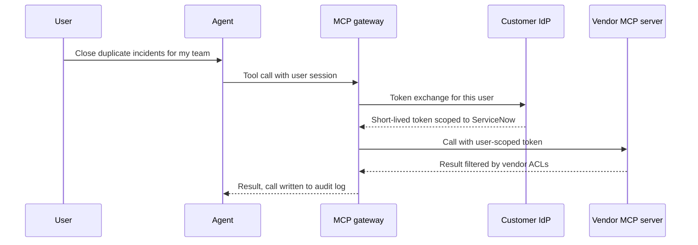

# 🚁 Forward Deployed Engineer (FDE) × AI - Interview Guide

The breakout AI role of 2025-2026. Palantir invented the title, OpenAI and Anthropic scaled it, and now every AI startup selling into enterprises is hiring for it. The loop is unusual: it tests real technical depth (full-stack + the AI application layer) **and** customer-facing skills in the same pipeline - discovery, decomposing vague business problems, building demos under time pressure, and holding your ground in security and expectation-management conversations. Prepare for both halves or fail the loop in whichever half you ignored.

## How this role's interviews changed (2024 → 2026)

- **The role went from niche to everywhere.** In early 2024, "FDE" loops existed mostly at Palantir. By 2025-2026, OpenAI, Anthropic, and a long tail of applied-AI startups run dedicated FDE loops, most of them visibly forked from Palantir's playbook (decomp interview + technical depth + customer role-play). If you interview for "Solutions Architect," "Applied AI Engineer, Deployed," or "Member of Technical Staff - Customer," it's usually the same loop.
- **The decomposition ("decomp") interview became a standard stage.** You get a deliberately vague prompt - "a logistics company wants to reduce missed deliveries" - and the interviewer plays a customer stakeholder. You're graded on how you carve ambiguity into a scoped, buildable v1, not on the final architecture. In 2024 this was a Palantir signature; now it's table stakes across the role.
- **Live build / rapid-demo rounds appeared.** A 60-120 minute session (or tightly timeboxed take-home): here's an API key and some messy sample data, build something a customer could see. Interviewers watch what you cut, how you narrate tradeoffs, and whether the thing runs - not code aesthetics.
- **Customer role-plays got adversarial.** Expect injected objections mid-scenario: "our CISO says no data leaves our network," "the demo hallucinated in front of my VP," "why can't we just fine-tune it?" The 2024 version was a friendly Q&A; the 2026 version tests whether you can push back without losing the room.
- **Coding rounds moved from LeetCode toward practical integration.** Building a small service that calls an LLM API, handles failures, and processes real-ish data replaced graph algorithms at most (not all) companies. Palantir-lineage loops still include a general coding round.
- **AI-tool fluency is now assessed, not just tolerated.** FDEs ship most integration code with coding agents, and live-build rounds increasingly allow or expect them. Interviewers watch how you decompose the task, how narrowly you direct the tool, and whether you review its diffs or accept them blind. Beyond FDE loops, large companies made this formal: Meta piloted an AI-enabled coding round in October 2025 and expanded it through 2026, Google began piloting a Gemini-assisted round for some SWE roles in 2026, and Amazon added an AI-assisted task to some online assessments (all reported, varies by team). Expect the follow-up too: "how do you work when the customer bans external AI tools?" Ask the recruiter which rounds allow assistants.
- **Agent deployments became the dominant technical topic.** In 2024 the technical scenario was almost always RAG over documents. By 2026 it's usually "deploy an agent that takes actions in the customer's systems" - which drags in tool design, guardrails, human-in-the-loop, and audit requirements. Connecting agents to customer systems through MCP servers, vendor-hosted or your own, is now standard vocabulary, and the auth question behind it ("whose permissions does the agent use?") is where candidates get separated.
- **De-emphasised: ML theory.** Training internals, optimizer math, architecture derivations - largely gone from FDE loops. Nobody asks you to derive attention; they ask what you do when the model is wrong in front of the customer.

## What FDE actually is - day-to-day, vs. sales engineering, vs. consulting

Interviewers ask this directly, and your answer signals whether you understand what you're signing up for.

| | Forward Deployed Engineer | Sales Engineer | Consultant |
|---|---|---|---|
| **Primary output** | Working software deployed in the customer's environment | Demos and POCs that support a deal | Recommendations, decks, staff augmentation |
| **Owns outcome after signature?** | Yes - success = the system runs in production and the account expands | Rarely - hands off post-sale | Sometimes, but scoped to the SOW |
| **Writes production code?** | Yes, often inside the customer's stack | Throwaway demo code | Varies; often not |
| **Feedback into product?** | Core part of the job - FDEs are the product team's sensors for what enterprises actually need | Feature requests via sales | No formal channel |
| **Travel/embed** | Regular on-site embeds, shared Slack channels, customer standups | Meeting-driven visits | Long on-site engagements |

Day-to-day: a typical week mixes on-site and remote. Morning debugging the customer's data pipeline because the SharePoint export broke ingestion; midday demo to a VP using their real data; afternoon writing glue code between the model and their internal ticketing system; end of day writing up what the product team should build so the next FDE doesn't hand-roll the same thing. You are simultaneously engineer, product manager, and diplomat - and the engineering is real, not demo-ware.

## What you're actually expected to know

**Expected, and probed hard:**

- **The AI application layer, hands-on.** Prompting strategies, context management, RAG pipelines end-to-end (chunking → hybrid retrieval → reranking → grounding), agent loops and tool design (including MCP), structured outputs. You should be able to build any of these from API primitives in an afternoon, and do it faster with a coding agent without losing control of the code.
- **Full-stack pragmatism.** Enough backend (APIs, queues, auth) and enough frontend to make a demo a stakeholder can click. Being able to enter a foreign codebase or dataset and be useful in hours matters more than depth in any single framework.
- **Enterprise deployment realities.** Data residency, cloud and VPC deployment options (Bedrock, Vertex AI, Microsoft Foundry, self-hosted vLLM), SSO, audit logging, what "does the model train on our data" actually means for API providers, and how to answer a CISO without hand-waving.
- **Eval literacy.** You'll be asked to define "working" for a customer who has no labelled data. Golden sets, LLM-as-judge with spot-checked calibration, error taxonomies, accuracy-by-slice reporting.
- **Communication under ambiguity.** Scoping vague asks, saying no with a reason, translating model limitations into business terms.

**Not expected - stop preparing this:**

- Deriving backprop, attention math, or optimizer internals. A one-paragraph intuition of how transformers predict tokens is plenty.
- Training or fine-tuning experience beyond knowing *when to recommend against it* (which is most of the time).
- GPU/CUDA-level inference optimization. Know latency/cost levers at the API level (caching, model tiering, streaming); leave kernel fusion to the inference teams.
- Research fluency. You will never be asked to discuss the latest paper; you will absolutely be asked what you'd do when retrieval quality drops on scanned PDFs.

If you've shipped one real LLM feature to real users and can talk about its failures honestly, you're better prepared than someone who read every survey paper. Calibrate accordingly.

## Study map

| Repo section | Depth | Why for this role |
|---|---|---|
| [01-ml-and-dl-foundations](../01-ml-and-dl-foundations/README.md) | ⚪ skim | Vocabulary only - overfitting, embeddings, train/test discipline. Nobody asks an FDE for gradient math. |
| [02-llm-fundamentals](../02-llm-fundamentals/README.md) | 🟡 solid (practical half) | Tokens, context windows, sampling/temperature, why models hallucinate - you explain these to customers weekly. Skim the architecture internals. |
| [03-prompt-engineering-and-context](../03-prompt-engineering-and-context/README.md) | 🟡 solid | Your fastest lever on-site. Prompt iteration, context budgeting, and structured outputs fix most "the model is wrong" complaints before anything heavier. |
| [04-rag-and-retrieval](../04-rag-and-retrieval/README.md) | 🟢 deep | The default first deployment at almost every enterprise. You must debug retrieval on messy customer data live - chunking, hybrid search, reranking, grounding failures. |
| [05-fine-tuning-and-alignment](../05-fine-tuning-and-alignment/README.md) | ⚪ skim | Know the decision framework well enough to talk customers *out* of fine-tuning. You'll rarely run one. |
| [06-agents-and-tool-use](../06-agents-and-tool-use/README.md) | 🟢 deep | The 2026 deployment surface. Tool design against customer systems, guardrails, human-in-the-loop, failure recovery - core interview material. |
| [07-evaluation-and-observability](../07-evaluation-and-observability/README.md) | 🟡 solid | "How do we know it works?" is the question that decides renewals. Golden sets, LLM-as-judge, tracing - you build these for every engagement. |
| [08-inference-and-production](../08-inference-and-production/README.md) | 🟡 solid | API-level production concerns: latency, cost tiering, caching, rate limits, fallbacks. Skip the GPU internals. |
| [09-safety-security-and-responsible-ai](../09-safety-security-and-responsible-ai/README.md) | 🟡 solid | Prompt injection, data boundaries, and the CISO conversation. FDEs field security objections before the security team does. |
| [10-multimodal](../10-multimodal/README.md) | ⚪ skim | Useful when a customer's "documents" turn out to be scans and screenshots - know that vision-capable ingestion exists and when to reach for it. |
| [11-ai-system-design](../11-ai-system-design/README.md) | 🟢 deep | The case studies are gold for FDE - they're rehearsals for decomp interviews and real engagements alike. |
| [12-coding-challenges](../12-coding-challenges/README.md) | 🟡 solid | Loops still include practical coding: build-an-integration exercises more than algorithms, but be ready for both at Palantir-lineage companies. |
| [13-interview-process-and-behavioral](../13-interview-process-and-behavioral/README.md) | 🟢 deep | Half the FDE loop is behavioural-adjacent: role-plays, ambiguity stories, "tell me about a time you pushed back on a customer." |

## Role-specific interview questions

### 1. A customer signed a contract because their CEO said "we need AI." They can't articulate a use case. Walk me through your first two weeks.

<b>Answer</b>

Week one is discovery, not building. I ask for three things: access to the people who feel pain daily (not just executives), a tour of the systems where work actually happens, and examples of the artifacts that flow through the business - tickets, contracts, reports, emails. I'm hunting for tasks that are (a) high-volume, (b) language-heavy, (c) currently done by expensive people, and (d) tolerant of review before action. That intersection is where LLMs pay for themselves.

I run short interviews with 5-8 operators and ask "what did you do yesterday, hour by hour," not "what could AI do for you" - the second question produces science fiction, the first produces use cases. I also inventory data reality early: where documents live, what shape they're in, who owns access. Data access lead time is usually the critical path, so I file those requests in week one.

Week two, I pick one candidate use case and build a thin vertical slice on real (even if partial) data - not a deck. The goal is something clickable in front of the sponsor by day 10, framed explicitly as "directionally right, not production." That demo converts the vague mandate into a concrete conversation: now they're reacting to something real, telling me what's wrong with it, which is discovery gold.

Deliverable at two weeks: one working slice, a ranked list of 2-3 follow-on use cases with effort estimates, and a named data-access blocker list with owners.

**Follow-ups:** What if the operators and the executive sponsor want different things? How do you avoid the slice becoming an unpaid pilot that drags on for months?

### 2. You have 48 hours before a demo to a Fortune 500 executive team, using their data. What do you build and what do you deliberately cut?

<b>Answer</b>

First hour: lock scope with whoever owns the meeting. One workflow, one wow moment, five minutes of demo. Executives remember one thing; pick it deliberately - usually "the system answered a question on *our* data that would have taken an analyst a day."

Build priorities, in order: (1) ingestion of a *curated* subset of their data - 50 good documents beat 50,000 messy ones; (2) the happy path, hardened - I script the 5-6 queries the demo will actually use and test them twenty times each; (3) grounding and citations, because the first executive question is always "how do I know it's not making this up," and clicking through to the source document answers it viscerally; (4) a UI that looks intentional - clean and boring beats flashy and broken.

Cuts: auth/SSO (single shared login), evals (I hand-verify the scripted queries instead), edge-case handling (I steer the demo away from edges), scale (it needs to work for one presenter, not a thousand users), and any agentic write actions - read-only for demos, always.

Two disciplines matter more than the code. Rehearse the exact demo path end-to-end, twice, on the venue's network. And pre-plan the failure script: if the model produces something wrong live, I say "that's a great example of why we build evaluation into deployment" and show the citation trail - a recovered failure builds more trust than a suspiciously perfect run.

**Follow-ups:** The customer hands you the data 6 hours before the demo and it's unusable - what now? How do you prevent the demo from setting expectations production can't meet?

### 3. Interviewer plays a hospital COO: "ER wait times are too long. Can AI fix this?" Decompose the problem.

<b>Answer</b>

I don't answer the question as asked - I decompose it. "Wait time" is a pipeline: arrival → triage → bed assignment → physician eval → tests → disposition. First question to the COO: where does *your* data say the time goes? If they don't know, the first project is instrumentation, not AI, and I say so.

Then I sort the stages by AI-suitability. Language-heavy, judgment-light steps are good candidates: triage-note summarisation for handoffs, drafting discharge paperwork (often a hidden bottleneck holding beds), extracting structured data from ambulance run reports. Prediction problems - admission likelihood at triage, staffing demand forecasting - are classic ML, valuable, but need historical data and careful validation. Things I'd rule out immediately: autonomous clinical decisions. Regulatory and safety posture matters; anything touching diagnosis needs a clinician in the loop by design, and I say that to the COO before they ask.

Then constraints: EHR integration path (Epic? HL7/FHIR access?), PHI handling - HIPAA means a BAA with any model provider or VPC/on-prem inference - and who on their side owns clinical sign-off.

I'd propose a wedge: discharge-summary drafting. Measurable (bed turnover time), language-native, human-reviewed by design, and doesn't require the model to be right about medicine - only useful to someone who is. Ship that, earn trust, expand.

The meta-skill being tested: turning "AI for X" into a costed, sequenced list of small problems, and being willing to say "step one isn't AI."

**Follow-ups:** The COO insists on the triage-prediction moonshot first - how do you respond? What's your success metric for the wedge project and how do you measure it without a randomised trial?

### 4. The pilot RAG system is giving wrong answers on the customer's contracts. You're on-site tomorrow. How do you debug it?

<b>Answer</b>

First, get specific failures - I ask the customer for 10 concrete bad Q&A pairs before I arrive. "It's wrong sometimes" is undebuggable; ten examples usually cluster into one or two failure modes.

On-site, I bisect the pipeline per example: retrieval or generation? For each failure, pull the retrieved chunks and check whether the answer is present in them. This one check splits the world. If the evidence never made it into context, it's a retrieval problem; if it's in context and the model still botched it, it's a generation/prompting problem. In contract RAG, retrieval loses far more often.

Retrieval failures on contracts have signature causes: chunking that severs a clause from its section header or defined terms ("Termination" chunks that don't include what "Agreement" refers to); tables and nested numbering mangled at parse time - I always eyeball the raw parsed text of a failing document, because PDF extraction garbage is the most common root cause and nobody looks; vocabulary mismatch where users ask in business language and the contract speaks legalese - query rewriting or hybrid (BM25 + dense) retrieval helps; and version confusion where the index holds three amendments of the same contract and retrieval mixes them - needs metadata filtering, not better embeddings.

If it's generation: usually the model synthesising across chunks from different documents. Tighter grounding instructions, per-chunk citations, and forcing "not found in the provided documents" as a valid answer.

I leave behind a small eval set built from those failures so regressions get caught before the customer finds them.

**Follow-ups:** The customer's lawyers say answers must be traceable to exact clause text - how does that change the design? Retrieval hit rate is fine but users still distrust the system - what do you look at?

### 5. The customer's CISO says no data can leave their network. How does that constrain your architecture, and what are the options?

<b>Answer</b>

First, clarify what the constraint actually is - "no data leaves our network" spans a wide range in practice. Options, ordered by how much of the constraint they satisfy:

1. **Provider API with contractual controls.** Zero-data-retention agreements, no training on customer data (standard for enterprise API tiers), SOC 2 reports, region pinning. Data does transit to the provider; some CISOs accept this with a DPA, many won't.
2. **Hyperscaler-hosted models in the customer's cloud account** - AWS Bedrock, Google Vertex AI, Microsoft Foundry (which now includes Azure OpenAI). Requests go over private endpoints to the cloud they already contract with, inherit their existing compliance envelope (the CISO already trusts Azure), and the model vendor does not receive them. You keep frontier-model quality: Claude is offered on all three, OpenAI's frontier models mainly on Azure. This is the workhorse answer for most enterprises in 2026.
3. **Self-hosted open-weight models in their VPC or on-prem** - vLLM or similar serving Qwen, Llama, Mistral or gpt-oss-class models. Full data control, but now you own GPU capacity planning, a quality gap versus frontier models (narrower than in 2024, still real on hard reasoning and long agentic tasks), and an ops burden the customer probably can't staff. Check model provenance policy early, since some regulated buyers restrict weights by country of origin. I reserve this for genuinely air-gapped environments (defence, some healthcare).

Architecture consequences beyond model choice: embeddings and vector stores must also live inside the boundary (teams forget the embedding API is data egress too); observability/tracing tools must be self-hosted or in-tenancy; and your own development access changes - you may be working over their VDI with no copy-paste, which halves your velocity and should be priced into the timeline.

The FDE-specific skill: don't relitigate the policy. Present the tiers, quantify the quality/cost/ops deltas, and let the CISO pick their point on the curve.

**Follow-ups:** The customer picks self-hosted, then complains quality is worse than the ChatGPT demo they saw - handle it. What actually goes into the security review packet you'd prep for this CISO?

### 6. The customer wants your agent to take write actions in their ERP - create purchase orders, update records. How do you design and stage that safely?

<b>Answer</b>

Rule one: never let a probabilistic system take irreversible actions without a deterministic gate. The design follows from that.

Staging: **read-only → draft → gated write → scoped autonomy.** Phase 1, the agent only reads and reports; this builds the tool layer and trust simultaneously. Phase 2, the agent produces *draft* actions - a purchase order object rendered for a human who clicks approve; the human action is what commits. Phase 3, low-risk writes execute directly while high-risk ones stay gated, with risk defined by a policy engine outside the model: dollar thresholds, vendor allowlists, rate limits. Deterministic code decides what the agent *may* do; the model only decides what it *wants* to do. Phase 4 autonomy is earned per action type, backed by approval-rate data from phase 2-3 ("humans approved 98.5% of category-X drafts over 3 months" is an argument; "the model seems good" is not).

Tool design details that matter: idempotency keys on every write so retries don't double-create POs; dry-run variants of each tool for testing and for the agent to validate before committing; a full audit log - prompt, retrieved context, tool call, approver - because when a bad PO happens (it will), the postmortem question is "why," and you need to answer it. Also prompt-injection review: if the agent reads vendor-submitted documents, a malicious invoice becomes an attack vector on your write path, so tool permissions must not exceed what the reading context justifies.

**Follow-ups:** The customer says approval queues defeat the purpose and wants full autonomy now - what data would change your position? How do you test the write path without touching the production ERP?

### 7. A CISO asks: "How do we know your model won't leak our data or train on it?" Answer them.

<b>Answer</b>

Answer the two concerns separately, because they have different mechanics.

**Training:** enterprise API agreements from the major providers contractually exclude customer data from training by default - this is a contract question, and I point to the specific DPA language rather than asserting it verbally. If they need stronger guarantees: zero-data-retention options (prompts not persisted post-inference), region pinning, or hyperscaler deployment (Bedrock, Vertex AI, Microsoft Foundry) where requests are processed by the cloud they already contract with and the model vendor never receives them.

**Leakage** is the subtler concern and worth decomposing for them, because CISOs respect precision: (1) *Cross-tenant leakage through the model* - a model doesn't memorise your API inputs at inference time; there's no mechanism for another customer's session to surface your prompts, given training exclusion. (2) *Leakage within their own org* - the real risk. If the RAG index ignores document ACLs, an intern can ask the chatbot about executive compensation and get an answer. Retrieval must enforce per-user permissions at query time; I'd walk through exactly how ours does. (3) *Leakage through the application* - prompt injection exfiltrating context, logging/tracing tools storing sensitive prompts, browser plugins. These are addressed by output filtering, redaction in observability pipelines, and standard appsec.

Then I offer artifacts, not reassurance: SOC 2 reports, the provider's DPA, an architecture diagram showing every place data rests or transits, and a pen-test window. The FDE failure mode is vague soothing; the win is showing you understand their threat model better than they expected.

**Follow-ups:** The CISO asks about prompt injection specifically - give the two-minute version. What in your own application layer (not the provider's) would you audit first?

### 8. The VP saw a flawless demo and now expects 100% accuracy in production. How do you manage that expectation without killing the deal?

<b>Answer</b>

The mistake is arguing about the model ("LLMs hallucinate, that's just how it is") - that sounds like an excuse. Instead I reframe from *accuracy* to *outcome*: what does the current human process achieve? Almost no human workflow is 100% accurate either - manual contract review misses things, data entry has error rates. The honest comparison is system-with-AI versus status quo, and I try to get a baseline number for the status quo early, because "94% versus your team's current 88%, at one-tenth the turnaround" is a winning sentence.

Then I make error handling a *feature* of the design rather than a confession: confidence-based routing (high-confidence cases flow through, low-confidence route to humans), citations so every answer is verifiable in seconds, and an eval dashboard the customer can see. The message is "we don't promise zero errors; we promise you'll know your error rate, it'll beat your baseline, and errors get caught before they cost you." That's a stronger promise than 100%, and sophisticated buyers know it.

Tactically, I also fix the root cause: demos that only ever show the happy path create this problem. I now deliberately show one graceful failure in every demo - the model saying "not found in the documents" - and narrate why that behaviour is what makes the system trustworthy.

If the VP genuinely can't accept any error rate for a workflow, that workflow needs a human in the loop by design or it's the wrong use case - and saying so is what keeps the account eighteen months later.

**Follow-ups:** The customer wants an accuracy SLA in the contract - what do you agree to and how do you make it measurable? Who defines "correct" when the customer's own experts disagree?

### 9. The customer has no labelled data and no eval culture. How do you establish "is it working?" for the deployment?

<b>Answer</b>

Never skip evals because labels don't exist - manufacture them cheaply, in this order.

**Golden set from experts (week one).** Sit with 2-3 of the customer's domain experts and extract 50-100 real input/expected-output pairs. This costs a few hours of their time and is the highest-value artifact of the engagement. Pull inputs from real historical traffic (actual tickets, actual contract questions), not invented ones - invented questions are always too clean. Deliberately include known-hard cases and cases where the correct answer is "cannot be determined."

**LLM-as-judge for scale, calibrated against humans.** A judge model grades outputs on rubric criteria (grounded in the source? complete? correct format?), which lets me score thousands of outputs nightly. But a judge is only trustworthy after calibration: I have the experts hand-grade ~50 outputs, measure agreement with the judge, and iterate the rubric until agreement is high enough to trust - then spot-check on an ongoing basis. Uncalibrated LLM-judge numbers are theater.

**Production signals from day one of pilot:** thumbs up/down, edit distance between draft and what the human actually sent (great signal for drafting use cases), escalation/override rates, and retention of usage - people quietly abandoning the tool is the truest negative eval.

Then report by *slice*, not aggregate: accuracy per document type, per department, per question category. Aggregate 91% hides the one category at 60% that will torch your credibility. The eval dashboard becomes the shared truth for the renewal conversation - which is the real reason FDEs build them.

**Follow-ups:** The experts disagree with each other on 20% of the golden set - what do you do? How do you detect quality regression after a model version upgrade you don't control?

### 10. Your pilot succeeded. Walk me through what changes when you take it to production for 5,000 users.

<b>Answer</b>

Almost everything except the prompt. The pilot proved value; production is a different engineering problem.

**Identity and access:** SSO integration, and - the big one for RAG - per-user document permissions enforced at retrieval time. The pilot ran on a curated corpus everyone could see; production indexes must respect ACLs or you've built a data-leak machine (see the intern-asking-about-salaries problem).

**Ingestion becomes a pipeline, not a script:** incremental sync from live sources (SharePoint, Confluence, the ERP), deletion propagation (legal will ask whether a deleted document disappears from the index - the answer must be yes, with a deadline), parsing failure alerting, and versioning.

**Reliability and cost:** rate limits and provider quotas that a 30-user pilot never hit; fallback models for provider outages; caching; model tiering (cheap model for classification/routing, frontier model for generation) - at 5,000 users the per-query economics that didn't matter in pilot become a line item the buyer scrutinises. Latency also gets re-examined: pilot users forgive 20 seconds, production users don't; streaming and tighter context budgets usually get you most of the way.

**Observability and evals in CI:** tracing on every request, the golden set from the pilot running as a regression gate on every prompt/model/index change, drift monitoring on production quality signals.

**Organisational:** a support path that isn't "Slack the FDE," runbooks, training the customer's team to operate it, and an agreed definition of done - because the FDE's exit (or move to the next use case) has to be explicit or you become permanent free staff augmentation.

**Follow-ups:** Which of these do you negotiate for the customer's own engineers to own, and how? The provider deprecates your model mid-rollout - what's your process?

### 11. The customer's "documents" turn out to be scanned PDFs, Excel exports with merged cells, and a 15-year-old SharePoint. The pilot assumed clean text. What do you do?

<b>Answer</b>

This is the normal case, not the exception - enterprise data is always worse than the discovery call claimed. First move: triage the corpus before touching the pipeline. Sample 50-100 documents across sources and bucket them: native-text PDFs (fine), scanned images (need OCR or vision models), spreadsheets (need structure-aware handling), and genuinely degenerate content (fax-quality scans, handwriting). Get the volume distribution - if 80% of query-relevant content lives in the 20% of docs that are clean, ship on those first and say so.

Technical toolkit per bucket: scanned docs go through OCR or, increasingly, vision-capable LLMs doing document understanding directly - better on tables and layout than classic OCR, at higher per-page cost, so route by document value. Spreadsheets should not be chunked as prose; extract them as structured tables, serialise row-wise with headers repeated per chunk, or better, load them into something queryable and give the system a query tool instead of embedding cell soup. SharePoint's real problems are permissions sprawl and duplication - the same policy in eleven near-identical copies poisons retrieval with redundant chunks, so dedupe and prefer latest-version metadata.

Just as important is the commercial handling: this is a scope change, and burying it is a mistake. I quantify it - "60% of the corpus needs an ingestion track we didn't scope; here's the cost and the sequencing options" - and let the customer choose. Customers respect data-reality conversations; they don't respect a silently slipping timeline.

**Follow-ups:** How do you *measure* whether ingestion quality is hurting answer quality, versus retrieval or generation? The customer says "just index everything" - why is that wrong?

### 12. When do you tell a customer that AI is the wrong tool? Give a concrete case and how you'd handle the conversation.

<b>Answer</b>

Frequently - and interviewers ask this because FDEs who can't say no create the industry's failed-pilot statistics. Cases where I've said or would say no:

- **It's a lookup, not a language problem.** "We want a chatbot to tell customers their order status" - that's an API call and a template. Wrapping an LLM around a deterministic lookup adds latency, cost, and a hallucination risk to something that had none. Build the boring version.
- **The tolerance for error is zero and no human review is possible.** Automated regulatory filings, unsupervised medical dosing. If they can't accept a review step, the use case is disqualified, not the model choice.
- **The data doesn't exist.** "Predict which deals will close" from a CRM that sales reps update quarterly and dishonestly. No model fixes garbage inputs; the project is data hygiene first.
- **A rules engine already solves it.** If the customer can write down the decision logic completely, deterministic code is cheaper, auditable, and correct every time.

The conversation matters as much as the judgment. I never just say no - I say "not this, and here's what instead": redirect to the adjacent problem where AI *does* pay (order-status bot → LLM triage of the free-text complaints that surround it), or to the prerequisite (instrumentation, data cleanup) framed as phase one. Said with a costed alternative, "no" builds more trust than any demo - it proves you're optimising for their outcome, not your deployment count. Strategically, one honest no is worth three mediocre pilots, because expansion revenue comes from trust.

**Follow-ups:** Your own sales team pushes back because the deal depends on saying yes - what do you do? How do you tell "AI is wrong here" from "v1 of AI is wrong here"?

### 13. Live exercise: here's our API and a folder of sample support tickets. In 60 minutes, build something that would impress a support-team lead. Narrate your choices.

<b>Answer</b>

The graded skill is scoping under time pressure, so I narrate the scope decision first: a support-team lead cares about queue triage and agent time-per-ticket. In 60 minutes I can make one of those visibly better. I'd build a **ticket triage + draft-response tool**: paste or select a ticket → get category, urgency, extracted entities, and a draft reply grounded in a few provided help-doc snippets.

Time budget, stated out loud: ~10 minutes reading the data (what fields exist, how messy, what categories emerge from skimming 20 tickets - skipping this step is how you build the wrong thing); ~25 minutes on the core loop - one well-structured prompt returning JSON (category, urgency, entities, draft) via the API's structured-output mode, with a retry-on-invalid guard; ~15 minutes on a minimal UI - Streamlit or a single HTML page - because the audience is a team lead, not a terminal user; ~10 minutes running it against 10 diverse tickets and fixing the worst failure I find.

Deliberate cuts, also narrated: no RAG index (I inline 3-4 help-doc excerpts into context - right call at this corpus size, and I say what corpus size would change the answer), no eval harness (I hand-check outputs and say what I'd build with a week), no auth, no batch mode.

I finish with the 30-second roadmap: real retrieval over their help centre, a golden set from historical resolved tickets, then draft-quality measurement via edit distance. Demonstrating that you know what production needs - while consciously not building it in an hour - is exactly the FDE judgment being tested.

**Follow-ups:** The sample tickets contain customer PII - does that change what you do in the exercise? Your structured outputs misclassify urgent tickets as low priority - what's your fastest fix within the hour?

### 14. You'll write most of the integration code with a coding agent while embedded at a customer. Their security lead asks what that agent can see and do in their environment. How do you answer, and how do you work?

<b>Answer</b>

Lead with the boundary, then the workflow. A coding agent sends code and whatever context it reads to a model provider, and it executes commands, so the question has two halves: data egress and actions.

**Data.** Use only tools the customer has approved, under their enterprise agreement or yours, with zero data retention where offered. Many enterprises already have one cleared, often GitHub Copilot or an assistant routed through their own Bedrock, Vertex AI or Foundry account, and using it beats a week of procurement for your preferred tool. Never point a personal account at customer code. Keep production data out of the agent's context: work against masked or synthetic fixtures, and exclude secrets and `.env` files through the tool's ignore settings.

**Actions.** Give the agent the permissions you'd give a new contractor, or fewer: dev environment only, no production credentials, and your approval on any command that touches shared systems. If the customer only permits work inside a VDI with no external egress, you work without the agent and price that into the timeline.

**Workflow,** which is what live-build interviewers actually watch: decompose before prompting, give the agent the repo's conventions and a narrow task, and review every diff as if a capable junior wrote it. Generated integration code fails in predictable places: swallowed errors, retries without idempotency keys, tokens printed in debug logs, and invented fields for the customer's internal APIs. Tests against recorded real responses catch the last one fast.

The handover is the real test. The customer's engineers will maintain this code, so it has to be boring, documented and tested, whoever typed it. Code nobody on their side can read is a liability you leave behind.

**Follow-ups:** The customer bans all AI tools mid-engagement after an incident elsewhere - what changes in your plan? An interviewer watches you accept a 200-line diff in ten seconds - what do they conclude?

### 15. The customer wants one agent wired into Salesforce, SharePoint, ServiceNow and an internal Postgres. Vendor-hosted MCP servers, your own, or direct tool integrations? Walk me through auth.

<b>Answer</b>

A mix, decided per system, and auth drives the decision more than convenience does.

- **Vendor-hosted MCP servers** for the big SaaS systems where they exist. The vendor maintains the API mapping and, more importantly, calls run under the user's own OAuth grant, so sharing rules, site ACLs and ITSM roles are enforced by the system that owns them. Many expose broad tool sets, so allowlist the subset you need.
- **Your own MCP server** for the internal Postgres. Never hand the agent raw SQL. Expose a few named, parameterised operations over views with row-level security keyed to the calling user, which is a surface you can defend in a security review.
- **Direct tool integrations** when one agent uses a system and nothing else will. MCP adds a hop and a deployable someone has to operate.

On auth, the agent acts as the user, never as a service account with broad access, or you've rebuilt the intern-reads-salaries problem across four systems. The pattern is a gateway in the customer's environment that authenticates the user through their IdP, exchanges that for a short-lived token scoped to this user and this system (OAuth token exchange or the vendor's on-behalf-of flow), and logs every call with user, tool and arguments. Service accounts are reserved for read-only reference data, documented as such.

Raise two risks before the customer does. Tool descriptions and tool results are prompt-injection surface, since a ticket body can carry instructions, so write-capable tools need approval gates. And forty tools from four servers bloat context and degrade tool selection, so load tools per task.

**Worth sketching.** The token path that keeps every call scoped to one user.

**Follow-ups:** The vendor's MCP server exposes sixty tools and you need four - how do you constrain it? Security asks how to revoke the agent's access for one user within five minutes - what's your answer?

## Portfolio moves

- **A "messy data to demo" repo with a timeline.** Take a genuinely ugly public corpus - SEC filings, city council PDFs with scans, or a public SharePoint-style dump - and build ingestion → RAG → clickable UI, with a README documenting what broke and the hour-by-hour timeline. *Demonstrates:* the core FDE motion - enterprise-grade mess to stakeholder-ready demo, fast, with honest engineering notes.
- **An agent with gated write actions and an audit log.** An agent that drafts actions against a real API (calendar, ticketing, a mock ERP) with a human-approval queue, idempotent tools, and a browsable audit trail of every decision. *Demonstrates:* you understand that the hard part of agents in enterprises is safety architecture, not the loop.
- **An eval dashboard a non-engineer can read.** For any LLM project you've built: golden set, LLM-judge with documented human-calibration numbers, and accuracy-by-slice reporting in a simple dashboard. *Demonstrates:* eval literacy plus the customer-communication instinct - the dashboard *is* the renewal conversation.
- **A deployment-boundary writeup or template.** A short technical writeup (or Terraform template) comparing the same app deployed via provider API vs. Bedrock or Microsoft Foundry in the customer's cloud account vs. self-hosted vLLM, with measured quality/latency/cost deltas. *Demonstrates:* you can hold the CISO conversation with artifacts instead of vibes.
- **A demo-to-production story, written up.** One page on a real LLM feature you took from prototype to real users: what the demo hid, what production forced (permissions, ingestion sync, cost tiering), and one number that improved. Internal tools count. *Demonstrates:* the exact narrative every FDE behavioural round asks for.

## Red flags interviewers see from this role

- **Architecture before discovery.** Candidate hears the vague customer prompt and immediately draws a RAG diagram without asking a single question about the business, the users, or where time and money actually go. The decomp interview exists to catch exactly this.
- **Demo-only credibility.** Every project is a weekend Streamlit toy; no story about permissions, ingestion sync, evals, cost, or what happened after real users arrived. FDEs are hired to survive the part *after* the demo.
- **Treats the model as deterministic.** Promises accuracy without an eval to measure it, has no vocabulary for failure modes, no plan for the day the model is wrong in front of the customer's VP.
- **Can't say no in the role-play.** Agrees to every customer ask - full autonomy, 100% accuracy SLA, "just fine-tune it" - to keep the interviewer happy. Interviewers deliberately make unreasonable asks to see if you'll push back with a reasoned alternative.
- **Blanks on the security conversation.** No answer to "does the model train on our data," no concept of in-tenancy deployment, ACL-aware retrieval, or prompt injection. FDEs field these questions in week one of every engagement.
- **Consultant syndrome.** Fluent in frameworks and discovery decks but hasn't shipped code recently and visibly doesn't want to get hands dirty in the customer's stack. The role is forward *deployed* engineer - the code half is not optional.
