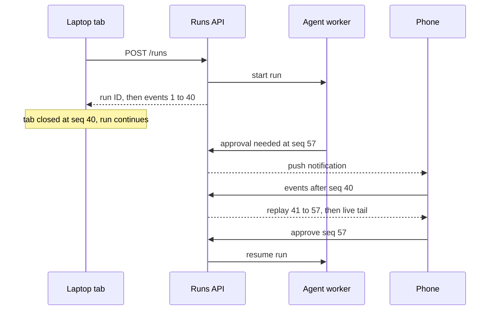

# 🖥️ Frontend Engineer × AI - Interview Guide

How to use this repo when you're a frontend engineer interviewing for AI-product companies - or any company whose frontend interviews have absorbed AI features. You are not interviewing to be an ML engineer. You're interviewing to be the person who makes a slow, non-deterministic, occasionally-wrong backend feel fast, trustworthy, and safe to use.

---

## How this role's interviews changed (2024 → 2026)

- **The take-home is now "build a chat UI over this API."** The todo app is dead at AI companies. You get an OpenAI-compatible or Anthropic-style streaming endpoint and a few hours. The real rubric is rarely stated: do you stream tokens or block on the full response, do you have a stop button, what happens when the stream dies at token 200, is the markdown rendered safely. Candidates who `await` the whole response and show a spinner fail before the design review starts.

- **AI-assisted coding is part of the loop itself, and AI-tool fluency is graded.** Meta has run an AI-enabled coding round since October 2025 (a multi-file codebase plus an assistant, typically alongside one classic no-AI round), Google began piloting a Gemini-assisted code-comprehension round for junior and mid-level SWE roles on select US teams in 2026, and Amazon has added AI-assisted repository tasks to some assessments (all reported, varies by team). AI-native companies go further and hand you Cursor, Claude Code or Copilot for the whole practical. They grade how you drive the tool: decomposition, the context you feed it, whether you read the diffs, whether you run the code, and whether you catch what it gets wrong. In UI code that means accessibility, effect and state bugs, and unsafe rendering. Rules differ by company and by round, so ask the recruiter which mode you're in and practise both.

- **Frontend system design converged on a family of prompts:** "design the frontend for a ChatGPT-style app" and its variants - AI code review UI, copilot sidebar, and increasingly the console for a long-running background agent that keeps working after you close the tab. It tests streaming architecture, conversation and run state, error UX, and accessibility in one prompt. If you've only prepped "design an infinite-scroll feed," you're prepping for 2022.

- **Product-sense rounds now include AI judgment.** When should a feature stream vs. block? How do you show uncertainty without destroying trust? When should a feature *not* be AI? Interviewers probe whether you'd ship a hallucination-prone feature with a confident-looking UI.

- **A new vocabulary is assumed:** TTFT, tokens/sec, SSE, tool calls, reasoning ("thinking") phases, MCP, evals, traces. Not deep theory - but if "time to first token" draws a blank, the interviewer recalibrates your seniority downward.

- **De-emphasised:** framework trivia (React lifecycle minutiae, CSS puzzles) and, at AI-native companies, LeetCode-style DS&A - largely replaced by practical builds. Big Tech still runs algorithm rounds, so don't drop them entirely, but one coding slot is increasingly AI-assisted, and the differentiator round is now the AI-flavoured one.

---

## What you're actually expected to know

**The bar, honestly:** everything between the HTTP response and the user's eyes, plus enough model literacy to make good product and API decisions.

Expected - and this is where interviews are won:

- **Streaming, cold.** SSE format, `fetch` + `ReadableStream`, buffering across chunk boundaries, rendering markdown as it streams, throttling re-renders, `AbortController`. This is *your* systems knowledge, and interviewers go deep here.
- **UX for slow + non-deterministic.** Optimistic UI, retry/resume, partial-failure states, latency perception (TTFT over total time), progress display for multi-step agents.
- **Safety at the render boundary.** Model output is untrusted input. Sanitisation, markdown-image exfiltration, link handling, why `dangerouslySetInnerHTML` on model output is an instant red flag.
- **Conversation state management.** Message trees, regeneration, branching, streaming buffers vs. persisted state.
- **Working API literacy.** Tokens, context windows, temperature, tool-call payload shapes, finish reasons, roughly what RAG and agents do - enough to design the UI for them and to push back on a bad API contract.
- **Eval awareness.** What a trace is, why your feedback widget matters, how thumbs-down data becomes a regression test.

**Not expected - stop over-preparing this:**

- Deriving backprop, attention math, or optimizer internals. Nobody will ask you to whiteboard scaled dot-product attention.
- Fine-tuning mechanics (LoRA rank selection, RLHF pipelines). Know the one-sentence version of each.
- GPU serving, quantization, KV-cache memory math. You need the *client-visible consequences* (TTFT, tokens/sec, rate limits), not the CUDA.
- Vector DB index internals. "Embeddings + similarity search, and citations flow back to my UI" is the right altitude.

If you can build a robust streaming chat interface and explain *why* each decision was made, you are in the top decile of frontend candidates at AI companies. The anxiety that you need to "learn ML" first is the single most common prep mistake for this role.

---

## Study map

| Repo section | Depth | Why for this role |
|---|---|---|
| [01-ml-and-dl-foundations](../01-ml-and-dl-foundations/README.md) | ⚪ skim | Vocabulary only (embeddings, loss, overfitting). You will not be asked to derive anything. |
| [02-llm-fundamentals](../02-llm-fundamentals/README.md) | 🟡 solid | Tokens, context windows, temperature, sampling, why outputs vary - this directly drives UI decisions (counters, truncation UX, regenerate semantics). |
| [03-prompt-engineering-and-context](../03-prompt-engineering-and-context/README.md) | 🟢 deep | You'll write and iterate real prompts for UI features, structure system prompts for in-product copilots, and debug "the model ignores my format instructions" from the client side. |
| [04-rag-and-retrieval](../04-rag-and-retrieval/README.md) | 🟡 solid | Enough to design citation UI, source attribution, and "searching your docs..." progress states - and to ask the backend the right questions. Skip index internals. |
| [05-fine-tuning-and-alignment](../05-fine-tuning-and-alignment/README.md) | ⚪ skim | One-sentence fluency (SFT vs. RLHF vs. LoRA). Only relevant if the product ships custom models. |
| [06-agents-and-tool-use](../06-agents-and-tool-use/README.md) | 🟢 deep | Tool-call UX is a core frontend problem now: streaming interleaved text/tool events, progress display, human-approval gates, parallel calls. Know the loop and the payload shapes. |
| [07-evaluation-and-observability](../07-evaluation-and-observability/README.md) | 🟡 solid | Your feedback widgets and client telemetry feed evals. Knowing trace/eval vocabulary is the highest seniority-signal per hour of study for this role. |
| [08-inference-and-production](../08-inference-and-production/README.md) | 🟢 deep* | *The streaming and latency half*: SSE, TTFT vs. throughput, timeouts, rate limits, cancellation. Skim the GPU/quantization/batching half. |
| [09-safety-security-and-responsible-ai](../09-safety-security-and-responsible-ai/README.md) | ⚪ skim | Skim overall, but read the prompt-injection and output-handling parts carefully - the render boundary is your responsibility. |
| [10-multimodal](../10-multimodal/README.md) | ⚪ skim | Only if the product does image/audio. File-upload + vision-input UX occasionally comes up. |
| [11-ai-system-design](../11-ai-system-design/README.md) | ⚪ skim | Read the framework plus the AI code assistant and customer support agent case studies; you'll reuse their shape in frontend system design rounds. |
| [12-coding-challenges](../12-coding-challenges/README.md) | ⚪ skim | Do the streaming SSE parser challenge properly (it is your take-home in miniature), then the agent-loop and rate-limiter challenges to internalise backend behaviour you'll build UI against. Skip attention/BPE implementations. |
| [13-interview-process-and-behavioral](../13-interview-process-and-behavioral/README.md) | ⚪ skim | Standard prep; add 1-2 STAR stories about shipping an AI feature (especially one you *changed* after eval/feedback data). |

---

## Role-specific interview questions

### 1. Walk me through rendering a streaming LLM response in the browser, from HTTP response to pixels.

<b>Answer</b>

Use `fetch` with a `ReadableStream` reader - not `EventSource`, since chat APIs need POST bodies and custom headers, which `EventSource` doesn't support. Parse the SSE protocol manually: decode bytes with `TextDecoder("utf-8", ...)` using `{ stream: true }` so multi-byte characters split across network chunks don't corrupt (emoji and CJK text will break without this). Buffer incoming text and split on `\n\n` event boundaries - network chunks do *not* align with SSE events, so you must carry the incomplete tail of the buffer into the next read.

Accumulate the content deltas into the full message text, then render markdown from the *accumulated* text, not per-delta. Two performance rules: throttle renders (batch deltas into ~30-50ms flushes or `requestAnimationFrame`) so a 60-tokens/sec stream doesn't cause a re-render storm, and memoize completed markdown blocks - only the final block is changing, so split the document into blocks and skip re-parsing the stable prefix.

Handle the unhappy paths: a `[DONE]`/finish event, error events mid-stream, and user cancellation via `AbortController`. On abort or error, finalise the partial text into a visible "stopped/incomplete" state rather than discarding it. Also handle markdown that's temporarily invalid mid-stream (unclosed code fences render the rest of the message as code) - either tolerate the flicker or auto-close open fences for display.

**Follow-ups:** Why does `TextDecoder` without `{stream: true}` work fine in your dev testing and fail in production? What changes if the backend uses WebSockets instead of SSE?

### 2. TTFT matters more than total generation time. How do you design a chat UI around that, and what do you do when TTFT itself is slow?

<b>Answer</b>

Users judge responsiveness by time-to-first-token, not completion time. A response that starts in 500ms and streams for 15 seconds feels faster than one that appears whole after 6 seconds. So: echo the user's message optimistically the instant they hit send, open the request immediately (not after animations), and render the first token the moment it arrives.

When TTFT is genuinely slow - RAG retrieval, agent planning, a reasoning model that thinks for tens of seconds before its first visible token - replace the dead air with *real* progress, not a fake spinner: stream status events ("Searching your documents... found 12", "Reading results...") from the backend and render them as staged states. For reasoning models, most providers can stream a reasoning summary or at least a thinking-in-progress signal; render it as a collapsible "Thinking..." section with elapsed time rather than a blank bubble. Honest intermediate progress buys far more patience than a pulsing dot; past a few seconds of blank waiting, users assume the app is broken and re-send (which also doubles your backend load - dedupe on client-generated message IDs).

Second-order tricks: smooth bursty token delivery into a steady character-level reveal so the stream never appears to stall mid-burst; keep the connection warm (keep-alive, pre-established sessions); if the product allows it, kick off retrieval on keystroke pause before the user submits.

The tradeoff to name: smoothing adds artificial delay to total time and can misrepresent state (looks like generating when it's actually done). Cap the smoothing buffer, and flush instantly on finish.

**Follow-ups:** Would you ever fake a typing animation over a response you already have in full (e.g., a cached answer)? What's the honest-UX argument against it?

### 3. The model outputs markdown. How do you render it safely, and what specifically can go wrong?

<b>Answer</b>

Rule zero: model output is untrusted input, exactly like user-generated content - more so, because a prompt-injected model can be *steered* into emitting malicious output. Never feed it to `innerHTML`/`dangerouslySetInnerHTML` raw.

Safe pipeline: markdown → HTML → sanitise (DOMPurify) → DOM, or use an AST-based renderer (the react-markdown family) that never concatenates HTML strings. Configure the markdown parser to *disallow raw HTML passthrough* - most parsers allow inline HTML by default, which reopens XSS through the front door.

Specific attacks to name: `<script>`/event-handler injection if raw HTML leaks through; `javascript:` URLs in links; and the one most candidates miss - **markdown image exfiltration**: an injected model emits ``, and the browser exfiltrates the data just by loading the image. Mitigations: block remote images by default or route them through a proxy that strips query payloads, and CSP `img-src` as backstop. For links: `rel="noopener noreferrer"`, show the real destination, consider confirm-on-click for external domains.

Two details that separate senior answers: sanitise on *every* streaming render pass, not just the final one (the attack can execute mid-stream); and keep model output visually distinct from application chrome so output text can't impersonate system UI ("Verified ✓ - click here to re-enter your password").

**Follow-ups:** Product wants the model to generate interactive HTML charts. How do you ship that without shipping XSS? (Expected direction: sandboxed iframe, no same-origin, postMessage allowlist.)

### 4. A generation fails halfway through the stream. What does good error and retry UX look like?

<b>Answer</b>

First: never discard the partial text. Keep it, visibly marked incomplete, with two explicit actions - **Retry** (regenerate) and, if the backend supports it, **Continue**.

Behaviour should branch on error class: network drop → retryable, potentially auto-retry with backoff; 429 rate limit → backoff with honest messaging ("high demand, retrying in 5s"); content-filter stop or refusal → do *not* auto-retry, surface why; 5xx → manual retry with a trace ID logged. Auto-retry is only acceptable *before* the first token renders - silently replacing text the user is already reading is disorienting, and because the model is non-deterministic, the retry will read differently.

Idempotency matters more than in CRUD apps: send client-generated message IDs so a retry doesn't append a duplicate user message server-side, and model "regenerate" as *replacing* the assistant message (or adding a sibling branch), not appending a new turn. Preserve the user's composer draft through any failure.

For flaky networks (mobile), the stronger design is resumable streams: the server buffers generated tokens keyed by generation ID; on reconnect the client sends the last event ID and replays the gap - SSE's `Last-Event-ID` header is the native hook, though it only helps if the server actually retains the buffer.

Finally, every failure should emit telemetry tied to the generation's trace ID - stream-failure rate by error class is a metric someone will ask you for.

**Follow-ups:** The user hits retry twice, fast. What prevents two concurrent generations for the same turn? When is `Last-Event-ID` not enough to resume?

### 5. Design the client-side state model for a chat app with multiple conversations, regeneration, and message branching.

<b>Answer</b>

Messages are a **tree, not an array**. Each message carries `id`, `parentId`, role, content parts, and status; a "conversation" as displayed is the path from root to a selected leaf. Regeneration creates a *sibling* of the assistant message; editing a user message creates a sibling with a new subtree. Branch navigation ("< 2/3 >") is a per-node pointer to the active child. Deriving the visible thread is a walk from root following active-child pointers.

Separate three kinds of state: (1) **persistent conversation data** - the message tree, synced with the server as source of truth (query cache like TanStack Query, or a store like Zustand hydrated from the API); (2) **streaming state** - the in-flight token buffer, kept in a ref/ephemeral store and flushed into the tree on completion, so you're not writing to your persistence layer 60 times a second; (3) **UI state** - composer drafts per conversation, scroll positions, which step-cards are expanded.

Message content is an ordered list of parts (`text | tool_call | tool_result | image`), not a string - agents interleave text and tool activity, and retrofitting this later is painful.

Concurrency rules to state explicitly: one active generation per conversation, enforced client-side; sequence numbers on stream events to guard against out-of-order or duplicated deltas; optimistic insert of the user message with `pending` status reconciled by server-assigned ID.

**Follow-ups:** How does the tree model shape your persistence schema and your "share conversation" feature? Where would you *not* use a global store here?

### 6. How do you present an agent's tool calls and multi-step progress in the UI?

<b>Answer</b>

The backend must stream *events*, not just text deltas: `tool_call_start` (name, then arguments streaming in), `tool_result`, step boundaries, and resumed text. Your message model needs ordered content parts to interleave these - an agent can emit text, call two tools, then continue the sentence.

UI pattern that works: inline, collapsible step cards in document order - collapsed by default to a one-line summary with live status ("🔍 Searching docs... → 12 results · 1.4s"), expandable to full arguments/results for trust and debugging. Progressive disclosure is the principle: casual users see progress, power users can audit. Status per step (running / succeeded / failed / skipped) with durations; a single failed tool shouldn't visually nuke the whole run if the agent recovered.

This is also your latency answer: agent runs have brutal TTFT for the final answer, but streaming step activity means the user watches real work happening instead of a spinner.

Handle: parallel tool calls (multiple cards running concurrently), long-running steps (elapsed timers, heartbeats so you can distinguish "slow" from "dead"), and **human-in-the-loop approval** - when the agent wants to do something sensitive, the stream pauses and you render actionable approve/deny UI. That approval gate deserves real design: show what will happen, on what data, reversible or not - a "Approve? [Y/N]" with raw JSON args is not informed consent.

**Follow-ups:** The agent runs for three minutes and the user closes the tab. What happens, and what should the UI show when they come back?

### 7. How do you make a streaming chat UI accessible?

<b>Answer</b>

The naive approach - `aria-live="polite"` on the streaming message - is broken: depending on the screen reader, it either spams a re-announcement on every token flush or re-reads the whole growing message repeatedly. Better patterns: give the message list `role="log"` (implicit polite live region designed for append-only content), buffer announcements to sentence or paragraph granularity, or announce only state transitions ("Assistant is responding" ... "Response complete") and let the user read the finished message at their own pace. Test the actual behaviour in VoiceOver and NVDA - this is among the least-tested paths in modern apps, and block-level markdown re-renders can defeat `role="log"`'s append-only assumption by mutating existing nodes.

Beyond the stream: focus stays in the composer after send - never steal it to the response. Every control is keyboard-reachable: stop generation (Escape as a shortcut is a nice touch), copy, feedback buttons, branch navigation. Errors announce via `role="alert"`. Messages need programmatic authorship ("You said... / Assistant said..."), not just visual alignment and bubble colour.

Motion and rendering: respect `prefers-reduced-motion` for typing/shimmer animations; maintain contrast in code blocks and syntax highlighting in both themes; ensure streaming auto-scroll is suspended once the user scrolls up (with a "jump to bottom" affordance) - auto-scroll fighting the user is both a UX and accessibility failure.

**Follow-ups:** A screen reader user hits Stop mid-generation - walk me through exactly what they hear and where focus is.

### 8. Your product adds thumbs up/down on assistant messages. What do you build, and where does the data go?

<b>Answer</b>

The widget is the easy 10%. The value is the pipeline: feedback must attach to the **generation's trace ID** from your LLM observability layer (Langfuse/Braintrust-style tooling), so each signal travels with everything that produced the response - prompt version, retrieved chunks, model, parameters, latency. A thumbs-down on a bare message row is nearly useless; a thumbs-down joined to its full trace is a debuggable artifact and a future regression-test case.

Frontend responsibilities: one-tap optimistic recording; an optional low-friction reason picker on negative feedback (incorrect / didn't follow instructions / formatting / unsafe); and emitting the metadata that makes slicing possible - model, prompt version, feature-flag arm, client platform.

Also capture **implicit signals**, which dwarf explicit ones in volume: copy-to-clipboard (positive), regenerate (usually negative), user edits the output before using it (rich signal - you have the correction), and abandonment mid-stream. Name the caveat: regenerate isn't always negative - people re-roll answers they liked to compare - so treat implicit signals as weak labels.

Downstream, this feeds three things: eval datasets (thumbs-down cases become graded regression suites), prompt-iteration triage (cluster failures by reason), and A/B comparison between models or prompt versions. Privacy is part of the design: storing feedback usually means storing conversation content, which needs consent and retention policy - say this unprompted.

**Follow-ups:** Most users never press either thumb, so explicit feedback covers a small fraction of messages. How do you design around that sparsity?

### 9. The model streams JSON that your UI renders as live components (generative UI). How do you handle parsing while the JSON is incomplete?

<b>Answer</b>

`JSON.parse` fails until the last byte arrives, which defeats streaming. Three approaches, in order of preference:

**Fix the protocol.** If you have any influence over the backend, avoid one monolithic JSON blob: stream NDJSON of small, individually-complete objects, or emit one tool call per component. Each unit parses cleanly the moment it arrives, and you sidestep client-side heroics. Pushing back on the API contract here is a senior move, not a cop-out.

**Partial-JSON parsing.** If you must stream one object, run a repairing parser on each flush: tentatively close open strings/brackets and parse best-effort, yielding a progressively-filled object. Render components as fields materialise - a card whose title appears, then description, then actions. Wait for the discriminating field (e.g., `"type"`) before choosing which component to mount, or you'll flash the wrong one.

**Schema-gate everything.** Validate with a schema (zod or similar) in partial/deep-partial mode while streaming and strictly on completion. If the final payload fails validation, fall back to rendering as plain text plus an error report with the trace ID - never render a component from a half-trusted shape, and never treat string fields as HTML; generative-UI output is still model output.

Edge cases to mention: numbers are ambiguous until a delimiter arrives (`12` may become `120`), so don't animate off numeric fields mid-stream; and cap repair-parse frequency - it's O(n) per flush over a growing buffer.

**Follow-ups:** How do you test this? What does your fixture set of malformed/truncated payloads look like?

### 10. What's different about optimistic UI when the backend is an LLM rather than a CRUD API?

<b>Answer</b>

Classic optimistic UI works because you can *predict* the server's result - rename a file, show the new name, roll back on failure. With an LLM you cannot predict the response, so optimism shifts to your side of the interaction: the user's message renders instantly, the conversation list reorders, the UI commits to a "generation in progress" state - while the assistant's content is never faked.

Rollback semantics change too. CRUD rollback restores a prior value; LLM failures leave *partial artifacts* - half a response the user may have already read. Don't silently revert; keep the partial with an explicit incomplete state and recovery actions. And because generation is non-deterministic, "retry" is not "the same request again" - the UI must not imply the result will match, and comparisons ("view previous attempt") become a feature, hence message branching.

Latency scale is different: CRUD optimistic updates paper over 100-300ms; LLM turns run seconds to minutes, so intermediate states are designed, first-class UI (progress, streaming, stop) rather than flickers you hope nobody sees.

Sharpest difference: side effects. If an agent turn involved tool calls, a failed stream does *not* mean nothing happened - the email may have sent before the connection died. The UI must never claim "nothing happened" on failure; reconcile with the server for what actually executed.

**Follow-ups:** User sends a message and immediately navigates to another conversation. What should happen to the in-flight generation, and what do they see when they return?

### 11. How do you implement "Stop generating," and what actually happens end-to-end when the user clicks it?

<b>Answer</b>

Client side: an `AbortController` whose signal is passed to `fetch`; abort terminates the reader loop. Finalise the partial message into a "stopped by user" state - keep the text, persist it to history so a refresh still shows it, and swap the Stop button back to Send. Make it keyboard-accessible; Escape as a shortcut is standard.

Now the part that separates candidates: aborting the fetch only closes *your* connection. The server must detect the client disconnect and **cancel the upstream model request** - otherwise generation continues, and you keep paying for tokens nobody will see. Worse, intermediaries (buffering proxies, some load balancers, serverless platforms) can mask client disconnects from the origin, so a robust design adds an explicit `POST /generations/{id}/cancel` as the reliable path, with disconnect-detection as best-effort.

If the stop lands mid-agent-run, cancellation semantics get real: a tool call may already be executing with side effects. Options: let the in-flight step complete then halt (usually right), or hard-kill and surface "stopped during: sending email - it may have completed." Never pretend a cancelled action didn't happen.

Test it: click stop, then verify at the provider/billing layer that token generation actually ceased - an integration test on "cancellation reaches the model" catches the silent-money-leak class of bug that unit tests never see.

**Follow-ups:** Your platform team says the proxy buffers SSE and disconnects don't propagate. What's your design now?

### 12. This coding round is AI-assisted - use Cursor/Claude Code however you like. How do you approach it, and what do you think we're evaluating?

<b>Answer</b>

You're evaluating how I *drive*, not how fast I type. The rubric, as I understand it: decomposition, context management, and review discipline.

My approach: state the plan out loud before prompting - break the task into steps that are each independently verifiable. Feed the tool real context: the relevant files, constraints, expected input/output examples - not a vague one-liner. Use generation aggressively for scaffolding, boilerplate, and test harnesses; slow down and personally own the core logic - either write it myself or review it line-by-line and say what I'm checking.

Run code early and constantly. The classic failure mode in these rounds is 40 minutes of confident generation that has never once executed. When output is wrong, I diagnose *why* the model got it wrong - missing context, ambiguous instruction - and fix the input rather than re-rolling and hoping. And I know when to stop delegating: if I've prompted twice for the same logic and it's still wrong, writing it by hand is faster.

I verbalise verification: "I'm adding a test for the empty-stream case because generated parsers commonly miss it." That narration is the signal that I review rather than accept.

Anti-patterns I assume you're screening for: accepting diffs unread, being unable to explain submitted code, prompting in circles, ignoring a failing test because "the model said it's fixed." And before starting I'd confirm ground rules - some loops still ban AI tools, and checking is basic judgment.

**Follow-ups:** The generated code passes all provided tests but you suspect it's subtly wrong. What do you do with limited time?

### 13. Where does prompt injection touch the frontend, and what can the client actually defend against?

<b>Answer</b>

Injection *happens* upstream - untrusted content (a web page, a retrieved doc, an email) carries instructions the model follows. But the *consequences* frequently detonate in the frontend, so the client is the last line of defence for output-side effects.

What the client owns: (1) **Rendering safety** - sanitised markdown, no raw HTML, no model output in privileged sinks (never into `innerHTML`, `eval`, navigation URLs, or `postMessage` to privileged frames). (2) **Exfiltration channels** - block or proxy remote images (the markdown-image trick encodes conversation data into an image URL and the browser dutifully sends it), scrutinise auto-fetched link previews the same way. (3) **UI impersonation** - an injected model can emit text that mimics system chrome ("Session expired - re-enter your password below"); keep model output visually and structurally distinct from application UI, and never promote model text into real buttons or dialogs without validation. (4) **Approval gates** - for sensitive agent tool calls, the human-in-the-loop UI is a genuine mitigation, but only if it communicates what will happen in plain language with the actual parameters, not a JSON dump under an "Approve?" button.

What the client cannot fix: the model deciding to follow injected instructions in its tool calls - that's server-side policy, tool permissioning, and context isolation. Saying that boundary out loud matters; frontend candidates who claim sanitisation solves prompt injection reveal they don't understand the attack.

**Follow-ups:** Design the approval card for "agent wants to send an email" such that a non-technical user can make an informed decision.

### 14. As a frontend engineer, what do you actually need to know about tokens and context windows?

<b>Answer</b>

Working fluency, not tokenizer internals. The load-bearing facts: a token is roughly 4 characters of English (worse for code and non-Latin scripts); cost and latency both scale with token counts; output tokens cost several times more than input tokens; and the context window caps how much conversation history the model can see.

Frontend consequences, which is what the question is really probing:

- **Limits and counters.** Character counts only approximate token counts - for hard limits, use a tokenizer library client-side or a server-provided count. Truncating user input by characters when the limit is tokens produces off-by-a-lot bugs.
- **History truncation.** Long conversations get truncated or summarised server-side, meaning the model literally cannot see early messages. The UI should either signal this or the product should design around it - users interpret "it forgot" as a bug you shipped.
- **Streaming speed.** Generation runs at some tokens-per-second rate, so long answers take tens of seconds - which is *why* streaming, stop buttons, and progress states are mandatory rather than nice-to-have.
- **Hidden tokens.** Reasoning models spend thinking tokens you never render but still pay for as output and still wait for. A short visible answer can be slow and expensive, so neither latency nor cost estimates can be read off the visible text.
- **Truncated outputs.** Hitting `max_tokens` cuts off mid-sentence; check the finish reason and offer a "Continue" action instead of presenting an amputated answer as complete.
- **Cost reasoning.** Resending full history every turn multiplies input tokens; prompt caching changes that math. You should be able to reason about whether a UI behaviour (e.g., regenerating on every settings toggle) is quietly expensive.

Not needed: BPE merge rules or embedding dimensionality. Recognise the terms; don't study them.

**Follow-ups:** Product wants a live "tokens remaining" meter in the composer. Sketch the implementation and its failure modes.

### 15. Our coding agent runs for twenty minutes in the background. Design the frontend so a user can close the tab, come back on their phone, and approve a risky step.

<b>Answer</b>

The run lives on the server, not in the tab. The browser is a viewer that subscribes to a durable event log and can detach at any time. Get that inversion right and the rest is mechanics.

`POST /runs` returns a run ID immediately. The server appends every step, tool call, status change and approval request to an append-only log with a monotonic sequence number. Any client subscribes with `GET /runs/{id}/events?after=<seq>` over SSE: the server replays the gap, then tails live. UI state is a pure reducer over events, so replay and live rendering share one code path, and deduping by sequence number makes reconnects idempotent. For long runs, serve a compacted snapshot at sequence N plus the tail, so opening a 20,000-event run does not replay everything.

Closing the tab is an unsubscribe, never a cancel. Cancel is an explicit `POST`, because a dropped connection is not user intent.

Approvals are the hard part. The run enters `awaiting_approval` and emits an event; since nobody may be watching, it also triggers a push notification. The card shows the concrete action (the diff, the command, the target) in plain language. The approve request carries the sequence number of the request it answers, so a stale card on a second device cannot approve a different action, and the server applies first-writer-wins: the other device renders "approved on your laptop". Decide what happens on approval timeout - pause indefinitely or skip the step - and show it.

Surface state outside the thread: a runs list with "running / needs you / failed / done" badges, a title or favicon badge, and notification permission requested in context, not on page load. Keep a polling fallback for networks whose proxies buffer SSE.

**Worth sketching.** The run survives the tab, and any device resumes from its last sequence number.

**Follow-ups:** The user approves on the phone while the laptop, reconnected, still shows the approval card. What does each screen show, and who wins? How do you test reconnection at every possible sequence number?

### 16. Most of your team's UI code is now written with AI agents. What do you review for that tests and linters won't catch?

<b>Answer</b>

Generated UI code fails in predictable places, and they cluster where bugs are invisible in a screenshot: accessibility semantics, effect and state lifecycles, render-boundary security, and design-system drift. I review those deliberately, then turn every recurring finding into an automated check or an agent instruction so I never review the same bug twice.

**Accessibility.** Clickable `div`s instead of buttons, inputs without labels, modals that don't trap or restore focus, ARIA attributes sprinkled on incorrectly (wrong ARIA is worse than none). It looks right, so I walk the keyboard path myself; automated scanners catch only part of WCAG.

**Effects and state.** Missing or over-broad effect dependencies, stale closures in handlers and intervals, fetches with no abort so a fast prop change renders the older response last, props copied into local state, missing cleanup, index keys on reorderable lists. All pass happy-path tests.

**Security.** `dangerouslySetInnerHTML` added "to make the markdown render", unvalidated URLs in `href`, secrets in client-exposed env vars (anything prefixed `NEXT_PUBLIC_` or `VITE_` ships in the bundle).

**Drift and bloat.** Hard-coded colours and spacing instead of tokens, a reimplemented component the library already has, a new dependency for one helper, props from an older library version that no longer exist, and 300-line diffs for 30-line changes. I ask for smaller diffs; reviewability is a requirement, not a preference.

Making it systemic: a repo instruction file (AGENTS.md, CLAUDE.md or Cursor rules) naming the design system and banned patterns; `jsx-a11y`, `react-hooks/exhaustive-deps` and `no-danger` lint rules as errors; axe and visual regression in CI; a bundle-size budget. Review shifts from reading every line to verifying the risky categories and tightening the guardrails. In an AI-assisted round, narrating this checklist over the assistant's output is precisely the signal being graded.

**Follow-ups:** The agent keeps reintroducing the same effect bug despite the rules file. What do you change? How would you measure whether agent-written PRs are raising or lowering UI quality over a quarter?

---

## Portfolio moves

1. **A streaming chat UI built from scratch - no vendor UI SDK.** Raw `fetch` + SSE parsing, markdown-as-it-streams with memoized blocks, stop/regenerate, mid-stream error recovery, and a README explaining the buffering and re-render strategy. *Demonstrates:* you understand the machinery everyone else imports, which is exactly what take-home graders probe.

2. **An agent-progress interface over a real multi-step agent.** Interleaved text and collapsible tool-call cards, live step status, parallel calls, and a human-approval gate for a sensitive action. *Demonstrates:* tool-use UX fluency - the fastest-growing interview topic for this role - and that your message model handles content parts, not string blobs.

3. **A generative-UI demo: streaming structured output → live components.** Schema-validated partial JSON rendering into cards/forms as fields arrive, with a fixture suite of truncated/malformed payloads. *Demonstrates:* you can handle the hard parsing edge cases and you treat model output as untrusted even when it's "structured."

4. **A feedback-to-evals loop, end to end.** Thumbs + implicit signals (copy, regenerate) wired to trace IDs in an observability tool, with a small dashboard slicing failures by prompt version. *Demonstrates:* eval vocabulary and product-quality thinking - the single strongest seniority signal a frontend candidate can show at an AI company.

5. **A published deep-dive or OSS contribution on one streaming-UI problem.** E.g., a blog post with measurements on markdown-streaming render performance, or a merged fix to a chat-UI/SDK library's SSE handling. *Demonstrates:* depth plus communication; interviewers can read it before the call, and it seeds the conversation on your strongest ground.

---

## Red flags interviewers see from this role

- **Rendering model output as trusted HTML.** One `dangerouslySetInnerHTML` on assistant content in a take-home ends the evaluation. Same family: no answer for markdown-image exfiltration or `javascript:` links.
- **Treating the LLM like a REST endpoint.** A single `await`, a 20-second spinner, no streaming, no stop button - signals the candidate hasn't built against a model in anger.
- **No vocabulary for non-determinism.** Can't reason about "retry gives a different answer," proposes snapshot-testing exact model output, or is surprised that the same input varies.
- **Quality = prompt tweaks.** When asked how they'd improve a flaky AI feature, only answer is "iterate on the prompt" - no mention of feedback capture, traces, evals, or measuring anything.
- **Latency-blind design.** Never mentions TTFT, perceived performance, or progressive disclosure; designs assume instant responses and fall apart at real token throughput.
- **Poor AI-driving in assisted rounds.** Accepting generated diffs unread, unable to explain submitted code, re-prompting in circles instead of debugging context - or the opposite failure: refusing the tools in a round explicitly built around them.
