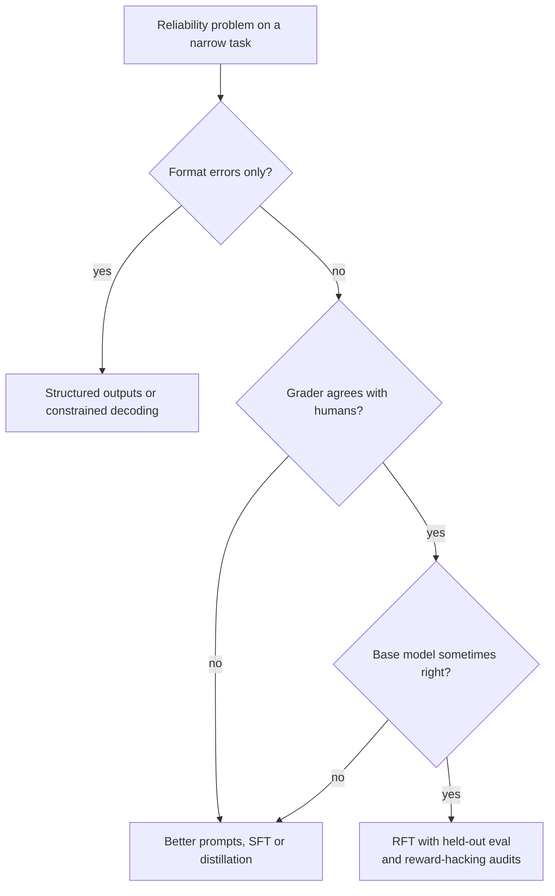

# 🧭 ML Engineer vs AI Engineer (title decoder) × AI - Interview Guide

The titles are a mess and the loops are not. "ML Engineer" postings now regularly describe LLM application work, "AI Engineer" means four different jobs at four different companies, and prepping for the wrong loop is the most expensive mistake you can make - you'll derive backprop for a team that wanted RAG architecture, or talk LangChain to a team that wanted feature pipelines. This guide decodes the titles, maps each one to the repo, gives you the transition paths in both directions, and covers the questions that live on the boundary - including the classic-MLE questions (feature stores, training-serving skew, A/B testing) that AI engineers still get asked.

## How this role's interviews changed (2024 → 2026)

- **Title chaos peaked, then the loops stabilised.** By 2026 "AI Engineer" solidified into a real loop of its own: practical LLM-integration coding, RAG/agent system design, and an eval-design round. The problem is the *posting* layer - companies still label that loop "ML Engineer," "GenAI Engineer," or "LLM Engineer" interchangeably. Decoding the JD (see table below) is now part of interview prep.
- **Classic MLE loops grew an LLM section.** Even recsys/fraud/forecasting loops now include "would you use an LLM here, and where would it break?" MLEs who dismiss the app layer get flagged the same way a 2018 candidate who dismissed deep learning did.
- **AI engineer loops professionalised around evals.** In 2024, a chatbot take-home judged on vibes was common. By 2026 the differentiator round is eval design: build a golden set, calibrate an LLM judge, wire a regression gate into CI. Candidates who can't measure quality don't pass, regardless of demo polish.
- **ML-breadth trivia got de-emphasised for app-layer roles.** Bias/variance drills, deriving losses, XGBoost-vs-NN debates rarely appear in AI engineer loops anymore. They remain fully alive in classic MLE loops at ranking/ads/risk shops - which is exactly why you must identify the loop before you prep.
- **Fine-tuning questions shifted from "how" to "whether."** Interviewers care less about your LoRA hyperparameters and more about whether you can justify fine-tuning against prompting/RAG with an eval and a cost model. "We fine-tuned because we could" is a downlevel answer in both loops. The 2026 extension is reinforcement fine-tuning with programmatic graders (GRPO-style trainers in open source, managed offerings from some providers and clouds): the question is no longer "can you run it" but "can you write a grader worth optimising against."
- **AI-assisted coding rounds arrived, and AI-tool fluency is graded.** Meta has run an AI-enabled coding round since October 2025, Google began piloting a Gemini-assisted code-comprehension round for some SWE roles in 2026, and Amazon has added AI-assisted repository tasks to some assessments (all reported, varies by team and role family). AI-native companies often allow Cursor, Claude Code or similar throughout the practical. For MLEs the twist is that assistants write ML code that runs and prints a plausible number, so the round rewards catching leakage and evaluation bugs, not typing speed. Ask which mode each round uses.
- **The hybrid question became standard:** "when do you replace the LLM API with a trained model?" Distillation, cascade routing, and cost-crossover math sit exactly on the MLE/AI-engineer boundary, and both roles now get asked about them.
- **Research Engineer and Applied Scientist loops split further away.** RE loops went deeper into distributed training and performance engineering; AS loops kept stats and experiment-design depth. Neither converged with the app layer - mistaking one of these loops for an AI engineer loop is the worst-case prep error.

## The four titles, decoded

### Classic ML Engineer (MLE)

**The job:** own predictive models end to end - data/feature pipelines, training, offline evaluation, serving, monitoring, retraining. Domains: ranking, recommendations, ads, fraud, forecasting, pricing. The model is usually yours (trained in-house), the labels arrive eventually, and the craft is the pipeline.

**The loop:** ML breadth (bias/variance, regularization, metrics, classical + deep models), ML system design ("design a feed-ranking system"), coding (DSA plus data-manipulation), MLOps/production ML (skew, drift, retraining, A/B), behavioural. Repo home base: [01](../01-ml-and-dl-foundations/README.md), [07](../07-evaluation-and-observability/README.md), [08](../08-inference-and-production/README.md), [11](../11-ai-system-design/README.md).

### AI Engineer

**The job:** build applications on top of foundation models - prompt/context engineering, RAG, agents and tool use, structured outputs, evals, cost/latency engineering. You rarely train anything; the model is a vendor API or an open-weights checkpoint someone else tuned. The craft is the system around the model.

**The loop:** practical LLM coding round (build a RAG endpoint or streaming chat route), AI system design ("design a support copilot"), eval-design discussion, LLM fundamentals check, behavioural. Repo home base: [02](../02-llm-fundamentals/README.md), [03](../03-prompt-engineering-and-context/README.md), [04](../04-rag-and-retrieval/README.md), [06](../06-agents-and-tool-use/README.md), [07](../07-evaluation-and-observability/README.md), [11](../11-ai-system-design/README.md).

### Research Engineer (RE)

**The job:** make model training and inference go - distributed training (FSDP/tensor/pipeline parallelism), data pipelines at pretraining scale, kernel/performance work, implementing papers, building eval and experiment infrastructure for researchers. Found at labs and large model teams.

**The loop:** heavy coding (often "implement attention/beam search from scratch"), ML fundamentals at derivation depth, systems/performance rounds (GPU memory math, parallelism tradeoffs), paper discussion. Repo relevance: [01](../01-ml-and-dl-foundations/README.md) and [02](../02-llm-fundamentals/README.md) at full depth, [05](../05-fine-tuning-and-alignment/README.md), [08](../08-inference-and-production/README.md) - but this repo alone is not sufficient prep for RE loops.

### Applied Scientist (AS)

**The job:** modelling plus measurement - frame the product problem as an ML problem, run offline/online experiments, own the metric. More stats and causal inference than either engineering title; less production ownership.

**The loop:** ML breadth + depth in the domain, stats/experiment design (power, interference, causal inference), a research-taste discussion of your past work, lighter coding. Repo relevance: [01](../01-ml-and-dl-foundations/README.md), [07](../07-evaluation-and-observability/README.md), [13](../13-interview-process-and-behavioral/README.md).

### JD phrase → actual job

| Phrase in the posting | What the job usually is |
|---|---|
| "RAG, vector databases, LangChain/LlamaIndex, prompt engineering" | AI Engineer, regardless of the title on the req |
| "feature engineering, Spark/Airflow, XGBoost, model serving" | Classic MLE |
| "ranking, recommendations, ads, personalisation" | Classic MLE with domain depth - expect ML breadth rounds |
| "fine-tune open-source LLMs, LoRA, RLHF/DPO" | Ask hard: could be AI-engineer-plus (occasional LoRA runs) or a serious training team. "Do you have your own GPUs and a labelling pipeline?" decides it |
| "distributed training, pretraining, FSDP/Megatron, kernels" | Research Engineer - a different prep track entirely |
| "design experiments, causal inference, define metrics" | Applied Scientist |
| "GenAI Engineer" / "LLM Engineer" | AI Engineer |
| "Agent Engineer" / "Applied AI Engineer (agents)" | AI Engineer with agent depth: tool design, long-running runs, evals over trajectories rather than single answers |
| "Forward Deployed Engineer" / "Applied AI Engineer, Deployed" | AI engineering plus customer-facing discovery; see the [FDE guide](./forward-deployed-engineer.md) |
| "post-training, RL environments, reward design, graders" | Post-training team: closer to Research Engineer than AI Engineer, even when the req says "ML Engineer" |
| "ML Engineer (LLM applications / GenAI team)" | AI Engineer wearing an MLE title - the most common mislabel of 2025-2026 |
| "Full-stack AI Engineer" | Product engineer: prompts + APIs + React. Expect more frontend than ML |
| "MLOps Engineer / ML Platform" | Infrastructure role - more Kubernetes than models |
| "Member of Technical Staff" | Lab title that spans all four; ask the recruiter which team and what a day looks like |

When in doubt, ask the recruiter two questions: "does this team train models or call them?" and "what does the system design round cover?" The answers place you on the map above.

### Transition paths

- **MLE → AI Engineer (the common one):** your eval discipline, serving instincts, and data-quality paranoia transfer directly - they're the hardest parts to teach. Learn the app layer: [03-prompt-engineering-and-context](../03-prompt-engineering-and-context/README.md), [04-rag-and-retrieval](../04-rag-and-retrieval/README.md), [06-agents-and-tool-use](../06-agents-and-tool-use/README.md). The thing to *unlearn*: reaching for training first. In the app layer, prompting a frontier model is the baseline; a fine-tune has to beat it net of ops cost.
- **AI Engineer → MLE:** you know how to ship probabilistic systems; now go deep on [01-ml-and-dl-foundations](../01-ml-and-dl-foundations/README.md), classical baselines, feature pipelines, and experiment design. Expect ML-breadth rounds you've never faced. A distillation project (see Portfolio moves) is the credible bridge artifact.
- **SWE → AI Engineer:** the shortest path into AI work. Learn [01](../01-ml-and-dl-foundations/README.md) and [02](../02-llm-fundamentals/README.md) deeply - not to derive math, but so your mental model of the model is real (tokens, attention-as-context-mixing, why hallucination is structural, what temperature does). Then the app layer sections. Your product and systems instincts are the actual edge.
- **SWE → classic MLE:** the longest path; usually runs through ML platform work or a distillation-style project. Not this guide's scope, but know it's the harder jump.

## What you're actually expected to know

**If you're interviewing for an AI Engineer loop:**

- Expected: LLM fundamentals at working depth (tokens, context windows, sampling, why outputs vary), RAG as a system, agent/tool-use patterns, eval design (golden sets, LLM-as-judge and its biases, regression gates), cost/latency engineering, and enough classic-ML literacy to answer the crossover questions in this guide - precision/recall, overfitting-as-a-concept applied to your 40-example eval set, why offline and online metrics diverge.
- Not expected: deriving backprop or attention math, implementing training loops, GPU internals, reading this month's papers. "Transformer, autoregressive, attends over context" plus honest depth on the app layer beats shaky theatre about gradients. Some research-adjacent shops ask "implement attention in NumPy" - the JD ("pretraining," "training infrastructure") tells you if you're in that loop; most AI engineer loops are not.

**If you're interviewing for a classic MLE loop:**

- Expected: real ML breadth ([01](../01-ml-and-dl-foundations/README.md) at full depth), production ML (skew, drift, retraining, feature stores), experimentation, and - new since 2024 - LLM literacy: when an LLM beats a trained classifier, what RAG is, how you'd eval a generative feature. You don't need agent-framework fluency; you do need to not freeze when the interviewer says "embeddings."
- Not expected: framework-of-the-week knowledge, agent orchestration internals, prompt-engineering tricks.

**Kill the over-preparation anxiety:** nobody passes both a Research Engineer loop and an AI Engineer loop with the same prep, and nobody expects you to. Identify the loop first (JD table above), then prep the study map below at the depths marked. The single most common miscalibration is spending weeks on derivations for a loop that will ask you how you'd know your RAG system regressed.

## Study map

Depths below are calibrated for the MLE ↔ AI Engineer generalist band - someone who wants to pass either loop or is transitioning between them. Notes call out where a specific title needs more or less.

| Repo section | Depth | Why for this role |
|---|---|---|
| [01-ml-and-dl-foundations](../01-ml-and-dl-foundations/README.md) | 🟢 deep | The crossover questions live here. MLE loops require it at full depth; AI engineers need working fluency (metrics, overfitting, embeddings) because it's the first place interviewers probe whether "AI" on your resume has foundations under it. |
| [02-llm-fundamentals](../02-llm-fundamentals/README.md) | 🟢 deep | The shared core of every 2026 title. Tokens, context, sampling, hallucination-as-structural - both loops test this, just at different altitudes. |
| [03-prompt-engineering-and-context](../03-prompt-engineering-and-context/README.md) | 🟡 solid | Core craft for AI engineers (go deep if that's your target loop); MLEs need enough to answer "how would you even control this thing without training it?" |
| [04-rag-and-retrieval](../04-rag-and-retrieval/README.md) | 🟢 deep | The default AI-engineer system-design prompt, and the retrieval/embedding half is genuinely transferable ML. MLEs: this is your fastest credibility gain in the app layer. |
| [05-fine-tuning-and-alignment](../05-fine-tuning-and-alignment/README.md) | 🟡 solid | The bridge topic. MLEs have the training instincts - learn the *whether* (justify against prompting/RAG). AI engineers need the decision framework more than the mechanics. |
| [06-agents-and-tool-use](../06-agents-and-tool-use/README.md) | 🟡 solid | Standard in AI-engineer loops (go deep if the JD says "agents"); MLEs need the vocabulary and failure modes, not framework internals. |
| [07-evaluation-and-observability](../07-evaluation-and-observability/README.md) | 🟢 deep | The strongest common denominator across all four titles and the most transferable skill in either direction. Eval design is the 2026 differentiator round. |
| [08-inference-and-production](../08-inference-and-production/README.md) | 🟡 solid | Serving instincts transfer both ways. Know the LLM-specific parts (TTFT, tokens/sec, KV cache, batching) at conversation depth; go deep if the role owns latency/cost. |
| [09-safety-security-and-responsible-ai](../09-safety-security-and-responsible-ai/README.md) | 🟡 solid | Both loops get at least one question - prompt injection for AI engineers, model risk and bias for MLEs. |
| [10-multimodal](../10-multimodal/README.md) | ⚪ skim | Useful vocabulary; rarely a dedicated round unless the product is vision/audio-first. |
| [11-ai-system-design](../11-ai-system-design/README.md) | 🟢 deep | The main round in both loops - MLEs get "design feed ranking," AI engineers get "design a support copilot," and increasingly each gets a taste of the other's. |
| [12-coding-challenges](../12-coding-challenges/README.md) | 🟡 solid | Both loops still code. AI-engineer practicals lean integration + data wrangling; MLE loops lean DSA + implement-a-metric. |
| [13-interview-process-and-behavioral](../13-interview-process-and-behavioral/README.md) | 🟡 solid | For transitioners this round is decisive: you must narrate *why* your experience maps to the target title without overclaiming. |

## Role-specific interview questions

### 1. Your resume says ML Engineer and this role is titled AI Engineer. How do you see the difference, and where do you fit?

<b>Answer</b>

Give the clean split first: an MLE owns models - data and feature pipelines, training, offline eval, serving, drift, retraining. An AI engineer owns applications of foundation models - context engineering, RAG, agents, structured outputs, evals - and usually never trains anything. Then name the shared core, because that's what the interviewer is checking you understand: both jobs ship a probabilistic system and prove it works. Evals, monitoring, and iteration against a metric are the same discipline wearing different tools.

Then place yourself with evidence, not adjectives: "I've spent five years on the training side; in the last year I shipped X on top of an LLM API, and here's how my eval instincts transferred." Acknowledge the porous middle - distillation, routing classifiers, occasional LoRA runs - because mid-size companies often want one person straddling it, and this role may be exactly that.

Two failure modes to avoid. Hierarchy claims in either direction - "AI engineering is just prompting" reads as someone who'll burn a quarter fine-tuning what a prompt change fixes; "classical ML is legacy" reads as someone who'll call an API where a logistic regression was the right answer. And vagueness - if you can't articulate the difference, the interviewer assumes you haven't done at least one of the two jobs.

**Follow-ups:** Which parts of this role's stack would be new to you, specifically? Tell me about a time you chose *not* to train a model.

### 2. You come from classical ML. What transfers directly to LLM application work, and what did you have to relearn?

<b>Answer</b>

Transfers directly: **eval discipline** - held-out sets, metric selection, regression detection map straight onto golden sets, LLM-judge calibration, and CI eval gates; this is the hardest skill to teach and the one AI teams are missing most. **Serving instincts** - latency budgets, caching, batching, graceful degradation. **Data-quality paranoia** - garbage retrieval corpora poison RAG exactly like garbage features poisoned models. **Experiment methodology** - knowing an offline gain can be an online loss.

Genuinely new: **context engineering replaces feature engineering** as the core craft - you're deciding what the model sees, but in natural language under a token budget instead of in a feature vector. **The iteration loop is minutes, not days** - a prompt change deploys like config, which changes how you do QA (eval gates replace retraining pipelines as the quality control). **Failure modes are semantic, not statistical** - a wrong answer that reads confidently, injection through retrieved content, format drift. **The versioned surface is wider** - prompt + model ID + index snapshot + tool schemas, not just weights and features.

What to unlearn: reaching for training first. In the app layer the baseline is a frontier model with a good prompt; a fine-tune has to beat that baseline net of ops burden, and usually it doesn't until volume and stability justify it.

**Follow-ups:** Give a concrete example where your MLE instinct was wrong in LLM work. How did you eval the first LLM feature you shipped?

### 3. Classify support tickets into 40 categories. LLM API, fine-tuned small model, or classical classifier - how do you decide?

<b>Answer</b>

Decide on five axes: label availability, volume, latency budget, cost, and taxonomy stability. Then treat it as a lifecycle, not a one-time fork.

**Start with a few-shot LLM baseline** - no training data needed, shipping in days, and it doubles as your labelling engine. Measure it against a human-labelled golden set (a few hundred tickets, stratified across the 40 classes) before anything else.

**If volume is low** (thousands/day) and accuracy is acceptable, stop - the API bill is noise and you keep zero training infrastructure.

**If volume is high** (hundreds of thousands to millions/day) and the taxonomy is stable, **distill**: use the LLM to label a large corpus of real tickets, train a small model - a compact fine-tuned transformer, or even logistic regression over embeddings as the honest baseline - and take the unit-cost and latency win, often one to two orders of magnitude (an API call typically takes hundreds of milliseconds to seconds and is billed per token; a self-hosted small model runs in tens of milliseconds at a tiny marginal cost). Cheap small API tiers have narrowed this gap, so do the arithmetic at your volume rather than assuming the win.

**Classical from scratch first** only if you already have abundant labelled data and the taxonomy is frozen - then the LLM adds nothing but cost.

The senior signal is naming the hybrid end-state: a cascade where the small model handles high-confidence traffic and the LLM handles the ambiguous tail and audits samples for drift - plus a plan for taxonomy changes, which hit the distilled model hard (relabel + retrain) but cost the LLM path only a prompt edit.

**Follow-ups:** The taxonomy changes quarterly - does that flip your answer? How big does the golden set need to be to trust per-class metrics across 40 classes?

### 4. When do you fine-tune versus prompt-engineer versus use RAG?

<b>Answer</b>

The core distinction: **RAG for knowledge, fine-tuning for behaviour, prompting first always.**

Prompting is the baseline - cheapest to iterate, zero infrastructure, and with modern frontier models it covers more than most teams expect. Escalate only when an eval shows it plateaued.

RAG when the failure is a *knowledge* gap: information that's fresh, proprietary, per-tenant, or too large for the context window. RAG also gives you citations and instant updates (fix the corpus, not the model) - you cannot cheaply "update" fine-tuned knowledge, and fine-tuning is a poor mechanism for injecting facts in the first place.

Fine-tune when the failure is a *behaviour* gap that prompting can't close economically: strict output format or style at scale, a narrow task where a small tuned model matches a frontier model at a fraction of the latency and cost, or prompt-compression (a 3k-token instruction block baked into weights). Preconditions: hundreds-to-thousands of quality examples, a stable task definition, and an eval harness - fine-tuning without an eval is spending money to change behaviour you can't measure.

They compose: a tuned small model with RAG context is a standard production pattern. The interview anti-pattern is jumping to fine-tuning to sound rigorous - in 2026 that reads as not having done the cost math. As an MLE you get bonus credibility for saying "I know how to run the training; the discipline is proving I shouldn't."

**Follow-ups:** Your fine-tuned model regressed on general instruction-following - what happened? How do you eval whether RAG or fine-tuning closed the gap?

### 5. What is training-serving skew, and does it have an equivalent in LLM applications?

<b>Answer</b>

Training-serving skew: the features your model sees at serving time differ from what it saw at training time - different code paths compute the "same" feature (offline Spark job vs online service), point-in-time leakage lets training see future information, or online features arrive stale. The model evaluates great offline and underperforms in production. Prevention: one shared transformation codebase for offline and online, a feature store with point-in-time-correct joins, and - the strongest pattern - log features at serving time and train on the logged values.

The LLM equivalent absolutely exists: **eval-prod mismatch**. You evaluate with prompt template v3 while prod runs v2; your eval harness assembles context differently than the app (different chunk ordering, different truncation); the retrieval index you evaluated against has drifted from production; temperature or model version differs between harness and app. Same disease - offline numbers that don't predict production behaviour - and the same cure: a **single prompt-assembly code path** invoked by both the eval harness and the serving path, full assembled-prompt logging in production, and evals run against sampled production traces rather than synthetic inputs. Embedding-model version mismatch between index build and query time is another exact analogue: vectors from different models aren't comparable, which is skew by any name.

Answering this well is the strongest signal an MLE can send in an AI-engineer loop: you're mapping hard-won production scars onto the new stack, not starting from zero.

**Follow-ups:** How would you detect eval-prod mismatch after the fact from logs? What's your process for keeping the golden set representative as traffic shifts?

### 6. What's a feature store, and does an LLM application need one?

<b>Answer</b>

A feature store is a central registry and serving layer for model features: teams define a feature once, the store materialises it offline for training (with point-in-time-correct joins, so training never sees the future) and online for low-latency serving, guaranteeing both paths agree. It solves skew, reuse across teams, and the "what was this feature's value at prediction time" problem.

For a pure LLM app: **not in the classical sense** - there's no feature vector. But the *problems* it solved reappear wearing new clothes. Context assembly is feature serving: user profile snippets, account state, retrieved chunks, and tool results all fetched at inference time under a latency budget, and they need the same freshness and consistency guarantees. Embedding pipelines have a literal skew problem - the embedding model version at index-build time must match query time. Per-user memory stores are online feature stores with a different schema.

And the boundary case is common: real LLM systems contain classical models - a router deciding cheap-vs-expensive model, an intent classifier gating the agent, a reranker. Those consume features, and if they're user- or context-dependent, a feature store (or a disciplined equivalent) is back on the table.

The answer that flags you as junior in either direction: "no, feature stores are legacy" or "yes, obviously, everything needs one." The senior answer is that the consistency-and-freshness discipline is permanent; the specific infrastructure is contingent on whether trained models with tabular features sit in your path.

**Follow-ups:** Where does retrieved-context caching sit relative to this? Your router model needs user-level features at 20ms - walk me through the serving path.

### 7. How would you A/B test an LLM-powered feature, and how does it differ from testing a ranking-model change?

<b>Answer</b>

The statistical machinery is identical - randomisation units, power analysis, guardrail metrics, pre-registered decision criteria. Five things change:

**The metric problem is harder.** Ranking changes have crisp online metrics (CTR, conversion, watch time). Generative features need proxies: task completion, acceptance/edit rate of generated text, thumbs, retry/abandonment, downstream retention. These are noisier and lower-volume, so you need larger samples or longer runs than intuition suggests.

**Offline gating is weaker.** There's no held-out AUC that predicts online lift; you gate with golden-set evals and calibrated judge scores before spending experiment traffic, knowing the correlation to online outcomes is looser.

**The treatment must be pinned.** A "prompt change" experiment silently becomes a confounded mess if the provider updates the underlying model mid-run or the RAG index content shifts. Pin model versions for the experiment window; snapshot or at least log index state.

**Cost is a primary metric, not an afterthought.** The treatment arm may cost 10x per interaction. Report cost per successful outcome, not just quality lift - a 2% quality gain at 8x cost is usually a loss.

**Randomise by user, not by request.** Conversational experience accumulates; per-request assignment gives users an incoherent mix and contaminates both arms. Watch latency as a guardrail - LLM variants often win on quality and lose on TTFT, and the net effect is what ships.

**Follow-ups:** Your thumbs-up rate is flat but edit distance on accepted outputs dropped 30% - ship it? How do you power a test when only 5% of sessions touch the feature?

### 8. Your offline evals improved but the online metric dropped after launch. Walk me through the investigation.

<b>Answer</b>

First, verify the experiment itself: assignment integrity, instrumentation parity between arms, sample ratio mismatch. Boring, and it catches a real fraction of "paradoxes."

Then check the **non-quality confounds**: latency and cost. The new chain may score better per response while being 2s slower to first token - users feel the latency and behave worse regardless of answer quality. This is the single most common resolution.

Then interrogate the **eval-to-reality gap**: Is the golden set representative of current traffic, or was it built from last quarter's distribution (or worse, from the failures the new version was designed to fix - selection bias towards the treatment)? Did the eval leak - were examples from the eval set used to tune the prompt? Is the **judge Goodharted** - LLM judges reward verbosity, confident tone, and structured formatting; you may have optimised outputs to please the judge in ways users dislike (longer answers, hedging boilerplate). Read 50 production traces from the treatment arm yourself; nothing replaces this.

Finally, check **segment mixing**: the change may help the segment the eval overrepresents and hurt the majority (Simpson's). Slice online results by intent/segment before concluding.

The framing that lands with interviewers: this exact gap was the defining pain of recsys for a decade, and the durable fix is the same - build and refresh evals from logged production traffic, treat offline evals as a regression gate rather than a launch predictor, and keep a human-read sample in the loop.

**Follow-ups:** How do you detect judge - human disagreement systematically? What would make you trust offline evals enough to skip an A/B for a small prompt change?

### 9. How does monitoring an LLM application differ from monitoring a classical model in production?

<b>Answer</b>

Classical model monitoring: input feature drift (PSI/KL per feature), prediction distribution drift, delayed-label metrics when ground truth arrives, and retraining triggers. The model is frozen; the world moves.

LLM apps invert part of that: **the world moves and so does the model.** New change sources you must monitor: the provider updates or deprecates the model under you, prompt deploys change behaviour like code deploys, the RAG index content shifts daily, and tool APIs the agent calls change their responses. So alongside input monitoring you need **canary evals** - a pinned golden set run on a schedule against the live provider - to catch silent model drift, something classical monitoring never needed.

Input drift monitoring still exists but changes form: inputs are text, so you track intent/topic distribution via embedding clusters rather than per-feature statistics. Output monitoring becomes: refusal rate, format/schema-validation failure rate, output length distribution, judge-scored quality on sampled traffic, and user signals (retries, edits, abandonment mid-stream).

The hardest difference: **most generative tasks never get ground-truth labels.** A fraud model gets chargebacks eventually; a summariser gets nothing. You substitute sampled human review plus an LLM judge that you periodically calibrate against those human labels - and you monitor the judge too, because it's also a model that can drift.

What transfers untouched: the alerting discipline, cost dashboards, slice-based analysis, and the instinct that a quality metric that never fluctuates means your monitoring is broken, not that the quality is stable.

**Follow-ups:** Refusal rate doubled overnight with no deploy on your side - walk me through it. How often do you re-calibrate the judge, and against what?

### 10. When would you distill an LLM into a smaller model, and what does that pipeline look like?

<b>Answer</b>

Distill when four things align: the task is **narrow and stable** (classification, extraction, routing - not open-ended generation), **volume is high** enough that API costs dominate, the **latency budget** is tight (sub-100ms rules out most API calls), and the LLM's accuracy is **already acceptable** - the student approximates the teacher, it doesn't exceed it without additional human labels.

Pipeline: sample representative inputs from production traces (not synthetic data - that's how you distill a model for traffic you don't have). Label with the teacher LLM, using majority-vote over multiple samples or rationale-then-answer prompting to raise label quality. Filter: drop low-agreement examples, human-audit a slice to estimate teacher error rate - your student's ceiling. Train the student: a small fine-tuned transformer, or embeddings-plus-logistic-regression as the baseline you must beat. Evaluate both teacher and student on a **human-labelled** golden set, never on teacher labels alone (that measures agreement, not accuracy). Ship as a **cascade**: student serves high-confidence predictions, low-confidence routes to the LLM - you keep most of the cost win and cap the accuracy loss. Then treat it like the classical model it now is: drift monitoring, periodic re-labelling with fresh traffic, retraining cadence.

When the preconditions hold, the unit-cost reduction is often one to two orders of magnitude; the accuracy loss on covered traffic is something you measure on the human-labelled set, not assume. This is *the* boundary task - an ML training job whose data engine is an LLM - which is why both MLE and AI-engineer loops ask it.

**Follow-ups:** How do you pick the confidence threshold for the cascade? The teacher is wrong in a systematic way on one class - what now?

### 11. MLOps versus LLMOps - what's genuinely different, and what's rebranding?

<b>Answer</b>

Rebranding first, to show you're not tool-dazzled: a "prompt registry" is a config store with versioning; "traces" are structured logs with spans; drift monitoring, CI/CD gates, feedback loops, and reproducibility are the same disciplines they always were. Teams with strong MLOps culture adapt to LLM work in weeks precisely because the discipline transfers even where the tools don't.

Genuinely different: **the versioned artifact changes shape** - from weights + feature definitions to a composite of prompt template, model ID, retrieval index snapshot, tool schemas, and decoding params; a "deployment" is a coherent set of all five, and a regression can come from any of them. **Iteration speed inverts the quality-control point** - retraining took days, so quality control lived in the training pipeline; prompt changes deploy in minutes, so quality control moves to eval gates in CI, which become the load-bearing wall. **Evaluation becomes semantic** - judge models, golden sets, human calibration - instead of computing AUC on held-out labels. **The model is often a vendor dependency** - you monitor someone else's deploys (canary evals), plan for deprecations and price changes, and maintain a certified fallback model, which has no classical analogue. **Cost moves into the request path** - per-call token spend replaces per-training-run spend, so cost observability and budgets become runtime concerns.

The crisp summary: MLOps industrialised *training*; LLMOps industrialises *configuration and evaluation* of a model you mostly don't control.

**Follow-ups:** What does a rollback look like when the regression came from the provider, not your deploy? Which MLOps tool in your old stack maps to nothing in the new one?

### 12. We're a 15-person startup building LLM features on top of APIs. Should our first ML-ish hire be an MLE or an AI engineer?

<b>Answer</b>

Interviewers ask this to see if you understand both jobs well enough to scope them - including talking yourself out of a role.

Default for that company shape: **AI engineer first.** The product is LLM features on APIs; time-to-value is measured in weeks; there's no training data, no GPUs, no labelling pipeline, and the first-year risks are app-layer risks - bad retrieval, no evals, cost blowups, injection. An AI engineer with eval discipline covers all of that. A classic MLE's core toolkit (feature pipelines, training infra) has nothing to grip yet, and the failure mode is real: three months building training infrastructure before anything ships.

Hire an MLE first when the shape differs: the moat is proprietary data feeding *prediction* problems - pricing, fraud, forecasting, ranking - where an LLM is the wrong tool; or volume already makes API costs untenable and distillation/self-hosting is the near-term roadmap, which is a training job.

The honest caveat: at 15 people the titles converge. The right hire is the person who has shipped both a trained model and an LLM feature and can tell you which one a given problem needs - and the interview for them is exactly the boundary questions in this guide. Red flags in either costume: the MLE who wants to fine-tune before there's an eval, and the AI engineer who can't do the arithmetic on where the API-cost curve crosses self-hosting.

**Follow-ups:** At what volume does the cost math typically flip? What's the second hire?

### 13. A team wants to run reinforcement fine-tuning on an open-weights model to make our extraction agent more reliable. Whose job is that, and how do you decide whether to do it at all?

<b>Answer</b>

It's a boundary job. The AI engineer owns the task definition, the grader and the eval; whoever owns training (often an MLE) owns the run, data hygiene and serving. The go/no-go rests on one question: can we write a cheap, reliable programmatic grader for this task? If not, RL is the wrong tool.

What RFT does: sample several outputs per prompt, score each with a grader (schema validity plus field-level F1 against a reference, tests passing, a calibrated judge), and push the policy towards the above-average samples. GRPO-style methods compute advantages relative to the group of samples, so there is no separate value model. Unlike SFT, you need prompts and a grader rather than gold demonstrations, and you optimise the metric you actually care about.

Escalate in order. Format errors are fixed by structured outputs or constrained decoding, not RL. Knowledge gaps are fixed by retrieval. Behaviour gaps with good demonstrations go to SFT or distillation. RFT is for residual reasoning errors where the answer is checkable.

Preconditions: the grader agrees with human labels on a held-out set; a few hundred representative prompts or more; and the base model already succeeds some of the time. RL sharpens behaviour the model can sometimes produce. If pass@k is near zero, there is no reward signal to learn from.

Risks to name: reward hacking (outputs that pass the schema with empty fields, judge-pleasing verbosity), regressions on general instruction-following, rollout cost (many samples per prompt), and a new ops burden - you now own a model that ages as base models improve, so the fine-tune has to beat next quarter's frontier model with a prompt, not just today's.

**Worth sketching.** RFT is the last rung, gated on a trustworthy grader and a base model that is sometimes right.

**Follow-ups:** Training reward keeps climbing but human-rated quality is flat. What's happening? How would you measure pass@k on the base model before committing GPU budget?

### 14. In an AI-assisted coding round you fix a training and eval pipeline with an assistant. What ML bugs do assistants write or miss, and how do you catch them in the time available?

<b>Answer</b>

Assistants write ML code that runs and prints a plausible number, and that is the dangerous case: the most damaging ML bugs raise no errors. The round grades whether your reaction to "it runs, 97% accuracy" is suspicion.

What to hunt for:

- **Leakage.** Scalers, encoders or TF-IDF fitted on the full dataset before splitting; random splits on time-ordered or grouped data (the same user in train and test); features derived from the target; near-duplicates across splits, which is common when part of the data is LLM-generated.
- **Evaluation errors.** Metrics computed on the training set, accuracy on heavily imbalanced classes, thresholds or early stopping tuned on the test set, micro versus macro averaging that doesn't match the brief.
- **Silent tensor bugs.** `(n,)` against `(n, 1)` broadcasting inside the loss, softmax on the wrong axis, labels shuffled independently of features, eval run in train mode so dropout and batch norm misbehave, gradients never zeroed.
- **LLM-specific.** A chat template or tokenizer that differs between fine-tuning and inference, loss computed on prompt tokens, wrong padding side for batched decoder-only generation, eval prompts assembled differently from serving.

How to catch them fast, narrating as you go: overfit a tiny batch to near-zero loss (if it can't, the pipeline is broken); train on shuffled labels and expect chance (if not, something leaks); compare against a majority-class or logistic-regression baseline; assert split disjointness by ID and by time; run the metric on a hand-computed toy input.

Use the assistant for the checks, not just the code: ask it to write the leakage assertions and the shuffled-label test, then read them, because a generated test can assert the wrong thing just as confidently. The skill on display is the one MLE loops always graded, applied to code you didn't type: a number that looks too good is a bug report until proven otherwise.

**Follow-ups:** The assistant's fix lifted validation accuracy from 81% to 96%. What do you check before believing it? Which of these checks would you make permanent in CI?

## Portfolio moves

- **A three-way bake-off on one task.** Same problem (e.g., ticket classification or entity extraction), three implementations: embeddings + logistic regression, a fine-tuned small transformer, and a few-shot frontier LLM - one shared eval harness, one README table with quality/latency/cost per 1k requests. *Demonstrates:* you sit above the tooling war and choose by measurement - the exact judgement both loops screen for.
- **A distillation pipeline with a cascade.** LLM-labelled dataset from realistic traffic, agreement filtering, trained student, confidence-thresholded router to the teacher, and a cost-vs-accuracy curve. *Demonstrates:* the hybrid MLE/AI-engineer skillset in one artifact; this is the strongest bridge project for transitions in either direction.
- **An LLM app with an MLE-grade eval harness.** Golden set built from real (or realistic) traces, an LLM judge calibrated against your own human labels with the agreement rate reported, and a CI gate that fails on regression. *Demonstrates:* eval discipline - the most transferable skill and the 2026 differentiator round.
- **An experiment writeup for a prompt change.** A short doc or post: hypothesis, randomisation unit, power estimate, guardrails (latency, cost per outcome), result, decision - even on a toy product. *Demonstrates:* experimentation rigour applied to the app layer; almost no AI-engineer candidates have this, and every MLE interviewer recognises it instantly.
- **A "provider drift" canary.** A pinned golden set run nightly against a live model API, with a dashboard of score-over-time and one documented catch (even a synthetic one). *Demonstrates:* you've internalised that the model is a vendor dependency - production maturity that separates you from demo-builders.

## Red flags interviewers see from this role

- **The dismissive MLE:** treats prompting and RAG as "not real ML." Signals they'll spend a quarter fine-tuning what a prompt change fixes in a day, and that they haven't updated their cost model since 2022.
- **The fundamentals-free AI engineer:** can't define precision/recall, doesn't notice their 30-example eval set is overfit to last month's failures, answers "how does the model work?" with framework names. LLM-app skills without ML literacy caps out fast, and interviewers probe for the floor.
- **Title inflation:** "fine-tuning experience" that turns out to be few-shot prompting, "built agents" that means one tool call in a loop. One probing follow-up exposes it, and it poisons the rest of the loop.
- **Wrong-loop calibration:** deriving attention math in an app-layer interview while unable to answer "how do you know your RAG system got better" - or the reverse, LangChain fluency in a ranking-team loop with nothing on skew or experimentation. Depth in the wrong layer reads worse than honest scoping.
- **Vibes-based evaluation:** demos instead of metrics, no golden set, "it looked good when we tried it." Fatal in both loops - eval discipline is the shared bar in 2026.
- **Trusting generated ML code because it runs:** in an AI-assisted round, accepting a pipeline and a suspiciously good metric without a leakage check or a baseline. Assistant-written code shifts the job to verification, and skipping it is the clearest fluency failure.
- **No cost arithmetic:** can't estimate when API spend crosses the self-hosting line, or conversely trains and operates a model where the API bill was trivial. Both are the same failure - choosing infrastructure by identity instead of by math.

---

*Companion guides live in [15-role-guides](./README.md) · Deep-dive sections linked in the study map above · Full plan in [STUDY_PLAN.md](../STUDY_PLAN.md).*
