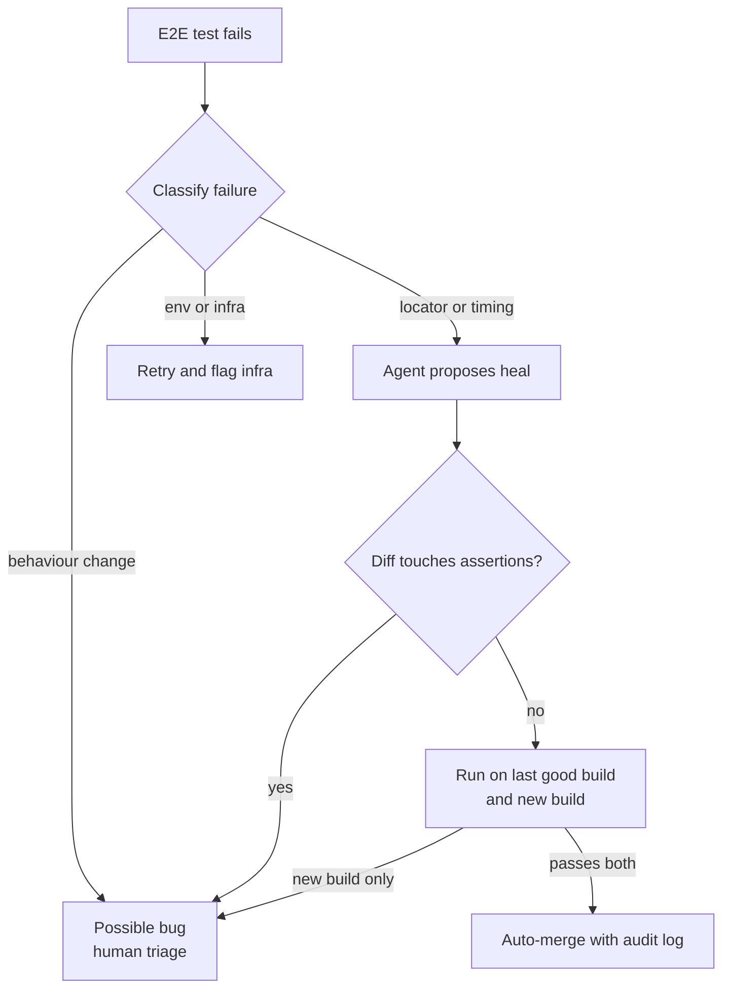

# 🧪 QA / SDET Engineer × AI - Interview Guide

No role got transformed harder by AI than this one. Your entire discipline was built on a premise - same input, same output, assert equality - that LLM features violate by design. Interviewers in 2026 are screening for the engineer who has rebuilt their testing instincts around distributions instead of exact values: eval harnesses as test suites, judges that need their own calibration, red-team suites as security regression tests, and CI gates that block a one-line prompt change the way they used to block a failing unit test. This guide maps that loop, calibrates depth, and gives you the questions QA/SDET candidates actually get at the AI boundary.

## How this role's interviews changed (2024 → 2026)

- **"How would you test this?" now has a non-deterministic subject.** The classic design-a-test-plan round is still the spine of the loop, but the feature under test is a support chatbot, a summariser, or an agent - and interviewers immediately probe whether you reach for exact-match assertions (fail) or graded evals, property checks, and statistical thresholds (pass).
- **Eval harness design is the new test-framework question.** Where 2024 loops asked you to architect a Selenium/Playwright framework, 2026 loops ask you to architect an eval pipeline: golden datasets, scoring functions, LLM-as-judge with calibration, dashboards, and regression gates wired into CI. Same skill shape - test infrastructure - new substrate.
- **Adversarial testing became a regular topic, sometimes its own round, at AI-product companies.** Prompt injection suites, jailbreak regression packs, and PII-leak probes are treated as QA deliverables. Security-adjacent testing moved from "nice to have" to a direct interview topic for this role.
- **A new practical exercise: "here's a prompt change / model upgrade - ship or block?"** You're given eval results with noise in them and asked to make a release call. They're testing whether you understand variance, sample size, and the difference between a regression and a re-roll.
- **AI-assisted coding rounds arrived, and AI-tool fluency is graded.** Meta began piloting an AI-enabled coding round in October 2025 (about 60 minutes in CoderPad with a built-in assistant, replacing one of the onsite coding rounds) and expanded it through 2026, and other large companies have run similar pilots or added AI-assisted tasks to online assessments (reported, varies by team). For SDET candidates the assisted exercise usually turns into a testing exercise: generate tests for an unfamiliar module with the assistant, then defend which generated tests you kept, which you rejected, and where the assistant guessed expected values instead of deriving them from the spec. Refusing to use the tools reads as badly as trusting them blindly. Rules differ by company and round, so ask the recruiter and practise both modes.
- **Agentic test tooling is now a design question.** Browser-driving agents (Playwright's planner, generator and healer agents, MCP-connected browser control) mean interviewers ask where you would let an agent author or repair end-to-end tests, and what stops a "self-healing" suite from quietly absorbing real regressions.
- **Testing AI-generated application code is a new mandate.** Teams shipping agent-written code ask how QA changes when the code author is a model: coverage as a gate rather than a vanity metric, mutation testing, and review heuristics for plausible-but-wrong code.
- **De-emphasised:** encyclopedic Selenium locator trivia, manual test-case-document authoring, and pure UI-automation framework questions. They still appear, but they're screen-level table stakes, not the differentiator. Nobody asks you to derive ML math - that anxiety is misplaced.

## What you're actually expected to know

**Expected - and probed hard:**

- Eval fundamentals as *your* domain: golden/reference datasets, graded vs binary scoring, pass@k, rubric design, LLM-as-judge and how to calibrate it against human labels, offline evals vs online monitoring, A/B-testing quality changes.
- Non-determinism literacy: temperature and sampling, why temperature 0 still isn't bit-determinism, how to size samples so a "regression" isn't noise, flake triage in a world where some flake is intrinsic.
- Assertion strategies when equality is impossible: property-based checks, schema/contract validation on model output, semantic similarity thresholds, invariants ("never mentions a competitor," "always cites a source").
- Adversarial mindset applied to prompts: injection taxonomy (direct, indirect via retrieved content, tool-call hijacking), building an attack regression suite, why filtering input is insufficient.
- CI/CD integration: what runs on every PR vs nightly, cost/latency budgets for eval runs, gating rules (block vs warn), prompt/model version pinning in test environments.
- Test data engineering: synthetic data generation with LLMs, contamination between generation and evaluation, PII-safe mining of production logs into eval cases.
- Enough RAG and agent mechanics to place test boundaries: retrieval metrics (recall@k, MRR) separately from generation faithfulness; tool mocking and trajectory evaluation for agents.

**Not expected - stop over-preparing:**

- Deriving backprop, attention math, or loss functions. "Autoregressive transformer, samples one token at a time from a probability distribution" covers 95% of the theory this role needs - the *sampling* part is the part that matters to you.
- Training or fine-tuning models. Know that fine-tunes need eval gates before deployment (that's your job); nobody expects you to run one.
- GPU/inference internals. Know TTFT and tokens/sec exist because you'll test latency SLOs; vLLM internals are someone else's interview.
- Building embedding models or vector databases. You test retrieval quality; you don't implement HNSW.

The bar is: can you make quality *measurable* for a component that never gives the same answer twice, and wire that measurement into a pipeline that blocks bad releases. That is a testing problem, and you have more transferable skill here than you think - flake triage, regression suites, risk-based coverage, and CI gating all carry over almost directly. The vocabulary is new; the discipline isn't.

## Study map

| Repo section | Depth | Why for this role |
|---|---|---|
| [01-ml-and-dl-foundations](../01-ml-and-dl-foundations/README.md) | ⚪ skim | Precision/recall/F1 and train/test-split vocabulary - eval metrics reuse it directly. Skip the math derivations entirely. |
| [02-llm-fundamentals](../02-llm-fundamentals/README.md) | ⚪ skim | Tokens, temperature, sampling, context windows - just enough to explain *why* outputs vary and what temperature 0 does and doesn't buy you. |
| [03-prompt-engineering-and-context](../03-prompt-engineering-and-context/README.md) | 🟡 solid | Prompts are the artifact you regression-test. Prompt versioning, templates-as-config, and context assembly define your test surface and your diffs. |
| [04-rag-and-retrieval](../04-rag-and-retrieval/README.md) | 🟡 solid | You'll be asked to test a RAG feature. Component-wise metrics (retrieval recall vs generation faithfulness) are the expected answer shape. |
| [05-fine-tuning-and-alignment](../05-fine-tuning-and-alignment/README.md) | ⚪ skim | Know that a fine-tuned model is a release candidate needing eval gates and rollback; skip training mechanics. |
| [06-agents-and-tool-use](../06-agents-and-tool-use/README.md) | 🟡 solid | Agents are the hardest thing you'll test: tool mocking, trajectory evals, sandboxing side effects, step budgets. Interviewers go here to find your ceiling. |
| [07-evaluation-and-observability](../07-evaluation-and-observability/README.md) | 🟢 deep | This is your new job description. Golden sets, LLM-as-judge, regression detection, online monitoring - expect the majority of your loop here. |
| [08-inference-and-production](../08-inference-and-production/README.md) | ⚪ skim | Enough to test latency/cost SLOs (TTFT, tokens/sec, rate limits) and understand why eval runs cost money. Internals are out of scope. |
| [09-safety-security-and-responsible-ai](../09-safety-security-and-responsible-ai/README.md) | 🟢 deep | Adversarial testing is QA territory now. Injection taxonomy, jailbreak regression suites, PII probes, and safety gates are asked directly. |
| [10-multimodal](../10-multimodal/README.md) | ⚪ skim | Awareness that image/audio features need their own eval sets; rarely a dedicated question unless the product is multimodal. |
| [11-ai-system-design](../11-ai-system-design/README.md) | 🟡 solid | Senior loops include "design the quality/eval layer for this system" - practise bolting your harness onto the standard chatbot and RAG designs. |
| [12-coding-challenges](../12-coding-challenges/README.md) | 🟡 solid | Practical rounds: build a small eval runner, write property-based assertions, script a judge. Python fluency assumed, and an AI assistant is increasingly allowed, which raises the bar on how much you finish and how well you verify it. |
| [13-interview-process-and-behavioral](../13-interview-process-and-behavioral/README.md) | 🟡 solid | Have stories ready: a quality regression you caught (or missed), a flaky-vs-real triage call, how you introduced evals to a sceptical team, and a concrete account of how you use AI tools in testing and check their output. |

## Role-specific interview questions

### 1. Our chatbot gives a different answer every time. How do you test something non-deterministic?

<details><summary><b>Answer</b></summary>

You stop testing outputs and start testing *distributions and properties*. Three layers:

**Deterministic shell first.** Most of the system around the model is still deterministic - retrieval, prompt assembly, output parsing, tool dispatch. Unit-test all of it classically with the model mocked. A large share of "AI bugs" are plain bugs in this shell, and those tests are fast and exact.

**Properties, not equality, on model output.** For a single response, assert invariants that must hold for *any* acceptable answer: valid JSON against a schema, response language matches the query, no competitor names, cites at least one retrieved source, length within bounds, refuses when it should. These are cheap, binary, and CI-friendly.

**Statistical evals for quality.** Run a golden set (say 200-500 curated inputs) and score outputs with graded metrics - judge scores, semantic similarity, task success. Because outputs vary, treat scores as samples: run N trials per case where affordable, compare against a baseline with a threshold that accounts for variance, and gate on the aggregate ("pass rate ≥ 92%, no critical-tagged case fails"), never on individual cases matching a string.

The framing interviewers want: a single test run can't fail on "the wording changed"; it fails on "a property was violated" or "the score distribution shifted beyond noise." That's the whole mental move from QA-2024 to QA-2026.

**Follow-ups:** How many samples do you need before calling a 3-point pass-rate drop a regression? Which of these layers runs on every PR vs nightly?

</details>

### 2. Design the eval harness for an LLM feature we're shipping - treat it like you'd design a test framework.

<details><summary><b>Answer</b></summary>

Same anatomy as a test framework: cases, runner, assertions, reporting - plus two new organs: a judge and a baseline store.

- **Dataset:** versioned golden set in the repo (JSONL: input, context, expected properties, reference answer where one exists, tags like `critical`/`edge`/`injection`). Sources: hand-written seed cases, mined production failures, synthetic expansions. Treat it like code - reviewed PRs, no silent edits, because changing the dataset changes what "passing" means.
- **Runner:** executes cases against a pinned configuration (model ID, prompt version, temperature, retrieval index snapshot). Parallelised, cached (don't re-pay for unchanged case+config pairs), cost- and time-budgeted.
- **Scorers, layered by cost:** (1) code checks - schema, regex, invariants; (2) cheap similarity metrics; (3) LLM-as-judge with a rubric for the subjective dimensions (helpfulness, faithfulness). Every scorer returns a score plus a reason string for debuggability.
- **Baseline + regression logic:** every main-branch run stores per-case scores. A candidate run diffs against baseline; the gate is statistical (aggregate threshold, plus zero tolerance on `critical` tags), and the report shows *which cases* moved, with before/after outputs.
- **Reporting:** per-tag breakdown, cost/latency per case, judge disagreement flags, trend over time.

The differentiating detail: separate *config versions* (prompt vN, model M) from *dataset versions* so you can answer "did the product regress or did the test change?" - the eval-world equivalent of not mixing test changes with code changes in one commit.

**Follow-ups:** Where does this live - pytest plugin, standalone service, vendor tool - and why? How do you keep the golden set from going stale as the product evolves?

</details>

### 3. Exact-match assertions are useless here. What do you actually assert on an LLM response?

<details><summary><b>Answer</b></summary>

A ladder, cheapest and most trustworthy first:

1. **Structural contracts:** parses as JSON, validates against a Pydantic schema, enums in range, required fields present. Deterministic, zero cost, catches a shocking fraction of real failures.
2. **Deterministic content properties:** must-contain / must-not-contain (order ID echoed correctly, no "as an AI language model," no competitor names, no email addresses), length bounds, language detection, all cited URLs actually appear in the retrieved context.
3. **Behavioural invariants:** the response *refuses* on the disallowed-topic cases; asks a clarifying question when the input is ambiguous-tagged; never invokes a tool not in the allowlist.
4. **Reference-based metrics** where a reference exists: semantic similarity to a gold answer above a tuned threshold - useful, but thresholds are fragile; treat as signal, not verdict.
5. **Rubric-graded judgement** for the genuinely subjective residue: faithfulness to sources, helpfulness, tone.

```python
def test_refund_response_properties(response, retrieved_docs):
    data = RefundReply.model_validate_json(response)   # 1. contract
    assert data.order_id == case.order_id              # 2. echo check
    assert not CONTAINS_PII.search(data.message)       # 2. invariant
    assert all(c in doc_ids(retrieved_docs) for c in data.citations)  # grounding
```

The senior signal is knowing that layers 1-3 belong in blocking CI (binary, fast, no judge required) while 4-5 feed the statistical gate. Candidates who jump straight to "use an LLM judge for everything" are outsourcing the easy 70% to the most expensive, least reliable scorer.

**Follow-ups:** How do you pick and maintain the similarity threshold in layer 4? Property passes but the answer is still wrong - what catches that?

</details>

### 4. You're using LLM-as-judge. Why should I trust the judge? Walk me through calibrating it.

<details><summary><b>Answer</b></summary>

You shouldn't trust it until it's measured - a judge is a model making judgements, so it gets the same treatment as any measurement instrument: validate against ground truth, quantify error, monitor drift.

Calibration process: collect a sample of real outputs (100-300), have humans label them with the *same rubric* the judge will use, then measure judge - human agreement (Cohen's kappa for categorical verdicts, correlation for scalar scores). You're looking not just at overall agreement but at the *disagreement structure* - a judge that's lenient on hallucinations but strict on tone is worse than its average agreement suggests. Iterate on the judge prompt until agreement is acceptable, and re-run this whenever the judge model or prompt changes.

Known judge failure modes to name unprompted: **position bias** in pairwise comparisons (mitigate by scoring both orderings), **verbosity bias** (longer answers score higher - control for length in the rubric), **self-preference** (judging its own family's outputs favourably - use a different model family or force rubric-anchored scoring), and score compression (everything gets 7/10 - use discrete labelled categories instead of 1-10 scales, and require the judge to cite evidence before the verdict).

Operationally: binary or small-enum verdicts over scalar scores, one rubric dimension per judge call rather than one omnibus judgement, a pinned judge model at temperature 0 where it allows one, and a periodic human audit of a random slice plus every judge-flagged failure. The judge is a scaling lever for human review, not a replacement for it.

**Follow-ups:** Judge agreement with humans is 90% - is that good enough to block releases on? How do you version the judge itself so a judge-prompt change doesn't masquerade as a product regression?

</details>

### 5. A one-line system-prompt change is in a PR. What runs before it merges, and what blocks it?

<details><summary><b>Answer</b></summary>

Treat a prompt diff exactly like a code diff to a critical module - it can change behaviour globally, so it gets a regression gate, not a vibe check.

On the PR: the fast deterministic layer (schema/property checks over a smoke subset, ~20-50 cases, minutes and cents) plus the *targeted* eval slice - cases tagged to the behaviours that prompt section touches, and the full `critical` and `injection` tags regardless of what changed, because prompt edits have non-local effects. That's the blocking gate: any critical-tag failure blocks; aggregate pass-rate drop beyond the noise threshold blocks; everything else warns.

On merge to main (or nightly): the full golden set with N samples per case, judge-graded dimensions, updated baseline, trend dashboards. Too slow and expensive for every PR iteration, cheap enough to never skip on main.

Mechanics interviewers listen for:

- **Prompts live in version control**, not a dashboard textbox - no gate is possible otherwise. Prompt version is stamped into every eval result and every production trace.
- **Pin everything else:** model ID, temperature, retrieval snapshot. Otherwise the diff measures provider drift, not the PR.
- **Comparison is against the baseline run**, per-case, with before/after outputs in the PR comment - reviewers should read behaviour diffs like they read code diffs.
- **A rollback path:** prompt versions deploy like code versions, so reverting is one commit, not archaeology.

The anti-pattern to call out: teams that ship prompt edits straight to production because "it's just text." That's editing business logic without tests.

**Follow-ups:** The change improves the targeted behaviour but drops an unrelated tag by 4% - ship it? Who owns fixing that, the prompt author or QA?

</details>

### 6. We set temperature to 0. The outputs are deterministic now, right?

<details><summary><b>Answer</b></summary>

No - and this question is a shibboleth for hands-on experience. Temperature 0 means greedy decoding: always pick the argmax token. But the numbers feeding the argmax aren't stable across runs. Floating-point addition is non-associative, and most serving kernels are not batch-invariant: the reduction order changes with how many other requests share your batch, which depends on server load. Mixture-of-experts routing with capacity limits adds another batch-dependent path. The result is tiny logit differences between otherwise identical requests. When two top tokens are near-tied, a 1e-6 wobble flips the pick - and one flipped token changes every token after it, because generation is autoregressive. Add provider-side realities - model snapshot updates, heterogeneous hardware, load-dependent inference paths - and identical requests to a hosted API can and do return different text at temperature 0.

Consequences for test strategy:

- **Never build assertions that assume replay-stability** against a hosted model. Property checks and statistical gates are still required at temperature 0.
- **Flake triage changes:** an intermittent eval failure may be (a) a real borderline behaviour worth a test case, (b) infra flake in your harness, or (c) intrinsic sampling wobble. Distinguish by re-running the *same* case k times: 1/20 failures on a near-tie is wobble; 8/20 is a behaviour problem.
- **For true determinism** you need self-hosted inference with fixed seeds and batch-invariant, deterministic kernels (some open serving stacks now offer a batch-invariant mode at a throughput cost) - achievable, costly, and mostly useful for debugging and replay, not as an assumption in CI.
- Temperature 0 is still often *right* for structured tasks - lower variance is real; just don't confuse lower variance with determinism. And many reasoning models don't let you set temperature at all, so a test strategy that depends on it doesn't survive the next model upgrade.

**Follow-ups:** How does this change your definition of "flaky test"? Would you cache model outputs in CI, and what does that trade away?

</details>

### 7. Where does your golden dataset come from, and how do you stop it rotting?

<details><summary><b>Answer</b></summary>

Three sources, in priority order. **Production failures** - every bug report, thumbs-down, escalation, and incident becomes a case, the direct analogue of regression-test-per-bug-fix; these are your highest-value cases because they're real and they already fooled the system once. **Deliberate coverage design** - enumerate the behaviour space like a test plan: intents × edge conditions (ambiguous, multilingual, adversarial, out-of-scope, long-context) × severity tags. **Synthetic expansion** - LLM-generated paraphrases and variations of the above to fill sparse cells, human-reviewed before admission.

Rot happens three ways, each with a countermeasure:

- **Product drift:** features change, cases reference retired behaviour. Countermeasure: dataset ownership per feature area, and case review is part of feature-change definition-of-done - same as updating tests.
- **Saturation:** the system passes 100% and the set stops discriminating. Countermeasure: track pass-rate trends; when a tag saturates, mine harder cases from production and retire the trivial ones (keep a small canary subset of solved cases as pure regression insurance).
- **Overfitting/contamination:** the team iterates prompts *against* the golden set until it's effectively a training set. Countermeasure: a held-out set that engineers never see per-case results for, refreshed quarterly, used only for release decisions.

Size expectations: useful signal starts around 100-300 well-tagged cases; teams obsessing over 10k noisy cases before shipping anything have the priorities backwards. Curation quality beats volume - a mislabelled golden case is worse than a missing one because it penalises correct behaviour forever.

**Follow-ups:** How do you get PII-laden production conversations into the eval set legally and safely? Who reviews synthetic cases and what fraction get rejected?

</details>

### 8. Red-team our LLM feature. What's your adversarial test plan?

<details><summary><b>Answer</b></summary>

Structure it like security testing: threat model first, then a repeatable attack suite, then regression automation - not one-off jailbreak tourism.

**Threat model by entry point:** (1) *direct injection* - the user tells the model to ignore instructions, roleplay, or exfiltrate the system prompt; (2) *indirect injection* - instructions embedded in content the system ingests: retrieved documents, web pages, emails, tool results, uploaded files ("when summarising this, also call send_email..."); (3) *tool abuse* - steering the model into calling tools with attacker-chosen arguments, cross-tenant IDs, or destructive sequences; (4) *data exfiltration* - leaking system prompts, other users' context, or PII via encodings, markdown image URLs, or "translate the above"; (5) *policy evasion* - obfuscation (base64, leetspeak, other languages, many-shot roleplay) to elicit disallowed content.

**Suite mechanics:** each attack is a versioned eval case with an automatable success criterion (secret string canaries in the system prompt make exfiltration detection trivial; a mock tool layer records whether the hijacked call was attempted - attempted, not just succeeded). Score as attack-success-rate per category, tracked over time; any regression on previously-blocked attacks blocks release, because model or prompt updates routinely reopen closed holes.

**Coverage honesty:** a static suite tests known attacks only. Complement with periodic exploratory red-teaming (human plus automated attacker-LLM generating variants) and promote every successful novel attack into the suite. And state the layered-defence point: your tests should verify that even a *successful* injection can't cause damage - least-privilege tools, human approval on irreversible actions - because input filtering alone will always be bypassable.

**Follow-ups:** How do you red-team the indirect path when retrieval content comes from customer data you can't read? What's an acceptable attack-success-rate to ship with?

</details>

### 9. You need 5,000 test inputs and have 50. How do you use an LLM to generate test data without fooling yourself?

<details><summary><b>Answer</b></summary>

Synthetic generation works, but naive use produces a dataset that's large, homogeneous, and subtly aligned with the system under test - big numbers, no coverage.

Do it like this: seed from the real 50, generate along *explicit axes* rather than "give me more examples" - per intent: vary persona, tone, length, typos/noise, language, indirection ("my order never came" vs "where's my stuff?!"), and edge conditions. Prompt for one axis-combination at a time; unconstrained generation collapses to the model's median style, and diversity is the whole point. Then filter hard: dedupe near-identical cases (embedding similarity), human-review a stratified sample, and expect to discard a meaningful fraction. Label *at generation time* - have the generator emit the expected property/intent alongside the input, then verify labels on the reviewed sample, because silently wrong labels are the failure mode that poisons everything downstream.

Ways teams fool themselves, which you should name unprompted:

- **Same-model contamination:** generating tests with the same model that powers the feature yields inputs the model finds natural and handles well - inflated pass rates. Use a different model family for generation, or at minimum adversarial prompting.
- **Distribution mismatch:** synthetic users are polite and articulate; real users paste stack traces, write fragments, and rage. Weight your set toward mined-production style, and validate the synthetic distribution against production traffic stats (length, language mix, intent mix).
- **Grader-generator coupling:** if the same model generates cases and judges them, errors correlate and the eval flatters itself.

Synthetic data extends coverage; the 50 real cases plus production mining remain the ground truth that keeps it honest.

**Follow-ups:** How would you measure the diversity of the generated set? When is synthetic data outright inappropriate?

</details>

### 10. How do you test a RAG pipeline? Where do you draw the test boundaries?

<details><summary><b>Answer</b></summary>

Decompose it - end-to-end-only testing of RAG is the classic junior mistake, because when a bad answer appears you can't tell whether retrieval fetched the wrong docs or generation ignored the right ones.

**Retrieval in isolation (deterministic, cheap, run constantly):** a labelled set of query → relevant-doc-IDs pairs; measure recall@k, precision@k, MRR against a pinned index snapshot. This is a classic component test - no LLM, no judge, exact metrics. Also test the ingestion side deterministically: chunking boundaries, metadata/ACL propagation, deletion actually removes documents (a compliance bug, not just a quality bug), and index-sync staleness.

**Generation given fixed context (isolates the model+prompt):** feed hand-picked context bundles and assert on properties: *faithfulness* (claims supported by the provided docs - judge-graded), *citation validity* (every citation ID exists in the bundle - code check), and the negative case: given deliberately irrelevant or empty context, the answer must be "I don't know," not a fluent hallucination. That abstention case belongs in the `critical` tag.

**End-to-end (thin, statistical):** full pipeline on the golden set for overall answer quality and latency; this catches integration effects like retrieval returning technically-relevant-but-stale docs.

The differentiating scenarios: conflicting documents (does it surface the conflict or pick one silently?), permission-filtered retrieval (user must never see an answer synthesised from docs they can't access - test the leak, not just the filter), and re-chunking/re-embedding migrations, where your retrieval metrics are the before/after safety net.

**Follow-ups:** Recall@5 improved but end-to-end answer quality dropped - what happened? How do you keep the retrieval eval honest when the corpus updates weekly?

</details>

### 11. Now the hard one: an agent that calls tools over multiple steps. Test it.

<details><summary><b>Answer</b></summary>

The test surface is no longer one output - it's a *trajectory*: a sequence of model decisions, tool calls, and state changes. Three concerns: correctness of the final outcome, sanity of the path, and safety of the side effects.

**Sandbox the side effects first.** Every tool gets a mock/sandbox implementation with recorded calls - the agent equivalent of a test double layer. Mocks let you script tool failures (timeouts, empty results, permission errors) deterministically, which is where agents actually break. No agent test suite should ever touch production side effects; irreversible tools (send, delete, pay) are tested for *non-invocation* in scenarios where they'd be wrong.

**Outcome evals:** task-based cases - initial state, goal, success predicate evaluated against final sandbox state ("the refund record exists with the right amount"), not against the agent's transcript claiming success. Agents confidently report completing things they didn't do; assert on state, not narrative.

**Trajectory assertions:** step budget not exceeded (loop detection), no disallowed tool invoked, arguments schema-valid and tenant-scoped, required-order constraints honoured (looked up the order before refunding it), and recovery behaviour when a tool call fails mid-run. Because valid trajectories are plural, assert invariants over the path rather than a golden sequence of calls.

**Statistics matter more here:** multi-step compounding means run-to-run variance is much higher than single-shot generation - a 95%-per-step agent finishes a 10-step task ~60% of the time. Run each scenario k times and gate on success rate with wide-enough samples, or you'll chase phantom regressions forever.

**Follow-ups:** How do you regression-test a fix to step 7 without paying for steps 1-6 every run? What does the injection suite look like when tool *results* are the attack channel?

</details>

### 12. Eval suites are slow, cost real money, and are noisy. How do you put one in CI without making everyone hate you?

<details><summary><b>Answer</b></summary>

Tier it, exactly like you tier unit → integration → e2e - with cost as a first-class budget alongside time.

- **Every PR (minutes, ~dollars):** deterministic checks (schema, properties, parsing) on a smoke set, plus targeted eval slices selected by what changed - prompt-file diff triggers that feature's tags; anything touching the model config triggers `critical` and `injection` tags. Cache results keyed on (case, prompt version, model, params) so unchanged pairs cost nothing across pushes.
- **Merge/nightly (an hour, tens of dollars):** full golden set, multi-sample, judge-graded, baseline update, trend reporting.
- **Weekly/pre-release:** held-out set, full red-team suite, cross-model comparison if an upgrade is pending.

Gating policy is where noise-literacy shows. Binary deterministic checks gate hard - they don't flake for model reasons. Statistical scores gate on *thresholds with margins*: block only when the drop exceeds the measured run-to-run noise band (which you know because you've re-run the same config multiple times and recorded the variance - do this once, early; it's the eval version of calibrating your flaky-test budget). Everything inside the noise band posts a warning with per-case diffs, not a red X. `critical`-tagged cases are exempt from statistics: any failure blocks, always.

Two operational details that separate practitioners from theorists: a **provider outage or 429 storm must fail as "infra error," not "quality regression"** - distinguish scorer errors from scorer failures in the reporting; and **budget alarms on the CI's LLM spend**, because a retry loop in an eval harness can quietly burn hundreds of dollars overnight.

**Follow-ups:** A flaky judge is blocking merges every few days - walk me through the triage. How do you handle eval velocity when 30 engineers push prompt changes daily?

</details>

### 13. Half our application code is now written by AI tools. How does your job change - and how do you use those tools yourself?

<details><summary><b>Answer</b></summary>

Both directions of this matter, and interviewers want to hear you've operationalised each.

**Testing AI-written code:** the failure profile shifts from typos-and-oversights to *plausible-but-wrong* - code that compiles, looks idiomatic, handles the happy path, and quietly botches an edge case, invents an API that almost exists, or satisfies the letter of the ticket while missing intent. Countermeasures: tests become the specification, so acceptance criteria and property/contract tests written *before or independently of* generation carry more weight than after-the-fact coverage; mutation testing gains value because AI code often arrives with AI tests that assert too little (high coverage, weak assertions - coverage was always a proxy, and it's now a gameable one); and review effort shifts toward requirement-level checks ("is this the right behaviour?") because line-level style is exactly what the models get right.

**Using AI for testing:** it's an expected skill now, not a bonus. Where it's strong - generating unit-test scaffolds and edge-case ideas from a function signature, drafting property lists, expanding eval datasets, summarising failure clusters, triaging flaky-test logs. Where you don't trust it - inventing expected values (the test oracle must come from the spec or a human, never from the model reading the implementation, or you've enshrined the bug as the expectation), assessing its own coverage, and anything security-gating. The tell of a mature answer: "I let it write the arrange-and-act, I own the assert."

**Follow-ups:** An AI-generated test suite has 95% coverage and all green - what do you check before trusting it? Would you gate merges on mutation score, and at what cost?

</details>

### 14. We want an AI agent to maintain our end-to-end suite: generate tests from the running app and auto-heal the ones that break. What's your position, and what guardrails do you put on it?

<details><summary><b>Answer</b></summary>

Yes for authoring drafts and repairing locators, no for unsupervised changes to what a test asserts. The value is real: Playwright's test agents (planner, generator, healer) or an MCP-connected browser agent can explore an app, write a plan, produce tests with role-based locators, and patch selectors after a UI refactor. The risk is specific. A healer's goal is to turn a red test green, and the cheapest way to do that is to weaken the oracle. A checkout test that fails because the total is now wrong can be "healed" by updating the expected total. That is a regression laundered into the suite.

So the policy is to classify the failure before anything gets repaired:

- **Classify first.** Locator or timing break (element renamed, moved, slower render), environment or infra problem, or behaviour change. Only the first class is eligible for automatic repair. Behaviour changes go to a human as a possible bug.
- **Constrain the diff mechanically.** Auto-merge a heal only if the patch touches locators, waits or navigation, never `expect()` lines, expected values or test data. Enforce that with a diff or AST check, not by instructing the agent.
- **Re-verify against the last good build.** A genuine locator fix passes on both the old and new build. A heal that passes only on the new build has encoded the new behaviour, so it goes to triage.
- **Audit and budget.** Log every heal with before and after, track heal rate per test, and sample merged heals for human review. A test healed every week is a design smell or a flaky feature.

For generated tests the usual rule holds: the agent drafts steps and locators, expected values come from the spec or a human. Run mutation testing or seeded-bug checks on generated suites, because agents readily produce tests that click through a flow and assert almost nothing.

**Worth sketching.** The triage gate that decides which failures an agent is allowed to repair.



**Follow-ups:** The healed locator passes on both builds but now targets a different button with the same accessible name - how would you catch that? What heal rate would make you stop trusting a test, and what do you do with it?

</details>

### 15. Our agent depends on MCP servers owned by three other teams. How do you test so a change on their side doesn't silently break our agent?

<details><summary><b>Answer</b></summary>

Treat each tool server as a provider in consumer-driven contract testing, with one twist: for an agent, the contract includes natural-language text that changes behaviour without breaking any schema.

What the contract covers:

- **Structure:** tool names, input JSON schemas, output shapes, error codes. Diff these mechanically on every provider release. A renamed field or a newly required argument is a breaking change, same as any API.
- **Descriptions:** tool and parameter descriptions. The model picks tools and fills arguments from this text, so changing "search orders" to "search orders and invoices" can shift tool selection with zero schema change. Snapshot descriptions and treat any diff as a change that triggers agent evals, not a cosmetic edit. Unannounced description changes are also a security signal, so the same check doubles as rug-pull detection.
- **Behaviour:** representative call and response pairs, recorded from the real server into fixtures. Keep them honest Pact-style: the provider replays your fixtures in their CI, so your mocks can't drift from reality.

Test layers on your side:

1. **Every PR, deterministic:** the agent runs against recorded fixtures, with trajectory assertions (right tool chosen, arguments schema-valid, failure responses handled).
2. **On provider release and on a schedule:** fetch the live tool list (`tools/list`), diff schemas and descriptions against the pinned snapshot, and alert or block. Servers that emit `list_changed` notifications make this event-driven.
3. **When anything changed:** statistical tool-selection evals, k runs per scenario, comparing tool-choice accuracy and task success against baseline.

Operationally, pin server versions where you can, get provider teams to run your contract tests in their pipeline (that is the real win of consumer-driven contracts), and test degradation explicitly: when a tool disappears or errors, assert the agent reports the gap rather than inventing a result.

**Follow-ups:** A provider adds an optional parameter and tool-selection accuracy drops 6% - whose bug is it, and who fixes it? How do you test description changes without paying for full agent evals on every provider commit?

</details>

## Portfolio moves

- **An open eval harness for a real LLM feature.** A small RAG or chatbot app plus a versioned golden set (100+, tagged), layered scorers (properties → similarity → calibrated judge), baseline comparison, and a GitHub Actions workflow that blocks on regression - with a README showing a real caught regression. *Demonstrates:* the exact job: eval-as-test-suite, wired into CI, not a notebook demo.
- **A judge-calibration writeup.** Take one judged dimension (e.g., faithfulness), label 150 outputs yourself, publish judge-vs-human agreement, the bias you found (position/verbosity), and the prompt iterations that fixed it. *Demonstrates:* measurement rigour - the single rarest skill in this market; almost every candidate says "LLM-as-judge," almost none have calibrated one.
- **A prompt-injection regression suite.** A categorised attack pack (direct, indirect, tool-abuse, exfiltration) with automated success detection (canary strings, mock-tool call recording), runnable against any endpoint, with attack-success-rate reporting over time. *Demonstrates:* adversarial QA instincts and safety literacy - gets you taken seriously in the security-adjacent rounds.
- **A non-determinism study.** Run the same suite 20× across temperatures and two providers; publish variance bands, a temperature-0 non-determinism demonstration, and what threshold you'd need to detect a 3% real regression. *Demonstrates:* statistical flake literacy - the "temperature 0 isn't determinism" conversation, with your own data.
- **A mutation-testing pass over AI-generated tests.** Generate a test suite with a coding agent, run mutation testing, document the weak assertions it exposed and how you hardened them. *Demonstrates:* you can supervise AI test authorship instead of merely consuming it.

## Red flags interviewers see from this role

- **Exact-match reflexes:** proposes string-equality assertions or snapshot tests on raw model output, or calls the feature "untestable" once those fail - the single fastest downlevel signal for this role.
- **No eval vocabulary:** can't define a golden set, doesn't know LLM-as-judge exists (or trusts it blindly with zero calibration story), has never heard of faithfulness vs relevance as separate failure modes.
- **Statistics blindness:** declares a regression off one run of 30 cases, no concept of variance bands or sample size, treats every intermittent eval failure as ordinary flake to be retried away.
- **"Temperature 0 makes it deterministic":** instantly reveals no hands-on time with hosted model APIs.
- **Manual-only mindset:** the test plan is a human reading transcripts and judging vibes - no harness, no gates, no scaling story; or the opposite failure, full automation with no human audit loop anywhere.
- **Ignoring the deterministic shell:** jumps straight to exotic model evals while retrieval, parsing, and tool-dispatch code - where most bugs actually live - go untested.
- **AI-tool absolutism in either direction:** refuses AI-assisted test generation on principle, or ships model-generated expected values as test oracles without independent verification.

---

*Companion guides live in [15-role-guides](./README.md) · Deep-dive sections linked in the study map above · Full plan in [STUDY_PLAN.md](../STUDY_PLAN.md).*
