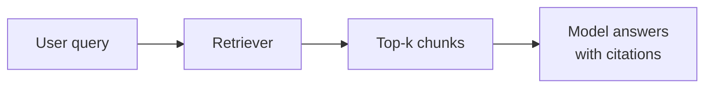

# Contributing

Contributions are welcome - this repo gets better with every question, correction, and case study the community adds. The bar is simple: **would this help someone pass an AI Engineer interview in the next 12 months?**

## What to contribute

- **New questions** you were actually asked (anonymise the company if needed) - these are the most valuable contributions.
- **Better answers** - tighter, more accurate, more current.
- **Corrections** - wrong formulas, outdated claims, dead links. Open an issue or PR directly.
- **New coding challenges** - must be self-contained, numpy/stdlib-only, with assert-based tests.
- **New system design case studies** - follow the template in [11-ai-system-design](11-ai-system-design/README.md).

## Question format

Every question in a `questions.md` file follows this exact structure:

````markdown
### N. <Question as an interviewer would phrase it>

<details><summary><b>Answer</b></summary>

<150-400 words. Direct answer first, then depth: tradeoffs, concrete numbers, examples.>

**Worth sketching.** <Optional. One short clause on what the sketch communicates.>



**Follow-ups:** <1-3 probing follow-up questions an interviewer might ask next.>

</details>
````

Rules:

- The blank lines after `<summary>` and before `</details>` are **required** - GitHub won't render Markdown inside `<details>` without them.
- Number questions sequentially across the whole file (1..N, never reset per section).
- Place the question under the right difficulty header: `## Basic`, `## Intermediate`, or `## Advanced`.
- Python for code samples, mermaid for diagrams.
- The sketch block is optional. Leave it out unless a diagram genuinely helps (see below).

## Diagrams

A sketch earns its place when it is what a strong candidate would draw on the whiteboard: a pipeline, a request path, a decision fork, a sequence between services. Most answers do not need one, and a diagram that restates the prose is noise.

- **Placement.** Inside the answer, after the prose and before the `**Follow-ups:**` line.
- **Marker.** Introduce it with the exact line `**Worth sketching.**` followed by one short clause on what the sketch communicates (for example, why it splits index time from query time), then a blank line and the mermaid block.
- **Diagram types.** Only `flowchart TD`, `flowchart LR` or `sequenceDiagram`. Aim for 4 to 10 nodes.
- **Quote labels.** Quote every node label that contains anything other than letters, digits and spaces, for example `A["Prefill (compute-bound)"]`. Use `<br/>` inside the quotes for line breaks. Quote edge labels too: `A -->|"cache hit"| B`.
- **No semicolons** in any label, note or message. Mermaid treats a semicolon as a statement terminator and the diagram breaks.
- **No bare `end`** as a node id, since it closes blocks in mermaid syntax.
- **Keep it plain.** No `subgraph`, `classDef`, `style`, `click` or theming directives. GitHub's renderer handles the plain forms reliably and they read well in both light and dark mode.
- **Check it renders.** Use the *Preview* tab on GitHub or the [Mermaid Live Editor](https://mermaid.live/) before opening the PR. A diagram that fails to parse shows up as a red error box on the page.

## Style rules

- **Direct answer in the first sentence.** Write the answer a strong candidate would give, not an essay about the topic.
- **No hype, no filler.** Delete every sentence that starts with "In today's rapidly evolving...".
- **Accuracy over coverage.** Never invent paper titles, benchmark numbers, or URLs. Label approximate figures with `~`.
- **Vendor-neutral.** Draw examples across OpenAI, Anthropic, Google, and open-source ecosystems.
- **House style.** International English spelling, straight quotes, plain hyphens rather than em dashes.
- **New terms.** If an answer introduces a term or acronym the [glossary](GLOSSARY.md) lacks, add a one-line entry in alphabetical order, linked to the page that treats it properly.

## Coding challenge rules

- One file per challenge in [12-coding-challenges](12-coding-challenges/README.md).
- Module docstring with the **problem statement** (function signatures, constraints) and **interview notes** (what a strong solution demonstrates).
- Reference solution with type hints.
- `if __name__ == "__main__":` block with real assert-based tests, ending with `print("All tests passed.")`.
- Dependencies: numpy and the standard library only. The file must run with `python3 <file>`.

## PR checklist

- [ ] Follows the format above (collapsible answers render correctly - check the *Preview* tab).
- [ ] Any new or edited mermaid diagram follows the diagram rules and renders without errors.
- [ ] Question numbering in touched files is still sequential with no gaps.
- [ ] Any Python file you touched runs clean: `python3 <file>` prints `All tests passed.`
- [ ] Links point to canonical sources (arXiv abstract pages, official docs) and actually resolve.
- [ ] No copyrighted content pasted from books or paywalled courses.

## Reporting problems

Open an issue with the file path and, for technical errors, a source supporting the correction. "This answer is wrong because X, see Y" gets merged fast.
