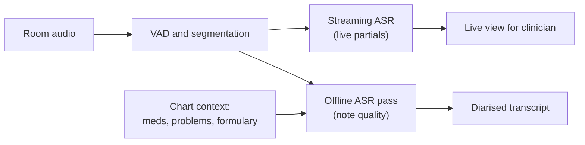
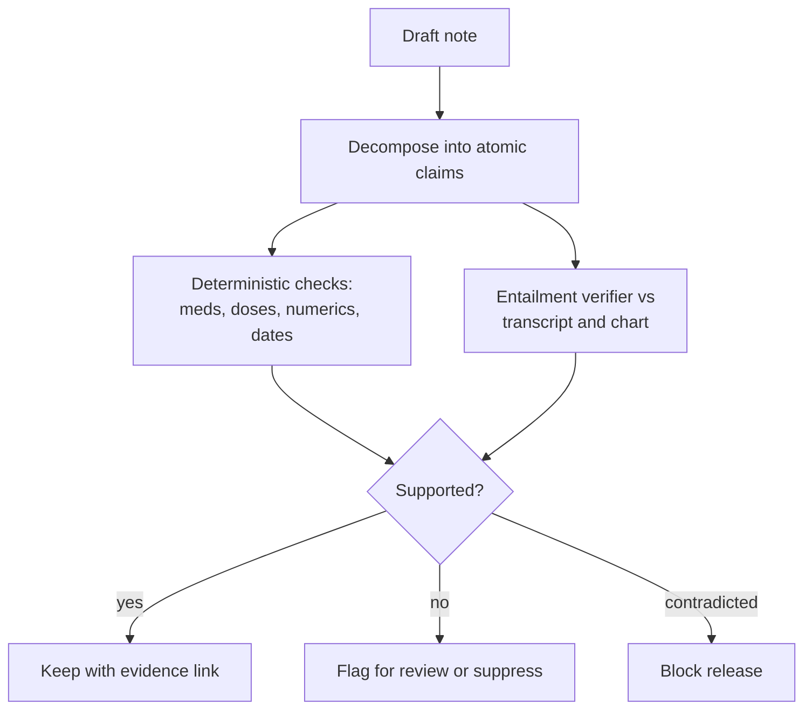
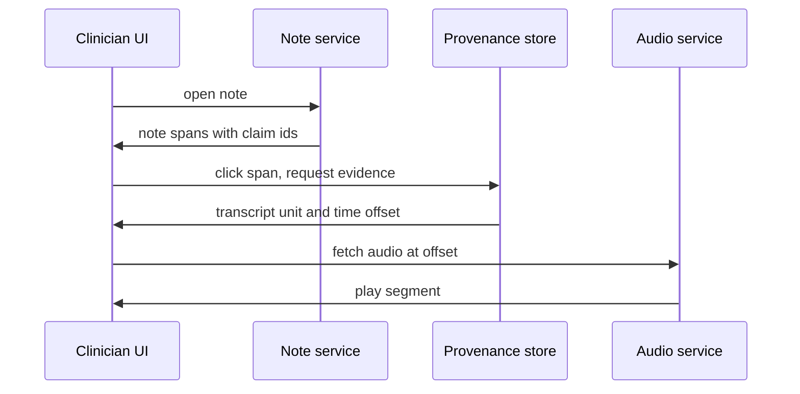
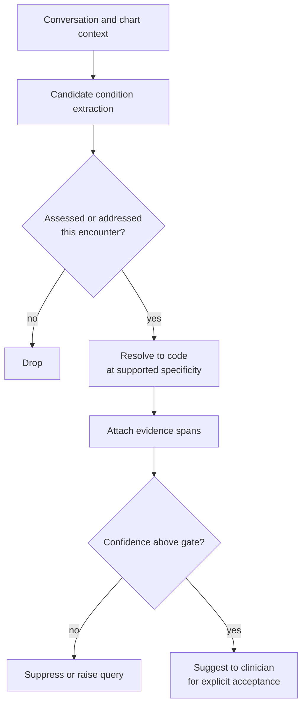
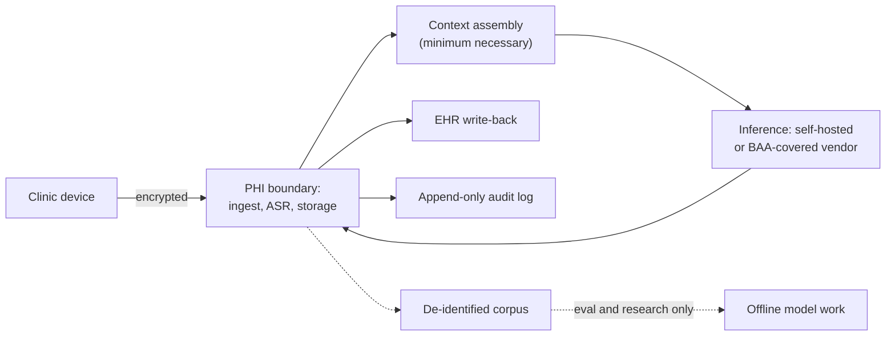
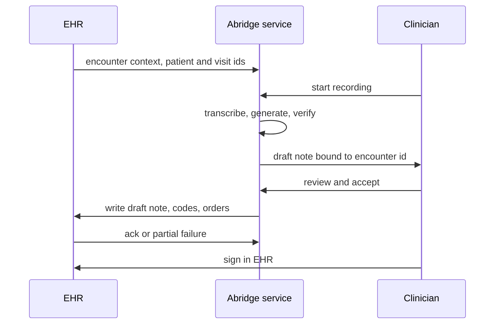
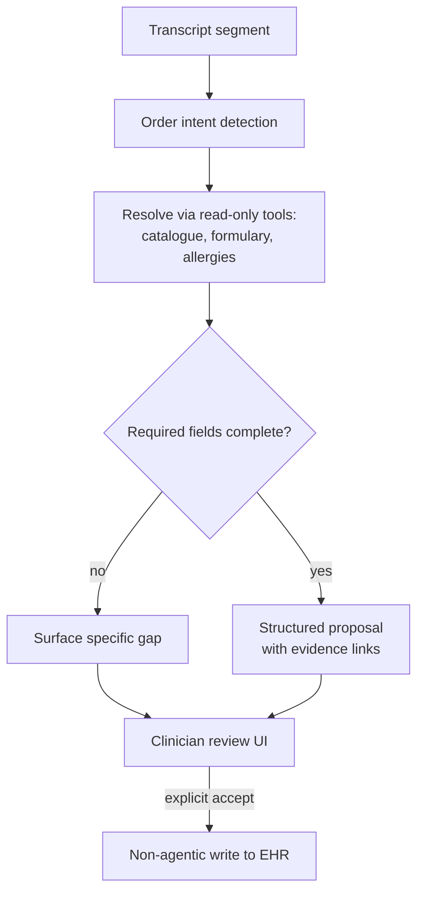

# 🩺 Abridge - AI Engineer Interview Questions

> **Last reviewed: October 2026.** Based only on public information - official pages, engineering blogs, technical reports, and publicly shared candidate reports. Processes change and vary by team; treat this as a map, not a contract. No confidential or leaked material.

## TL;DR

- Reported loop: recruiter screen → hiring manager technical conversation (deep dive on a complex project plus a short design exercise) → virtual onsite of ~3 rounds (DS&A coding, system design, an AI/GenAI-flavoured round or role-specific round such as frontend) → final with a senior engineering leader (VP Engineering or CTO). Roughly a month end to end (reported, varies). A 2026 third-party write-up describes the same four-step shape, with the third onsite round framed as a practical round tied to the product (applied coding, AI, or frontend by role) (reported, varies).
- Public loop detail is **thin**: a handful of candidate posts, one third-party guide, and a small Glassdoor sample. The stage table below is partly **inference** from the applied-vertical-AI category, and every uncertain row is labelled.
- One candidate report describes the hiring manager screen carrying a ~20-minute mini design exercise on their clinical tool execution service, with **design stubs pre-written** and the candidate asked to fill in the critical part. Expect design conversation earlier than usual.
- The technical centre of gravity is **speech plus structured generation under a safety bar**: ASR on messy clinic-room audio, diarisation and role attribution, turning free conversation into a coded, billable, signable note, and proving every line of it traces back to something the patient or clinician actually said.
- Weighted heavily: **evaluation when there is no clean ground truth**, hallucination framed as patient safety rather than quality, and PHI handling as an architectural constraint rather than a compliance checkbox. Bring an error taxonomy, not an accuracy number.

## Company context

Abridge builds ambient clinical documentation: a microphone runs during a patient visit, and the conversation comes out the other side as a structured clinical note, with diagnosis codes and draft orders attached, written back into the EHR before the clinician leaves the room. Public materials describe deployment across a large number of US health systems, speech recognition tuned for medical conversation across 14+ languages, a "Contextual Reasoning Engine" that pulls in prior encounters and health-system-specific guidelines, and a "Linked Evidence" feature that ties every generated span, code, or order back to the point in the transcript where it was discussed. Since 2025 the product has extended into revenue cycle and clinical documentation integrity, validating billing codes in the moment rather than weeks later in a back office. It has also moved into nursing: built with Mayo Clinic and Epic, the nursing product turns spoken observations into drafted flowsheet entries in the EHR, with linked sources back to the transcript, and was the subject of an April 2026 KLAS early-adopter report. That is structured data entry across a shift, not a narrative note per visit, and it widens what "the pipeline" means.

"AI engineer" here is unusually broad and unusually constrained at the same time. Broad, because the pipeline spans streaming audio, ASR, diarisation, retrieval over chart context, LLM generation, structured extraction, and EHR write-back. Constrained, because the output is a legal medical record: a fabricated dose is a safety incident, a wrong code is a billing compliance problem, and a leaked transcript is a HIPAA breach. Engineers who like the systems problem but are bored by the verification problem tend not to enjoy it here.

## Roles & titles they hire

Titles visible on their public job board and aggregator listings (August 2026):

- **Software Engineer, Generative AI** - LLM workflows, evaluation frameworks, clinical reliability
- **Software Engineer, Early Career** - posting explicitly names agentic LLM systems, retrieval pipelines, structured tool use, chained LLM workflows, and evaluation frameworks
- **Machine Learning Systems Engineer (Senior/Staff)** - the production ML pipeline from transcribing the medical parts of a conversation through to delivering takeaways; posting asks for C++/Python/Java, PyTorch or TensorFlow, Kubernetes/Docker, Terraform, and low-level OS fluency (threading, memory, networking, storage)
- **Machine Learning Scientist** - modelling and research on speech and clinical language
- **Senior Research Data Scientist / Senior Data Scientist / Head of Data Science** - measurement, evaluation, and clinical outcomes analysis
- **Senior Software Engineer, Data** - the data platform under all of the above
- **Senior Full Stack Engineer, Integrations (Epic)** and **Integrations (Cerner)** - separate postings per EHR vendor, which tells you how much integration surface matters
- **Senior/Staff Software Engineer, Front End** - the clinician review UI, where trust is actually won or lost

Offices in San Francisco, New York, and Pittsburgh, with many roles listed remote or hybrid.

## The interview loop

Public information on this loop is **limited**. What exists is a small number of publicly shared candidate reports, one third-party prep guide, and a thin Glassdoor sample. The shape below merges those reports with the typical structure for an applied vertical-AI company of this size; treat unlabelled rows as reasonably corroborated and labelled rows as inference or single-report.

| Stage | Format | What's evaluated |
|---|---|---|
| Recruiter screen | ~30 min call | Background, motivation, interest in healthcare specifically, role fit |
| Hiring manager technical conversation | ~60 min | Deep dive on a technically complex project you owned, plus a short design exercise; one report describes ~20 min on their clinical tool execution service with design stubs to complete (reported, varies) |
| Onsite: coding | Live, timed | DS&A-style problem; some reports describe practical builds (an API, a React component) instead, by role (reported, varies) |
| Onsite: system design | Whiteboard/discussion | End-to-end pipeline design: streaming audio, ML services, EHR integration, failure and privacy boundaries (reported, varies) |
| Onsite: AI/ML or role-specific round | Discussion or applied coding | GenAI workflow design and evaluation for AI roles; frontend round for frontend roles; ASR/NLP depth for speech roles (reported, varies) |
| Cross-functional / product sense | Conversation | Clinical workflow empathy, working with clinicians and product, judgement about what to ship (reported, varies) |
| Final leadership round | Conversation | Reports name VP of Engineering or CTO; bar-raiser style, mission fit, seniority calibration (reported, varies) |

Reported timeline is roughly a month; one third-party source cites an average near three weeks for senior roles. Candidate sentiment in public reports is mixed: one detailed report describes a fair, well-run process with knowledgeable interviewers, while the small Glassdoor sample for senior software engineering skews less positive. Sample sizes are too small to draw a conclusion from either - drive the process actively and ask your recruiter for the exact stage list.

## What they emphasise

- **Speech under real-world conditions.** Not clean dictation: two or three speakers, cross-talk, HVAC and hallway noise, a phone in a coat pocket, accents on both sides of the conversation, and a vocabulary of drug names that changes every quarter. Their public materials call out cross-talk, background noise, and "an evolving landscape of maladies, medications, and practice patterns" directly.
- **Grounding as a product feature, not a research nicety.** Linked Evidence exists because clinicians will not sign a note they cannot verify. Expect to be asked how you would build span-level provenance and what it costs you at generation time.
- **Hallucination as patient safety.** A fabricated medication or dose is not a quality regression, it is an adverse event with a paper trail. Candidates who answer "we'd add an LLM judge" without an error taxonomy and a severity weighting will not clear the bar.
- **Evaluation where ground truth is fuzzy.** Two good clinicians write different notes for the same visit. The third-party guide flags exactly this: measuring note quality through clinician review and error taxonomies rather than a single accuracy metric.
- **The chart is context.** Prior encounters, active problem and medication lists, health-system guidelines, and clinician preferences all feed generation. This is a retrieval and context-assembly problem living inside a HIPAA boundary.
- **Integration is the product.** Separate senior engineering postings for Epic and Cerner integrations, plus real-time order generation and revenue cycle work, mean write-back paths, HL7/FHIR, and workflow fit are treated as first-class engineering, not glue.

## Representative questions

*Representative questions synthesised from this company's publicly known focus areas and role descriptions - not leaked questions.*

### 1. Our audio is a clinic room: two or three speakers, background noise, accents, and a vocabulary full of drug names. How would you build and improve the ASR for that?

<b>Answer</b>

Start by rejecting overall word error rate as the objective. The failure modes that matter are concentrated in a tiny fraction of tokens: medication names, doses and units, lab values, anatomical sites, and negation carriers. A 3% WER system that turns "no chest pain" into "chest pain" is worse than an 8% WER system that fumbles filler words.

Architecture. Two passes. A streaming transducer gives low-latency partials during the visit so the clinician sees something live; a stronger offline pass runs on the full audio for the note that actually gets signed. Front of the pipeline: voice activity detection, noise and reverb handling, and segmentation that survives cross-talk rather than collapsing overlapping speech into one turn.

Adaptation. A general model is the starting point, not the product. The moat is domain-adapted training on real clinical audio, plus augmentation to cover what you cannot collect enough of: room impulse responses for different clinic geometries, device and codec simulation, accent balance across patient populations, and synthesised utterances for rare or newly approved drug names.

Measurement. Build an entity-weighted metric alongside WER: precision and recall on medications, dosages, numerics, and negation, scored against clinically reviewed references. Stratify every number by accent group, speaker role, specialty, site, and capture device, because an aggregate improvement that regresses one accent group is a fairness problem you will hear about from a health system, not from a dashboard.

**Worth sketching.** The two-pass split and where chart context enters the pipeline.

**Follow-ups:** How would you handle a clinician and patient code-switching mid-sentence? What is your rollout plan for a new ASR model across hundreds of health systems?

### 2. Why does speaker diarisation matter clinically, and how would you attribute roles rather than just cluster voices?

<b>Answer</b>

Diarisation is not cosmetic here. "I stopped taking the metformin" attributed to the patient is a medication adherence issue that belongs in the history. Attributed to the clinician, it is nonsense, and a summariser that ignores the distinction will happily produce a note stating the physician stopped the drug. Attribution errors propagate straight into the assessment and plan.

The harder problem is that clustering gives you speaker A and speaker B, not clinician and patient. Role attribution needs a second layer. Useful signals: lexical and pragmatic cues (who asks the diagnostic questions, who uses clinical register, who says "let's get some labs"), turn structure, the fact that the recording device usually belongs to the clinician and is closer to them, and enrolment when the clinician's voice is known from prior encounters within the health system's own data boundary.

The messy cases are the ones to raise unprompted. Three or more speakers: a family member, an interpreter, a resident presenting to an attending, a nurse stepping in. An interpreter is particularly nasty, because the patient's meaning arrives in the interpreter's voice. Paediatric visits where the parent speaks for the child. Overlapping speech, where clean segmentation is impossible and the honest answer is to mark the region low-confidence rather than guess.

Design consequence: keep role attribution as a separate, inspectable stage with confidence attached, and let downstream generation degrade gracefully. When role confidence is low, the note should attribute cautiously ("reported that...") or leave the span for clinician review, rather than asserting.

**Follow-ups:** How would you evaluate diarisation quality in a way that correlates with note errors rather than with DER? What changes when an interpreter is present?

### 3. The patient's chart already lists their medications. How would you use that to improve transcription of drug names, and how would you keep it from backfiring?

<b>Answer</b>

This is contextual biasing, and it is one of the highest-leverage things you can do in this domain because the tail is exactly where the errors are. The chart tells you what is plausible before you hear it: the active medication list, the problem list, recent orders and labs, the health system's formulary, the specialty of the clinic, and the clinician's own vocabulary from past encounters.

Mechanically, you assemble a per-encounter bias list and inject it into decoding. Shallow fusion over an on-the-fly lexicon or WFST boosts scores for those phrases; attention-based deep biasing conditions the model on an embedded bias catalogue and generally handles longer, more numerous entries better. Either way the list must be built at encounter start, scoped to that patient, and destroyed with the session.

Now the backfire, which is the real question. Biasing towards expectation makes the system hallucinate the expected. If the chart says lisinopril and the patient actually says losartan, an aggressive bias can overwrite the truth, and a medication change is precisely the clinically significant event you most need to catch. Mitigations: cap the bias weight so it breaks ties rather than overriding clear acoustic evidence, keep the unbiased hypothesis and flag divergence for review, exclude the bias path from spans where acoustic confidence is already high, and never bias numerics such as doses at all.

Evaluate it as two separate numbers: recall gain on in-chart entities, and the induced error rate on out-of-chart entities. A biasing scheme that improves the first while degrading the second is a net negative in a clinical setting even if aggregate WER improves.

**Follow-ups:** How would you size the bias list, and what do you drop first when it gets too long? How would you detect a medication change that contradicts the chart?

### 4. A generated note contains a medication the patient never mentioned. Treat that as a safety incident: how do you detect it before a clinician sees it?

<b>Answer</b>

First, name the categories, because "hallucination" is too coarse to act on. At minimum: fabrication (content with no source in the transcript or chart), contradiction (content that reverses what was said, typically negation flips), attribution errors (right content, wrong speaker or wrong tense), and omission (a clinically significant item the note dropped). Omission is the one candidates forget and clinicians care about most. Then weight by severity - a fabricated dose or allergy is categorically worse than a fabricated pleasantry - so your top-line number is not dominated by harmless noise.

Detection runs as a verification stage over the draft, not as a hope embedded in the prompt. Decompose the note into atomic claims, then check each claim for entailment against the transcript plus the chart context that was actually retrieved for this encounter. Do it with a mix of cheap deterministic checks and a model-based verifier: every medication, dose, unit, frequency, date, and numeric in the note should be matchable to a source span, and anything unmatched is unsupported by construction. Negation and hedging get their own checker, because entailment models are historically weak there.

Routing matters as much as detection. Unsupported spans should be suppressed or visibly flagged for review rather than silently deleted, since silent deletion converts a fabrication into an omission. Contradictions should block, not warn.

Then close the loop offline: sample production notes for clinician adjudication, treat their labels as the reference set, and track fabrication rate per thousand notes by severity class as a release gate rather than a dashboard metric.

**Worth sketching.** The verification stage sitting between generation and the clinician.

**Follow-ups:** Your verifier itself has a false-negative rate. How do you set its operating point? How would you catch omissions, which no entailment check will ever surface?

### 5. Clinicians will not sign what they cannot verify. How would you build span-level provenance from every line of the note back to the conversation?

<b>Answer</b>

The requirement is that a clinician clicks any sentence in the note and lands on the moment in the transcript, and ideally the audio, where it was discussed. Two implementation strategies, and the interesting answer says why you would run both.

Generation-time citation. Feed the transcript as numbered, timestamped units and require the model to emit a span identifier alongside each generated claim. Cheap, tightly coupled to the generation, and it gives you a free consistency signal: a claim the model cannot cite is a candidate fabrication. The weakness is that models cite plausibly rather than correctly, so the citation itself needs verifying.

Post-hoc alignment. Take the finished note, decompose it into claims, and align each claim to source spans by retrieval plus entailment scoring. Model-agnostic, survives a prompt or model swap, and can be tuned independently. Costs an extra pass and struggles when a single note sentence synthesises evidence scattered across a fifteen-minute conversation.

Run generation-time citation as the primary path and post-hoc alignment as the verifier and the fallback for uncited spans. Anything neither path can ground gets marked unverified in the UI rather than shown as ordinary text.

The storage and latency detail matters too. You need stable transcript unit IDs with audio offsets that survive re-transcription, a claim-to-span mapping persisted with the note version, and the audio retained only as long as the customer's agreement permits - which means provenance links must degrade gracefully to transcript-only when audio has aged out.

**Worth sketching.** The click-to-audio path a clinician actually experiences.

**Follow-ups:** A sentence in the note summarises three separate moments in the visit. How do you present that? What happens to provenance when the note is regenerated after an edit?

### 6. Two good clinicians write different notes for the same visit. So how do you evaluate note quality at all?

<b>Answer</b>

Accept that there is no single reference and stop trying to build one. Reference-based overlap metrics against a "gold" note punish legitimate stylistic variation and reward nothing a clinician cares about. Instead, decompose quality into dimensions that can be judged independently of phrasing.

The workable structure is a rubric plus an error taxonomy applied by clinician reviewers. Dimensions: factual accuracy (is every claim supported), completeness (are clinically significant items present), correct attribution, appropriate specificity, and structural conformance to the expected format for that specialty and note type. Errors get a type and a severity, and severity is defined by clinical consequence, not by how wrong the text looks.

Building the reference set is the actual work. Recruit clinician annotators, write the annotation guide carefully enough that two of them agree, and measure inter-annotator agreement before you trust a single number. Low agreement means the rubric is broken, not that the annotators are. Stratify the sample by specialty, visit type, visit length, language, and site, because a model that is excellent in primary care can be poor in psychiatry or oncology and the aggregate will hide it.

Then use automated judges to scale, but calibrate them against the clinician set rather than instead of it: report judge-to-clinician agreement as a first-class metric, re-calibrate whenever the generation model changes, and keep a held-out human-labelled slice that no prompt tuning ever touches. Release gates should be per-severity-class fabrication and omission rates, not an average score, because averages let a rare catastrophic failure hide behind a lot of competent notes.

**Follow-ups:** Your automated judge and your clinicians disagree on a slice. How do you work out which one is wrong? How would you evaluate a note type you have no annotated data for?

### 7. Edit rate is the obvious measure of clinician trust. What does it hide, and what would you instrument instead?

<b>Answer</b>

Edit rate is a good headline metric and a bad only-metric, because it conflates several different things and is non-monotonic in trust.

What it hides. A clinician who trusts the system too much edits nothing and signs a note with an error in it - low edit rate, worst possible outcome. A clinician who edits heavily may be exercising exactly the appropriate scepticism, or may be applying personal style preferences that have nothing to do with accuracy. Edit rate also drops as clinicians disengage from a tool they have given up on, which looks identical to success in the data. And it is dominated by note length and specialty, so cross-cohort comparison without stratification is meaningless.

What to instrument alongside it. Separate edit types: substantive edits that change clinical meaning, from formatting and style edits. Only the first is a quality signal. Track time-to-sign, and the gap between note delivery and signature, because a clinician who defers notes to the evening has not been given back their time. Track deletion versus addition, since additions indicate omissions and deletions indicate fabrications or verbosity - two different fixes. Track evidence-link engagement, which tells you whether verification is actually happening. Track abandonment and per-clinician usage decay, which is the honest churn signal. And track downstream corrections: coding queries, amendments after signature, and CDI query rates.

The synthesis worth saying out loud: the goal is calibrated trust, not maximal trust. You want edit rate falling on spans your evaluation says are reliable, and holding steady on spans that genuinely need review. A uniform decline across everything is a warning sign, not a win.

**Follow-ups:** How would you distinguish a style edit from a correctness edit automatically? A health system reports high satisfaction but rising post-signature amendments. What is your hypothesis?

### 8. Turn a conversation into billable diagnosis codes. What is the accuracy bar, and how do you build to it?

<b>Answer</b>

The bar is different from note quality, and saying why is most of the answer. A note error embarrasses you; a coding error is a compliance exposure. Over-coding, especially assigning higher-severity conditions that inflate reimbursement, is the thing regulators and auditors look for, and an AI system that systematically over-codes across millions of encounters is a far larger liability than one that misses codes. So the operating point is deliberately asymmetric: bias towards under-suggesting, and make every suggestion defensible.

Pipeline. Extract candidate conditions from the conversation and the retrieved chart context. Filter for documentation validity, which is stricter than mention: a condition is codable when it was assessed or addressed in this encounter, not merely mentioned in passing or listed in history. Resolve to codes with the specificity the code set demands, since laterality, acuity, type, and manifestation drive both the code and the reimbursement. Attach evidence for every candidate. Then gate on confidence and present the survivors to the clinician as suggestions requiring affirmative acceptance, never as silently applied codes.

Failure modes to raise unprompted: family history and rule-out language ("we should check for diabetes") read as diagnosis by a naive extractor; negation and hypotheticals; historical conditions resurfacing as current; and the specificity trap, where the conversation genuinely does not support the more specific code and the honest output is the unspecified one plus a query to the clinician.

Evaluation needs certified coder adjudication, not model self-report, measured as precision and recall per code family with over-coding tracked separately as its own release gate.

**Worth sketching.** The gating chain from utterance to accepted code.

**Follow-ups:** How would you monitor for systematic over-coding drift across a health system? What do you do when the conversation supports a condition but the chart contradicts it?

### 9. PHI is in every audio file, transcript, and note you touch. How does that shape the architecture, and what can you send to a third-party model API?

<b>Answer</b>

Start from the legal frame, because it drives the engineering. Operating on protected health information on behalf of a health system makes you a business associate under HIPAA, which means a signed BAA with the covered entity and, critically, a BAA with every subprocessor that touches PHI. That single requirement decides your model vendor list before any benchmark does: if a provider will not sign a BAA and commit to no-training-on-your-data terms, that provider is not in the architecture, regardless of how good the model is. Abridge's public trust materials describe HIPAA business associate status, SOC 2 Type II controls, US data residency, SSO/MFA, and audit logging, with retention governed by customer agreements.

Architectural consequences. PHI-bearing data stays inside a defined boundary with encryption in transit and at rest, and inference runs either self-hosted inside that boundary or against a vendor covered by a BAA with zero-retention terms. Tenant isolation is real isolation, since one health system's audio must never influence or leak into another's context. Retention becomes a configurable per-customer contract, so audio and transcripts age out on the customer's schedule and every derived artefact respects the same clock. Audit logging is append-only and covers reads, not just writes, because "who listened to this patient's recording" is a question a compliance officer will ask.

De-identification deserves a nuanced answer rather than a reflexive one: it is useful for building research and evaluation datasets, but it does not help the production path, since the note has to name the patient's actual medications and history. Do not claim it as a way around the BAA requirement. And minimum necessary applies to context assembly - retrieve the chart slices this encounter needs, not the whole record.

**Worth sketching.** Where the PHI boundary sits and what crosses it.

**Follow-ups:** A new frontier model would clearly improve note quality but the vendor will not sign a BAA. What are your options? How would you prove to an auditor that a specific patient's audio was deleted on schedule?

### 10. The note should be ready before the clinician leaves the room. Build me the latency budget, and tell me where the money goes.

<b>Answer</b>

Frame it as two different latency requirements, because conflating them produces a bad design. During the visit you need live feedback - partial transcript, maybe live extraction of orders and conditions - at conversational latency, on the order of a second or less to feel responsive. After the visit ends you need the full note, and the real deadline is the clinician's attention span: seconds, not minutes, or they walk to the next room and the note becomes evening work, which is the exact problem the product exists to solve.

Budget for the post-visit path on a typical fifteen-minute encounter. The offline ASR pass over the audio dominates if you run it from scratch, so you do not: the streaming pass has already transcribed most of the visit incrementally, and the offline pass reconciles and refines rather than starting cold. Context assembly from the chart runs concurrently with the conversation, not after it. That leaves generation plus verification on the critical path. Generation is a long-input, moderate-output job, so prefill dominates and prompt caching of the stable parts of the context (health system guidelines, clinician preferences, format instructions) is worth real engineering. Verification adds a second pass, which you parallelise per section rather than running serially over the whole note.

Where the money goes: input tokens. A long transcript plus retrieved chart context plus a verification pass over the output means you pay for the conversation several times. Levers, in order of impact: cache the stable context prefix, keep the transcript in the prompt once rather than per-section, run cheaper models for extraction and verification and reserve the strongest model for generation, and batch anything not on the interactive path. At a few million encounters, a 30% input-token reduction is a budget line, not an optimisation.

**Follow-ups:** A specialty's visits run 90 minutes instead of 15. What breaks first? Would you stream the note to the clinician section by section, and what does that cost you in coherence?

### 11. Walk me through writing a finished note back into Epic. What goes wrong?

<b>Answer</b>

The integration is where an otherwise good product dies, and interviewers here will know it - there are separate senior engineering postings for Epic and Cerner integrations.

Happy path. Encounter context arrives from the EHR (patient, encounter ID, department, clinician), which is what lets you retrieve the right chart slices. The note is generated, the clinician reviews it in a surface embedded in their workflow rather than a separate app, and on acceptance it is written back to the correct encounter as a draft note, with codes and orders attached as suggestions pending signature. The clinician signs inside the EHR, because the EHR is the system of record and the signature is the legally meaningful act.

What goes wrong, roughly in order of frequency. Encounter mismatch: the clinician started the recording before opening the chart, or has two encounters open, and the note lands on the wrong patient. This is the highest-severity integration bug in the category, so the design needs explicit encounter binding and a hard confirmation step rather than a best guess. Identity mapping drift between your user records and the EHR's provider directory. Note type and template mismatch by department, where a valid note is rejected because the target template expects different sections. Write-back partial failure, where the note lands but the orders do not, which needs idempotent retries keyed on an encounter-scoped ID rather than blind resubmission. Version skew across health systems, since every site runs a different EHR version with different local configuration, so "works at site A" proves little. And downtime on either side, which means queue and reconcile rather than drop.

The operational point: per-site canarying and per-site health metrics, because the deployment unit is a health system, not a release.

**Worth sketching.** The binding and write-back sequence, with the failure point marked.

**Follow-ups:** How do you make write-back idempotent when the EHR returns a timeout with no result? What is your rollback story if a bad model version wrote 5,000 notes overnight?

### 12. Design a service that turns the conversation into draft orders: labs, imaging, referrals, prescriptions. Assume tool calls against the EHR.

<b>Answer</b>

This is the highest-stakes surface in the product, because a note is a record while an order is an action. Design accordingly: the service proposes, the clinician disposes, and nothing reaches the EHR without explicit human acceptance.

Shape it as a bounded agent loop rather than an open-ended one. Detect order intent in the conversation ("let's get a CBC", "I'll send you for an MRI of the left knee"), which is a classifier problem with heavy negation and hypothetical handling - "we might need imaging if this doesn't settle" is not an order. For each candidate intent, resolve it against real catalogues via tools: the orderable item catalogue for this health system, which differs per site; the formulary; the patient's allergy and current medication list for interaction checks; and any required fields the order type demands (laterality, indication, priority, frequency, duration). Missing required fields are the common case, and the correct behaviour is to surface a specific gap to the clinician, not to invent a value.

Constrain the tool layer hard. Read tools are freely callable; write tools do not exist in the agent's action space at all. The loop's only output is a structured order proposal with evidence links, populated fields, unresolved gaps, and any safety flags. A separate, non-agentic path performs the write after clinician acceptance. That separation is what makes the system reviewable and what you should say first.

Reliability details worth raising: cap loop iterations and tool calls per encounter, make every tool call idempotent and logged for audit, validate the proposal against a schema before it reaches the UI, and fail closed - an order the system cannot fully resolve is shown as an incomplete suggestion rather than dropped silently, because a silently dropped order is a missed test.

**Worth sketching.** The bounded loop with the write path deliberately outside it.

**Follow-ups:** The clinician mentions a drug the patient is allergic to. What does the system do? How would you evaluate this end to end, given that a missed order and a spurious order have very different costs?

### 13. Nurses chart structured flowsheet rows across a twelve-hour shift, not one narrative note per visit. How would you adapt an ambient pipeline built for physician visits to draft flowsheet entries?

<b>Answer</b>

Change the output contract first. A physician note is sectioned free text; a flowsheet is a site-configured schema of rows, each with a type (numeric with units, pick-list, free text), validation rules, and the time the observation was true. Generation becomes constrained extraction into that schema, not summarisation.

Pipeline changes:

- **Capture is episodic.** A nurse moves between rooms all shift, so you need patient binding per burst of speech, short sessions, and a hard check that each burst attaches to the right patient. Wrong-patient charting is the top-severity failure, as encounter mismatch is for notes.
- **Schema per site.** Load the health system's flowsheet rows and allowed values at session start and constrain decoding to them, so the model cannot emit a value the EHR will reject or a pick-list option that does not exist.
- **Observation time is not documentation time.** "Pain was 7 when I came on at six, now it's 4" is two rows with two timestamps. Temporal extraction is its own stage.
- **Numerics are deterministic.** Vitals, scores, and intake and output volumes are parsed and unit-checked by rules, range-checked against plausibility and the patient's recent values, and routed for review when they do not match rather than guessed.
- **Provenance per row.** Every drafted row links to the transcript span that supports it so the nurse can verify in seconds. A row with no supporting span is not drafted.
- **Silence is not normal.** A row the nurse did not verbalise stays empty. Defaulting it to "within normal limits" is fabrication with a clinical consequence.

Evaluation changes with it: per-row precision and recall by row type, wrong-patient and wrong-time rates as separate release gates, and time-to-file per shift as the product metric, because the value is documentation that no longer piles up at handover.

**Follow-ups:** A nurse describes the patient in bed A while standing at bed B. How does the system know? How would you onboard a site whose flowsheet template has hundreds of custom rows?

## How to prepare

**Repo topics, in priority order:**

- **[07-evaluation-and-observability](ML%20Prep/AI%20Fundamentals/AI-Engineer-Interview-Questions/07-evaluation-and-observability/README.md)** - the highest-leverage topic for this loop. Evaluation without clean ground truth, error taxonomies, LLM-judge calibration against human labels, and online product metrics. Go deepest here.
- **[09-safety-security-and-responsible-ai](ML%20Prep/AI%20Fundamentals/AI-Engineer-Interview-Questions/09-safety-security-and-responsible-ai/README.md)** - hallucination detection and grounding, plus the PHI, access-control, and audit material. In this domain the two are the same subject.
- **[10-multimodal](ML%20Prep/AI%20Fundamentals/AI-Engineer-Interview-Questions/10-multimodal/README.md)** - speech recognition, streaming audio, diarisation. Essential for ML and ASR-adjacent roles, useful for everyone else so you can hold the conversation.
- **[11-ai-system-design](ML%20Prep/AI%20Fundamentals/AI-Engineer-Interview-Questions/11-ai-system-design/README.md)** - the design round is a real pipeline. The closest case study is **[08-meeting-assistant](08-meeting-assistant.md)** (conversation capture, diarisation, structured summary generation); work it, then re-run it with a clinical safety bar and an EHR write-back path bolted on.
- **[06-agents-and-tool-use](ML%20Prep/AI%20Fundamentals/AI-Engineer-Interview-Questions/06-agents-and-tool-use/README.md)** - the early-career posting names agentic LLM systems, structured tool use, and chained workflows explicitly, and the reported design exercise involved a clinical tool execution service.
- **[04-rag-and-retrieval](ML%20Prep/AI%20Fundamentals/AI-Engineer-Interview-Questions/04-rag-and-retrieval/README.md)** and **[03-prompt-engineering-and-context](ML%20Prep/AI%20Fundamentals/AI-Engineer-Interview-Questions/03-prompt-engineering-and-context/README.md)** - chart context assembly is retrieval under a minimum-necessary constraint.
- **[12-coding-challenges](ML%20Prep/AI%20Fundamentals/AI-Engineer-Interview-Questions/12-coding-challenges/README.md)** and **[13-interview-process-and-behavioral](ML%20Prep/AI%20Fundamentals/AI-Engineer-Interview-Questions/13-interview-process-and-behavioral/README.md)** - there is a standard coding round and a leadership round; do not let the domain prep crowd them out.

**Company-specific moves:**

1. Learn the clinical note formats. Know what SOAP means, what belongs in HPI versus assessment and plan, and why a condition being "assessed or addressed" is different from being mentioned. You do not need to be a clinician, but sounding like you have never read a clinical note is disqualifying.
2. Read their product and platform pages, particularly the material on Linked Evidence, the Contextual Reasoning Engine, the revenue cycle work, and the nursing flowsheet product. Then be ready to say what you would build next and why.
3. Have one worked example of evaluating a generative system where correctness was genuinely contested. This is the question they come back to, and a real story about building an error taxonomy and getting annotators to agree beats any framework recital.
4. Prepare a project deep dive that emphasises infrastructure decisions and trade-offs, since candidate reports describe the hiring manager round centring on exactly that rather than on generic coding.
5. Be able to answer "why healthcare" without platitudes. The regulated-vertical companies screen for it, and mission fit shows up again in the final leadership round.

## Sources

- [Abridge - AI technology overview](https://www.abridge.com/ai) (fetched August 2026; ASR across 14+ languages, Contextual Reasoning Engine, provenance tracking, guardrails)
- [Abridge - product](https://www.abridge.com/product) and [Abridge - revenue cycle platform](https://www.abridge.com/platform/revenue-cycle)
- [Abridge - job board](https://jobs.ashbyhq.com/Abridge) (official careers page redirects here)
- [Built In - Abridge jobs](https://builtin.com/company/abridge/jobs) (fetched August 2026; role titles above)
- [Machine Learning Systems Engineer (Staff/Senior) posting](https://talent.thecolorwave.org/companies/abridge/jobs/37344822-machine-learning-systems-engineer-staff-senior) (fetched August 2026; stack and responsibilities)
- [techinterview.org - Abridge interview guide](https://www.techinterview.org/companies/abridge-interview-guide/) (third-party prep guide; stage shape and probe areas marked "reported" above)
- [Taro - Abridge software engineer interview experience](https://www.jointaro.com/interviews/companies/abridge/experiences/software-engineer-united-states-february-1-2025-declined-offer-positive-db40167f/) (single candidate report: recruiter, hiring manager technical conversation, onsite panel, CTO call)
- [Blind - Abridge system design](https://www.teamblind.com/post/abridge-system-design-7zklyo6q) (candidate report of a ~20 min design exercise on a clinical tool execution service with design stubs)
- [Glassdoor - Abridge senior software engineer interviews](https://www.glassdoor.com/Interview/Abridge-Senior-Software-Engineer-Interview-Questions-EI_IE3146134.0,7_KO8,32.htm) (small sample, mixed sentiment)
- [Abridge Trust Center](https://trust.abridge.com/) (compliance posture)
- [Abridge - Abridge, Mayo Clinic and Epic collaborate on nursing documentation](https://abridge.com/press-release/abridge-mayo-epic) (official press release on the nursing workflow)
- [HIT Consultant - KLAS report on Abridge ambient AI for nursing (April 2026)](https://hitconsultant.net/2026/04/02/klas-report-abridge-ambient-ai-nursing-flowsheets-ehr/) (verbalised nursing observations drafted into EHR flowsheets, linked sources, early-adopter sample)
- [Design Gurus - Abridge interview process, round by round](https://www.designgurus.io/answers/detail/what-is-the-abridge-interview-process-like-round-by-round) (third-party 2026 write-up; four-step shape, practical round by role)
