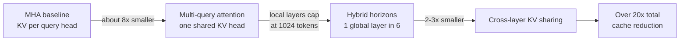
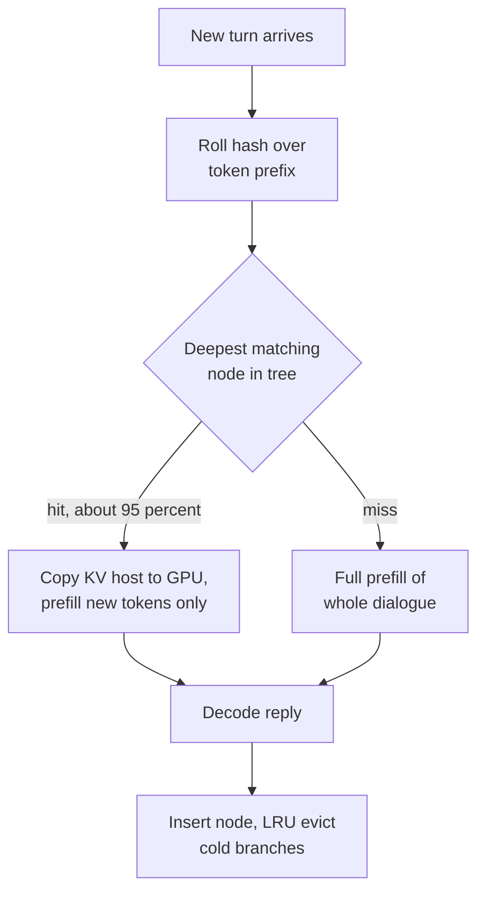
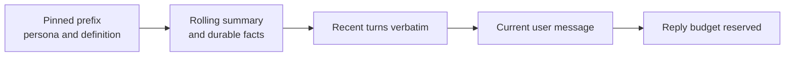
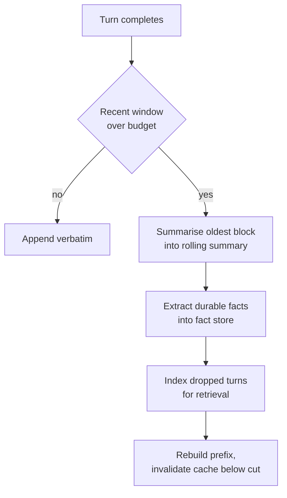
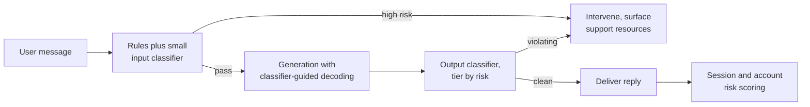
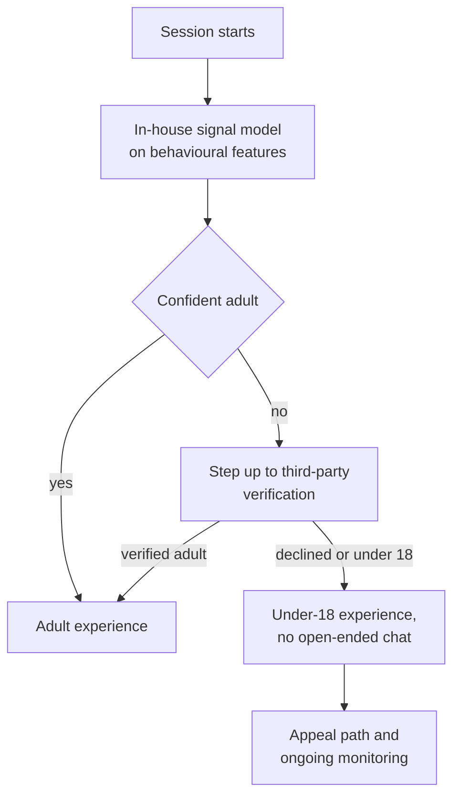
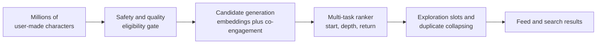

# 🎭 Character.AI - AI Engineer Interview Questions

> **Last reviewed: October 2026.** Based only on public information - official pages, engineering blogs, technical reports, and publicly shared candidate reports. Processes change and vary by team; treat this as a map, not a contract. No confidential or leaked material.

## TL;DR

- Public interview information is **thin**: a handful of Glassdoor reports plus third-party prep guides, and no official process page. The loop table below is mostly **inference from those reports and from the roles they post**, not verified fact. Confirm every stage with your recruiter.
- Reported shape (reported, varies): recruiter screen → hiring manager screen → ~60-min technical screen → virtual onsite of 4-5 rounds (coding, an ML/inference round, a system design round, behavioural) → founder or executive round for senior levels. Reported timeline roughly 3-5 weeks.
- The centre of gravity is **inference economics at consumer scale**. They have publicly said they serve 20,000+ inference queries per second and cut serving cost 33x since late 2022. Almost every ML round reduces to "what does one message cost, and why".
- **KV cache is the recurring theme.** Their published stack is multi-query attention, hybrid attention horizons, cross-layer KV sharing, native int8, and a stateful inter-turn cache at a reported 95% hit rate. Know these well enough to argue the quality tradeoffs, not just name them.
- **Safety is a first-class engineering track, not a policy afterthought.** They post safety and integrity engineering roles, removed open-ended chat for under-18 users in November 2025, funded an independent AI Safety Lab, and in September 2026 described an in-house age estimation model, self-harm detection that reads signals building up over long chats, and a moderation appeals process. Expect at least one round where engagement and wellbeing pull in opposite directions and you have to pick.

## Company context

Character.AI is a consumer AI entertainment platform: users create characters and hold open-ended conversations with them, at a reported 20 million monthly active users (the company's 2025 figure). The engineering problem is unusual for an AI company - not frontier capability, but **serving enormous conversational volume at a cost per message low enough for a consumer product**, with dialogues that average around 180 messages and personas that must stay consistent across all of them. They built and served their own model family (Kaiju: 13B, 34B, 110B) and have since said they are moving towards open-source base models, which shifts the value from pretraining to post-training, serving, and safety. The September 2026 releases follow that pattern: CAI-Image, a family of image models post-trained from the open-source Qwen-Image for character consistency across art styles, and new free chat styles (PipSqueak 3, ShortSqueak) alongside a low-cost "lite" subscription tier. "AI engineer" here means inference and serving engineering, post-training, applied ML for discovery and recommendation, or safety and integrity ML - and the same person is often expected to reason about the product consequences of their latency and cost choices.

## Roles & titles they hire

From their public Ashby job board (checked October 2026; unchanged since August):

- **Machine Learning Infrastructure Engineer** (Technical Staff - ML, Redwood City)
- **Research Engineer, Post-Training (All Industry Levels)** (Redwood City or New York)
- **Principal Research Engineer, Post-Training** (Redwood City)
- **Research Engineer, AI Safety & Alignment** (Redwood City)
- **Software Engineer, Backend/Applied ML (Safety & Integrity)** - backend systems for content classification, anomaly detection, risk scoring, behaviour analysis
- **Software Engineer, Applied ML (Discovery, Recommendation & Search)**
- **Software Engineer, Core Product** / **Software Engineer, Backend** / **Software Engineer, Monetization**
- **Staff Data Scientist, Monetization** and **Technical Program Manager, AI Infrastructure**

The board is small (roughly 10-15 open roles at a time) and heavily weighted towards Redwood City. Compensation data points exist on [levels.fyi](https://www.levels.fyi/companies/characterai/jobs).

## The interview loop

**Public information here is thin.** Glassdoor carries only a small number of Character.AI interview reports, and the detailed stage breakdowns circulating on third-party prep sites read as partly generic. Treat the table below as the **typical shape for a mid-size consumer AI product company with a strong research bench**, reconciled with what candidates have reported, rather than as a documented process.

| Stage | Format | What's evaluated |
|---|---|---|
| Recruiter screen | ~30 min call | Background, motivation, why consumer AI specifically, level and location fit |
| Hiring manager screen | ~45 min | Role fit, depth in your claimed specialism, what you have actually shipped (reported, varies) |
| Technical phone screen | ~60 min | One coding problem, often plus discussion of ML inference or distributed systems (reported, varies) |
| Onsite: coding ×1-2 | Live coding, medium to hard | Standard DS&A plus, for ML roles, applied problems close to their stack (reported, varies) |
| Onsite: ML / inference round | Discussion, sometimes ML coding | Serving cost, KV cache, batching, quantization, latency budgets; post-training for research roles (reported, varies) |
| Onsite: system design | Whiteboard | High-throughput chat, conversation state, caching, safety in the request path (reported, varies) |
| Onsite: behavioural / culture | Conversation | Their stated values: users first, one team, think transformational, find a way, fast and responsible |
| Executive round | Conversation | Reported for senior and above: founder or CTO round (reported, varies) |

Reported end-to-end timeline is roughly 3-5 weeks, described by candidates as faster than large-company loops. Difficulty is most commonly rated medium. Because the sample is small, drive the process actively and ask your recruiter for the exact round list.

## What they emphasise

- **Cost per message, not cost per GPU-hour.** Their public inference posts frame everything in serving economics: 20,000+ queries per second, a 33x cost reduction since late 2022, and a claim that commercial APIs would cost them at least 13.5x more. Candidates who can only discuss latency, not unit cost, read as unprepared.
- **KV cache as the binding constraint.** Multi-query attention (about 8x smaller cache than GQA), interleaved sliding-window and global attention (1024-token local window, roughly one global layer in six), and cross-layer KV sharing (another 2-3x) combine for a stated 20x-plus reduction. They chose these knowing MQA costs some benchmark quality, and they will ask you to defend that trade.
- **Caching across turns, not just within a request.** Their stateful cache is a tree-structured LRU keyed by rolling hash over the dialogue prefix, similar in spirit to RadixAttention, holding KV on host memory between turns at a reported 95% hit rate. Long dialogues make this the single highest-leverage optimisation in the product.
- **Kernel-level ownership.** Their second inference post describes int8 FlashAttention variants, warp-specialised producer warpgroups, TMA-based cooperative preprocessing, and query-head packing for MQA decode, with reported gains of roughly 10% in prefill and 30% in decode over their earlier Triton kernels. Infra roles should expect to go at least one level below the framework.
- **Safety engineering with real product consequences.** Token-level safety classifier heads, classifier-guided decoding, age assurance, the November 2025 removal of open-ended chat for under-18 users, and the September 2026 additions (in-house age estimation, long-chat self-harm signals, creator moderation notices with appeals) are all public. This is a company that has shipped a product change that reduced engagement on purpose.
- **Consumer product instinct.** The careers page leads with users first and with entertainment, storytelling, and social connection. Engineers who treat the model as the product, rather than the conversation, tend to miss what they are actually optimising.

## Representative questions

*Representative questions synthesised from this company's publicly known focus areas and role descriptions - not leaked questions.*

### 1. Our serving cost is dominated by KV cache, not weights. Get it down by an order of magnitude and tell me what you give up.

<details><summary><b>Answer</b></summary>

At consumer chat scale the batch is huge and the contexts are long, so KV cache, not weights, decides how many concurrent conversations fit on a GPU. Three architectural levers stack multiplicatively, and Character.AI has published all three.

**Multi-query attention.** One shared K/V head for all query heads instead of one per head. Against the 8-way grouped-query attention most open models ship, that is about an 8x smaller cache per token. The cost is real: MQA is known to lose some ground on knowledge benchmarks like MMLU relative to MHA or GQA. For a conversational product where the win is 8x more concurrent dialogues per GPU, that is a trade worth making; for a reasoning product it may not be.

**Hybrid attention horizons.** Interleave local attention with a 1024-token sliding window against global layers, roughly one global layer in six. Local layers turn attention cost from O(length²) to O(length) and cap their cache at the window size, so cache growth becomes near-flat in dialogue length. The published result is little to no drop on needle-in-a-haystack retrieval, because the surviving global layers carry long-range lookups.

**Cross-layer KV sharing.** Tie the cache across two or three neighbouring layers, and share global-layer KV across non-adjacent blocks. Another 2-3x, reportedly without measurable accuracy loss.

Together these have been described as over a 20x reduction. What you actually give up: benchmark headroom, some architectural freedom to swap in off-the-shelf open weights, and the ability to reason about long-range dependencies in the local layers.

**Worth sketching.** The reductions stack multiplicatively, which is why the total is 20x rather than 8x.



**Follow-ups:** If you moved to an open-source base model with GQA-8, which of these can you still apply post hoc and which need pretraining? How would you measure that the local layers are not silently degrading persona recall at turn 150?

</details>

### 2. Dialogues here average around 180 messages. Design the cache that sits between turns.

<details><summary><b>Answer</b></summary>

The key observation: turn N+1's prompt is turn N's prompt plus two messages. Re-prefilling the whole dialogue every turn is quadratic in conversation length and is the dominant avoidable cost in a chat product. Character.AI's published answer is a stateful inter-turn cache: a tree-structured LRU keyed by a rolling hash over the message prefix, with KV values held in host memory between turns, reportedly achieving a 95% hit rate.

Mechanics worth stating:

- **Key by rolling hash of the token prefix**, not by session ID. That way branching conversations, regenerated replies, and shared character definitions all deduplicate naturally. Identical character prefixes across different users hit the same node.
- **Tree, not flat map.** Each node is a prefix chunk; children extend it. A new turn walks the tree to the deepest matching node, then prefills only the new tokens. This is the same idea as RadixAttention.
- **Host memory, not GPU.** GPU HBM is the scarce resource, so cached KV lives in CPU RAM and is copied back on hit. That copy has to beat re-prefilling, which is why the 20x cache-size reduction from Q1 matters here too: smaller cache means cheaper transfers and more entries resident.
- **Eviction on the tree.** LRU over branches, with the root regions holding character definitions naturally staying hot because many users share them.

Failure modes to name: a cold cache after deploy (warm from the tree root, and stagger rollouts), a hash collision producing a wrong-context reply (use a strong hash and verify token equality on hit), and any prompt component that varies per turn - a timestamp, a randomly ordered memory block - which silently drops the hit rate towards zero.

**Worth sketching.** The tree walk is what converts a quadratic re-prefill into a constant-size one.



**Follow-ups:** What happens to the hit rate when a user edits a message at turn 40, and how do you keep the rest of the branch usable? Would you replicate this cache across serving nodes or shard requests by prefix hash, and why?

</details>

### 3. You train natively in int8 rather than doing post-training quantization. Defend that.

<details><summary><b>Answer</b></summary>

Post-training quantization is the default because it is cheap: take a bf16 checkpoint, calibrate scales, ship. Its problem is a **train/serve mismatch** - the model never saw quantization noise during training, so you are hoping the loss surface is flat enough near the weights you found. Sometimes it is not, and the failure shows up on exactly the long-tail behaviour a benchmark table misses.

Quantization-aware training removes the mismatch by putting the quantizer in the training loop, so the model learns weights that are good *as int8 values*. Character.AI has said they train natively in int8 across weights, activations, and KV cache, with custom int8 matmul and attention kernels, and they report the training itself runs 20-30% faster while holding bf16-level accuracy - int8 tensor cores give roughly 2x the throughput of bf16.

The honest cost side:

- **You lose optionality.** You cannot cheaply try a different precision later, and you cannot start from an arbitrary open checkpoint without a conversion or requantization phase.
- **Stability engineering is on you.** Low-precision training needs the supporting machinery: pre-layer normalization, activation clamping to keep outliers in range, careful scale placement. Their published stack names exactly these.
- **Serving must match.** The int8 attention kernel has its own design choice - quantizing only the first matmul and keeping the second in bf16 avoids a quality regression from quantizing the attention probabilities, at slightly higher compute. They chose that safer variant.

The strategic answer: if you serve your own model at 20,000 queries per second, amortising a QAT pretraining run over trillions of served tokens is obviously right. If you are moving to open-source base models, the calculus shifts towards careful PTQ plus a short QAT recovery phase.

**Follow-ups:** How would you detect that int8 has degraded a specific behaviour, like staying in character, when aggregate evals show parity? What changes if you move to fp8 on newer hardware?

</details>

### 4. Estimate what one message costs us to serve, and tell me which lever moves it most.

<details><summary><b>Answer</b></summary>

Method over memorised numbers, and state every assumption. Take their public figure of 20,000+ inference queries per second.

**Assumptions:** a 30B-class model served in int8 (roughly 30 GB of weights), ~100 output tokens per reply, MQA so KV traffic is small relative to weights, and the inter-turn cache absorbing most of the prefill.

**Decode ceiling per GPU.** An H100 has about 3.35 TB/s of HBM bandwidth. Reading 30 GB of weights per decode step gives a hard ceiling near 110 steps/s. At a realistic 50% bandwidth efficiency, ~55 steps/s. Because MQA makes per-sequence KV tiny, you can run very large batches, so at batch 512 that is on the order of 25,000-30,000 output tokens/s per GPU.

**Fleet floor.** 20,000 QPS × 100 tokens = 2M output tokens/s. Divided by ~25,000 gives roughly 80 GPUs as an idealised floor. Multiply by 3-5x for peak-to-average traffic ratio, redundancy, prefill for cache misses, safety classifier inference, and regional capacity: call it several hundred GPUs.

**Cost.** At an illustrative $2 per GPU-hour and 300 GPUs, that is $600/hour against 72 million messages per hour, so on the order of $0.00001 per message - under a cent per thousand messages. That is the regime a free consumer product needs.

**Which lever moves it most.** In order: (1) the inter-turn cache hit rate, because a miss on a 180-message dialogue costs orders of magnitude more than a hit; (2) achieved batch size, which is gated by KV cache size per sequence, which is why MQA and cross-layer sharing are economic decisions not architectural taste; (3) utilisation, since a fleet sized for peak sits idle at trough; (4) kernel efficiency, worth tens of percent, not multiples.

**Follow-ups:** How does a long-context feature that raises average dialogue length change this? Where would you put the crossover for serving a larger model to paying subscribers only?

</details>

### 5. Live coding: build the prompt for the next turn under a fixed token budget. The catch is our prefix cache.

<details><summary><b>Answer</b></summary>

The trap is the obvious implementation: keep the last N tokens and drop the oldest. That truncates from the **front**, which changes the prefix on every turn and destroys the inter-turn cache from Q2 - you convert a 95% hit rate into near zero and multiply serving cost.

The correct shape orders the prompt by **stability**, so everything that changes lives at the end:

```python
def build_context(char, memory, turns, user_msg, budget, tokenize):
    # Stable prefix: identical across turns and often across users.
    prefix = char.system_prompt + char.definition + char.example_dialogue
    head = tokenize(prefix)

    # Semi-stable: rolling summary plus durable facts. Changes only at
    # a compaction event, never on every turn.
    mem = tokenize(memory.summary + memory.facts)

    tail = tokenize(user_msg)
    remaining = budget - len(head) - len(mem) - len(tail) - RESERVED_FOR_REPLY
    if remaining < 0:
        raise ContextTooSmall

    # Fill backwards from the most recent turn, but emit in order.
    kept, used = [], 0
    for t in reversed(turns):
        tt = tokenize(t)
        if used + len(tt) > remaining:
            break
        kept.append(tt)
        used += len(tt)
    kept.reverse()

    return head + mem + flatten(kept) + tail, len(head) + len(mem)
```

Two things to say out loud. First, return the **stable prefix length** so the caller knows where the cache boundary sits. Second, compaction must be **event-driven, not per-turn**: when the recent-turn window overflows, summarise a whole block at once and accept one cache invalidation, rather than shifting the boundary every turn. Amortised, that is one expensive prefill every dozens of turns instead of one every turn.

**Worth sketching.** Ordering by stability is the entire design.



**Follow-ups:** Where do you insert retrieved older turns without breaking the cache boundary? How would you unit-test that a refactor did not silently drop the hit rate?

</details>

### 6. A conversation runs past the context window. What do you keep, and how do you decide?

<details><summary><b>Answer</b></summary>

At an average of 180 messages, most active dialogues exceed any reasonable serving context, so this is a core product problem, not an edge case. The wrong answer is a single rolling summary - it loses precise details users notice ("you said your sister's name was Mira") and it degrades monotonically as it is re-summarised.

Use a **tiered memory** with different decay properties:

1. **Verbatim recent window.** The last K turns unchanged. This carries tone, pacing, and the immediate thread, none of which survive summarisation.
2. **Rolling narrative summary.** A compacted account of what has happened, regenerated at compaction events. Keep it bounded and version it so you can diff for drift.
3. **Durable fact store.** Extracted structured facts - names, relationships, stated preferences, plot commitments - written once and rarely rewritten. These are what users notice when they break, and they are cheap to keep exactly.
4. **Retrieval over dropped turns.** Index everything evicted from the window and pull back the top few passages relevant to the current message. This is where an emotionally significant turn from 300 messages ago comes back.

Decision rule for what enters the fact store: anything the user asserted about themselves or the world, anything the character committed to, and anything that has been referenced more than once. Anything purely stylistic stays in the summary.

Evaluation is the hard part. Build a long-conversation eval set with planted facts and probe them at turn 50, 150, and 400, scoring recall and contradiction rate separately. Aggregate quality metrics will not show this failure because it only appears deep in a session.

**Worth sketching.** Compaction is an event, and each tier has a different lifetime.



**Follow-ups:** How do you handle a user contradicting a stored fact on purpose, as part of the roleplay? What is your budget split across the four tiers, and how would you tune it empirically?

</details>

### 7. Users complain that characters drift out of persona after a long session. Diagnose it.

<details><summary><b>Answer</b></summary>

Persona drift has several distinct causes and they need different fixes, so the first move is to localise rather than to reach for a prompt tweak.

**Attention dilution.** The character definition sits at the front of a prompt that grows to thousands of tokens. As the dialogue lengthens, the definition's share of attention mass falls, and with hybrid attention horizons only some layers can even see that far back. Test: hold the persona fixed and vary only conversation length. If drift scales with length, this is it. Fixes: re-assert a compact persona restatement near the end of the prompt, or weight the persona tokens explicitly.

**User steering.** The most common real cause. Users actively push characters out of persona, and the model correctly follows the more recent, more numerous in-context signal. Test: compare drift rate against a measure of how far user turns deviate from the character's register. This is partly a product decision - some steering is the feature.

**Self-conditioning.** Once the model emits one slightly off-persona reply, that reply is now context and biases the next one. Drift compounds. Test: look for step changes rather than gradual slopes in a persona score across a session.

**Memory compaction lossiness.** If the summariser drops voice and keeps only plot, the persona thins every compaction event. Test: correlate drift with compaction timestamps.

**Quantization or model change.** Low-precision serving can degrade instruction adherence specifically. Test: A/B the same conversations against a higher-precision reference.

To measure any of this, you need a persona-adherence scorer - a classifier or judge that rates a reply against the character definition - run at fixed turn depths on real conversations. Without that, every fix is a guess. Post-training on long-session data with persona adherence in the reward is the durable fix.

**Follow-ups:** How would you build the persona scorer so it does not just reward verbosity? If drift correlates with higher user retention, what do you do?

</details>

### 8. Design the safety system for open-ended character chat.

<details><summary><b>Answer</b></summary>

Open-ended roleplay is the hardest moderation setting: harmful content is often produced by the model, in character, in response to a user who wants it, at 20,000 queries per second and a budget of fractions of a cent per message. A single large classifier on every message is not affordable.

**Layer it, cheapest first.**

- **Input stage.** Rules and hash matches for the unambiguous cases, plus a small fast classifier on the user message. Route the small set of high-risk categories - self-harm, minors, credible threats - to a heavier model.
- **Generation stage.** This is where Character.AI's published approach is distinctive: a classifier head on the model itself gives token-level safety signals, enabling classifier-guided beam search that steers generation away from a violating continuation rather than throwing away a finished one. Much cheaper than regenerate-and-retry, and it degrades gracefully.
- **Output stage.** A classifier over the completed reply, sized to the risk tier of the conversation. Post-hoc catch for what decode-time steering missed.
- **Account and session layer.** The signal that matters most is often not one message. Behaviour analysis, risk scoring, and anomaly detection across a session or account catch the user who is patiently escalating over 50 turns.
- **Asynchronous review.** Sample for human review, weighted towards borderline scores, and feed labels back into training.

Set thresholds per category by the **asymmetry of the error**, not one global operating point. Missing a self-harm signal is not comparable to over-blocking a horror roleplay, and both errors have real product cost - over-blocking in a companionship product feels like the character rejecting the user.

**Worth sketching.** The cheap stages carry the volume, and the expensive ones only see routed traffic.



**Follow-ups:** Users will try to jailbreak via the character definition itself, which is user-authored and cached across many users - how do you defend that surface? What is your latency budget for each layer, and which one do you drop first under load?

</details>

### 9. When is intervening during decoding better than filtering the finished reply?

<details><summary><b>Answer</b></summary>

Post-hoc filtering is simpler, model-agnostic, and easy to update without retraining. It wins when the policy changes often, when you need an auditable decision on a complete artifact, or when you are serving a model you do not control.

Decode-time intervention wins on three axes, and Character.AI's public description of a token-level classifier head with classifier-guided beam search points at all three.

**Cost.** Post-hoc rejection means you paid full generation cost and then paid it again on the retry. At consumer scale with a non-trivial flag rate, retries are a meaningful fraction of your fleet. Steering during decode pays once.

**Latency.** In a streaming chat product you have often already sent tokens to the user before a post-hoc classifier could fire. Either you buffer the whole reply, destroying perceived responsiveness, or you retract text the user already read. Neither is good. Decode-time steering never emits the bad continuation.

**Quality of the outcome.** A rejected reply becomes a refusal, which in a companionship product reads as the character breaking down. Steering produces a reply that stays in character while going somewhere else, which is a much better product experience for the enormous grey zone between clearly fine and clearly not.

The costs are real: you couple safety to the model, so a policy change may need retraining rather than a config push; the classifier head adds compute to every decode step; and beam search over a safety score is more expensive than plain sampling. In practice you want both - steering for the common grey zone, post-hoc for hard categories where you need a definite, auditable block, and because a single mechanism is a single point of failure.

**Follow-ups:** How would you keep the classifier head calibrated as the base model is post-trained? What breaks about this approach if you move to an open-source base model you did not train?

</details>

### 10. Design age assurance for a platform where the under-18 experience is fundamentally different.

<details><summary><b>Answer</b></summary>

Character.AI removed open-ended chat for under-18 users in November 2025 and described combining an in-house age assurance model with third-party tools including Persona. That framing is the right one: **signals first, verification as a step-up**, because hard verification for every user is a conversion disaster and a privacy liability.

**Signal model.** Train on behavioural and account features available without asking: stated age at signup, session timing patterns, device and platform signals, language and content patterns, network structure. Output a probability, not a label. Be explicit that this model is a classifier with a confusion matrix, and that both errors are costly.

**Step-up ladder.** High-confidence adult goes straight through. Anything below threshold gets an escalating ask - a soft prompt, then third-party verification (ID or face-based age estimation) run by a specialist vendor, never stored by you. Users who decline verification get the under-18 experience.

**Threshold setting is the actual interview question.** The errors are asymmetric in a way that goes against normal ML instinct. A false negative - a minor served the adult experience - is a child safety failure with legal and human consequences. A false positive is an annoyed adult who has to verify. So you set the threshold conservatively, accept the friction, and instrument the appeal path carefully.

**Things that break.** Shared devices and family accounts. Users who lie at signup and behave inconsistently. Regional differences in what verification is legal or available. Adversarial users who learn the signals. And the drift problem: your behavioural model was trained on a population that has since changed because the product changed.

**Worth sketching.** Cheap signals gate the expensive, high-friction verification step.



**Follow-ups:** How do you evaluate a model where you cannot obtain ground-truth ages for most of the population? What is your policy when the signal model and the verification vendor disagree?

</details>

### 11. Engagement metrics and wellbeing metrics disagree. How do you build a system that resolves that?

<details><summary><b>Answer</b></summary>

State the honest version first: in a companionship product, the changes that raise session length and return rate are frequently the ones that make heavy users worse off. Character.AI has shipped changes that reduced engagement deliberately, so treating this as a real tradeoff rather than a false one is the answer they want.

**Do not optimise a single blended score.** Weighted composites hide which term moved and let a large engagement gain wash out a wellbeing regression. Use a **primary metric with guardrails**: ship on engagement only if no guardrail metric regresses beyond a preset bound, decided before the experiment runs.

**Guardrails need to be measurable.** Wellbeing is not directly observable, so use proxies and be honest about their limits: rate of conversations touching distress topics, escalation into crisis-resource surfaces, session-length distribution in the extreme tail (the p99 user, not the mean), late-night usage concentration, sentiment trajectory within a session, and self-reported survey measures on a sampled panel. Any single one is gameable; a panel of them is harder to move accidentally.

**Segment, always.** The median user and the top-percentile heavy user respond oppositely to most changes. A ranking change that lifts overall retention while extending the p99 session by hours is a regression even if the topline is green. Report every experiment by usage decile.

**Long horizons.** Engagement effects show up in days, wellbeing effects in weeks. Run holdback groups for long enough to see the second, and accept that this slows shipping.

**Governance.** Someone who does not own the growth number has to be able to block a launch. Without that, the guardrails are advisory and will be argued away.

**Follow-ups:** Your recommendation model is trained on engagement labels - how would you change the training objective, not just the launch gate? What do you do when a wellbeing guardrail regresses but only for a small, highly engaged cohort?

</details>

### 12. Design discovery and search across millions of user-created characters.

<details><summary><b>Answer</b></summary>

This is a marketplace ranking problem with three properties that make it unlike standard content recommendation: the catalogue is user-generated and unbounded, quality is enormously skewed, and engagement labels are contaminated by exactly the wellbeing tension in Q11.

**Eligibility first.** Before ranking, filter on safety and quality. Character definitions are user-authored text that will be shown to other users and injected into prompts, so they need classification for policy violations and for prompt-injection attempts. Age-appropriate filtering has to be a hard gate tied to the account's assurance state, not a ranking feature.

**Candidate generation.** Two complementary sources. Embedding retrieval over character definitions and tags handles semantic and cold-start cases, and a co-engagement model (users who talked to A also talked to B) handles the head. Union them, a few hundred candidates.

**Ranking.** Predict a multi-task target rather than click: probability of starting a conversation, expected conversation depth, and a return-within-a-week term. Depth matters more than clicks here, because a character that gets opened and abandoned is a failure that click-through rewards.

**Cold start is the structural problem.** Most characters are created and never surface. Without deliberate exploration the system ossifies around the first popular thousand and creators leave. Reserve exploration slots, use embedding similarity to bootstrap new characters near proven ones, and measure creator-side outcomes (fraction of new characters getting a first real conversation) as a first-class metric.

**Search** is a different intent: users arrive with a name, a fandom, or a description. Hybrid lexical plus semantic retrieval, with the same eligibility gate, and heavy handling of near-duplicate characters, since popular concepts have thousands of near-identical copies.

**Worth sketching.** The eligibility gate sits before ranking, not after.



**Follow-ups:** How do you collapse thousands of near-duplicate versions of the same popular character without erasing the creators who made the good ones? What offline metric would you trust enough to gate a launch here?

</details>

### 13. We post-trained an open-source image model so a user's character stays recognisable across art styles. How would you build and evaluate that identity consistency?

<details><summary><b>Answer</b></summary>

Treat identity and style as separate conditioning signals, train on data where they vary independently, and evaluate the two axes separately. Character.AI's September 2026 post describes exactly this target: given a style reference and a character image, follow the aesthetic of the first and the identity of the second.

**Why base models fail.** Open image models entangle the two. Ask for "the same character, watercolour" and the face, markings or outfit drift, or the output collapses to the model's default look. Prompting alone does not fix entanglement that was learned in pretraining.

**Data does the disentangling.** Build sets where the same character appears in many styles and the same style covers many characters, so the only way to reduce loss is to read identity from one input and style from the other. Caption identity attributes (hair, markings, silhouette, palette) separately from style terms. Creator content is a natural source, but curate it hard: popular characters dominate and will teach the model a few famous faces.

**Training.** Supervised post-training on reference-conditioned examples first, then preference tuning on human pairwise judgements of "same character?" and "right style?". Keep a held-out set of characters the model has never seen, because memorising popular characters looks like consistency and is not.

**Evaluation on two axes.** Identity: human raters plus a judge that checks the attribute list, calibrated against those raters. Style adherence: a separate judge against the style reference. Report them as a frontier, not a blended score, since a model that copies the reference image straight through maxes identity and fails style.

**Safety is part of the design.** The reference image is user-uploaded, so a photo of a real person, or of a minor, can arrive as a "character". Detect real faces and minor likeness before conditioning, and hash-match against known abuse imagery on both input and output.

**Follow-ups:** How would you detect the copy-through failure in production without a human looking at every image? What changes if creators want their character's identity locked so other users cannot restyle it?

</details>

## How to prepare

**Repo topics, in priority order:**

- **[08-inference-and-production](ML%20Prep/AI%20Fundamentals/AI-Engineer-Interview-Questions/08-inference-and-production/README.md)** - the single most important directory for this company. KV cache mechanics, batching, quantization, caching, serving cost. Go deepest here.
- **[02-llm-fundamentals](ML%20Prep/AI%20Fundamentals/AI-Engineer-Interview-Questions/02-llm-fundamentals/README.md)** - attention variants at implement-it depth. MQA versus GQA versus MHA, sliding-window attention, and what each does to cache size is the recurring thread through their whole public stack.
- **[09-safety-security-and-responsible-ai](ML%20Prep/AI%20Fundamentals/AI-Engineer-Interview-Questions/09-safety-security-and-responsible-ai/README.md)** - a genuine engineering track here, not a compliance checkbox. Classifier design, threshold setting under asymmetric error cost, adversarial users.
- **[11-ai-system-design](ML%20Prep/AI%20Fundamentals/AI-Engineer-Interview-Questions/11-ai-system-design/README.md)** - the design round is consumer chat infrastructure. The closest case study is **[05-content-moderation-pipeline](05-content-moderation-pipeline.md)** for tiered safety inference at volume; **[03-customer-support-agent](03-customer-support-agent.md)** is the closest for multi-turn conversation state.
- **[03-prompt-engineering-and-context](ML%20Prep/AI%20Fundamentals/AI-Engineer-Interview-Questions/03-prompt-engineering-and-context/README.md)** - context assembly, memory, and persona are product surfaces here, not tricks.
- **[12-coding-challenges](ML%20Prep/AI%20Fundamentals/AI-Engineer-Interview-Questions/12-coding-challenges/README.md)** - expect at least one standard coding round alongside the applied work.
- **[05-fine-tuning-and-alignment](ML%20Prep/AI%20Fundamentals/AI-Engineer-Interview-Questions/05-fine-tuning-and-alignment/README.md)** - essential for the post-training roles, which are a large share of the open ML positions.
- **[04-rag-and-retrieval](ML%20Prep/AI%20Fundamentals/AI-Engineer-Interview-Questions/04-rag-and-retrieval/README.md)** and **[07-evaluation-and-observability](ML%20Prep/AI%20Fundamentals/AI-Engineer-Interview-Questions/07-evaluation-and-observability/README.md)** - retrieval for long-conversation memory and character discovery; evaluation for long-session quality, which is hard to measure and easy to be shallow about.
- **[13-interview-process-and-behavioral](ML%20Prep/AI%20Fundamentals/AI-Engineer-Interview-Questions/13-interview-process-and-behavioral/README.md)** - their stated values are specific (users first, fast and responsible). Have a story about shipping something that cost you a metric you owned.

**Company-specific moves:**

1. Read both parts of their inference series and the Kaiju post on the Character.AI blog closely enough to argue with them. These are the clearest public statement of what they value technically, and the numbers in them (8x from MQA, 20x combined, 95% cache hit rate, 33x cost reduction) are the vocabulary of the ML rounds.
2. Use the product for a genuinely long conversation, 100-plus turns, and notice where memory, persona consistency, and safety behaviour show their seams. Being able to say "I ran a 200-turn session and here is where it degraded" is a much stronger opening than a benchmark opinion.
3. Have a real position on engagement versus wellbeing before you walk in. Given the company's 2025 product changes and the surrounding scrutiny, a candidate who has not thought about it reads as either naive or evasive. Neither passes.
4. Practise the cost arithmetic until it is reflexive: H100 bandwidth, weight bytes per decode step, KV bytes per token under MQA versus GQA, and cost per million messages from a GPU hourly rate.
5. For post-training and safety roles, know how safety training interacts with a conversational persona - why RLHF on generic helpfulness data can flatten a character's voice, and what online preference methods change about that.

## Sources

- [Character.AI blog - Optimizing AI Inference at Character.AI](https://blog.character.ai/optimizing-ai-inference-at-character-ai-2/) (fetched August 2026; MQA, hybrid attention horizons, cross-layer KV sharing, stateful cache, 20,000+ QPS, 33x cost reduction)
- [Character.AI blog - Optimizing AI Inference at Character.AI (Part Deux)](https://blog.character.ai/optimizing-ai-inference-at-character-ai-part-deux-2/) (int8 attention kernels, warp specialisation, query-head packing)
- [Character.AI blog - Inside Kaiju: building conversational models at scale](https://blog.character.ai/inside-kaiju-building-conversational-models-at-scale/) (model sizes, int8 QAT, classifier head and classifier-guided decoding, shift towards open-source models)
- [Character.AI blog - Taking Bold Steps to Keep Teen Users Safe](https://blog.character.ai/u18-chat-announcement/) (under-18 chat removal, age assurance, AI Safety Lab)
- [Character.AI blog - Continuing To Build Upon Our Safety Priorities](https://blog.character.ai/continuing-to-build-upon-our-safety-priorities/) (September 2026; in-house age estimation, long-chat self-harm detection, moderation appeals)
- [Character.AI blog - Post-training image models for fandom](https://blog.character.ai/cai-image-models/) (September 2026; CAI-Image, post-trained from Qwen-Image)
- [Character.AI blog - introducing PipSqueak 3, ShortSqueak, and (c.ai) lite](https://blog.character.ai/new-styles-new-plan/) (September 2026; new chat styles and subscription tier)
- [Character.AI blog - Scaling Our Logging System](https://blog.character.ai/scaling-our-logging-system/)
- [Character.AI research blog index](https://blog.character.ai/news/research/)
- [Character.AI careers page](https://character.ai/careers) (values and framing)
- [Character.AI job board on Ashby](https://jobs.ashbyhq.com/character/) (checked October 2026; role titles above)
- [Character.AI blog - Character.AI Names Karandeep Anand as CEO](https://blog.character.ai/character-ai-names-karandeep-anand-as-ceo/) (20 million monthly active users)
- [techinterview.org - Character.AI interview guide](https://www.techinterview.org/companies/character-ai-interview-guide/) (third-party guide; loop stages marked "reported, varies" above)
- [Glassdoor - Character.AI interview questions](https://www.glassdoor.com/Interview/Character-AI-Interview-Questions-E8035202.htm) (small number of candidate reports; difficulty and timeline)
- [levels.fyi - Character.ai jobs](https://www.levels.fyi/companies/characterai/jobs)
