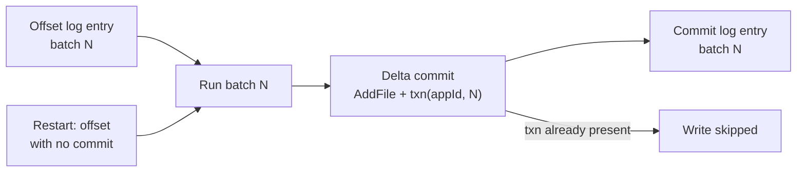

# 🧱 Databricks - AI Engineer Interview Questions

> **Last reviewed: October 2026.** Based only on public information - official pages, engineering blogs, and publicly shared candidate reports. Processes change and vary by team; treat this as a map, not a contract. No confidential or leaked material.

## TL;DR

- The loop is long and the coding bar is high: recruiter screen → 1-hour CoderPad phone screen → hiring-manager call → a 4-5 round virtual onsite. Candidate reports consistently describe LeetCode medium-**hard** with multi-part follow-ups, and a dedicated **concurrency/multithreading round** that most people call the hardest hour.
- System design is reported to run in a **shared doc rather than a whiteboard** - you're evaluated on written technical communication, and problems skew towards distributed data systems (their actual business).
- For AI engineer / GenAI roles (Mosaic AI lineage), expect a design round on **RAG, agents, fine-tuning, and LLMOps** on top of the standard coding bar - not instead of it.
- The customer-facing AI roles (Forward Deployed Engineer, Specialist Solutions Architect) add a **customer-scenario/advisory round**: scoping an ambiguous business problem and defending architecture tradeoffs to a non-expert.
- **Reference checks are a formal stage** on their official process page and reportedly carry real weight; team match happens late, and a meaningful fraction of candidates land on a different team than they applied to.

## Company context

Databricks builds the lakehouse platform - Spark, Delta Lake, MLflow, Unity Catalog - plus a first-party GenAI stack (Mosaic AI, from the 2023 MosaicML acquisition): model serving with an AI Gateway, vector search, fine-tuning, Agent Bricks for building agents, MLflow 3 for GenAI tracing and evaluation, and Lakebase, a managed serverless Postgres for operational data next to the lakehouse. DBRX, its 2024 open MoE model, is no longer part of that story: it was fully retired from Databricks hosting in December 2025, and the hosted catalogue now serves third-party frontier and open models. Data + AI Summit 2026 (June) leaned further into agents and operational data: an expanded Agent Bricks with sandboxed execution and memory, Lakebase branching and in-Postgres hybrid search (beta), and an announced LTAP architecture to unify transactional and analytical storage. Engineers want in because it's one of the few places where hard distributed-systems problems (query engines, storage, streaming) and applied GenAI ship in the same product to thousands of enterprises. "AI engineer" at Databricks means two distinct things: product/research engineers building the Mosaic AI platform itself, and field-side engineers (FDE, Specialist SA) building production GenAI systems *on* the platform for customers - the interview loops differ accordingly.

## Roles & titles they hire

Titles observed on their careers site and public postings:

- **Software Engineer** (backend, distributed systems, ML platform) - the core engineering ladder
- **AI Engineer - FDE (Forward Deployed Engineer)** - professional-services team building customer GenAI apps; the posting explicitly asks for RAG, multi-agent systems, Text2SQL, and fine-tuning experience with tools like Hugging Face, LangChain, and DSPy
- **Specialist Solutions Architect - GenAI & LLM** (field engineering) - pre/post-sales technical ML expert
- **GenAI Research Scientist / Research Engineer** (Mosaic AI research; also PhD intern pipeline)
- **Machine Learning Engineer / ML Platform Engineer**
- Adjacent: Solutions Engineer, Resident Solutions Architect, Data Scientist

## The interview loop

Public information is good: Databricks publishes an official interview-prep page (process stages, behavioural guidance, downloadable role-specific prep guides), and there are many detailed candidate reports for the SWE loop. AI-engineer-specific reports are thinner - rows below marked accordingly.

| Stage | Format | What's evaluated |
|---|---|---|
| Recruiter screen | ~30 min call | Background, role fit, logistics. Their official page stresses authenticity and warns explicitly against bringing prior-employer confidential material. |
| Technical phone screen | ~60 min, CoderPad | Algorithms/data structures; for AI roles, reportedly also data manipulation and ML concepts. Optimisation beyond brute force is expected. |
| Hiring manager call | ~1 hr, mostly behavioural | Experience deep dive, what you've built and owned, motivation for Databricks. (reported, common for senior roles) |
| Onsite: coding ×2 | 1 hr each | LeetCode medium-hard; graphs, intervals, optimisation; multi-part follow-ups that stress code that survives changing requirements. (reported) |
| Onsite: concurrency | 1 hr | Custom multithreading problems (queues, workers, thread-safe components) - widely reported as the hardest round, not on LeetCode. (reported, varies by role/level) |
| Onsite: system design | 1 hr, in a shared Google Doc | Distributed data systems and, for AI roles, ML/LLMOps design - RAG pipelines, serving, evaluation. Written clarity is part of the signal. (reported) |
| Onsite: GenAI depth | 1 hr | AI roles only: hands-on depth with RAG, fine-tuning, agent frameworks, production LLM issues. (reported, varies) |
| Onsite: behavioural / customer scenario | 1 hr | Values and collaboration; for FDE/SA, acting as a technical advisor on an ambiguous customer problem. (reported) |
| Take-home | ~5 hrs, rare | Occasionally added after the onsite for some roles. (reported, uncommon) |
| References + committee | Formal stage | Reference checks are on the official process page; reports describe a hiring-committee review and late team matching - a sizable minority of candidates pivot teams post-onsite. |

Reported end-to-end timeline: ~3-8 weeks depending on role and scheduling.

The official prep page (consulted October 2026) names "skill assessments" as a stage before interviewing and states that interviews are virtual unless your recruiter specifies otherwise. It publishes no policy on AI-assistant use during interviews, so ask your recruiter before using one in any round.

## What they emphasise

- **A deliberately high coding bar.** Multiple public reports converge on "harder than FAANG average" - expect to be pushed past your first working solution to the optimal one, and to handle added constraints mid-problem.
- **Concurrency as a first-class skill.** Their products are distributed compute engines; the dedicated multithreading round reflects that. If you can't reason about locks, queues, and race conditions in your language of choice, fix that before anything else.
- **Written design communication.** Running system design in a doc instead of a whiteboard filters for engineers who can write a clear design proposal - the same skill their RFC-driven engineering culture uses daily.
- **Production pragmatism over research flash (for AI roles).** The FDE posting language is about *productionizing* GenAI - RAG, Text2SQL, agents that ship - and third-party guides consistently report that candidates are asked to defend evaluation strategy in the same breath as architecture. Knowing MLflow-style experiment tracking, monitoring, and cost/latency tradeoffs matters more than paper citations.
- **Customer empathy for field roles.** FDE/SA loops probe whether you can scope a vague business ask, push back on a bad customer idea gracefully, and translate architecture to non-experts.
- **Authenticity in behavioural rounds.** Their official prep page is unusually explicit: real examples ("tell me about a time..."), genuine conversation over polish, and hard compliance lines about confidential information.

## Representative questions

*Representative questions synthesised from this company's publicly known focus areas and role descriptions - not leaked questions.*

### 1. Implement a thread-safe batching logger: many producer threads call `log(msg)`, and a background thread flushes batches of up to 100 messages every second or when full, whichever comes first.

<details><summary><b>Answer</b></summary>

The core is a bounded queue plus a flusher that waits on *two* conditions: batch full or timeout. A `queue.Queue` gets you 80% of the way; the interesting part is the flush loop and shutdown.

```python
import queue, threading, time

class BatchLogger:
    def __init__(self, sink, batch_size=100, interval=1.0):
        self.q = queue.Queue(maxsize=10_000)   # backpressure, not unbounded RAM
        self.sink, self.batch_size, self.interval = sink, batch_size, interval
        self._stop = threading.Event()
        self._t = threading.Thread(target=self._run, daemon=True)
        self._t.start()

    def log(self, msg):
        self.q.put(msg)                        # blocks when full: backpressure

    def _run(self):
        while not self._stop.is_set() or not self.q.empty():
            batch, deadline = [], time.monotonic() + self.interval
            while len(batch) < self.batch_size:
                timeout = deadline - time.monotonic()
                if timeout <= 0: break
                try:
                    batch.append(self.q.get(timeout=timeout))
                except queue.Empty:
                    break
            if batch:
                self.sink(batch)

    def close(self):
        self._stop.set(); self._t.join()
```

Points to narrate: bounded queue gives backpressure (dropping vs. blocking is a product decision - say so); `time.monotonic()` not `time.time()`; drain-on-shutdown so no messages are lost; the flusher owns the batch so no lock is needed around it. If asked for multiple flushers, batches stay independent per worker - only the sink needs to be safe.

**Follow-ups:** What changes if `sink` can fail - where do retries live and what happens to ordering? How would you drop messages under overload without blocking producers?

</details>

### 2. You have a stream of billions of events and need the top-K most frequent keys with bounded memory. Exact answer impossible - what do you do?

<details><summary><b>Answer</b></summary>

State the constraint honestly first: exact top-K over a stream needs O(distinct keys) memory, so at billions of events you either shard the exact computation or accept approximation.

Approximate, single pass: **Count-Min Sketch** for frequency estimates (a 2D array of counters, d hash functions; width w gives error ≈ N/w with overestimation only) plus a min-heap of the current top-K candidates. Per event: update sketch, query estimate, push/update the heap if the estimate beats the heap minimum. Memory is O(w·d + K), independent of key cardinality. Alternative: **Misra-Gries / Space-Saving**, which keeps K counters and gives deterministic error bounds and is often better when the distribution is skewed - which real event streams almost always are (heavy hitters are exactly the skewed case these algorithms are built for).

Exact, distributed: hash-partition keys across workers (same key always lands on the same worker), each worker keeps exact local counts and local top-K, then merge - correct because global top-K must be in some worker's local top-K when partitioned by key. This is precisely a Spark `reduceByKey` followed by a `takeOrdered`, and it's worth saying that: map-side combining means you shuffle one partial count per key per partition, not one record per event.

Tradeoffs to volunteer: approximation error tolerance, whether keys are adversarial (CMS overestimates collide), and windowing - "top-K today" needs decay or tumbling windows, not lifetime counts.

**Follow-ups:** How do you handle a single key so hot it skews one partition? What changes for a sliding 5-minute window?

</details>

### 3. A Spark job that joins a 2 TB fact table to a 50 GB dimension table has one straggler task running 100× longer than the rest. Diagnose and fix it.

<details><summary><b>Answer</b></summary>

One straggler in a join is data skew until proven otherwise: one join key (often null, empty string, or a default ID) owns a huge fraction of rows, so the shuffle hash-partitions that key onto a single task.

Diagnose: Spark UI → stage view → task-level shuffle read sizes; if the max task read is orders of magnitude above the median, it's skew. Confirm with a quick `GROUP BY key ORDER BY count DESC LIMIT 10` on the join column.

Fixes, in order of preference:

1. **Filter or special-case the pathological key.** If it's nulls, they don't join anyway - filter and union back.
2. **AQE skew-join handling** (`spark.sql.adaptive.skewJoin.enabled`, on by default in modern Spark/Databricks): splits oversized partitions automatically. Check why it didn't fire (thresholds, or the plan isn't a sort-merge join).
3. **Broadcast the dimension table.** 50 GB is above default broadcast thresholds, but if you can project it down to the joined columns and it fits in executor memory, a broadcast join eliminates the shuffle of the fact table entirely - no shuffle, no skew.
4. **Salting**: append a random suffix 0..n to the hot key on the fact side, explode the dimension side n ways, join on (key, salt). Classic, but it's the manual fallback, not the first move.

Mentioning that AQE has made hand-salting mostly legacy - and knowing when it still fails - is exactly the practical depth this signals.

**Follow-ups:** When does broadcasting make things worse? How does a shuffle-hash join differ from sort-merge here?

</details>

### 4. Design a RAG system over an enterprise's data: 10M documents in object storage plus structured tables, with per-user access controls. Walk me through the architecture and how you'd evaluate it.

<details><summary><b>Answer</b></summary>

Architecture in four planes:

**Ingestion:** incremental pipeline (new/changed docs only) → parse → chunk (structure-aware: headings, tables kept intact; ~512-1024 tokens with overlap) → embed → vector index. Store chunks with source URI, ACL tags, and timestamps. On a lakehouse this is naturally a Delta table with a vector index synced from it, which buys you time travel and reprocessing for free.

**Retrieval:** hybrid - dense vectors plus keyword/BM25, merged with reciprocal rank fusion, then a cross-encoder reranker over the top ~50. Hybrid matters in enterprises because queries are full of exact identifiers (SKUs, error codes) that embeddings blur. **Enforce ACLs as a filter inside the retrieval query, not post-retrieval** - post-filtering leaks information through result counts and can return empty pages; and never let the LLM see chunks the user can't.

**Generation:** system prompt with citation requirements; answer must ground each claim in retrieved chunk IDs; refuse when retrieval confidence is low rather than improvise.

**Evaluation:** two layers. Retrieval: recall@k and MRR against a golden set of (question, relevant-chunk) pairs - build ~200 from real user questions, not synthetic only. End-to-end: LLM-as-judge scoring groundedness (claims supported by context), relevance, and citation correctness, spot-audited by humans; track per-release in experiment tracking so regressions are visible before deploy.

Structured tables get a different path: route those questions to a Text2SQL tool rather than embedding table rows.

**Follow-ups:** How do you keep the index fresh within minutes of a document changing? Where does this design break at 100M documents?

</details>

### 5. When would you fine-tune a model instead of using RAG or prompt engineering - and if you do fine-tune, LoRA or full fine-tuning?

<details><summary><b>Answer</b></summary>

Decision rule: **RAG for knowledge, fine-tuning for behaviour.** If the failure mode is "the model doesn't know X" and X changes over time or needs citations/ACLs, fine-tuning is the wrong tool - baked-in knowledge goes stale, can't be permissioned, and can't be attributed. If the failure mode is "the model knows enough but won't behave" - output format, domain style, a specialized task like Text2SQL on your dialect, or a small model that must match a big model's quality on one narrow task - that's fine-tuning territory. Prompt engineering is always step zero because its iteration loop is minutes, not days; escalate only when a well-engineered prompt plus few-shot examples plateaus below the quality bar, and you have the eval to prove it plateaued.

LoRA vs. full fine-tuning: LoRA trains low-rank adapters (typically <1% of weights), cutting GPU memory dramatically, enabling many task-specific adapters over one base model, and reducing catastrophic forgetting; quality is comparable to full fine-tuning for most instruction-following and style tasks. Full fine-tuning earns its cost mainly when you're shifting the model substantially - heavy domain adaptation, continued pretraining on domain corpora, or when adapters demonstrably underperform on your eval. Practical default: QLoRA-style tuning on a strong open base model, judged against a held-out eval set that existed *before* training started.

The meta-answer interviewers want: you reach for the cheapest intervention first and you have measurements driving each escalation.

**Follow-ups:** Your fine-tuned model regressed on general instruction-following - what happened and what do you do? How much training data before fine-tuning beats few-shot prompting?

</details>

### 6. A customer's LLM endpoint p99 latency jumped from 2s to 20s this week. No code changes on their side. Debug it.

<details><summary><b>Answer</b></summary>

Structure the search: latency = queueing + prefill + decode. Something changed in traffic, inputs, or the serving layer even if "no code changed."

1. **Queueing first.** Check requests-in-flight and queue depth vs. last week. If traffic grew or got burstier and the endpoint didn't scale, p99 explodes while p50 barely moves - the classic saturation signature. Fix: autoscaling, admission control, or more capacity.
2. **Input drift.** Pull token-count distributions. A new upstream feature (say, someone started stuffing 50-page docs into context) makes prefill quadratic-ish pain; longer outputs stretch decode linearly. p99 specifically points at the tail of the input distribution - a few huge requests can also head-of-line-block batches in the server.
3. **Output length.** Did responses get longer (prompt change upstream, model rambling on new input types)? Decode dominates latency at ~tens of ms/token; 500 extra tokens is 10+ seconds on many setups.
4. **Serving layer.** Cold starts from scale-to-zero, a provider-side model version bump, KV-cache memory pressure forcing smaller batches or preemptions, GPU contention on shared capacity.

Instrument to separate these: time-to-first-token (isolates queueing+prefill) vs. total time, per-request token counts, batch sizes. TTFT flat but total up → outputs got longer. TTFT up, queue empty → prefill/inputs. TTFT up with deep queue → saturation.

Then the durable fix: alert on token distributions and TTFT, cap max input/output tokens, and load-test at realistic burstiness, not average QPS.

**Follow-ups:** How does continuous batching change this analysis vs. static batching? What would you cap first - input tokens or output tokens - and why?

</details>

### 7. Design a Text2SQL agent for business users querying a warehouse with 5,000 tables. What's hard, and how do you evaluate it?

<details><summary><b>Answer</b></summary>

The hard part isn't SQL generation - frontier models write fine SQL - it's **schema retrieval and semantics**. 5,000 tables can't fit in context, and the model can't know that `revenue` means `gross_bookings_usd` net of refunds.

Architecture: (1) **Schema retrieval** - embed table/column names, descriptions, and sample values; retrieve candidate tables for the question; include a curated semantic layer (certified metric definitions, join paths) so the model composes blessed building blocks instead of guessing joins. (2) **Generation** with few-shot examples of real question→SQL pairs from that workspace. (3) **Validation loop** - run `EXPLAIN`/dry-run, catch errors, feed them back for self-correction (2-3 attempts max). (4) **Guardrails** - read-only warehouse principal, row limits, timeout, cost caps; the agent inherits the *user's* permissions so it physically cannot read tables the user can't. (5) **Human trust loop** - show the SQL and the tables used; let users flag wrong answers; harvest corrections as few-shot examples and semantic-layer fixes.

Evaluation is the differentiator: **execution accuracy** (run generated SQL and gold SQL, compare result sets - not string match, since many correct SQLs exist) on a golden set built from real analyst queries; track per-difficulty-tier (single table / joins / window functions). Also measure the *abstention* rate - a system that says "I can't answer that reliably" beats one that returns confidently wrong numbers, because a single wrong revenue figure to an exec destroys adoption.

**Follow-ups:** A user asks "why did sales drop last quarter?" - not a SQL question. What does the agent do? How do you stop plausible-but-wrong joins between tables that share column names?

</details>

### 8. Take a working GenAI agent prototype to production for an enterprise. What's your checklist between demo and launch?

<details><summary><b>Answer</b></summary>

The demo-to-production gap is where field AI engineering lives. My checklist, roughly in order:

**Evaluation harness before anything else.** Freeze a golden dataset from realistic inputs; define metrics (task success, groundedness, safety violations); run it on every change - prompt, model version, retrieval config. Without this, every "improvement" is vibes, and you can't safely take model upgrades later.

**Failure-mode hardening.** Timeouts and retries with idempotency on every tool call; graceful degradation when a tool is down (say so, don't hallucinate the result); max-iteration caps and cost budgets per request so an agent loop can't spend unbounded money.

**Observability.** Full traces - every LLM call, tool call, retrieval - with latency, token counts, and cost per request. You need to answer "why did the agent do that?" for a specific production request three weeks later. MLflow-style tracing or equivalent, plus dashboards on quality-proxy metrics (user thumbs-down rate, escalation rate, abstention rate).

**Security and governance.** Least-privilege service principals per tool; the agent acts with the *end user's* permissions on data; prompt-injection posture for any tool that reads untrusted content (a retrieved document is untrusted input); audit logs.

**Release engineering.** Version prompts and configs like code; shadow-mode or A/B rollout against the eval harness and live traffic; a rollback path measured in minutes.

**Human factors.** Feedback capture in the UI, a triage loop that turns bad outputs into eval cases, and an owner for that loop after launch - the system decays without one.

**Follow-ups:** Which of these do you cut when the customer wants launch in three weeks? How do you decide the quality bar is met - who signs off?

</details>

### 9. Given a list of allowed IP ranges as CIDR blocks plus explicit deny ranges, implement `is_allowed(ip)` efficiently for millions of checks per second.

<details><summary><b>Answer</b></summary>

Convert everything to integer intervals and answer with binary search - CIDR blocks are just aligned ranges over the 32-bit IP space.

Preprocessing: parse each CIDR `a.b.c.d/p` into `[base, base + 2^(32-p) - 1]`. Apply denies as interval subtraction from allows (deny wins on overlap - state that precedence assumption out loud). Then merge overlapping/adjacent allow intervals into a sorted, disjoint list.

```python
import bisect

class IPFilter:
    def __init__(self, allow_cidrs, deny_cidrs):
        allows = merge(sorted(to_interval(c) for c in allow_cidrs))
        denies = merge(sorted(to_interval(c) for c in deny_cidrs))
        self.intervals = subtract(allows, denies)   # disjoint, sorted
        self.starts = [s for s, _ in self.intervals]

    def is_allowed(self, ip: str) -> bool:
        x = ip_to_int(ip)
        i = bisect.bisect_right(self.starts, x) - 1
        return i >= 0 and x <= self.intervals[i][1]
```

Lookup is O(log n) with tiny constants - comfortably millions of QPS on one core. The interval-subtraction sweep is the fiddly part: walk both sorted lists, emitting the allowed fragments around each deny; off-by-one at boundaries is where this problem eats candidates, so test adjacent ranges (`x.x.x.255` / next `.0`) explicitly.

Scale follow-ups to anticipate: IPv6 → same algorithm, 128-bit ints (fine in Python); frequent rule updates → rebuild is O(n log n), or use a compressed trie (LPM, as in routing tables) if updates must be incremental; per-tenant rule sets → one structure per tenant.

**Follow-ups:** Rules update every few seconds while lookups continue - how do you swap safely under concurrency? When does a trie beat binary search here?

</details>

### 10. A customer insists on fine-tuning an open model on their support tickets because "we want our own model." You think RAG over their knowledge base solves it. What do you do?

<details><summary><b>Answer</b></summary>

This is the trusted-advisor round: the wrong answers are "the customer is always right" (you'll own a failed project) and "actually you're wrong" (you'll lose the room).

First, **interrogate the goal behind the ask.** "Own model" usually encodes a real requirement: data privacy (tickets can't go to an external API), cost control, latency, or an executive mandate for AI ownership. Each of those has solutions that don't require fine-tuning - self-hosted open models with RAG satisfy privacy and ownership, for instance. Name the underlying requirement and show it's met.

Second, **make the disagreement empirical instead of rhetorical.** Propose a two-week bake-off: RAG baseline vs. their fine-tuning plan, judged on an eval set built from real resolved tickets, with success criteria agreed *before* results exist. This respects their hypothesis while protecting the outcome - and it surfaces the fine-tuning practicalities they haven't priced: labelled data curation, stale knowledge the moment policies change, retraining cadence, no per-document access control, no citations for agent trust.

Third, **frame the honest hybrid**: RAG for the knowledge (fresh, cited, permissioned), and revisit a light fine-tune later for tone/format if the eval shows a gap prompting can't close. That gives them a path where "your own model" remains on the roadmap, contingent on evidence.

Close with the commitment: document the decision and criteria in writing so the tradeoff survives personnel changes on both sides.

**Follow-ups:** The bake-off ties - RAG and fine-tuning score the same. What do you recommend and why? What if the executive mandate really is just "we must say we trained a model"?

</details>

### 11. A Structured Streaming job reads Kafka and writes to a Delta table. The cluster is killed mid-batch and restarts. Does the customer get duplicate rows? Explain at the level of the checkpoint and the transaction log.

<details><summary><b>Answer</b></summary>

No duplicates, and it is worth being precise about why, because the guarantee comes from three cooperating pieces rather than from the engine being clever.

**The checkpoint is a write-ahead log of offsets.** Before batch N runs, the engine records that batch's Kafka offset range in the checkpoint's offset log; after the batch finishes it writes an entry to the commit log. On restart, an offset entry with no matching commit means batch N was in flight, so the engine replays it over exactly the same offset range. Deterministic re-execution is what makes the retry safe.

**The Delta sink makes that replay idempotent.** Each micro-batch commits one atomic JSON file into `_delta_log` holding the AddFile actions plus a transaction action recording (application id, batch id). If the log already carries that pair, the replayed write is a no-op. And because a commit is a single atomic file, readers never see half a batch.

**Where it actually breaks** is the real question. `foreachBatch` writing to an external system gets none of this unless you pass the transaction identifiers through or dedupe yourself, and two writes inside one `foreachBatch` need distinct application ids. Non-deterministic logic (`current_timestamp()`, random sampling, a join against a table that keeps changing) means the replay is not the same batch. Deleting or relocating the checkpoint loses the offsets outright. Kafka retention that has aged past the stored offsets either fails or silently skips depending on `failOnDataLoss`. And exactly-once into Delta says nothing about side effects the batch already performed, such as emails sent.

**Worth sketching.** The two logs do different jobs: the checkpoint decides what to replay, the transaction log decides whether the replay lands.



**Follow-ups:** The customer wants exactly-once from `foreachBatch` into Postgres. What do you build? What does the transaction log give you here that a plain Parquet directory sink cannot?

</details>

### 12. An agent you shipped for a customer four months ago runs on a base model the provider is deprecating in 60 days. How do you swap the model without regressing quality, and what had to be in place beforehand for that to be possible?

<details><summary><b>Answer</b></summary>

Most of the answer is about what you did four months ago. If the only asset is a notebook with prompts pasted inline, you cannot swap safely, you can only swap and hope. What must already exist:

- **Traces on every production request**: inputs, retrieved chunks, tool calls, outputs, latency, token cost, and whatever feedback the UI captures. MLflow tracing on Databricks exists for this, and the traces are the raw material for everything below.
- **A versioned evaluation dataset built from those traces**, not from synthetic questions alone, including the failure cases you have fixed since launch, governed in Unity Catalog so it has lineage instead of living as a CSV on someone's laptop.
- **Scorers you trust**: LLM judges for groundedness, correctness and safety, plus cheap deterministic checks specific to the task (the JSON parses against the schema, the generated SQL executes, every claim carries a citation id).
- **Prompts and agent config versioned as artefacts**, with serving pointed at a registry alias rather than a pinned version, so promotion and rollback are one pointer move.

The swap itself: register the challenger, run the eval offline, and compare per slice rather than on the aggregate mean, because regressions concentrate in slices (long documents, one language, one tool path) while the average looks fine. Budget for prompt re-tuning, since prompts do not transfer cleanly across model families. Then canary or shadow a fraction of live traffic with scoring on a sample, watching cost and latency next to quality: a cheaper model that emits far more tokens per answer can lose on both. Move the alias when the slices hold, and keep the previous version registered so rollback takes minutes.

The same discipline applies whether the agent was assembled through the low-code path (Agent Bricks) or written against the code-first framework. Say the unglamorous part too: someone owns feeding new production failures back into the eval set, or it ages into a benchmark you have quietly overfitted.

**Follow-ups:** The challenger wins overall but loses on your two most important customer slices. What do you ship? How large does the eval set need to be before you would trust a small score difference?

</details>

### 13. An agent needs durable operational state - conversation memory, pending human approvals, idempotency records for tool calls - and the business wants analytics over all of it. With managed Postgres (Lakebase) next to your Delta tables, how do you split the data and why?

<details><summary><b>Answer</b></summary>

State the agent reads and writes inside a request goes in Postgres; history and analytics go in Delta; the bridge between them is one-directional and boring.

**Why Postgres for the hot path.** Approvals and idempotency need transactions and row-level concurrency. "Insert the idempotency key; on conflict, return the stored result" is one statement against a unique constraint. An approval state machine (pending, approved, executed) needs a conditional update or `SELECT ... FOR UPDATE` so two workers can never both execute the same approved action. Millisecond single-row reads and writes are what an OLTP engine is for. Delta commits are file-level and built for throughput: thousands of tiny concurrent writes produce commit conflicts and small-file debt, and there are no row locks.

**Memory.** Per-user memory is small and read on every turn, so it belongs in Postgres too; in-Postgres vector search (in beta on Lakebase as of mid-2026) is enough for thousands of items per user. The large shared document corpus stays in the lakehouse vector index. Do not conflate the two.

**Delta for analytics.** Completed sessions, traces, approval latency and tool error rates flow from Postgres into Delta through CDC or a scheduled export, where they join with business data under Unity Catalog. Databricks has announced LTAP to remove that hop by writing row data to columnar Delta/Iceberg; until it ships and proves out, budget for sync lag and schema evolution. Never point dashboards at the OLTP primary.

**Branching** is the underrated feature: a copy-on-write branch of production state lets you test a new agent version or schema migration against realistic data, then throw it away.

Governance cuts across both: the agent's database role is scoped to its own schema, and a deletion request must propagate to Postgres, Delta and the trace store.

**Follow-ups:** A user invokes the right to be forgotten - walk the deletion through every store. Two workers pick up the same approved action at once - what prevents double execution?

</details>

## How to prepare

Priority order for this repo's topics:

- **[12-coding-challenges](ML%20Prep/AI%20Fundamentals/AI-Engineer-Interview-Questions/12-coding-challenges/README.md)** - highest ROI. Databricks' coding bar is reported as harder than most big-tech loops; drill graphs, intervals, heaps, and streaming/top-K patterns, and practice narrating optimisation from brute force to optimal. Add dedicated **concurrency practice** (producer/consumer, thread pools, thread-safe caches) - this round is repo-external but load-bearing.
- **[04-rag-and-retrieval](ML%20Prep/AI%20Fundamentals/AI-Engineer-Interview-Questions/04-rag-and-retrieval/README.md)** and **[06-agents-and-tool-use](ML%20Prep/AI%20Fundamentals/AI-Engineer-Interview-Questions/06-agents-and-tool-use/README.md)** - the GenAI depth round for AI roles maps directly: hybrid retrieval, chunking, reranking, agent loops, tool guardrails.
- **[07-evaluation-and-observability](ML%20Prep/AI%20Fundamentals/AI-Engineer-Interview-Questions/07-evaluation-and-observability/README.md)** - Databricks' AI-role loops reportedly ask you to defend evaluation strategy alongside architecture; golden sets, LLM-as-judge, execution accuracy for Text2SQL.
- **[08-inference-and-production](ML%20Prep/AI%20Fundamentals/AI-Engineer-Interview-Questions/08-inference-and-production/README.md)** - serving, batching, latency debugging, cost; the platform they sell is literally this.
- **[11-ai-system-design](ML%20Prep/AI%20Fundamentals/AI-Engineer-Interview-Questions/11-ai-system-design/README.md)** - practice writing designs in a doc, not sketching on a whiteboard, since their design round is reported to be Google-Docs-based.
- **[05-fine-tuning-and-alignment](ML%20Prep/AI%20Fundamentals/AI-Engineer-Interview-Questions/05-fine-tuning-and-alignment/README.md)** - LoRA vs. full FT tradeoffs and the RAG-vs-fine-tune decision come up repeatedly in AI-role reports.

Closest case studies: **[07-text-to-sql-agent](07-text-to-sql-agent.md)** (their FDE posting names Text2SQL explicitly, and it's a flagship platform capability) and **[01-enterprise-rag-assistant](01-enterprise-rag-assistant.md)** (the canonical customer engagement for their field AI teams).

Company-specific moves:

1. **Read their official interview-prep page and download the Engineering prep guide** from databricks.com/company/careers/interview-prep - few companies publish this much; not reading it is self-sabotage.
2. **Use the platform seriously.** Get a free Databricks account (they offer a free edition) and build something end-to-end: a Delta table, a vector search index, a served model endpoint. Field-role interviews reward candidates who've touched the actual product.
3. **Know Spark mechanics one level deeper than API calls**: shuffles, wide vs. narrow transformations, AQE, skew handling, broadcast joins. Even AI-role loops draw interviewers from a distributed-systems culture.
4. **Read the Databricks engineering blog and Mosaic AI research posts** - especially anything on agent evaluation, Agent Bricks, Lakebase, and serving - to speak their vocabulary (lakehouse, Unity Catalog governance, MLflow) in design rounds.
5. **Prepare the customer-advisory story** if you're interviewing for FDE/SA: two real anecdotes where you scoped an ambiguous stakeholder problem and one where you pushed back on a bad technical idea without losing the relationship.

## Sources

- [Databricks official interview prep page](https://www.databricks.com/company/careers/interview-prep) - process stages, virtual-by-default interviews, behavioural guidance, compliance rules (fetched October 2026)
- [Databricks careers / open positions](https://www.databricks.com/company/careers/open-positions) - role titles including AI Engineer - FDE and Specialist Solutions Architect - GenAI & LLM
- [interviewing.io - Databricks interview process & questions](https://interviewing.io/databricks-interview-questions) - SWE loop structure, difficulty, Google-Docs design round, references/committee details (fetched July 2026)
- [Dataford - Databricks AI Engineer interview guide](https://dataford.io/interview-guides/databricks/ai-engineer) - AI-engineer-specific loop and topic areas (third-party; fetched July 2026)
- [Blind - Databricks interview discussions](https://www.teamblind.com/company/Databricks/posts/databricks-interview) - candidate reports on loop length and coding bar (consulted via search)
- [MLflow 3 for GenAI - Databricks documentation](https://docs.databricks.com/aws/en/mlflow3/genai/) - tracing, built-in judges and custom scorers, evaluation datasets, prompt registry, Unity Catalog governance (fetched August 2026)
- [Databricks newsroom - Agent Bricks launch](https://www.databricks.com/company/newsroom/press-releases/databricks-launches-agent-bricks-new-approach-building-ai-agents) - the low-code agent-building path alongside the code-first framework
- [Databricks documentation - retired models](https://docs.databricks.com/aws/en/machine-learning/retired-models-policy) - DBRX retirement dates (pay-per-token April 2025, provisioned throughput December 2025)
- [Flexera - Data + AI Summit 2026 recap](https://www.flexera.com/blog/perspectives/databricks-data-ai-summit-2026-recap-genie-one-ltap-lakehouse-rt-and-every-major-launche/) - third-party; Agent Bricks, Lakebase branching and search, LTAP announcements
- [levels.fyi - Databricks](https://www.levels.fyi/companies/databricks) - for compensation data (not covered here)
