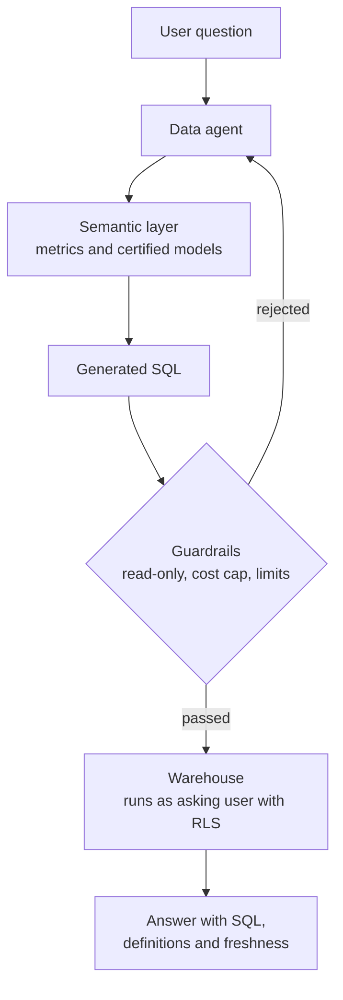

# 🧱 Data Engineer × AI - Interview Guide

You already know how to move data reliably. What changed is the payload and the sinks: unstructured documents instead of clean tables, embedding models inside the pipeline, vector stores as a new class of derived sink, and LLM APIs as an expensive, rate-limited transform step. Interviewers now test whether you can apply the discipline you already have - idempotency, incremental sync, backfills, quality checks, lineage - to this new stack. This guide maps the 2026 data-eng loop, calibrates depth per topic, and gives you the questions data engineers actually get at the AI boundary.

## How this role's interviews changed (2024 → 2026)

- **RAG ingestion became the flagship system-design prompt.** "Design a clickstream pipeline" still shows up, but "design the pipeline that gets 5M internal documents into a retrieval system - and keeps them fresh" is now at least as common. It's parsed as an ETL question: parsing, chunking, embedding, upserting, incremental sync, backfills. Candidates who treat it as an ML question instead of a pipeline question underperform.
- **Vector stores joined the list of sinks you're expected to sync.** CDC into a vector index, delete propagation, and re-index migrations when the embedding model changes get probed exactly the way warehouse-sync questions used to be - with extra attention on deletes, because a stale row in a warehouse is a metric error while a stale chunk in a RAG index is a wrong answer shown to a user.
- **A new dependency class inside pipelines: model APIs.** Embedding and LLM calls are transforms that cost real money per row, rate-limit in tokens, and fail non-deterministically. Interviewers ask for cost estimates ("what does enriching 50M rows cost?"), batch-API strategy, and retry/idempotency design the way they used to ask about skew in a join.
- **Data quality expanded from schema checks to corpus quality.** Dedup (exact and near-dup), PII redaction before content leaves your boundary, freshness SLAs for AI consumers, and "how would you detect that a parser silently started emitting garbage" are now standard probes.
- **"Design the data platform for an AI assistant" appears in senior loops.** It merges classic platform design (warehouse, streaming, orchestration, governance) with the AI-specific layers (document store, chunk/embedding pipelines, vector index, retrieval API, eval data flywheel). Lineage and access control carry more weight here than in the classic version.
- **Agents became warehouse consumers.** Text-to-SQL and data agents querying the warehouse, often through an MCP server over a semantic layer, pushed metric definitions, row-level security and query-cost guardrails into data-eng system design. "What does the platform need before an agent can answer business questions?" is a new senior prompt.
- **SQL and pipeline-coding rounds survived mostly intact.** Window functions, incremental models, and debugging a slow join are still asked. What got added: small practical exercises like "write the chunker," "dedup this corpus," or "design the schema for chunk metadata."
- **AI-assisted coding rounds arrived, and AI-tool fluency is graded.** At large companies the formalised versions are mostly SWE loops so far: Meta piloted an AI-enabled coding round in October 2025 and expanded it through 2026, Google began piloting a Gemini-assisted round for junior and mid-level SWE roles on select US teams in 2026 that scores prompting and output validation, and Amazon added an AI-assisted repository task to some online assessments while keeping live rounds AI-free (all reported, varies). Data teams are following, especially in take-homes and live pipeline exercises that allow Copilot, Cursor or Claude Code. For this role the graded skill is reviewing generated SQL and pipeline code: assistants write plausible joins that fan out, incremental filters that drop late data and MERGEs that aren't idempotent, and you're expected to catch them with data tests rather than by eye. Policies differ by company and by round, so confirm the rules for each one.
- **What got de-emphasised:** Hadoop-era trivia, Lambda-vs-Kappa debates as a standalone question, and deep distributed-systems internals for their own sake. Nobody asks you to derive attention math - but they will ask why you can't compare vectors from two different embedding models.

## What you're actually expected to know

**Expected - and probed hard:**

- Ingestion pipelines for unstructured data as ETL: parsing heterogeneous formats, chunking strategies and their tradeoffs, embedding as a batch transform, upsert semantics into a vector store.
- Incremental sync: CDC or event-driven updates from source systems into derived AI indexes, delete/ACL propagation, staleness monitoring, and full-backfill design (the embedding-model migration is the canonical backfill question).
- Data quality for AI: exact and near-duplicate detection at scale, PII detection/redaction placement in the DAG, freshness SLAs, and validation of LLM-produced output (it's just another untrusted upstream).
- Cost fluency: tokens as a billing unit, estimating an embedding or enrichment job's cost before running it, batch APIs vs real-time calls (batch is typically ~50% cheaper with hours-scale latency), and caching to avoid re-embedding unchanged content.
- Enough retrieval-eval vocabulary to defend a pipeline change: golden query sets, recall@k, and why "the pipeline ran green" doesn't mean retrieval didn't regress.
- Metadata, lineage, and governance: which document version produced which chunk, tenant/ACL tagging on every derived record, and deletes that actually propagate (right-to-be-forgotten).

**Not expected - stop over-preparing:**

- Transformer internals, backprop, or training dynamics. "Embedding models map text to vectors; vectors from different models aren't comparable" is nearly all the theory your loop requires.
- GPU serving, CUDA, vLLM internals. Know that batch inference exists and is cheaper; you will not be asked to size a GPU cluster.
- Fine-tuning mechanics. Know that fine-tuning creates a dataset-engineering problem (that part *is* yours) but nobody expects you to run a LoRA job in an interview.
- Prompt-engineering artistry or agent-framework trivia. You need enough to reason about what your pipelines feed downstream, not to design the agent.

If you can design an idempotent, incrementally-synced, cost-estimated pipeline whose output quality is measured rather than assumed, you're at the bar. The most common miscalibration for this role is grinding ML theory while under-preparing the boring things interviewers actually reward: backfills, deletes, and dedup.

## Study map

| Repo section | Depth | Why for this role |
|---|---|---|
| [01-ml-and-dl-foundations](ML%20Prep/AI%20Fundamentals/AI-Engineer-Interview-Questions/01-ml-and-dl-foundations/README.md) | ⚪ skim | You need embeddings, similarity metrics, and train/test vocabulary; skip the calculus - nobody asks a data engineer to derive gradients. |
| [02-llm-fundamentals](ML%20Prep/AI%20Fundamentals/AI-Engineer-Interview-Questions/02-llm-fundamentals/README.md) | 🟡 solid | Tokens, context windows, and embedding-model behaviour drive your pipeline's cost model and chunk-size decisions. |
| [03-prompt-engineering-and-context](ML%20Prep/AI%20Fundamentals/AI-Engineer-Interview-Questions/03-prompt-engineering-and-context/README.md) | 🟡 solid | Your chunks and metadata *are* the context; understand what downstream prompt assembly needs so your schema serves it. |
| [04-rag-and-retrieval](ML%20Prep/AI%20Fundamentals/AI-Engineer-Interview-Questions/04-rag-and-retrieval/README.md) | 🟢 deep | Your flagship round. Ingestion, chunking, hybrid retrieval, index sync, and re-embedding migrations are data-engineering problems wearing an AI costume. |
| [05-fine-tuning-and-alignment](ML%20Prep/AI%20Fundamentals/AI-Engineer-Interview-Questions/05-fine-tuning-and-alignment/README.md) | ⚪ skim | Know that fine-tuning is mostly a dataset problem (curation, dedup, formatting) - that framing is your only likely question here. |
| [06-agents-and-tool-use](ML%20Prep/AI%20Fundamentals/AI-Engineer-Interview-Questions/06-agents-and-tool-use/README.md) | ⚪ skim | Enough to understand agents as a consumer of your data APIs; agent-loop design belongs to backend/AI engineers. |
| [07-evaluation-and-observability](ML%20Prep/AI%20Fundamentals/AI-Engineer-Interview-Questions/07-evaluation-and-observability/README.md) | 🟢 deep | The data-side half is yours: golden sets, recall@k for retrieval, quality gates in pipeline CI, and monitoring corpus freshness/drift. |
| [08-inference-and-production](ML%20Prep/AI%20Fundamentals/AI-Engineer-Interview-Questions/08-inference-and-production/README.md) | 🟢 deep | Go deep on the batch and cost half - batch APIs, rate limits, token economics, caching. Skim GPU serving internals. |
| [09-safety-security-and-responsible-ai](ML%20Prep/AI%20Fundamentals/AI-Engineer-Interview-Questions/09-safety-security-and-responsible-ai/README.md) | 🟡 solid | PII redaction, ACL propagation into derived stores, and right-to-be-forgotten deletes land on your pipelines, not the model team's. |
| [10-multimodal](ML%20Prep/AI%20Fundamentals/AI-Engineer-Interview-Questions/10-multimodal/README.md) | ⚪ skim | Useful context for image/audio ingestion pipelines, but rarely a dedicated data-eng question. |
| [11-ai-system-design](ML%20Prep/AI%20Fundamentals/AI-Engineer-Interview-Questions/11-ai-system-design/README.md) | 🟢 deep | "Design the data platform for an AI assistant" is your senior round; practise it end to end with lineage and governance included. |
| [12-coding-challenges](ML%20Prep/AI%20Fundamentals/AI-Engineer-Interview-Questions/12-coding-challenges/README.md) | 🟡 solid | SQL rounds are largely unchanged, though more of them now allow an AI assistant and probe the SQL it writes; the new additions are chunker/dedup/pipeline exercises in Python. |
| [13-interview-process-and-behavioral](ML%20Prep/AI%20Fundamentals/AI-Engineer-Interview-Questions/13-interview-process-and-behavioral/README.md) | 🟡 solid | Have stories ready: a backfill that went sideways, a data-quality incident an AI feature surfaced, a cost blowup you caught, and how you use AI coding tools without shipping their bugs. |

## Role-specific interview questions

### 1. Design the ingestion pipeline that gets 5 million internal documents into a RAG system.

<b>Answer</b>

Treat it as ETL with two new transforms. **Extract:** connectors per source (Confluence, Drive, Jira, S3, the wiki nobody admits exists), landing raw bytes plus source metadata (doc ID, version, ACLs, timestamps) in object storage - the immutable raw zone you'll re-process from. **Transform:** parse to normalised text (format-specific parsers, structure preserved - headings, tables), chunk with strategy appropriate to the doc type, then embed via batched API calls. **Load:** upsert chunks + vectors + metadata into the vector store, keyed deterministically (`doc_id:version:chunk_seq`) so re-runs are idempotent.

Design points interviewers listen for:

- **Idempotency everywhere:** content-hash each doc; skip unchanged docs to avoid re-paying for embeddings. Deterministic chunk IDs make re-runs upserts, not duplicates.
- **The embedding step is the cost/bottleneck:** batch requests, respect token rate limits, use the provider's batch API for the initial load (~50% cheaper, latency doesn't matter for a backfill). Estimate the bill up front: 5M docs × ~2k tokens avg ≈ 10B tokens - put a number on it before running.
- **Poison documents:** the 400MB PDF, the encrypted file, the doc that crashes the parser. Dead-letter after N attempts; never let one doc stall the DAG.
- **Two lanes:** bulk backfill (throughput-optimised, batch API) and incremental updates (latency-optimised, streaming/CDC) sharing the same transform code.
- **Metadata is not optional:** ACLs, source, version, timestamps on every chunk - retrieval filters and deletes depend on it.

**Follow-ups:** How do you re-process everything when the chunking logic changes without double-serving old and new chunks? Where do quality checks go in this DAG?

### 2. Sources change constantly. How do you keep the vector index in sync - including deletes?

<b>Answer</b>

The vector index is a derived, eventually-consistent view; the design question is change capture, propagation latency, and - the part candidates skip - deletes.

**Change capture, in order of preference:** CDC from databases (Debezium-style) or source webhooks/events where available; polling with modified-since cursors where not; scheduled full-diff crawls as the fallback for sources with no change feed. Normalise everything into a change event stream (`doc_id, version, op: upsert|delete`) so the downstream pipeline is source-agnostic.

**Propagation:** consume the stream, re-parse/re-chunk/re-embed only changed docs (content-hash to skip false-positive change events), and swap chunks atomically per document - delete old chunk IDs for that doc version, insert new ones - so a doc is never half-updated in the index. Deterministic chunk IDs make this a straightforward delete-then-upsert.

**Deletes are the compliance-critical path.** A deleted or permission-revoked document must leave the index promptly - this is a data-leak problem, not a freshness nuisance. Handle: explicit delete events; tombstones for sources that only expose "it's gone" via diff; and a periodic reconciliation job comparing index contents against source-of-truth to catch missed events. Reconciliation is your safety net - at-least-once event delivery guarantees you'll eventually miss or duplicate something.

**Measure staleness** as its own metric: track lag from source-modified-time to index-visible-time, alert on the p95, and report it as an SLA (e.g., searchable within 5 minutes) - see the freshness question below.

**Follow-ups:** A source system's webhook was down for six hours - how do you detect and heal the gap? How do ACL changes (not content changes) flow through?

### 3. We're switching embedding models. There are 200M vectors in the index. Walk me through the migration.

<b>Answer</b>

First, the non-negotiable fact: vectors from different models aren't comparable - you cannot mix old and new vectors in one similarity search. So this is a full backfill with a blue/green cutover, not a rolling update.

**Plan:** (1) Stand up a new index (or namespace) for the new model. (2) Re-embed the entire corpus from the raw/parsed zone - this is why you kept raw text; re-embedding must not require re-crawling sources. (3) Use the batch API: 200M chunks × ~500 tokens ≈ 100B tokens; put a dollar estimate on it and get it approved *before* kicking off - this is the difference between an engineer and an incident. (4) While the backfill runs (days), dual-write: incremental updates go to both old and new indexes so the new one isn't stale at cutover. (5) **Evaluate before cutover:** run your golden query set against both indexes; the new model must beat or match recall@k. A new embedding model can be "better" on benchmarks and worse on your corpus. (6) Cut retrieval traffic over behind a flag, keep the old index warm for fast rollback, decommission after a soak period.

Failure modes to name: rate limits stretching the backfill (negotiate quota or shard across time), cost of a re-run if you find a parsing bug mid-backfill (checkpoint progress; make the job resumable), and the query-side embedding - query and corpus must use the same model, so cutover must flip both atomically.

**Follow-ups:** The backfill is 60% done and the provider deprecates the old model's endpoint - now what? How does chunking-logic versioning interact with embedding versioning?

### 4. How do you decide on a chunking strategy, and how do you know your chunking is any good?

<b>Answer</b>

Chunking is a data-modelling decision: you're choosing the retrieval unit, and the wrong grain silently caps retrieval quality no matter how good the embedding model is.

**Deciding:** start structure-aware, not fixed-size. Split on document structure (headings, sections, paragraphs) so chunks are semantically coherent; fall back to token-window splitting with overlap (~10-20%) only inside oversized sections. Size is a tradeoff: small chunks (~200-400 tokens) embed crisply and retrieve precisely but lose context; large chunks (~1-2k) preserve context but dilute the embedding and waste prompt budget. Doc type matters more than a universal number - FAQ pairs are natural units; contracts need clause-level chunks with parent-section metadata; tables should be extracted whole, not sliced mid-row. A useful pattern to name: store small chunks for matching but attach parent context (parent-document or heading breadcrumb) for what you actually feed the LLM.

**Knowing it's good - measure, don't vibe:** build a golden set of real queries with labelled relevant documents (mine actual search logs plus SME labelling; even 100-200 queries works). Report recall@k and MRR against it, and re-run on every chunking change - this is a regression test in pipeline CI, same as a dbt test. Complement with production signals: retrieval-score distributions, "no result above threshold" rate, and downstream thumbs-down rates segmented by source. If you can't show a before/after recall number for a chunking change, you changed the pipeline blind.

**Follow-ups:** Your golden set says the new chunker is better but users complain answers got worse - what's your hypothesis list? How do you chunk a 500-row table?

### 5. Why does deduplication matter more for an AI corpus than a warehouse, and how do you do it at scale?

<b>Answer</b>

In a warehouse, duplicates skew aggregates. In a RAG corpus, they're worse: top-k retrieval returns five near-identical copies of the same paragraph, crowding out diverse relevant context - you paid for k slots and got one answer's worth of information. Duplicates also multiply embedding cost, and conflicting near-duplicates (the 2023 policy and its 2025 revision) cause the classic RAG failure where the model confidently cites the stale copy.

**Exact dedup** is easy: content-hash at document and chunk level, dedupe on ingest. The real problem is **near-duplicates**: templated pages, forwarded email chains, copy-pasted wiki sections, versioned drafts. At scale the standard approach is MinHash + LSH: shingle the text, compute MinHash signatures, band them into LSH buckets so candidate pairs are found without O(n²) comparison, then verify candidates with actual Jaccard similarity above a threshold (~0.8-0.9). This is a well-trodden Spark-scale job. Embedding-based clustering also works but is costlier and best reserved for semantic near-dupes that survive MinHash.

**Policy beats mechanism** in the interview: when you find a near-dup cluster, which copy wins? Prefer canonical source systems over mirrors, newest version, most-linked page - and record the losers as aliases pointing at the canonical doc, so provenance survives. Run dedup continuously, not once: ingestion order means the duplicate can arrive before the canonical.

Bonus point: mention that dedup is equally critical for fine-tuning datasets - train/eval leakage via near-dupes inflates eval scores.

**Follow-ups:** Two near-duplicate docs have different ACLs - can you dedupe them? How do you tune the similarity threshold without labels?

### 6. Design PII handling for pipelines that feed documents into an LLM system.

<b>Answer</b>

Two exposure paths to control: content stored in derived stores (chunks, vectors, logs) and content sent to third-party model APIs. Handle it in the pipeline, because downstream can't un-see what you feed it.

**Placement:** detect and redact after parsing, before chunking/embedding - one enforcement point in the DAG that every lane (backfill and incremental) flows through. Redacting post-hoc from a vector store is nearly impossible: the PII is baked into embeddings and cached prompts.

**Detection is layered:** regex/checksum validators for structured PII (SSNs, credit cards - Luhn check to cut false positives), NER models for names/addresses, and dictionary matching for internal identifiers (employee IDs, customer numbers - often the highest-risk and least-covered class). Expect imperfect recall; say so, and design for it: risk-tier sources (HR docs vs public wiki) and apply stricter handling - or full exclusion - to high-risk tiers rather than trusting detection alone.

**Redaction choices:** irreversible masking for content that never needs PII downstream; tokenization/pseudonymisation (`[PERSON_1]` with a secured lookup) where the assistant legitimately needs to answer "who owns this account" for authorised users - that lookup table becomes your most sensitive asset. Preserve utility: consistent pseudonyms within a document keep the text coherent for embedding.

**Verify and govern:** sample-audit redacted output continuously (measured recall on a labelled set), log redaction counts per source as a drift signal (a sudden drop means a parser change broke detection), and document data flows to the model provider - zero-retention agreements and region constraints are questions you should expect from legal, so raise them first.

**Follow-ups:** A user's data-deletion request arrives - enumerate every derived store you must purge. How do you handle PII inside images or scanned PDFs?

### 7. You need to classify and summarise 50 million records with an LLM. Design the pipeline and estimate the cost.

<b>Answer</b>

This is batch enrichment - a transform step whose operator costs money per row and fails probabilistically. Estimate first: 50M rows × (say 800 input + 150 output tokens) ≈ 40B input / 7.5B output tokens. At small-model batch-API pricing this lands somewhere between a few thousand and a few tens of thousands of dollars depending on the model tier; at frontier-model real-time pricing it's an order of magnitude or more higher. Presenting that range - and the lever choices - *is* the answer's spine.

**Levers, in ROI order:** (1) Use the **batch API** - typically ~50% off, hours-scale turnaround, perfect for offline enrichment. (2) **Smallest model that passes eval:** run a 1k-row sample through candidate models, measure agreement against labels, pick the cheapest one above the quality bar. (3) **Prompt caching:** static instructions first, per-row content last. (4) **Skip unchanged rows** on re-runs via content hashing - enrichment pipelines get re-run, and re-paying for 50M rows because of one prompt tweak is the classic blowup. (5) Truncate inputs to what the task needs.

**Pipeline mechanics:** shard rows into batch jobs, track state per shard (submitted/completed/failed), validate every output against a schema (Pydantic; enums for classification labels), route failures - malformed JSON, refusals, low-confidence - to a retry-once-then-dead-letter path. Treat model output as untrusted upstream data: land it in a staging table with the model version, prompt version, and timestamp stamped on every row, run quality checks (label distribution vs sample expectations), then merge. Never overwrite source data; enrichment is an appended, versioned column set.

**Follow-ups:** The label distribution shifts halfway through the run - bug or data? How do you re-enrich when the prompt improves, without paying full price?

### 8. Product wants the assistant to answer from data no older than 15 minutes. How do you design and monitor that freshness SLA?

<b>Answer</b>

First, negotiate scope like you would any SLA: "all data" is rarely the real requirement. Usually it's a small hot subset (ticket status, inventory, account state) that needs minutes-fresh, while the document corpus can be hours-fresh. Split the architecture along that line instead of forcing the whole pipeline to 15 minutes.

**Hot path:** for structured, fast-changing facts, don't embed at all - that's a tool-call/live-query pattern (the assistant fetches from an API or serving DB at answer time). Embedding a value that changes every minute guarantees staleness; fresh-by-construction beats fresh-by-pipeline. **Warm path:** for genuinely fresh *content* (new tickets, edited docs), event-driven ingestion - CDC/webhook → stream → parse/chunk/embed → upsert - sized so p95 end-to-end lag stays inside budget. The embedding call is your latency floor (seconds), so 15 minutes is comfortable; 15 seconds would force a different design.

**Monitoring - measure the SLA as data lineage, not job success:** stamp every chunk with `source_modified_at` and `index_visible_at`; the difference is per-record freshness lag. Dashboards on p95/p99 lag per source; alert on breach *and* on silence (a dead webhook produces no lag data - track expected-event-rate per source, alert on anomalous quiet). Synthetic canaries close the loop: write a probe doc to each source every few minutes and measure time until it's retrievable - this catches whole-pipeline failures that per-stage metrics miss.

Also surface staleness downstream: attach freshness metadata to retrieved chunks so the assistant can say "as of 10:42" - turning residual staleness from a silent wrong answer into a caveat.

**Follow-ups:** A backfill floods the queue and pushes incremental lag past SLA - how do you isolate the lanes? What do you do when one source *can't* meet the SLA?

### 9. Design the data platform for a company-wide AI assistant.

<b>Answer</b>

Layer it like a lakehouse with two new tiers, and lead with governance because that's what distinguishes this from a demo.

**Source layer:** connectors for structured systems (warehouse, app DBs) and unstructured ones (wiki, Drive, Slack, tickets, email), each emitting content plus authoritative metadata: owner, ACLs, timestamps, version. **Raw/landing zone:** immutable raw copies in object storage - every downstream layer must be rebuildable from here (re-chunk, re-embed, re-redact without re-crawling). **Processing tier:** parse → redact PII → chunk → embed as versioned, idempotent transforms under an orchestrator; two lanes (bulk backfill, incremental CDC) sharing transform code. **Serving tier:** vector index + lexical index (hybrid retrieval) for content; the warehouse/semantic layer for structured questions - text-to-SQL over a governed semantic layer beats embedding tables; and live tool-call APIs for real-time facts. The assistant's retrieval API fans out across these.

**Cross-cutting, where senior candidates win:** (1) **Access control** - ACLs propagate to every chunk and are enforced as query-time filters; the assistant must never retrieve what the asking user can't read. (2) **Lineage** - chunk → doc version → source, both for debugging ("why did it say that?") and deletes. (3) **Quality gates** - dedup, freshness monitors, retrieval eval sets run in CI. (4) **Feedback flywheel** - log queries, retrieved chunks, and user feedback back into the warehouse; that corpus drives eval sets and content-gap analysis. (5) **Cost accounting** - token metering per source and per feature.

State the SLAs explicitly: freshness per source tier, retrieval latency, delete-propagation deadline.

**Follow-ups:** Where does text-to-SQL fit versus RAG over documentation? Which single component would you build first to de-risk the design?

### 10. Why does the AI team keep asking you for lineage, and what does lineage mean for RAG data?

<b>Answer</b>

Because in an AI system, lineage is no longer just an audit artifact - it's on the runtime path. Three concrete needs:

**Debugging wrong answers.** "Why did the assistant say the refund window is 60 days?" must decompose into: which chunks were retrieved → which document version each came from → which pipeline run (parser version, chunker version, embedding model version) produced it. Without that chain, every quality incident is unreproducible. The practical implementation: every chunk carries `doc_id`, `doc_version`, `source_system`, `pipeline_run_id`, and transform versions as metadata; every assistant response logs its retrieved chunk IDs. That join answers the question in one query.

**Deletes and compliance.** Right-to-be-forgotten and ACL revocation require finding every derived artifact of a source document: chunks, vectors, caches, enrichment rows, eval sets, logged prompts. That's a reverse-lineage query. If you can't enumerate the derivatives, you can't delete them - and "we can't delete it" is a legal problem.

**Trust and citations.** The assistant citing its sources is lineage surfaced to the end user; stale or broken citations are lineage bugs.

The change from classic lineage tooling: granularity drops from table-level to record/chunk-level, and it must be queryable at low latency, not reconstructed from Airflow metadata after the fact. Cheapest robust design: treat lineage fields as mandatory columns on every derived record, stamped by the pipeline itself, rather than a separate lineage system bolted on later. Version everything that changes output: parser, chunker, redactor, embedding model, prompt templates for enrichment.

**Follow-ups:** A parser bug corrupted some fraction of chunks over three weeks - how does lineage bound the blast radius? What lineage do you attach to LLM-*generated* (enriched) columns?

### 11. Document parsing at scale: PDFs, HTML, spreadsheets, email, scans. What breaks and how do you build for it?

<b>Answer</b>

Parsing is the highest-entropy stage of the pipeline - garbage here silently poisons everything downstream, because a badly parsed doc still embeds and still retrieves; it just retrieves as noise.

**What breaks:** PDFs are the worst offenders - multi-column layouts read in the wrong order, tables flatten into word soup, headers/footers repeat into every chunk, and scanned PDFs contain no text at all (route to OCR, which has its own error profile). HTML brings boilerplate: nav bars and cookie banners can dominate extracted text. Spreadsheets aren't documents - a row usually only makes sense with its headers, so serialize row-wise with headers attached or extract as structured data instead. Email threads contain quoted history - parse the thread structure or every reply duplicates the whole chain (see dedup). And formats drift: a source system upgrade changes its export format and your parser degrades *silently*.

**Building for it:** a parser registry keyed by MIME type + source, each parser versioned (lineage again); a normalised intermediate representation (text + structure: headings, tables, lists) so chunkers are parser-agnostic; per-document error isolation with dead-lettering - one pathological file must never stall the DAG. Most importantly, **parse-quality checks as data-quality checks**: extracted-text-length vs file-size ratio, garbled-character rate, language detection, empty-output rate per source - tracked over time and alerted on shift, because that's how you catch silent format drift. Sample-based human review of parsed output for new sources before enabling them.

Mention the buy option: vision-LLM parsing for hard layouts is now viable but costs per page - use it as the fallback tier for docs that fail cheap parsers, not the default.

**Follow-ups:** How do you detect that a parser regression shipped, given the pipeline still runs green? When is OCR + vision-model parsing worth the cost?

### 12. How do you evaluate whether a pipeline change - parser, chunker, embedding model - made retrieval better or worse?

<b>Answer</b>

The same discipline as testing a dbt model change, with an IR twist: pipeline-green does not mean quality-neutral, so you need a regression suite for retrieval quality.

**The core asset is a golden set:** 100-500 real queries (mined from actual assistant/search logs - not invented ones, which skew easy) each labelled with the documents or chunks that should be retrieved. Labelling is the expensive part; use SMEs for a seed set, then LLM-assisted labelling with human spot-checks to scale it. Keep it versioned and refreshed - a stale golden set drifts away from real traffic.

**Metrics:** recall@k (did the right doc appear in the top k - the metric that caps everything downstream), MRR/nDCG for ranking quality, and precision-oriented checks if context-window budget matters. Run the candidate pipeline into a shadow index, evaluate both indexes against the golden set, and diff - per-query, not just aggregate, because a +2% average can hide a 30% regression on one document type. Segment results by source, doc type, and query category.

**Beyond the golden set:** distribution checks that catch problems evals miss - chunk-count and chunk-length distributions per source (a chunker bug shows up here first), embedding-space drift (nearest-neighbour overlap between old and new index for sampled queries), and no-hit rate. Then close the loop in production: canary the change on a traffic slice, watch thumbs-down rate and answer-abandonment before full cutover.

Wire the golden-set eval into CI for the pipeline repo: a chunking PR that drops recall@10 beyond a threshold fails the build.

**Follow-ups:** How do you build the first golden set when the product hasn't launched and there are no logs? End-to-end answer-quality evals vs retrieval-only evals - when do you need each?

### 13. How do you enforce document-level permissions and right-to-be-forgotten in a vector store?

<b>Answer</b>

**Permissions.** Rule one: enforcement happens at query time, inside the index, as a metadata filter - retrieve *as the asking user*, filtering on ACL metadata attached to every chunk. Post-filtering after top-k is wrong twice: it leaks existence (scores/snippets may surface before filtering) and it starves results when the filter is selective (you fetch 10, filter to 0). So the vector store must support filtered ANN natively, and ACLs must be part of the chunk schema from day one - retrofitting ACL metadata means a full re-index.

Design tensions to name: group-based ACLs mean either denormalising group membership onto chunks (fast queries, painful updates when a group changes) or filtering on group IDs and resolving the user's groups at query time (preferred - membership changes don't touch the index). ACL *changes* are change events just like content changes: a permission revocation must propagate on the same or stricter SLA as a delete, because "user could still search a doc they lost access to" is an incident. For hard multi-tenancy, don't rely on filters at all - separate namespaces/indexes per tenant, so a filter bug can't cross the boundary.

**Right-to-be-forgotten.** Deletion means purging every derivative: chunks and vectors, lexical index entries, caches (semantic caches hold answer text!), enrichment outputs, logged prompts/responses containing the content, and eval/golden sets. That enumeration is a lineage query (question 10). Implement as: delete event → fan-out to all derived stores → verification job that re-queries for residuals and produces a compliance record. Time-bound it - regulators expect a deadline, so build to one (e.g., 30 days hard, hours for the index itself).

**Follow-ups:** Embeddings themselves can leak content under inversion attacks - does deleting the text but keeping the vector satisfy deletion? How do you test ACL enforcement continuously?

### 14. This round allows an AI assistant. It just wrote an incremental model that loads yesterday's orders into a fact table. What do you check before you'd ship it?

<b>Answer</b>

Review it for the failure classes generated SQL gets wrong most often, then prove correctness with data tests rather than by reading. Generated SQL is usually syntactically right and semantically plausible, which is exactly why it's dangerous: it runs green and produces wrong numbers.

**What to check:**

- **Grain and join fan-out.** State what one output row is. A join to a non-unique dimension (several address rows per customer, SCD2 history without a validity-window filter) silently multiplies revenue. Test uniqueness on the declared key and reconcile summed amounts against the source.
- **The incremental predicate.** `WHERE order_date = current_date - 1` drops late-arriving and updated rows. Prefer a watermark on `updated_at` with a lookback window and a MERGE on the business key, so reruns are idempotent. Run it twice: the second run must change nothing.
- **NULL and type semantics.** `NOT IN` against a subquery containing a NULL returns no rows, `COUNT(col)` is not `COUNT(*)`, integer division truncates, and day boundaries computed in UTC versus local time give the classic off-by-a-day.
- **Window functions.** Check partition and order keys. A `ROW_NUMBER()` dedup with ties is non-deterministic, so reruns can disagree.
- **Cost.** Full scans where a partition filter belonged, accidental cross joins, `SELECT *` on wide tables.

**How to verify:** run against a small fixture with hand-built edge cases (late row, duplicate, NULL key, daylight-saving boundary), reconcile row counts and totals with the source, and add dbt-style tests (unique, not_null, relationships, accepted_values) to the PR. Using the assistant to generate adversarial fixtures is a good use of it. Accepting its own claim that the query is correct is not.

Narrate as you go. These rounds score what you caught and how you proved it, not keystrokes.

**Follow-ups:** The assistant proposes `SELECT DISTINCT` to make a duplicate-row test pass - what's your response? How would you let a team use AI for SQL authoring without letting fan-out bugs reach dashboards?

### 15. Leadership wants an agent that answers business questions straight from the warehouse. What does the data platform need before you'd let it?

<b>Answer</b>

A governed semantic layer, permissions enforced in the warehouse as the asking user, query guardrails, and an eval set, in roughly that order. Raw text-to-SQL over 4,000 tables is how you ship confident wrong numbers.

- **Semantic layer first.** Define metrics once (revenue, active user, churn) with grain, filters and joins encoded, plus table and column descriptions and certified datasets. The agent queries metrics and curated models, not raw tables, which shrinks the search space and stops it inventing its own revenue definition. This is catalogue and documentation work you already own: the agent is only as good as your column descriptions.
- **Access control in the warehouse, not the prompt.** Queries run with the user's identity or a delegated role, so row-level security and column masking apply. A shared service account turns the agent into a way around your governance.
- **Guardrails before execution.** Read-only role, parse the generated SQL and reject DDL and DML, enforce limits and partition filters, dry-run for a cost estimate against a byte or credit cap, set a statement timeout, and use separate compute so agent queries can't starve production dashboards.
- **Provenance in every answer.** Return the SQL, the metric definitions used and the data freshness, so a human can check the number.
- **Evaluation.** A golden set of real business questions with expected results. Compare result sets, not SQL strings, since many different queries are correct. Re-run on every semantic-layer or model change, and treat a calibrated "I can't answer that" as a feature.

Exposing this through an MCP server over the semantic layer is now a common pattern. The protocol changes the interface, not any of the requirements above.

**Worth sketching.** Every generated query passes the semantic layer and guardrails before it touches the warehouse as the asking user.

**Follow-ups:** The agent and a finance dashboard disagree on last quarter's revenue - how do you find out which is right? How do you stop agent query load from blowing the warehouse budget?

## Portfolio moves

- **A RAG ingestion pipeline with real sync semantics.** Connectors for 2+ sources, content-hash idempotency, incremental updates with delete propagation, dead-lettering, and a documented blue/green re-embedding runbook. *Demonstrates:* you treat vector stores as derived sinks with the same rigour as a warehouse - the exact competency the flagship design round screens for.
- **A batch LLM enrichment job with a cost report.** Enrich a large public dataset via a batch API: sharded jobs, schema validation on outputs, staging-then-merge, and a README table showing tokens and dollars per million rows across two models. *Demonstrates:* you can put a price on a pipeline before running it - rare and memorable.
- **A corpus-quality toolkit.** MinHash/LSH near-dup detection, PII scanning with measured recall on a labelled sample, and parse-quality metrics (garbled-text rate, extraction ratios) - run against a messy public corpus with a findings writeup. *Demonstrates:* data-quality instincts extended to unstructured data, which most data engineers haven't done yet.
- **A retrieval eval harness wired into CI.** Golden query set, recall@k/MRR reporting, and a CI gate that fails a chunker change on regression - with one intentional regression documented as the demo. *Demonstrates:* you measure pipeline changes by output quality, not job status; this is the eval vocabulary interviewers probe for.
- **A freshness SLA dashboard.** Per-record `source_modified_at` → `index_visible_at` lag tracking with p95 alerting and a synthetic canary probe. *Demonstrates:* SLA thinking applied to AI data - the follow-up question every RAG design gets, answered as an artifact.

## Red flags interviewers see from this role

- **Treats the vector store as just another sink:** no answer for delete propagation, ACL filtering, or what happens when the embedding model changes - the three questions that separate warehouse experience from AI-platform readiness.
- **No cost vocabulary:** designs a 50M-row enrichment or a full re-embedding without estimating tokens or dollars, doesn't know batch APIs exist, re-embeds unchanged content on every run.
- **"Chunking is a preprocessing detail":** no opinion on chunk grain, and no eval story - can't say how they'd know a pipeline change made retrieval worse. Pipeline-green-equals-done thinking is the fastest downlevel signal in these loops.
- **Batch-only reflexes:** everything is a nightly job; can't design event-driven sync to a freshness SLA, or embeds fast-changing facts that should be live tool-call lookups.
- **No governance story:** ships documents to third-party APIs with no PII handling, no lineage from chunk back to source version, no plan for right-to-be-forgotten across derived stores.
- **Over-rotates on ML internals:** leads with transformer architecture but stumbles on "the webhook was down for six hours - how do you heal the index?" Depth in the wrong layer reads worse than honest "I build the data side; I don't train models."

---

*Companion guides live in [15-role-guides](ML%20Prep/AI%20Fundamentals/AI-Engineer-Interview-Questions/15-role-guides/README.md) · Deep-dive sections linked in the study map above · Full plan in [STUDY_PLAN.md](STUDY_PLAN.md).*
